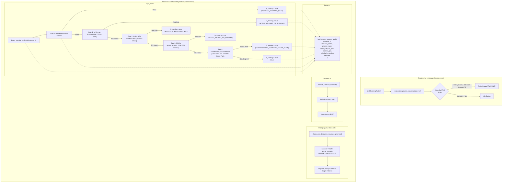

# Component Specification: Cross-Instance Prompt Running Detection & Audit Logging

> **Document:** `02-component-spec.md`  
> **Task ID:** `121-cross-instance-prompt-running-audit-and-fix`  
> **Status:** APPROVED & AUTHORITATIVE  
> **Domain:** Process Liveness, Prompt Execution Scoping, Audit Telemetry & E2E Testing  
> **Author:** Spec Author 02  
> **Date:** October 2026  

---

## 1. Executive Summary & Purpose

This specification governs the component architecture, function contracts, execution gates, telemetry logging, and integration testing for **Task 121: Cross-Instance Prompt Running Audit and Fix**.

### 1.1 Core Objectives
1. **Absolute State Isolation**: Ensure that running prompts in `default` (e.g., `Antigravity-Manager`) never bleed into secondary profiles like `8159` (`default-copy-8159`), and vice-versa (e.g., `coding-guidelines` running on `8159` never bleeds into `default`).
2. **Elimination of Cross-Instance Re-Injection**: Ensure that the background prompt queue scheduler (`check_and_dispatch_enqueued_prompts`) strictly respects instance boundaries and never injects prompts into an unintended instance sharing the same repository directory path on disk.
3. **Comprehensive Structured Audit Logging**: Upgrade `log_instance_prompt_audit` with granular contextual metadata: instance ID, resolved name, project name, repo path, DB path evaluated, process PID, criteria evaluated, `is_running`, and explicit rationale.
4. **Deterministic Instance Resolution**: Ensure that `resolve_instance_id` resolves short suffix identifiers (such as `"8159"`, `"-8159"`, or `"inst-8159"`) to the canonical instance ID (`default-copy-8159`).
5. **Rigorous End-to-End Integration Tests**: Provide test fixtures in `src-tauri/tests/` verifying multi-instance isolation across real temporary SQLite databases and mock process states.

---

## 2. Component Architecture & Data Flow



---

## 3. Subsystem Specifications & Contracts

### 3.1 Structured Telemetry: `src-tauri/src/modules/logger.rs`

#### 3.1.1 Function Contract: `log_instance_prompt_audit`
The audit logger must accept full evaluation metadata and format it into a single structured log line suitable for automated log parsing and diagnostics:

```rust
/// Emit structured audit log for instance prompt and project liveness evaluation
pub fn log_instance_prompt_audit(
    instance_id: &str,
    resolved_name: &str,
    project_name: &str,
    repo_path: &str,
    db_path_evaluated: &str,
    process_pid: Option<u32>,
    criteria_evaluated: &str,
    is_running: bool,
    rationale: &str,
) {
    let pid_str = process_pid
        .map(|p| p.to_string())
        .unwrap_or_else(|| "none".to_string());
    
    info!(
        "[InstancePromptAudit] instance_id='{}' resolved_name='{}' project='{}' repo_path='{}' db_path='{}' pid={} criteria='{}' is_running={} rationale='{}'",
        instance_id,
        resolved_name,
        project_name,
        repo_path,
        db_path_evaluated,
        pid_str,
        criteria_evaluated,
        is_running,
        rationale
    );
}
```

#### 3.1.2 Standard Rationale Identifiers
To prevent freeform or ambiguous status strings, every evaluation must choose from standard rationale codes:
- `INSTANCE_PROCESS_DEAD`: The instance OS process is not alive; all prompts and projects forced to idle.
- `ACTIVE_PROMPT_MEMORY`: In-memory active prompts map holds a fresh (`<= 300s`) entry with status `running`.
- `ACTIVE_WORKER_MATCHED`: Active AGY background worker process confirmed alive with PID check and instance prefix.
- `ACTIVE_PROMPT_DB_RUNNING`: Local `active_prompts` table contains fresh record with status `running`.
- `CONVERSATION_SUMMARY_ACTIVE_TURN`: Live turn confirmed in `conversation_summaries.db` (`not_fully_idle > 0` AND status `RUNNING`, within 900s TTL).
- `IDLE_STALE_TTL_EXPIRED`: Historical record found in database, but turn timestamp exceeds the 900s TTL.
- `IDLE_NOT_FULLY_IDLE_ZERO`: Turn record exists, but `not_fully_idle == 0` (idle supremacy rule).
- `IDLE_NO_ACTIVE_TASKS`: Process alive, zero in-flight tasks or active turns found.

---

### 3.2 Database & Liveness Core: `src-tauri/src/modules/repo_db.rs`

#### 3.2.1 `detect_running_projects`
- **Primary Key Invariant**:
  ```rust
  let project_id = format!(
      "{}:{}-{}",
      target_id,
      repo_name.to_lowercase(),
      entry.file_name().to_string_lossy()
  );
  ```
  Primary key collision is mathematically impossible because each key is strictly scoped by `target_id`.
- **Instance Process Gating**:
  Before scanning filesystem workspaces, determine host process liveness. If no active PIDs exist for `target_id`, `is_instance_active` evaluates to `false`, and every discovered workspace is evaluated with `is_running: false`.
- **Audit Logging**: Emits `log_instance_prompt_audit` for every project evaluated.

#### 3.2.2 `is_prompt_running_for_project`
Must evaluate through 5 strictly sequenced gates:

1. **Gate 0: Host Process Liveness Gate**:
   - For `default`: `process::is_antigravity_running(None)`.
   - For cloned instances: Look up instance config via `instance::load_registry()`, resolve instance ID via `resolve_instance_id(norm_inst)`, and verify `instance::is_instance_running(&inst.id, &inst.data_dir, inst.pid)`.
   - If `has_active_process == false`, immediately emit audit log with `rationale = "INSTANCE_PROCESS_DEAD"` and return `false`.

2. **Gate 1: In-Memory Active Prompts Map**:
   - Matches instance:
     - If `norm_inst == "default"`: `p.instance_id == "default" || p.instance_id == "__default__" || p.instance_id.is_empty()`.
     - If cloned instance: `p.instance_id == norm_inst`.
   - Matches project: `p.project_id == project_id || p.repo_path == project_id`.
   - Freshness & Status: `p.status == "running" && p.updated_at >= now - 300`.
   - Returns `true` immediately upon match.

3. **Gate 2: Active AGY Workers Map Isolation**:
   - Workers map stores `key: format!("{}:{}", instance_id, repo_path)`.
   - Key matching rule:
     ```rust
     if let Some((worker_inst, worker_path)) = key.split_once(':') {
         let is_inst_match = norm_inst == "all"
             || worker_inst.eq_ignore_ascii_case(norm_inst)
             || (norm_inst == "default" && worker_inst.is_empty());
         let clean_worker_path = normalize_path_for_compare(worker_path);
         let is_path_match = clean_worker_path == clean_target;
         if is_inst_match && is_path_match {
             // Confirm OS process liveness for PID
             if is_process_alive(pid) {
                 return true;
             }
         }
     }
     ```
   - Zero loose substring matching.

4. **Gate 3: SQLite `active_prompts` Table Scoping**:
   - Query:
     ```sql
     SELECT COUNT(*) FROM active_prompts 
     WHERE (project_id = ?1 OR repo_path = ?1) 
       AND (?2 = 'all' OR instance_id = ?2 OR (?2 = 'default' AND (instance_id = 'default' OR instance_id = '__default__' OR instance_id IS NULL OR instance_id = '')))
       AND status = 'running'
       AND updated_at >= ?3
     ```
   - Parameter `?3 = now - 300` (5-minute TTL).

5. **Gate 4: Per-Instance `conversation_summaries.db` Scan**:
   - Target database retrieved exclusively via `gemini_dirs_for_instance(norm_inst)`.
   - Query:
     ```sql
     SELECT status, not_fully_idle, workspace_uris, last_modified_time 
     FROM conversation_summaries 
     ORDER BY last_modified_time DESC 
     LIMIT 30
     ```
   - **Enforce 15-Minute TTL (900 seconds)**:
     ```rust
     let is_recent = chrono::DateTime::parse_from_rfc3339(&last_time_str)
         .map(|dt| dt.timestamp() >= now - 900)
         .unwrap_or(false);
     if !is_recent {
         continue; // Discard historical turn from dead/crashed sessions
     }
     ```
   - **Strict Idle Supremacy & AND Conjunction**:
     ```rust
     let is_idle_count = not_fully_idle == 0;
     let has_idle_status = status.contains("IDLE")
         || status.contains("COMPLETED")
         || status.contains("FAILED")
         || status.contains("CANCELLED");
     let is_explicit_idle = is_idle_count || has_idle_status;

     let is_conv_running = if is_explicit_idle {
         false
     } else {
         not_fully_idle > 0 && status.contains("RUNNING")
     };
     ```
   - **Strict Normalized Path Equality**:
     ```rust
     let clean_p = normalize_path_for_compare(&decode_uri_to_path(&u));
     let has_target = !clean_target.is_empty();
     let is_target_matched = has_target && (clean_p == clean_target);
     ```

#### 3.2.3 Prompt Queue Dispatcher: `check_and_dispatch_enqueued_prompts`
- **Instance Scoping Invariant**:
  When picking the next enqueued prompt for a project, the query MUST filter by `instance_id`:
  ```rust
  let prompt_opt: Option<ActivePrompt> = conn
      .query_row(
          "SELECT id, project_id, instance_id, repo_path, prompt_content, model, session_id, status, created_at, updated_at, image_payload
           FROM active_prompts
           WHERE (project_id = ?1 OR repo_path = ?2)
             AND (instance_id = ?3 OR (?3 = 'default' AND (instance_id = '__default__' OR instance_id IS NULL OR instance_id = '')))
             AND status IN ('backed_up', 'queued', 'pending')
           ORDER BY created_at ASC
           LIMIT 1",
          params![&project_id, &repo_path, &inst_id],
          |row| { ... },
      )
      .optional()?;
  ```
  This guarantees that enqueued prompts are never re-injected into foreign instances sharing the same directory path on disk.

#### 3.2.4 Project Conversation Tree Scoping
- In `compute_project_conversation_tree`, deduplication sets must use composite tuples `(instance_id, cid)` to prevent cloned conversation IDs from masking secondary profiles.
- In `get_project_conversation_tree_cached`, cache keys are partitioned as `tree:{inst_key}:{max_words}:{only_running}`.

---

### 3.3 Instance Alias Resolution: `src-tauri/src/modules/instance.rs`

#### 3.3.1 `resolve_instance_id` Function Contract
The function resolves any valid query specifier to the concrete internal `instance_id`:
1. **Empty or `"active"`**: Returns active instance ID.
2. **`"default"`**: Returns `"default"`.
3. **Exact ID or Name**: Case-insensitive match on `inst.id` or `inst.name`.
4. **Clean Sequential Number**: Matches `inst.seq_num == Some(num)` for inputs like `"1"`, `"ins-1"`, `"instance-1"`, `"#1"`.
5. **Suffix Matching**:
   ```rust
   let suffix_matches: Vec<&InstanceConfig> = registry
       .instances
       .iter()
       .filter(|i| {
           i.id.eq_ignore_ascii_case(clean)
               || i.id.ends_with(&format!("-{}", clean))
               || i.id.ends_with(clean)
               || i.name.ends_with(&format!("-{}", clean))
               || i.name.ends_with(clean)
       })
       .collect();

   if suffix_matches.len() == 1 {
       return Ok(suffix_matches[0].id.clone());
   } else if suffix_matches.len() > 1 {
       if let Some(hyphen_match) = suffix_matches.iter().find(|i| i.id.ends_with(&format!("-{}", clean))) {
           return Ok(hyphen_match.id.clone());
       }
       return Ok(suffix_matches[0].id.clone());
   }
   ```

---

### 3.4 Frontend Dashboard: `src/pages/Instances.tsx`

1. **Card Pulse Indicator (`hasActiveTask`)**:
   ```typescript
   const hasActiveTask = Boolean(inst.is_running) && runningTreeNodes.some((node) => {
       const isInstanceMatch = inst.config.is_default
           ? (node.instance_id === 'default' || node.instance_id === '__default__' || !node.instance_id || node.instance_id === inst.config.id)
           : node.instance_id === inst.config.id;
       const isNodeRunning = Boolean(node.is_running) || Boolean(node.conversations?.some((c) => Boolean(c.is_running)));
       return isInstanceMatch && isNodeRunning;
   });
   ```
   - Must be gated by `Boolean(inst.is_running)`.
   - Secondary instance matching strictly uses `node.instance_id === inst.config.id`.

2. **Project Badge (`isProjRunning`)**:
   ```typescript
   const isProjRunning =
       Boolean(inst.is_running) &&
       (Boolean(proj.is_running) ||
           Boolean(proj.conversations?.some((c) => Boolean(c.is_running))));
   ```
   - Raw string checks like `c.status === 'RUNNING'` are strictly forbidden.

---

## 4. End-to-End Integration Test Suite

### 4.1 Test Harness: `src-tauri/tests/per_instance_prompt_liveness_test.rs`
The test harness provisions a temporary filesystem structure simulating multi-instance storage and real SQLite conversation summaries:

```
sandbox_root/
├── default/
│   ├── User/workspaceStorage/
│   │   ├── ws_am/workspace.json  --> path: /work/Antigravity-Manager
│   │   ├── ws_sb/workspace.json  --> path: /work/SpecBuilder
│   │   └── ws_cg/workspace.json  --> path: /work/coding-guidelines
│   └── .gemini/antigravity/
│       └── conversation_summaries.db
│           ├── AM: status=RUNNING, not_fully_idle=1, last_time=NOW-10s  [ACTIVE]
│           ├── SB: status=RUNNING, not_fully_idle=0, last_time=NOW-10s  [IDLE]
│           └── CG: status=IDLE,    not_fully_idle=0, last_time=NOW-100s [IDLE]
└── default-copy-8159/
    ├── User/workspaceStorage/
    │   ├── ws_am/workspace.json  --> path: /work/Antigravity-Manager
    │   ├── ws_sb/workspace.json  --> path: /work/SpecBuilder
    │   └── ws_cg/workspace.json  --> path: /work/coding-guidelines
    └── .gemini/antigravity/
        └── conversation_summaries.db
            ├── CG: status=RUNNING, not_fully_idle=1, last_time=NOW-10s  [ACTIVE]
            ├── AM: status=RUNNING, not_fully_idle=0, last_time=NOW-10s  [IDLE]
            └── SB: status=IDLE,    not_fully_idle=0, last_time=NOW-100s [IDLE]
```

### 4.2 Test Scenarios & Assertions

#### Test Case 1: Default Profile Running Antigravity-Manager Only
- **Context**: `default` OS process alive (`is_alive = true`).
- **Assertions**:
  - `is_prompt_running_for_project("/work/Antigravity-Manager", "default") == true`
  - `is_prompt_running_for_project("/work/SpecBuilder", "default") == false`
  - `is_prompt_running_for_project("/work/coding-guidelines", "default") == false`
  - Total active running projects on `default`: strictly `1`.

#### Test Case 2: Instance 8159 Running coding-guidelines Only
- **Context**: `default-copy-8159` OS process alive (`is_alive = true`).
- **Assertions**:
  - `is_prompt_running_for_project("/work/coding-guidelines", "default-copy-8159") == true`
  - `is_prompt_running_for_project("/work/Antigravity-Manager", "default-copy-8159") == false` (Zero bleed from Default!)
  - `is_prompt_running_for_project("/work/SpecBuilder", "default-copy-8159") == false`
  - Total active running projects on `8159`: strictly `1`.

#### Test Case 3: Stopped Instance Process Gating (`INSTANCE_PROCESS_DEAD`)
- **Context**: Instance OS process dead (`is_alive = false`), but database contains status `"RUNNING"`, `not_fully_idle = 1`.
- **Assertions**:
  - `is_prompt_running_for_project("/work/Antigravity-Manager", "default") == false`
  - All projects evaluate to `is_running = false`.
  - Audit rationale equals `"INSTANCE_PROCESS_DEAD"`.

#### Test Case 4: Suffix Matching Resolution for `8159`
- **Context**: Registry contains instance with `id: "default-copy-8159"`, `seq_num: 2`.
- **Assertions**:
  - `resolve_instance_id("8159") == Ok("default-copy-8159")`
  - `resolve_instance_id("-8159") == Ok("default-copy-8159")`
  - `resolve_instance_id("inst-8159") == Ok("default-copy-8159")`

#### Test Case 5: Prompt Queue Dispatch Isolation
- **Context**: Queue contains prompt with `instance_id = "default-copy-8159"`, `repo_path = "/work/coding-guidelines"`.
- **Execution**: Run `check_and_dispatch_enqueued_prompts(Some("default"))`.
- **Assertions**:
  - Dispatched count for `default` is `0`.
  - Prompt remains queued and untouched until `check_and_dispatch_enqueued_prompts(Some("default-copy-8159"))` executes.

---

## 5. Verification Matrix

| Area | File | Verified Requirement | Gate / Test |
|---|---|---|---|
| Telemetry | `src-tauri/src/modules/logger.rs` | Upgraded `log_instance_prompt_audit` with 9 parameters | `cargo clippy` & Log output |
| Backend | `src-tauri/src/modules/repo_db.rs` | Project ID prefixed with `target_id` | Unit test |
| Backend | `src-tauri/src/modules/repo_db.rs` | Strict path equality and 15-min TTL in Gate 4 | Unit & E2E tests |
| Backend | `src-tauri/src/modules/repo_db.rs` | Queue dispatch filtered by `instance_id` | Integration test |
| Backend | `src-tauri/src/modules/instance.rs` | Suffix resolution for `"8159"` | Unit test |
| Frontend | `src/pages/Instances.tsx` | Strict boolean `is_running` badge gating | `npm run build` |
| E2E | `src-tauri/tests/per_instance_prompt_liveness_test.rs` | 5 isolation test cases pass | `cargo test --test per_instance_prompt_liveness_test` |
