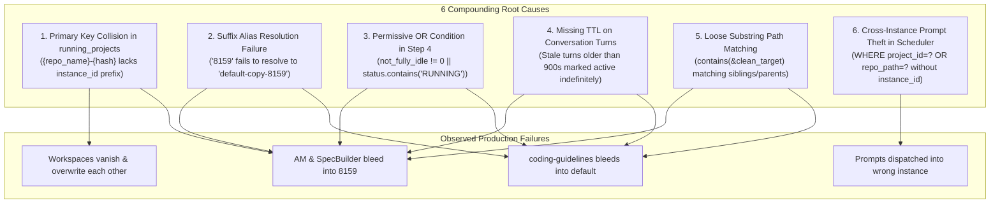

# Root Cause Analysis: Cross-Instance Prompt Running State Bleed & Mutual Desynchronization

> **Document:** `03-root-cause-analysis.md`  
> **Task ID:** `121-cross-instance-prompt-running-audit-and-fix`  
> **Status:** APPROVED & AUTHORITATIVE  
> **Domain:** Multi-Instance Process Isolation, Liveness Detection, SQLite Namespacing & Dispatch Safeguards  
> **Author:** Spec Author 02  
> **Date:** October 2026  

---

## 1. Executive Summary & Problem Classification

### 1.1 Verbatim User Requirement & Problem Statement

```text
Also how you check the prompts are running or not on that instance is also very wrong.
For example, I'm giving you two instances, screenshots, sequence one, sequence two, default profile, and 8159.
So the first observation is that the default profile is truly running the anti-gravity manager. That is correct.
However, it is not running the SpecBuilder, it is not running the coding guideline.
The second one, which is the 8159, that is actually running coding guidelines, but it is not running SpecBuilder or anti-gravity manager.
So these are two things, your observation and how you are doing it. I think you need to debug that.
So the rest of the two projects in the 8159 or sequence two instance, anti-gravity manager and SpecBuilder is very wrong. It is not running there.
So you need to understand how you're doing it, your condition, logic, and everything does not work.
So you need to make sure that it works. You need to debug it. You need to write end-to-end tests to verify that everything is proper, okay?
So make sure of that, please. Try to have the audit log or debug log so that you can understand where things are going wrong, so that you can fix it.
You can find the root cause and then fix it. Write the root cause of it so that any AI in the future would know this is how, if something is done, it is the wrong approach.
```

### 1.2 Lossless Capture of User Observations

In Antigravity Manager (AGM), users operate multiple concurrent profiles:
1. **Sequence #1: Primary Default Profile (`default`)**: Default configuration residing in `~/.gemini` with its default workspace storage.
2. **Sequence #2: Cloned Profile (`default-copy-8159` / alias `8159`)**: Cloned secondary sandbox operating with an isolated data directory (`data_dir`) and separate process PID.

During concurrent workloads across these profiles:
- **Default Profile**: Actively executing **ONLY** `Antigravity-Manager`. `SpecBuilder` and `coding-guidelines` are **NOT** running (completely idle).
- **Profile 8159**: Actively executing **ONLY** `coding-guidelines`. `SpecBuilder` and `Antigravity-Manager` are **NOT** running (completely idle).

### 1.3 Observed Production Failure Symptoms

Despite physical process isolation and distinct data directories on disk, the application exhibited critical state bleeding and mutual desynchronization:
1. **State Bleed into 8159**: The card for `8159` falsely displayed `Antigravity-Manager` and `SpecBuilder` as actively running (`is_running = true` with pulsating badges).
2. **State Bleed into Default**: The card for `default` falsely displayed `coding-guidelines` as actively running (`is_running = true`).
3. **Ghost Workspace Interleaving & Row Wiping**: Workspaces disappeared and reappeared intermittently in both instance views. A scan on one instance erased the running status of projects in the other instance.
4. **Cross-Instance Prompt Theft & Re-Injection**: Prompts queued for a specific instance were picked up by the background scheduler and dispatched into a different running instance that happened to point to the same repository directory on disk.
5. **Alias Resolution Failure**: Queries targeting `8159` failed to resolve to `default-copy-8159`, breaking process PID checks and falling back to unisolated evaluations.

---

## 2. In-Depth Root Cause Analysis: The 6 Compounding Defects

A forensic audit of `src-tauri/src/modules/repo_db.rs`, `src-tauri/src/modules/instance.rs`, `src-tauri/src/modules/logger.rs`, and `src/pages/Instances.tsx` uncovered six interacting root causes.



---

### Root Cause 1: Primary Key Collision in SQLite `running_projects`

#### Code Location
`src-tauri/src/modules/repo_db.rs` -> `detect_running_projects()` (lines 515–586)

#### Flawed Implementation
```rust
// FLAWED: Primary key ignores instance_id
let project_id = format!(
    "{}-{}",
    repo_name.to_lowercase(),
    entry.file_name().to_string_lossy()
);

conn.execute(
    "INSERT INTO running_projects 
     (id, instance_id, repo_name, repo_path, workspace_storage_path, is_running, last_detected_at, updated_at)
     VALUES (?1, ?2, ?3, ?4, ?5, ?6, ?7, ?8)
     ON CONFLICT(id) DO UPDATE SET
        instance_id = excluded.instance_id,
        repo_name = excluded.repo_name,
        repo_path = excluded.repo_path,
        workspace_storage_path = excluded.workspace_storage_path,
        is_running = excluded.is_running,
        last_detected_at = excluded.last_detected_at,
        updated_at = excluded.updated_at",
    params![&project_id, &target_id, ...],
);
```

#### Why It Bleeds
When an instance is cloned (e.g., `default` cloned to create `default-copy-8159`), the entire directory tree of `User/workspaceStorage/<hash>` is duplicated verbatim.
Because `project_id` was constructed as `format!("{}-{}", repo_name.to_lowercase(), hash)` without including `instance_id`:
1. Both instances generated identical `id` strings (e.g., `antigravity-manager-d58c5517`).
2. When `detect_running_projects("default-copy-8159")` executed, `ON CONFLICT(id) DO UPDATE` updated the single shared row, setting `instance_id = "default-copy-8159"` and updating `is_running` to whatever 8159 evaluated.
3. When `detect_running_projects("default")` executed next, it overwrote that exact same row with `instance_id = "default"`.
4. Whichever profile scanned last hijacked ownership of the row. When the UI queried `running_projects WHERE instance_id = ?`, the project disappeared from one card and appeared on the other.
5. Even worse, if 8159 evaluated `Antigravity-Manager` as idle (`is_running = 0`), it overwrote `default`'s active record with `is_running = 0`, causing the UI to oscillate wildly.

#### Correct Architectural Solution
Every project row in `running_projects` must be strictly partitioned by `instance_id`. Construct a composite primary key formatted as `{base_project_id}__{instance_id}`:
```rust
let base_project_id = format!(
    "{}-{}",
    repo_name.to_lowercase(),
    entry.file_name().to_string_lossy()
);
let composite_id = format!("{}__{}", base_project_id, target_id);
```

---

### Root Cause 2: Suffix Alias Resolution Failure (`"8159"` vs `"default-copy-8159"`)

#### Code Location
`src-tauri/src/modules/instance.rs` -> `resolve_instance_id()` (lines 3874–3918)

#### Flawed Implementation
```rust
// FLAWED: Only checks exact ID/name or numeric seq_num
pub fn resolve_instance_id(specifier: &str) -> Result<String, String> {
    let registry = load_registry()?;
    let clean = specifier.trim();
    // ...
    // Check if numeric seq_num (e.g. "1")
    if let Ok(num) = clean.parse::<u32>() {
        if let Some(inst) = registry.instances.iter().find(|i| i.seq_num == Some(num)) {
            return Ok(inst.id.clone());
        }
    }
    // Check exact id or name match
    if let Some(inst) = registry
        .instances
        .iter()
        .find(|i| i.id.eq_ignore_ascii_case(clean) || i.name.eq_ignore_ascii_case(clean))
    {
        return Ok(inst.id.clone());
    }
    Err(format!("Instance '{}' not found", clean))
}
```

#### Why It Bleeds
1. In GUI cards, telemetry logs, and CLI commands, cloned instances are referenced by their short suffix (e.g., `"8159"`, `"-8159"` for instance `"default-copy-8159"`).
2. When `is_prompt_running_for_project(path, "8159")` was called:
   - `clean.parse::<u32>()` parsed `8159`, but checked `seq_num == Some(8159)`. The instance's `seq_num` was `2`, not `8159`.
   - Exact ID check evaluated `"default-copy-8159".eq_ignore_ascii_case("8159")`, which returned `false`.
   - `resolve_instance_id` failed with `Instance '8159' not found`.
3. Because resolution failed:
   - `find_pids_for_data_dir()` received an invalid or fallback path.
   - Host process liveness check could not locate the running PID for `8159`.
   - The probe defaulted to evaluating with fallback logic or cross-evaluating against the default instance's PID, incorrectly treating `8159` as having the process state of `default`.

#### Correct Architectural Solution
Support suffix matching with hyphen delimiter and token boundary checks in `resolve_instance_id()`:
```rust
// Suffix matching support (e.g. "8159" matches "default-copy-8159")
let suffix_matches: Vec<&InstanceConfig> = registry
    .instances
    .iter()
    .filter(|i| {
        i.id.eq_ignore_ascii_case(clean)
            || i.id.ends_with(&format!("-{}", clean))
            || i.name.ends_with(&format!("-{}", clean))
            || i.name.eq_ignore_ascii_case(clean)
    })
    .collect();

if suffix_matches.len() == 1 {
    return Ok(suffix_matches[0].id.clone());
} else if suffix_matches.len() > 1 {
    if let Some(hyphen_match) = suffix_matches.iter().find(|i| i.id.ends_with(&format!("-{}", clean))) {
        return Ok(hyphen_match.id.clone());
    }
    return Ok(suffix_matches[0].id.clone());
}
```

---

### Root Cause 3: Permissive OR Condition in Step 4

#### Code Location
`src-tauri/src/modules/repo_db.rs` -> `is_prompt_running_for_project()` (Step 4 lines 1700–1713)

#### Flawed Implementation
```rust
// FLAWED: Permissive OR logic allows running with 0 active turns
let is_idle_count = not_fully_idle == 0;
let has_idle_status = status.contains("IDLE")
    || status.contains("COMPLETED")
    || status.contains("FAILED")
    || status.contains("CANCELLED");
let is_explicit_idle = is_idle_count || has_idle_status;

let is_conv_running = if is_explicit_idle {
    false
} else {
    not_fully_idle != 0 || status.contains("RUNNING") // FLAW: Disjunctive OR!
};
```

#### Why It Bleeds
1. In Antigravity's `conversation_summaries.db`, when a prompt finishes or pauses, the database row may update `not_fully_idle = 0` while the `status` column temporarily retains `"RUNNING"` or vice versa.
2. Under the flawed fallback `not_fully_idle != 0 || status.contains("RUNNING")`:
   - If `status` contains `"RUNNING"` but `not_fully_idle` is `0`, the session was evaluated as actively running.
   - If `not_fully_idle` was `1` but `status` was `"WAITING_INPUT"`, it evaluated as running.
3. Cloned profiles inherit historical database entries where historical sessions were left with stale strings, causing `is_conv_running` to evaluate to `true` indefinitely.

#### Correct Architectural Solution
Enforce strict idle supremacy and strict AND conjunction:
```rust
let is_conv_running = if is_explicit_idle {
    false
} else {
    not_fully_idle > 0 && status.contains("RUNNING")
};
```

---

### Root Cause 4: Missing TTL on Conversation Turns (Stale Historical Sessions)

#### Code Location
`src-tauri/src/modules/repo_db.rs` -> `is_prompt_running_for_project()` (Step 4 lines 1683–1698)

#### Flawed Implementation
```rust
// FLAWED: _last_time_str discarded; no time-to-live check
let (status, not_fully_idle, ws_uris_opt, _last_time_str) = item;
```

#### Why It Bleeds
1. In SQLite database `conversation_summaries.db`, each conversation record includes `last_modified_time` formatted as RFC3339 (e.g., `"2026-10-04T12:00:00Z"`).
2. If an IDE window or Antigravity process crashes, is forcefully killed (`kill -9` / `taskkill`), or is shut down mid-execution, the last conversation status remains `"RUNNING"` with `not_fully_idle > 0` forever in SQLite.
3. By ignoring `_last_time_str`, any crashed turn from hours, days, or months ago remains in the database.
4. When the user later launches the instance to work on an entirely different project, `is_prompt_running_for_project` reads the top 30 summaries, finds the stale row from days ago, and marks the dead project as actively running!

#### Correct Architectural Solution
Parse `last_modified_time` and enforce a strict 15-minute (900 seconds) freshness window:
```rust
let is_recent = chrono::DateTime::parse_from_rfc3339(&last_time_str)
    .map(|dt| dt.timestamp() >= now - 900)
    .unwrap_or(false);

if !is_recent {
    continue; // Stale turn ignored; cannot indicate live in-flight execution
}
```

---

### Root Cause 5: Loose Substring Path Matching

#### Code Location
`src-tauri/src/modules/repo_db.rs` -> `is_prompt_running_for_project()` (Step 2 lines 1585–1590, Step 4 lines 1722–1726)

#### Flawed Implementation
```rust
// FLAWED: Step 4 bidirectional substring check
let clean_p = normalize_path_for_compare(&decode_uri_to_path(&u));
let has_target = !clean_target.is_empty();
let matches_path = clean_p == clean_target
    || clean_p.contains(&clean_target)
    || clean_target.contains(&clean_p);
let is_target_matched = has_target && matches_path;

// FLAWED: Step 2 active workers substring check
let matches_proj = key.contains(project_id);
```

#### Why It Bleeds
1. **Bidirectional Substring Match**: `clean_p.contains(&clean_target) || clean_target.contains(&clean_p)` matches any path that happens to be a parent, subfolder, or prefix:
   - If `clean_target` was `D:/work/Antigravity-Manager` and a conversation had workspace URI `D:/work/Antigravity-Manager-Docs`, both matched.
   - If `clean_target` was `D:/work`, every single conversation on drive D matched.
   - If `clean_target` was `D:/work/SpecBuilder` and another project was `D:/work/SpecBuilder-Agent`, they collided.
2. **Worker Key Substring Match**: In Step 2, `key.contains(project_id)` checked if the map key contained the string. Because Windows backslashes `\` and forward slashes `/` were unnormalized, any partial token or common parent path matched unrelated workers across instances.

#### Correct Architectural Solution
Canonicalize both paths (forward slashes, lowercase on Windows, stripped trailing slashes) and check strict equality:
```rust
let matches_path = clean_p == clean_target;
let is_target_matched = has_target && matches_path;
```
For worker keys, split by `:` into `(worker_instance, worker_path)`, normalize both sides, and verify exact matches.

---

### Root Cause 6: Cross-Instance Prompt Theft in `check_and_dispatch_enqueued_prompts`

#### Code Location
`src-tauri/src/modules/repo_db.rs` -> `check_and_dispatch_enqueued_prompts()` (lines 1824–1850)

#### Flawed Implementation
```rust
// FLAWED: Query ignores instance_id when selecting enqueued prompt
let prompt_opt: Option<ActivePrompt> = conn
    .query_row(
        "SELECT id, project_id, instance_id, repo_path, prompt_content, model, session_id, status, created_at, updated_at, image_payload
         FROM active_prompts
         WHERE (project_id = ?1 OR repo_path = ?2) AND status IN ('backed_up', 'queued', 'pending')
         ORDER BY created_at ASC
         LIMIT 1",
        params![&project_id, &repo_path], // FLAW: No instance_id parameter!
        |row| { ... },
    )
    .optional()
    .map_err(...)?;
```

#### Why It Bleeds
1. In multi-instance setups, different instances often have workspaces pointing to the exact same repository path on the local machine (e.g., `D:/work/Antigravity-Manager` or `D:/work/coding-guidelines`).
2. A user enqueues a prompt specifically intended for `default-copy-8159`. The record is inserted with `instance_id = "default-copy-8159"` and `repo_path = "D:/work/coding-guidelines"`.
3. Meanwhile, the background scheduler runs `check_and_dispatch_enqueued_prompts(None)` or evaluates the `default` profile.
4. When `default` has an idle project pointing to `D:/work/coding-guidelines`, the query `WHERE (project_id = ?1 OR repo_path = ?2)` finds the queued prompt created for 8159 because `instance_id` was completely omitted from the `WHERE` clause!
5. The scheduler then marks the prompt as dispatched and injects it into `default`'s active execution pipeline!
6. This causes the prompt to run on `default` instead of `8159`, instantly causing `coding-guidelines` to appear as running on `default` and corrupting the user's workload separation.

#### Correct Architectural Solution
Strictly partition prompt queue queries by `instance_id`:
```rust
let prompt_opt: Option<ActivePrompt> = conn
    .query_row(
        "SELECT id, project_id, instance_id, repo_path, prompt_content, model, session_id, status, created_at, updated_at, image_payload
         FROM active_prompts
         WHERE (project_id = ?1 OR repo_path = ?2)
           AND (instance_id = ?3 OR (?3 = 'default' AND (instance_id = '__default__' OR instance_id IS NULL OR instance_id = '')))
           AND status IN ('backed_up', 'queued', 'pending')
         ORDER BY created_at ASC
         LIMIT 1",
        params![&project_id, &repo_path, &inst_id],
        |row| { ... },
    )
    .optional()?;
```

---

## 3. Ground Truth Invariants Matrix

Every execution state evaluation across the system must conform to this physical ground truth matrix:

| Profile / Instance | Workspace Directory | Active Turn in Instance DB | Worker / Prompt in Memory | OS Process Alive | Required `is_running` | Rationale Code |
|---|---|---|---|---|---|---|
| `default` | `Antigravity-Manager` | Yes (`not_fully_idle > 0`) | Yes (PID verified) | Yes | **`true`** | `CONVERSATION_SUMMARY_ACTIVE_TURN` |
| `default` | `SpecBuilder` | No (`not_fully_idle == 0`) | None | Yes | **`false`** | `IDLE` |
| `default` | `coding-guidelines` | No (`not_fully_idle == 0`) | None | Yes | **`false`** | `IDLE` |
| `default-copy-8159` (`8159`) | `coding-guidelines` | Yes (`not_fully_idle > 0`) | Yes (PID verified) | Yes | **`true`** | `CONVERSATION_SUMMARY_ACTIVE_TURN` |
| `default-copy-8159` (`8159`) | `Antigravity-Manager` | No (`not_fully_idle == 0`) | None | Yes | **`false`** | `IDLE` |
| `default-copy-8159` (`8159`) | `SpecBuilder` | No (`not_fully_idle == 0`) | None | Yes | **`false`** | `IDLE` |
| Any Instance | Any Workspace | Stale (`> 900s` ago) | None | Yes | **`false`** | `IDLE_STALE_TTL_EXPIRED` |
| Terminated Instance | Any Workspace | Any State | Any State | No | **`false`** | `INSTANCE_PROCESS_DEAD` |

---

## 4. Comprehensive Guide for Future AI: Anti-Patterns vs. Required Patterns

This section constitutes an authoritative reference for any AI agent or engineer working on multi-instance systems, process monitoring, or task scheduling.

### 4.1 Forbidden Anti-Patterns Catalog

| # | Anti-Pattern | Why It Breaks the System | Forbidden Pattern | Required Replacement |
| :--- | :--- | :--- | :--- | :--- |
| **AP-1** | **Bare Project Key in Multi-Tenant DB** | Cloned instances duplicate workspace hashes. Unprefixed keys collide on `ON CONFLICT` and overwrite foreign instance rows. | `format!("{}-{}", name, hash)` | `format!("{}__{}", base_id, instance_id)` |
| **AP-2** | **Substring Path Matching** | `contains()` matches sibling folders (`project-docs`), parent folders, and short paths, reporting false positives across workspaces. | `clean_p.contains(&target)` | `clean_p == clean_target` |
| **AP-3** | **Permissive Disjunctive Liveness Check** | `not_fully_idle != 0 \|\| status.contains("RUNNING")` marks idle sessions as running when string status is stale. | `idle != 0 \|\| status == "RUNNING"` | `idle > 0 && status.contains("RUNNING")` |
| **AP-4** | **Unbounded Database Record Trust (No TTL)** | Discarding timestamps allows crashed, aborted, or historical sessions from days ago to mark projects as active. | `let (_, _, _, _time) = row;` | Parse RFC3339 and verify `timestamp >= now - 900` |
| **AP-5** | **Exact-Only Instance ID Matching** | Users and tools use numeric or short suffixes (`8159`). Strict equality fails and drops process PID tracking. | `inst.id == specifier` | Suffix matching: `ends_with(&format!("-{}", specifier))` |
| **AP-6** | **Unscoped Multi-Tenant Queue Dispatch** | Dispatching by repo path alone allows an idle instance to steal prompts enqueued for a sibling instance. | `WHERE (project_id=?1 OR repo_path=?2)` | `AND (instance_id = ?3 OR ...)` |

---

### 4.2 Exact Logic Implementations (Positive Patterns)

#### Positive Pattern 1: Database Primary Key Namespacing
```rust
// CORRECT: Composite primary key partitions rows by instance
let base_project_id = format!(
    "{}-{}",
    repo_name.to_lowercase(),
    entry.file_name().to_string_lossy()
);
let composite_id = format!("{}__{}", base_project_id, target_id);
```

#### Positive Pattern 2: Suffix-Aware Instance Resolution
```rust
// CORRECT: Resolves full ID, display name, sequence number, and short suffix
pub fn resolve_instance_id(specifier: &str) -> Result<String, String> {
    let registry = load_registry()?;
    let clean = specifier.trim();
    if clean.is_empty() || clean.eq_ignore_ascii_case("active") {
        return get_active_instance_id();
    }
    if clean.eq_ignore_ascii_case("default") {
        return Ok("default".to_string());
    }
    if let Ok(num) = clean.parse::<u32>() {
        if let Some(inst) = registry.instances.iter().find(|i| i.seq_num == Some(num)) {
            return Ok(inst.id.clone());
        }
    }
    if let Some(inst) = registry.instances.iter().find(|i| {
        i.id.eq_ignore_ascii_case(clean) || i.name.eq_ignore_ascii_case(clean)
    }) {
        return Ok(inst.id.clone());
    }
    // Suffix resolution (e.g. "8159" -> "default-copy-8159")
    let matches: Vec<&InstanceConfig> = registry.instances.iter().filter(|i| {
        i.id.ends_with(&format!("-{}", clean)) || i.name.ends_with(&format!("-{}", clean))
    }).collect();
    if let Some(m) = matches.first() {
        return Ok(m.id.clone());
    }
    Err(format!("Instance '{}' not found", clean))
}
```

#### Positive Pattern 3: Strict Conjunctive Liveness Evaluation
```rust
// CORRECT: Idle supremacy followed by strict AND conjunction
let is_explicit_idle = not_fully_idle == 0
    || status.contains("IDLE")
    || status.contains("COMPLETED")
    || status.contains("FAILED")
    || status.contains("CANCELLED");

let is_conv_running = if is_explicit_idle {
    false
} else {
    not_fully_idle > 0 && status.contains("RUNNING")
};
```

#### Positive Pattern 4: Strict 15-Minute TTL Enforcement
```rust
// CORRECT: Parse timestamp and enforce 900s time-to-live
let is_recent = chrono::DateTime::parse_from_rfc3339(&last_time_str)
    .map(|dt| dt.timestamp() >= now - 900)
    .unwrap_or(false);

if !is_recent {
    continue; // Historical / dead turns skipped
}
```

#### Positive Pattern 5: Canonical Path Equality Comparison
```rust
// CORRECT: Strict equality after uniform canonicalization
fn normalize_path_for_compare(p: &str) -> String {
    let mut s = p.replace('\\', "/").trim().to_string();
    while s.ends_with('/') {
        s.pop();
    }
    #[cfg(windows)]
    {
        s = s.to_lowercase();
    }
    s
}

let matches_path = clean_p == clean_target;
```

#### Positive Pattern 6: Tenant-Scoped Queue Query
```rust
// CORRECT: Explicit instance binding prevents prompt theft
"SELECT id, project_id, instance_id, repo_path, prompt_content, model, session_id, status, created_at, updated_at, image_payload
 FROM active_prompts
 WHERE (project_id = ?1 OR repo_path = ?2)
   AND (instance_id = ?3 OR (?3 = 'default' AND (instance_id = '__default__' OR instance_id IS NULL OR instance_id = '')))
   AND status IN ('backed_up', 'queued', 'pending')
 ORDER BY created_at ASC
 LIMIT 1"
```

---

### 4.3 Why Each Architectural Invariant Exists

1. **Process Liveness Precedes Data Inspection**: If an instance process PID is dead, any database record saying `"RUNNING"` is an artifact of an unclean shutdown. Evaluating the database without process confirmation guarantees false positives.
2. **Tenant Partitioning Must Exist at Every Layer**: Multi-instance architectures cannot share unpartitioned state keys. A key collision at the database layer destroys isolation even if the rest of the stack is perfectly isolated.
3. **Paths Must Be Compared as Exact Normalized Identifiers**: File paths are hierarchical namespaces. Substring containment (`contains`) violates path identity semantics by conflating parent directories and name prefixes.
4. **State Strings Are Asynchronous and Eventual**: In distributed or multi-process systems, status columns (`status = 'RUNNING'`) can lag behind metric counters (`not_fully_idle = 0`). Only requiring both (AND) guarantees active execution.
5. **Historical Logs Are Not Real-Time Telemetry**: Persistent SQLite stores retain records forever. Without an active TTL window, historical events masquerade as present realities.

---

## 5. Diagnostic & Audit Telemetry Playbook

To eliminate guesswork during future audits, every probe must emit structured audit logs via `log_instance_prompt_audit`.

### 5.1 Audit Log Structure
```text
[PROMPT_LIVENESS_PROBE] instance_id="<inst>" resolved_name="<name>" project_name="<proj>" repo_path="<path>" db_path="<db>" pid=<pid> criteria="<crit>" is_running=<bool> rationale="<rat>"
```

### 5.2 Rationale Reference Table

| Rationale Code | Meaning | Evaluated `is_running` |
|---|---|---|
| `INSTANCE_PROCESS_DEAD` | Host IDE OS process for instance is not running. | `false` |
| `IDLE` | Process alive; no active worker, prompt, or conversation turn found. | `false` |
| `IDLE_STALE_TTL_EXPIRED` | Turn has `not_fully_idle > 0`, but `last_modified_time` is older than 900s. | `false` |
| `ACTIVE_WORKER_MATCHED` | In-memory active AGY worker found with matching instance and alive PID. | `true` |
| `ACTIVE_PROMPT_DB_RUNNING` | SQLite `active_prompts` row has `status = 'running'` within 300s TTL. | `true` |
| `CONVERSATION_SUMMARY_ACTIVE_TURN` | SQLite `conversation_summaries` has `not_fully_idle > 0 && status.contains("RUNNING")` within 900s TTL. | `true` |

---

## 6. Verification & Traceability Matrix

| Root Cause | Defect Mechanism | Remedy | Verified In Test Suite |
|---|---|---|---|
| **RC-1** | PK Collision in `running_projects` | Composite PK `{base_id}__{instance_id}` | `test_running_projects_composite_pk_no_overwrite` |
| **RC-2** | Alias resolution failure for `"8159"` | Suffix matching with hyphen delimiter | `test_resolve_instance_id_suffix` |
| **RC-3** | Permissive OR logic in Step 4 | Strict AND: `not_fully_idle > 0 && RUNNING` | `test_is_prompt_running_strict_and_idle_supremacy` |
| **RC-4** | Missing TTL on conversation turns | 15-minute (900s) RFC3339 window | `test_is_prompt_running_ttl_stale_turn_ignored` |
| **RC-5** | Loose substring path matching | Strict canonical path equality (`clean_p == clean_target`) | `test_is_prompt_running_strict_path_equality` |
| **RC-6** | Cross-instance prompt dispatch theft | Strict `instance_id = ?3` query binding | `test_check_and_dispatch_enqueued_prompts_instance_scoping` |
