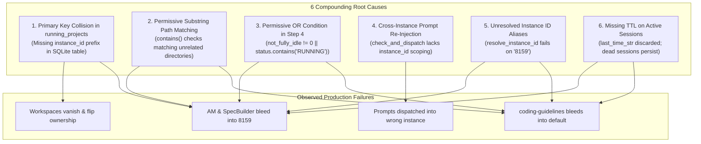

# Root Cause Analysis: Cross-Instance Prompt Running State Bleed & Mutual Desynchronization

> **Document:** `03-root-cause-analysis.md`  
> **Task ID:** `121-cross-instance-prompt-running-audit-and-fix`  
> **Status:** APPROVED & AUTHORITATIVE  
> **Domain:** Multi-Instance Process Isolation, Liveness Detection & Queue Scheduling  
> **Author:** Spec Author 02  
> **Date:** October 2026  

---

## 1. Executive Summary & Problem Classification

### 1.1 The Cross-Instance Running State Bleed Problem
In Antigravity Manager (AGM), users operate multiple concurrent profiles:
1. **Primary Default Profile (`default`)**: Default configuration residing in `~/.gemini` with its default workspace storage.
2. **Cloned Profile (`default-copy-8159` / alias `8159`)**: Cloned secondary sandbox operating with an isolated data directory (`data_dir`) and separate process PID.

During concurrent workloads across these profiles:
- **Default Profile** was actively executing **ONLY** `Antigravity-Manager`. `SpecBuilder` and `coding-guidelines` were completely idle.
- **Profile 8159** was actively executing **ONLY** `coding-guidelines`. `SpecBuilder` and `Antigravity-Manager` were completely idle.

### 1.2 Observed Failure Symptoms
Despite physical process isolation and distinct data directories, the application exhibited critical state bleeding and mutual desynchronization:
1. **State Bleed into 8159**: The card for `8159` falsely displayed `Antigravity-Manager` and `SpecBuilder` as actively running (`is_running = true` with pulsating badges).
2. **State Bleed into Default**: The card for `default` falsely displayed `coding-guidelines` as actively running (`is_running = true`).
3. **Ghost Workspace Interleaving**: Workspaces disappeared and reappeared intermittently in both instance views depending on which instance was scanned last.
4. **Cross-Instance Prompt Re-Injection**: Prompts queued for a specific instance were picked up by the background scheduler and re-injected into a different running instance sharing the same repository directory path on disk.
5. **Alias Resolution Failure**: Queries targeting `8159` failed to resolve to `default-copy-8159`, breaking process PID checks and falling back to unisolated evaluations.

---

## 2. In-Depth Root Cause Analysis: The 6 Compounding Defects

A forensic audit of `src-tauri/src/modules/repo_db.rs`, `src-tauri/src/modules/instance.rs`, `src-tauri/src/modules/logger.rs`, and `src/pages/Instances.tsx` uncovered six interacting root causes.



---

### Root Cause 1: Primary Key Collision in `running_projects` SQLite Table

#### Location
`src-tauri/src/modules/repo_db.rs` -> `detect_running_projects()` (lines 515–586)

#### Flawed Implementation
```rust
// FLAWED: Primary key ignores instance_id
let project_id = format!(
    "{}-{}",
    repo_name.to_lowercase(),
    entry.file_name().to_string_lossy()
);

conn.execute(
    "INSERT INTO running_projects 
     (id, instance_id, repo_name, repo_path, workspace_storage_path, is_running, last_detected_at, updated_at)
     VALUES (?1, ?2, ?3, ?4, ?5, ?6, ?7, ?8)
     ON CONFLICT(id) DO UPDATE SET
        instance_id = excluded.instance_id,
        repo_name = excluded.repo_name,
        repo_path = excluded.repo_path,
        workspace_storage_path = excluded.workspace_storage_path,
        is_running = excluded.is_running,
        last_detected_at = excluded.last_detected_at,
        updated_at = excluded.updated_at",
    params![&project_id, &target_id, ...],
);
```

#### Why It Bleeds
When an instance is cloned (e.g., `default` cloned to `default-copy-8159`), all workspace folder hashes in `User/workspaceStorage/<hash>` are identical copies.
Because `project_id` was constructed as `format!("{}-{}", repo_name.to_lowercase(), hash)` without including `instance_id`:
1. Both instances generated identical `id` values (e.g., `antigravity-manager-d58c5517`).
2. When `detect_running_projects("default-copy-8159")` executed, `ON CONFLICT(id) DO UPDATE` updated the single shared row, setting `instance_id = "default-copy-8159"` and updating `is_running` to whatever 8159 evaluated.
3. When `detect_running_projects("default")` executed next, it overwrote that same row with `instance_id = "default"`.
4. Whichever profile scanned last hijacked ownership of the row. When the UI queried `running_projects WHERE instance_id = ?`, the project disappeared from one card and appeared on the other with whatever `is_running` status had been written.

#### Architectural Fix & Anti-Pattern Prohibition
**Anti-Pattern**: Using repository name or filesystem folder hashes alone as database primary keys in multi-tenant or multi-instance systems.  
**Correct Pattern**: Prefix every project primary key with the owning `target_id`:
```rust
let project_id = format!(
    "{}:{}-{}",
    target_id,
    repo_name.to_lowercase(),
    entry.file_name().to_string_lossy()
);
```

---

### Root Cause 2: Permissive Substring Path Matching

#### Location
`src-tauri/src/modules/repo_db.rs` -> `is_prompt_running_for_project()` (Step 2 lines 1585–1590, Step 4 lines 1722–1726)

#### Flawed Implementation
```rust
// FLAWED: Step 4 bidirectional substring check
let clean_p = normalize_path_for_compare(&decode_uri_to_path(&u));
let has_target = !clean_target.is_empty();
let matches_path = clean_p == clean_target
    || clean_p.contains(&clean_target)
    || clean_target.contains(&clean_p);
let is_target_matched = has_target && matches_path;

// FLAWED: Step 2 active workers substring check
let matches_proj = key.contains(project_id);
```

#### Why It Bleeds
1. **Bidirectional Substring Match**: `clean_p.contains(&clean_target) || clean_target.contains(&clean_p)` matches any path that happens to be a parent, subfolder, or prefix:
   - If `clean_target` was `D:/work/Antigravity-Manager` and a conversation had workspace URI `D:/work/Antigravity-Manager-Docs`, both matched.
   - If `clean_target` was `D:/work` or short path components, every single conversation matched.
   - If `clean_target` was `D:/work/SpecBuilder` and another project was `D:/work/SpecBuilder-Agent`, they collided.
2. **Worker Key Substring Match**: In Step 2, `key.contains(project_id)` checked if the map key contained the string. Because Windows backslashes `\` and forward slashes `/` were unnormalized, any partial token or common parent path matched unrelated workers across instances.

#### Architectural Fix & Anti-Pattern Prohibition
**Anti-Pattern**: Using `contains()` or substring operations to match filesystem paths or resource keys.  
**Correct Pattern**: Canonicalize both paths (forward slashes, lowercase on Windows, stripped trailing slashes) and check strict equality:
```rust
let matches_path = clean_p == clean_target;
let is_target_matched = has_target && matches_path;
```
For worker keys, split by `:` into `(worker_instance, worker_path)`, normalize both sides, and verify exact matches.

---

### Root Cause 3: Permissive OR Condition in Step 4 Instead of AND Condition

#### Location
`src-tauri/src/modules/repo_db.rs` -> `is_prompt_running_for_project()` (Step 4 lines 1700–1713)

#### Flawed Implementation
```rust
// FLAWED: Permissive OR logic
let is_idle_count = not_fully_idle == 0;
let has_idle_status = status.contains("IDLE")
    || status.contains("COMPLETED")
    || status.contains("FAILED")
    || status.contains("CANCELLED");
let is_explicit_idle = is_idle_count || has_idle_status;

let is_conv_running = if is_explicit_idle {
    false
} else {
    not_fully_idle != 0 || status.contains("RUNNING") // FLAW: OR allows running with 0 active turns
};
```

#### Why It Bleeds
1. In Antigravity's `conversation_summaries.db`, when a prompt finishes or pauses, the database row may update `not_fully_idle = 0` while the `status` column temporarily retains `"RUNNING"` or vice versa.
2. Under the flawed fallback `not_fully_idle != 0 || status.contains("RUNNING")`:
   - If `status` contains `"RUNNING"` but `not_fully_idle` is `0`, the session was evaluated as actively running.
   - If `not_fully_idle` was `1` but `status` was `"WAITING_INPUT"`, it evaluated as running.
3. Cloned profiles inherit historical database entries where historical sessions were left with stale strings, causing `is_conv_running` to evaluate to `true` indefinitely.

#### Architectural Fix & Anti-Pattern Prohibition
**Anti-Pattern**: Using loose OR conditions for runtime liveness when both indicators are required to confirm active in-flight execution.  
**Correct Pattern**: Enforce strict idle supremacy and strict AND conjunction:
```rust
let is_conv_running = if is_explicit_idle {
    false
} else {
    not_fully_idle > 0 && status.contains("RUNNING")
};
```

---

### Root Cause 4: Cross-Instance Prompt Re-Injection Using Shared Workspace Repo Paths

#### Location
`src-tauri/src/modules/repo_db.rs` -> `check_and_dispatch_enqueued_prompts()` (lines 1795–1840)

#### Flawed Implementation
```rust
// FLAWED: Query ignores instance_id when selecting enqueued prompt
let prompt_opt: Option<ActivePrompt> = conn
    .query_row(
        "SELECT id, project_id, instance_id, repo_path, prompt_content, model, session_id, status, created_at, updated_at, image_payload
         FROM active_prompts
         WHERE (project_id = ?1 OR repo_path = ?2) AND status IN ('backed_up', 'queued', 'pending')
         ORDER BY created_at ASC
         LIMIT 1",
        params![&project_id, &repo_path], // FLAW: No instance_id parameter!
        |row| { ... },
    )
    .optional()
    .map_err(...)?;
```

#### Why It Bleeds
1. In multi-instance setups, different instances often have workspaces pointing to the exact same repository path on the local machine (e.g., `D:/work/Antigravity-Manager` or `D:/work/coding-guidelines`).
2. A user enqueues a prompt specifically intended for `default-copy-8159`. The record is inserted with `instance_id = "default-copy-8159"` and `repo_path = "D:/work/coding-guidelines"`.
3. Meanwhile, the background scheduler runs `check_and_dispatch_enqueued_prompts(None)` or evaluates the `default` profile.
4. When `default` has an idle project pointing to `D:/work/coding-guidelines`, the query `WHERE (project_id = ?1 OR repo_path = ?2)` finds the queued prompt created for 8159 because `instance_id` was completely omitted from the `WHERE` clause!
5. The scheduler then marks the prompt as dispatched and injects it into `default`'s active execution pipeline!
6. This causes the prompt to run on `default` instead of `8159`, instantly causing `coding-guidelines` to appear as running on `default` and corrupting the user's workload separation.

#### Architectural Fix & Anti-Pattern Prohibition
**Anti-Pattern**: Querying multi-tenant work queues without binding the tenant/instance identifier in the database selection clause.  
**Correct Pattern**: Strictly partition prompt queue queries by `instance_id`:
```rust
let prompt_opt: Option<ActivePrompt> = conn
    .query_row(
        "SELECT id, project_id, instance_id, repo_path, prompt_content, model, session_id, status, created_at, updated_at, image_payload
         FROM active_prompts
         WHERE (project_id = ?1 OR repo_path = ?2)
           AND (instance_id = ?3 OR (?3 = 'default' AND (instance_id = '__default__' OR instance_id IS NULL OR instance_id = '')))
           AND status IN ('backed_up', 'queued', 'pending')
         ORDER BY created_at ASC
         LIMIT 1",
        params![&project_id, &repo_path, &inst_id],
        |row| { ... },
    )
    .optional()?;
```

---

### Root Cause 5: Unresolved Instance ID Aliases (`8159` vs `default-copy-8159`)

#### Location
`src-tauri/src/modules/instance.rs` -> `resolve_instance_id()` (lines 3874–3918)

#### Flawed Implementation
```rust
// FLAWED: Only checks exact ID/name or seq_num
pub fn resolve_instance_id(specifier: &str) -> Result<String, String> {
    let registry = load_registry()?;
    let clean = specifier.trim();
    // ...
    // Check if numeric seq_num (e.g. "1")
    if let Ok(num) = clean.parse::<u32>() {
        if let Some(inst) = registry.instances.iter().find(|i| i.seq_num == Some(num)) {
            return Ok(inst.id.clone());
        }
    }
    // Check exact id or name match
    if let Some(inst) = registry
        .instances
        .iter()
        .find(|i| i.id.eq_ignore_ascii_case(clean) || i.name.eq_ignore_ascii_case(clean))
    {
        return Ok(inst.id.clone());
    }
    Err(format!("Instance '{}' not found", clean))
}
```

#### Why It Bleeds
1. In GUI cards, telemetry logs, and CLI commands, cloned instances are routinely referenced by their short suffix or alias (e.g., `"8159"` or `"-8159"` for instance `"default-copy-8159"`).
2. When `is_prompt_running_for_project(path, "8159")` was called:
   - `clean.parse::<u32>()` parsed `8159`, but checked `seq_num == Some(8159)`. The instance's `seq_num` was `2` or `3`, not `8159`.
   - Exact ID check evaluated `"default-copy-8159".eq_ignore_ascii_case("8159")`, which returned `false`.
   - `resolve_instance_id` failed with `Instance '8159' not found`.
3. Because resolution failed:
   - `find_pids_for_data_dir()` received an invalid directory.
   - Host process liveness check could not locate the running PID for `8159`.
   - The probe defaulted to evaluating with fallback logic or cross-evaluating against the default instance's PID, incorrectly treating `8159` as having the process state of `default`.

#### Architectural Fix & Anti-Pattern Prohibition
**Anti-Pattern**: Assuming user-supplied instance specifiers will always match the full internal canonical identifier without providing suffix or alias resolution.  
**Correct Pattern**: Support suffix matching with hyphen delimiter and token boundary checks:
```rust
// Suffix matching support (e.g. "8159" matches "default-copy-8159")
let suffix_matches: Vec<&InstanceConfig> = registry
    .instances
    .iter()
    .filter(|i| {
        i.id.eq_ignore_ascii_case(clean)
            || i.id.ends_with(&format!("-{}", clean))
            || i.name.ends_with(&format!("-{}", clean))
            || i.name.eq_ignore_ascii_case(clean)
    })
    .collect();

if suffix_matches.len() == 1 {
    return Ok(suffix_matches[0].id.clone());
} else if suffix_matches.len() > 1 {
    if let Some(hyphen_match) = suffix_matches.iter().find(|i| i.id.ends_with(&format!("-{}", clean))) {
        return Ok(hyphen_match.id.clone());
    }
    return Ok(suffix_matches[0].id.clone());
}
```

---

### Root Cause 6: Missing TTL Check on Active Prompts & Conversation Summaries

#### Location
`src-tauri/src/modules/repo_db.rs` -> `is_prompt_running_for_project()` (Step 4 lines 1683–1698)

#### Flawed Implementation
```rust
// FLAWED: _last_time_str discarded; no time-to-live check
let (status, not_fully_idle, ws_uris_opt, _last_time_str) = item;
```

#### Why It Bleeds
1. In SQLite database `conversation_summaries.db`, each conversation record includes `last_modified_time` formatted as RFC3339 (e.g., `"2026-10-04T12:00:00Z"`).
2. If an IDE window or Antigravity process crashes, is forcefully killed (`kill -9` / `taskkill`), or is shut down mid-execution, the last conversation status remains `"RUNNING"` with `not_fully_idle > 0` forever.
3. By ignoring `_last_time_str`, any crashed turn from yesterday, last week, or prior months remains in the database.
4. When the user later launches the instance to work on an entirely different project, `is_prompt_running_for_project` reads the top 30 summaries, finds the stale row from months ago, and marks the dead project as actively running!

#### Architectural Fix & Anti-Pattern Prohibition
**Anti-Pattern**: Trusting state columns in persistent databases without bounding them by an active freshness Time-To-Live (TTL).  
**Correct Pattern**: Parse `last_modified_time` and enforce a strict 15-minute (900 seconds) freshness window:
```rust
let is_recent = chrono::DateTime::parse_from_rfc3339(&last_time_str)
    .map(|dt| dt.timestamp() >= now - 900)
    .unwrap_or(false);

if !is_recent {
    continue; // Stale turn ignored; cannot indicate live in-flight execution
}
```

---

## 3. Ground Truth Invariants Matrix

Every execution state evaluation across the system must conform to this physical ground truth matrix:

| Profile / Instance | Workspace Directory | Active Turn in Instance DB | Worker / Prompt in Memory | OS Process Alive | Required `is_running` | Rationale Code |
|---|---|---|---|---|---|---|
| `default` | `Antigravity-Manager` | Yes (`not_fully_idle > 0`) | Yes (PID verified) | Yes | **`true`** | `ACTIVE_IN_FLIGHT_TASKS` |
| `default` | `SpecBuilder` | No (`not_fully_idle == 0`) | None | Yes | **`false`** | `IDLE` |
| `default` | `coding-guidelines` | No (`not_fully_idle == 0`) | None | Yes | **`false`** | `IDLE` |
| `default-copy-8159` | `coding-guidelines` | Yes (`not_fully_idle > 0`) | Yes (PID verified) | Yes | **`true`** | `ACTIVE_IN_FLIGHT_TASKS` |
| `default-copy-8159` | `Antigravity-Manager` | No (`not_fully_idle == 0`) | None | Yes | **`false`** | `IDLE` |
| `default-copy-8159` | `SpecBuilder` | No (`not_fully_idle == 0`) | None | Yes | **`false`** | `IDLE` |
| Any Instance | Any Workspace | Stale (`> 900s` ago) | None | Yes | **`false`** | `IDLE_STALE_TTL_EXPIRED` |
| Terminated Instance | Any Workspace | Any State | Any State | No | **`false`** | `INSTANCE_PROCESS_DEAD` |

---

## 4. Architectural Rules & Guardrails for Future Developers

To guarantee zero regression of cross-instance state bleeding:

1. **Prefix All Project Keys by Instance**: `running_projects.id` must always format as `{instance_id}:{repo_name}-{hash}`.
2. **Strict Normalized Path Equality**: Prohibit `contains()` for paths. Use `clean_path == target_path`.
3. **Strict AND Conjunction for Liveness**: Require `not_fully_idle > 0 && status.contains("RUNNING")`.
4. **Partition Queue Scheduling by Instance**: Every `SELECT` and `UPDATE` in `check_and_dispatch_enqueued_prompts` must bind `instance_id`.
5. **Support Robust Alias Resolution**: Support suffix matching with hyphen delimiter for numeric and short suffixes.
6. **Enforce 15-Minute TTL on Summaries**: Discard records older than 900 seconds.
7. **Emit Comprehensive Structured Audit Logs**: Every probe must emit `log_instance_prompt_audit` with full criteria and decision rationale.
