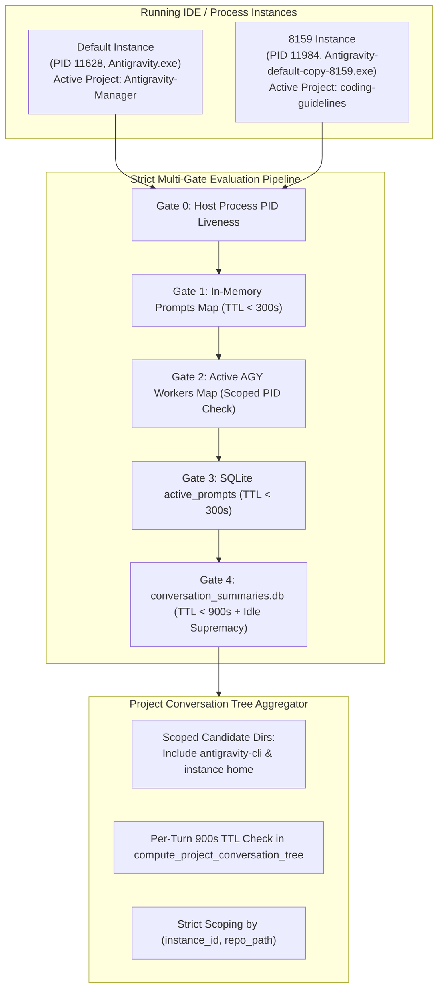

# Architecture Specification: Instance Prompt Status Detection & Cross-Instance Isolation Fix

## 1. System Context & Overview

Antigravity-Manager manages multiple profiles and instances of Google Antigravity IDE (e.g. `default`, `default-copy-8159`, `gitmap-7845`). Each instance possesses its own data directory (`--user-data-dir`), process space (PID), and conversation history databases (`conversation_summaries.db`).

The user observed that:
1. On sequence one (`default` profile): `Antigravity-Manager` is truly actively running. However, `SpecBuilder` and `coding-guidelines` are NOT running on default, yet the UI / detection logic erroneously showed them as running or contaminated.
2. On sequence two (`default-copy-8159` / 8159): `coding-guidelines` is truly actively running. However, `Antigravity-Manager` and `SpecBuilder` are NOT running on 8159, yet the UI / detection logic erroneously showed them as running on 8159.

## 2. Architectural Defects & Corrections

### Defect A: Missing Turn TTL in `compute_project_conversation_tree`
- **Defect**: When building the project conversation tree, `compute_project_conversation_tree` parsed status and `not_fully_idle`, but completely skipped checking the turn timestamp (`last_modified_time`). Any session left in `CASCADE_RUN_STATUS_RUNNING` from hours or days ago was treated as actively running as long as the instance process was alive.
- **Correction**: Introduce a strict 900-second (15-minute) TTL check on `last_time_str`. Any turn whose age exceeds 900 seconds is unconditionally forced to `is_conv_running = false`.

### Defect B: Omission of `antigravity-cli` in `gemini_dirs_for_instance`
- **Defect**: `gemini_dirs_for_instance` enumerated only `["antigravity", "antigravity-ide"]`. CLI conversations running under `.gemini/antigravity-cli` were not discovered under the default instance candidate directories.
- **Correction**: Include `"antigravity-cli"` in `gemini_dirs_for_instance` so that CLI sessions for `default` and named instances are properly scanned and correlated.

### Defect C: Cross-Instance Bleed in `get_live_project_execution_info`
- **Defect**: In `get_live_project_execution_info`, `live_map` was keyed solely by normalized `clean_p` (`repo_path`), omitting `instance_id`. When `coding-guidelines` was active on instance 8159, any project on `default` sharing the path `d:/work/coding-guidelines` matched `live_map` and was marked `is_running = true`.
- **Correction**: Key `live_map` by `(instance_id, clean_path)`. Only match projects when both the target instance and repo path match.

### Defect D: Global CID Deduplication in `seen_tree_cids`
- **Defect**: `seen_tree_cids` used a global HashSet of `cid` strings across all instances. If an instance had a conversation, subsequent instances could not index or correctly assign it.
- **Correction**: Key `seen_tree_cids` by `(owning_inst_id, cid)`.

### Defect E: Strict Idle Supremacy
- **Defect**: If a session has `not_fully_idle == 0` or status containing `IDLE`, `COMPLETED`, `FAILED`, or `CANCELLED`, it must be immediately treated as idle regardless of any other substrings.
- **Correction**: Enforce idle supremacy across all gates and conversation tree parsing.
