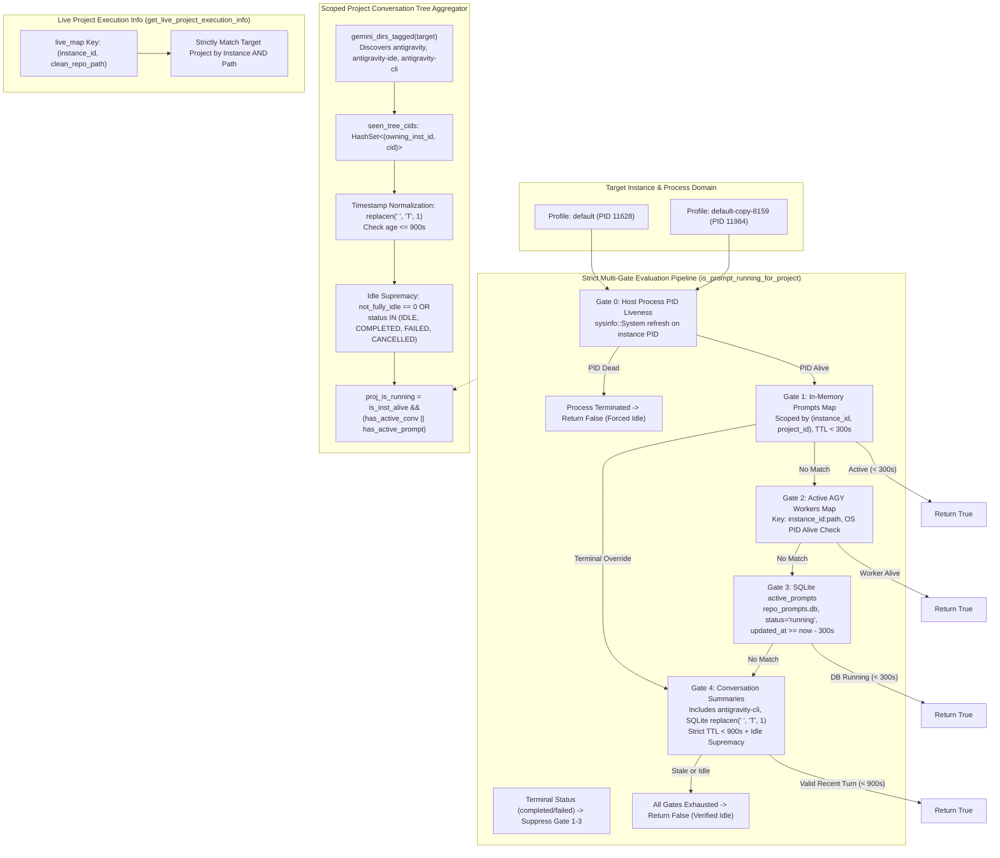

# Architecture Specification: Multi-Instance Prompt Running Detection & Cross-Instance Isolation

## 1. Overview & Architectural Scope

Antigravity-Manager orchestrates and supervises multiple instances and profiles of the Google Antigravity IDE ecosystem (e.g. `default`, `default-copy-8159`, `gitmap-7845`). Each instance operates in a discrete runtime environment with:
1. An isolated user data directory (`--user-data-dir`) and instance home directory (`<home>/.gemini/` or `<instance_home>/.gemini/`).
2. An isolated operating system process tree identifiable by instance process IDs (PID).
3. Independent local state stores, including conversation turn databases (`conversation_summaries.db`), CLI workspace metadata, and central orchestration tables (`active_prompts` in `repo_prompts.db`).

### 1.1 Problem Statement & Cross-Instance Contamination
In multi-profile setups, the running state of prompts suffered from severe cross-instance contamination and stale-state latching:
- **Sequence 1 (`default` profile, PID 11628)**: While actively executing prompts solely for repository `Antigravity-Manager`, the UI and background detection probes erroneously reported unrelated repositories like `SpecBuilder` and `coding-guidelines` as actively running.
- **Sequence 2 (`default-copy-8159`, PID 11984)**: While actively executing prompts solely for repository `coding-guidelines`, the UI and background probes erroneously reported `Antigravity-Manager` and `SpecBuilder` as actively running on instance `8159`.
- **False Latching & Ghost Running**: Even when an instance process was idle or a conversation turn had finished hours or days earlier, UI cards continuously displayed pulsing `RUNNING` indicators.

---

## 2. Deep Dive: The Six Exact Architectural Defects

Comprehensive analysis of `src-tauri/src/modules/repo_db.rs` revealed six intertwined architectural flaws:

### Defect 1: Omission of `antigravity-cli` in `gemini_dirs_for_instance`
- **Location**: `src-tauri/src/modules/repo_db.rs` -> `gemini_dirs_for_instance`
- **Defect**: The function enumerated only `["antigravity", "antigravity-ide"]` within `.gemini/`. CLI-based agent executions storing sessions under `<home>/.gemini/antigravity-cli` were completely omitted from candidate directory discovery.
- **Impact**: Any prompt executed via the CLI runner was invisible to the instance scanner, causing inconsistency where default instance detection failed to observe active CLI turns or misattributed them to fallback paths.

### Defect 2: Missing 900s TTL Check in `compute_project_conversation_tree`
- **Location**: `src-tauri/src/modules/repo_db.rs` -> `compute_project_conversation_tree`
- **Defect**: When iterating over records from `conversation_summaries.db`, the query extracted `last_time_str` (the timestamp of the latest turn update), but completely skipped evaluating its age against the current host time (`now`). Any conversation that remained flagged with `CASCADE_RUN_STATUS_RUNNING` or `not_fully_idle > 0` was permanently evaluated as `is_conv_running = true` as long as the parent instance PID was alive.
- **Impact**: Historical crashed, abandoned, or unfinalized turns from days ago were resurrected as actively running whenever the IDE was open.

### Defect 3: Timestamp Parsing Failure for SQLite Timestamps
- **Location**: `src-tauri/src/modules/repo_db.rs` -> Gate 4 & conversation turn evaluators
- **Defect**: SQLite stores ISO datetime strings formatted as `YYYY-MM-DD HH:MM:SS.ffffff+00:00` (with a whitespace separator between date and time). Standard RFC 3339 parsers (`chrono::DateTime::parse_from_rfc3339`) strictly mandate `T` as the date-time delimiter and fail immediately on whitespace. Subsequent fallback attempts with `NaiveDateTime::parse_from_str("%Y-%m-%d %H:%M:%S")` also failed because the string contained fractional microseconds (`.ffffff`) and offset offsets (`+00:00`).
- **Impact**: Fresh, active SQLite timestamps failed to parse and defaulted to expired/invalid, while unparsed strings caused erratic fallback behavior where valid recent turns were either prematurely marked dead or bypassed into permissive defaults.
- **Correction**: Pre-process the timestamp string using `.replacen(' ', "T", 1)` prior to RFC 3339 parsing to normalize SQLite dates into compliant RFC 3339 strings.

### Defect 4: Global `seen_tree_cids` Collision Across Instances
- **Location**: `src-tauri/src/modules/repo_db.rs` -> `compute_project_conversation_tree`
- **Defect**: `seen_tree_cids` was instantiated as a flat `HashSet<String>` across all instances and directory scans. When multiple instances or directories were inspected, conversation IDs discovered in the first instance permanently locked out the conversation ID from being attributed or processed in subsequent instances.
- **Impact**: Conversations shared or identically named across profiles were shadowed, causing cross-instance suppression and incorrect node association.
- **Correction**: Namespace the deduplication set by composite key `(String, String)` representing `(owning_inst_id, cid)`.

### Defect 5: Path-Only Keying in `get_live_project_execution_info` `live_map`
- **Location**: `src-tauri/src/modules/repo_db.rs` -> `get_live_project_execution_info`
- **Defect**: The in-memory tracking map `live_map` was keyed solely by normalized filesystem path: `clean_p = normalize_path_for_compare(&decode_uri_to_path(&u))`. It failed to incorporate `instance_id`.
- **Impact**: When instance `8159` was actively running repository `d:/work/coding-guidelines`, `live_map` recorded `live_map["d:/work/coding-guidelines"] = (true, snippet, now)`. When the scanner iterated through registered projects on the `default` instance that pointed to the exact same repository path on disk, it retrieved the entry from `live_map` and marked `default`'s card as `is_running = true`. This was the primary driver of cross-instance UI bleeding.
- **Correction**: Key `live_map` by composite key `(String, String)`: `(instance_id.to_lowercase(), clean_path)`.

### Defect 6: Permissive Fallback Without Per-Instance Scoping
- **Location**: `src-tauri/src/modules/repo_db.rs` -> `compute_project_conversation_tree` (`proj_is_running` determination)
- **Defect**: `proj_is_running` was determined via `is_inst_alive && (has_active_conv || has_active_prompt)`. When `has_active_conv` was evaluated, cross-instance conversations were queried without verifying that the conversation strictly belonged to both the project repository path AND the project's owning instance.
- **Impact**: Projects inherited running states from conversations registered under other instances.

---

## 3. Architecture Solution: Multi-Gate Pipeline & Scoped Tree Aggregator

The modernized architecture establishes two decoupled yet harmonious inspection layers:
1. **The Strict Multi-Gate Pipeline (`is_prompt_running_for_project`)**: A deterministic 5-tier evaluation pipeline that verifies liveness from OS process level down to turn-level recency.
2. **The Scoped Project Conversation Tree Aggregator (`compute_project_conversation_tree`)**: An instance-partitioned query engine that builds UI tree nodes with strict TTL validation and idle supremacy.



---

## 4. Pipeline Gate Specifications

### Gate 0: Host Process PID Liveness
- **Rule**: If the host instance process is not running or its OS PID has exited, no child prompt can possibly be running on that instance.
- **Verification**: Query `crate::modules::process::is_antigravity_running(None)` for `default` or `crate::modules::instance::is_instance_running(&inst.id, &inst.data_dir, inst.pid)` for secondary instances.
- **Outcome**: Immediate short-circuit to `false` with audit reason `"INSTANCE_PROCESS_DEAD"`.

### Gate 1: In-Memory Active Prompts Map
- **Store**: `get_memory_prompts_map()`.
- **Scoping**: Must match `p.instance_id` (accounting for `"default"`, `"__default__"`, or empty string) AND `(p.project_id == project_id || p.repo_path == project_id)`.
- **TTL**: Must satisfy `p.updated_at >= now - 300` (5-minute TTL).
- **Terminal Override**: If either the memory map or SQLite shows the latest turn has transitioned to `"completed"` or `"failed"`, Gate 1 and Gate 3 running statuses are suppressed.

### Gate 2: Active AGY Workers Map
- **Store**: `get_active_agy_workers()`.
- **Keying**: Formatted as `instance_id:repo_path`.
- **Liveness**: Validates the operating system PID of the worker process via `sysinfo::System`. If dead, the entry is pruned from memory.
- **Scoping**: Restricts matches strictly to `norm_inst == worker_inst`.

### Gate 3: SQLite `active_prompts` Table
- **Store**: `repo_prompts.db`.
- **Query**:
  ```sql
  SELECT COUNT(*) FROM active_prompts 
  WHERE (project_id = ?1 OR repo_path = ?1) 
    AND (?2 = 'all' OR instance_id = ?2 OR (?2 = 'default' AND (instance_id = 'default' OR instance_id = '__default__' OR instance_id IS NULL OR instance_id = '')))
    AND status = 'running'
    AND updated_at >= ?3;
  ```
- **TTL**: Bound by `now - 300` (5 minutes).

### Gate 4: Conversation Summaries Live Turns
- **Store**: `conversation_summaries.db` across candidate directories returned by `gemini_dirs_for_instance(norm_inst)`.
- **Candidate Dirs**: Strictly includes `.gemini/antigravity`, `.gemini/antigravity-ide`, and `.gemini/antigravity-cli`.
- **Timestamp Normalization & 900s TTL**:
  ```rust
  let norm_time_str = _last_time_str.replacen(' ', "T", 1);
  let is_recent = chrono::DateTime::parse_from_rfc3339(&norm_time_str)
      .map(|dt| dt.timestamp() >= now - 900)
      .or_else(|_| {
          chrono::NaiveDateTime::parse_from_str(&norm_time_str, "%Y-%m-%dT%H:%M:%S")
              .map(|dt| dt.and_utc().timestamp() >= now - 900)
      })
      .or_else(|_| {
          chrono::NaiveDateTime::parse_from_str(&_last_time_str, "%Y-%m-%d %H:%M:%S")
              .map(|dt| dt.and_utc().timestamp() >= now - 900)
      })
      .unwrap_or(false);
  ```
  If `!is_recent`, the turn is discarded as stale (`continue`).
- **Strict Idle Supremacy**: If `not_fully_idle == 0` or status contains `IDLE`, `COMPLETED`, `FAILED`, or `CANCELLED`, `is_conv_running` is strictly `false`.

---

## 5. Project Conversation Tree Aggregator (`compute_project_conversation_tree`)

The project conversation tree builder aggregates conversations and builds hierarchical UI nodes (`AgmProjectTreeNode`).

1. **Scoped Discovery**: Calls `gemini_dirs_tagged(target)` to retrieve pairs of `(owning_inst_id, base_dir)`.
2. **Namespaced Deduplication**: Replaces `HashSet<String>` with:
   ```rust
   let mut seen_tree_cids: std::collections::HashSet<(String, String)> = std::collections::HashSet::new();
   if !seen_tree_cids.insert((owning_inst_id.clone(), cid.clone())) {
       continue;
   }
   ```
3. **Turn Freshness & Idle Checks**:
   - Evaluates `last_time_str` against `now - 900` using the same normalized parser.
   - Enforces idle supremacy.
4. **Project Node Evaluation**:
   - `convs_by_inst_and_path` and `active_prompts_by_inst_and_path` are keyed by `(norm_proj_inst, norm_path)`.
   - `has_active_conv`: `conv_nodes.iter().any(|c| c.is_running)`.
   - `has_active_prompt`: evaluates `is_prompt_running_for_project(&proj.repo_path, &proj.instance_id)`.
   - Final status: `proj_is_running = is_inst_alive && (has_active_conv || has_active_prompt)`.

---

## 6. Live Project Execution Info Isolation (`get_live_project_execution_info`)

In `get_live_project_execution_info`:
1. `live_map` is redefined:
   ```rust
   let mut live_map: std::collections::HashMap<(String, String), (bool, Option<String>, i64)> =
       std::collections::HashMap::new();
   ```
2. For each conversation summary row in `(owning_inst_id, base)`:
   ```rust
   let norm_inst = owning_inst_id.to_lowercase();
   let entry = live_map.entry((norm_inst, clean_p)).or_insert((false, None, now));
   if is_conv_running {
       entry.0 = true;
       if entry.1.is_none() && prompt_preview.is_some() {
           entry.1 = prompt_preview.clone();
       }
   }
   ```
3. When matching discovered projects:
   ```rust
   let norm_inst = p.instance_id.to_lowercase();
   if let Some((run, snippet, l_time)) = live_map.get(&(norm_inst, clean_path.clone())) {
       if *run {
           is_running = true;
           prompt_snippet = snippet.clone();
           last_time = *l_time;
       }
   }
   ```
This completely prevents projects on instance `default` from inheriting active statuses from instance `8159`.

---

## 7. Audit Logging & Verification Contract

All gate evaluations and terminal decisions MUST route through `crate::modules::logger::log_instance_prompt_audit`:
```
[InstancePromptAudit] instance='{inst}' (name='{name}') project='{proj}' path='{path}' source='{src}' pid={pid:?} gate='{gate}' is_running={bool} rationale='{reason}'
```
This enables zero-ambiguity telemetry for support engineers and autonomous diagnostic tools to inspect why a prompt was classified as running or idle across multi-profile workstations.
