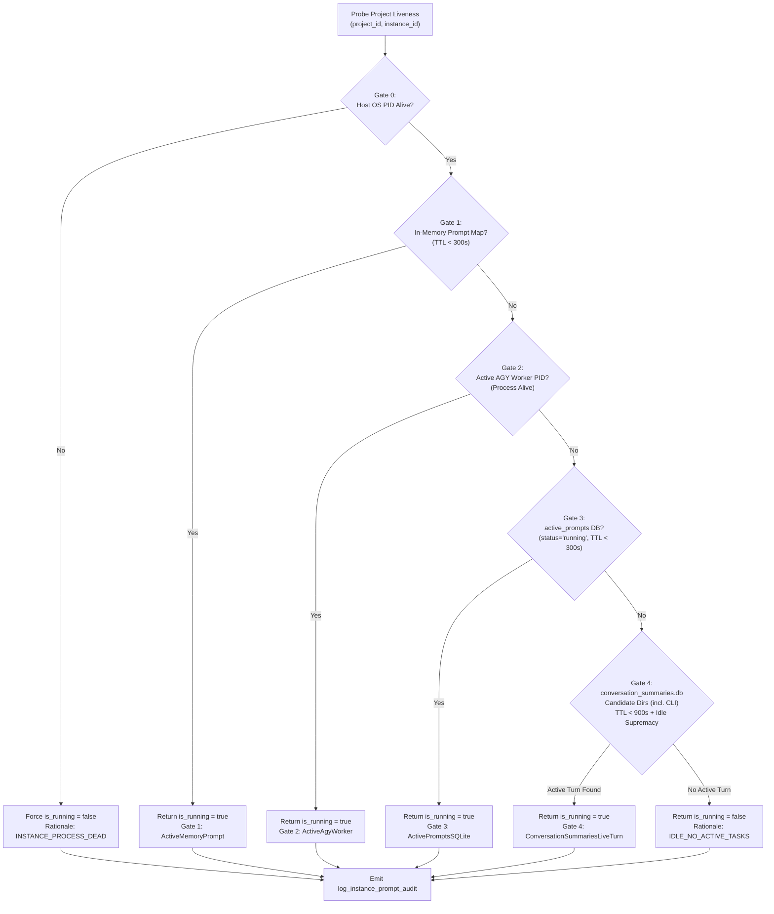

# Component Specification: Instance Prompt Status Detection & Cross-Instance Isolation

- **Feature / Task ID**: `122-instance-prompt-status-detection-and-audit-fix`
- **Target Files**:
  - `src-tauri/src/modules/repo_db.rs`
  - `src-tauri/src/modules/logger.rs`
  - `src-tauri/tests/per_instance_prompt_liveness_test.rs`
- **Architectural Scope**: Backend multi-gate prompt liveness evaluation, instance-partitioned conversation trees, candidate directory discovery, structured audit telemetry, and companion test harnesses.

---

## 1. System Architecture & Multi-Gate Evaluation Flow

Prompt liveness detection is evaluated through a strict 5-gate pipeline ensuring that no project or conversation is marked `is_running = true` unless an active, verified OS process owns the execution and all freshness criteria pass.



---

## 2. Modified Backend Components (`src-tauri/src/modules/repo_db.rs`)

### 2.1 Component: `gemini_dirs_for_instance`

#### 2.1.1 Location & Signature
- **File**: `src-tauri/src/modules/repo_db.rs`
- **Visibility**: `pub fn`
- **Exact Signature**:
  ```rust
  pub fn gemini_dirs_for_instance(instance_id: &str) -> Vec<PathBuf>
  ```

#### 2.1.2 Input / Output Contract
- **Input Parameters**:
  - `instance_id: &str`: Target instance identifier (e.g., `"default"`, `"__default__"`, `""`, `"default-copy-8159"`, `"gitmap-7845"`).
- **Return Type**:
  - `Vec<PathBuf>`: Vector of absolute paths to existing Gemini application data directories.
- **Contract Rules**:
  1. **Instance Root Resolution**:
     - If `instance_id` is `"default"`, `"__default__"`, or empty `""`: resolve root to user home directory (`dirs::home_dir()`).
     - If `instance_id` is a named secondary profile (e.g., `"default-copy-8159"`): resolve root via `crate::modules::instance::get_instance_home_dir(instance_id)`.
  2. **Candidate Directory Discovery**:
     - Check the following subdirectories under `<root>/.gemini/`:
       * `"antigravity"` (Standard IDE instance data)
       * `"antigravity-ide"` (Alternate IDE packaging)
       * `"antigravity-cli"` (Standalone CLI runner workspace & conversation storage)
     - Only include directories that actually exist on disk (`path.exists()`).
     - Return order preserves priority: `antigravity`, `antigravity-ide`, `antigravity-cli`.

#### 2.1.3 Companion Tagged Resolver: `gemini_dirs_tagged`
- **Signature**:
  ```rust
  pub fn gemini_dirs_tagged(instance_id: Option<&str>) -> Vec<(String, PathBuf)>
  ```
- **Contract Rules**:
  - If `instance_id` is `Some(id)` where `id != "all"`:
    - Normalizes `id` (`"__default__"` / `""` -> `"default"`).
    - Calls `gemini_dirs_for_instance(norm_id)`.
    - Returns each directory tagged with `(norm_id.to_string(), path)`.
  - If `instance_id` is `None` or `Some("all")`:
    - Tags all default directories with `"default"`.
    - Loads `crate::modules::instance::load_registry()`.
    - Iterates over all non-default registered instances and tags their directories with `(inst.id.clone(), path)`.

---

### 2.2 Component: `compute_project_conversation_tree`

#### 2.2.1 Location & Signature
- **File**: `src-tauri/src/modules/repo_db.rs`
- **Visibility**: `fn` (internal module function invoked by `get_project_conversation_tree_cached`)
- **Exact Signature**:
  ```rust
  fn compute_project_conversation_tree(
      target_instance: Option<&str>,
      max_words: usize,
      only_running: bool,
  ) -> Vec<AgmProjectTreeNode>
  ```

#### 2.2.2 Input / Output Contract
- **Input Parameters**:
  - `target_instance: Option<&str>`: Target instance ID to filter by (`Some("default")`, `Some("default-copy-8159")`, or `None`/`Some("all")` for all instances).
  - `max_words: usize`: Maximum word count for prompt preview truncation (defaults to 200 when 0).
  - `only_running: bool`: When `true`, retains only project nodes and conversation nodes that evaluate to running.
- **Return Type**:
  - `Vec<AgmProjectTreeNode>`: Hierarchical tree of project nodes, each embedding associated `conversations: Vec<AgmConversationNode>`.

#### 2.2.3 Internal Data Structures & Scoping Rules
1. **Instance-Partitioned Conversation Deduplication (`seen_tree_cids`)**:
   - **Type**: `HashSet<(String, String)>` representing `(owning_instance_id, conversation_id)`.
   - **Invariant**: Global CID collision across different instances is strictly prevented. An instance cloned or referencing a workspace retains its own conversation identity independent of other instances.
2. **Turn Timestamp Freshness (15-Minute TTL Gate)**:
   - For every row from `conversation_summaries`:
     - Parse `last_time_str: String` using multi-format parser:
       1. RFC 3339 (`DateTime::parse_from_rfc3339`)
       2. Standard SQLite timestamp: `"%Y-%m-%d %H:%M:%S"`
       3. ISO without timezone: `"%Y-%m-%dT%H:%M:%S"`
     - Compute elapsed time: `turn_age_secs = now - parsed_timestamp`.
     - Freshness condition: `is_recent = turn_age_secs <= 900` (15 minutes).
     - **Enforcement**: If `!is_recent`, conversation is forced to `is_conv_running = false`.
3. **Strict Idle Supremacy**:
   - Condition:
     ```rust
     let is_idle_count = not_fully_idle == 0;
     let has_idle_status = status.contains("IDLE")
         || status.contains("COMPLETED")
         || status.contains("FAILED")
         || status.contains("CANCELLED");
     let is_explicit_idle = is_idle_count || has_idle_status;
     ```
   - If `is_explicit_idle == true`, unconditionally set `is_conv_running = false`.
   - Only when `!is_explicit_idle && is_recent && is_owning_inst_alive && not_fully_idle > 0 && status.contains("RUNNING")`:
     `is_conv_running = true`.
4. **Project-Conversation Mapping**:
   - Grouping key: `(norm_owning_inst: String, clean_repo_path: String)`.
   - Conversations are strictly dispatched to project nodes that match BOTH `owning_inst` and `clean_repo_path`.
5. **Project Node Liveness Determination**:
   - `has_active_conv`: `conv_nodes.iter().any(|c| c.is_running)`
   - `has_active_prompt`: fallback to `is_prompt_running_for_project(&proj.repo_path, &proj.instance_id)`
   - Final status: `proj_is_running = is_inst_alive && (has_active_conv || has_active_prompt)`
   - When `!is_inst_alive`, `proj_is_running` is strictly `false` with rationale `INSTANCE_PROCESS_DEAD`.

---

### 2.3 Component: `get_live_project_execution_info`

#### 2.3.1 Location & Signature
- **File**: `src-tauri/src/modules/repo_db.rs`
- **Visibility**: `pub fn`
- **Exact Signature**:
  ```rust
  pub fn get_live_project_execution_info() -> Vec<ProjectExecutionInfo>
  ```

#### 2.3.2 Input / Output Contract
- **Input Parameters**: None.
- **Return Type**:
  - `Vec<ProjectExecutionInfo>`: List of live project execution states merged from active memory tasks, SQLite prompts, and candidate directories.
- **Contract & Partitioning Rules**:
  1. **Partitioned Live Map Keying**:
     - **Old Key**: `clean_path: String` (Caused cross-instance bleed when two instances shared a project path).
     - **New Key**: `(instance_id: String, clean_repo_path: String)`.
     - **Value**: `(is_running: bool, prompt_preview: Option<String>, last_detected_at: i64)`.
  2. **Candidate Directory Traversal**:
     - Uses `gemini_dirs_tagged(None)` to retrieve `(owning_inst_id, base_dir)`.
     - Populates `live_map` entries strictly with `(owning_inst_id.to_lowercase(), clean_p)`.
  3. **Active Prompts Table Matching**:
     - Inspects `active_prompts` where `status IN ('running', 'queued')`.
     - Normalizes `instance_id` from row (`""` or `"__default__"` -> `"default"`).
     - Inserts into `live_map` under `(norm_inst, clean_p)`.
  4. **Project Matching Logic**:
     - Iterates over projects in `running_projects`.
     - Looks up `live_map.get(&(p.instance_id.to_lowercase(), clean_path))`.
     - A project on instance A NEVER inherits the running state of the same repository path on instance B.

---

### 2.4 Component: `is_prompt_running_for_project`

#### 2.4.1 Location & Signature
- **File**: `src-tauri/src/modules/repo_db.rs`
- **Visibility**: `pub fn`
- **Exact Signature**:
  ```rust
  pub fn is_prompt_running_for_project(project_id: &str, instance_id: &str) -> bool
  ```

#### 2.4.2 Input / Output Contract
- **Input Parameters**:
  - `project_id: &str`: Repository path or project identifier (e.g. `"d:/work/Antigravity-Manager"`).
  - `instance_id: &str`: Owning instance identifier (e.g. `"default"`, `"default-copy-8159"`).
- **Return Type**:
  - `bool`: `true` if active execution is confirmed, `false` otherwise.

#### 2.4.3 Gate Specifications & Validation Invariants
| Gate | Target Resource | TTL / Freshness | Condition for `true` | Terminal Fallback |
| :--- | :--- | :--- | :--- | :--- |
| **Gate 0** | Host Process OS PID | Real-time (`is_antigravity_running` / `is_instance_running`) | OS process exists and responds | Returns `false` immediately if dead (`INSTANCE_PROCESS_DEAD`) |
| **Gate 1** | In-Memory Active Prompts Map | 300 seconds (`now - 300`) | Task exists for `norm_inst` and `clean_p`, status active | Proceeds to Gate 2 if absent |
| **Gate 2** | In-Memory Active AGY Workers | Real-time PID probe | Worker PID alive, instance matches | Cleans dead workers, proceeds to Gate 3 |
| **Gate 3** | `active_prompts` SQLite Table | 300 seconds (`updated_at >= now - 300`) | `status = 'running'` matching `(project_id, instance_id)` | Proceeds to Gate 4 |
| **Gate 4** | `conversation_summaries.db` (All candidate dirs including `antigravity-cli`) | 900 seconds (`last_modified_time >= now - 900`) | `not_fully_idle > 0` AND status has `RUNNING` AND NOT explicit idle | Returns `false` (`IDLE_NO_ACTIVE_TASKS`) |

---

### 2.5 Component: `log_instance_prompt_audit`

#### 2.5.1 Location & Signature
- **File**: `src-tauri/src/modules/logger.rs`
- **Visibility**: `pub fn`
- **Exact Signature**:
  ```rust
  pub fn log_instance_prompt_audit(
      instance_id: &str,
      resolved_name: &str,
      project_name: &str,
      repo_path: &str,
      db_path_evaluated: &str,
      process_pid: Option<u32>,
      criteria_evaluated: &str,
      is_running: bool,
      rationale: &str,
  )
  ```

#### 2.5.2 Output Format & Telemetry Schema
- **Level**: `log::info!`
- **Log Prefix**: `[InstancePromptAudit]`
- **Format String**:
  ```text
  [InstancePromptAudit] instance_id='{}' resolved_name='{}' project='{}' repo_path='{}' db_path='{}' pid={} criteria='{}' is_running={} rationale='{}'
  ```
- **Fields**:
  - `instance_id`: Canonical instance ID (e.g. `"default"`, `"default-copy-8159"`).
  - `resolved_name`: Display name or alias of the instance.
  - `project_name`: Display repository name.
  - `repo_path`: Normalized filesystem path.
  - `db_path_evaluated`: Database or in-memory map evaluated (e.g. `conversation_summaries.db`, `active_prompts_table`, `active_mem_map`).
  - `process_pid`: Host OS process ID, or `"none"` if dead/unmatched.
  - `criteria_evaluated`: Exact evaluation checkpoint (e.g. `Gate0:HostProcessLiveness`, `Gate4:ConversationSummariesLiveTurn`, `ProjectConversationTreeLiveness`).
  - `is_running`: Final boolean outcome.
  - `rationale`: Canonical uppercase rationale code (e.g. `INSTANCE_PROCESS_DEAD`, `TURN_STALE_TTL_EXPIRED`, `ACTIVE_IN_FLIGHT_TASKS`, `IDLE_NO_ACTIVE_TASKS`).

---

## 3. Data Entities & IPC Schemas

```rust
#[derive(Debug, Clone, Serialize, Deserialize)]
pub struct AgmProjectTreeNode {
    pub seq_id: i64,
    pub seq_code: String,
    pub gitmap_seq_code: String,
    pub project_id: String,
    pub repo_name: String,
    pub repo_path: String,
    pub instance_id: String,
    pub instance_seq_num: Option<i64>,
    pub instance_name: String,
    pub bound_email: Option<String>,
    pub is_running: bool,
    pub conversations: Vec<AgmConversationNode>,
}

#[derive(Debug, Clone, Serialize, Deserialize)]
pub struct AgmConversationNode {
    pub seq_id: i64,
    pub seq_code: String,
    pub gitmap_seq_code: String,
    pub conversation_id: String,
    pub short_id: String,
    pub title: String,
    pub status: String,
    pub is_running: bool,
    pub step_count: i32,
    pub instance_id: String,
    pub prompt_preview_200w: String,
    pub prompt_word_count: usize,
    pub last_modified: String,
}

#[derive(Debug, Clone, Serialize, Deserialize)]
pub struct ProjectExecutionInfo {
    pub project_id: String,
    pub repo_name: String,
    pub repo_path: String,
    pub instance_id: String,
    pub is_running: bool,
    pub active_prompt_preview: Option<String>,
    pub last_active_timestamp: i64,
}
```

---

## 4. Invalidation & Cache Partitioning (`prompt_tree_cache`)

1. **Table Schema**:
   ```sql
   CREATE TABLE IF NOT EXISTS prompt_tree_cache (
       cache_key TEXT PRIMARY KEY,
       instance_id TEXT NOT NULL,
       tree_json TEXT NOT NULL,
       project_count INTEGER NOT NULL,
       conversation_count INTEGER NOT NULL,
       updated_at INTEGER NOT NULL,
       ttl_seconds INTEGER NOT NULL DEFAULT 60
   );
   ```
2. **Key Format**: `tree:{instance_id}:{max_words}:{only_running}`.
3. **Invalidation Protocol**:
   - Default TTL is 60 seconds.
   - When `force == true`, disk cache is bypassed and replaced with newly computed tree.
   - Any recomputation updates `tree_json` atomically using SQLite `ON CONFLICT(cache_key) DO UPDATE`.
