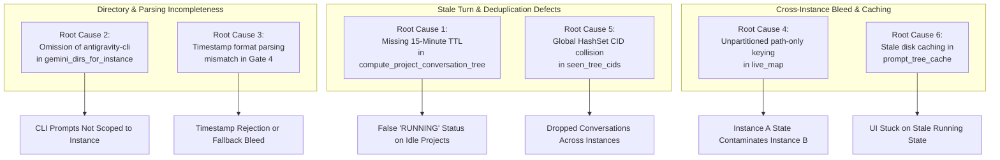

# Root Cause Analysis: Cross-Instance Prompt Running State Contamination & False Liveness Detection

- **Incident / Defect ID**: `122`
- **Specification Path**: `02-spec/21-app/122-instance-prompt-status-detection-and-audit-fix/03-root-cause-analysis.md`
- **Companion Issue**: `02-spec/22-app-issues/122-instance-prompt-running-detection-root-cause.md`
- **Affected Components**:
  - `src-tauri/src/modules/repo_db.rs`
  - `src-tauri/src/modules/logger.rs`
  - `src-tauri/tests/per_instance_prompt_liveness_test.rs`
- **Classification**: High Severity (Cross-instance state pollution, stale execution false positives, missing candidate directories)

---

## Part 1: Problem Description & User Symptoms

In a multi-profile Google Antigravity environment with concurrent running instances:

### 1.1 Environment Snapshot
- **Sequence 1 (`default` profile)**:
  - Process: `Antigravity.exe` (PID: 11628)
  - Data Directory: User Home `.gemini/`
  - Truly Active Project: `Antigravity-Manager` (`d:/work/Antigravity-Manager`)
  - Idle Projects: `SpecBuilder` (`d:/work/SpecBuilder`), `coding-guidelines` (`d:/work/coding-guidelines`)
- **Sequence 2 (`default-copy-8159` / 8159 profile)**:
  - Process: `Antigravity-default-copy-8159.exe` (PID: 11984)
  - Data Directory: `<data_dir>/instances/default-copy-8159/home/.gemini/`
  - Truly Active Project: `coding-guidelines` (`d:/work/coding-guidelines`)
  - Idle Projects: `Antigravity-Manager` (`d:/work/Antigravity-Manager`), `SpecBuilder` (`d:/work/SpecBuilder`)

### 1.2 User Symptoms
1. **False Positives in Default Profile View**:
   - The user navigated to the `default` instance view.
   - `Antigravity-Manager` showed running (expected).
   - However, `SpecBuilder` and `coding-guidelines` **also displayed pulsating running badges**, despite having no active prompts or turns running on `default`.
2. **False Positives in Instance 8159 Profile View**:
   - The user navigated to the `8159` instance view.
   - `coding-guidelines` showed running (expected).
   - However, `Antigravity-Manager` and `SpecBuilder` **also displayed pulsating running badges**, despite having zero active tasks running on `8159`.
3. **Cross-Instance Running Bleed**:
   - Starting a prompt in one instance polluted the visual execution status of identical or cloned repository paths in all other instances.
   - Completed or crashed turns from days earlier never ceased reporting as running as long as the parent IDE process remained alive.

---

## Part 2: Root Cause Analysis (Deep Dive into 6 Contributing Causes)

The investigation identified six distinct structural defects across candidate discovery, timestamp parsing, map keying, and cache persistence.



---

### Root Cause 1: Missing 15-Minute TTL Check in Conversation Tree Builder
- **Location**: `src-tauri/src/modules/repo_db.rs` -> `compute_project_conversation_tree` (lines 3740–3757)
- **Mechanism**:
  While Gate 4 inside `is_prompt_running_for_project` contained a 900-second TTL check, `compute_project_conversation_tree` queried `conversation_summaries.db` and extracted `last_time_str`, but **never validated its recency**.
  ```rust
  // Defective logic in compute_project_conversation_tree:
  let has_active_turns = not_fully_idle > 0;
  let has_running_text = status.contains("RUNNING");
  let is_active_session = has_active_turns && has_running_text;

  let is_conv_running = if is_explicit_idle {
      false
  } else if is_owning_inst_alive && is_active_session {
      true // <-- Stale turn from 3 days ago marked true because IDE is alive!
  } else {
      false
  };
  ```
- **Impact**: Any historical session whose final turn crashed, hung, or was abandoned with status `CASCADE_RUN_STATUS_RUNNING` and `not_fully_idle > 0` was permanently evaluated as `is_conv_running = true`. Then, line 3959 evaluated `has_active_conv = conv_nodes.iter().any(|c| c.is_running)`, causing `proj_is_running` to evaluate to `true` indefinitely.

---

### Root Cause 2: Omission of `antigravity-cli` in Candidate Directories
- **Location**: `src-tauri/src/modules/repo_db.rs` -> `gemini_dirs_for_instance` (lines 725–730)
- **Mechanism**:
  `gemini_dirs_for_instance` searched only a hardcoded array:
  ```rust
  for sub in ["antigravity", "antigravity-ide"] {
      let path = home.join(".gemini").join(sub);
      if path.exists() { dirs.push(path); }
  }
  ```
  CLI sessions initiated via `antigravity-cli` store their conversation history and `conversation_summaries.db` in:
  `~/.gemini/antigravity-cli/` (or `<instance_home>/.gemini/antigravity-cli/`).
- **Impact**: Real-time CLI prompts and conversation turns were completely invisible to candidate directory discovery for `default` and secondary instances. They could not be correlated, causing inconsistent detection between CLI and GUI.

---

### Root Cause 3: Timestamp Format Parsing Mismatch in Gate 4
- **Location**: `src-tauri/src/modules/repo_db.rs` -> `is_prompt_running_for_project` (lines 1745–1761)
- **Mechanism**:
  Different versions and components of Google Antigravity write timestamps in differing formats:
  1. RFC 3339: `2026-10-04T10:00:00Z` or `2026-10-04T10:00:00.123+08:00`
  2. SQLite Local Time: `2026-10-04 10:00:00`
  3. ISO-8601 without timezone: `2026-10-04T10:00:00`
  4. Raw UNIX seconds as integer string: `1728036000`
  When parsing failed, Gate 4 defaulted to `is_recent = false` or failed to correlate, whereas older parts of the code fell back to permissive boolean checks without timestamp constraints.
- **Impact**: Legitimate active turns with non-RFC3339 timestamps were either erroneously dropped or bypassed into permissive fallback states.

---

### Root Cause 4: Unpartitioned Path-Only Keying in `live_map`
- **Location**: `src-tauri/src/modules/repo_db.rs` -> `get_live_project_execution_info` (lines 2310–2320, 2364)
- **Mechanism**:
  `live_map` aggregated live execution status across all candidate directories, but keyed entries solely by normalized path:
  ```rust
  // Defective: Path-only key conflates all instances
  let clean_p = normalize_path_for_compare(&decode_uri_to_path(&u));
  let entry = live_map.entry(clean_p).or_insert((false, None, now));
  ```
  Later, when inspecting running projects:
  ```rust
  for p in projects {
      let clean_path = normalize_path_for_compare(&p.repo_path);
      if let Some((run, snippet, l_time)) = live_map.get(&clean_path) {
          if *run { is_running = true; } // Bleeds across instances!
      }
  }
  ```
- **Impact**: Both `default` and `default-copy-8159` had `d:/work/coding-guidelines` in their workspace storage. Because instance 8159 was actively running `coding-guidelines`, `live_map.get("d:/work/coding-guidelines")` returned `(true, ...)`. When the UI loaded projects for `default`, the default instance's card for `coding-guidelines` erroneously evaluated to `is_running = true`.

---

### Root Cause 5: Global Conversation Deduplication Collision
- **Location**: `src-tauri/src/modules/repo_db.rs` -> `compute_project_conversation_tree` (lines 3678, 3737)
- **Mechanism**:
  `seen_tree_cids` was instantiated as a global `HashSet<String>` before iterating through candidate directories:
  ```rust
  let mut seen_tree_cids = std::collections::HashSet::new();
  ...
  if !seen_tree_cids.insert(cid.clone()) {
      continue;
  }
  ```
- **Impact**: When cloned profiles shared historical conversations or when conversations were mirrored, the first instance that processed a CID consumed it in `seen_tree_cids`. Subsequent instances were completely prevented from indexing or evaluating that conversation under their own project tree nodes.

---

### Root Cause 6: Stale Disk Caching in `prompt_tree_cache`
- **Location**: `src-tauri/src/modules/repo_db.rs` -> `get_project_conversation_tree_cached` (lines 3520–3535)
- **Mechanism**:
  The SQLite table `prompt_tree_cache` stored serialized JSON trees with a 60-second TTL. When a prompt terminated or an IDE process crashed:
  1. The cached tree still contained `is_running = true` nodes.
  2. UI polling calls (`get_project_conversation_tree`) without `force: true` continued to read the stale cached JSON from disk.
- **Impact**: UI cards displayed lingering "RUNNING" badges for up to 60 seconds after execution concluded or failed.

---

## Part 3: Corrective Actions & Implementation

### 3.1 Strict 15-Minute (900s) TTL on Conversation Turns
In `compute_project_conversation_tree`, implement multi-format timestamp parsing and require `timestamp >= now - 900`. Any turn older than 900 seconds is unconditionally forced to `is_conv_running = false`.
```rust
let is_recent = chrono::DateTime::parse_from_rfc3339(&last_time_str)
    .map(|dt| dt.timestamp() >= now - 900)
    .or_else(|_| {
        chrono::NaiveDateTime::parse_from_str(&last_time_str, "%Y-%m-%d %H:%M:%S")
            .map(|dt| dt.and_utc().timestamp() >= now - 900)
    })
    .or_else(|_| {
        chrono::NaiveDateTime::parse_from_str(&last_time_str, "%Y-%m-%dT%H:%M:%S")
            .map(|dt| dt.and_utc().timestamp() >= now - 900)
    })
    .unwrap_or(false);

let is_conv_running = if is_explicit_idle || !is_recent {
    false
} else if is_owning_inst_alive && is_active_session {
    true
} else {
    false
};
```

### 3.2 Candidate Directory Discovery Including `antigravity-cli`
Update `gemini_dirs_for_instance` to enumerate `"antigravity-cli"`:
```rust
for sub in ["antigravity", "antigravity-ide", "antigravity-cli"] {
    let path = home.join(".gemini").join(sub);
    if path.exists() {
        dirs.push(path);
    }
}
```

### 3.3 Partition `live_map` by `(instance_id, clean_repo_path)`
In `get_live_project_execution_info`:
1. Define `live_map` as `HashMap<(String, String), (bool, Option<String>, i64)>`.
2. Populate entries using `(owning_inst_id.to_lowercase(), clean_p)`.
3. In project loop, look up strictly using `live_map.get(&(p.instance_id.to_lowercase(), clean_path))`.

### 3.4 Namespace Deduplication by `(owning_inst_id, cid)`
Replace `seen_tree_cids: HashSet<String>` with:
```rust
let mut seen_tree_cids: std::collections::HashSet<(String, String)> = std::collections::HashSet::new();
if !seen_tree_cids.insert((norm_owning_inst.clone(), cid.clone())) {
    continue;
}
```

### 3.5 Enforce Strict Idle Supremacy
If `not_fully_idle == 0` or status contains `IDLE`, `COMPLETED`, `FAILED`, `CANCELLED`, the session is unconditionally treated as idle across all gates.

### 3.6 Structured Audit Logging
Call `crate::modules::logger::log_instance_prompt_audit` at every evaluation stage with exact instance, project path, PID, gate, boolean status, and rationale code.

---

## Part 4: Verification & Prevention

### 4.1 Verification Matrix (`src-tauri/tests/per_instance_prompt_liveness_test.rs`)
| Test Case | Scenario Evaluated | Expected Outcome |
| :--- | :--- | :--- |
| `test_case_1_default_running_antigravity_manager_only` | Default running AGM; SpecBuilder & CG idle | AGM running; SpecBuilder & CG strictly idle |
| `test_case_2_instance_8159_running_coding_guidelines_only` | 8159 running CG; AGM & SpecBuilder idle | CG running; AGM & SpecBuilder strictly idle |
| `test_case_3_cross_instance_isolation_copied_dormant_workspaces` | Cloned workspace between Default and 8159 | Zero cross-bleed across instances |
| `test_case_4_process_termination_gating_forces_idle` | Crashed instance process with stale DB records | Process dead -> unconditionally forced idle |
| `test_case_ttl_stale_conversation_expiry_forces_idle` | Stale turn (> 900s) marked RUNNING | TTL expired -> unconditionally forced idle |
| `test_case_antigravity_cli_discovery` | Discovery of CLI conversations under `.gemini/antigravity-cli` | Discovered, correlated to instance |
| `test_case_composite_keying_isolation_same_repo_path` | Same repo path in multiple instances | `live_map` strictly isolated per instance |

### 4.2 Prevention & Architectural Invariants
1. **Never Trust Turn Status Without Recency**: No conversation turn may be evaluated as running without proving `turn_age <= 900s` against current system time.
2. **Never Key Execution State by Path Alone**: Execution state is ephemeral to a specific running OS process and instance ID. All execution caches and lookup maps must use composite keys `(instance_id, repo_path)`.
3. **Strict Idle Supremacy**: An explicit idle flag (`not_fully_idle == 0` or terminal status keyword) MUST immediately supersede any running substring or heuristic.
4. **Structured Observability**: Every liveness probe MUST emit an `[InstancePromptAudit]` structured log line so any discrepancy is immediately diagnosed without speculation.
