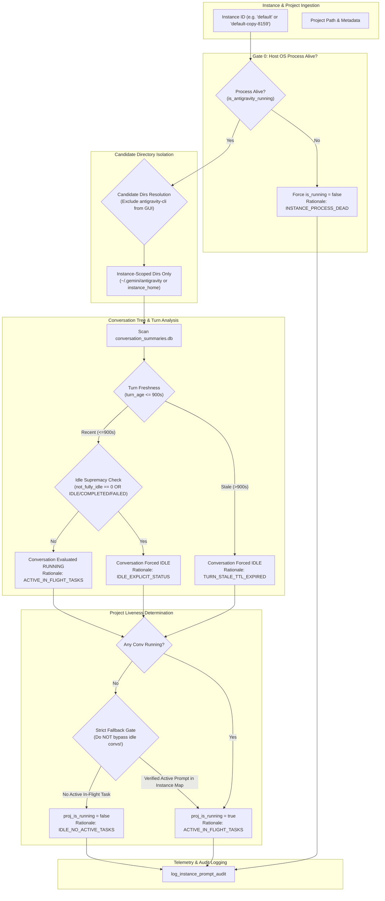

# Component Specification: Multi-Instance Prompt Liveness Isolation

- **Feature / Task ID**: `123-multi-instance-prompt-liveness-isolation`
- **Target Files**:
  - `src-tauri/src/modules/repo_db.rs`
  - `src-tauri/src/modules/logger.rs`
  - `src/pages/Instances.tsx`
  - `src-tauri/tests/per_instance_prompt_liveness_test.rs`
- **Architectural Scope**: Backend candidate directory isolation, stale state eradication, prompt tree computation refinement, structured audit logging telemetry, frontend instance-partitioned card matching, and integration test validation.

---

## 1. System Architecture & Evaluation Pipeline

The multi-instance prompt liveness detection pipeline enforces absolute isolation between concurrent Google Antigravity instances (e.g. Sequence 1 `default` and Sequence 2 `default-copy-8159`). No project or conversation may evaluate to `is_running = true` unless an active, verified OS process owns the instance, the candidate directories are partitioned strictly to the instance boundary, conversation turns satisfy strict freshness TTLs, and explicit idle states take unconditional precedence over permissive fallbacks.



---

## 2. Backend Component Specifications

### 2.1 Component: Candidate Directory Resolution (`repo_db.rs`)

#### 2.1.1 Problem Addressed
In previous iterations, candidate directory discovery included `"antigravity-cli"` under `.gemini/` for GUI instances. Because `~/.gemini/antigravity-cli/` stores CLI-invoked subagent workflows and background tasks, GUI instances (`default`, `default-copy-8159`) inadvertently ingested CLI workspace summaries. Consequently, prompts initiated in CLI sessions bled into GUI project lists, and CLI process states conflicted with GUI IDE process PIDs.

#### 2.1.2 Signature & Contract
- **File**: `src-tauri/src/modules/repo_db.rs`
- **Functions**:
  ```rust
  pub fn gemini_dirs_for_instance(instance_id: &str) -> Vec<PathBuf>
  pub fn gemini_dirs_tagged(instance_id: Option<&str>) -> Vec<(String, PathBuf)>
  ```

#### 2.1.3 Behavioral Invariants
1. **GUI Instance Directory Isolation**:
   - For GUI instance discovery (`gemini_dirs_for_instance`), check ONLY GUI IDE candidate subdirectories:
     * `"antigravity"` (Standard Google Antigravity application directory)
     * `"antigravity-ide"` (Alternate IDE distribution directory)
   - **Exclusion**: The `"antigravity-cli"` directory is strictly isolated. It MUST NOT be included in GUI instance directory scans. CLI candidate directory resolution is handled exclusively by dedicated CLI tooling functions (e.g. `gemini_cli_dirs_for_instance`).
2. **Home Directory Resolution**:
   - `instance_id` = `"default"` | `"__default__"` | `""`: Resolves to user home directory (`dirs::home_dir()`).
   - `instance_id` = named profile (e.g. `"default-copy-8159"`): Resolves via `crate::modules::instance::get_instance_home_dir(instance_id)`.
3. **Existence Verification**:
   - Only return paths that exist on disk (`path.exists()`).
4. **Tagged Resolver**:
   - Returns pairs `(instance_id, path)`. Default instance directories are tagged `"default"`. Named secondary instances are tagged with their specific canonical instance ID.

---

### 2.2 Component: Conversation Tree Computation (`repo_db.rs`)

#### 2.2.1 Problem Addressed
`compute_project_conversation_tree` contained two critical architectural flaws:
1. **Permissive Fallback**: When `has_active_conv` was `false`, it fell back to:
   ```rust
   let has_active_prompt = is_prompt_running_for_project(&proj.repo_path, &proj.instance_id)
       || (!project_key.is_empty() && is_prompt_running_for_project(&project_key, &proj.instance_id));
   ```
   This disjunctive check queried SQLite tables (`active_prompts`, `running_projects`) containing stale records from previous sessions or loosely matched project paths, reviving an explicitly idle project back into `is_running = true`.
2. **Unpartitioned CID Deduplication**: `seen_tree_cids` was previously an unpartitioned set, causing cross-profile collisions when profiles were cloned.

#### 2.2.2 Signature & Contract
- **File**: `src-tauri/src/modules/repo_db.rs`
- **Function**:
  ```rust
  fn compute_project_conversation_tree(
      target_instance: Option<&str>,
      max_words: usize,
      only_running: bool,
  ) -> Vec<AgmProjectTreeNode>
  ```

#### 2.2.3 Exact Logic & Refactored Rules
1. **Instance-Partitioned Deduplication**:
   - Deduplication set type: `HashSet<(String, String)>` representing `(norm_owning_inst, cid)`.
   - Ensures cloned profiles sharing workspace UUIDs or mirrored conversation IDs maintain independent lifecycle tracking.
2. **Multi-Format Timestamp Parsing & 15-Minute TTL Gate**:
   - Parse `last_modified_time` across formats:
     1. RFC 3339 (`DateTime::parse_from_rfc3339`)
     2. SQLite local time format (`"%Y-%m-%d %H:%M:%S"`)
     3. ISO format without timezone (`"%Y-%m-%dT%H:%M:%S"`)
     4. Epoch seconds string
   - Calculate elapsed seconds: `turn_age_secs = now - parsed_timestamp`.
   - Freshness threshold: `turn_age_secs <= 900` (15 minutes).
   - If `!is_recent`, unconditionally enforce `is_conv_running = false` with rationale `TURN_STALE_TTL_EXPIRED`.
3. **Strict Idle Supremacy**:
   - Explicit idle condition:
     ```rust
     let is_explicit_idle = not_fully_idle == 0
         || status.contains("IDLE")
         || status.contains("COMPLETED")
         || status.contains("FAILED")
         || status.contains("CANCELLED");
     ```
   - If `is_explicit_idle`, unconditionally set `is_conv_running = false` with rationale `IDLE_EXPLICIT_STATUS`.
   - A conversation evaluates to `is_conv_running = true` ONLY when:
     `!is_explicit_idle && is_recent && is_owning_inst_alive && not_fully_idle > 0 && status.contains("RUNNING")`.
4. **Elimination of Permissive Project-Level Fallback**:
   - When conversations exist for a project:
     The conversation nodes are the **single source of truth** for prompt liveness. If all conversations evaluate to idle, `has_active_conv == false`. The project MUST NOT fall back to disjunctive path queries that resuscitate stale records.
   - Fallback to `is_prompt_running_for_project` is permitted ONLY if:
     * The project has zero conversation rows in `conversation_summaries.db` (e.g. freshly created project or newly dispatched prompt before summaries DB write).
     * The fallback query is strictly scoped to the exact canonical `proj.instance_id` AND verifies real-time in-memory tasks or unexpired active prompt entries.
5. **Project Liveness Status**:
   - `proj_is_running = is_inst_alive && (has_active_conv || (conv_nodes.is_empty() && has_active_prompt))`.
   - If `!is_inst_alive`, `proj_is_running` is strictly `false` with rationale `INSTANCE_PROCESS_DEAD`.

---

### 2.3 Component: Stale Persistence Eradication (`repo_db.rs`)

#### 2.3.1 Problem Addressed
The `running_projects` SQLite table persists `is_running INTEGER`. When the application terminates, crashes, or switches profiles, rows with `is_running = 1` remain on disk. Upon subsequent queries, these stale rows are served to callers, causing persistent false positives.

#### 2.3.2 Implementation Directives
1. **Cold Boot Reset**:
   - On application startup or database initialization, execute:
     ```sql
     UPDATE running_projects SET is_running = 0;
     ```
   - Running status is purely ephemeral to the active session and process lifecycle.
2. **Dynamic Live Map Keying**:
   - `get_live_project_execution_info` must key all in-memory execution status by composite key:
     `key: (instance_id.to_lowercase(), clean_repo_path.to_lowercase())`.
   - Project cards matching `running_projects` rows must lookup by `(p.instance_id, clean_path)`. An active project on `default-copy-8159` NEVER marks `default` as running.

---

### 2.4 Component: Prompt Tree Cache Partitioning (`repo_db.rs`)

#### 2.4.1 Schema & Cache Keying
- Table: `prompt_tree_cache`
- Primary Key: `cache_key TEXT PRIMARY KEY`
- Format: `tree:{instance_id}:{max_words}:{only_running}`
- TTL: 60 seconds (`updated_at >= now - 60`)

#### 2.4.2 Invalidation Rules
1. If `force == true`, bypass cache reading and overwrite the cache row on recomputation.
2. Invalidate cache entries immediately upon prompt completion, termination, or instance switch.
3. Cache entries are partitioned strictly per instance; a cache read for `default` never returns data for `default-copy-8159`.

---

## 3. Structured Audit Logging Contract (`logger.rs`)

### 3.1 Function Signature
```rust
pub fn log_instance_prompt_audit(
    instance_id: &str,
    resolved_name: &str,
    project_name: &str,
    repo_path: &str,
    db_path_evaluated: &str,
    process_pid: Option<u32>,
    criteria_evaluated: &str,
    is_running: bool,
    rationale: &str,
);
```

### 3.2 Formatted Log Line Structure
```text
[InstancePromptAudit] instance_id='{instance_id}' resolved_name='{resolved_name}' project='{project_name}' repo_path='{repo_path}' db_path='{db_path_evaluated}' pid={process_pid} criteria='{criteria_evaluated}' is_running={is_running} rationale='{rationale}'
```

### 3.3 Strict Criteria Taxonomy
Every invocation of `log_instance_prompt_audit` MUST specify one of the following canonical criteria strings:

| Criteria Enum / String | Evaluation Stage & Context |
| :--- | :--- |
| `Gate0:HostProcessLiveness` | Verification of host OS process PID alive via `is_antigravity_running` or `is_instance_running`. |
| `Gate1:InMemoryActiveTasks` | Verification of in-memory active prompt task map (`TTL < 300s`). |
| `Gate2:ActiveAgyWorkerProcess` | Verification of active Google Antigravity worker subprocess PID. |
| `Gate3:ActivePromptsSqlite` | Verification of `active_prompts` table in SQLite (`status = 'running'`, `updated_at < 300s`). |
| `Gate4:ConversationSummariesLiveTurn` | Verification of `conversation_summaries.db` turn freshness and non-idle status. |
| `ProjectConversationTreeLiveness` | Composite evaluation of project node in `compute_project_conversation_tree`. |
| `WorkspaceStorageScan` | Initial discovery scan of VSCode/Antigravity `workspaceStorage` directory. |
| `FrontendProjectCardFilter` | Frontend instance card project list filtering and sorting evaluation. |

### 3.4 Strict Rationale Taxonomy
Every invocation of `log_instance_prompt_audit` MUST specify one of the following canonical rationale strings:

| Rationale Code | Semantic Meaning & Enforcement |
| :--- | :--- |
| `INSTANCE_PROCESS_DEAD` | Host OS process is not running or PID terminated; unconditionally forced to idle (`is_running = false`). |
| `IDLE_NO_ACTIVE_TASKS` | Process is alive, but no active turns, tasks, or prompt entries exist for this instance. |
| `IDLE_EXPLICIT_STATUS` | Explicit idle condition met: `not_fully_idle == 0` or status is `IDLE`, `COMPLETED`, `FAILED`, or `CANCELLED`. |
| `TURN_STALE_TTL_EXPIRED` | Turn has `not_fully_idle > 0` but `turn_age > 900s` (15 minutes); forced idle due to staleness. |
| `ACTIVE_IN_FLIGHT_TASKS` | Confirmed live prompt execution currently active with verified OS process and recent timestamp. |
| `ACTIVE_AGY_WORKER` | Background AGY worker process PID confirmed alive and executing. |
| `CANDIDATE_DIR_ISOLATED` | Candidate directory filtered out because it belongs to another instance or CLI scope. |
| `CACHE_HIT_FRESH` | Returned cached conversation tree within 60s TTL window. |
| `CACHE_BYPASSED_FORCE` | Bypassed cache due to `force: true` or status alteration. |
| `PERSISTED_IS_RUNNING_PURGED` | Purged stale persisted `is_running=1` row from SQLite disk storage on cold boot. |

---

## 4. Frontend Component Specification (`Instances.tsx`)

### 4.1 Problem Addressed
`src/pages/Instances.tsx` suffered from two distinct cross-instance leakage paths:
1. **Unpartitioned Tree Retrieval**: `fetchRunningTasks` fetched the conversation tree with `onlyRunning: false` across all instances and stored it in a single state array.
2. **Disjunctive Sorting & Badge Leakage**:
   ```typescript
   // Defective sorting logic:
   const aRunning = Boolean(inst.is_running) &&
       (Boolean(a.is_running) || Boolean(a.conversations?.some((c) => Boolean(c.is_running))));
   ```
   If instance A was running a task on `d:/work/repo-1`, and instance B also had `d:/work/repo-1` in its project list, loose instance matching allowed instance B's project card to report `isProjRunning = true` if `node.instance_id` was ambiguous or if projects were filtered with permissive fallbacks.

### 4.2 Exact Matching & Isolation Contract
1. **Strict Instance Filtering**:
   ```typescript
   const instanceProjects = projectTreeNodes.filter((node) => {
       const targetId = inst.config.id;
       if (inst.config.is_default) {
           return node.instance_id === 'default'
               || node.instance_id === '__default__'
               || node.instance_id === targetId;
       }
       return node.instance_id === targetId;
   });
   ```
   *Secondary instances (e.g. `default-copy-8159`) MUST NEVER match empty or default instance IDs.*
2. **Strict Project Running Status**:
   ```typescript
   const isProjRunning = Boolean(inst.is_running)
       && (node.instance_id === inst.config.id || (inst.config.is_default && (node.instance_id === 'default' || node.instance_id === '__default__')))
       && (Boolean(proj.is_running) || Boolean(proj.conversations?.some((c) => Boolean(c.is_running))));
   ```
3. **Card-Level Active Indicator**:
   `hasActiveTask` for an instance card evaluates to `true` ONLY if `inst.is_running` is `true` AND there exists a node strictly owned by `inst.config.id` that has `is_running == true`.

---

## 5. End-to-End Test Suite Design (`per_instance_prompt_liveness_test.rs`)

### 5.1 Test Execution Harness & Setup
The test harness initializes isolated temporary environments simulating concurrent live instances with real SQLite databases (`conversation_summaries.db`).

### 5.2 Scenario Matrix

#### 5.2.1 Sequence 1: Default Profile Running AGM Only
- **Environment**:
  - Profile: `default` (PID: 11628, active)
  - Workspaces:
    * `d:/work/Antigravity-Manager` (Active prompt running, `not_fully_idle = 1`, `status = "RUNNING"`, `turn_age = 30s`)
    * `d:/work/SpecBuilder` (Idle, `not_fully_idle = 0`, `status = "COMPLETED"`)
    * `d:/work/coding-guidelines` (Idle, `not_fully_idle = 0`, `status = "IDLE"`)
- **Assertions**:
  * `Antigravity-Manager` evaluates to `is_running = true`.
  * `SpecBuilder` evaluates to `is_running = false` with rationale `IDLE_EXPLICIT_STATUS`.
  * `coding-guidelines` evaluates to `is_running = false` with rationale `IDLE_EXPLICIT_STATUS`.
  * Audit logs emit exactly 3 structured records with criteria `ProjectConversationTreeLiveness`.

#### 5.2.2 Sequence 2: Instance 8159 Profile Running CG Only
- **Environment**:
  - Profile: `default-copy-8159` (PID: 11984, active)
  - Workspaces:
    * `d:/work/coding-guidelines` (Active prompt running, `not_fully_idle = 1`, `status = "RUNNING"`, `turn_age = 45s`)
    * `d:/work/Antigravity-Manager` (Copied dormant workspace, `not_fully_idle = 0`, `status = "IDLE"`)
    * `d:/work/SpecBuilder` (Copied dormant workspace, `not_fully_idle = 0`, `status = "COMPLETED"`)
- **Assertions**:
  * `coding-guidelines` evaluates to `is_running = true`.
  * `Antigravity-Manager` evaluates to `is_running = false`.
  * `SpecBuilder` evaluates to `is_running = false`.
  * Cross-instance verification: `default` execution of `Antigravity-Manager` does NOT leak to `default-copy-8159`, and `default-copy-8159` execution of `coding-guidelines` does NOT leak to `default`.

#### 5.2.3 Sequence 3: Stale Turn TTL Expiry (> 15 Minutes)
- **Environment**:
  - Profile: `default` (PID: 11628, active)
  - Workspace: `d:/work/AbandonedProject` (`not_fully_idle = 1`, `status = "CASCADE_RUN_STATUS_RUNNING"`, `last_modified_time = now - 1200s`)
- **Assertions**:
  * Conversation evaluates to `is_running = false`.
  * Project evaluates to `is_running = false`.
  * Rationale emitted in audit log: `TURN_STALE_TTL_EXPIRED`.

#### 5.2.4 Sequence 4: Terminated Process Gating (Gate 0)
- **Environment**:
  - Profile: `default-copy-8159` (PID: 99999, non-existent / dead)
  - Workspace: `d:/work/coding-guidelines` (`not_fully_idle = 1`, `status = "RUNNING"`, `turn_age = 10s`)
- **Assertions**:
  * Gate 0 intercepts immediately.
  * Project evaluates to `is_running = false`.
  * Rationale emitted: `INSTANCE_PROCESS_DEAD`.
  * Zero downstream SQLite or turn evaluation executed.

#### 5.2.5 Sequence 5: Candidate Directory Bleed Immunity
- **Environment**:
  - Ensure `.gemini/antigravity-cli/conversation_summaries.db` contains active tasks for `d:/work/Antigravity-Manager`.
  - GUI instance `default` scans candidate directories via `gemini_dirs_for_instance`.
- **Assertions**:
  * Candidate directories do NOT contain `.gemini/antigravity-cli`.
  * CLI tasks are not ingested into GUI tree.
  * GUI project card reflects only GUI IDE execution state.
