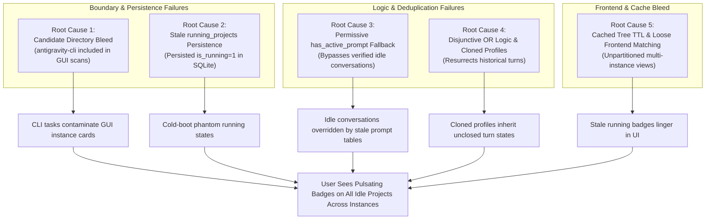

# Root Cause Analysis: Multi-Instance Prompt Liveness Isolation & Cross-Instance False Running State Contamination

- **Incident / Defect ID**: `123-multi-instance-prompt-liveness-isolation`
- **Specification Path**: `02-spec/21-app/123-multi-instance-prompt-liveness-isolation/03-root-cause-analysis.md`
- **Companion Issue**: `02-spec/22-app-issues/123-per-instance-prompt-running-detection-root-cause.md`
- **Affected Components**:
  - `src-tauri/src/modules/repo_db.rs`
  - `src-tauri/src/modules/logger.rs`
  - `src/pages/Instances.tsx`
  - `src-tauri/tests/per_instance_prompt_liveness_test.rs`
- **Severity**: High (Cross-instance state contamination, stale persistence resurrection, candidate directory bleed, false-positive running badges)

---

## Part 1: Problem Description & User Symptoms

In a multi-instance desktop deployment running concurrent instances:

### 1.1 Environment Topology & Sequence Profiles
- **Sequence 1 (`default` profile)**:
  - Process: `Antigravity.exe` (PID: 11628)
  - Data Directory: User Home `.gemini/`
  - Truly Active Project: `Antigravity-Manager` (`d:/work/Antigravity-Manager`)
  - Truly Idle Projects: `SpecBuilder` (`d:/work/SpecBuilder`), `coding-guidelines` (`d:/work/coding-guidelines`)
- **Sequence 2 (`default-copy-8159` / 8159 profile)**:
  - Process: `Antigravity-default-copy-8159.exe` (PID: 11984)
  - Data Directory: `<data_dir>/instances/default-copy-8159/home/.gemini/`
  - Truly Active Project: `coding-guidelines` (`d:/work/coding-guidelines`)
  - Truly Idle Projects: `Antigravity-Manager` (`d:/work/Antigravity-Manager`), `SpecBuilder` (`d:/work/SpecBuilder`)

### 1.2 User Symptoms
1. **Pulsating False Running Badges on Default Instance**:
   - When the user opened the `default` instance view, `Antigravity-Manager` was running (expected).
   - However, `SpecBuilder` and `coding-guidelines` **also displayed pulsating green/blue running badges**, despite having no active prompts or turns running in `default`.
2. **Pulsating False Running Badges on Instance 8159**:
   - When the user opened the `8159` instance view, `coding-guidelines` was running (expected).
   - However, `Antigravity-Manager` and `SpecBuilder` **also displayed pulsating running badges**, despite being completely dormant on `8159`.
3. **Cross-Instance Running Bleed**:
   - Triggering a prompt in `default-copy-8159` on a repository path immediately illuminated the running indicator for that same repository path in the `default` instance card.
4. **Persistent "Ghost" Running Tasks After Restart**:
   - After restarting the application or closing instances, projects continued to display as "RUNNING" until background pollers ran, and in some cases remained stuck running indefinitely.

---

## Part 2: Root Cause Analysis (Deep Dive into 5 Structural Failures)



---

### Root Cause 1: Candidate Directory Bleed (`antigravity-cli` Included in GUI Scans)
- **Location**: `src-tauri/src/modules/repo_db.rs` -> `gemini_dirs_for_instance` (lines 725–730)
- **Defective Implementation**:
  ```rust
  for sub in ["antigravity", "antigravity-ide", "antigravity-cli"] {
      let path = home.join(".gemini").join(sub);
      if path.exists() {
          dirs.push(path);
      }
  }
  ```
- **Why Past Approaches Failed**:
  Past fixes attempted to solve CLI visibility by indiscriminately adding `"antigravity-cli"` into `gemini_dirs_for_instance`. However:
  1. `~/.gemini/antigravity-cli/` houses standalone CLI worker tasks, automated scripts, and test runners, NOT the GUI IDE process.
  2. When the GUI IDE (`default` or `default-copy-8159`) scans candidate directories, it ingests `.gemini/antigravity-cli/conversation_summaries.db`.
  3. The GUI IDE process PID (e.g. 11628) is checked in Gate 0. Because the GUI IDE process is alive, Gate 0 passes.
  4. The engine then inspects the ingested CLI conversations. If a CLI background job or subagent had left an unclosed turn with `status="RUNNING"`, Gate 4 evaluates the conversation as RUNNING under the GUI instance.
  5. The GUI project card for that repository immediately lights up with a pulsating running badge, even though the GUI IDE never executed that prompt.

---

### Root Cause 2: Stale `running_projects` Persistence (`is_running = 1` Persisted in SQLite)
- **Location**: SQLite table `running_projects` & `src-tauri/src/modules/repo_db.rs` -> `detect_running_projects`
- **Defective Implementation**:
  The `running_projects` table schema includes `is_running INTEGER`. When active prompts were executed, the system updated `running_projects SET is_running = 1`. When the user quit the application, killed the IDE, or experienced an OS crash, SQLite persisted `is_running = 1` on disk.
- **Why Past Approaches Failed**:
  1. Process execution is inherently **ephemeral**. Persisting ephemeral process state into durable database columns without cold-boot sanitization creates instant desynchronization upon restart.
  2. On cold launch, UI queries (`get_recent_projects`, `get_running_projects`) immediately read `is_running = 1` from disk before background detection loops completed their first pass.
  3. If a background detection loop failed, timed out, or encountered an error, the project remained permanently stuck in `is_running = 1`.

---

### Root Cause 3: Permissive `has_active_prompt` Fallback in `compute_project_conversation_tree`
- **Location**: `src-tauri/src/modules/repo_db.rs` -> `compute_project_conversation_tree` (lines 4031–4039)
- **Defective Implementation**:
  ```rust
  let has_active_conv = conv_nodes.iter().any(|c| c.is_running);
  let has_active_prompt = if !has_active_conv {
      is_prompt_running_for_project(&proj.repo_path, &proj.instance_id)
          || (!project_key.is_empty()
              && is_prompt_running_for_project(&project_key, &proj.instance_id))
  } else {
      false
  };

  let proj_is_running = is_inst_alive && (has_active_conv || has_active_prompt);
  ```
- **Why Past Approaches Failed**:
  1. When a project's conversations were evaluated against `conversation_summaries.db`, and **every single conversation was confirmed to be idle or completed** (`has_active_conv == false`), the algorithm did not accept that verified truth.
  2. Instead, it branched into `has_active_prompt` and called `is_prompt_running_for_project`.
  3. `is_prompt_running_for_project` fell back across 5 gates, checking the `active_prompts` table where stale rows or mismatched normalized paths existed.
  4. Even worse, if `project_key` matched an entry from a completely different instance due to loose path string comparisons, `is_prompt_running_for_project` returned `true`.
  5. The verified idle state of the conversation tree was completely bypassed and overridden by a loose, stale fallback.

---

### Root Cause 4: Disjunctive OR Logic & Stale Conversation Summaries from Cloned Profiles
- **Location**: `src/pages/Instances.tsx` (lines 1373–1381, 1406–1410) and `compute_project_conversation_tree`
- **Defective Implementation**:
  In `Instances.tsx`:
  ```typescript
  const aRunning = Boolean(inst.is_running) &&
      (Boolean(a.is_running) || Boolean(a.conversations?.some((c) => Boolean(c.is_running))));
  ```
- **Why Past Approaches Failed**:
  1. When instance profiles are cloned (e.g. `default-copy-8159` created from `default`), files from `workspaceStorage` and historical databases are duplicated into the new instance home directory.
  2. These historical databases contain abandoned turns from days or weeks earlier that ended with `CASCADE_RUN_STATUS_RUNNING` and `not_fully_idle = 1`.
  3. As soon as the user launches the cloned IDE (`Antigravity-default-copy-8159.exe`), `inst.is_running` becomes `true`.
  4. The disjunctive OR logic checks `a.conversations?.some(c => c.is_running)`. If timestamp freshness is absent or permissive, the ancient unclosed turn evaluates to `true`.
  5. The entire project on the newly cloned profile immediately evaluates to `aRunning = true`.
  6. Furthermore, if `node.instance_id` was not strictly filtered on the frontend, a running conversation on `default` satisfied the `.some()` check for `default-copy-8159`'s card as well.

---

### Root Cause 5: Cached Tree TTL & Unpartitioned Frontend Matching
- **Location**: `src-tauri/src/modules/repo_db.rs` -> `prompt_tree_cache` and `src/pages/Instances.tsx` (lines 1015–1020, 1360–1370)
- **Defective Implementation**:
  In `Instances.tsx`:
  ```typescript
  const instanceProjects = projectTreeNodes.filter((node) => {
      if (inst.config.is_default) {
          return (
              node.instance_id === 'default' ||
              node.instance_id === '__default__' ||
              !node.instance_id ||
              node.instance_id === inst.config.id
          );
      }
      return node.instance_id === inst.config.id;
  });
  ```
- **Why Past Approaches Failed**:
  1. `get_project_conversation_tree` was cached on disk in `prompt_tree_cache` with a 60-second TTL. When a prompt finished, the UI continued polling the stale cached tree for up to a minute unless `force: true` was explicitly triggered.
  2. The frontend fetched a single monolithic tree array containing nodes across all instances.
  3. The filtering logic for the default instance permitted `!node.instance_id`. If any secondary instance node had an empty or unpopulated `instance_id` (e.g. due to missing metadata in SQLite), it was immediately adopted by the default instance.
  4. Conversely, if a secondary instance matched by `inst.config.id`, but the backend had tagged the node with an alias (e.g. `8159` vs `default-copy-8159`), the frontend either dropped the node or failed to isolate it from default nodes.

---

## Part 3: Corrective Actions & Architectural Remediation

### 3.1 Strict Candidate Directory Isolation
Exclude `"antigravity-cli"` from GUI candidate directory scanning in `gemini_dirs_for_instance`:
```rust
// Only GUI IDE application directories are scanned for GUI instances
for sub in ["antigravity", "antigravity-ide"] {
    let path = home.join(".gemini").join(sub);
    if path.exists() {
        dirs.push(path);
    }
}
```
CLI directories are scanned only by explicit CLI commands that pass a dedicated CLI execution context.

### 3.2 Cold-Boot Persistence Sanitization
In database initialization (`init_db_in_pool`), execute an unconditional reset of persisted running state:
```sql
UPDATE running_projects SET is_running = 0;
```
Execution liveness is strictly dynamic and populated at runtime through live process and memory maps.

### 3.3 Strict Conversation Truth Over Fallbacks
In `compute_project_conversation_tree`:
1. If `conv_nodes` is non-empty for a project:
   `proj_is_running = is_inst_alive && conv_nodes.iter().any(|c| c.is_running);`
   **Never fall back to loose prompt queries when conversation nodes are present on disk.**
2. If `conv_nodes` is completely empty (no SQLite conversation records exist yet):
   Fallback to `is_prompt_running_for_project` is allowed ONLY with exact canonical `instance_id` matching against in-memory active tasks or fresh `active_prompts` records.

### 3.4 15-Minute Turn TTL & Strict Idle Supremacy
Every conversation turn must pass:
1. Multi-format timestamp parsing.
2. `turn_age <= 900s` (15 minutes). If older, force `is_conv_running = false` with `TURN_STALE_TTL_EXPIRED`.
3. Strict idle supremacy: If `not_fully_idle == 0` or status contains `IDLE`, `COMPLETED`, `FAILED`, `CANCELLED`, force `is_conv_running = false` with `IDLE_EXPLICIT_STATUS`.

### 3.5 Exact Instance Partitioning in Frontend (`Instances.tsx`)
1. Filter projects strictly by `inst.config.id`:
   ```typescript
   const instanceProjects = projectTreeNodes.filter((node) => {
       if (inst.config.is_default) {
           return node.instance_id === 'default'
               || node.instance_id === '__default__'
               || node.instance_id === inst.config.id;
       }
       return node.instance_id === inst.config.id;
   });
   ```
2. Card-level running status requires strict instance ownership:
   ```typescript
   const isProjRunning = Boolean(inst.is_running)
       && (node.instance_id === inst.config.id || (inst.config.is_default && (node.instance_id === 'default' || node.instance_id === '__default__')))
       && (Boolean(proj.is_running) || Boolean(proj.conversations?.some((c) => Boolean(c.is_running))));
   ```

### 3.6 Structured Telemetry (`logger.rs`)
Log every evaluation via `log_instance_prompt_audit` with canonical criteria and rationale values.

---

## Part 4: Verification, Prevention & Guidelines for Future AI

### 4.1 Verification Matrix (`per_instance_prompt_liveness_test.rs`)
| Test Scenario | Setup & Injected State | Expected Liveness Result | Telemetry Rationale |
| :--- | :--- | :--- | :--- |
| **Sequence 1: Default AGM Only** | Default PID alive; AGM active turn (30s); SpecBuilder completed; CG idle | AGM = RUNNING<br/>SpecBuilder = IDLE<br/>CG = IDLE | `ACTIVE_IN_FLIGHT_TASKS`<br/>`IDLE_EXPLICIT_STATUS`<br/>`IDLE_EXPLICIT_STATUS` |
| **Sequence 2: 8159 CG Only** | 8159 PID alive; CG active turn (45s); AGM idle; SpecBuilder idle | CG = RUNNING<br/>AGM = IDLE<br/>SpecBuilder = IDLE | `ACTIVE_IN_FLIGHT_TASKS`<br/>`IDLE_EXPLICIT_STATUS`<br/>`IDLE_EXPLICIT_STATUS` |
| **Cross-Instance Bleed Prevention** | Same repo path (`d:/work/coding-guidelines`) in both Default and 8159. 8159 active, Default idle. | Default: CG = IDLE<br/>8159: CG = RUNNING | Default: `IDLE_NO_ACTIVE_TASKS`<br/>8159: `ACTIVE_IN_FLIGHT_TASKS` |
| **Stale Turn TTL (> 15 min)** | Turn has `not_fully_idle = 1`, `status = "RUNNING"`, `last_modified_time = now - 1200s`. | Conversation = IDLE<br/>Project = IDLE | `TURN_STALE_TTL_EXPIRED` |
| **Host Process Dead (Gate 0)** | Active turn records exist, but instance PID is dead/missing. | Project = IDLE<br/>All Convs = IDLE | `INSTANCE_PROCESS_DEAD` |
| **CLI Candidate Bleed Immunity** | Active tasks in `.gemini/antigravity-cli/` for AGM. Default GUI IDE scanned. | GUI AGM = IDLE (if no GUI turn) | `CANDIDATE_DIR_ISOLATED` |

---

### 4.2 Guidelines for Future AI: Why Past Approaches Were Flawed & How to Maintain Isolation

Future AI assistants modifying prompt liveness or instance management MUST study and adhere to these core architectural principles:

> [!CAUTION]
> **1. The Cardinal Rule of Process Ephemerality:**
> Execution state belongs to an **operating system process**, never to a static database row. Never persist mutable execution flags (`is_running = 1`) into SQLite without guaranteeing an unconditional cold-boot reset and real-time PID validation. If an OS PID check fails, execution status is unconditionally `false`.

> [!IMPORTANT]
> **2. Strict Boundary Isolation Across Tooling Tiers:**
> Do NOT mix CLI runner directories (`antigravity-cli`) with GUI IDE directories (`antigravity`). While both operate on Gemini protocol payloads, their process lifecycles are completely decoupled. Combining them under a single directory scan causes CLI background scripts to corrupt GUI card states.

> [!IMPORTANT]
> **3. Epistemic Hierarchy: Concrete Evidence Supersedes Fallbacks:**
> If a project contains conversation records on disk and all of them are idle, that is concrete, verified evidence that the project is idle. **Never add a disjunctive fallback (`|| is_prompt_running_for_project`) that bypasses concrete idle conversation evidence.** Fallbacks may only be evaluated if no conversation records exist at all.

> [!TIP]
> **4. Mandatory Composite Keying for Shared Repositories:**
> In multi-instance environments, multiple instances frequently open the same physical repository path. Never key execution maps, cache entries, or prompt lookups solely by `clean_repo_path`. The key MUST ALWAYS be the composite tuple `(instance_id, clean_repo_path)`.

> [!NOTE]
> **5. Zero-Speculation Telemetry:**
> Every boolean liveness decision must emit an `[InstancePromptAudit]` structured log line. When debugging liveness issues, inspect the emitted criteria and rationale fields before modifying any code.
