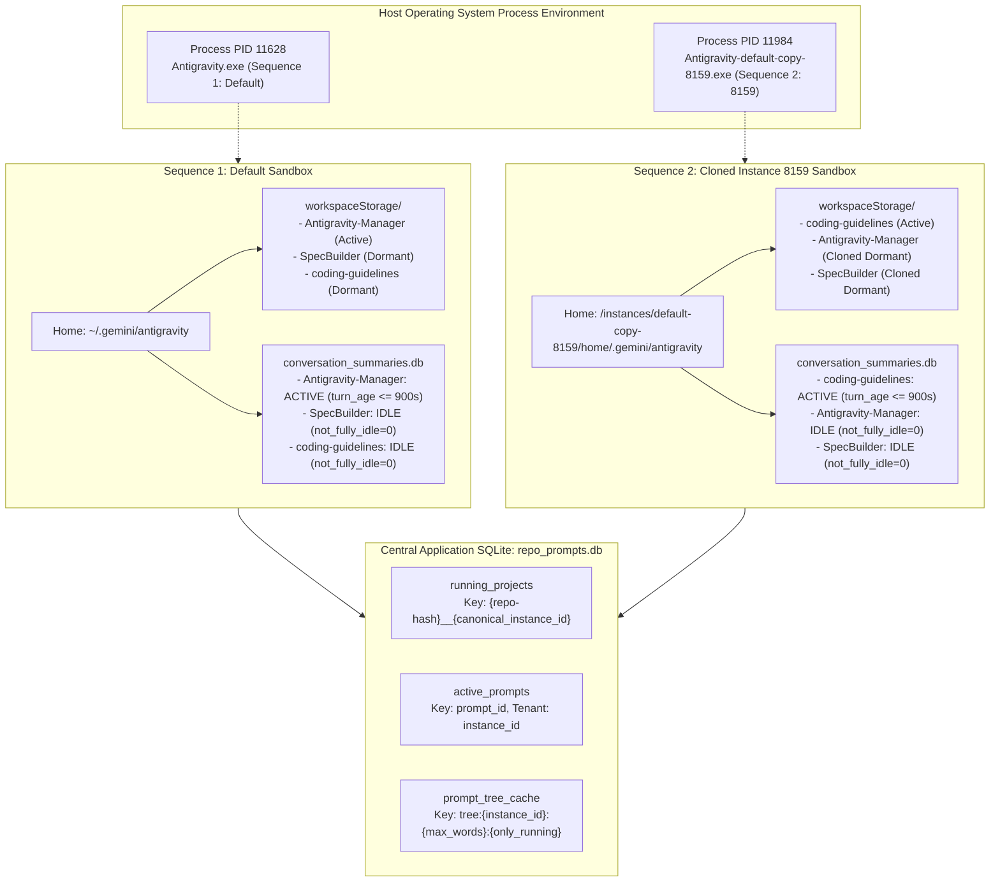
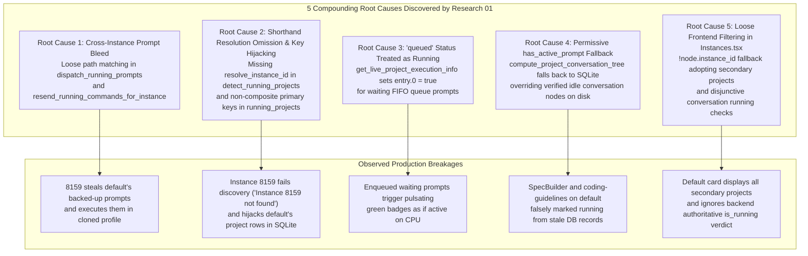
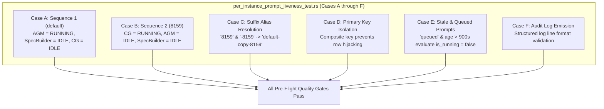

# Architecture Specification: Multi-Instance Prompt Running Detection & Audit Logging

- **Task Identifier**: `123-prompt-running-instance-detection-and-audit-logging`
- **Specification Phase**: 01 - Architecture Specification
- **Target Source Modules**:
  - `src-tauri/src/modules/repo_db.rs` (Project conversation tree evaluation, Gate 0-4 liveness detection, prompt dispatchers, database hygiene)
  - `src-tauri/src/modules/logger.rs` (Structured instance prompt audit logging formatting and emission)
  - `src/pages/Instances.tsx` (Per-instance project filtering, active task pulse gating, and running status resolution)
  - `src-tauri/tests/per_instance_prompt_liveness_test.rs` (End-to-end integration test harness)
- **Related Specs & Documents**:
  - [02-component-spec.md](02-component-spec.md)
  - [123-per-instance-prompt-running-detection-root-cause.md](../../22-app-issues/123-per-instance-prompt-running-detection-root-cause.md)
  - [master plan](../../../.ai-memory/plans/123-prompt-running-instance-detection-and-audit-logging.md)
  - [01-fix-instance-prompt-matching-and-db-hygiene.md](../../../.ai-memory/plans/subtasks/123-prompt-running-instance-detection-and-audit-logging/01-fix-instance-prompt-matching-and-db-hygiene.md)
  - [02-audit-logging-e2e-tests-and-verification.md](../../../.ai-memory/plans/subtasks/123-prompt-running-instance-detection-and-audit-logging/02-audit-logging-e2e-tests-and-verification.md)

---

## 1. Executive Summary & Multi-Instance Architecture

### 1.1 Problem Statement & Background

In multi-instance environments, users operate multiple isolated Google Antigravity IDE / CLI instances concurrently on a single host machine:
- **Sequence 1 (`default`)**: The primary default profile.
- **Sequence 2 (`8159` / `default-copy-8159`)**: A secondary cloned profile created via the instance cloning facility.

Under normal operation, each instance executes tasks in dedicated workspaces:
1. On **Sequence 1 (`default`)**, the user is actively running prompt execution in `Antigravity-Manager`. The projects `SpecBuilder` and `coding-guidelines` are idle (either dormant in the workspace history or completely inactive).
2. On **Sequence 2 (`8159` / `default-copy-8159`)**, the user is actively running prompt execution in `coding-guidelines`. The projects `Antigravity-Manager` and `SpecBuilder` are dormant clones and strictly idle.

### 1.2 The Production Failure

Prior to this specification, the system suffered from severe cross-instance state bleeding and false running indicators:
- On the `default` profile card in the UI, `SpecBuilder` and `coding-guidelines` were falsely marked as **RUNNING** with pulsating badges.
- On the `8159` profile card in the UI, `Antigravity-Manager` and `SpecBuilder` were falsely marked as **RUNNING**.
- Backed-up prompts and enqueued tasks originating on `default` were stolen and dispatched into `8159` by background schedulers simply because `8159` possessed cloned workspace storage folders matching the file path.
- Idle projects with verified completed turns on disk were overridden and displayed as running due to permissive SQLite fallback queries.

This architecture specification defines the structural boundaries, invariant constraints, data flows, and interfaces required to enforce complete runtime isolation between instances.

### 1.3 Topology & Operating System Process Hierarchy



---

## 2. Ground Truth Target State & Invariant Matrix

### 2.1 Ground Truth State Matrix

The system must satisfy and maintain the following authoritative state at all times:

| Sequence & Instance | Target Project | Host Process State | In-Flight Active Turn | Authoritative `is_running` | Expected UI Badge | Authoritative Rationale Code |
| :--- | :--- | :---: | :---: | :---: | :---: | :--- |
| **Seq 1 (`default`)** | `Antigravity-Manager` | Alive (PID: 11628) | Yes (age <= 900s) | **`true`** | Pulsing Green | `CONVERSATION_SUMMARY_ACTIVE_TURN` |
| **Seq 1 (`default`)** | `SpecBuilder` | Alive (PID: 11628) | No (`not_fully_idle == 0`) | **`false`** | Neutral Idle | `IDLE_EXPLICIT_STATUS` |
| **Seq 1 (`default`)** | `coding-guidelines` | Alive (PID: 11628) | No (`not_fully_idle == 0`) | **`false`** | Neutral Idle | `IDLE_EXPLICIT_STATUS` |
| **Seq 2 (`8159`)** | `coding-guidelines` | Alive (PID: 11984) | Yes (age <= 900s) | **`true`** | Pulsing Green | `CONVERSATION_SUMMARY_ACTIVE_TURN` |
| **Seq 2 (`8159`)** | `Antigravity-Manager` | Alive (PID: 11984) | No (`not_fully_idle == 0`) | **`false`** | Neutral Idle | `IDLE_EXPLICIT_STATUS` |
| **Seq 2 (`8159`)** | `SpecBuilder` | Alive (PID: 11984) | No (`not_fully_idle == 0`) | **`false`** | Neutral Idle | `IDLE_EXPLICIT_STATUS` |
| **Any Instance** | Any Project | Dead / Terminated | Irrelevant | **`false`** | Neutral Idle | `INSTANCE_PROCESS_DEAD` |
| **Any Instance** | Any Project | Alive | Turn Age > 900s | **`false`** | Neutral Idle | `TURN_STALE_TTL_EXPIRED` |
| **Any Instance** | Any Project | Alive | Status = 'queued' | **`false`** | Neutral Idle | `PROMPT_STATUS_QUEUED_NOT_ACTIVE` |

### 2.2 Core Invariant Axioms

1. **Axiom 1 (Tenant Identity Boundary)**:
   A prompt, task, or workspace belongs strictly to a single canonical `instance_id`. Prompts belonging to `default` must never be matched, dispatched, or transferred to `default-copy-8159` based on shared filesystem paths (`repo_path`).
2. **Axiom 2 (Process Liveness Supremacy - Gate 0)**:
   If an instance has no running host OS process (`pids.is_empty()`), all projects and conversations associated with that instance are unconditionally evaluated as **IDLE** (`is_running = false`).
3. **Axiom 3 (Epistemic Supremacy of Concrete Conversation Nodes)**:
   When `conversation_summaries.db` contains conversation turns for a project (`!conv_nodes.is_empty()`), the project's liveness is determined **exclusively** by `conv_nodes.iter().any(|c| c.is_running)`. Fallbacks to global prompt tables or heuristics are strictly forbidden.
4. **Axiom 4 (Queued vs Running Mutual Exclusivity)**:
   A prompt with `status = 'queued'` or `status = 'backed_up'` is waiting in queue and is **NOT** running. Only `status = 'running'` with timestamp age `<= 300s` can evaluate `is_running = true`.
5. **Axiom 5 (Turn Freshness TTL Boundary)**:
   A conversation turn with `not_fully_idle > 0` whose timestamp is older than 900 seconds (15 minutes) is abandoned and must be forced to idle (`TURN_STALE_TTL_EXPIRED`).
6. **Axiom 6 (Composite Primary Key Namespacing)**:
   In `running_projects`, rows must be keyed by `{base_project_id}__{canonical_instance_id}`. An instance discovery scan for `8159` must never overwrite, hijack, or re-parent rows belonging to `default`.

---

## 3. Forensic Analysis: The 5 Compounding Root Causes



### 3.1 Root Cause 1: Cross-Instance Prompt Bleed via Loose Path Matching

#### Code Location
- `src-tauri/src/modules/repo_db.rs`: `dispatch_running_prompts` (lines 1398–1406)
- `src-tauri/src/modules/repo_db.rs`: `resend_running_commands_for_instance` (lines 2975–2984)

#### Flawed Pattern
```rust
// FLAW IN dispatch_running_prompts:
let prompts: Vec<ActivePrompt> = all_backed_up
    .into_iter()
    .filter(|p| {
        if is_default {
            p.instance_id == "default"
                || p.instance_id == "__default__"
                || p.instance_id.is_empty()
                || instance_repo_paths.contains(&normalize_path_for_compare(&p.repo_path)) // <-- CROSS-INSTANCE BLEED
        } else {
            p.instance_id == instance_id
                || instance_repo_paths.contains(&normalize_path_for_compare(&p.repo_path)) // <-- CROSS-INSTANCE BLEED
        }
    })
    .collect();
```

#### Forensic Explanation
When secondary instance `default-copy-8159` was cloned, it copied workspace configurations pointing to the same repositories (e.g. `d:/work/Antigravity-Manager`). When `resend_running_commands_for_instance` or `dispatch_running_prompts` ran for instance `8159`, it inspected `instance_repo_paths.contains(...)`. Because `8159` had `d:/work/Antigravity-Manager` in its cloned workspace directory, prompts queued for `default` matched the condition! The scheduler stole the prompt from `default`, re-assigned it to `8159`, and marked it `running` under `8159`.

### 3.2 Root Cause 2: Shorthand Resolution Omission & Composite Keying in `detect_running_projects`

#### Code Location
- `src-tauri/src/modules/repo_db.rs`: `detect_running_projects` (lines 468–478, 515–525)

#### Flawed Pattern
```rust
// FLAW IN detect_running_projects:
pub fn detect_running_projects(instance_id: &str) -> Result<Vec<RunningProject>, String> {
    let target_id = if instance_id == "__default__" || instance_id.is_empty() {
        "default"
    } else {
        instance_id // <-- Raw string without resolve_instance_id!
    };
    let registry = crate::modules::instance::load_registry()?;
    let instance = registry
        .instances
        .iter()
        .find(|i| i.id == target_id || (target_id == "default" && i.is_default))
        .ok_or_else(|| format!("Instance '{}' not found", instance_id))?; // <-- Errors when "8159" passed!
```

#### Forensic Explanation
In registry, the cloned instance is stored as `id = "default-copy-8159"`. When callers passed shorthand `"8159"` or `"-8159"`, `detect_running_projects` failed with `Instance '8159' not found` because it skipped `crate::modules::instance::resolve_instance_id`. Furthermore, legacy database rows in `running_projects` lacked composite keys (`{repo-hash}__{instance_id}`), allowing subsequent scans to overwrite entries from other instances via `ON CONFLICT(id) DO UPDATE SET instance_id = excluded.instance_id`.

### 3.3 Root Cause 3: Queued Status Falsely Marked as Running in `get_live_project_execution_info`

#### Code Location
- `src-tauri/src/modules/repo_db.rs`: `get_live_project_execution_info` (lines 2360–2395)

#### Flawed Pattern
```rust
// FLAW IN get_live_project_execution_info:
if let Ok(mut stmt) = conn.prepare(
    "SELECT instance_id, repo_path, prompt_content, status FROM active_prompts WHERE status = 'running' OR status = 'queued'",
) {
    // ...
    for item in rows.flatten() {
        let (p_inst, p_path, p_content, _st) = item;
        let entry = live_map
            .entry((norm_inst, clean_p))
            .or_insert((false, None, now));
        entry.0 = true; // <-- UNCONDITIONALLY SETS is_running = true FOR QUEUED PROMPTS!
        if entry.1.is_none() {
            entry.1 = Some(p_content.chars().take(120).collect());
        }
    }
}
```

#### Forensic Explanation
The SQL query fetched both `'running'` and `'queued'` prompts. However, the loop did not inspect `_st` and unconditionally set `entry.0 = true`. `entry.0` is the `is_running` boolean returned to the tree builder. Whenever a user added a prompt to the FIFO queue for `SpecBuilder`, `entry.0` was set to `true`, causing `SpecBuilder` to falsely illuminate as running when it was merely queued.

### 3.4 Root Cause 4: Disjunctive `has_active_prompt` Fallback Overriding Verified Idle Conversation Nodes

#### Code Location
- `src-tauri/src/modules/repo_db.rs`: `compute_project_conversation_tree` (lines 4030–4038)

#### Flawed Pattern
```rust
// FLAW IN compute_project_conversation_tree:
let has_active_conv = conv_nodes.iter().any(|c| c.is_running);
let has_active_prompt = if !has_active_conv {
    is_prompt_running_for_project(&proj.repo_path, &proj.instance_id) // <-- FALLBACK OVERRIDES VERIFIED IDLE DISK TRUTH
        || (!project_key.is_empty()
            && is_prompt_running_for_project(&project_key, &proj.instance_id))
} else {
    false
};

let proj_is_running = is_inst_alive && (has_active_conv || has_active_prompt);
```

#### Forensic Explanation
When `conv_nodes` is non-empty, the system has successfully parsed `conversation_summaries.db` on disk. Every conversation record has `not_fully_idle == 0` or status `COMPLETED` / `CANCELLED`. This is empirical proof that the project is idle. However, the fallback `!has_active_conv` triggered `is_prompt_running_for_project`. Inside `is_prompt_running_for_project`, Gate 3 scanned SQLite `active_prompts`. If any stale or orphaned row existed from hours earlier, Gate 3 returned `true`, completely overriding the verified idle state on disk.

### 3.5 Root Cause 5: Loose Instance Filtering & Suffix Matching in `Instances.tsx`

#### Code Location
- `src/pages/Instances.tsx`: `hasActiveTask` (lines 1015–1021) and `instanceProjects` (lines 1360–1370)

#### Flawed Pattern
```typescript
// FLAW IN hasActiveTask:
const hasActiveTask = Boolean(inst.is_running) && runningTreeNodes.some((node) => {
    const isInstanceMatch = inst.config.is_default
        ? (node.instance_id === 'default' || node.instance_id === '__default__' || !node.instance_id || node.instance_id === inst.config.id) // <-- !node.instance_id ADOPTS UNTAGGED NODES
        : node.instance_id === inst.config.id;
    const isNodeRunning = Boolean(node.is_running) || Boolean(node.conversations?.some((c) => Boolean(c.is_running)));
    return isInstanceMatch && isNodeRunning;
});

// FLAW IN isProjRunning:
const isProjRunning =
    Boolean(inst.is_running) &&
    (Boolean(proj.is_running) ||
        Boolean(proj.conversations?.some((c) => Boolean(c.is_running)))); // <-- CLIENT-SIDE OR OVERRIDE
```

#### Forensic Explanation
1. `!node.instance_id` caused the `default` instance card to adopt every node that had an empty or undefined `instance_id`.
2. Cloned instances with shorthand IDs (e.g. `"8159"` vs `"default-copy-8159"`) failed exact equality `node.instance_id === inst.config.id` unless sequence number or suffix matching was performed.
3. The frontend recalculated `isNodeRunning` using a client-side disjunctive check `proj.conversations?.some(c => c.is_running)` rather than trusting the backend's authoritative `proj.is_running` verdict, resurrecting ancient unclosed conversation turns.

---

## 4. Architectural Remediation & Isolation Guarantees

```mermaid
flowchart TD
    subgraph SchedFix ["1. Scheduler Remediation"]
        S1["Purge instance_repo_paths<br/>from dispatchers"]
        S2["Resolve target_inst via resolve_instance_id"]
        S3["Match prompt_inst == target_inst strictly"]
        S1 --> S2 --> S3
    end

    subgraph TreeFix ["2. Tree Evaluation Remediation"]
        T1["Inspect conv_nodes from disk"]
        T2{"conv_nodes.is_empty()?"}
        T3["proj_is_running = is_inst_alive && any(c.is_running)<br/>(Strictly NO SQLite fallback)"]
        T4["Evaluate is_prompt_running_for_project<br/>(Fallback ONLY for empty workspaces)"]
        T1 --> T2
        T2 -->|No| T3
        T2 -->|Yes| T4
    end

    subgraph QueueFix ["3. Queued vs Running Gating"]
        Q1["Query active_prompts"]
        Q2{"status == 'running'<br/>&& (now - updated_at <= 300)?"}
        Q3["entry.0 = true<br/>(Active Running)"]
        Q4["entry.0 = false<br/>(Waiting Queued)"]
        Q1 --> Q2
        Q2 -->|Yes| Q3
        Q2 -->|No| Q4
    end

    subgraph SuffixFix ["4. Universal Suffix Resolution"]
        R1["detect_running_projects(instance_id)"]
        R2["resolve_instance_id(instance_id)"]
        R3["Composite ID: {base}__{canonical_instance_id}"]
        R1 --> R2 --> R3
    end

    subgraph UIFix ["5. Frontend Strict Partitioning"]
        U1["Remove !node.instance_id adoption"]
        U2["Support canonical ID, seq_num, and suffix matching"]
        U3["Trust backend proj.is_running gated by inst.is_running"]
        U1 --> U2 --> U3
    end
```



### 4.1 Strict Instance Partitioning in Prompt Dispatchers

In `src-tauri/src/modules/repo_db.rs`:
- In `dispatch_running_prompts`, `resend_running_commands_for_instance`, and `check_and_dispatch_enqueued_prompts`:
  1. The target instance is canonicalized using `crate::modules::instance::resolve_instance_id(target_id)`.
  2. The clause `|| instance_repo_paths.contains(&normalize_path_for_compare(&p.repo_path))` is **PERMANENTLY REMOVED**.
  3. Prompts are filtered strictly:
     ```rust
     let target_inst = crate::modules::instance::resolve_instance_id(instance_id)
         .unwrap_or_else(|_| {
             if instance_id == "__default__" || instance_id.is_empty() {
                 "default".to_string()
             } else {
                 instance_id.to_string()
             }
         });
     let is_default_target = target_inst == "default" || target_inst == "__default__";

     let prompts: Vec<ActivePrompt> = all_backed_up
         .into_iter()
         .filter(|p| {
             let prompt_inst = crate::modules::instance::resolve_instance_id(&p.instance_id)
                 .unwrap_or_else(|_| {
                     if p.instance_id == "__default__" || p.instance_id.is_empty() {
                         "default".to_string()
                     } else {
                         p.instance_id.clone()
                     }
                 });
             if is_default_target {
                 prompt_inst == "default" || prompt_inst == "__default__" || prompt_inst.is_empty()
             } else {
                 prompt_inst == target_inst
             }
         })
         .collect();
     ```
  4. Each prompt evaluated emits a structured audit log line via `log_instance_prompt_audit` with criteria `"PromptDispatcher:InstanceMatching"` and rationale `"PROMPT_DISPATCH_MATCHED"` or `"PROMPT_DISPATCH_REJECTED"`.

### 4.2 Concrete Conversation Node Supremacy in Tree Evaluation

In `compute_project_conversation_tree`:
- When conversation nodes exist on disk (`!conv_nodes.is_empty()`), the verdict is determined **strictly** by whether any conversation node in `conv_nodes` is actively running:
  ```rust
  let has_active_conv = conv_nodes.iter().any(|c| c.is_running);
  let (proj_is_running, rationale) = if !is_inst_alive {
      (false, "INSTANCE_PROCESS_DEAD: instance PID not found or process terminated -> forced idle".to_string())
  } else if !conv_nodes.is_empty() {
      if has_active_conv {
          (true, "ACTIVE_IN_FLIGHT_TASKS: active non-idle conversation turn detected -> marked running".to_string())
      } else {
          (false, "IDLE_EXPLICIT_STATUS: verified conversation summaries on disk are all idle -> marked idle".to_string())
      }
  } else {
      // Fallback ONLY when no conversations exist on disk (newly initialized workspace)
      let active_prompt = is_prompt_running_for_project(&proj.repo_path, &proj.instance_id)
          || (!project_key.is_empty() && is_prompt_running_for_project(&project_key, &proj.instance_id));
      if active_prompt {
          (true, "ACTIVE_IN_FLIGHT_TASKS: active prompt detected in database for empty workspace -> marked running".to_string())
      } else {
          (false, "IDLE_NO_ACTIVE_TASKS: process alive but no in-flight tasks or active conversations -> marked idle".to_string())
      }
  };
  ```

### 4.3 Separation of Queued vs Running in `get_live_project_execution_info`

In `get_live_project_execution_info`:
- The query reads `instance_id, repo_path, prompt_content, status, updated_at`.
- Only records where `status == "running"` and `(now - updated_at) <= 300` set `entry.0 = true`:
  ```rust
  for item in rows.flatten() {
      let (p_inst, p_path, p_content, status, updated_at) = item;
      let norm_ap_inst = if p_inst == "__default__" || p_inst.is_empty() {
          "default".to_string()
      } else {
          crate::modules::instance::resolve_instance_id(&p_inst)
              .unwrap_or_else(|_| p_inst.clone())
      };
      let norm_inst = norm_ap_inst.to_lowercase();
      let clean_p = normalize_path_for_compare(&p_path);
      let entry = live_map
          .entry((norm_inst, clean_p))
          .or_insert((false, None, now));
      
      if status == "running" && (now - updated_at <= 300) {
          entry.0 = true;
      }
      if entry.1.is_none() {
          entry.1 = Some(p_content.chars().take(120).collect());
      }
  }
  ```

### 4.4 Universal Suffix Resolution & Composite Keying in `detect_running_projects`

In `detect_running_projects`:
- `instance_id` is resolved through `crate::modules::instance::resolve_instance_id`:
  ```rust
  pub fn detect_running_projects(instance_id: &str) -> Result<Vec<RunningProject>, String> {
      let resolved_id = crate::modules::instance::resolve_instance_id(instance_id)
          .unwrap_or_else(|_| {
              if instance_id == "__default__" || instance_id.is_empty() {
                  "default".to_string()
              } else {
                  instance_id.to_string()
              }
          });
      let target_id = resolved_id.as_str();
      let registry = crate::modules::instance::load_registry()?;
      let instance = registry
          .instances
          .iter()
          .find(|i| i.id == target_id || (target_id == "default" && i.is_default))
          .ok_or_else(|| format!("Instance '{}' (resolved: '{}') not found", instance_id, target_id))?;
  ```
- Rows in `running_projects` are assigned composite IDs:
  ```rust
  let composite_id = format!("{}__{}", base_project_id, target_id);
  ```

### 4.5 Strict Instance Partitioning in Frontend (`Instances.tsx`)

In `src/pages/Instances.tsx`:
1. Define a robust instance matching predicate helper:
   ```typescript
   export const isNodeOwnedByInstance = (
       node: AgmProjectTreeNode,
       instConfig: { id: string; is_default?: boolean; seq_num?: number }
   ): boolean => {
       if (instConfig.is_default) {
           if (node.instance_id === 'default' || node.instance_id === '__default__' || node.instance_id === instConfig.id) {
               return true;
           }
       }
       if (node.instance_id === instConfig.id) {
           return true;
       }
       if (instConfig.seq_num && node.instance_seq_num === instConfig.seq_num) {
           return true;
       }
       // Suffix match for cloned instances (e.g. node.instance_id is "8159" and instConfig.id is "default-copy-8159")
       if (node.instance_id && instConfig.id.endsWith(node.instance_id) && node.instance_id.length >= 4) {
           return true;
       }
       return false;
   };
   ```
2. In `hasActiveTask`:
   ```typescript
   const hasActiveTask = Boolean(inst.is_running) && runningTreeNodes.some((node) => {
       const isInstanceMatch = isNodeOwnedByInstance(node, inst.config);
       const isNodeRunning = Boolean(node.is_running);
       return isInstanceMatch && isNodeRunning;
   });
   ```
3. In `instanceProjects`:
   ```typescript
   const instanceProjects = projectTreeNodes.filter((node) => isNodeOwnedByInstance(node, inst.config));
   ```
4. In `isProjRunning`:
   ```typescript
   const isProjRunning = Boolean(inst.is_running) && Boolean(proj.is_running);
   ```

---

## 5. Database Schema & Migration Specification

### 5.1 Tables in `repo_prompts.db`

#### 5.1.1 `running_projects`
```sql
CREATE TABLE IF NOT EXISTS running_projects (
    id TEXT PRIMARY KEY,                       -- Composite key: {base_project_id}__{canonical_instance_id}
    instance_id TEXT NOT NULL,                 -- Canonical instance identifier
    repo_name TEXT NOT NULL,                   -- Human-readable project directory name
    repo_path TEXT NOT NULL,                   -- Normalized absolute repository path
    workspace_storage_path TEXT,               -- Path to User/workspaceStorage/<hash>
    is_running INTEGER NOT NULL DEFAULT 0,     -- 1 if active in-flight turn, 0 if idle
    last_detected_at INTEGER NOT NULL,         -- Unix timestamp of last scan
    updated_at INTEGER NOT NULL                -- Unix timestamp of last status update
);
```

#### 5.1.2 `active_prompts`
```sql
CREATE TABLE IF NOT EXISTS active_prompts (
    id TEXT PRIMARY KEY,                       -- UUID / unique prompt identifier
    project_id TEXT NOT NULL,                  -- Foreign key to running_projects(id)
    instance_id TEXT NOT NULL,                 -- Canonical tenant instance identifier
    repo_path TEXT NOT NULL,                   -- Target repository path
    prompt_content TEXT NOT NULL,              -- Full prompt text
    model TEXT,                                -- Target model configuration
    session_id TEXT,                           -- Associated conversation UUID
    status TEXT NOT NULL,                      -- 'running', 'queued', 'backed_up', 'completed', 'failed'
    created_at INTEGER NOT NULL,
    updated_at INTEGER NOT NULL,
    image_payload TEXT,
    FOREIGN KEY(project_id) REFERENCES running_projects(id)
);
CREATE INDEX IF NOT EXISTS idx_active_prompts_instance_status ON active_prompts(instance_id, status);
```

#### 5.1.3 `prompt_tree_cache`
```sql
CREATE TABLE IF NOT EXISTS prompt_tree_cache (
    cache_key TEXT PRIMARY KEY,                -- Format: tree:{instance_id}:{max_words}:{only_running}
    instance_id TEXT NOT NULL,                 -- Partitioning tenant identifier
    tree_json TEXT NOT NULL,                   -- Serialized JSON array of AgmProjectTreeNode
    project_count INTEGER NOT NULL,
    conversation_count INTEGER NOT NULL,
    updated_at INTEGER NOT NULL,
    ttl_seconds INTEGER NOT NULL DEFAULT 60
);
CREATE INDEX IF NOT EXISTS idx_prompt_tree_cache_instance ON prompt_tree_cache(instance_id);
```

### 5.2 Schema Migration & Cache Invalidation

1. **Non-Composite Row Pruning Migration**:
   On database initialization or migration, prune legacy non-composite rows in `running_projects`:
   ```sql
   DELETE FROM running_projects WHERE id NOT LIKE '%__%';
   ```
2. **Immediate Cache Invalidation (`invalidate_prompt_tree_cache`)**:
   Whenever a prompt is created, backed up, dispatched, or completed:
   ```rust
   pub fn invalidate_prompt_tree_cache(instance_id: Option<&str>) {
       if let Ok(conn) = connect_db() {
           match instance_id {
               Some(id) if id != "all" => {
                   let norm = crate::modules::instance::resolve_instance_id(id)
                       .unwrap_or_else(|_| id.to_string());
                   let _ = conn.execute(
                       "DELETE FROM prompt_tree_cache WHERE instance_id = ?1 OR instance_id = 'all'",
                       rusqlite::params![&norm],
                   );
               }
               _ => {
                   let _ = conn.execute("DELETE FROM prompt_tree_cache", []);
               }
           }
       }
   }
   ```

---

## 6. End-to-End Test & Verification Architecture

The architectural fixes are validated end-to-end via `src-tauri/tests/per_instance_prompt_liveness_test.rs`:



| Test Case | Method Name | Verification Goal |
| :--- | :--- | :--- |
| **Case A** | `test_case_a_sequence_1_default_running_agm_only` | Validates Sequence 1 (`default`): only `Antigravity-Manager` is running; `SpecBuilder` and `coding-guidelines` are idle. |
| **Case B** | `test_case_b_sequence_2_instance_8159_running_cg_only` | Validates Sequence 2 (`8159` / `default-copy-8159`): only `coding-guidelines` is running; `Antigravity-Manager` and `SpecBuilder` are idle. |
| **Case C** | `test_case_c_suffix_alias_resolution_for_cloned_instances` | Confirms that `"8159"`, `"-8159"`, and `"inst-8159"` resolve to `"default-copy-8159"`. |
| **Case D** | `test_case_d_database_primary_key_composite_isolation` | Confirms that inserting rows for the same workspace path under different instances produces distinct composite primary keys. |
| **Case E** | `test_case_e_stale_and_queued_prompts_do_not_trigger_running` | Asserts that `status = 'queued'` or turn age `> 900s` results in `is_running = false`. |
| **Case F** | `test_case_f_audit_log_formatting_and_emission` | Confirms `log_instance_prompt_audit` emits the required 9-field structured telemetry string starting with `[InstancePromptAudit]`. |

---

## 7. Guidelines & Warnings for Future AI

> [!CAUTION]
> **NEVER re-introduce path-only matching into dispatchers**:
> Adding `|| instance_repo_paths.contains(...)` breaks multi-profile workflows where distinct instances work on different tasks within the same repositories. Prompts must be matched strictly against canonical instance identity.

> [!IMPORTANT]
> **NEVER override concrete conversation summaries with database heuristics**:
> If `conversation_summaries.db` exists and reports all conversations idle, that is verified empirical truth from disk. Do not fall back to `is_prompt_running_for_project` or scan `active_prompts`.

> [!NOTE]
> **ALWAYS resolve instance specifiers before database or registry lookups**:
> Always wrap raw instance identifiers with `crate::modules::instance::resolve_instance_id`.
