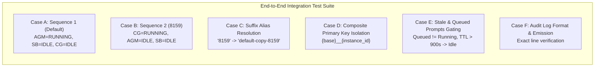

# Component Specification: Structured Audit Logging & End-to-End Verification

- **Task Slug**: `123-prompt-running-instance-detection-and-audit-logging`
- **Specification Phase**: 02 - Component Specification & Test Verification
- **Target Source Modules**:
  - `src-tauri/src/modules/logger.rs` (Audit log formatting and emission)
  - `src-tauri/src/modules/repo_db.rs` (Tree evaluation, Gate 0-4 liveness detection, prompt dispatchers)
  - `src-tauri/tests/per_instance_prompt_liveness_test.rs` (Multi-instance E2E test harness)
- **Related Specs & Plans**:
  - [01-architecture-spec.md](01-architecture-spec.md)
  - [master plan](../../../.ai-memory/plans/123-prompt-running-instance-detection-and-audit-logging.md)
  - [02-audit-logging-e2e-tests-and-verification.md](../../../.ai-memory/plans/subtasks/123-prompt-running-instance-detection-and-audit-logging/02-audit-logging-e2e-tests-and-verification.md)

---

## 1. Executive Summary & Component Objectives

The multi-instance prompt liveness detection subsystem enforces strict runtime isolation between concurrent Google Antigravity instances:
1. **Sequence 1 (`default`)**: Default profile running `Antigravity-Manager` exclusively, with `SpecBuilder` and `coding-guidelines` strictly evaluated as **IDLE**.
2. **Sequence 2 (`8159` / `default-copy-8159`)**: Cloned secondary profile running `coding-guidelines` exclusively, with `Antigravity-Manager` and `SpecBuilder` strictly evaluated as **IDLE**.

To eliminate cross-instance prompt bleeding, false running states, and silent dispatch misallocations, this component specification establishes:
- **Comprehensive Structured Audit Logging**: Mandatory telemetry hooks at every critical decision boundary in `compute_project_conversation_tree`, `is_prompt_running_for_project` (Gates 0 through 4), and prompt dispatchers (`dispatch_running_prompts`, `resend_running_commands_for_instance`, `check_and_dispatch_enqueued_prompts`).
- **Complete Taxonomy**: Standardized criteria identifiers and deterministic rationale codes.
- **End-to-End Test Suite**: Concrete integration test architecture in `src-tauri/tests/per_instance_prompt_liveness_test.rs` covering Cases A through F in a multi-instance sandbox.

---

## 2. Structured Audit Logging Specification

### 2.1 Logger Module Integration (`logger.rs`)

Audit logs are emitted through `crate::modules::logger::log_instance_prompt_audit` and formatted via `format_instance_prompt_audit`.

#### 2.1.1 Function Signature
```rust
pub fn log_instance_prompt_audit(
    instance_id: &str,
    resolved_name: &str,
    project_name: &str,
    repo_path: &str,
    db_path_evaluated: &str,
    process_pid: Option<u32>,
    criteria_evaluated: &str,
    is_running: bool,
    rationale: &str,
);
```

#### 2.1.2 Formatted Log Line Structure
```text
[InstancePromptAudit] instance_id='{instance_id}' resolved_name='{resolved_name}' project='{project_name}' repo_path='{repo_path}' db_path='{db_path_evaluated}' pid={process_pid} criteria='{criteria_evaluated}' is_running={is_running} rationale='{rationale}'
```

- When `process_pid` is `Some(pid)`, `pid={pid}` is rendered.
- When `process_pid` is `None`, `pid=none` is rendered.
- All string parameters are single-quoted to guarantee robust machine parsing and log scraping.
- `is_running` is rendered as raw lowercase boolean `true` or `false`.

---

### 2.2 Mandatory Audit Logging Points in `repo_db.rs`

```mermaid
flowchart TD
    subgraph TreeEval ["1. Tree Evaluation: compute_project_conversation_tree"]
        P1["Iterate Instance Project"] --> P2{"Conv Nodes & Active Prompt"}
        P2 --> P3["log_instance_prompt_audit<br/>criteria: ProjectConversationTreeLiveness"]
    end

    subgraph GateLiveness ["2. Gate Evaluation: is_prompt_running_for_project"]
        G0["Gate 0: Host Process Alive?"] -->|Dead| G0Log["log_instance_prompt_audit<br/>criteria: Gate0:HostProcessLiveness<br/>rationale: INSTANCE_PROCESS_DEAD"]
        G0 -->|Alive| G1["Gate 1: Memory Prompts Map"]
        G1 -->|Hit| G1Log["log_instance_prompt_audit<br/>criteria: Gate1:MemoryPromptsMap"]
        G1 -->|Miss| G2["Gate 2: Active AGY Workers"]
        G2 -->|Hit| G2Log["log_instance_prompt_audit<br/>criteria: Gate2:ActiveAgyWorkers"]
        G2 -->|Miss| G3["Gate 3: Active Prompts SQLite"]
        G3 -->|Hit| G3Log["log_instance_prompt_audit<br/>criteria: Gate3:ActivePromptsSQLite"]
        G3 -->|Miss| G4["Gate 4: Candidate Dirs & Summaries DB"]
        G4 --> G4Scan["Evaluate Turns & TTL"]
        G4Scan -->|Active Turn| G4Log["log_instance_prompt_audit<br/>criteria: Gate4:ConversationSummariesLiveTurn"]
        G4Scan -->|No Active Turn| FallLog["log_instance_prompt_audit<br/>criteria: Gate0-4:AllEvaluationsCompleted<br/>rationale: IDLE_NO_ACTIVE_TASKS"]
    end

    subgraph Dispatch ["3. Prompt Dispatchers"]
        D1["Scan Prompts to Dispatch"] --> D2{"Prompt instance_id == target_instance?"}
        D2 -->|Match| DMatch["log_instance_prompt_audit<br/>criteria: PromptDispatcher:InstanceMatching<br/>rationale: PROMPT_DISPATCH_MATCHED"]
        D2 -->|Mismatch| DReject["log_instance_prompt_audit<br/>criteria: PromptDispatcher:InstanceMatching<br/>rationale: PROMPT_DISPATCH_REJECTED"]
    end
```



#### 2.2.1 Audit Point 1: Project Node Verdict in `compute_project_conversation_tree`
- **Location**: `compute_project_conversation_tree` right after `proj_is_running` and `rationale` calculation (lines ~4080–4095).
- **Trigger**: Every project inspected during tree generation, regardless of whether `only_running` is active.
- **Arguments**:
  - `instance_id`: `&proj.instance_id` (canonical instance identifier)
  - `resolved_name`: `&instance_name` (e.g. `"Default Profile"` or `"Instance 8159"`)
  - `project_name`: `&proj.repo_name`
  - `repo_path`: `&proj.repo_path`
  - `db_path_evaluated`: `proj.workspace_storage_path.as_deref().unwrap_or("none")`
  - `process_pid`: `inst_pid` (`Option<u32>`)
  - `criteria_evaluated`: `"ProjectConversationTreeLiveness"`
  - `is_running`: `proj_is_running`
  - `rationale`: `&rationale`
- **Mandatory Decision Logging**: If `proj_is_running` is `false`, the rationale MUST explicitly indicate whether it was forced idle due to dead process (`INSTANCE_PROCESS_DEAD`), explicit idle turns (`IDLE_EXPLICIT_STATUS`), stale turn TTL (`TURN_STALE_TTL_EXPIRED`), or lack of in-flight tasks (`IDLE_NO_ACTIVE_TASKS`).

#### 2.2.2 Audit Point 2: Gate Evaluations in `is_prompt_running_for_project`
- **Location**: `is_prompt_running_for_project(project_id: &str, instance_id: &str)`.
- **Mandatory Logging Transitions**:
  1. **Gate 0 Interception**:
     - `criteria_evaluated`: `"Gate0:HostProcessLiveness"`
     - `is_running`: `false`
     - `rationale`: `"INSTANCE_PROCESS_DEAD"`
     - `db_path_evaluated`: `"process_table"`
  2. **Gate 1 Memory Match**:
     - `criteria_evaluated`: `"Gate1:MemoryPromptsMap"`
     - `is_running`: `true`
     - `rationale`: `"ACTIVE_PROMPT_MEMORY"`
     - `db_path_evaluated`: `"memory_prompts_map"`
  3. **Gate 2 Worker Subprocess Match**:
     - `criteria_evaluated`: `"Gate2:ActiveAgyWorkers"`
     - `is_running`: `true`
     - `rationale`: `"ACTIVE_WORKER_MATCHED"`
     - `db_path_evaluated`: `"active_agy_workers_map"`
  4. **Gate 3 Active Prompts SQLite Match**:
     - `criteria_evaluated`: `"Gate3:ActivePromptsSQLite"`
     - `is_running`: `true`
     - `rationale`: `"ACTIVE_PROMPT_DB_RUNNING"`
     - `db_path_evaluated`: `"active_prompts_table"`
     - *Constraint*: Only records with `status = 'running'` and `updated_at >= now - 300` are permitted to evaluate as `true`. Stale or `'queued'` records are ignored.
  5. **Gate 4 Candidate Directory Discovery & Summaries Evaluation**:
     - Evaluation of each candidate folder resolved via `gemini_dirs_for_instance(norm_inst)` or `gemini_dirs_tagged(Some(norm_inst))`.
     - When an active running turn matches the target project:
       - `criteria_evaluated`: `"Gate4:ConversationSummariesLiveTurn"`
       - `is_running`: `true`
       - `rationale`: `"CONVERSATION_SUMMARY_ACTIVE_TURN"`
       - `db_path_evaluated`: path to `conversation_summaries.db`
  6. **Gate 0–4 Completion (All Evaluations Idle)**:
     - `criteria_evaluated`: `"Gate0-4:AllEvaluationsCompleted"`
     - `is_running`: `false`
     - `rationale`: `"IDLE_NO_ACTIVE_TASKS"`
     - `db_path_evaluated`: `"all_evaluated_databases"`

#### 2.2.3 Audit Point 3: Prompt Dispatchers Instance Matching
- **Locations**:
  - `dispatch_running_prompts(instance_id: &str)`
  - `resend_running_commands_for_instance(target_instance: Option<&str>)`
  - `check_and_dispatch_enqueued_prompts(target_instance: Option<&str>)`
- **Mandatory Logging Point**: During prompt filtering and candidate selection.
- **Criteria**: `"PromptDispatcher:InstanceMatching"`
- **Evaluation Rules**:
  - Prompts must be matched strictly against canonical `instance_id`.
  - Path-only matching is **STRICTLY PROHIBITED**. A backed-up prompt originating on `default` cannot be dispatched to `default-copy-8159` simply because `default-copy-8159` has cloned workspace folders for that repository.
  - **Matched Action**:
    - `is_running`: `false` (prompt being dispatched)
    - `rationale`: `format!("PROMPT_DISPATCH_MATCHED: prompt '{}' instance '{}' matches target '{}'", prompt.id, prompt.instance_id, target_inst)`
  - **Rejected Action**:
    - `is_running`: `false`
    - `rationale`: `format!("PROMPT_DISPATCH_REJECTED: instance mismatch (prompt instance '{}' != target '{}')", prompt.instance_id, target_inst)`

---

### 2.3 Comprehensive Criteria Taxonomy

The following criteria string constants are defined and strictly adhered to across all audit logging invocations:

| Criteria String Constant | Module / Function Context | Description |
| :--- | :--- | :--- |
| `"ProjectConversationTreeLiveness"` | `compute_project_conversation_tree` | Evaluates final aggregate liveness of a project node in the conversation tree. |
| `"Gate0:HostProcessLiveness"` | `is_prompt_running_for_project` (Gate 0) | Host IDE / CLI OS process existence check via PID table and sysinfo. |
| `"Gate1:MemoryPromptsMap"` | `is_prompt_running_for_project` (Gate 1) | In-memory active prompts mutex map query with 300s TTL. |
| `"Gate2:ActiveAgyWorkers"` | `is_prompt_running_for_project` (Gate 2) | In-memory AGY worker subprocess process ID check. |
| `"Gate3:ActivePromptsSQLite"` | `is_prompt_running_for_project` (Gate 3) | Persistent SQLite `active_prompts` query for `status = 'running'`. |
| `"Gate4:CandidateDirectoryResolution"` | `is_prompt_running_for_project` (Gate 4) | Resolution of instance-scoped candidate Gemini folders (CLI vs GUI isolation). |
| `"Gate4:ConversationSummariesLiveTurn"` | `is_prompt_running_for_project` (Gate 4) | Evaluation of turn freshness and non-idle status in `conversation_summaries.db`. |
| `"Gate0-4:AllEvaluationsCompleted"` | `is_prompt_running_for_project` (Termination) | Fallthrough when all gates complete and project is confirmed idle. |
| `"PromptDispatcher:InstanceMatching"` | `dispatch_running_prompts`, `resend_running_commands_for_instance` | Verification that a prompt belongs to the instance before dispatch. |
| `"WorkspaceStorageScan"` | `detect_running_projects` | Initial discovery scan of workspaceStorage folders per instance. |

---

### 2.4 Comprehensive Rationale Taxonomy

The following rationale string codes represent the authoritative set of decision justifications:

| Rationale Code | Polarity | Detailed Semantic Meaning |
| :--- | :---: | :--- |
| `"INSTANCE_PROCESS_DEAD"` | `false` | Host OS process is not running or PID terminated; project unconditionally forced idle. |
| `"IDLE_NO_ACTIVE_TASKS"` | `false` | Host process is alive, but no active turns, running tasks, or active prompts exist. |
| `"IDLE_EXPLICIT_STATUS"` | `false` | Explicit idle condition met: `not_fully_idle == 0` or status contains `IDLE`, `COMPLETED`, `FAILED`, `CANCELLED`. |
| `"TURN_STALE_TTL_EXPIRED"` | `false` | Turn has `not_fully_idle > 0` but `turn_age > 900s` (15 minutes); forced idle due to staleness. |
| `"PROMPT_STATUS_QUEUED_NOT_ACTIVE"`| `false` | Prompt exists in DB with `status = 'queued'`; queued prompts are waiting and NOT running. |
| `"ACTIVE_IN_FLIGHT_TASKS"` | `true` | Real-time active prompt execution confirmed with live OS process and recent timestamp. |
| `"ACTIVE_PROMPT_MEMORY"` | `true` | Verified in-memory prompt currently executing with `status = 'running'`. |
| `"ACTIVE_WORKER_MATCHED"` | `true` | Verified active AGY worker subprocess PID running on host system. |
| `"ACTIVE_PROMPT_DB_RUNNING"` | `true` | SQLite `active_prompts` row verified with `status = 'running'` and updated within 300s. |
| `"CONVERSATION_SUMMARY_ACTIVE_TURN"`| `true` | Non-idle active turn verified in `conversation_summaries.db` with age `<= 900s`. |
| `"PROMPT_DISPATCH_MATCHED"` | `N/A` | Prompt's instance matches target instance; permitted for dispatch. |
| `"PROMPT_DISPATCH_REJECTED"` | `N/A` | Prompt rejected for dispatch because it belongs to a different instance. |
| `"CANDIDATE_DIR_ISOLATED"` | `N/A` | Candidate directory filtered out due to instance boundary isolation. |

---

## 3. End-to-End Test Suite Specification (`per_instance_prompt_liveness_test.rs`)

### 3.1 Test Architecture & Sandbox Environment

The integration test suite in `src-tauri/tests/per_instance_prompt_liveness_test.rs` validates the complete detection and isolation pipeline using isolated, temporary filesystem structures (`tempfile::tempdir()`).

#### 3.1.1 Environment Isolation Invariants
1. **Isolated Data Directory**: Set `ABV_DATA_DIR` to the temp directory to redirect SQLite database locations and instances registry.
2. **Deterministic Time Base**: Use RFC 3339 timestamps relative to `Utc::now()`.
3. **No Process Pollution**: Mock OS process checks or use current process PID (`std::process::id()`) for positive process liveness and non-existent PIDs (e.g. `999999`) for dead process checks.
4. **Clean Restoration**: Restore `ABV_DATA_DIR` at the end of each test execution.

---

### 3.2 Test Cases Matrix (Cases A through F)



#### 3.2.1 Case A: Sequence 1 (`default`) Isolation
- **Test Function**: `test_case_a_sequence_1_default_running_agm_only`
- **Setup**:
  - Instance: `"default"` (PID: alive).
  - Workspaces in `conversation_summaries.db`:
    * `d:/work/Antigravity-Manager`: `not_fully_idle = 1`, `status = "CASCADE_RUN_STATUS_RUNNING"`, `turn_age = 30s`.
    * `d:/work/SpecBuilder`: `not_fully_idle = 0`, `status = "CASCADE_RUN_STATUS_COMPLETED"`, `turn_age = 60s`.
    * `d:/work/coding-guidelines`: `not_fully_idle = 0`, `status = "CASCADE_RUN_STATUS_IDLE"`, `turn_age = 120s`.
- **Assertions**:
  - `Antigravity-Manager` project evaluates to `is_running = true`.
  - `SpecBuilder` project evaluates to `is_running = false` with rationale containing `IDLE`.
  - `coding-guidelines` project evaluates to `is_running = false` with rationale containing `IDLE`.
  - Filtering with `only_running = true` yields exactly 1 project (`Antigravity-Manager`).

#### 3.2.2 Case B: Sequence 2 (`8159` / `default-copy-8159`) Isolation
- **Test Function**: `test_case_b_sequence_2_instance_8159_running_cg_only`
- **Setup**:
  - Instance: `"default-copy-8159"` (PID: alive).
  - Workspaces in `conversation_summaries.db`:
    * `d:/work/coding-guidelines`: `not_fully_idle = 1`, `status = "CASCADE_RUN_STATUS_RUNNING"`, `turn_age = 45s`.
    * `d:/work/Antigravity-Manager`: cloned dormant workspace, `not_fully_idle = 0`, `status = "CASCADE_RUN_STATUS_IDLE"`.
    * `d:/work/SpecBuilder`: cloned dormant workspace, `not_fully_idle = 0`, `status = "CASCADE_RUN_STATUS_IDLE"`.
- **Assertions**:
  - `coding-guidelines` project evaluates to `is_running = true`.
  - `Antigravity-Manager` project evaluates to `is_running = false`.
  - `SpecBuilder` project evaluates to `is_running = false`.
  - Filtering with `only_running = true` yields exactly 1 project (`coding-guidelines`).
  - **Cross-Instance Mutual Exclusion**:
    * Default running `Antigravity-Manager` does NOT make `8159` report `Antigravity-Manager` running.
    * 8159 running `coding-guidelines` does NOT make `default` report `coding-guidelines` running.

#### 3.2.3 Case C: Suffix Alias Resolution
- **Test Function**: `test_case_c_suffix_alias_resolution_for_cloned_instances`
- **Setup**:
  - Mock `instances.json` registering:
    * `id: "default"`, `name: "Default Profile"`, `seq_num: 1`.
    * `id: "default-copy-8159"`, `name: "Instance 8159"`, `seq_num: 2`.
- **Assertions**:
  - `resolve_instance_id("8159")` returns `Ok("default-copy-8159")`.
  - `resolve_instance_id("-8159")` returns `Ok("default-copy-8159")`.
  - `resolve_instance_id("inst-8159")` returns `Ok("default-copy-8159")`.
  - `resolve_instance_id("default")` returns `Ok("default")`.
  - `get_instance_home_dir("8159")` correctly points to `default-copy-8159/home`.
  - Passing `"8159"` into instance-targeted functions successfully resolves to `"default-copy-8159"` without errors.

#### 3.2.4 Case D: Database Primary Key Isolation (`{base}__{instance_id}`)
- **Test Function**: `test_case_d_database_primary_key_composite_isolation`
- **Setup**:
  - Initialize SQLite database with table `running_projects`.
  - Common project: `repo_name = "Antigravity-Manager"`, `repo_path = "d:/work/Antigravity-Manager"`.
  - Composite ID for default: `"antigravity-manager-hash__default"`.
  - Composite ID for 8159: `"antigravity-manager-hash__default-copy-8159"`.
- **Assertions**:
  - Insert record for default with `is_running = 1`.
  - Insert record for 8159 with `is_running = 0`.
  - `SELECT COUNT(*) FROM running_projects` returns `2` (no collision, no row overwriting).
  - Updating default's row does NOT alter 8159's row.
  - Querying by composite key returns isolated instance state.

#### 3.2.5 Case E: Stale and Queued Prompts Gating
- **Test Function**: `test_case_e_stale_and_queued_prompts_do_not_trigger_running`
- **Setup**:
  - Insert row in `active_prompts` with `status = 'queued'` and `updated_at = now`.
  - Insert row in `active_prompts` with `status = 'backed_up'` and `updated_at = now`.
  - Insert row in `active_prompts` with `status = 'running'` but stale: `updated_at = now - 600` (> 300s TTL).
  - Insert row in `conversation_summaries` with `not_fully_idle = 1`, `status = "RUNNING"`, but `last_modified_time = now - 1200s` (> 900s TTL).
- **Assertions**:
  - `is_prompt_running_for_project` returns `false` for queued prompt.
  - `is_prompt_running_for_project` returns `false` for backed-up prompt.
  - `is_prompt_running_for_project` returns `false` for stale running prompt (> 300s).
  - Turn evaluation with TTL returns `is_conv_running = false` for stale conversation (> 900s) with rationale `"TURN_STALE_TTL_EXPIRED"`.
  - `get_live_project_execution_info` returns `(false, ...)` for queued/stale prompts.

#### 3.2.6 Case F: Audit Log Formatting and Emission Validation
- **Test Function**: `test_case_f_audit_log_formatting_and_emission`
- **Setup**:
  - Format audit log using `format_instance_prompt_audit`.
- **Assertions**:
  - Log line starts with `"[InstancePromptAudit]"`.
  - Contains exact fields:
    * `instance_id='default'`
    * `resolved_name='Default Profile'`
    * `project='Antigravity-Manager'`
    * `repo_path='d:/work/Antigravity-Manager'`
    * `db_path='c:/data/conversation_summaries.db'`
    * `pid=11628` (or `pid=none` when `None`)
    * `criteria='ProjectConversationTreeLiveness'`
    * `is_running=true`
    * `rationale='ACTIVE_IN_FLIGHT_TASKS'`
  - Emitting via `log_instance_prompt_audit` executes without panic or formatting error.

---

## 4. Verification & Quality Gates

To ensure full compliance and zero regressions:
1. **Targeted Integration Test Execution**:
   ```powershell
   cargo test --test per_instance_prompt_liveness_test
   ```
2. **Clippy Static Analysis**:
   ```powershell
   cd src-tauri && cargo clippy --all-targets --all-features
   ```
3. **Rust Code Formatting**:
   ```powershell
   cd src-tauri && cargo fmt -- --check
   ```
4. **Git Hygiene**: No git commands executed by agents; all changes verifiable via GitMap search and unit tests.
