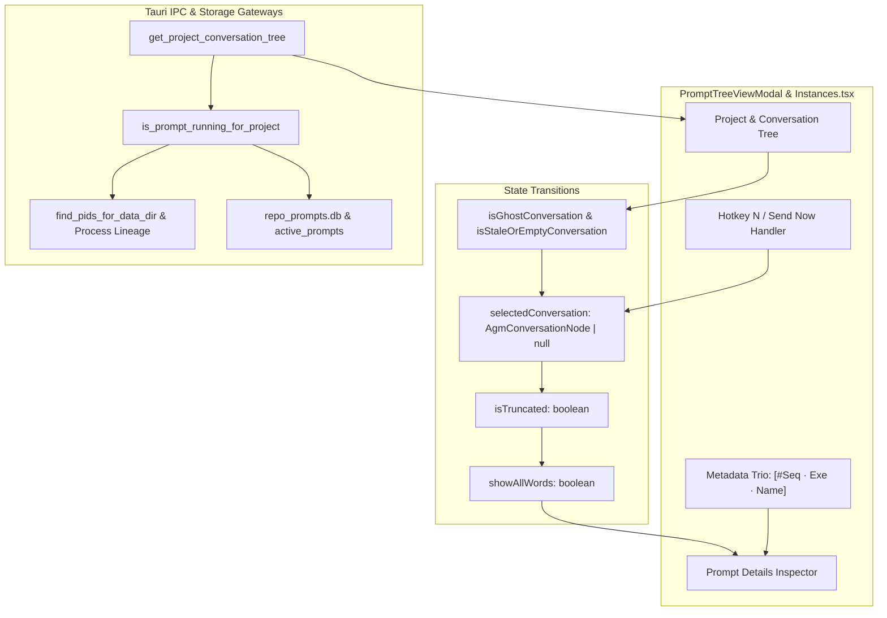
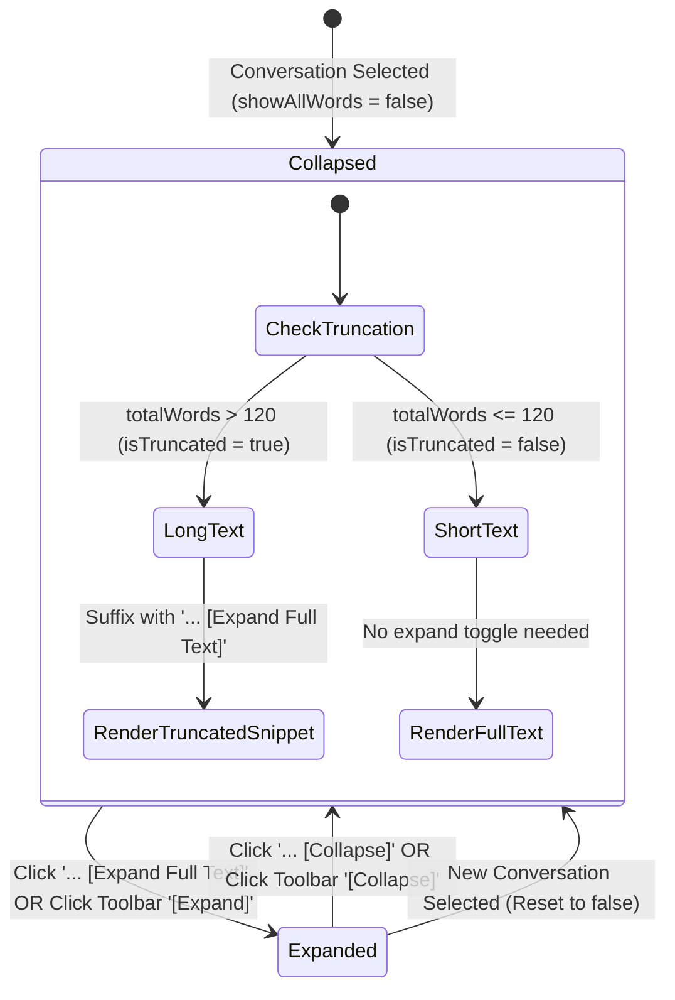

# Component Specification: Prompt Tree Linegap Expansion & Instance Running Detection Fix

- **Feature / Task ID**: `126-prompt-tree-linegap-expansion-and-instance-running-fix`
- **Target Files**:
  - `src/components/instances/PromptTreeViewModal.tsx`
  - `src-tauri/src/modules/repo_db.rs`
  - `src-tauri/src/modules/instance.rs`
  - `src/pages/Instances.tsx`
- **Architectural Scope**: Frontend prompt inspector typography, block-level linegap enforcement, universal ellipsis expansion state machine, fallback conversation resolution for hotkey `N` / Send Now, ghost conversation filtering & merging, backend SQL query strictness, and process liveness verification.

---

## 1. System Architecture & Evaluation Pipeline

The prompt inspection and instance execution monitoring system provides real-time visibility into developer prompts, conversation trees, and project liveness across isolated Antigravity instances.



---

## 2. Component Interfaces & Type Contracts

### 2.1 Frontend TypeScript Contracts (`PromptTreeViewModal.tsx`)

#### 2.1.1 Core Data Models

```typescript
export interface AgmConversationNode {
    seq_id: number;
    seq_code: string;
    gitmap_seq_code: string;
    conversation_id: string;
    short_id: string;
    title: string;
    status: string;
    is_running: boolean;
    step_count: number;
    instance_id: string;
    instance_seq_num?: number;
    instance_name?: string;
    instance_exe_name?: string;
    prompt_preview_200w: string;
    prompt_tail_snippet?: string;
    prompt_word_count: number;
    last_modified: string;
}

export interface AgmProjectTreeNode {
    seq_id: number;
    seq_code: string;
    gitmap_seq_code: string;
    project_id: string;
    repo_name: string;
    repo_path: string;
    instance_id: string;
    instance_seq_num?: number;
    instance_name: string;
    instance_exe_name?: string;
    bound_email?: string;
    is_running: boolean;
    conversations: AgmConversationNode[];
}

export interface PromptTreeViewModalProps {
    isOpen: boolean;
    onClose: () => void;
    instanceId: string;
    instanceName: string;
    initialSelectedProjectId?: string;
}

export type ViewMode = 'preview' | 'raw' | 'edit';

export interface RichMarkdownRendererProps {
    content: string;
    showAllWords?: boolean;
    onToggleExpand?: () => void;
}
```

#### 2.1.2 Internal Component State Contracts

| State Variable | Type | Initial Value | Description |
| :--- | :--- | :--- | :--- |
| `showAllWords` | `boolean` | `false` | Controls whether the preview displays the 120-word truncated snippet or full prompt content. |
| `activePromptText` | `string` | `""` | The active prompt string currently loaded from the selected conversation. |
| `editedPromptText` | `string` | `""` | The working draft string in 'edit' mode; preserved across background auto-syncs. |
| `selectedProject` | `AgmProjectTreeNode \| null` | `null` | The currently selected project folder node in the left tree. |
| `selectedConversation` | `AgmConversationNode \| null` | `null` | The active leaf conversation node whose prompt is being inspected. |
| `viewMode` | `ViewMode` | `'preview'` | Active viewing tab: `'preview'` (Rich Markdown), `'raw'` (Plain Text), `'edit'` (Textarea). |
| `isResending` | `boolean` | `false` | Mutex lock indicating in-flight dispatch to `.antigravity_resume_task.json`. |
| `confirmationSuffix` | `string` | `'None (Send as is)'` | Optional prompt confirmation question appended during dispatch. |
| `elapsedSeconds` | `number` | `0` | Live runtime duration counter for running conversations. |

---

## 3. State Transitions & Lifecycle Invariants

### 3.1 `showAllWords` & `isTruncated` State Machine



#### 3.1.1 Truncation Calculation (`getTruncatedText`)
- Word boundary threshold: `120` words.
- Linebreak preservation: Iterates lines sequentially; empty lines are preserved as empty strings to retain visual paragraph gaps.
- When `wordsCollected + lineWords.length > 120`:
  - Computes remaining allowable words: `remaining = 120 - wordsCollected`.
  - Appends trailing ellipsis token: `' ...'`.
  - Sets `isTruncated = true`.
- Text without truncation: If total word count is `<= 120`, returns the original string unaltered with `isTruncated = false`.

#### 3.1.2 Click-to-Expand Propagation Invariant
1. **Inline Ellipsis Click**: Any trailing `...` or `…` rendered at the end of a truncated paragraph inside `RichMarkdownRenderer` must attach an `onClick` handler that invokes `onToggleExpand()`.
2. **Dedicated Toolbar Button**: The inspector header displays a persistent `[Expand (Full Text)]` / `[Collapse]` toggle button whenever `isTruncated === true` or `showAllWords === true`.
3. **Full-Screen Inspector Parity**: Opening the full-screen inspector (`openInspector`) automatically passes `showAllWords = true` to display the unabridged prompt.

---

### 3.2 `selectedConversation` & Project Fallback Resolution

#### 3.2.1 Problem Solved
Previously, if a user clicked a project row in the left navigation tree without explicitly clicking a child conversation node, `selectedConversation` remained `null`. When the user pressed `N` or clicked "Send Now", `handleResendPrompt` silently failed:
```typescript
if (!conv) return; // Silent no-op when selectedConversation is null
```

#### 3.2.2 Fallback Resolution Contract
When `handleResendPrompt` or `handleEnqueuePrompt` is invoked:
1. If `selectedConversation` is non-null, proceed with `selectedConversation`.
2. If `selectedConversation` is `null` but `selectedProject` is non-null:
   - Search `selectedProject.conversations` for an actively running conversation (`c.is_running === true`).
   - If no running conversation exists, sort valid candidate conversations (excluding 0-word ghost nodes) by `last_modified DESC` and pick the newest conversation.
   - Automatically assign this resolved conversation to `selectedConversation` and load its prompt text.
3. If no conversations exist in the project, surface an explicit user notification: `"No valid prompt available to send in project."`

---

### 3.3 Ghost Conversation Filtering & Aggregation

#### 3.3.1 Definition of Ghost Conversation (`isGhostConversation`)
A conversation is classified as a **ghost conversation** if and only if both conditions are met:
1. **Untitled Identity**:
   - `conv.title` is empty, or equals `'untitled'`, `'untitled conversation'`, `'new conversation'`, `'conversation'`, or matches `conv.short_id`.
2. **Zero Content**:
   - `conv.prompt_word_count === 0` AND (`!conv.prompt_preview_200w || conv.prompt_preview_200w.trim().length === 0`).

#### 3.3.2 Strict Exclusion Invariant
- **Elimination of False Running Bypass**: Previous code allowed empty conversations to bypass filtering if `Boolean(conv.is_running) === true`. Because stale database records or loose fallback queries could mark empty conversations as running, ghost nodes persistently leaked into the UI.
- **Rule**: A conversation with `prompt_word_count === 0` and empty prompt preview is **ALWAYS** filtered out from the primary active conversation list, regardless of whether `conv.is_running` is true or false.
- **Archived Grouping**: Non-ghost conversations with minimal content or stale timestamps are cleanly grouped under the collapsible `"Archived / Stale Prompts ({count})"` node.

---

## 4. UI Typography & Line Gap Contracts

### 4.1 Block-Level Line Breaks (`<br />`)
HTML inline `<br>` elements do not respect block-level vertical margins (`my-1`, `my-2`) in modern browsers when rendered within standard inline formatting contexts.

#### 4.1.1 Required CSS Specification
All newline transitions in Markdown paragraphs and raw line previews must render with explicit block-level display:
```tsx
<br className="my-1.5 block select-none" />
```
This forces the browser layout engine to render a visible vertical gap corresponding to `0.375rem` (`6px`) between consecutive text segments.

#### 4.1.2 Markdown Heading Separation (`formatPromptForMarkdown`)
High-priority prompt instructions frequently join markdown headers directly to body text without an intervening newline (e.g., `# High Priority Instruction Please execute task`).
The pre-formatter must normalize these with double newlines:
```typescript
function formatPromptForMarkdown(text: string): string {
    if (!text) return '';
    let formatted = text;
    formatted = formatted.replace(
        /^(#{1,4}\s+[A-Za-z0-9_\-\s]{2,40}?)([\.\:\!\?])\s+([A-Z])/gm,
        '$1$2\n\n$3'
    );
    formatted = formatted.replace(
        /^(#{1,4}\s+High Priority Instruction|#{1,4}\s+Instruction|#{1,4}\s+Overview|#{1,4}\s+Notice|#{1,4}\s+Task|#{1,4}\s+Plan)\s+([A-Z])/gm,
        '$1\n\n$2'
    );
    return formatted;
}
```

---

## 5. Header Metadata Display Contract

The prompt details header must display a structured metadata cluster providing instant traceability:

```
[#P001] Conversation Title  [● RUNNING (PID: 11628) 02m 14s]
[📁 repo-name]  [#1 · Antigravity.exe · Default]  “… ending with: 'verified and tested'”  [📄 Details]
```

### 5.1 Metadata Specification Table

| Element | Format / Template | Source Property | Fallback | Styling Class |
| :--- | :--- | :--- | :--- | :--- |
| **Prompt Sequence** | `#{seq_code}` | `conv.seq_code` | `P001` | `bg-blue-500/10 text-blue-600 dark:text-cyan-400 font-mono font-bold` |
| **Instance Trio** | `[#{seq} · {exe} · {name}]` | `instance_seq_num`, `instance_exe_name`, `instance_name` | `[#1 · Antigravity.exe · Default]` | `bg-purple-500/10 text-purple-700 dark:text-purple-300 font-mono` |
| **Tail Snippet** | `“… ending with: '{tailSnippet}'”` | `conv.prompt_tail_snippet` or `getPromptTailSnippet(text)` | Hidden if text empty | `text-[11px] italic text-slate-500 truncate max-w-md` |
| **Running Pill** | `RUNNING (PID: {pid}) {duration}` | `conv.is_running`, `instancePid`, `elapsedSeconds` | Hidden if idle | `bg-emerald-500/15 text-emerald-700 border-emerald-500/30 animate-pulse` |

---

## 6. Backend IPC & Liveness Contracts

### 6.1 Backend IPC Command Signatures

#### 6.1.1 `get_project_conversation_tree` (`src-tauri/src/modules/repo_db.rs`)
```rust
#[tauri::command]
pub async fn get_project_conversation_tree(
    instance_id: Option<String>,
    max_words: Option<usize>,
    only_running: Option<bool>,
    force: Option<bool>,
) -> Result<Vec<AgmProjectTreeNode>, String>
```
- **Invariants**:
  1. If `only_running == Some(true)`, strictly returns projects where `is_running == true`.
  2. If an instance has no verified running OS process, all projects belonging to that instance MUST evaluate to `is_running = false`.
  3. Stale database records in `active_prompts` can NEVER override concrete idle conversation summaries found on disk.

#### 6.1.2 `is_prompt_running_for_project` (`src-tauri/src/modules/repo_db.rs`)
```rust
pub fn is_prompt_running_for_project(project_id: &str, instance_id: &str) -> bool
```
- **Gates**:
  - **Gate 0 (Host Process)**: Checks if an OS process matching the target instance data directory is alive. If dead, immediately returns `false`.
  - **Gate 1 (In-Memory Map)**: Checks active memory map with `status == "running"` and `now - updated_at <= 120`.
  - **Gate 2 (Active Workers Map)**: Checks worker PID liveness via `sysinfo`.
  - **Gate 3 (Active Prompts DB)**: Strictly matches `instance_id`. **FORBIDDEN**: Permissive fallback `OR instance_id IS NULL OR instance_id = ''`.
  - **Gate 4 (Live Conversation Summaries)**: Checks `not_fully_idle > 0` with timestamp recency `<= 120` seconds.

#### 6.1.3 `find_pids_for_data_dir` (`src-tauri/src/modules/instance.rs`)
```rust
pub fn find_pids_for_data_dir(data_dir: &str, is_default: bool) -> Vec<u32>
```
- **Invariants**:
  1. For `is_default == true`: Only matches processes running the default Antigravity IDE without `--user-data-dir` or targeting the default user data directory. Excludes helper processes, crashpad handlers, and CLI workers.
  2. For secondary instances: Requires explicit matching against the instance data directory argument.
