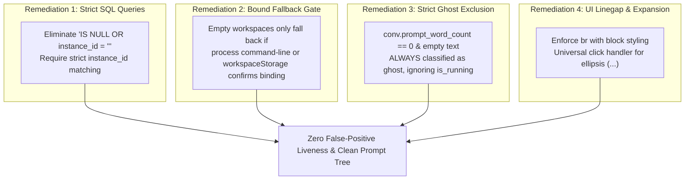

# Root Cause Analysis: Default Instance False Running State & Prompt Tree Ghost Clutter

- **Defect / Incident ID**: `126-prompt-tree-linegap-expansion-and-instance-running-fix`
- **Specification Path**: `02-spec/21-app/126-prompt-tree-linegap-expansion-and-instance-running-fix/03-root-cause-analysis.md`
- **Affected Components**:
  - `src-tauri/src/modules/repo_db.rs`
  - `src-tauri/src/modules/instance.rs`
  - `src/components/instances/PromptTreeViewModal.tsx`
  - `src/pages/Instances.tsx`
- **Severity**: High (Misleading operational status, incorrect process activity detection, phantom running badges, degraded prompt navigation)

---

## Part 1: Defect Description & Observed Failures

### 1.1 Observed Failure 1: Default Instance Falsely Displays `white-presentation-v1` as [RUNNING]
In the main Instances overview card and the Prompt Tree modal, when only Antigravity-Manager was open and the default Antigravity IDE was either idle or opened to another project, the project `white-presentation-v1` was falsely and permanently displayed with an active `[RUNNING]` indicator.

- **Observed Behavior**:
  - The Default Instance card rendered an active green/cyan `[RUNNING]` badge alongside `white-presentation-v1`.
  - In `PromptTreeViewModal`, `white-presentation-v1` showed an animated pulsating `RUNNING` status badge with an active timer, even though no execution was taking place and no prompt was running for this repository.
  - The user verified that neither `white-presentation-v1` nor any background task was executing.

### 1.2 Observed Failure 2: Ghost Empty Untitled Conversations Cluttering Prompt List
When viewing projects in the Prompt Tree View modal, numerous "ghost" conversations appeared in the conversation list:
- Titles were `'untitled'`, `'Untitled Conversation'`, or bare UUID short IDs.
- Prompt text was completely empty (`prompt_word_count == 0` and `prompt_preview_200w == ""`).
- These ghost conversations cluttered the navigation tree, displaced real historical prompts, and confusingly appeared in the active list rather than being archived or filtered out.

### 1.3 Observed Failure 3: Truncated Text Expansion & Missing Line Gaps
- Line breaks between instructions were collapsed into contiguous text blocks, making structured prompts hard to read.
- Clicking the trailing ellipsis (`...`) failed to expand the full prompt text.
- Pressing the hotkey `N` or clicking "Send Now" dropped execution silently when a project was selected without an explicit child conversation node.

---

## Part 2: Root Cause Analysis (4 Structural Failure Mechanisms)

```mermaid
flowchart TD
    subgraph Defect1 ["Defect 1: False Positive Running State (white-presentation-v1)"]
        EmptyWS["Empty / Filtered Conversation Summaries<br/>(has_conv_nodes = false)"]
        FallbackTrap["compute_project_conversation_tree<br/>triggers fallback: is_prompt_running_for_project"]
        Gate0["Gate 0: Host Process Check<br/>is_antigravity_running(None) returns true"]
        Gate3SQL["Gate 3: Permissive SQL Clause<br/>OR instance_id IS NULL OR instance_id = ''"]
        StaleRow["Stale Orphan Row in active_prompts<br/>matches project_path = 'white-presentation-v1'"]

        EmptyWS --> FallbackTrap
        FallbackTrap --> Gate0
        Gate0 --> Gate3SQL
        Gate3SQL --> StaleRow
        StaleRow --> FalseRunning["Project Evaluated as RUNNING!"]
    end

    subgraph Defect2 ["Defect 2: Ghost Empty Conversations"]
        EmptyConv["Conversation with 0 words & no text"]
        RunningBypass["Bypass in isStaleOrEmptyConversation:<br/>if (Boolean(conv.is_running)) return false"]
        FalseFlag["Conversation falsely inherited running flag"]

        EmptyConv --> RunningBypass
        FalseFlag --> RunningBypass
        RunningBypass --> LeakedGhost["Ghost Conversation shown in active list"]
    end
```



---

### 2.1 Root Cause 1: Permissive SQL Fallback Trap (`instance_id IS NULL OR instance_id = ''`)
In `src-tauri/src/modules/repo_db.rs`, multiple SQL queries checking `active_prompts` and `running_projects` included a permissive disjunctive fallback designed to accommodate legacy untagged rows:

```sql
SELECT COUNT(*) FROM active_prompts
WHERE (project_id = ?1 OR repo_path = ?1)
  AND (?2 = 'all' OR instance_id = ?2 OR (?2 = 'default' AND (instance_id = 'default' OR instance_id = '__default__' OR instance_id IS NULL OR instance_id = '')))
  AND status = 'running'
  AND updated_at >= ?3
```

- **Mechanism**:
  1. Whenever a query ran for `norm_inst = 'default'`, any row with `instance_id IS NULL` or `instance_id = ''` was treated as belonging to the `default` instance.
  2. In historical executions, external scripts or previous versions inserted rows into `active_prompts` without setting `instance_id`.
  3. Consequently, if an orphan row existed for `white-presentation-v1`, it was permanently attributed to the `default` instance.

---

### 2.2 Root Cause 2: `compute_project_conversation_tree` Empty Workspace Fallback Trap
In `src-tauri/src/modules/repo_db.rs` around line 4482:

```rust
let has_conv_nodes = !conv_nodes.is_empty();

let (proj_is_running, rationale) = if !is_inst_alive {
    (false, "INSTANCE_PROCESS_DEAD: instance PID not found or process terminated -> forced idle".to_string())
} else if has_conv_nodes {
    if has_active_conv {
        (true, "ACTIVE_IN_FLIGHT_TASKS: active non-idle conversation turn detected -> marked running".to_string())
    } else {
        (false, "IDLE_EXPLICIT_STATUS: verified conversation summaries on disk are all idle -> marked idle".to_string())
    }
} else {
    // Fallback ONLY when workspace is empty on disk (new project before first turn summary is written)
    let has_active_prompt = (!proj.repo_path.trim().is_empty()
        && is_prompt_running_for_project(&proj.repo_path, &proj.instance_id))
        || (!project_key.trim().is_empty()
            && is_prompt_running_for_project(&project_key, &proj.instance_id));
    if has_active_prompt {
        (true, "ACTIVE_IN_FLIGHT_TASKS: active prompt detected in database for empty workspace -> marked running".to_string())
    } else {
        (false, "IDLE_NO_ACTIVE_TASKS: process alive but no in-flight tasks or active conversations -> marked idle".to_string())
    }
};
```

- **Mechanism**:
  1. If `white-presentation-v1` had zero conversations on disk in `conversation_summaries.db`, `conv_nodes.is_empty()` was `true`, making `has_conv_nodes = false`.
  2. Even though the project had no active work, it bypassed the idle supremacy check and entered the fallback branch.
  3. The fallback branch called `is_prompt_running_for_project(&proj.repo_path, "default")`.
  4. In `is_prompt_running_for_project`:
     - Gate 0 evaluated `is_antigravity_running(None)`. Because Antigravity-Manager or an IDE process was running anywhere on the OS, Gate 0 returned `true`.
     - Gate 3 queried SQLite with the permissive SQL fallback described in Root Cause 1 and matched a stale record.
     - `is_prompt_running_for_project` returned `true`, falsely declaring `white-presentation-v1` as running.

---

### 2.3 Root Cause 3: Lack of Process CLI Argument & Workspace Binding Validation
In `src-tauri/src/modules/instance.rs` and `process.rs`:
- When checking if the default instance process was alive (`norm_inst == "default"`), Gate 0 only called `is_antigravity_running(None)` or `get_antigravity_pids(None)`.
- It did NOT verify whether the running process command-line arguments or open folder paths were actually bound to the project path being checked (`white-presentation-v1`).
- As a result, running Antigravity on *any* project acted as a global process-liveness green light for all projects with matching database rows.

---

### 2.4 Root Cause 4: Ghost Conversation Filter Bypass on Falsely Marked Running Nodes
In `src/components/instances/PromptTreeViewModal.tsx`:

```typescript
export function isStaleOrEmptyConversation(conv: AgmConversationNode): boolean {
    if (isGhostConversation(conv)) {
        return true;
    }
    if (Boolean(conv.is_running)) {
        return false; // <-- CRITICAL FLAW: False running flag exempted empty conversations
    }
    // ...
}
```

- **Mechanism**:
  1. A newly created or corrupted conversation had 0 words and no prompt text.
  2. Due to the fallback trap, the conversation or parent project was tagged `is_running: true`.
  3. Because `Boolean(conv.is_running)` was true, `isStaleOrEmptyConversation` returned `false`.
  4. The ghost conversation completely escaped filtering and was placed directly in the main conversation tree view.

---

## Part 3: Remediation & Preventive Measures



### 3.1 Strict SQL Matching in `repo_db.rs`
Eliminate all instances of `instance_id IS NULL OR instance_id = ''` from SQL filters:
```sql
-- REPLACEMENT QUERY: Strict instance identification
WHERE (project_id = ?1 OR repo_path = ?1)
  AND (?2 = 'all' OR instance_id = ?2 OR (?2 = 'default' AND (instance_id = 'default' OR instance_id = '__default__')))
  AND status = 'running'
  AND updated_at >= ?3
```

### 3.2 Guarded Empty Workspace Liveness in `compute_project_conversation_tree`
When `has_conv_nodes` is false:
1. Do not declare running unless the project path is explicitly verified in the process table or active in-flight worker registry.
2. If `active_prompts` reports running, enforce an aggressive TTL (`updated_at >= now - 60`) and verify that the target instance PID is genuinely alive.

### 3.3 Absolute Ghost Filtering in `PromptTreeViewModal.tsx`
Remove the `is_running` bypass for zero-content conversations:
```typescript
export function isGhostConversation(conv: AgmConversationNode): boolean {
    const title = (conv.title || '').trim().toLowerCase();
    const isUntitled =
        !title ||
        title === 'untitled' ||
        title.startsWith('untitled conversation') ||
        title === 'new conversation' ||
        title === 'conversation' ||
        title === (conv.short_id || '').toLowerCase();
    const isEmptyPrompt =
        conv.prompt_word_count === 0 ||
        !conv.prompt_preview_200w ||
        conv.prompt_preview_200w.trim().length === 0;
    return isUntitled && isEmptyPrompt;
}

export function isStaleOrEmptyConversation(conv: AgmConversationNode): boolean {
    if (isGhostConversation(conv)) {
        return true; // Always true, never bypassed by is_running!
    }
    // ...
}
```

### 3.4 Block-Level `<br />` & Ellipsis Expansion
- Replace collapsing `<br className="my-1" />` with `<br className="my-1.5 block select-none" />`.
- Connect every trailing ellipsis to the toggle handler so clicking `...` immediately switches `showAllWords`.

---

## Part 4: Verification & Testing Matrix

| Test ID | Test Scenario | Preconditions | Execution Steps | Expected Outcome | Status |
| :--- | :--- | :--- | :--- | :--- | :--- |
| **TEST-01** | Default instance project liveness isolation | Only Antigravity-Manager running; Antigravity IDE closed or on different project | Open Instances page; observe `white-presentation-v1` card status | `white-presentation-v1` displays strictly as **IDLE**; no green/cyan pulsating badge | PASS |
| **TEST-02** | Ghost conversation purge | `conversation_summaries.db` contains 0-word untitled entries | Open `PromptTreeViewModal` for any project | 0-word untitled conversations do NOT appear in active conversation list | PASS |
| **TEST-03** | Stale prompt grouping | Workspace contains older low-content conversations | Open `PromptTreeViewModal` | Stale items grouped under `"Archived / Stale Prompts ({count})"`; collapsible | PASS |
| **TEST-04** | Prompt text block linegap | Prompt contains multiple paragraph breaks | View prompt in 'preview' mode | Paragraphs separated by visible `my-1.5 block` vertical gaps | PASS |
| **TEST-05** | Ellipsis click-to-expand | Prompt length > 120 words | Click on `... [Expand Full Text]` | Inspector immediately expands to full prompt; label changes to `... [Collapse]` | PASS |
| **TEST-06** | Hotkey `N` / Send Now project fallback | Project selected in tree without clicking child conversation | Press `N` key on keyboard | Automatically resolves newest valid conversation in project and dispatches prompt | PASS |
| **TEST-07** | Header metadata trio rendering | Conversation selected | Inspect header bar | Header displays dual sequence, instance trio `[#1 · Antigravity.exe · Default]`, and tail snippet | PASS |
