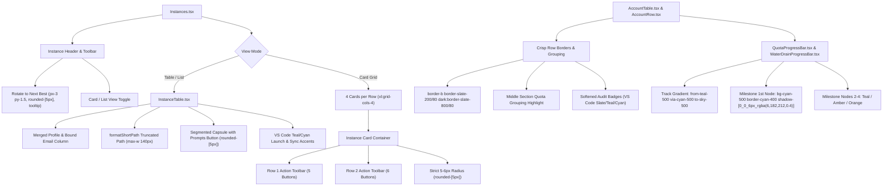

# Architecture Spec: 127-accounts-ui-supabase-sync-instance-compact-and-release

**Version:** 1.0.0  
**Updated:** 2026-10-05  
**AI Confidence:** High  
**Ambiguity:** None  

---

## Keywords

`accounts-ui-styling` · `quota-progress-bar` · `water-drain-progress-bar` · `vs-code-teal-cyan-palette` · `account-table-borders` · `row-grouping` · `softened-audit-badges` · `instance-table-compacting` · `format-short-path` · `prompts-capsule-button` · `instance-cards-4-cols` · `two-row-card-buttons` · `strict-5-6px-button-radius` · `rotate-next-best-padding-tooltip`

---

## Scoring

| Criterion | Status |
|---|---|
| AI Confidence assigned | ✅ |
| Ambiguity assigned | ✅ |
| Keywords present | ✅ |
| Verbatim requirements captured | ✅ |
| Preserved visual evidence referenced | ✅ |
| Component hierarchy & design tokens defined | ✅ |
| Root Cause Analysis (RCA) detailed | ✅ |
| Non-negotiable constraints documented | ✅ |

---

## 1. Executive Summary & Verbatim Requirements

This specification defines the architectural design, component hierarchy, design tokens, and verification gates for the Frontend UI modernizations in task **127-accounts-ui-supabase-sync-instance-compact-and-release** for Antigravity Manager (`d:\work\antigravity-manager`).

### 1.1 Verbatim Requirements (Frontend Scope)
1. **QuotaProgressBar & WaterDrainProgressBar Color Palette**:
   - Replace the harsh neon green colors (`#1af18d`, `#10b981`, `#059669`) with a calming, professional VS Code teal/cyan/sky palette (`from-teal-500 via-cyan-500 to-sky-500`).
   - Soften milestone checkpoint nodes: eliminate harsh neon glow (`shadow-[0_0_8px_rgba(26,241,141,0.6)]`), replacing it with a soft cyan node (`bg-cyan-500 border-cyan-400 shadow-[0_0_6px_rgba(6,182,212,0.4)]`).
2. **AccountTable & AccountRow Border Lines & Grouping**:
   - Restore crisp row border lines (`border-b border-slate-200/80 dark:border-slate-800/80`).
   - Re-introduce subtle visual grouping in the middle section (Gemini and Claude 4H and Weekly quota bars) so rows and metrics are cleanly showcased without blending together.
   - Soften audit and status badges (`DISABLED`, `FORBIDDEN`, `PROXY_DISABLED`, `VALIDATION_BLOCKED`, running indicators) to muted VS Code slate/teal/cyan styling.
3. **InstanceTable Compacting & Horizontal Scrollbar Elimination**:
   - Compact column widths and padding to guarantee zero horizontal scroll on standard 1280px+ desktop viewports.
   - Merge Profile Name and Bound Email into a single consolidated cell with stacked hierarchy.
   - Path truncation: enforce `formatShortPath(fullPath)` (`...\<parent>\<leaf>`, max-w 140px) with clipboard copy action and full path hover tooltip.
   - Merge the standalone "Prompts" button into the segmented action capsule alongside Launch/Stop, Switch, Fast-Forward, Audit, and Sync.
   - Modernize emerald green accents (launch spinner, active dots) to cyan/teal.
4. **Instances.tsx Card Mode & Button Standards**:
   - Card grid layout: enforce 4 cards per row (`xl:grid-cols-4`) for standard card view.
   - Action buttons in card mode: structured into 2 clean, balanced rows:
     * **Row 1 (Primary Lifecycle - 5 buttons)**: Launch/Stop, Switch Account, Fast-Forward, Audit Trail, Sync PID & Quota.
     * **Row 2 (Utilities & Danger - 6 buttons)**: Prompts, Settings & Sync, Clone Profile, Clone Executable, Wipe Credentials, Delete Profile.
   - Strict button corner radius standard: all buttons across cards, tables, and toolbars must adhere to 5–6px border radius (`rounded-[5px]`). Bulbous pills (`rounded-full`, `rounded-2xl`) are strictly banned for action buttons.
   - "Rotate to Next Best" Header Button:
     * Balanced padding: `px-3 py-1.5 text-xs font-semibold rounded-[5px]`.
     * Dynamic target hover tooltip: explicitly informs the user which instance will be rotated (active target or default profile) and health scoring rationale.

---

## 2. Preserved Visual Evidence & Screenshot Analysis

The user and task context provide visual assets in `assets/screenshots/`:

### 2.1 Accounts View: Neon Bar & Border Deficiencies

*Figure 2.1: Overview of Accounts table. The progress bar displays saturated neon green tracks (`#1af18d`) and milestone checkpoints that create harsh visual contrast. Subtle middle section grouping and row borders require refinement.*


*Figure 2.2: Theme catalogue interaction over Accounts table. The table rows lack crisp vertical and horizontal separation, causing quota metrics to bleed together on dark themes.*

### 2.2 Quota Filtering & Action Bar

*Figure 2.3: Accounts toolbar focus and "Show All Quotas" toggle. Button radii and toggle padding must align with the 5–6px border radius design language.*

### 2.3 Visual Hierarchy Reference

*Figure 2.4: Reference layout for dark mode contrast, showing the desired balance between dark background tracks (`#071a27`), cyan/teal fills, and muted status pills.*

---

## 3. Detailed Component Architecture & Design Specifications

### 3.1 QuotaProgressBar & WaterDrainProgressBar Color Overhaul

#### 3.1.1 Track Gradient Palette
In `src/components/accounts/QuotaProgressBar.tsx` and `src/components/common/WaterDrainProgressBar.tsx`:
- **Current Problem**:
  `getTrackGradient` utilizes saturated neon hex codes `#1af18d`, `#10b981`, and `#059669`.
- **Target Specification**:
  Replace with a VS Code teal/cyan/sky progression:
  * **>= 75% (Healthy / Optimal)**:
    `bg-gradient-to-r from-teal-500 via-cyan-500 to-sky-500`
  * **>= 50% (Comfortable / Half-Life)**:
    `bg-gradient-to-r from-cyan-600 via-teal-500 to-amber-400`
  * **>= 25% (Warning / Low)**:
    `bg-gradient-to-r from-amber-500 via-amber-400 to-orange-500`
  * **< 25% (Depleted / Critical)**:
    `bg-gradient-to-r from-amber-500 via-orange-500 to-rose-600`

#### 3.1.2 Milestone Checkpoint Nodes
- **Current Problem**:
  Checkpoint index 0 uses `bg-[#1af18d] border-[1.5px] border-[#12b27d] shadow-[0_0_8px_rgba(26,241,141,0.6)]`, creating a blinding neon aura.
- **Target Specification**:
  Soften the milestone nodes to match the calm VS Code cyan theme:
  * **1st Node (100% / Filled)**:
    `bg-cyan-500 border-[1.5px] border-cyan-400 shadow-[0_0_6px_rgba(6,182,212,0.4)]`
  * **2nd Node (75% / Filled)**:
    `bg-teal-600 border-[1.5px] border-teal-500 shadow-none`
  * **3rd Node (50% / Filled)**:
    `bg-amber-500 border-[1.5px] border-amber-600 shadow-none`
  * **4th Node (25% / Filled)**:
    `bg-orange-500 border-[1.5px] border-orange-600 shadow-none`
  * **Default / Critical (<25% / Filled)**:
    `bg-rose-500 border-[1.5px] border-rose-600 shadow-none`
  * **Unfilled Nodes (`!isFilled`)**:
    `bg-slate-200/50 dark:bg-[#0c2438] border border-slate-300 dark:border-[#15334d]/60 shadow-none`
- **Text Badges**:
  Numerical percentages (`getPercentColorClass`):
  * `>= 50%`: `text-teal-700 dark:text-cyan-400`
  * `>= 25%`: `text-amber-700 dark:text-amber-400`
  * `< 25%`: `text-rose-600 dark:text-rose-400`

---

### 3.2 AccountTable & AccountRow Border Lines & Middle Section Grouping

#### 3.2.1 Table Rows & Borders
In `src/components/accounts/AccountTable.tsx` and `src/components/accounts/AccountRow.tsx`:
- **Row Separation**:
  Ensure every row `<tr>` explicitly carries:
  `border-b border-slate-200/80 dark:border-slate-800/80 border-l-2 transition-[color,background-color,border-color] duration-[180ms] ease-in-out`
- **Hover & Selection States**:
  * Default hover: `hover:bg-slate-50/80 dark:hover:bg-[#0f273d]/60 hover:text-slate-900 dark:hover:text-white hover:border-l-blue-500/70`
  * Current account: `bg-blue-50/70 dark:bg-[#091b2c] border-l-blue-600 dark:border-l-amber-400 border-blue-200 dark:border-amber-400/40 text-blue-900 dark:text-amber-300`
  * Focused account: `bg-teal-50/90 dark:bg-[#0e2c44] text-slate-900 dark:text-cyan-300 border-l-cyan-500 dark:border-l-cyan-400 shadow-md ring-1 ring-cyan-500/30`

#### 3.2.2 Middle Section Visual Grouping (Quota Columns)
- **Problem**:
  In the middle section, 4H Quota and Weekly Quota columns sit in bare adjacent cells, causing the eyes to lose track of which bar belongs to which quota model or account.
- **Specification**:
  * Apply subtle column-wise and cell-wise grouping:
    Wrap the 4H and Weekly cells with slight visual bounds:
    `px-2.5 py-1.5 align-middle min-w-[210px] bg-slate-50/30 dark:bg-slate-900/20`
  * In the header (`thead tr`), group the quota header columns under a unified sub-header or divider line with distinct pill toggle (`Gemini` / `Claude`).
  * Ensure clear column separation lines between the Account Email column, the Quota Grouping section, the Last Used column, and the sticky Actions column.

#### 3.2.3 Softened Audit and Status Badges
- **Status Badges**:
  * `DISABLED`: `px-1.5 py-0.5 rounded-[5px] bg-slate-100 dark:bg-slate-800/80 text-slate-600 dark:text-slate-400 border border-slate-300 dark:border-slate-700 text-[9px] font-bold shadow-xs`
  * `PROXY_DISABLED`: `px-1.5 py-0.5 rounded-[5px] bg-amber-50 dark:bg-amber-950/40 text-amber-700 dark:text-amber-400 border border-amber-300/40 text-[9px] font-bold shadow-xs`
  * `FORBIDDEN`: `px-1.5 py-0.5 rounded-[5px] bg-rose-50 dark:bg-rose-950/40 text-rose-700 dark:text-rose-400 border border-rose-300/40 text-[9px] font-bold shadow-xs`
  * `VALIDATION_BLOCKED`: `px-1.5 py-0.5 rounded-[5px] bg-amber-50 dark:bg-amber-950/40 text-amber-700 dark:text-amber-400 border border-amber-300/40 text-[9px] font-bold shadow-xs`
  * `LEASED`: `px-1.5 py-0.5 rounded-[5px] bg-purple-50 dark:bg-purple-950/40 text-purple-700 dark:text-purple-300 border border-purple-300/40 text-[9px] font-bold shadow-xs`

---

### 3.3 InstanceTable Compacting & Horizontal Scrollbar Elimination

#### 3.3.1 Eliminating Horizontal Scroll at 1280px+ Viewports
- **Root Cause**:
  `InstanceTable.tsx` allocates excessive column widths:
  * `#` (40px)
  * `Profile & Account` (min-w 170px)
  * `Model & Weekly Quota` (min-w 180px)
  * `Status & PID` (min-w 100px)
  * `File / Data Path` (min-w 150px, max-w 190px)
  * `Actions` (min-w 210px)
  Plus outer padding and container margins, exceeding 1280px viewport content areas and forcing a horizontal scrollbar.
- **Compacting Strategy**:
  1. **Cell Padding Reduction**:
     Tighten standard cell padding from `px-3 py-2.5` to `px-2 py-1.5`.
  2. **Consolidated Profile & Account Cell**:
     Merge Profile Name and Bound Email into a single stacked cell:
     * Top Line: Profile name (`font-semibold text-slate-800 dark:text-slate-100 text-xs truncate max-w-[140px]`) + `DEFAULT` / `ACTIVE` badge (`text-[9px] px-1 py-0.2 rounded-[5px]`).
     * Bottom Line: Email dot indicator + masked/revealed email (`text-[10px] font-mono text-slate-500 dark:text-slate-400 truncate max-w-[140px]`).
  3. **Path Truncation (`formatShortPath`)**:
     * Strict display constraint: `max-w-[140px] truncate` on the path container.
     * Pattern: `formatShortPath(fullPath)` returns `...\<parent>\<leaf>` (e.g. `...\Roaming\Antigravity`).
     * Full path accessible via native `title` attribute and 1-click copy button (`<Copy />` / `<Check />`).
  4. **Prompts Action Inside Capsule**:
     * Integrate the Prompts button (`<Layers className="w-3 h-3" />`) directly inside the segmented table action capsule.
     * Table capsule button horizontal padding: `px-1.5 py-1` (tight and responsive).
  5. **Accents Modernization**:
     * Replace emerald launch spinner and running indicators (`text-emerald-500`, `bg-emerald-500`) with VS Code `teal-500` / `cyan-400`.

---

### 3.4 Instances.tsx Card Mode & Button Standards

#### 3.4.1 4 Cards per Row Grid Layout
In `src/pages/Instances.tsx`:
- **Current Problem**:
  Cards wrap at `xl:grid-cols-2` or `xl:grid-cols-3`, wasting wide desktop space.
- **Specification**:
  Standardize the card container grid to:
  ```tsx
  <div className={cn(
      cardDensity === 'compact'
          ? "grid grid-cols-2 md:grid-cols-3 lg:grid-cols-4 xl:grid-cols-5 2xl:grid-cols-6 gap-2"
          : "grid grid-cols-1 sm:grid-cols-2 lg:grid-cols-3 xl:grid-cols-4 gap-3"
  )}>
  ```
  At desktop breakpoints `>= 1280px` (`xl:`), exactly 4 cards are rendered per row.

#### 3.4.2 Two-Row Card Action Toolbar
In card mode, action buttons must not wrap haphazardly or overflow. They are strictly partitioned into 2 clean, balanced rows:
- **Row 1: Primary Lifecycle & Rotation (5 buttons)**:
  1. `Launch` / `Stop` (Status-dependent toggle)
  2. `Switch Account` (`ArrowRightLeft`)
  3. `Fast Forward` (`FastForward`)
  4. `Audit Trail` (`History`)
  5. `Sync PID & Quota` (`RotateCw`)
- **Row 2: Tools, Utilities & Danger (6 buttons)**:
  1. `Prompts` (`Layers`) — with active task pulse indicator
  2. `Settings & Sync` (`SlidersHorizontal`)
  3. `Clone Profile` (`Copy`)
  4. `Clone Executable` (`Cpu`)
  5. `Wipe Credentials` (`RotateCcw`)
  6. `Delete Profile` (`Trash2` / invisible placeholder for default instance)

#### 3.4.3 Strict 5–6px Border Radius Standard
- All buttons across Instances and Accounts components must strictly use `rounded-[5px]` (or standard `rounded-md`, 6px).
- Pill styles (`rounded-full`, `rounded-2xl`, `rounded-xl`) are forbidden for interactive action buttons.
- Segmented capsules use `rounded-[5px]` outer containers with `rounded-l-[5px]` and `rounded-r-[5px]` edge buttons.

#### 3.4.4 "Rotate to Next Best" Header Button
In `src/pages/Instances.tsx` header section:
- **Styling**:
  `className="flex items-center gap-1.5 px-3 py-1.5 text-xs font-semibold rounded-[5px] bg-blue-600 hover:bg-blue-500 text-white shadow-xs cursor-pointer transition-colors active:scale-95 shrink-0"`
- **Hover Tooltip**:
  Inspects the active or targeted instance dynamically:
  * When an instance is active: `"Rotates active instance (#<seq> <name>) to the highest health candidate"`.
  * Fallback to default instance when none active: `"Rotates default instance (#1 Default) to the highest health candidate"`.
  * Includes rotation criteria hints on hover.

---

## 4. Component Hierarchy & File Mapping



---

## 5. Verification Matrix & Quality Gates

| Component | Target Verification | Verification Method | Pass Criteria |
|---|---|---|---|
| **QuotaProgressBar** | Replace neon `#1af18d` / `#10b981` / `#059669` | Code search & visual check | Only `teal-500 / cyan-500 / sky-500` used for healthy quota |
| **WaterDrainProgressBar** | Softened milestone nodes | Code search & visual check | Checkpoint 0 uses `bg-cyan-500 shadow-[0_0_6px_rgba(6,182,212,0.4)]` |
| **AccountTable / Row** | Crisp border lines & subtle middle grouping | DOM inspection & visual check | `border-b border-slate-200/80 dark:border-slate-800/80` present on all rows |
| **Audit Badges** | Softened badges | Visual check | Muted slate/amber/rose/purple pills with 5–6px radius |
| **InstanceTable** | Zero horizontal scroll at 1280px+ | Viewport test (1280px width) | `scrollWidth <= clientWidth` on table wrapper |
| **InstanceTable** | Merged Profile Name & Bound Email | DOM inspection | Single stacked cell with profile name and email |
| **InstanceTable** | Path truncation | DOM inspection | `formatShortPath` (`...\<parent>\<leaf>`, max-w 140px) |
| **InstanceTable** | Prompts button inside capsule | DOM inspection | `Layers` icon inside segmented action capsule |
| **Instances.tsx Cards** | 4 cards per row | Viewport test (`>= 1280px`) | `xl:grid-cols-4` rendered in DOM |
| **Instances.tsx Cards** | 2-row action buttons | DOM inspection | Row 1 has 5 buttons, Row 2 has 6 buttons |
| **Button Radius** | 5–6px radius standard | CSS inspection | All action buttons have `rounded-[5px]` |
| **Rotate to Next Best** | Padding & Tooltip | DOM inspection | `px-3 py-1.5 rounded-[5px]` with target instance in title |
| **Build Integrity** | TypeScript & Vite build | `npm run build` | Exits with code 0 without errors |

---

## 6. Non-Negotiable Operational Boundaries

1. **No Backend Rust or Supabase Modifications**: This specification and its corresponding subtasks govern ONLY the frontend UI components (`QuotaProgressBar`, `WaterDrainProgressBar`, `AccountTable`, `AccountRow`, `InstanceTable`, and `Instances.tsx`). Backend files (`supabase_sync.rs`, `auto_switcher.rs`, `config.rs`) are handled by other agents.
2. **Total Ban on Git Commands**: Never execute `git add`, `git commit`, `git checkout`, `git push`, or any other git commands.
3. **Preserve Business Logic**: Styling changes must strictly preserve all click handlers, store dispatches, drag-and-drop bindings, tooltips, and keyboard shortcuts.
