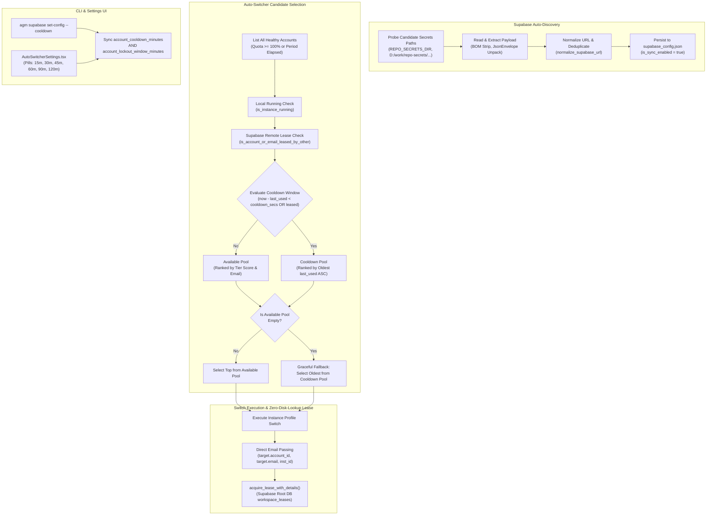

# Component Specification: Supabase Auto-Discovery, Distributed Leases, and Multi-Instance Cooldown

- **Feature / Task ID**: `127-accounts-ui-supabase-sync-instance-compact-and-release`
- **Target Files**:
  - `src-tauri/src/modules/supabase_sync.rs` (auto-discovery candidates, seed loading, endpoint deduplication)
  - `src-tauri/src/modules/supabase_client.rs` (PostgREST endpoint normalization and client construction)
  - `src-tauri/src/modules/workspace_lease_manager.rs` (distributed lease acquisition, remote check, email-aware matching)
  - `src-tauri/src/modules/auto_switcher.rs` (candidate selection, cooldown filtering, two-tier fallback, direct email propagation)
  - `src-tauri/src/models/config.rs` (`AutoProfileSwitcherConfig`, `account_cooldown_minutes` serde defaults)
  - `src-tauri/src/bin/agm.rs` (`cmd_supabase_set_config` CLI flag synchronization)
  - `src/types/config.ts` (frontend config type contracts)
  - `src/components/settings/AutoSwitcherSettings.tsx` (cooldown selector, quick pills, and tooltip)
- **Architectural Scope**: Backend Rust PostgREST synchronization, distributed multi-instance account concurrency control, automatic secrets discovery, zero-I/O email propagation, CLI management, and frontend settings parity.

---

## 1. System Architecture & Interaction Flow

The multi-instance account exclusivity and Supabase synchronization engine coordinates account leases across isolated local instances and distributed physical/virtual machines.



---

## 2. Component Detailed Specifications

### 2.1 Supabase Secrets Auto-Discovery (`supabase_sync.rs` & `supabase_client.rs`)

#### 2.1.1 Problem Statement
When Antigravity Manager initializes on a new developer workstation or headless build node, `supabase_config.json` is initially empty or absent. Users store root database credentials in centralized repositories under `repo-secrets`. Without robust auto-discovery, the application defaults to standalone disconnected mode, failing to synchronize distributed leases across machines.

#### 2.1.2 Probing Hierarchy
`candidate_repo_secrets_paths()` must probe candidates in strict priority order:
1. Environment Variable `REPO_SECRETS_DIR`:
   - Direct file reference if path points to `.json`.
   - Subpaths:
     - `<REPO_SECRETS_DIR>/03-supabase/01-own/supabase-credentials.json`
     - `<REPO_SECRETS_DIR>/03-supabase/02-lovable/supabase-credentials.json`
     - `<REPO_SECRETS_DIR>/supabase-credentials.json`
2. Explicit Windows Drive Locations:
   - `D:/work/repo-secrets/03-supabase/01-own/supabase-credentials.json`
   - `D:/work/repo-secrets/03-supabase/02-lovable/supabase-credentials.json`
   - `C:/work/repo-secrets/03-supabase/01-own/supabase-credentials.json`
   - `C:/work/repo-secrets/03-supabase/02-lovable/supabase-credentials.json`
3. Relative Parent Directories (for monorepos and local clones):
   - `../repo-secrets/03-supabase/01-own/supabase-credentials.json`
   - `../repo-secrets/03-supabase/02-lovable/supabase-credentials.json`
   - `../../repo-secrets/03-supabase/01-own/supabase-credentials.json`
   - `../../repo-secrets/03-supabase/02-lovable/supabase-credentials.json`
   - `repo-secrets/03-supabase/01-own/supabase-credentials.json`
   - `repo-secrets/03-supabase/02-lovable/supabase-credentials.json`
4. User Home Directory:
   - `<HOME>/repo-secrets/03-supabase/01-own/supabase-credentials.json`
   - `<HOME>/repo-secrets/03-supabase/02-lovable/supabase-credentials.json`

#### 2.1.3 Ingestion & Normalization Protocol
1. **UTF-8 & BOM Handling**: Strip byte-order mark (`\u{feff}`) before JSON deserialization.
2. **Envelope Unpacking**: Support both raw credentials objects (`{ "url": "...", "anon_key": "..." }`) and JSON envelopes (`{ "type": "agm/supabase-credentials", "payload": { ... } }`).
3. **URL Normalization**: Pass every candidate URL through `normalize_supabase_url()`:
   - Strip trailing slashes (`/`).
   - Strip `/rest/v1` or `/rest/v1/` suffixes to maintain base PostgREST URL format (`https://<project-ref>.supabase.co`).
4. **Endpoint Deduplication**:
   - Compare normalized URLs and endpoint IDs against existing configured endpoints.
   - Ignore duplicates to avoid configuration bloating.
5. **Auto-Enable Trigger**: When at least one valid endpoint is seeded from repo-secrets:
   - Automatically set `cfg.is_sync_enabled = true`.
   - Sort endpoints by `priority` ascending.
   - Persist immediately to `supabase_config.json`.

---

### 2.2 Multi-Instance Account Exclusivity (`workspace_lease_manager.rs`)

#### 2.2.1 Distributed Leasing Table (`workspace_leases`)
The Supabase Root database maintains distributed exclusivity via the `workspace_leases` table.

```sql
CREATE TABLE IF NOT EXISTS public.workspace_leases (
    account_id TEXT PRIMARY KEY,
    account_email TEXT NOT NULL DEFAULT '',
    node_id TEXT NOT NULL,
    node_alias TEXT NOT NULL,
    ip_address TEXT NOT NULL DEFAULT '',
    profile_name TEXT NOT NULL,
    leased_at BIGINT NOT NULL,
    expires_at BIGINT NOT NULL
);

CREATE INDEX IF NOT EXISTS idx_workspace_leases_email ON public.workspace_leases (lower(account_email));
CREATE INDEX IF NOT EXISTS idx_workspace_leases_expires ON public.workspace_leases (expires_at);
CREATE INDEX IF NOT EXISTS idx_workspace_leases_leased_at ON public.workspace_leases (leased_at);
```

#### 2.2.2 Cross-Node Exclusivity Verification
`is_account_or_email_leased_by_other(account_id: &str, email: &str) -> bool`:
1. Read cached remote leases from `ACTIVE_REMOTE_LEASES`.
2. Clean and lower-case identifiers for case-insensitive matching.
3. Check both account ID (`account_id`, `id`) and email address (`account_email`, `profile_name`).
4. Expiration & Lockout Evaluation:
   - Compute `effective_lockout_secs = (account_cooldown_minutes.max(account_lockout_window_minutes) as i64) * 60`.
   - Stale timeout threshold: `stale_timeout_secs = (stale_binding_timeout_hours as i64) * 3600`.
   - An account lease is considered actively blocking if:
     - Match condition is true (by ID or email).
     - Lease belongs to a different node (`lease.node_id != local_node_id`).
     - Not stale without heartbeat (`now - lease.leased_at <= stale_timeout_secs`).
     - Within lockout window or expiration (`(now - lease.leased_at < effective_lockout_secs) || lease.expires_at > now`).
5. Returns `true` (leased by other node) or `false` (available).

#### 2.2.3 Zero-Disk-Lookup Direct Email Propagation
- **Previous Bottleneck**: `acquire_lease(account_id, profile_name, ttl)` accepted only `account_id` and had to perform `crate::modules::account::load_account(account_id)` from disk to extract the bound email address. During high-frequency automated profile rotations, this triggered redundant synchronous filesystem reads.
- **Optimized Protocol**: Call `acquire_lease_with_details(&target_acc_id, &target.email, &target_inst_id, lease_ttl)` directly in `auto_switcher.rs:1579`, passing the already-resolved `target.email` in-memory.

---

### 2.3 Email Usage Cooldown Window & Candidate Filtering (`auto_switcher.rs`)

#### 2.3.1 Configuration Parameter
`AutoProfileSwitcherConfig.account_cooldown_minutes: u32`:
- Default: `60` minutes.
- Supported range: `15` to `120` minutes.
- Configurable via Frontend Settings UI and CLI.

#### 2.3.2 Two-Tier Candidate Classification
In `select_candidate_profiles()`:
1. Candidate account criteria:
   - Must have 100% 4-hour quota remaining OR have passed its quota reset timestamp (`parse_reset_time_to_unix <= now`).
   - Must not be disabled (`disabled`, `proxy_disabled`, `validation_blocked`).
   - Must not be bound to a currently running local instance (`is_instance_running == true`).
   - Must not be actively leased by another node (`is_account_or_email_leased_by_other == true`).
2. Cooldown Evaluation:
   ```rust
   let is_in_cooldown = |acc: &account::Account| -> bool {
       let is_recently_used = acc.last_used > 0 && (now_sec - acc.last_used) < cooldown_secs;
       let has_remote_lease = if let Some(lease) =
           crate::modules::workspace_lease_manager::find_cached_lease(&acc.id, &acc.email)
       {
           (lease.leased_at > 0 && (now_sec - lease.leased_at) < cooldown_secs)
               || lease.expires_at > now_sec
       } else {
           false
       };
       is_recently_used || has_remote_lease
   };
   ```
3. Partitioning:
   - If `!is_in_cooldown(acc)`: Push to `available_pool`.
   - If `is_in_cooldown(acc)`: Push to `cooldown_pool` as `(candidate, acc.last_used)`.

#### 2.3.3 Two-Tier Graceful Fallback Logic
- **Primary Tier (`!available_pool.is_empty()`)**:
  - Filter entirely to `available_pool`.
  - Sort by subscription tier score descending (`Ultra > Pro > Free`).
  - Tie-breaker: deterministic alphabetical email ordering.
- **Secondary Tier / Graceful Fallback (`available_pool.is_empty() && !cooldown_pool.is_empty()`)**:
  - If all healthy accounts are currently cooling down, do NOT halt rotation or stall the developer.
  - Log informative warning: `[AutoSwitcher] All N healthy account(s) are currently in cooldown. Triggering graceful fallback to oldest last_used account.`
  - Sort `cooldown_pool` by `acc.last_used` ascending (oldest used account first).
  - Tie-breaker: tier score descending, then email alphabetical.
  - Select the account that has cooled down the longest.

---

### 2.4 CLI Configuration Synchronization (`src-tauri/src/bin/agm.rs`)

#### 2.4.1 Command Contract
```bash
agm supabase set-config [--cooldown <minutes>] [--interval <seconds>] [--alias <alias>]
```

#### 2.4.2 Dual-Field Synchronization
When `--cooldown <minutes>` is provided:
```rust
if let Some(cd) = cooldown_mins {
    app_cfg.auto_profile_switcher.account_lockout_window_minutes = cd;
    app_cfg.auto_profile_switcher.account_cooldown_minutes = cd;
    app_changed = true;
}
```
This guarantees perfect parity between the distributed lockout window and the local email reuse cooldown timer.

---

### 2.5 Frontend Settings UI & TypeScript Types

#### 2.5.1 TypeScript Contract (`src/types/config.ts`)
```typescript
export interface AutoProfileSwitcherConfig {
    enabled: boolean;
    check_interval_seconds: number;
    low_quota_threshold_percent: number;
    critical_threshold_percent: number;
    target_model: string;
    cooldown_seconds: number;
    auto_rotate_on_depletion: boolean;
    auto_start_with_system: boolean;
    stale_binding_timeout_hours: number;
    pid_refresh_seconds: number;
    account_lockout_window_minutes: number;
    account_cooldown_minutes?: number;
    prompt_recency_threshold_seconds?: number;
    fast_forward_shortcut?: string;
}
```

#### 2.5.2 Settings Component (`src/components/settings/AutoSwitcherSettings.tsx`)
1. **Pill Selectors**: Quick selection buttons for standard durations:
   - `15m`, `30m`, `45m`, `60m`, `90m`, `120m`.
2. **Dropdown / Number Input**: Allows fine-grained minute configuration (15 to 120 minutes).
3. **Explanatory Tooltip**:
   - *"Enforces cross-machine lease lock and skips recently used accounts until cooldown expires, with automatic fallback if all accounts are cooling down."*
4. **Theme Alignment**: Uses VS Code slate/indigo styling with crisp `rounded-[5px]` buttons matching the modern UI standards.

---

## 3. Data Contracts & Serialization Schemas

### 3.1 `SupabaseConfig` Serialization (`supabase_config.json`)
```json
{
  "endpoints": [
    {
      "id": "root-db",
      "name": "Supabase Root DB",
      "url": "https://xyzcompany.supabase.co",
      "api_key": "eyJhbGciOi...",
      "role": "root",
      "is_enabled": true,
      "priority": 1,
      "timeout_secs": 10
    }
  ],
  "node_alias": "Node-wks-01",
  "is_sync_enabled": true,
  "auto_prune_root_mb": 400,
  "auto_prune_secondary_mb": 200,
  "heartbeat_interval_secs": 30
}
```

### 3.2 `WorkspaceLease` Payload
```json
{
  "account_id": "acc_01h8q7...",
  "account_email": "developer.one@domain.com",
  "node_id": "node-win-e89a2b",
  "node_alias": "Node-e89a2b",
  "ip_address": "192.168.1.105",
  "profile_name": "Antigravity-Dev",
  "leased_at": 1772678400,
  "expires_at": 1772682000
}
```

---

## 4. Edge Cases & Resilience Safeguards

| Scenario | Risk | Mitigation Strategy |
| :--- | :--- | :--- |
| **Supabase DB Unreachable** | Account switches fail or freeze | `acquire_lease_with_details` falls back gracefully to standalone local mode if `get_root_client()` returns `None` or network times out. |
| **All Accounts in Cooldown** | Developer left stranded with 0% quota | Two-tier fallback activates automatically, selecting the account with the oldest `last_used` timestamp so work can continue without interruption. |
| **Cross-Machine Stale Lease** | A remote VM crashed without releasing its lease | `is_account_or_email_leased_by_other` checks `stale_binding_timeout_hours` (default 6h). Stale leases without fresh heartbeats are treated as expired. |
| **Mixed-Case Emails** | Email matching misses identical accounts due to casing (`User@Corp.com` vs `user@corp.com`) | All string comparisons in lease checking and candidate exclusion use `trim().to_lowercase()` or `eq_ignore_ascii_case()`. |
| **Empty Endpoints on First Run** | User doesn't know where to enter Supabase URL | `auto_seed_from_repo_secrets` automatically discovers credentials from `REPO_SECRETS_DIR` or drive locations and sets `is_sync_enabled = true`. |

---

## 5. Verification & Audit Checklist

1. [ ] **Repo-Secrets Probing**: Verify that if `supabase_config.json` has `endpoints: []`, invoking `load_config()` detects `D:/work/repo-secrets/03-supabase/01-own/supabase-credentials.json` and populates the endpoints.
2. [ ] **Distributed Lease Check**: Verify that an account leased by `node-A` is excluded from candidate profiles on `node-B` when `is_account_or_email_leased_by_other` is called.
3. [ ] **Two-Tier Cooldown Fallback**: Verify that if all candidate accounts have `now - last_used < 3600`, candidate selection falls back to the oldest `last_used` account rather than returning empty.
4. [ ] **Direct Email Zero-Disk I/O**: Verify that `auto_switcher.rs:1579` passes `target.email` into `acquire_lease_with_details` without calling `account::load_account`.
5. [ ] **CLI Config Parity**: Verify that `agm supabase set-config --cooldown 45` sets both `account_cooldown_minutes = 45` and `account_lockout_window_minutes = 45`.
6. [ ] **Settings UI Parity**: Verify that changing cooldown in `AutoSwitcherSettings.tsx` updates `account_cooldown_minutes` in the active config.
