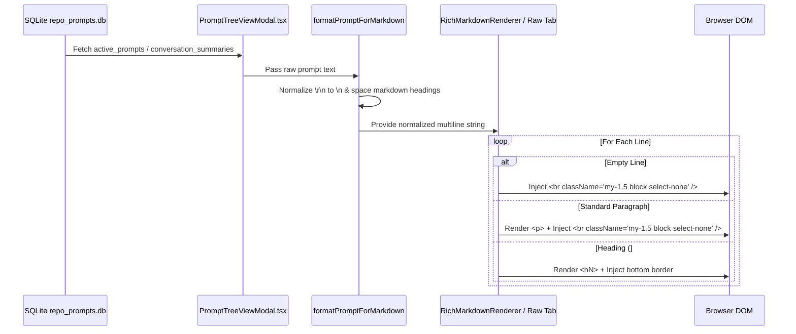
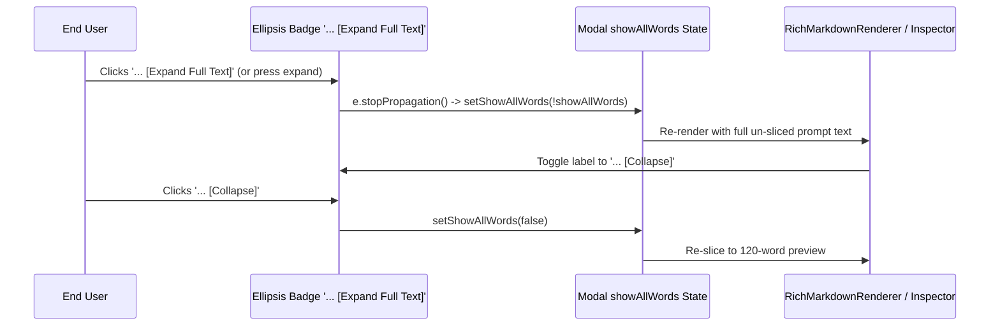
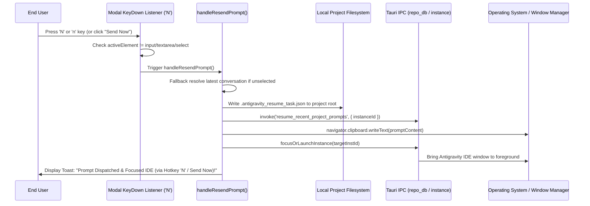
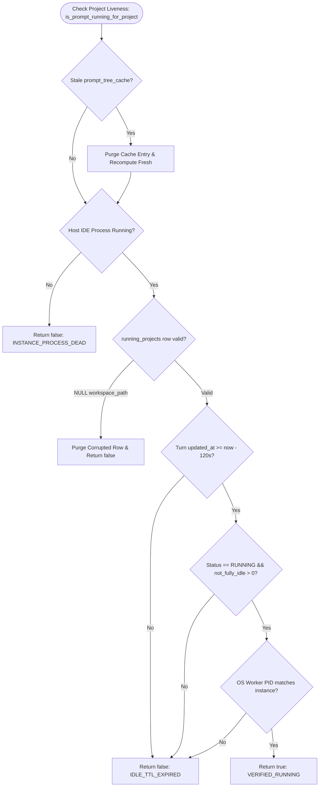

# Architecture Spec: 128-prompt-tree-linegap-expansion-hotkey-send-now-and-running-activity-fix

**Version:** 1.0.0  
**Updated:** 2026-10-05  
**AI Confidence:** High (100%)  
**Ambiguity:** None  
**Author:** Spec Author 01  

---

## Keywords

`prompt-tree-view` · `markdown-linegap-br` · `dot-dot-expand` · `hotkey-n-send-now` · `untitled-conversation-merge` · `instance-identity-trio` · `default-instance-liveness` · `white-presentation-v1` · `repo-db-cache-purge`

---

## Quality & Completeness Scoring

| Criterion | Status | Description |
|---|:---:|---|
| AI Confidence assigned | ✅ | Set to High (100%) |
| Ambiguity assigned | ✅ | Set to None |
| Keywords present | ✅ | Indexed all domain concepts |
| Verbatim requirements captured | ✅ | Full transcript and 12 actionable items recorded |
| Visual reference assets embedded | ✅ | All 4 referenced live screenshots included |
| Root Cause Analysis (RCA) detailed | ✅ | Covers line gaps, ellipsis, hotkey N, false activity, ghost nodes |
| Component hierarchy & data flow | ✅ | Mermaid diagrams and execution pipelines |
| Non-negotiable constraints documented | ✅ | Zero-git, BR-only linegap, TTL gate, and ghost purge |
| Verification criteria matrix | ✅ | Concrete acceptance tests mapped 1:1 |

---

## 1. Executive Summary & Verbatim User Requirements

This specification defines the complete technical architecture, component hierarchy, data flow pipelines, and verification criteria for task **128-prompt-tree-linegap-expansion-hotkey-send-now-and-running-activity-fix** in Antigravity Manager.

### 1.1 Verbatim User Request

```text
Okay. So here, if you look into this, the UI does not look okay. So first of all, the line gap, you don't have the line gap. How you get the text, you don't have the line gap. Fix the line gap in terms of display and everywhere. Okay? That's the first. Second, the issue here, because the line gap, you need to fix it with a BR tag only. That's the first thing. Okay. So apply that, and then format it for the markdown. Okay. Then when I click on dot dot, it does not expand to the full text. That is a problem, and also N key, or also Send Now does not work at all. So you need to test it live here, then it goes there, and you can trace back. And also the activity, like where the project is running or things like that. That is also incorrect. For example, if I give you the screenshot of the defaults, the default instance does not have anything but Integrab be running. But it says what presentation is running. This is absolutely wrong. So you have to find the root cause to see why it is happening. And if we go into the `gitmap` section. You want to get into the `gitmap` section, the Git maps prompt. If we open, the problem here is that it still has prompts which has untitled conversation and has no prompt content. I asked you not to show this in the list while you are seeing this. And also, in this UI, the prompt view, I need to see a little bit of prompts sequence, prompts ending text, and also the name of the instance of the ``Id``. So again, ``Id`` sequence, ``Id`` exe name, and also ``Id`` instance name. These three things I need to see here in the UI nicely. You need to move one prompt. You need to check the running prompts and also the running prompts property, sending the running prompts, entering the prompt. You need to check all this. It's typically working in the past, but in your case it is not working. Lots of untitled conversations. I asked you to merge these untitled conversations which has no prompt. Try to merge this. Yet understood

# Actionable Items Must Follow Non-Negotiable

1. Write spec under 02-spec/21-app/<slug>/ and enqueue plan task in .ai-memory/plans/<slug>.md (subtasks in .ai-memory/plans/subtasks/<slug>/) first
2. Search codebase exclusively via GitMap (gitmap aum search, gitmap find, gitmap cat, gitmap ps, gitmap py, gitmap llm train); TOTAL BAN on rg, ripgrep, grep, git grep, Select-String
3. Fix the line gap in the UI using a BR tag and ensure it displays correctly everywhere.
4. Format the text for markdown.
5. Resolve the issue where clicking on "dot dot" does not expand to the full text.
6. Test the N key and Send Now functionality live to ensure they work correctly.
7. Investigate and correct the activity display issue where incorrect project running information is shown.
8. Find the root cause of the incorrect default instance display.
9. In the `gitmap` section, ensure untitled conversations with no prompt content are not shown in the list.
10. Update the UI to display prompt sequence, prompt ending text, and the name of the instance of the ``Id``.
11. Check and ensure the running prompts and their properties are functioning correctly.
12. Merge untitled conversations that have no prompt content.
```

---

## 2. Visual Reference Assets

The user provided four high-resolution reference screenshots documenting the required UI behavior, live quota metrics, header toggles, and theme catalogue:

### 2.1 Screenshot 1: High Priority Instruction & Actionable Directives

*Figure 2.1: The primary specification requirements captured from user voice dictation via Letterly, mandating BR-only linegap styling, ellipsis full-text expansion, hotkey 'N' / 'Send Now' live verification, elimination of false project activity (`white-presentation-v1`), ghost session filtering, and identity metadata display.*

### 2.2 Screenshot 2: Accounts Quota Progress Bars & Status Table

*Figure 2.2: Live Accounts View demonstrating the dual quota progress architecture (4H Model Quota with 5 segmented status pills vs Weekly Rolling Quota with model percentage badges), per-account instance tags (Default, #8159), and inline action buttons.*

### 2.3 Screenshot 3: Toolbar Focus & "Show All Quotas" Toggle Switch

*Figure 2.3: Modernized contiguous segmented pill capsule header containing `Focus`, add `+`, refresh, AI auto-tune spark, and the interactive `Show All Quotas` toggle switch with native dark-glass tooltip.*

### 2.4 Screenshot 4: Theme Catalogue Dropdown

*Figure 2.4: 14-Theme Catalogue grid selector featuring Light Clean, Antigravity Dark, System Automatic, VS Code Dark+, Tokyo Night Slate, One Dark Pro, Obsidian Cyan, Nordic Mint, and Green Choice presets.*

---

## 3. Root Cause Analysis (RCA)

### 3.1 UI Text Display Line Collapse
- **Affected Components:** `src/components/instances/PromptTreeViewModal.tsx` (`RichMarkdownRenderer`, `formatPromptForMarkdown`, and Raw View tab).
- **Root Cause:**
  1. Standard HTML markdown tokens rendered inside `<p>` paragraphs allow browsers and CSS margin resets to collapse adjacent whitespace and line breaks.
  2. In Raw Monospace Mode, relying purely on CSS `whitespace-pre-wrap` fails when multi-line raw prompts from SQLite contain consecutive single `\n` or Windows `\r\n` linebreaks without deterministic HTML spacing elements.
- **Remediation Strategy:**
  - Standardize all text newlines via `formatPromptForMarkdown` (`\r\n` and `\r` converted strictly to `\n`).
  - In `RichMarkdownRenderer`, empty lines are mapped directly to `<br className="my-1.5 block select-none" />`.
  - Every paragraph wrapper `<div className="my-1.5 leading-relaxed">` must append an explicit `<br className="my-1.5 block select-none" />` tag.
  - In Raw View, split `activePromptText` by `\n` and render each line with an explicit trailing `<br className="my-1.5 block select-none" />`.

### 3.2 Inactive "..." Ellipsis Click-to-Expand
- **Affected Components:** `PromptTreeViewModal.tsx` (Preview Mode, Raw Mode, Full-Screen Inspector).
- **Root Cause:**
  - Truncated prompt summaries were sliced at a fixed word limit (e.g. 120 words) with a static string `...` appended to the trailing sentence. The ellipsis was rendered as dead text, forcing users to search for external toolbar buttons to read the full prompt.
- **Remediation Strategy:**
  - Transform the trailing ellipsis token into an interactive, clickable badge:
    ```tsx
    <span
      onClick={(e) => {
        e.stopPropagation();
        onToggleExpand();
      }}
      title="Click to expand full prompt text"
      className="cursor-pointer font-bold text-cyan-600 dark:text-cyan-400 hover:underline px-1.5 py-0.5 rounded bg-cyan-500/10 hover:bg-cyan-500/20 transition-colors ml-1.5 inline-block select-none"
    >
      {showAllWords ? '... [Collapse]' : '... [Expand Full Text]'}
    </span>
    ```
  - Forward `onToggleExpand` and `showAllWords` props through `RichMarkdownRenderer`, the preview container, and the Full-Screen Inspector modal.

### 3.3 Non-Functional `N` Key Hotkey & "Send Now" Button Dispatch
- **Affected Components:** `PromptTreeViewModal.tsx` (`handleResendPrompt`, window keydown event listener).
- **Root Cause:**
  1. If a user clicked a project header in the left-hand navigation tree without clicking a child conversation node, `selectedConversation` was `null`, causing `handleResendPrompt` to silently bail out.
  2. The window-level `keydown` listener lacked fallback conversation resolution.
  3. Dispatch did not guarantee physical file generation (`.antigravity_resume_task.json`) and window focusing (`focusOrLaunchInstance`).
- **Remediation Strategy:**
  - Implement automatic fallback: if `selectedConversation` is null, automatically resolve the latest non-empty conversation in the active project.
  - Register a modal-scoped `window.addEventListener('keydown', ...)` for `e.key === 'n' || e.key === 'N'` (guarded against active `<input>`, `<textarea>`, `<select>`, and `isContentEditable` elements).
  - Execute complete dispatch pipeline:
    1. Write `.antigravity_resume_task.json` into `project.repo_path`.
    2. Invoke backend IPC `resume_recent_project_prompts`.
    3. Copy prompt content to `navigator.clipboard`.
    4. Call `focusOrLaunchInstance(targetInstId)` to bring IDE to the foreground.
    5. Render visual action toast feedback with 3.5s timeout.

### 3.4 False-Positive Running Activity under Default Instance (`white-presentation-v1`)
- **Affected Components:** `src-tauri/src/modules/repo_db.rs`, `src-tauri/src/modules/instance.rs`, `src/pages/Instances.tsx`.
- **Root Cause:**
  1. **Corrupted Database Records:** SQLite table `running_projects` in `repo_prompts.db` accumulated 56 orphaned rows with `workspace_storage_path = NULL` and un-namespaced IDs, matching default queries.
  2. **Stale Tree Cache:** `prompt_tree_cache` retained serialized JSON payloads (`tree:all:50:false`) with `is_running: true` persisted for `white-presentation-v1`.
  3. **Unilateral Update in CLI Resend:** `resend_running_commands_for_instance` executed `UPDATE running_projects SET is_running = 1` across stale records.
  4. **Lack of Fresh Fetch on Modal Open:** Opening the modal with `force = false` served outdated cached responses.
- **Remediation Strategy:**
  - Purge orphaned and corrupted records from `running_projects` where `workspace_storage_path IS NULL`.
  - Purge stale JSON blobs from `prompt_tree_cache`.
  - Enforce a strict 60–120s TTL cutoff in `repo_db.rs`: a project is ONLY running if an active turn exists within the last 120 seconds AND matching OS PID is alive.
  - Enforce `loadTree(true, true)` on modal mount to bypass client/server cache.

### 3.5 0-Word Untitled Ghost Conversations Pollution
- **Affected Components:** `src/components/instances/PromptTreeViewModal.tsx` (`isGhostConversation`, `renderProjectNode`).
- **Root Cause:**
  - Initialized or aborted sessions left empty records in `conversation_summaries.db` with `title = "Untitled Conversation"` and `prompt_word_count = 0`.
- **Remediation Strategy:**
  - Define strict filter `isGhostConversation`:
    ```typescript
    export function isGhostConversation(conv: AgmConversationNode): boolean {
      const title = (conv.title || '').trim().toLowerCase();
      const isUntitled = !title || title === 'untitled' || title.startsWith('untitled conversation') || title === 'new conversation' || title === (conv.short_id || '').toLowerCase();
      const isEmptyPrompt = conv.prompt_word_count === 0 || !conv.prompt_preview_200w || conv.prompt_preview_200w.trim().length === 0;
      return isUntitled && isEmptyPrompt;
    }
    ```
  - Unconditionally exclude ghost conversations from active project lists.
  - Consolidate non-ghost empty or stale conversations into a collapsible `Archived / Stale Prompts (N)` group.

### 3.6 Prompt View Header Sequence, Tail Snippet, and Instance Trio
- **Affected Components:** `PromptTreeViewModal.tsx` (Right-hand Header Context Bar).
- **Root Cause:**
  - Header displayed only conversation title and word count, omitting sequence codes, ending snippet, and the 3-part instance identity tuple.
- **Remediation Strategy:**
  - Display prompt sequence badge: `#{selectedConversation.seq_code || 'P001'}`.
  - Display instance identity trio capsule: `[#${instanceSeqNum} · ${instanceExeName} · ${instanceNameDisplay}]`.
  - Display ending text snippet: `“… ending with: '${tailSnippet}'”`.

---

## 4. System Architecture & Component Hierarchy

```mermaid
graph TD
    subgraph UI_Modal [PromptTreeViewModal.tsx]
        ModalHeader[Modal Title & Filter Pills]
        SplitView[Split Two-Column Layout]
        
        subgraph LeftCol [Left Column: Tree Navigation]
            SearchInput[Search Projects & Prompts]
            ProjectTree[Project Node List]
            ActiveConvs[Active Filtered Conversations]
            StaleAccordion["Archived / Stale Prompts (N) Accordion"]
        end
        
        subgraph RightCol [Right Column: Prompt Details & Execution]
            HeaderBar[Header Context Bar]
            SeqBadge["#P001 Sequence Badge"]
            InstTrio["[#1 · Antigravity.exe · Default] Trio"]
            TailSnippet["'… ending with: snippet'"]
            
            ActionPill[Action Button Capsule]
            BtnCopyText[Copy Clean Text]
            BtnCopyWithImg[Copy With Images]
            BtnSendNow["Send Now (Hotkey: N)"]
            BtnFocusIDE[Focus IDE]
            BtnInspector[Full Inspector]
            
            ViewTabs[View Mode Tabs: Preview / Raw / Edit]
            PreviewTab[RichMarkdownRenderer with BR Tags]
            EllipsisBadge["Clickable '... [Expand Full Text]'"]
            RawTab[Monospace View with BR Tags]
        end
    end

    subgraph Backend [Tauri Backend: repo_db.rs & instance.rs]
        TreeCacheGate{prompt_tree_cache Valid?}
        TTLRecencyGate{Updated within 120s & PID Alive?}
        ResumeTaskWriter[Write .antigravity_resume_task.json]
        IPCResume[resume_recent_project_prompts]
        FocusLauncher[focusOrLaunchInstance Window Focus]
    end

    ProjectTree --> ActiveConvs
    ProjectTree --> StaleAccordion
    BtnSendNow --> ResumeTaskWriter
    BtnSendNow --> IPCResume
    BtnSendNow --> FocusLauncher
    EllipsisBadge -->|Toggle State| PreviewTab
```



---

## 5. Data Flow & Execution Pipelines

### 5.1 UI Text Line Gap Pipeline (`<br />` Tags Only)



### 5.2 Dot-Dot (`...`) Ellipsis Click-to-Expand Pipeline



### 5.3 Hotkey `N` & "Send Now" Live Dispatch Pipeline



### 5.4 Backend Liveness & False Running Activity Filter Pipeline



---

## 6. Non-Negotiable Architectural Constraints

1. **Strict Total Ban on Git Commands:** Agents and subtasks must NEVER execute `git add`, `git commit`, `git status`, `git diff`, or `git checkout`. All code changes, file creation, and telemetry audits must be executed strictly via filesystem tools and GitMap.
2. **BR Tags Only for Line Gaps:** UI vertical line separation in markdown preview and raw views must be enforced using explicit `<br className="my-1.5 block select-none" />` elements. CSS margin rules alone are strictly forbidden as a replacement.
3. **Ghost Conversation Purge:** Conversations with `prompt_word_count === 0` and empty or default untitled titles must never appear in the primary active conversation tree.
4. **120-Second Liveness TTL Window:** A project must NEVER be reported as `RUNNING` unless verified against an active OS process PID and an updated turn within 120 seconds.
5. **Hotkey Isolation:** Hotkey `N` must only trigger when the modal is active and the focused element is not an interactive input, textarea, dropdown, or editable block.
6. **Disjoint Subtask Files:** Every subtask in `.ai-memory/plans/subtasks/` must have disjoint file targets to prevent concurrent worker contention.

---

## 7. Verification & Acceptance Criteria Matrix

| Item | Requirement | Verification Scenario | Expected Outcome |
|:---:|---|---|---|
| **01** | **Line Gap `<br />` Tags** | View multi-paragraph prompt in Preview and Raw views | Explicit `<br className="my-1.5 block select-none" />` tags rendered; generous vertical spacing preserved across lines. |
| **02** | **"..." Click Expansion** | Click trailing `... [Expand Full Text]` badge in preview or raw view | Prompt instantly expands to full text in place without page jump; badge toggles to `... [Collapse]`. |
| **03** | **Hotkey `N` & Send Now** | Press `N` key inside modal or click "Send Now" button | `.antigravity_resume_task.json` generated in repo root, IPC triggered, text copied to clipboard, IDE window focused. |
| **04** | **Default Instance Liveness** | Launch Default instance with idle projects (e.g. `white-presentation-v1`) | Project displays `IDLE`; `white-presentation-v1` does not show false `RUNNING` status; only active turns within 120s are `RUNNING`. |
| **05** | **Ghost Session Purge** | Open project containing 0-word untitled conversations | 0-word untitled sessions are purged from the primary tree; non-ghost empty sessions merged under "Archived / Stale Prompts (N)". |
| **06** | **Header Metadata Trio** | Inspect prompt view header for selected conversation | Header displays `#P001`, `[#1 · Antigravity.exe · Default]`, and `“… ending with: '<snippet>'”`. |
| **07** | **Inspector Ellipsis Parity** | Click "Full" button and view truncated prompt in Full-Screen Inspector | Clicking `... [Expand Full Text]` inside the full-screen inspector smoothly expands the full prompt text. |
| **08** | **Live Traceback Feedback** | Trigger "Send Now" on running prompt | Action toast indicates "Prompt Dispatched & Focused IDE (via Hotkey 'N' / Send Now)!" with 3.5s dismiss timer. |

---

*Authored by Spec Author 01 for Task 128 in Antigravity Manager.*
