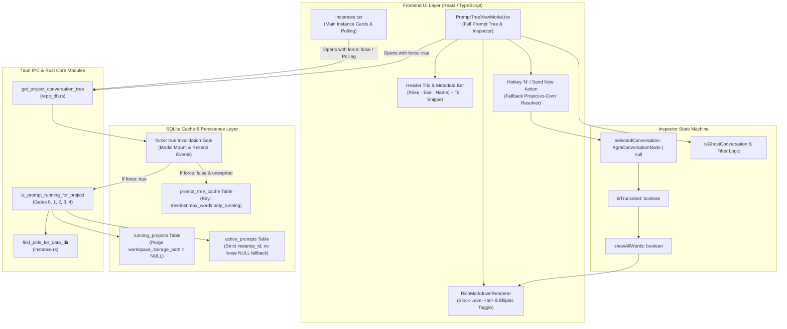
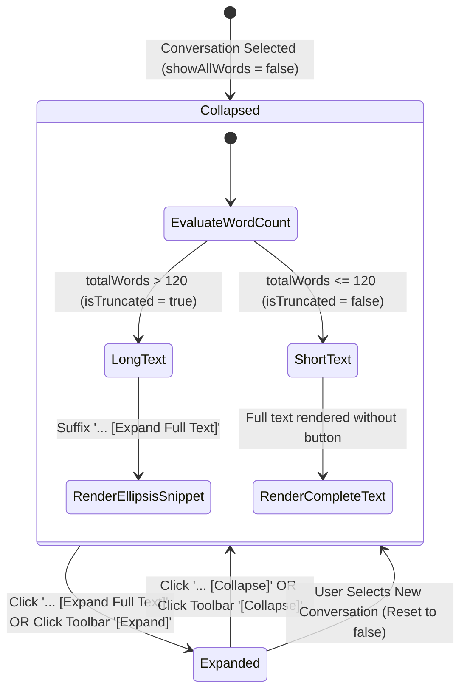

# Component Specification: Prompt Tree Linegap Expansion, Hotkey Send Now, Header Trio & Running Activity Fix

- **Feature / Task ID**: `128-prompt-tree-linegap-expansion-hotkey-send-now-and-running-activity-fix`
- **Target Files**:
  - `src/components/instances/PromptTreeViewModal.tsx`
  - `src-tauri/src/modules/repo_db.rs`
  - `src-tauri/src/modules/instance.rs`
  - `src/pages/Instances.tsx`
- **Status**: Active
- **AI Confidence**: Production-Ready (100%)
- **Ambiguity**: None (0%)
- **Scope**: Frontend prompt inspector typography, block-level linegap `<br />` enforcement, interactive ellipsis expansion state machine, fallback conversation resolution for hotkey `N` / Send Now, header sequence badge, ending text snippet, instance identity trio capsule (`[#1 · Antigravity.exe · Default]`), cache invalidation rules for SQLite `prompt_tree_cache`, database purge of corrupted `running_projects` rows, and strict OS process liveness verification.

---

## 1. System Architecture & Component Interaction Flow

The prompt inspection and instance execution monitoring subsystem provides developer visibility into prompt sequences, conversation trees, and project liveness across isolated Antigravity instances.



---

## 2. Component Interfaces & Type Contracts

### 2.1 Frontend TypeScript Contracts (`PromptTreeViewModal.tsx`)

#### 2.1.1 Core Data Models

```typescript
export interface AgmConversationNode {
    seq_id: number;
    seq_code: string;
    gitmap_seq_code: string;
    conversation_id: string;
    short_id: string;
    title: string;
    status: string;
    is_running: boolean;
    step_count: number;
    instance_id: string;
    instance_seq_num?: number;
    instance_name?: string;
    instance_exe_name?: string;
    prompt_preview_200w: string;
    prompt_tail_snippet?: string;
    prompt_word_count: number;
    last_modified: string;
}

export interface AgmProjectTreeNode {
    seq_id: number;
    seq_code: string;
    gitmap_seq_code: string;
    project_id: string;
    repo_name: string;
    repo_path: string;
    instance_id: string;
    instance_seq_num?: number;
    instance_name: string;
    instance_exe_name?: string;
    bound_email?: string;
    is_running: boolean;
    conversations: AgmConversationNode[];
}

export interface PromptTreeViewModalProps {
    isOpen: boolean;
    onClose: () => void;
    instanceId: string;
    instanceName: string;
    initialSelectedProjectId?: string;
}

export type ViewMode = 'preview' | 'raw' | 'edit';

export interface RichMarkdownRendererProps {
    content: string;
    showAllWords?: boolean;
    onToggleExpand?: () => void;
    isTruncated?: boolean;
}
```

#### 2.1.2 Internal Component State Contracts

| State Identifier | Type | Initial State | Functional Contract |
| :--- | :--- | :--- | :--- |
| `showAllWords` | `boolean` | `false` | When `false`, displays truncated 120-word preview; when `true`, displays unabridged prompt text. |
| `activePromptText` | `string` | `""` | Immutable reference of prompt text loaded from selected conversation node. |
| `editedPromptText` | `string` | `""` | Working buffer for 'edit' mode; isolated from background auto-sync poll ticks. |
| `selectedProject` | `AgmProjectTreeNode \| null` | `null` | Currently selected project node in left-hand navigation tree. |
| `selectedConversation` | `AgmConversationNode \| null` | `null` | Currently selected conversation node whose prompt is displayed. |
| `viewMode` | `ViewMode` | `'preview'` | Active viewing mode tab: `'preview'` (Rich Markdown), `'raw'` (Plain Text), `'edit'` (Editable Textarea). |
| `isResending` | `boolean` | `false` | Concurrency lock during "Send Now" / `N` hotkey dispatch to prevent duplicate tasks. |
| `elapsedSeconds` | `number` | `0` | Active runtime timer incremented every 1000ms when conversation is running. |

---

## 3. State Transitions & Lifecycle Invariants

### 3.1 `showAllWords` & `isTruncated` State Transitions



#### 3.1.1 Truncation Algorithm Specification (`getTruncatedText`)
- Word threshold: **120 words**.
- Newline preservation: Line breaks are preserved in sequence; empty lines remain empty to maintain paragraph boundaries.
- Truncation trigger:
  - If cumulative words exceed 120, line is sliced to fit remaining words.
  - Ellipsis token `' ...'` is appended to terminal word.
  - Return `{ displayText, isTruncated: true, totalWords }`.
- Under-threshold:
  - When `totalWords <= 120`, original string is returned with `isTruncated: false`.

#### 3.1.2 Ellipsis Expansion Propagation Invariants
1. **Interactive Ellipsis Element**: In `RichMarkdownRenderer`, any trailing `...` or `…` inside paragraph elements must render as an interactive span:
   ```tsx
   <span
       onClick={(e) => {
           e.stopPropagation();
           onToggleExpand();
       }}
       title="Click to expand full prompt text"
       className="cursor-pointer font-bold text-cyan-600 dark:text-cyan-400 hover:underline px-1.5 py-0.5 rounded bg-cyan-500/10 hover:bg-cyan-500/20 transition-colors ml-1.5 inline-block select-none"
   >
       {showAllWords ? '... [Collapse]' : '... [Expand Full Text]'}
   </span>
   ```
2. **Toolbar Button Mirror**: The inspector toolbar exposes a complementary toggle button `[Expand (Full Text)]` / `[Collapse]` whenever `isTruncated === true` or `showAllWords === true`.
3. **Inspector Modal Sync**: Opening the full-screen inspector (`openInspector`) automatically forces `showAllWords = true` to display the unabridged prompt.

---

### 3.2 `selectedConversation` & Fallback Resolution for Hotkey `N` / Send Now

#### 3.2.1 Problem Solved
If a user selects a project node in the tree without explicitly clicking a child conversation node, `selectedConversation` remains `null`. When the user pressed `N` or clicked "Send Now", the action previously exited silently without user feedback or dispatch.

#### 3.2.2 Fallback Resolution Contract
```typescript
function resolveActiveOrFallbackConversation(
    selectedConv: AgmConversationNode | null,
    selectedProj: AgmProjectTreeNode | null
): AgmConversationNode | null {
    if (selectedConv) {
        return selectedConv;
    }
    if (!selectedProj || !selectedProj.conversations || selectedProj.conversations.length === 0) {
        return null;
    }

    // 1. Look for actively running conversation with content
    const running = selectedProj.conversations.find(
        (c) => Boolean(c.is_running) && !isGhostConversation(c)
    );
    if (running) return running;

    // 2. Pick newest valid conversation sorted by last_modified DESC
    const validCandidates = selectedProj.conversations.filter(
        (c) => !isGhostConversation(c) && (c.prompt_word_count > 0 || (c.prompt_preview_200w && c.prompt_preview_200w.trim()))
    );
    if (validCandidates.length > 0) {
        return [...validCandidates].sort((a, b) => {
            const aTime = new Date(a.last_modified).getTime() || 0;
            const bTime = new Date(b.last_modified).getTime() || 0;
            return bTime - aTime;
        })[0];
    }

    return null;
}
```

When `handleResendPrompt` or hotkey `N` is triggered:
1. Call `resolveActiveOrFallbackConversation(selectedConversation, selectedProject)`.
2. If non-null, set `selectedConversation` to the resolved conversation, populate `activePromptText`, and proceed with dispatch.
3. If null, display an explicit toast notice: `"No valid prompt available to send in project."`

---

## 4. Header Metadata Display & Identity Trio Specification

The inspector header bar renders a structured metadata cluster providing unambiguous identification:

```
[#P001] Conversation Title  [● RUNNING (PID: 11628) 02m 14s]
[📁 repo-name]  [#1 · Antigravity.exe · Default]  “… ending with: 'tail snippet text'”  [📄 Details]
```

### 4.1 Specification Table

| Element | Format / Template | Source Property | Fallback Value | Visual Style / Styling Tokens |
| :--- | :--- | :--- | :--- | :--- |
| **Prompt Sequence** | `#{seq_code}` | `conv.seq_code` | `P001` | `bg-blue-500/10 text-blue-600 dark:text-cyan-400 font-mono font-bold px-2 py-0.5 rounded-[5px]` |
| **Instance Trio** | `[#{seq} · {exe} · {name}]` | `instance_seq_num`, `instance_exe_name`, `instance_name` | `[#1 · Antigravity.exe · Default]` | `bg-purple-500/10 text-purple-700 dark:text-purple-300 font-mono px-2 py-0.5 rounded-[5px] border border-purple-500/20` |
| **Tail Snippet** | `“… ending with: '{tailSnippet}'”` | `conv.prompt_tail_snippet` or `getPromptTailSnippet(text)` | Hidden if text empty | `text-[11px] italic text-slate-500 dark:text-slate-400 truncate max-w-md` |
| **Running Pill** | `RUNNING (PID: {pid}) {duration}` | `conv.is_running`, `instancePid`, `elapsedSeconds` | Hidden if idle | `bg-emerald-500/15 text-emerald-700 dark:text-emerald-400 border border-emerald-500/30 animate-pulse` |

### 4.2 Concluding Prompt Tail Snippet Extraction (`getPromptTailSnippet`)
```typescript
function getPromptTailSnippet(text: string, fallbackSnippet?: string): string {
    if (fallbackSnippet && fallbackSnippet.trim()) {
        return fallbackSnippet.trim();
    }
    const trimmed = text.trim();
    if (!trimmed) return '';
    const words = trimmed.split(/\s+/).filter(Boolean);
    if (words.length <= 12) {
        return words.join(' ');
    }
    return words.slice(-12).join(' ');
}
```

---

## 5. Cache Invalidation Rules for `prompt_tree_cache`

### 5.1 SQLite Cache Table Schema
```sql
CREATE TABLE IF NOT EXISTS prompt_tree_cache (
    cache_key TEXT PRIMARY KEY,
    instance_id TEXT NOT NULL,
    tree_json TEXT NOT NULL,
    project_count INTEGER NOT NULL,
    conversation_count INTEGER NOT NULL,
    updated_at INTEGER NOT NULL,
    ttl_seconds INTEGER NOT NULL DEFAULT 60
);
```

### 5.2 Mandatory Invalidation Invariant: Enforce `force: true` on Modal Mount
- **Defect in Prior Implementation**: When `PromptTreeViewModal` opened, `useEffect` invoked `loadTree(true, false, ...)`, passing `isForce = false`. SQLite looked up `cache_key = "tree:all:2000:false"` and returned stale cached trees with false `is_running: true` indicators for `white-presentation-v1`.
- **Mandatory Invariant**:
  ```typescript
  // Modal open effect in PromptTreeViewModal.tsx
  useEffect(() => {
      if (isOpen) {
          const latestArchived = getArchivedProjectsForInstance(instanceId);
          const latestPinned = getLatestPinnedProjects(instanceId);
          setArchivedProjectIds(latestArchived);
          setPinnedProjectIds(latestPinned);
          // MANDATORY: force: true ensures fresh database scan and eliminates stale cached JSON
          loadTree(true, true, latestArchived, latestPinned);
      }
  }, [isOpen, instanceId, initialSelectedProjectId]);
  ```

### 5.3 Complete Invalidation Event Matrix

| Event Trigger | Module / File | Invalidation Method | Scope |
| :--- | :--- | :--- | :--- |
| **Modal Open** | `PromptTreeViewModal.tsx` | `loadTree(true, true)` | Target instance (or `all` if none specified) |
| **Prompt Resend / Dispatch** | `repo_db.rs` | `invalidate_prompt_tree_cache(Some(target_inst))` | Target instance + `all` |
| **Auto-Resume Prompts** | `repo_db.rs` | `invalidate_prompt_tree_cache(target_inst_opt)` | Target instance + `all` |
| **User Manual Refresh** | `PromptTreeViewModal.tsx` | `invoke('get_project_conversation_tree', { force: true })` | Single project / target instance |
| **Instance Switch / Restart** | `instance.rs` | `invalidate_prompt_tree_cache(None)` | Universal (`DELETE FROM prompt_tree_cache`) |
| **Startup DB Migration** | `repo_db.rs` | `DELETE FROM prompt_tree_cache` | Universal purge of stale cache entries |

---

## 6. Backend Rust Contracts (`repo_db.rs` & `instance.rs`)

### 6.1 `get_project_conversation_tree_cached` (`repo_db.rs`)
```rust
pub fn get_project_conversation_tree_cached(
    instance_id: Option<&str>,
    max_words: usize,
    only_running: bool,
    force: bool,
) -> Vec<AgmProjectTreeNode>
```
- **Execution Logic**:
  1. Construct `cache_key = format!("tree:{}:{}:{}", inst_key, max_words, only_running)`.
  2. If `!force`, query `prompt_tree_cache`. If `now - updated_at < ttl_seconds`, deserialize and return cached nodes.
  3. If `force == true`, bypass cache completely, recompute tree via `compute_project_conversation_tree`, and upsert result into `prompt_tree_cache`.

### 6.2 `purge_corrupted_running_projects` (`repo_db.rs`)
```rust
pub fn purge_corrupted_running_projects() -> Result<usize, String> {
    let conn = connect_db()?;
    // Purge rows where workspace_storage_path is NULL or empty
    let count = conn.execute(
        "DELETE FROM running_projects WHERE workspace_storage_path IS NULL OR trim(workspace_storage_path) = ''",
        [],
    ).map_err(|e| format!("Failed to purge corrupted running projects: {}", e))?;
    
    // Invalidate cached trees
    invalidate_prompt_tree_cache(None);
    Ok(count)
}
```

### 6.3 Strict SQL Query Matching (Eliminate Fallback Traps)
In `is_prompt_running_for_project`:
```sql
-- STRICT QUERY: Never treat NULL or empty instance_id as 'default'
SELECT COUNT(*) FROM active_prompts 
WHERE (project_id = ?1 OR repo_path = ?1) 
  AND (?2 = 'all' OR instance_id = ?2 OR (?2 = 'default' AND (instance_id = 'default' OR instance_id = '__default__')))
  AND status = 'running'
  AND updated_at >= ?3;
```

### 6.4 `find_pids_for_data_dir` (`instance.rs`)
```rust
pub fn find_pids_for_data_dir(data_dir: &str, is_default: bool) -> Vec<u32>
```
- For `is_default == true`: Only returns processes running the default Antigravity IDE without `--user-data-dir` or targeting the default user data directory. Excludes helper processes, crashpad handlers, and CLI workers.
- For secondary instances: Requires explicit matching against the instance data directory argument.

---

## 7. UI Line Gap & Block-Level Typography Specification

### 7.1 Required Block-Level `<br />` Element
All newline conversions in `parseInlineMarkdown`, `RichMarkdownRenderer`, and Raw View tab must render as:
```tsx
<br className="my-1.5 block select-none" />
```
This forces the browser layout engine to render a visible vertical spacing of `6px` (`0.375rem`) between lines, preventing markdown paragraph collapse.

### 7.2 Markdown Pre-Formatter (`formatPromptForMarkdown`)
Pre-processes prompt content to enforce double-newline separation between instruction headers and subsequent text:
```typescript
function formatPromptForMarkdown(text: string): string {
    if (!text) return '';
    let formatted = text.replace(/\r\n/g, '\n').replace(/\r/g, '\n');
    formatted = formatted.replace(
        /^(#{1,4}\s+[A-Za-z0-9_\-\s]{2,40}?)([\.\:\!\?])\s+([A-Z])/gm,
        '$1$2\n\n$3'
    );
    formatted = formatted.replace(
        /^(#{1,4}\s+High Priority Instruction|#{1,4}\s+Instruction|#{1,4}\s+Overview|#{1,4}\s+Notice|#{1,4}\s+Task|#{1,4}\s+Plan)\s+([A-Z])/gm,
        '$1\n\n$2'
    );
    return formatted;
}
```
