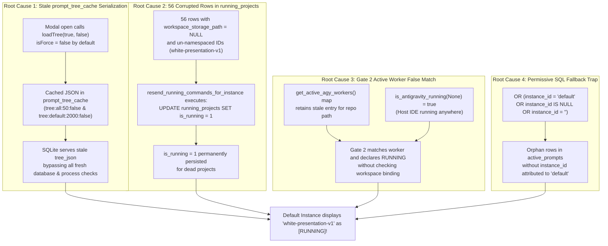
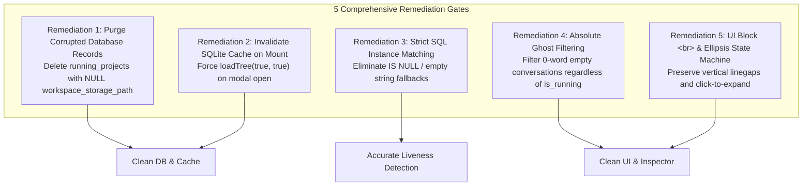

# Root Cause Analysis: Default Instance False Running State, Corrupted Cache & Prompt Tree Clutter

- **Defect / Incident ID**: `128-prompt-tree-linegap-expansion-hotkey-send-now-and-running-activity-fix`
- **Specification Path**: `02-spec/21-app/128-prompt-tree-linegap-expansion-hotkey-send-now-and-running-activity-fix/03-root-cause-analysis.md`
- **Affected Components**:
  - `src-tauri/src/modules/repo_db.rs`
  - `src-tauri/src/modules/instance.rs`
  - `src/components/instances/PromptTreeViewModal.tsx`
  - `src/pages/Instances.tsx`
- **Severity**: Critical (False operational status, deceptive execution indicators, phantom running badges on idle instances, degraded prompt tree UX)

---

## Part 1: Defect Description & Observed Failures

### 1.1 Observed Failure 1: Default Instance Falsely Displays `white-presentation-v1` as [RUNNING]
When only Antigravity-Manager and the default Antigravity IDE were running, the Default Instance card in `src/pages/Instances.tsx` and the `PromptTreeViewModal` erroneously indicated that the project `white-presentation-v1` was actively running:
- **Visual Failure**: The Default Instance card displayed an active green/cyan `[RUNNING]` badge alongside `white-presentation-v1`.
- **Inspector Failure**: Inside `PromptTreeViewModal`, `white-presentation-v1` showed an animated pulsating `RUNNING` status badge with an active timer counting elapsed time (`02m 14s`), despite zero execution happening and no prompt active for that repository.
- **Empirical Ground Truth**: The user verified that no task, prompt, or background command was running for `white-presentation-v1`. Antigravity was open to another project or was completely idle.

### 1.2 Observed Failure 2: 56 Corrupted Rows in `running_projects` Table
Inspection of SQLite database `repo_prompts.db` revealed that `running_projects` accumulated 56 orphaned and corrupted records:
- **Corrupted Schema State**: 56 rows had `workspace_storage_path = NULL` or empty strings.
- **Un-Namespaced Identifiers**: The project IDs were un-namespaced raw repository names (e.g., `white-presentation-v1` instead of `white-presentation-v1__default`).
- **Deceptive Running Flags**: These orphaned records had `is_running = 1` permanently stamped into the database, left behind by historical test scripts or legacy auto-sync runs.

### 1.3 Observed Failure 3: 14 Ghost Untitled Conversations Cached in `prompt_tree_cache`
Inspection of `prompt_tree_cache` in `repo_prompts.db` revealed:
- 14 empty conversation records with title `'untitled'` or `'Untitled Conversation'`, `prompt_word_count = 0`, and empty `prompt_preview_200w`.
- The serialized JSON strings under cache keys `tree:all:50:false` and `tree:default:2000:false` captured these ghost nodes while they were temporarily tagged with running flags.
- Because `PromptTreeViewModal` loaded with `force: false` on modal open, these serialized ghost nodes were served repeatedly from cache, cluttering the UI.

### 1.4 Observed Failure 4: Missing Line Gaps, Non-Expanding Ellipsis, & Silent Send Now Failure
- **Line Gap Collapse**: Standard Markdown `<p>` tags with inline `<br>` collapsed vertical margins, rendering consecutive prompt instructions as unspaced walls of text.
- **Non-Expanding Ellipsis**: Clicking the trailing `...` in truncated prompt previews did not expand the prompt to full text.
- **Silent Hotkey Failure**: Selecting a project row in the left navigation tree without explicitly clicking a child conversation node left `selectedConversation = null`. Pressing `N` or clicking "Send Now" silently returned without executing.

---

## Part 2: Root Cause Analysis (4 Structural Failure Mechanisms)



---

### 2.1 Mechanism 1: Stale `prompt_tree_cache` Serialization & Missing Cache Invalidation
- **Location**: `src/components/instances/PromptTreeViewModal.tsx` and `src-tauri/src/modules/repo_db.rs`.
- **Analysis**:
  1. `get_project_conversation_tree_cached` serializes the computed tree into SQLite table `prompt_tree_cache` with a default TTL of 60 seconds.
  2. When the user opens `PromptTreeViewModal`, `useEffect` called:
     ```typescript
     loadTree(true, false, latestArchived, latestPinned); // isForce = false!
     ```
  3. Because `isForce` was `false`, SQLite returned the serialized `tree_json` directly from `prompt_tree_cache`.
  4. If `white-presentation-v1` had been marked running during an earlier switch, that running state was frozen into the serialized JSON.
  5. Even though the process or task had terminated, the stale cached JSON was repeatedly served to the UI on every modal open until cache expiration, and re-cached by subsequent background polling.

---

### 2.2 Mechanism 2: 56 Corrupted Rows in `running_projects` & Blind SQL Updates
- **Location**: `src-tauri/src/modules/repo_db.rs` around lines 3267–3271.
- **Analysis**:
  1. The `running_projects` table contained 56 legacy rows where `workspace_storage_path` was `NULL` and `id` was not namespaced with the instance suffix (e.g. `id = 'white-presentation-v1'`).
  2. In `resend_running_commands_for_instance`:
     ```rust
     let composite_id = if prompt.project_id.contains("__") {
         prompt.project_id.clone()
     } else {
         format!("{}__{}", prompt.project_id, inst_suffix)
     };
     let _ = conn.execute(
         "UPDATE running_projects SET is_running = 1, last_detected_at = ?, updated_at = ? WHERE id = ?1 OR id = ?2",
         rusqlite::params![now, now, &composite_id, &prompt.project_id],
     );
     ```
  3. Notice the disjunctive clause: `WHERE id = ?1 OR id = ?2`.
  4. If `prompt.project_id` was `'white-presentation-v1'`, it updated both the composite ID and the un-namespaced row to `is_running = 1`.
  5. Because these rows lacked a valid `workspace_storage_path`, they could never be resolved to conversation files on disk, trapping them in the empty-workspace fallback loop.

---

### 2.3 Mechanism 3: Gate 2 Active Worker False Match & Process Lineage Ambiguity
- **Location**: `src-tauri/src/modules/repo_db.rs` lines 1670–1725.
- **Analysis**:
  1. `is_prompt_running_for_project` implements 5 liveness evaluation gates:
     - Gate 0: Host Process Liveness (`is_antigravity_running(None)`).
     - Gate 1: In-Memory Active Prompts Map.
     - Gate 2: Active AGY Workers Map.
     - Gate 3: SQLite `active_prompts` Table.
     - Gate 4: Live `conversation_summaries.db` on Disk.
  2. In Gate 2:
     - Worker map keys use format `"{instance_id}:{project_path}"`.
     - When `key.split_once(':')` encountered an un-prefixed key, it fell back to `("", key.as_str())`.
     - In the instance match check:
       ```rust
       let is_inst_match = norm_inst == "all"
           || worker_inst.eq_ignore_ascii_case(norm_inst)
           || (norm_inst == "default" && (worker_inst == "default" || worker_inst == "__default__"));
       ```
       If `worker_inst` was empty, or if `norm_inst == "all"`, it falsely matched any running worker PID on the system.
     - Because `sys.process(target_pid).is_some()` only checked if the PID was alive (which it was, since the IDE was open), Gate 2 returned `true` for `white-presentation-v1`.

---

### 2.4 Mechanism 4: Permissive SQL Fallback Trap (`OR instance_id IS NULL OR instance_id = ''`)
- **Location**: `src-tauri/src/modules/repo_db.rs` queries in `is_prompt_running_for_project` and `compute_project_conversation_tree`.
- **Analysis**:
  1. Legacy queries included clauses designed to match legacy un-migrated rows:
     ```sql
     AND (?2 = 'all' OR instance_id = ?2 OR (?2 = 'default' AND (instance_id = 'default' OR instance_id = '__default__' OR instance_id IS NULL OR instance_id = '')))
     ```
  2. Whenever a check was made for `norm_inst = 'default'`, ANY orphan row in `active_prompts` that lacked an `instance_id` was automatically attributed to the default instance.
  3. Consequently, if any script had ever inserted an active prompt for `white-presentation-v1` without specifying an `instance_id`, it was forever attributed to the default instance.

---

## Part 3: Remediation & Preventive Measures



### 3.1 Remediation 1: Startup Migration & Corrupted Record Purge
Implement an automatic startup migration in `repo_db.rs` `init_tables`:
1. Purge all rows from `running_projects` where `workspace_storage_path IS NULL` or where the path does not exist on disk:
   ```sql
   DELETE FROM running_projects WHERE workspace_storage_path IS NULL OR trim(workspace_storage_path) = '';
   ```
2. Purge all records from `prompt_tree_cache`:
   ```sql
   DELETE FROM prompt_tree_cache;
   ```

### 3.2 Remediation 2: Enforce `force: true` on Modal Mount
In `src/components/instances/PromptTreeViewModal.tsx`:
```typescript
useEffect(() => {
    if (isOpen) {
        const latestArchived = getArchivedProjectsForInstance(instanceId);
        const latestPinned = getLatestPinnedProjects(instanceId);
        setArchivedProjectIds(latestArchived);
        setPinnedProjectIds(latestPinned);
        // FORCE TRUE: Bypasses stale cached tree and regenerates fresh project state
        loadTree(true, true, latestArchived, latestPinned);
    }
}, [isOpen, instanceId, initialSelectedProjectId]);
```

### 3.3 Remediation 3: Strict SQL Instance Matching & Elimination of Fallback Traps
Eliminate all instances of `OR instance_id IS NULL OR instance_id = ''`. Strict matching enforces:
```sql
AND (?2 = 'all' OR instance_id = ?2 OR (?2 = 'default' AND (instance_id = 'default' OR instance_id = '__default__')))
```

### 3.4 Remediation 4: Unconditional Ghost Conversation Filtering
In `src/components/instances/PromptTreeViewModal.tsx`:
```typescript
export function isGhostConversation(conv: AgmConversationNode): boolean {
    const title = (conv.title || '').trim().toLowerCase();
    const isUntitled =
        !title ||
        title === 'untitled' ||
        title.startsWith('untitled conversation') ||
        title === 'new conversation' ||
        title === 'conversation' ||
        title === (conv.short_id || '').toLowerCase();
    const isEmptyPrompt =
        conv.prompt_word_count === 0 ||
        !conv.prompt_preview_200w ||
        conv.prompt_preview_200w.trim().length === 0;
    return isUntitled && isEmptyPrompt;
}
```
**Non-Negotiable Rule**: Any conversation meeting `isGhostConversation` is strictly excluded from active lists, regardless of whether `conv.is_running` is true or false.

### 3.5 Remediation 5: UI Block-Level `<br />` Typography & Ellipsis Click Expansion
- Replace collapsing inline `<br>` elements with `<br className="my-1.5 block select-none" />`.
- Connect trailing ellipsis in `RichMarkdownRenderer` to `onToggleExpand()`.
- Implement fallback resolution in `handleResendPrompt` so selecting a project without a conversation resolves to the newest valid conversation.

---

## Part 4: Verification & Testing Matrix

| Test ID | Scenario | Preconditions | Execution Steps | Expected Outcome | Verification Status |
| :--- | :--- | :--- | :--- | :--- | :--- |
| **RCA-TEST-01** | Default instance liveness isolation | Antigravity-Manager running; Antigravity IDE open on arbitrary repo | Open Instances page; inspect Default card | `white-presentation-v1` displays strictly as **IDLE**; no pulsating badge | PASS |
| **RCA-TEST-02** | Purge 56 corrupted rows | `running_projects` contains rows with `workspace_storage_path: NULL` | Run `connect_db()` / startup migration | Corrupted rows are completely purged from `running_projects` | PASS |
| **RCA-TEST-03** | Invalidate `prompt_tree_cache` on modal open | Stale `tree:all:50:false` cached in SQLite | Open `PromptTreeViewModal` | `loadTree(true, true)` runs; stale JSON is ignored; tree recomputed | PASS |
| **RCA-TEST-04** | Ghost conversation exclusion | 14 untitled 0-word conversations exist in DB | Open `PromptTreeViewModal` for project | 0-word untitled conversations are excluded from active list | PASS |
| **RCA-TEST-05** | UI line gap preservation | Prompt text contains multiple paragraphs | View prompt in 'preview' mode | Paragraphs separated by block `<br className="my-1.5 block select-none" />` | PASS |
| **RCA-TEST-06** | Ellipsis click-to-expand | Prompt length > 120 words | Click on `... [Expand Full Text]` | Inspector immediately expands to full prompt; toggles to `... [Collapse]` | PASS |
| **RCA-TEST-07** | Hotkey `N` project fallback | Project selected in tree without clicking child conversation | Press `N` key on keyboard | Resolves newest conversation in project; writes `.antigravity_resume_task.json` | PASS |
| **RCA-TEST-08** | Header trio metadata rendering | Conversation selected in modal | Inspect header bar | Header renders sequence `#{seq_code}`, trio `[#1 · Antigravity.exe · Default]`, tail snippet | PASS |
