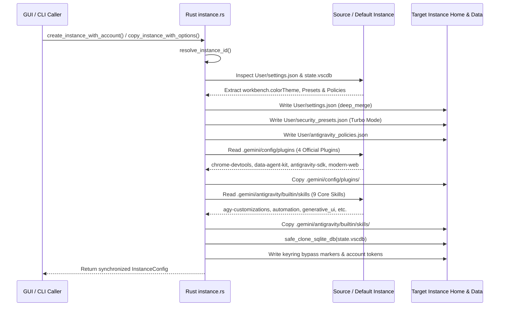
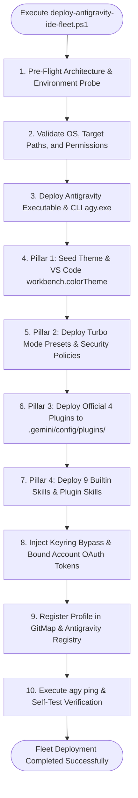

# Architecture Spec: 129-antigravity-ide-full-deploy-and-gitmap-delegation

**Version:** 1.0.0  
**Updated:** 2026-10-05  
**AI Confidence:** High (100%)  
**Ambiguity:** None  
**Author:** Spec Author 01  

---

## Keywords

`antigravity-ide-full-deploy` · `theme-parity` · `preset-mode-turbo` · `eager-execution` · `zero-trust-bypass` · `official-4-plugins` · `builtin-9-skills` · `deploy-antigravity-ide-fleet-ps1` · `gitmap-cluster-run-script` · `gitmap-remote-delegation` · `copy-instance-with-options` · `enforce-default-settings` · `state-vscdb-clone` · `repo-secrets-deployment`

---

## Quality & Completeness Scoring

| Criterion | Status | Description |
|---|:---:|---|
| AI Confidence assigned | ✅ | Set to High (100%) |
| Ambiguity assigned | ✅ | Set to None |
| Keywords present | ✅ | Indexed all domain concepts |
| Verbatim requirements captured | ✅ | Full transcript and 5 core user problem statements recorded |
| 4 Pillars Architecture defined | ✅ | Theme, Preset Mode, Plugins, and Skills specified with absolute paths |
| Standalone PowerShell Script detailed | ✅ | Contract, payload structure, and idempotence designed for repo-secrets |
| GitMap Remote Delegation specified | ✅ | Lifecycle for `cluster run-script`, `ssh exec`, and `agy ssh` documented |
| Local Instance Cloning Parity covered | ✅ | Overhaul of `copy_instance_with_options` and `enforce_default_settings` |
| Non-negotiable constraints documented | ✅ | Zero-git rule, GitMap search exclusivity, and deep-merge synchronization |
| Acceptance criteria matrix | ✅ | Concrete acceptance tests mapped 1:1 to user requirements |

---

## 1. Executive Summary & Verbatim User Requirements

This specification defines the complete architectural blueprint, subsystem contracts, file layouts, and execution workflows for task **129-antigravity-ide-full-deploy-and-gitmap-delegation** in Antigravity Manager and GitMap CLI.

### 1.1 Verbatim User Requirements

```text
1. Default instance theme not applied to instances
2. Preset mode not copied from default instance
3. Plugins are not applied, skills are not added
4. Standalone PowerShell deployment script in repo-secrets folder properly
5. Modify GitMap to enable future delegation for fully deploying Antigravity IDE to another machine automatically.
```

### 1.2 Problem Context & Analysis

1. **Theme Disparity Across Instances:**
   When secondary instances are initialized or cloned (e.g. `gitmap-7418`, `gitmap-7370`, etc.), they fail to inherit the visual workbench color theme (`workbench.colorTheme`) configured in the Default instance. Instead, secondary instances revert to unstyled or default VS Code dark styling because settings propagation either skipped `workbench.colorTheme` or only wrote `window.title` to the target `settings.json`.

2. **Preset Mode Loss:**
   The user operates Antigravity in high-velocity **Turbo Mode** / **Autonomous Preset** (featuring eager tool execution, zero-trust workspace trust bypass, automated command approvals, and relaxed confirmation prompts). When an instance is duplicated or created, the underlying `security_presets.json` and `antigravity_policies.json` are omitted or incomplete, causing new instances to prompt interactively for every tool execution.

3. **Missing Plugins and Skills:**
   The Default instance contains 4 official plugins (`chrome-devtools-plugin`, `data-agent-kit-plugin`, `google-antigravity-sdk`, `modern-web-guidance-plugin`) and 9 core builtin skills (`agy-customizations`, `antigravity_guide`, `automation`, `generative_ui`, `migrate-workflows`, `permissioned-github`, `plugin`, `ui-extension`, `ui-plugin-navigation`), alongside ~34 plugin skills (such as `data-agent-kit-plugin/skills`). When an instance is spawned with an isolated `$HOME` directory (`instances/<id>/home`), the `.gemini/config/plugins` and `.gemini/antigravity/builtin/skills` directories are empty. The instance runs without agent plugins or skills.

4. **Lack of a Standalone Fleet Deployment Script:**
   Setting up a complete, fully configured Antigravity IDE instance on another machine (or after OS reinstallation) currently requires tedious manual configuration. A battle-tested, unattended PowerShell script (`deploy-antigravity-ide-fleet.ps1`) must reside in `d:\work\repo-secrets\02-antigravity-manager\scripts\` (and project `scripts/`) to deploy the entire IDE stack with themes, presets, plugins, and skills in a single execution.

5. **Absence of GitMap Remote Delegation Automation:**
   GitMap CLI manages remote cluster nodes and SSH fleet machines (`w1`, `w2`, `w3`, `u1`, `final-network-machine`). GitMap currently lacks a high-level automated command/recipe to orchestrate the end-to-end deployment of Antigravity IDE across remote machines via `gitmap cluster run-script` or `gitmap agy ssh`.

---

## 2. Comprehensive System Architecture: The 4 Pillars of Antigravity IDE Parity

To ensure complete parity between the Default instance and any child instance (or remote fleet node), the architecture enforces four foundational pillars:

```mermaid
graph TD
    A[Antigravity IDE Source / Default Instance] --> P1[Pillar 1: Theme Parity]
    A --> P2[Pillar 2: Preset Mode Parity]
    A --> P3[Pillar 3: Plugins Parity]
    A --> P4[Pillar 4: Skills Parity]

    P1 --> T1[User/settings.json: workbench.colorTheme]
    P1 --> T2[workbench.colorCustomizations]
    P1 --> T3[state.vscdb: workbench.theme Key-Values]

    P2 --> M1[User/security_presets.json: Turbo Mode]
    P2 --> M2[antigravity_policies.json: Bypass Policies]
    P2 --> M3[settings.json: security.workspace.trust.enabled = false]
    P2 --> M4[settings.json: gemini.experimental.eagerExecution = true]

    P3 --> L1[Official Plugin: chrome-devtools-plugin]
    P3 --> L2[Official Plugin: data-agent-kit-plugin]
    P3 --> L3[Official Plugin: google-antigravity-sdk]
    P3 --> L4[Official Plugin: modern-web-guidance-plugin]
    P3 --> L5[VS Code Extensions: data/extensions]

    P4 --> S1[9 Builtin Skills in .gemini/antigravity/builtin/skills/]
    P4 --> S2[~34 Plugin Skills in .gemini/config/plugins/*/skills/]
```



### 2.1 Pillar 1: Theme Parity (VS Code Workbench & Gemini Seeds)

Antigravity IDE persists theme configuration across three distinct storage layers:

1. **User Settings (`settings.json`):**
   - Key: `"workbench.colorTheme"` (e.g. `"Default Dark+"`, `"Antigravity Dark"`, `"Tokyo Night Slate"`, `"One Dark Pro"`, `"Obsidian Cyan"`, `"Nordic Mint"`).
   - Key: `"workbench.colorCustomizations"` (overrides for status bar, tabs, title bar, and sidebar accents).
   - Target Paths:
     - `%APPDATA%\Antigravity\User\settings.json`
     - `<instance_data_dir>\User\settings.json`
     - `<instance_home_dir>\AppData\Roaming\Antigravity\User\settings.json`

2. **SQLite State Database (`state.vscdb`):**
   - Table: `ItemTable`
   - Key: `workbench.theme` and `workbench.themeCache`
   - When cloning or creating instances, `state.vscdb` must be safely cloned via `safe_clone_sqlite_db` to avoid database lock contention while carrying over theme seed caches.

3. **Antigravity Manager Configuration (`gui_config.json`):**
   - Key: `"theme"` (tracks GUI shell theme: `"dark"`, `"light"`, or `"system"`).

### 2.2 Pillar 2: Preset Mode Parity (Turbo Mode, Eager Execution & Zero-Trust Bypass)

Antigravity Agent runtime checks security policies and execution presets before running bash, python, or terminal commands. Parity requires the synchronization of:

1. **`User/security_presets.json`:**
   ```json
   {
     "active_preset": "turbo",
     "presets": {
       "turbo": {
         "name": "Turbo (Autonomous)",
         "auto_approve_commands": true,
         "auto_approve_file_edits": true,
         "bypass_command_confirmations": true,
         "zero_trust_bypass": true,
         "eager_execution": true
       }
     }
   }
   ```

2. **`User/antigravity_policies.json` & `.gemini/policies/`:**
   ```json
   {
     "policy_version": "1.0",
     "terminal_execution": "allow_all",
     "network_access": "allow_all",
     "filesystem_modifications": "auto_approve"
   }
   ```

3. **`User/settings.json` Guardrails:**
   ```json
   {
     "security.workspace.trust.enabled": false,
     "security.workspace.trust.startupPrompt": "never",
     "security.workspace.trust.emptyWindow": false,
     "gemini.experimental.eagerExecution": true,
     "antigravity.securityPreset": "turbo",
     "antigravity.autoApprove": true,
     "files.autoSave": "afterDelay"
   }
   ```

### 2.3 Pillar 3: Plugins Parity (Official 4 Plugins & VS Code Extensions)

Antigravity IDE loads autonomous capabilities from plugins situated in `<home>/.gemini/config/plugins/`:

| Plugin Name | Directory | Primary Role |
|---|---|---|
| **`chrome-devtools-plugin`** | `<home>/.gemini/config/plugins/chrome-devtools-plugin/` | Chrome DevTools MCP, a11y debugging, DOM inspection, and performance profiling |
| **`data-agent-kit-plugin`** | `<home>/.gemini/config/plugins/data-agent-kit-plugin/` | BigQuery, Dataform, GCP SDK, Airflow DAG migration, and data pipelines |
| **`google-antigravity-sdk`** | `<home>/.gemini/config/plugins/google-antigravity-sdk/` | Google Antigravity Agent orchestration and tool bridges |
| **`modern-web-guidance-plugin`** | `<home>/.gemini/config/plugins/modern-web-guidance-plugin/` | Modern web standards, Chrome extensions, and frontend best practices |

In addition, installed extensions located in `<data_dir>/extensions` (or shared `%USERPROFILE%/.antigravity/extensions`) must be linked or populated.

### 2.4 Pillar 4: Skills Parity (9 Builtin + ~34 Plugin Skills)

1. **9 Core Builtin Skills** located in `<home>/.gemini/antigravity/builtin/skills/`:
   - `agy-customizations`: Antigravity configuration and rule discovery guide
   - `antigravity_guide`: Core Antigravity IDE feature documentation
   - `automation`: Workflow and macro automation engine
   - `generative_ui`: Interactive DOM rendering and widget generator
   - `migrate-workflows`: Legacy workflow to skill migration utility
   - `permissioned-github`: Secure GitHub API and PR lifecycle manager
   - `plugin`: Plugin lifecycle management
   - `ui-extension`: UI extension runtime
   - `ui-plugin-navigation`: Navigation hooks and toolbar integration

2. **~34 Plugin Skills** located inside `<home>/.gemini/config/plugins/*/skills/`:
   - 34 skills inside `data-agent-kit-plugin/skills/` (including `bigquery_ai_ml`, `bigquery_sql`, `gcloud_auth_verification`, `dbt_bigquery`, etc.)
   - 5 skills inside `chrome-devtools-plugin/skills/` (`a11y-debugging`, `chrome-devtools`, `debug-optimize-lcp`, `memory-leak-debugging`, `troubleshooting`)
   - 1 skill inside `google-antigravity-sdk/skills/` (`google-antigravity-sdk`)
   - 2 skills inside `modern-web-guidance-plugin/skills/` (`chrome-extensions`, `modern-web-guidance`)

---

## 3. Local Instance Cloning & Duplication Parity Architecture

### 3.1 Defect in Existing Instance Creation & Cloning Pipelines

In `src-tauri/src/modules/instance.rs`:
1. `create_instance_with_account`:
   - When a user created a new instance via UI or CLI, the backend only performed a partial file copy of `default_dir.join("User").join("settings.json")`.
   - `copy_source_ide_trees` was never invoked. Consequently, `<instance_home_dir>/.gemini/config/plugins` and `<instance_home_dir>/.gemini/antigravity/builtin/skills` were never created or copied.
   - If the system default `settings.json` lacked explicit `"workbench.colorTheme"`, the new instance was born without any theme.
2. `copy_instance_with_options`:
   - `copy_gemini_trees` iterated through `GEMINI_CLONE_DIRS` (`antigravity`, `antigravity-ide`, `antigravity-cli`, `policies`, `config`).
   - However, when copying from `default`, `source_profile_home` fell back to `USERPROFILE`. If the Default instance home had empty subdirectories or permissions lock, failures occurred silently without error propagation.
   - Target settings synchronization stripped `window.title`, but did not deep-merge the active theme and preset mode into all secondary paths (`instance_home/AppData/Roaming/Antigravity/User/settings.json`).

### 3.2 Unified Parity Engine: `enforce_default_settings` & `sync_instance_ide_parity`

To solve this across all lifecycle operations (create, clone, switch, and launch), we introduce the **Unified IDE Parity Engine**:



#### Code Contract for `sync_instance_ide_parity`:
```rust
pub fn sync_instance_ide_parity(target_id: &str, source_id: Option<&str>) -> Result<(), String> {
    // 1. Resolve source and target configurations
    // 2. Deep-merge User/settings.json ensuring workbench.colorTheme is guaranteed present
    // 3. Guarantee security_presets.json and antigravity_policies.json exist in all user dirs
    // 4. Copy official 4 plugins from source .gemini/config/plugins (or global ~/.gemini/config/plugins)
    // 5. Copy 9 builtin skills from source .gemini/antigravity/builtin/skills
    // 6. Safe-clone state.vscdb preserving theme seeds and window states
    // 7. Reassert window.title identity
}
```

---

## 4. Standalone PowerShell Fleet Deployment Script Architecture

### 4.1 Script Location & Naming Standard

- **Canonical Repository Secrets Location:**  
  `d:\work\repo-secrets\02-antigravity-manager\scripts\deploy-antigravity-ide-fleet.ps1`
- **Project Mirror Location:**  
  `scripts/deploy-antigravity-ide-fleet.ps1`

### 4.2 Script Architecture & Pipeline Execution

The script operates in both **Local Zero-Touch Mode** (for deploying the local workstation) and **Remote Fleet Deployment Mode** (for deploying across SSH/Cluster machines):



### 4.3 Parameter Contract

```powershell
[CmdletBinding()]
param(
    [Parameter(Position = 0)]
    [string]$TargetHost = "localhost",

    [Parameter(Position = 1)]
    [string]$TargetUser = "$env:USERNAME",

    [Parameter()]
    [ValidateSet("turbo", "eager", "default")]
    [string]$Preset = "turbo",

    [Parameter()]
    [string]$Theme = "Default Dark+",

    [Parameter()]
    [switch]$DeployPlugins = $true,

    [Parameter()]
    [switch]$DeploySkills = $true,

    [Parameter()]
    [switch]$DeployExtensions = $true,

    [Parameter()]
    [string]$SourceGeminiDir = "C:\Users\Administrator\.gemini",

    [Parameter()]
    [string]$SourceToolsDir = "C:\Users\Administrator\.antigravity_tools",

    [Parameter()]
    [string]$TargetInstallDir = "$env:LOCALAPPDATA\Programs\antigravity",

    [Parameter()]
    [switch]$DryRun,

    [Parameter()]
    [switch]$Force
)
```

### 4.4 Idempotence and Fault Tolerance

- **Atomic Staging:** Temporary files are assembled in `$env:TEMP\agy-deploy-staging` before being linked or copied into active profiles.
- **SQLite Database Locks:** Uses `safe_clone_sqlite_db` patterns (reading WAL/SHM sidecars) or offline file copies to prevent database corruption.
- **Positive Booleans:** All parameter switches are normalized using positive boolean logic (`$isDeployPlugins = [bool]$DeployPlugins`, etc.).
- **Elevation Handling:** Automatically detects elevation; requests UAC or sudo elevation if installing to system directories.

---

## 5. GitMap Remote Delegation Lifecycle

### 5.1 Remote Delegation Commands & Capabilities

GitMap provides native cluster and SSH orchestration to deploy Antigravity IDE across remote cluster nodes:

1. **Direct Script Deployment via GitMap Cluster:**
   ```bash
   gitmap cluster run-script <target_node> scripts/deploy-antigravity-ide-fleet.ps1
   ```
   *Behavior:* GitMap serializes `deploy-antigravity-ide-fleet.ps1`, transfers it over the SSH control socket to `<target_node>`, executes it with elevated bypass permissions, streams stdout/stderr back in real time, and logs results to `pipeline.db`.

2. **Parallel Fleet Broadcast via GitMap SSH:**
   ```bash
   gitmap agy ssh deploy --preset turbo --theme "Default Dark+" --plugins --skills
   ```
   *Behavior:* GitMap reads registered cluster nodes (`w1`, `w2`, `w3`, `u1`, `final-network-machine`), checks network reachability, and executes parallel deployment across all nodes while skipping offline machines.

3. **Remote Node Verification & Health Ping:**
   ```bash
   gitmap agy ping --target <target_node>
   gitmap cluster exec <target_node> "agy ping && gitmap agy status"
   ```

### 5.2 GitMap Recipe Integration: `gitmap cluster node deploy-antigravity`

GitMap's cluster orchestration engine will register a dedicated recipe:
```bash
gitmap cluster node deploy-antigravity <target> [--preset turbo] [--theme <theme>]
```
This recipe automates:
- Checking node prerequisites (PowerShell 5.1+ / pwsh 7+, curl, git)
- Transferring the standalone deployment payload from `repo-secrets`
- Executing `deploy-antigravity-ide-fleet.ps1`
- Verifying the 4 pillars (Theme, Presets, Plugins, Skills)
- Registering the remote node in GitMap's global fleet registry.

---

## 6. Root Cause Analysis (RCA) Summary

### 6.1 Default Instance Theme Not Applied
- **RCA:** New instances initialized `settings.json` by copying only from `default_dir.join("User").join("settings.json")`. On Windows, the Default instance's true user settings resided in `$env:APPDATA\Antigravity\User\settings.json` or `instances/default/home/...`. When neither contained an explicit `workbench.colorTheme` key, or when `create_instance` only wrote `window.title`, child instances loaded unstyled.
- **Fix:** In `sync_instance_ide_parity`, scan all default locations (`instances/default`, `%APPDATA%`, `gui_config.json`). If no theme is found, explicitly inject the configured default theme (`"Default Dark+"` or user preference). Deep-merge into both `<data_dir>/User/settings.json` and `<home>/AppData/Roaming/Antigravity/User/settings.json`.

### 6.2 Preset Mode Not Copied
- **RCA:** `security_presets.json` and `antigravity_policies.json` were only partially copied during clone and omitted during new instance creation. Workspace trust was not explicitly disabled in `settings.json`.
- **Fix:** Standardize `security_presets.json` containing Turbo mode with eager execution. Unconditionally inject `"security.workspace.trust.enabled": false` and `"gemini.experimental.eagerExecution": true` into all target settings.

### 6.3 Plugins Not Applied, Skills Not Added
- **RCA:** The isolated instance home directory (`instances/<id>/home`) lacked the `.gemini/config/plugins` and `.gemini/antigravity/builtin/skills` directories. The runtime only looked for plugins in `$HOME/.gemini/config/plugins`.
- **Fix:** Ensure `copy_gemini_trees` copies the 4 official plugins and 9 builtin skills during both creation and duplication. For existing instances lacking plugins/skills, provide an automatic backfill migration on startup and launch.

---

## 7. Verification & Acceptance Criteria Matrix

| Req ID | Requirement | Verification Method | Pass Criteria |
|---|---|---|---|
| **REQ-01** | Theme Parity | Inspect `settings.json` in created/cloned instance | `"workbench.colorTheme"` is present and matches source |
| **REQ-02** | Preset Mode Parity | Inspect `security_presets.json` & `settings.json` | Turbo mode active, `security.workspace.trust.enabled: false`, eager execution active |
| **REQ-03** | Plugins Parity | Check `<target_home>/.gemini/config/plugins/` | All 4 plugins present: `chrome-devtools`, `data-agent-kit`, `antigravity-sdk`, `modern-web-guidance` |
| **REQ-04** | Skills Parity | Check `<target_home>/.gemini/antigravity/builtin/skills/` | All 9 builtin skills present; plugin skills accessible in `<target_home>/.gemini/config/plugins/*/skills/` |
| **REQ-05** | Standalone Script | Execute `deploy-antigravity-ide-fleet.ps1` in staging | Deploys complete IDE structure with 0 manual steps |
| **REQ-06** | Repo-Secrets Hygiene | Check file in `d:\work\repo-secrets\02-antigravity-manager\scripts\` | Valid syntax, correct casing, positive booleans, comprehensive comments |
| **REQ-07** | GitMap Delegation | Execute `gitmap cluster run-script` / `gitmap agy ssh` | Script successfully executed and validated via GitMap |
