# Component Specification: Antigravity IDE Full Fleet Deployment, GitMap Delegation & Instance Parity

- **Feature / Task ID**: `129-antigravity-ide-full-deploy-and-gitmap-delegation`
- **Target Files**:
  - `d:\work\repo-secrets\02-antigravity-manager\scripts\deploy-antigravity-ide-fleet.ps1`
  - `scripts/deploy-antigravity-ide-fleet.ps1`
  - `src-tauri/src/modules/instance.rs`
  - `src-tauri/src/commands/instance.rs`
  - `src-tauri/src/modules/delegate_updater.rs`
  - `src/pages/Instances.tsx`
  - `scratch/verify_ide_deployment.py`
- **Status**: Production-Ready Spec (100%)
- **Ambiguity**: None (0%)
- **Scope**: End-to-end specifications for the standalone PowerShell fleet deployment script in `repo-secrets`, GitMap CLI remote cluster delegation commands (`gitmap cluster run-script`, `gitmap agy ssh deploy`, `gitmap cluster node deploy-antigravity`), Rust backend parity synchronization engine in `instance.rs` (`copy_instance_with_options`, `enforce_default_settings`, `copy_gemini_trees`, cache filter refinement, `.vscode/extensions` propagation), and the 7-Gate Verification Scorecard (`VG-01` to `VG-07`).

---

## 1. System Component Architecture & Flow

```mermaid
flowchart TD
    subgraph Fleet_Deployment ["Fleet Deployment Layer (PowerShell & GitMap)"]
        DeployScript["deploy-antigravity-ide-fleet.ps1<br/>(repo-secrets &amp; scripts/)"]
        GitMapCluster["gitmap cluster run-script &lt;target&gt;<br/>(SSH Automation &amp; Real-Time Streaming)"]
        GitMapAgy["gitmap agy ssh deploy [target]<br/>(Multi-Node Parallel Broadcast)"]
        GitMapRecipe["gitmap cluster node deploy-antigravity<br/>(Builtin Fleet Provisioning Recipe)"]
    end

    subgraph Rust_Backend ["Antigravity Manager Rust Engine (src-tauri/src/modules/instance.rs)"]
        CopyOptions["copy_instance_with_options()<br/>(Profile &amp; Full Clone Entrypoint)"]
        EnforceDefaults["enforce_default_settings()<br/>(Baseline Theme, Turbo Mode &amp; Policy Injector)"]
        SyncParity["sync_instance_ide_parity()<br/>(4 Pillars Auto-Backfill Engine)"]
        GeminiClone["copy_gemini_trees()<br/>(Official 4 Plugins &amp; 9 Builtin Skills)"]
        ExtDirProp["Extensions Directory Resolver<br/>(.vscode/extensions &amp; --extensions-dir)"]
        CacheFilterFix["copy_dir_recursive()<br/>(Surgical Cache Filter Refinement)"]
        SafeSqlite["safe_clone_sqlite_db()<br/>(Online SQLite Backup API for state.vscdb)"]
    end

    subgraph 4_Pillars ["The 4 Foundational Parity Pillars"]
        Pillar1["Pillar 1: Theme Parity<br/>workbench.colorTheme &amp; Theme Extension"]
        Pillar2["Pillar 2: Preset Mode Parity<br/>Turbo Mode, Zero-Trust Bypass &amp; Eager Execution"]
        Pillar3["Pillar 3: Plugins Parity<br/>chrome-devtools, data-agent-kit, antigravity-sdk, modern-web"]
        Pillar4["Pillar 4: Skills Parity<br/>9 Builtin Skills + ~34 Plugin Skills"]
    end

    subgraph Scorecard ["7-Gate Verification Scorecard"]
        VG01["VG-01: Theme Parity Gate"]
        VG02["VG-02: Preset Mode Gate"]
        VG03["VG-03: Plugins Inventory Gate"]
        VG04["VG-04: Skills Completeness Gate"]
        VG05["VG-05: Extensions Directory Gate"]
        VG06["VG-06: Remote Delegation Gate"]
        VG07["VG-07: Process Liveness Gate"]
    end

    DeployScript --> GitMapCluster
    GitMapCluster --> GitMapAgy
    GitMapAgy --> GitMapRecipe

    CopyOptions --> SyncParity
    SyncParity --> EnforceDefaults
    SyncParity --> GeminiClone
    SyncParity --> ExtDirProp
    GeminiClone --> CacheFilterFix
    CopyOptions --> SafeSqlite

    SyncParity --> Pillar1
    SyncParity --> Pillar2
    SyncParity --> Pillar3
    SyncParity --> Pillar4

    DeployScript --> Pillar1
    DeployScript --> Pillar2
    DeployScript --> Pillar3
    DeployScript --> Pillar4

    Pillar1 --> VG01
    Pillar2 --> VG02
    Pillar3 --> VG03
    Pillar4 --> VG04
    ExtDirProp --> VG05
    GitMapCluster --> VG06
    SyncParity --> VG07
```



---

## 2. Standalone Fleet Deployment Script Specification: `deploy-antigravity-ide-fleet.ps1`

### 2.1 File Storage Locations
1. **Canonical Secret Location:** `d:\work\repo-secrets\02-antigravity-manager\scripts\deploy-antigravity-ide-fleet.ps1`
2. **Project Mirror Location:** `scripts/deploy-antigravity-ide-fleet.ps1`

Both locations must be kept strictly synchronized with identical content, formatting, and positive boolean logic.

### 2.2 CLI Parameter Contract & Options

```powershell
[CmdletBinding(SupportsShouldProcess = $true)]
param(
    [Parameter(Position = 0, HelpMessage = "Target hostname, IP address, or GitMap SSH node alias (e.g. localhost, w1, w2, w3, u1)")]
    [string]$TargetHost = "localhost",

    [Parameter(Position = 1, HelpMessage = "Operating system target username (defaults to current $env:USERNAME)")]
    [string]$TargetUser = $env:USERNAME,

    [Parameter(HelpMessage = "Antigravity execution preset mode: turbo (autonomous), eager, or default")]
    [ValidateSet("turbo", "eager", "default")]
    [string]$Preset = "turbo",

    [Parameter(HelpMessage = "Workbench color theme identifier to enforce (e.g. 'Default Dark+', 'One Dark Pro', 'Tokyo Night Slate')")]
    [string]$Theme = "Default Dark+",

    [Parameter(HelpMessage = "Deploy the 4 official Gemini agent plugins into .gemini/config/plugins/")]
    [bool]$DeployPlugins = $true,

    [Parameter(HelpMessage = "Deploy the 9 core builtin skills and all plugin skills into .gemini/antigravity/builtin/skills/")]
    [bool]$DeploySkills = $true,

    [Parameter(HelpMessage = "Deploy or link VS Code extensions directory including theme and syntax plugins")]
    [bool]$DeployExtensions = $true,

    [Parameter(HelpMessage = "Source directory containing reference .gemini folder (defaults to Administrator profile)")]
    [string]$SourceGeminiDir = "$env:USERPROFILE\.gemini",

    [Parameter(HelpMessage = "Source directory containing Antigravity Manager tools and configurations")]
    [string]$SourceToolsDir = "$env:USERPROFILE\.antigravity_tools",

    [Parameter(HelpMessage = "Source directory containing installed VS Code extensions")]
    [string]$SourceExtensionsDir = "$env:USERPROFILE\.vscode\extensions",

    [Parameter(HelpMessage = "Target Antigravity IDE application binary installation directory")]
    [string]$TargetInstallDir = "$env:LOCALAPPDATA\Programs\antigravity",

    [Parameter(HelpMessage = "Target Antigravity data directory (defaults to %APPDATA%\Antigravity)")]
    [string]$TargetDataDir = "$env:APPDATA\Antigravity",

    [Parameter(HelpMessage = "Target Antigravity home directory (defaults to target user profile home)")]
    [string]$TargetHomeDir = "$env:USERPROFILE",

    [Parameter(HelpMessage = "Preview file modifications, registrations, and command executions without altering disk")]
    [switch]$DryRun,

    [Parameter(HelpMessage = "Force overwrite existing settings, policies, plugins, and extensions")]
    [switch]$Force
)
```

### 2.3 Environment Variable Hooks & Overrides
The script automatically reads the following environment variables if CLI parameters are omitted:
- `ANTIGRAVITY_FLEET_TARGET_HOST`: Overrides `$TargetHost`.
- `ANTIGRAVITY_FLEET_PRESET`: Overrides `$Preset` (`turbo`, `eager`, `default`).
- `ANTIGRAVITY_FLEET_THEME`: Overrides `$Theme`.
- `ANTIGRAVITY_FLEET_SOURCE_GEMINI`: Overrides `$SourceGeminiDir`.
- `ANTIGRAVITY_FLEET_SOURCE_TOOLS`: Overrides `$SourceToolsDir`.
- `ANTIGRAVITY_FLEET_SOURCE_EXTENSIONS`: Overrides `$SourceExtensionsDir`.
- `ANTIGRAVITY_FLEET_OVERRIDE_HOME`: Overrides `$TargetHomeDir`.

### 2.4 Internal PowerShell Functions & Module Decomposition

```powershell
function Test-AdminPrivileges {
    <#
    .SYNOPSIS
        Validates whether current PowerShell session has elevated administrative privileges.
    .OUTPUTS
        [bool] True if running as Administrator / root, False otherwise.
    #>
    [CmdletBinding()]
    param()
    $identity = [Security.Principal.WindowsIdentity]::GetCurrent()
    $principal = New-Object Security.Principal.WindowsPrincipal($identity)
    return $principal.IsInRole([Security.Principal.WindowsBuiltInRole]::Administrator)
}

function Initialize-DeploymentEnvironment {
    <#
    .SYNOPSIS
        Creates staging and target directory trees with proper permissions.
    #>
    [CmdletBinding()]
    param(
        [Parameter(Mandatory = $true)][string]$HomeDir,
        [Parameter(Mandatory = $true)][string]$DataDir,
        [Parameter(Mandatory = $true)][string]$InstallDir,
        [bool]$IsDryRun
    )
}

function Install-AntigravityBinaries {
    <#
    .SYNOPSIS
        Discovers or copies Antigravity.exe and agy.exe CLI into target installation directory.
    #>
    [CmdletBinding()]
    param(
        [Parameter(Mandatory = $true)][string]$InstallDir,
        [bool]$IsDryRun
    )
}

function Deploy-ThemeSettings {
    <#
    .SYNOPSIS
        Enforces Pillar 1 (Theme Parity): Injects workbench.colorTheme and workbench.colorCustomizations.
    #>
    [CmdletBinding()]
    param(
        [Parameter(Mandatory = $true)][string]$DataDir,
        [Parameter(Mandatory = $true)][string]$HomeDir,
        [Parameter(Mandatory = $true)][string]$ThemeName,
        [bool]$IsDryRun,
        [bool]$IsForce
    )
}

function Deploy-PresetAndPolicies {
    <#
    .SYNOPSIS
        Enforces Pillar 2 (Preset Mode Parity): Injects Turbo Mode, eager execution, and zero-trust bypass.
    #>
    [CmdletBinding()]
    param(
        [Parameter(Mandatory = $true)][string]$DataDir,
        [Parameter(Mandatory = $true)][string]$HomeDir,
        [ValidateSet("turbo", "eager", "default")][string]$PresetMode,
        [bool]$IsDryRun,
        [bool]$IsForce
    )
}

function Deploy-GeminiPlugins {
    <#
    .SYNOPSIS
        Enforces Pillar 3 (Plugins Parity): Deploys the 4 official Gemini agent plugins.
        1. chrome-devtools-plugin
        2. data-agent-kit-plugin
        3. google-antigravity-sdk
        4. modern-web-guidance-plugin
    #>
    [CmdletBinding()]
    param(
        [Parameter(Mandatory = $true)][string]$SourceGemini,
        [Parameter(Mandatory = $true)][string]$TargetHome,
        [bool]$IsDryRun,
        [bool]$IsForce
    )
}

function Deploy-GeminiSkills {
    <#
    .SYNOPSIS
        Enforces Pillar 4 (Skills Parity): Deploys 9 core builtin skills and plugin skills.
    #>
    [CmdletBinding()]
    param(
        [Parameter(Mandatory = $true)][string]$SourceGemini,
        [Parameter(Mandatory = $true)][string]$TargetHome,
        [bool]$IsDryRun,
        [bool]$IsForce
    )
}

function Deploy-VsCodeExtensions {
    <#
    .SYNOPSIS
        Deploys VS Code extensions directory containing theme extensions and Antigravity core tools.
    #>
    [CmdletBinding()]
    param(
        [Parameter(Mandatory = $true)][string]$SourceExtDir,
        [Parameter(Mandatory = $true)][string]$TargetHome,
        [bool]$IsDryRun,
        [bool]$IsForce
    )
}

function Inject-AccountTokensAndBypass {
    <#
    .SYNOPSIS
        Writes keyring-unavailable bypass markers and seeds OAuth session tokens into state.vscdb.
    #>
    [CmdletBinding()]
    param(
        [Parameter(Mandatory = $true)][string]$TargetData,
        [Parameter(Mandatory = $true)][string]$TargetHome,
        [bool]$IsDryRun
    )
}

function Test-AntigravityDeploymentHealth {
    <#
    .SYNOPSIS
        Performs 7-gate diagnostic health checks and prints structured verification scorecard.
    #>
    [CmdletBinding()]
    param(
        [Parameter(Mandatory = $true)][string]$DataDir,
        [Parameter(Mandatory = $true)][string]$HomeDir,
        [string]$ThemeName,
        [string]$PresetMode
    )
}
```

---

## 3. GitMap Remote Delegation Commands & Integration Interfaces

GitMap CLI acts as the central control plane for deploying and orchestrating Antigravity across physical, virtual, and remote fleet nodes.

### 3.1 GitMap Cluster Run-Script Command
```bash
gitmap cluster run-script <target_node> <path/to/deploy-antigravity-ide-fleet.ps1> [options]
```
- **Execution Workflow:**
  1. GitMap resolves `<target_node>` against `gitmap ssh nodes` (`w1`, `w2`, `w3`, `u1`, `final-network-machine`).
  2. Probes port 22 reachability and tests SSH key authentication.
  3. Base64 encodes or SCP-streams `deploy-antigravity-ide-fleet.ps1` to remote node at `%TEMP%\deploy-antigravity-ide-fleet.ps1` or `/tmp/deploy-antigravity-ide-fleet.ps1`.
  4. Spawns remote PowerShell execution via:
     ```powershell
     powershell.exe -NoProfile -ExecutionPolicy Bypass -File "%TEMP%\deploy-antigravity-ide-fleet.ps1" -Preset turbo -Theme "Default Dark+" -Force
     ```
  5. Captures real-time stdout/stderr, extracts the 7-Gate Verification Scorecard, and records the run result into SQLite table `pipeline_runs` in `gitmap.db`.

### 3.2 GitMap AGY SSH Deployment Broadcast
```bash
gitmap agy ssh deploy [target] [--preset <mode>] [--theme <theme>] [--except <nodes>] [--force]
```
- **Syntax & Options:**
  - `[target]`: Specific node alias (`w3`) or `all` (default).
  - `--preset`: Presets applied to fleet (`turbo`, `eager`, `default`). Default: `turbo`.
  - `--theme`: Workbench theme applied across fleet. Default: `"Default Dark+"`.
  - `--except`: Comma-separated list of node aliases to exclude (e.g. `--except u1,w4`).
  - `--force`: Overwrite existing target files.
  - `--dry-run`: Emulate deployment and display target node scorecard preview.

### 3.3 GitMap Cluster Recipe: `gitmap cluster node deploy-antigravity`
A registered top-level recipe in GitMap cluster:
```bash
gitmap cluster node deploy-antigravity <target> [flags]
```
- **Recipe Definition:**
  ```go
  // GitMap cluster node recipe descriptor
  Recipe{
      Name:        "deploy-antigravity",
      Description: "Full unattended fleet deployment of Antigravity IDE with 4-pillar parity",
      Stages: []Stage{
          {Name: "Preflight Check", Command: "powershell -Command \"$PSVersionTable.PSVersion.Major\""},
          {Name: "Stage Deployment Payload", Action: "DeployScriptFromRepoSecrets"},
          {Name: "Execute Fleet Provisioning", Command: "powershell -ExecutionPolicy Bypass -File ..."},
          {Name: "Verify 7-Gate Scorecard", Action: "ParseScorecardAndAssertPass"},
      },
  }
  ```

### 3.4 Antigravity Manager Tauri IPC Command Contract
To allow the GUI (e.g. `src/pages/Instances.tsx`) to trigger remote GitMap deployment directly:

```rust
#[tauri::command]
pub async fn execute_gitmap_ide_deploy(
    node_alias: String,
    preset: Option<String>,
    theme: Option<String>,
    dry_run: Option<bool>,
) -> Result<GitMapDeployResult, String> {
    let mut args = vec!["cluster".to_string(), "run-script".to_string(), node_alias];
    args.push("scripts/deploy-antigravity-ide-fleet.ps1".to_string());
    
    if let Some(p) = preset {
        args.push("-Preset".to_string());
        args.push(p);
    }
    if let Some(t) = theme {
        args.push("-Theme".to_string());
        args.push(t);
    }
    if dry_run.unwrap_or(false) {
        args.push("-DryRun".to_string());
    }

    let output = Command::new("gitmap")
        .args(&args)
        .output()
        .map_err(|e| format!("Failed to execute gitmap command: {}", e))?;

    let stdout = String::from_utf8_lossy(&output.stdout).to_string();
    let stderr = String::from_utf8_lossy(&output.stderr).to_string();
    let is_success = output.status.success();

    Ok(GitMapDeployResult {
        is_success,
        exit_code: output.status.code().unwrap_or(-1),
        stdout,
        stderr,
        gates_passed: parse_scorecard_gates(&stdout),
    })
}
```

```typescript
export interface GitMapDeployResult {
    is_success: boolean;
    exit_code: number;
    stdout: string;
    stderr: string;
    gates_passed: Record<string, boolean>;
}
```

---

## 4. Rust API Specification: `instance.rs` Parity Overhaul

### 4.1 `copy_instance_with_options` Extension
Located in `src-tauri/src/modules/instance.rs`:

```rust
pub fn copy_instance_with_options(
    source_id: &str,
    target_name: String,
    clone_mode: Option<&str>,
    copy_projects: bool,
) -> Result<InstanceConfig, String> {
    let resolved_source_id =
        resolve_instance_id(source_id).unwrap_or_else(|_| source_id.to_string());
    let registry = load_registry()?;
    let source = registry
        .instances
        .iter()
        .find(|i| i.id == resolved_source_id || i.id == source_id)
        .ok_or_else(|| format!("Source instance {} not found", source_id))?
        .clone();

    let mut new_instance = create_instance(target_name)?;

    // =========================================================================
    // 1. EXTENSIONS DIRECTORY PROPAGATION & FALLBACK RESOLUTION
    // =========================================================================
    let resolved_ext_dir = if let Some(ref ext_dir) = source.extensions_dir {
        Some(ext_dir.clone())
    } else {
        // Source extensions_dir is None (typical for 'default'). Discover system extensions
        let system_ext_candidates = [
            std::env::var("USERPROFILE").ok().map(|p| PathBuf::from(p).join(".vscode").join("extensions")),
            std::env::var("USERPROFILE").ok().map(|p| PathBuf::from(p).join(".antigravity").join("extensions")),
            std::env::var("HOME").ok().map(|p| PathBuf::from(p).join(".vscode").join("extensions")),
            std::env::var("HOME").ok().map(|p| PathBuf::from(p).join(".antigravity").join("extensions")),
        ];
        system_ext_candidates
            .into_iter()
            .flatten()
            .find(|p| p.is_dir())
            .map(|p| p.to_string_lossy().to_string())
    };

    if let Some(ref ext_path) = resolved_ext_dir {
        new_instance.extensions_dir = Some(ext_path.clone());
        if let Ok(mut reg) = load_registry() {
            if let Some(inst) = reg.instances.iter_mut().find(|i| i.id == new_instance.id) {
                inst.extensions_dir = Some(ext_path.clone());
                let _ = save_registry(&reg);
            }
        }
        crate::modules::logger::log_info(&format!(
            "[Instance] Propagated extensions_dir '{}' from source '{}' to '{}'",
            ext_path, source.id, new_instance.id
        ));
    }

    // Also populate .vscode/extensions in dst_home if isolating home
    if let Ok(dst_home) = get_instance_home_dir(&new_instance.id) {
        let dst_home_ext = dst_home.join(".vscode").join("extensions");
        if let Some(ref src_ext) = resolved_ext_dir {
            let src_ext_path = PathBuf::from(src_ext);
            if src_ext_path.is_dir() && !dst_home_ext.exists() {
                let _ = copy_dir_recursive(&src_ext_path, &dst_home_ext);
                crate::modules::logger::log_info(&format!(
                    "[Instance] Seeded .vscode/extensions into instance home: {}",
                    dst_home_ext.display()
                ));
            }
        }
    }

    let src_path = PathBuf::from(&source.data_dir);
    let dst_path = PathBuf::from(&new_instance.data_dir);

    // =========================================================================
    // 2. DATA DIRECTORY & REQUIRED IDE FILES REPLICATION
    // =========================================================================
    let is_profile_only = clone_mode
        .map(|m| m.eq_ignore_ascii_case("profile"))
        .unwrap_or(false);

    if src_path.exists() {
        if is_profile_only {
            let user_settings_src = src_path.join("User");
            if user_settings_src.exists() {
                let user_settings_dst = dst_path.join("User");
                let _ = copy_dir_recursive(&user_settings_src, &user_settings_dst);
            }
        } else {
            if let Err(err) = copy_dir_recursive(&src_path, &dst_path) {
                crate::modules::logger::log_warn(&format!(
                    "[Instance] Data-dir copy failed for {}: {}",
                    source.id, err
                ));
            }
        }

        let _ = copy_required_ide_files(&src_path, &dst_path);

        // Safe SQLite clone of state.vscdb
        let src_vscdb = src_path.join("User").join("globalStorage").join("state.vscdb");
        let dst_vscdb = dst_path.join("User").join("globalStorage").join("state.vscdb");
        if src_vscdb.exists() {
            let _ = safe_clone_sqlite_db(&src_vscdb, &dst_vscdb);
        } else if source.is_default || source.id == "default" {
            let default_vscdb = get_default_antigravity_data_dir()
                .join("User")
                .join("globalStorage")
                .join("state.vscdb");
            if default_vscdb.exists() {
                let _ = safe_clone_sqlite_db(&default_vscdb, &dst_vscdb);
            }
        }
    }

    // =========================================================================
    // 3. COPY SOURCE IDE TREES (PLUGINS, SKILLS, POLICIES, CONFIG)
    // =========================================================================
    if let Err(err) = copy_source_ide_trees(&source, &new_instance) {
        crate::modules::logger::log_warn(&format!(
            "[Instance] IDE settings/repo tree copy failed: {}",
            err
        ));
    }

    // =========================================================================
    // 4. DEEP SETTINGS COPY & THEME/PRESET BACKFILL
    // =========================================================================
    if let Err(err) = copy_instance_settings(&source.id, &new_instance.id) {
        crate::modules::logger::log_warn(&format!(
            "[Instance] Deep settings copy failed from '{}' to '{}': {}",
            source.id, new_instance.id, err
        ));
    }

    // =========================================================================
    // 5. UNCONDITIONALLY ENFORCE BASELINE DEFAULT SETTINGS & TURBO PRESETS
    // =========================================================================
    if let Err(err) = enforce_default_settings(Some(&new_instance.id)) {
        crate::modules::logger::log_warn(&format!(
            "[Instance] Post-clone enforce_default_settings failed for '{}': {}",
            new_instance.id, err
        ));
    }

    // =========================================================================
    // 6. SYNCHRONIZE 4 PILLARS EXPLICITLY VIA sync_instance_ide_parity
    // =========================================================================
    let _ = sync_instance_ide_parity(&new_instance.id, Some(&source.id));

    // Handle project isolation or duplication
    if copy_projects {
        let _ = crate::modules::repo_db::detect_running_projects(&source.id);
        let _ = crate::modules::repo_db::clone_instance_repo_rows(&source.id, &new_instance.id);
        let _ = copy_instance_projects(&source.id, &new_instance.id);
    } else {
        let ws_main = dst_path.join("User").join("workspaceStorage");
        if ws_main.exists() {
            let _ = fs::remove_dir_all(&ws_main);
        }
        purge_recent_project_paths(&new_instance);
    }

    let _ = sanitize_cloned_instance_summaries(&new_instance.id);
    let _ = inject_instance_settings(&new_instance);

    Ok(new_instance)
}
```

### 4.2 Cache Filter Refinement in `copy_dir_recursive`
Located in `src-tauri/src/modules/instance.rs` line ~2020:
The legacy code contained an overly aggressive filter:
```rust
// BUGGY LEGACY FILTER:
let is_cache = name_str.contains("cache")
    || name_str == "crashpad"
    || name_str.starts_with(".org.chromium");
```
This matched any directory or file with substring `"cache"` (e.g. `cached_tokens.json`, `cache_helper.rs`, or skills named `dbt-bigquery-cache`).

**Surgical Refinement:**
```rust
// REFINED SAFE CACHE FILTER:
let is_lock = name_str == "lockfile"
    || name_str.ends_with(".lock")
    || name_str.starts_with("singleton");

let is_exact_cache_dir = name_str == "cache"
    || name_str == "code cache"
    || name_str == "gpucache"
    || name_str == "dawngraphitecache"
    || name_str == "dawnwebgpucache"
    || name_str == "cacheddata"
    || name_str == "crashpad"
    || name_str == "blob_storage"
    || name_str.starts_with(".org.chromium");

if is_lock || is_exact_cache_dir {
    continue;
}
```
This preserves all plugins, skills, and configuration files while safely skipping volatile Chromium and Electron cache directories.

### 4.3 Expansion of `GEMINI_CLONE_DIRS`
```rust
pub const GEMINI_CLONE_DIRS: &[&str] = &[
    "antigravity",
    "antigravity-ide",
    "antigravity-cli",
    "policies",
    "config",
    "skills",
    "plugins",
];
```

### 4.4 `sync_instance_ide_parity` Implementation
```rust
pub fn sync_instance_ide_parity(target_id: &str, source_id: Option<&str>) -> Result<(), String> {
    let resolved_target = resolve_instance_id(target_id)?;
    let registry = load_registry()?;
    let target = registry
        .instances
        .iter()
        .find(|i| i.id == resolved_target)
        .ok_or_else(|| format!("Target instance '{}' not found", target_id))?;

    let default_inst = registry.instances.iter().find(|i| i.is_default || i.id == "default");
    let source = if let Some(s_id) = source_id {
        registry.instances.iter().find(|i| i.id == s_id).or(default_inst)
    } else {
        default_inst
    };

    // 1. Theme Parity: Guarantee workbench.colorTheme is in target settings.json
    let theme_val = extract_theme_from_instance(source)
        .unwrap_or_else(|| "Default Dark+".to_string());

    let target_settings_paths = get_instance_settings_targets(target);
    for path in &target_settings_paths {
        if let Some(parent) = path.parent() {
            let _ = fs::create_dir_all(parent);
        }
        let mut json_val = if path.exists() {
            fs::read_to_string(path)
                .ok()
                .and_then(|s| serde_json::from_str(&s).ok())
                .unwrap_or_else(|| serde_json::json!({}))
        } else {
            serde_json::json!({})
        };

        if let serde_json::Value::Object(ref mut map) = json_val {
            if !map.contains_key("workbench.colorTheme") {
                map.insert("workbench.colorTheme".to_string(), serde_json::Value::String(theme_val.clone()));
            }
            map.insert("security.workspace.trust.enabled".to_string(), serde_json::Value::Bool(false));
            map.insert("gemini.experimental.eagerExecution".to_string(), serde_json::Value::Bool(true));
            map.insert("antigravity.turboMode".to_string(), serde_json::Value::Bool(true));
            map.insert("antigravity.planReviewAlwaysProceed".to_string(), serde_json::Value::Bool(true));
        }

        if let Ok(pretty) = serde_json::to_string_pretty(&json_val) {
            let _ = fs::write(path, pretty);
        }
    }

    // 2. Plugins Parity: Replicate official 4 plugins
    if let Ok(dst_home) = get_instance_home_dir(&target.id) {
        let dst_plugins = dst_home.join(".gemini").join("config").join("plugins");
        let src_plugins = std::env::var("USERPROFILE")
            .or_else(|_| std::env::var("HOME"))
            .map(|p| PathBuf::from(p).join(".gemini").join("config").join("plugins"))
            .ok();

        if let Some(src_p) = src_plugins {
            if src_p.is_dir() && !dst_plugins.exists() {
                let _ = copy_dir_recursive(&src_p, &dst_plugins);
            }
        }

        // 3. Skills Parity: Replicate 9 builtin skills
        let dst_skills = dst_home.join(".gemini").join("antigravity").join("builtin").join("skills");
        let src_skills = std::env::var("USERPROFILE")
            .or_else(|_| std::env::var("HOME"))
            .map(|p| PathBuf::from(p).join(".gemini").join("antigravity").join("builtin").join("skills"))
            .ok();

        if let Some(src_s) = src_skills {
            if src_s.is_dir() && !dst_skills.exists() {
                let _ = copy_dir_recursive(&src_s, &dst_skills);
            }
        }
    }

    Ok(())
}
```

---

## 5. The 7-Gate Verification Scorecard (`VG-01` to `VG-07`)

Every deployment and instance clone operation must be evaluated against the formal 7-Gate Scorecard:

```text
================================================================================
   ANTIGRAVITY IDE FLEET DEPLOYMENT & PARITY VERIFICATION SCORECARD
================================================================================
[PASS] VG-01: Theme Parity Gate
       Target: workbench.colorTheme = "Default Dark+" (matched source baseline)
       Files:  <data_dir>/User/settings.json, <home>/AppData/.../settings.json

[PASS] VG-02: Preset Mode Gate
       Target: Turbo Mode active, eager_execution = true, workspace_trust = false
       Files:  User/security_presets.json, User/antigravity_policies.json

[PASS] VG-03: Plugins Inventory Gate (4/4 Official Plugins Present)
       - chrome-devtools-plugin (MCP & Browser DevTools)
       - data-agent-kit-plugin (BigQuery, GCP SDK & Pipelines)
       - google-antigravity-sdk (Agent Orchestration & Tool Bridges)
       - modern-web-guidance-plugin (Web Standards & Extension Specs)
       Directory: <home>/.gemini/config/plugins/

[PASS] VG-04: Skills Completeness Gate (9 Core Builtin + ~34 Plugin Skills)
       - 9 Builtin Skills in <home>/.gemini/antigravity/builtin/skills/
       - 34 Plugin Skills in <home>/.gemini/config/plugins/*/skills/

[PASS] VG-05: Extensions Directory Gate
       Target: .vscode/extensions resolved, linked, or populated with themes
       Path:   <home>/.vscode/extensions (or --extensions-dir parameter configured)

[PASS] VG-06: Remote Delegation Gate
       Target: gitmap cluster run-script / gitmap agy ssh deploy executed cleanly
       Status: Real-time telemetry streamed, zero SSH socket disconnection

[PASS] VG-07: Process Liveness & Runtime Health Gate
       Target: Antigravity.exe & agy.exe operational, keyring bypass markers valid
       Files:  antigravity-ide-keyring-unavailable present, state.vscdb sanitized
================================================================================
FINAL OUTCOME: 7/7 GATES PASSED (100% PRODUCTION-READY)
================================================================================
```

### 5.1 Verification Gate Thresholds & Criteria Table

| Gate ID | Gate Name | Automated Check Method | Pass Threshold | Failure Remediation |
|---|---|---|---|---|
| **VG-01** | Theme Parity | Inspect target `settings.json` via JSON parser | Key `"workbench.colorTheme"` exists and is non-empty string | Re-run `sync_instance_ide_parity` with explicit fallback theme |
| **VG-02** | Preset Mode | Inspect `security_presets.json` & `settings.json` | `active_preset == "turbo"`, `security.workspace.trust.enabled == false` | Re-inject default `security_presets.json` and policies |
| **VG-03** | Plugins Inventory | Check count and subdirectories in `.gemini/config/plugins/` | All 4 official plugins present with valid `package.json` / `manifest.json` | Copy missing plugins from global `%USERPROFILE%/.gemini/config/plugins` |
| **VG-04** | Skills Completeness | Count `SKILL.md` files in `.gemini/antigravity/builtin/skills/` | Count >= 9 builtin skills present | Copy missing builtin skills from global profile |
| **VG-05** | Extensions Directory | Test directory existence and check for theme extension folder | Extensions directory exists; contains at least 1 theme extension | Copy or symlink `%USERPROFILE%/.vscode/extensions` |
| **VG-06** | Remote Delegation | Execute probe via `gitmap cluster exec <target>` | Exit code == 0; stdout contains healthy pong | Check SSH keys and network port 22 connectivity |
| **VG-07** | Process Liveness | Check process launch and keyring markers | Markers exist; process does not prompt for OS keyring | Write keyring bypass markers to instance data and home roots |

---

## 6. Implementation Checklist & Delivery Mapping

- [x] **Component Specification Approved:** `02-spec/21-app/129-antigravity-ide-full-deploy-and-gitmap-delegation/02-component-spec.md`
- [ ] **PowerShell Deployment Script in repo-secrets:** `d:\work\repo-secrets\02-antigravity-manager\scripts\deploy-antigravity-ide-fleet.ps1`
- [ ] **PowerShell Deployment Script Mirror:** `scripts/deploy-antigravity-ide-fleet.ps1`
- [ ] **GitMap Delegation Recipe & CLI Commands:** Integration with `gitmap cluster run-script` and `gitmap agy ssh deploy`
- [ ] **Rust Backend Parity Overhaul:** Updates to `copy_instance_with_options`, `enforce_default_settings`, `copy_gemini_trees`, and cache filters in `instance.rs`
- [ ] **End-to-End Simulation Script:** `scratch/verify_ide_deployment.py` evaluating all 7 gates
