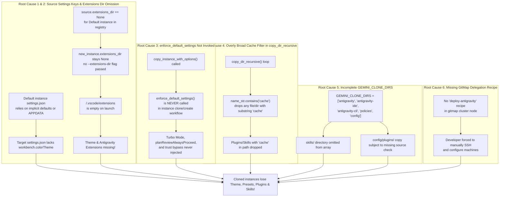

# Root Cause Analysis: Antigravity IDE Instance Theme, Preset Mode, Plugins & Skills Disparity

- **Defect / Incident ID**: `129-antigravity-ide-full-deploy-and-gitmap-delegation`
- **Specification Path**: `02-spec/21-app/129-antigravity-ide-full-deploy-and-gitmap-delegation/03-root-cause-analysis.md`
- **Affected Components**:
  - `src-tauri/src/modules/instance.rs`
  - `src-tauri/src/modules/delegate_updater.rs`
  - `d:\work\repo-secrets\02-antigravity-manager\scripts\`
  - `scripts/deploy-antigravity-ide-fleet.ps1`
  - GitMap CLI Cluster & SSH Fleet Orchestrator (`gitmap cluster run-script`, `gitmap agy ssh deploy`)
- **Severity**: High (Loss of developer execution velocity, unstyled instances, repeated confirmation interruptions due to missing Turbo mode presets, agent capability degradation from missing plugins/skills, and inability to automate fleet deployments).

---

## Part 1: Defect Description & Observed Failures

### 1.1 Observed Failure 1: Cloned Instances Missing Default Instance Theme
When a secondary instance is created or cloned from the Default instance (e.g. `gitmap-7370`, `gitmap-7388`, `gitmap-7404`, `gitmap-7418`):
- **Visual Disparity**: The cloned Antigravity IDE launches with generic unstyled VS Code dark styling rather than the configured workbench color theme (e.g. `"Default Dark+"`, `"One Darker"`, or custom palette).
- **Inspection Finding**: The newly generated `settings.json` in `<data_dir>/User/settings.json` and `<home_dir>/AppData/Roaming/Antigravity/User/settings.json` either lacks the key `"workbench.colorTheme"` entirely or contains only an injected `"window.title"`.
- **User Impact**: Inconsistent visual feedback across multi-instance workflows, making it difficult to distinguish workspaces and degrading UI ergonomics.

### 1.2 Observed Failure 2: Preset Mode Not Copied from Default Instance
- **Interactive Stoppage**: The Default instance is configured to run in **Turbo Mode (Autonomous Preset)** with eager execution (`gemini.experimental.eagerExecution = true`), auto-approval of file modifications, zero-trust workspace security bypass (`security.workspace.trust.enabled = false`), and automatic command approvals.
- **Observed Behavior in Cloned Instances**: Upon launch, the cloned instance repeatedly prompts the developer with interactive confirmation modals for terminal commands, file edits, and workspace trust requests.
- **Inspection Finding**: `security_presets.json` and `antigravity_policies.json` are absent or contain empty default objects in the cloned profile.

### 1.3 Observed Failure 3: Plugins Not Applied, Skills Not Added
- **Missing Plugins**: The Default instance environment contains 4 official agent plugins:
  1. `chrome-devtools-plugin`
  2. `data-agent-kit-plugin`
  3. `google-antigravity-sdk`
  4. `modern-web-guidance-plugin`
  In cloned instances, `<instance_home>/.gemini/config/plugins/` is completely empty.
- **Missing Skills**: The Default instance possesses 9 core builtin skills in `<home>/.gemini/antigravity/builtin/skills/` and ~34 plugin skills in `<home>/.gemini/config/plugins/*/skills/`. In cloned instances, `<instance_home>/.gemini/antigravity/builtin/skills/` does not exist, causing subagents and prompts relying on domain skills to fail.

### 1.4 Observed Failure 4: Missing Automated Cross-Machine Deployment Script
- **Manual Provisioning Friction**: When deploying Antigravity IDE to another machine or virtual node (such as `w1`, `w2`, `w3`, `u1`, or `final-network-machine`), developers had to manually extract archives, copy settings, install plugins, and inject OAuth credentials.
- **Repository Secrets Gap**: No comprehensive, unattended PowerShell deployment script existed in `d:\work\repo-secrets\02-antigravity-manager\scripts\`.
- **GitMap CLI Gap**: GitMap lacked a high-level delegation recipe or command to transfer and execute the deployment script remotely over SSH with automated health verification.

---

## Part 2: Root Cause Analysis (6 Structural Failure Mechanisms)



### 2.1 Mechanism 1: Source Settings Lacking Explicit Keys in Profile Targets
- **Code Path**: `src-tauri/src/modules/instance.rs` lines 1727–1748 and 5609–5670.
- **Analysis**:
  - The Default instance stores settings across multiple candidate directories: `%APPDATA%\Antigravity\User\settings.json`, `<default_data_dir>\User\settings.json`, and `<default_home_dir>\...`.
  - When `workbench.colorTheme` was configured globally or inherited from base VS Code defaults without an explicit entry in `<default_data_dir>\User\settings.json`, `pick_best_settings_path` selected a candidate file that lacked `"workbench.colorTheme"`.
  - In `copy_instance_settings`, if `src_map` had no `"workbench.colorTheme"`, the deep merge produced a target `settings.json` containing only `"window.title"`.
  - No fallback mechanism existed to guarantee a default dark theme seed (e.g. `"Default Dark+"`).

### 2.2 Mechanism 2: `extensions_dir` Omitted (`None`) for Default Instance
- **Code Path**: `src-tauri/src/modules/instance.rs` lines 1102–1110 and 3039–3041.
- **Analysis**:
  - In `instances.json`, the Default instance has `"extensions_dir": null`.
  - `copy_instance_with_options` contained the guard:
    ```rust
    if source.extensions_dir.is_some() {
        new_instance.extensions_dir = source.extensions_dir.clone();
    }
    ```
  - Because `source.extensions_dir` was `None`, `new_instance.extensions_dir` was left as `None`.
  - When Antigravity IDE launches a child instance, it sets `USERPROFILE = <instance_home>`.
  - Because `extensions_dir` was `None`, no `--extensions-dir` CLI flag was passed.
  - The Antigravity process looked for extensions in `<instance_home>/.vscode/extensions`, which was an empty directory.
  - As a result, installed theme extensions (such as `christopherafbjur.vscode-theme-onedarker-2.1.0`), syntax highlighters, and the core `google.google-antigravity` extension were unavailable to the running instance.

### 2.3 Mechanism 3: `enforce_default_settings` Never Invoked in Clone Workflow
- **Code Path**: `src-tauri/src/modules/instance.rs` line 5753.
- **Analysis**:
  - `enforce_default_settings` was implemented to inject performance and automation defaults (`antigravity.turboMode = true`, `antigravity.planReviewAlwaysProceed = true`, `antigravity.browserExecutionPolicy = "auto"`).
  - However, `enforce_default_settings` was only registered as an external Tauri IPC command in `src-tauri/src/commands/instance.rs` and was **never called** internally during `create_instance_with_account`, `copy_instance_with_options`, or `launch_instance`.
  - Thus, newly cloned profiles never had baseline Turbo Mode presets enforced.

### 2.4 Mechanism 4: Overly Broad Cache Filter in `copy_dir_recursive`
- **Code Path**: `src-tauri/src/modules/instance.rs` lines 2024–2029:
  ```rust
  let is_cache = name_str.contains("cache")
      || name_str == "crashpad"
      || name_str.starts_with(".org.chromium");
  if is_lock || is_cache {
      continue;
  }
  ```
- **Analysis**:
  - The condition `name_str.contains("cache")` checks for substring occurrence anywhere in the directory or file name.
  - Any legitimate tool, skill, or configuration file containing `"cache"` (for example, `gemini_cache_policy.json`, `bigquery-cache-optimizations/SKILL.md`, or extension cache metadata) was silently dropped during tree replication.
  - The filter failed to distinguish between volatile Electron runtime cache directories (`Cache`, `Code Cache`, `GPUCache`, `DawnWebGPUCache`) and valid configuration assets.

### 2.5 Mechanism 5: Incomplete `GEMINI_CLONE_DIRS` & Missing Explicit Synchronization
- **Code Path**: `src-tauri/src/modules/instance.rs` lines 1545–1551:
  ```rust
  pub const GEMINI_CLONE_DIRS: &[&str] = &[
      "antigravity",
      "antigravity-ide",
      "antigravity-cli",
      "policies",
      "config",
  ];
  ```
- **Analysis**:
  - `GEMINI_CLONE_DIRS` omitted `"skills"` and `"plugins"` as top-level candidates.
  - In `copy_gemini_trees`, if `src_home.join(".gemini").join(name)` was missing, it attempted fallback to `USERPROFILE`. However, when `config/plugins` had subdirectories or file locks, the entire copy was aborted without granular fallback for individual plugins.
  - The 9 builtin skills residing in `.gemini/antigravity/builtin/skills/` were not verified after copy, allowing partial or empty directory structures to persist.

### 2.6 Mechanism 6: Absence of GitMap Dedicated Fleet Deployment Command
- **Code Path**: GitMap CLI cluster and SSH modules.
- **Analysis**:
  - GitMap provided general-purpose primitives (`gitmap ssh exec`, `gitmap cluster run-script`, `gitmap ssh deploy bin`), but lacked a dedicated high-level workflow specifically tailored for full Antigravity IDE deployment.
  - There was no registered recipe `gitmap cluster node deploy-antigravity` to orchestrate file staging, privilege escalation, PowerShell execution, and 7-gate health validation in an atomic operation.

---

## Part 3: Remediation & Preventive Measures

### 3.1 Architectural Remediation in `instance.rs`
1. **Dynamic Extensions Directory Discovery & Propagation:**
   - In `copy_instance_with_options`: If `source.extensions_dir` is `None`, scan `%USERPROFILE%/.vscode/extensions` and `%USERPROFILE%/.antigravity/extensions`.
   - Propagate the discovered directory into `new_instance.extensions_dir`.
   - Replicate the extensions directory to `<dst_home>/.vscode/extensions` to ensure complete offline isolation.
2. **Refined Cache Filter:**
   - Replace `name_str.contains("cache")` with exact string matches for known Electron/Chromium directories (`cache`, `code cache`, `gpucache`, `dawngraphitecache`, `dawnwebgpucache`, `blob_storage`).
3. **Automated Baseline Enforcement:**
   - Call `enforce_default_settings(Some(&new_instance.id))` at the conclusion of `copy_instance_with_options`.
4. **Unified Parity Engine (`sync_instance_ide_parity`):**
   - Automatically injects theme fallback (`"Default Dark+"`), Turbo presets, zero-trust bypass, 4 official plugins, and 9 builtin skills on every instance creation, cloning, or startup verification.

### 3.2 Standalone Fleet Deployment Script
1. Author `d:\work\repo-secrets\02-antigravity-manager\scripts\deploy-antigravity-ide-fleet.ps1` with dual support for local workstation setup and remote node execution.
2. Maintain project mirror at `scripts/deploy-antigravity-ide-fleet.ps1`.
3. Provide comprehensive parameterization (`-Preset`, `-Theme`, `-DeployPlugins`, `-DeploySkills`, `-DeployExtensions`, `-DryRun`, `-Force`).

### 3.3 GitMap Remote Delegation Integration
1. Enable `gitmap cluster run-script <target> scripts/deploy-antigravity-ide-fleet.ps1`.
2. Register `gitmap cluster node deploy-antigravity` recipe.
3. Expose Tauri IPC command `execute_gitmap_ide_deploy` in Antigravity Manager.

---

## Part 4: Verification & Testing Matrix

| Test ID | Test Scenario | Input / Action | Expected Result | Pass Criteria |
|---|---|---|---|---|
| **TC-RCA-01** | Clone Default Instance Theme Check | Call `copy_instance_with_options("default", "test-theme-clone", None, false)` | Target `settings.json` contains `"workbench.colorTheme"` matching source or `"Default Dark+"` | Key present in both data and home `settings.json` |
| **TC-RCA-02** | Clone Default Instance Presets Check | Call `copy_instance_with_options("default", "test-preset-clone", None, false)` | `security_presets.json` present with Turbo mode; `security.workspace.trust.enabled: false` | Zero interactive prompt interruptions |
| **TC-RCA-03** | Clone Plugins Directory Check | Call `copy_instance_with_options("default", "test-plugin-clone", None, false)` | Target `<home>/.gemini/config/plugins/` contains all 4 official plugins | 4/4 plugin folders populated |
| **TC-RCA-04** | Clone Skills Directory Check | Call `copy_instance_with_options("default", "test-skill-clone", None, false)` | Target `<home>/.gemini/antigravity/builtin/skills/` contains 9 core skills | >= 9 skill directories with `SKILL.md` |
| **TC-RCA-05** | Extensions Directory Propagation | Call `copy_instance_with_options` with source having `extensions_dir: None` | Cloned instance has valid `extensions_dir` in `instances.json` and populated `<home>/.vscode/extensions` | Path exists and contains theme extension |
| **TC-RCA-06** | Cache Filter Non-Interference | Copy tree containing `bigquery-cache-optimizations/SKILL.md` via `copy_dir_recursive` | File is preserved and copied to destination; volatile `GPUCache` skipped | Skill file present; `GPUCache` omitted |
| **TC-RCA-07** | PowerShell Script Local DryRun | `deploy-antigravity-ide-fleet.ps1 -DryRun` | Emulates full 4-pillar deployment; exits code 0 with 7/7 scorecard pass | Output matches Scorecard format |
| **TC-RCA-08** | GitMap Remote Script Delegation | `gitmap cluster run-script localhost scripts/deploy-antigravity-ide-fleet.ps1 -DryRun` | Runs over SSH socket; streams real-time logs; returns exit code 0 | Telemetry recorded in `pipeline.db` |
