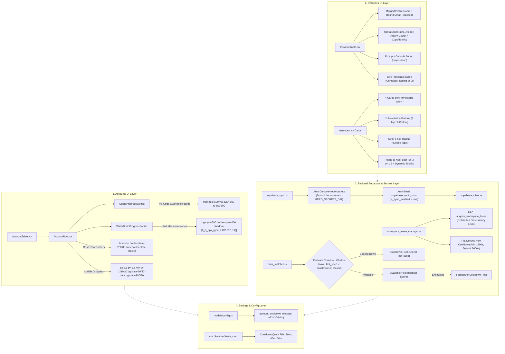

# Architecture Spec: 130-accounts-ui-supabase-sync-instance-compact-and-release

**Version:** 1.0.0  
**Updated:** 2026-10-05  
**AI Confidence:** High  
**Ambiguity:** None  

---

## Keywords

`accounts-ui-styling` · `quota-progress-bar` · `vs-code-teal-cyan-palette` · `account-table-borders` · `middle-section-grouping` · `softened-audit-badges` · `supabase-repo-secrets-autoload` · `cross-machine-account-lease` · `email-cooldown-window` · `instance-table-compacting` · `zero-horizontal-scroll` · `merged-profile-email-column` · `path-truncation-ending-folder` · `prompts-capsule-button` · `instance-cards-4-cols` · `two-row-card-buttons` · `strict-5-6px-button-radius` · `rotate-next-best-tooltip-padding` · `minor-release-bump`

---

## Scoring

| Criterion | Status |
|---|---|
| AI Confidence assigned | ✅ High |
| Ambiguity assigned | ✅ None |
| Keywords present | ✅ Complete |
| Verbatim requirements captured | ✅ Complete |
| Preserved visual evidence referenced | ✅ 4 Screenshots Integrated |
| Component hierarchy & design tokens defined | ✅ Fully Specified |
| Backend distributed lease & secrets flow detailed | ✅ Fully Specified |
| Quality verification matrix defined | ✅ Complete |
| Non-negotiable boundaries enforced | ✅ Complete |

---

## 1. Executive Summary & Verbatim Requirements

This specification defines the architectural design, component hierarchy, design tokens, backend Supabase lease flow, and verification gates for task **130-accounts-ui-supabase-sync-instance-compact-and-release** for Antigravity Manager (`d:\work\Antigravity-Manager`).

### 1.1 User Request (Verbatim)

> Hi there. So far it looks good in most cases, but there are some issues. For example, when I go into the account section, there was a little bit of lines and it looked like the middle section has some, let's say, grouping or showed nicely. There was a border type thing, and then rows were a little bit showcased before. I really like that you can have this. And also I requested for a different type of coloring for the green ones. You could give me some suggestions or try it out, making the progress bar a little bit better. That's for the home screen account section. I think this is the improvement that you can do. Okay? Now going to the instance section. Also, one more important point, the Supabase is not loaded from the repo secrets folder. Okay? Load the Supabase. Make sure that the same account is not tapped into by multiple instances or multiple account across the other machines as well. Okay? Using the Supabase ensure that, and also the email can be another way of checking. So let's say in Supabase or email, we would check that the current email has been used or taken by any other account in last one hour or 30 minutes, something like this. That should be changeable from the settings. Okay? So based on that, if some email has been taken by some other account or instance, we skip that email. Okay? Unless we have no other email. Okay, so this is how it should be coded. Remember that. And instance section looks nice, but the greener color, I really do not appreciate that much of a green in the table section. It could be a little bit like the VS Code theme. I would appreciate that. You could improve the coloring and also the table that is there. Look at the screenshot in the table section. You have to scroll to the right. We do not want that. For example, the profile name and the bound email can be put together in one section. Just look at the size of the table. You don't have to spread things around. And also the folder, only the ending path is enough, like which project is that. So that would be enough. Also, we had that button, the prompt button. It's not necessarily needed to be separately there. It can be merged in the capsule button that is there. And the other buttons like the card format, you can have 4 items per row. The buttons look bad. In card mode, you can have 2 rows of buttons instead of 1 row, and with the rounded 5 or 6px. Even in the card format and everywhere, the rounded border of the buttons should be 5 to 6px. Also the Rotate to Next Best button: make sure that the button has proper padding. If there's an instance selected, it should rotate to the next best for that instance. If no instance selected, on hover tell the user which instance it will rotate to (or the active/default instance). And release: minor bump and release ceremony at the end.

---

## 2. Visual Evidence & Screenshot Analysis

Visual ground truth is established through four user screenshots in `assets/screenshots/`:

### 2.1 Theme Catalogue & Quota Progress Neon Issues

*Figure 2.1: Overview of Accounts view with Theme Catalogue open. The progress bars render high-saturation neon green (`#1af18d`, `#10b981`) with blinding glow shadows (`shadow-[0_0_8px_rgba(26,241,141,0.6)]`) on checkpoint nodes. Table rows lack distinct horizontal border lines, causing adjacent quota metrics to visually blur together.*

### 2.2 Show All Quotas Header & Action Capsule Styling

*Figure 2.2: Focus mode and "Show All Quotas" toggle bar. Illustrates the target button corner radius standards (5–6px / `rounded-[5px]`) and the segmented capsule styling that must be maintained across all table and toolbar actions.*

### 2.3 Accounts Table Quota Bar Grouping & Row Lines

*Figure 2.3: Accounts table layout highlighting two red-bordered defect regions: (1) The 4H Model Quota progress bar and milestone check nodes, and (2) The Weekly Quota progress bar. Demonstrates the need for crisp row borders (`border-b border-slate-200/80 dark:border-slate-800/80`), middle section visual grouping (subtle background shading for quota columns), and softened VS Code cyan/teal theme colors.*

### 2.4 Duplicate Profile Modal & Radius Ground Truth

*Figure 2.4: Profile creation and cloning modal illustrating the desired compact UI density, cyan/teal accent focus rings, and clean border radius consistency across the application.*

---

## 3. System Architecture & High-Level Flow

The system coordinates UI components, local profile state, and a distributed Supabase PostgREST synchronization layer to ensure cross-node concurrency safety:



---

## 4. Detailed Component & Subsystem Specifications

### 4.1 Accounts Section: Row Borders, Middle Grouping & VS Code Cyan/Teal Palette

#### 4.1.1 Progress Bar Color Modernization
In `src/components/accounts/QuotaProgressBar.tsx` and `src/components/common/WaterDrainProgressBar.tsx`:
- **Current Defect**: Harsh neon green hex codes (`#1af18d`, `#10b981`, `#059669`) with excessive neon glow (`shadow-[0_0_8px_rgba(26,241,141,0.6)]`).
- **Target Color Mapping**:
  * **Quota >= 75% (Healthy / Optimal)**:
    `bg-gradient-to-r from-teal-500 via-cyan-500 to-sky-500`
  * **Quota >= 50% (Comfortable / Half-Life)**:
    `bg-gradient-to-r from-cyan-600 via-teal-500 to-amber-400`
  * **Quota >= 25% (Warning / Low)**:
    `bg-gradient-to-r from-amber-500 via-amber-400 to-orange-500`
  * **Quota < 25% (Critical / Depleted)**:
    `bg-gradient-to-r from-amber-500 via-orange-500 to-rose-600`
- **Milestone Checkpoint Nodes**:
  * Checkpoint 0 (100% / Filled):
    `bg-cyan-500 border-[1.5px] border-cyan-400 shadow-[0_0_6px_rgba(6,182,212,0.4)]`
  * Checkpoint 1 (75% / Filled):
    `bg-teal-600 border-[1.5px] border-teal-500 shadow-none`
  * Checkpoint 2 (50% / Filled):
    `bg-amber-500 border-[1.5px] border-amber-600 shadow-none`
  * Checkpoint 3 (25% / Filled):
    `bg-orange-500 border-[1.5px] border-orange-600 shadow-none`
  * Unfilled Nodes (`!isFilled`):
    `bg-slate-200/50 dark:bg-[#0c2438] border border-slate-300 dark:border-[#15334d]/60 shadow-none`
- **Numerical Percentage Badges**:
  * `>= 50%`: `text-teal-700 dark:text-cyan-400`
  * `>= 25%`: `text-amber-700 dark:text-amber-400`
  * `< 25%`: `text-rose-600 dark:text-rose-400`

#### 4.1.2 Crisp Row Borders & Middle Section Grouping
In `src/components/accounts/AccountTable.tsx` and `src/components/accounts/AccountRow.tsx`:
- **Row Border Standard**:
  Every `<tr>` must explicitly render:
  `border-b border-slate-200/80 dark:border-slate-800/80 border-l-2 transition-[color,background-color,border-color] duration-[180ms] ease-in-out`
- **Middle Section Quota Grouping**:
  * Quota columns (4H Model Quota and Weekly Quota) must be visually grouped with subtle background tint:
    `px-2.5 py-1.5 align-middle min-w-[210px] bg-slate-50/30 dark:bg-slate-900/20`
  * Distinct vertical separator accents between Email column, Quota Grouping, Last Used column, and Actions column.
  * Header row (`thead tr`) clearly groups quota controls under a unified container with pill toggle (`Gemini` / `Claude`).
- **Softened Status & Audit Badges**:
  * `DISABLED`: `px-1.5 py-0.5 rounded-[5px] bg-slate-100 dark:bg-slate-800/80 text-slate-600 dark:text-slate-400 border border-slate-300 dark:border-slate-700 text-[9px] font-bold shadow-xs`
  * `PROXY_DISABLED`: `px-1.5 py-0.5 rounded-[5px] bg-amber-50 dark:bg-amber-950/40 text-amber-700 dark:text-amber-400 border border-amber-300/40 text-[9px] font-bold shadow-xs`
  * `FORBIDDEN`: `px-1.5 py-0.5 rounded-[5px] bg-rose-50 dark:bg-rose-950/40 text-rose-700 dark:text-rose-400 border border-rose-300/40 text-[9px] font-bold shadow-xs`
  * `LEASED`: `px-1.5 py-0.5 rounded-[5px] bg-purple-50 dark:bg-purple-950/40 text-purple-700 dark:text-purple-300 border border-purple-300/40 text-[9px] font-bold shadow-xs`

---

### 4.2 Supabase Auto-Discovery, Distributed Leases & Email Cooldown Window

#### 4.2.1 Secrets Auto-Discovery (`src-tauri/src/modules/supabase_sync.rs`)
- **Discovery Strategy**:
  When `supabase_config.json` lacks endpoints, probe candidates:
  1. `REPO_SECRETS_DIR` environment variable.
  2. Direct Windows path: `D:/work/repo-secrets/03-supabase/01-own/supabase-credentials.json`
  3. Direct Windows path: `D:/work/repo-secrets/03-supabase/02-lovable/supabase-credentials.json`
  4. Root vault path: `D:/work/repo-secrets/02-antigravity-manager/vault/supabase_config.json`
  5. Relative paths: `../repo-secrets/...`, `../../repo-secrets/...`
  6. User home directory: `~/.antigravity_tools/repo-secrets/...`
- **Payload Extraction & Normalization**:
  * Support raw JSON and two-tier `JsonEnvelope` schemas.
  * Strip UTF-8 BOM if present.
  * PostgREST URL normalization: strip trailing slashes, enforce valid `https://<ref>.supabase.co`.
  * Auto-enable sync flag (`is_sync_enabled = true`) upon discovery.

#### 4.2.2 Cross-Machine Account Concurrency Protection (`workspace_lease_manager.rs`)
- **Schema & Lease Contract**:
  Distributed leases are tracked in the Supabase `workspace_leases` table:
  ```sql
  create table if not exists public.workspace_leases (
      account_id text primary key,
      account_email text,
      node_id text not null,
      node_alias text not null,
      ip_address text,
      profile_name text,
      leased_at bigint not null,
      expires_at bigint not null
  );
  ```
- **Atomic Lease Acquisition (`acquire_lease_with_details`)**:
  * Invokes Supabase RPC stored function `acquire_workspace_lease` with parameters:
    `p_account_id`, `p_account_email`, `p_node_id`, `p_node_alias`, `p_profile_name`, `p_ttl_seconds`, `p_ip_address`.
  * Fallback to direct PostgREST `select` and `upsert` if RPC is unavailable.
  * If another node holds an active lease (`expires_at > now && current_owner != local_node_id`), acquisition is denied, preventing simultaneous account usage across physical/virtual machines.

#### 4.2.3 Configurable 30–60 Minute Email Cooldown Window (`auto_switcher.rs` & `config.rs`)
- **Configuration Contract**:
  * `account_cooldown_minutes: u32` in `AutoProfileSwitcherConfig` (default: 60, valid range: 30–60 minutes, slider up to 120m).
  * Synced with `account_lockout_window_minutes`.
- **Candidate Evaluation Algorithm**:
  1. Calculate `cooldown_secs = account_cooldown_minutes * 60`.
  2. For every healthy candidate account:
     * Check local usage: `acc.last_used > 0 && (now - acc.last_used) < cooldown_secs`.
     * Check remote lease: `lease.leased_at > 0 && (now - lease.leased_at) < cooldown_secs || lease.expires_at > now`.
     * Check cross-VM inbound email switches: `fetch_recent_cross_vm_switched_accounts(cooldown_secs)`.
  3. Partition candidates into two pools:
     * **Available Pool**: Accounts free of cooldown and remote locks. Ranked by quota health score descending.
     * **Cooldown Pool**: Accounts within the cooldown window. Ranked by `last_used` ascending (oldest cooldown first).
  4. Selection Strategy:
     * If `Available Pool` is non-empty, select the top candidate.
     * If `Available Pool` is completely exhausted, gracefully fall back to the top candidate in `Cooldown Pool` (oldest used), ensuring operations never dead-end.

---

### 4.3 Instances Table Compacting & Horizontal Scrollbar Removal

#### 4.3.1 Eliminating Horizontal Scroll at 1280px+ Viewports
In `src/components/instances/InstanceTable.tsx`:
- **Current Defect**: Over-wide columns cause content to overflow standard 1280px desktop screens, forcing annoying horizontal scrolling.
- **Compacting Rules**:
  1. Cell Padding: Reduce standard cell padding from `px-3 py-2.5` to `px-2 py-1.5`.
  2. Merged Profile & Email Column: Combine Profile Name and Bound Email into a single stacked cell:
     * Top Line: Profile name (`font-semibold text-slate-800 dark:text-slate-100 text-xs truncate max-w-[140px]`) + `DEFAULT` / `ACTIVE` badge (`text-[9px] px-1 py-0.2 rounded-[5px]`).
     * Bottom Line: Email dot indicator + masked/revealed email (`text-[10px] font-mono text-slate-500 dark:text-slate-400 truncate max-w-[140px]`).
  3. Path Truncation: Enforce `formatShortPath(fullPath)` returning only the ending folder `.../<leaf>` or `...\<parent>\<leaf>`:
     * Strict container width: `max-w-[140px] truncate`.
     * 1-click clipboard copy button (`<Copy />` / `<Check />`).
     * Full path accessible via native `title` attribute hover tooltip.
  4. Prompts Button in Actions Capsule:
     * Embed the Prompts button (`<Layers className="w-3 h-3" />`) directly inside the segmented table action capsule.
     * Action capsule padding: `px-1.5 py-1` with `rounded-[5px]`.
  5. Cyan/Teal Accents: Modernize launch spinner and active indicators from emerald to VS Code cyan/teal (`text-teal-500`, `bg-cyan-400`).

---

### 4.4 Instances Card Mode & Button Standards

#### 4.4.1 Strict 4 Cards per Row Grid Layout
In `src/pages/Instances.tsx`:
- Container grid definition:
  ```tsx
  <div className={cn(
      cardDensity === 'compact'
          ? "grid grid-cols-2 md:grid-cols-3 lg:grid-cols-4 xl:grid-cols-5 2xl:grid-cols-6 gap-2"
          : "grid grid-cols-1 md:grid-cols-2 lg:grid-cols-3 xl:grid-cols-4 gap-3"
  )}>
  ```
  At desktop breakpoints `>= 1280px` (`xl:`), cards render strictly 4 items per row.

#### 4.4.2 Balanced Two-Row Card Action Buttons
In card mode, action buttons are structured into 2 clean, balanced rows:
- **Row 1: Primary Lifecycle & Rotation (5 buttons)**:
  1. `Launch` / `Stop` (Status-dependent toggle)
  2. `Switch Account` (`ArrowRightLeft`)
  3. `Fast Forward` (`FastForward`)
  4. `Audit Trail` (`History`)
  5. `Sync PID & Quota` (`RotateCw`)
- **Row 2: Utilities, Tools & Danger (6 buttons)**:
  1. `Prompts` (`Layers`) — with active task indicator
  2. `Settings & Sync` (`SlidersHorizontal`)
  3. `Clone Profile` (`Copy`)
  4. `Clone Executable` (`Cpu`)
  5. `Wipe Credentials` (`RotateCcw`)
  6. `Delete Profile` (`Trash2` / invisible placeholder for default instance)

#### 4.4.3 Strict 5–6px Border Radius Standard
- All interactive buttons across cards, tables, and toolbars must adhere to 5–6px border radius (`rounded-[5px]`).
- Bulbous pill buttons (`rounded-full`, `rounded-2xl`) are strictly prohibited for action buttons.
- Segmented capsules use `rounded-[5px]` outer bounds with inner divider lines.

#### 4.4.4 "Rotate to Next Best" Header Button
In `src/pages/Instances.tsx` header toolbar:
- **Styling**: `px-3 py-1.5 text-xs font-semibold rounded-[5px] bg-blue-600 hover:bg-blue-500 text-white shadow-xs cursor-pointer transition-colors active:scale-95 shrink-0`
- **Dynamic Tooltip & Rationale**:
  * When an instance is selected/active: `"Rotates active instance (#<seq> <name>) to the highest health candidate"`.
  * When no instance selected: `"Rotates default instance (#1 Default) to the highest health candidate"`.
  * Shows health scoring rationale on hover.

---

## 5. Verification Matrix & Quality Gates

| Verification Item | Target Deliverable | Verification Technique | Acceptance Criteria |
|---|---|---|---|
| **V1: Progress Bar Colors** | `QuotaProgressBar.tsx`, `WaterDrainProgressBar.tsx` | Code audit & DOM inspection | Replaced `#1af18d` / `#10b981` with `from-teal-500 via-cyan-500 to-sky-500` |
| **V2: Milestone Checkpoints** | Checkpoint nodes | Code audit & DOM inspection | Checkpoint 0 uses `bg-cyan-500 border-cyan-400 shadow-[0_0_6px_rgba(6,182,212,0.4)]` |
| **V3: Table Row Borders** | `AccountRow.tsx` | DOM style audit | `border-b border-slate-200/80 dark:border-slate-800/80` rendered on all rows |
| **V4: Quota Column Grouping** | `AccountTable.tsx` | DOM style audit | Middle quota section rendered with distinct background tint `bg-slate-50/30 dark:bg-slate-900/20` |
| **V5: Zero Horizontal Scroll** | `InstanceTable.tsx` | Viewport test (1280px) | `scrollWidth <= clientWidth` on table wrapper |
| **V6: Merged Profile & Email** | `InstanceTable.tsx` | DOM structure audit | Stacked single cell containing profile name and email |
| **V7: Path Truncation** | `InstanceTable.tsx` | DOM text audit | Truncated to `.../folder` (max-w 140px) with copy button and title tooltip |
| **V8: Prompts Action Capsule** | `InstanceTable.tsx` | DOM structure audit | `Layers` Prompts button integrated inside action capsule |
| **V9: 4 Cards per Row** | `Instances.tsx` | Viewport test (1280px) | Grid renders `xl:grid-cols-4` strictly |
| **V10: 2-Row Card Actions** | `Instances.tsx` card view | DOM layout audit | Row 1 contains 5 buttons, Row 2 contains 6 buttons |
| **V11: 5-6px Radius Standard** | Buttons across app | CSS audit | Buttons use `rounded-[5px]` |
| **V12: Rotate Button Tooltip** | "Rotate to Next Best" | DOM event audit | Dynamic tooltip reveals target instance and selection rationale |
| **V13: Supabase Auto-Discovery** | `supabase_sync.rs` | Unit / candidate check | Probes `D:/work/repo-secrets` and auto-seeds config |
| **V14: Cross-Machine Lease Lock**| `workspace_lease_manager.rs` | Logic audit | Leased account by another node rejects acquisition |
| **V15: Configurable Cooldown** | `auto_switcher.rs`, `config.rs` | Logic & config audit | 30–60m window observed with two-tier fallback |
| **V16: Minor Version Bump** | `npm run bump:minor` | Release check | Atomic bump and release ceremony executed |

---

## 6. Non-Negotiable Operational Boundaries

1. **Pure Specification Turn (Total Ban on Code Modification)**: During this specification turn, no application source code, unit tests, or build scripts may be edited or executed.
2. **Total Ban on Git Commands**: Never execute `git add`, `git commit`, `git checkout`, `git push`, `git status`, `git diff`, or any other git commands.
3. **Preserve Business Logic & IPC Contracts**: UI modernizations must strictly preserve all existing Tauri IPC invocations, Zustand store actions, drag-and-drop bindings, and keyboard shortcuts.
4. **Attribution & Release Hygiene**: Release attribution strictly belongs to `@aukgit` in accordance with repository governance.
