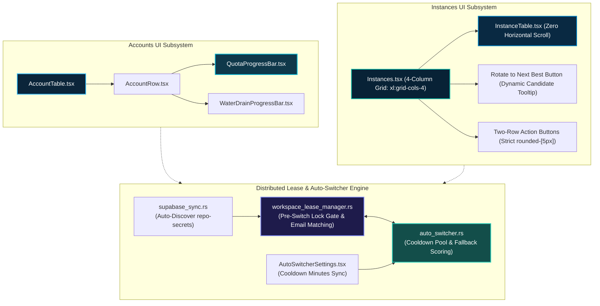

# Component Specification: Accounts UI, Supabase Distributed Leases, and Compact Instances Architecture

- **Task ID**: `130-accounts-ui-supabase-sync-instance-compact-and-release`
- **Target Files**:
  - `src/components/accounts/QuotaProgressBar.tsx` (Teal/cyan/sky palette, softened checkpoint glow)
  - `src/components/accounts/AccountTable.tsx` (Table row borders, middle section quota grouping, audit badges)
  - `src/components/accounts/AccountRow.tsx` (Row borders, middle section quota cell styling, status pill badges)
  - `src/components/common/WaterDrainProgressBar.tsx` (Calm milestone nodes, matching palette)
  - `src/components/instances/InstanceTable.tsx` (Merged Profile/Account column, path truncation, Prompts action in capsule, compact padding, zero horizontal scroll)
  - `src/pages/Instances.tsx` (4-card desktop grid, 2-row action toolbar, strict 5–6px button radius, "Rotate to Next Best" tooltip)
  - `src-tauri/src/modules/supabase_sync.rs` (Repo-secrets auto-discovery, URL normalization, PostgREST endpoint deduplication)
  - `src-tauri/src/modules/workspace_lease_manager.rs` (Distributed lease acquisition, pre-switch lock gate, email-aware lease check)
  - `src-tauri/src/modules/auto_switcher.rs` (Candidate scoring, cooldown pool partition, graceful fallback, direct email propagation)
  - `src-tauri/src/models/config.rs` (`account_cooldown_minutes` config serialization & serde defaults)
  - `src/components/settings/AutoSwitcherSettings.tsx` (Cooldown duration selector, quick pills, sync state)
  - `src/pages/Settings.tsx` (Settings view integration & config synchronization)
- **Architectural Scope**: Complete frontend UI design token modernization, responsive table compaction, multi-card grid restructuring, button radius normalization, PostgREST distributed account leasing, and automatic secrets discovery.

---

## 1. System Interaction Flow & Component Topology



---

## 2. Frontend Accounts Styling & Palette Contracts

### 2.1 QuotaProgressBar & WaterDrainProgressBar Color Palette Contract

#### 2.1.1 Problem Statement
The legacy progress bar implementation employed hyper-saturated neon green hex codes (`#1af18d`, `#10b981`, `#059669`) and an unconstrained checkpoint drop shadow (`shadow-[0_0_8px_rgba(26,241,141,0.6)]`). This created extreme visual fatigue and contrasted jarringly with the dark-slate theme of the application.

#### 2.1.2 Interface Contract: `QuotaProgressBarProps`
```typescript
export interface QuotaProgressBarProps {
    percentage: number;
    resetTime?: string;
    label?: string;
    isProtected?: boolean;
    isWeekly?: boolean;
    isWeeklyConstrained?: boolean;
    className?: string;
    heightClassName?: string;
    checkpoints?: number[];
    showCheckpoints?: boolean;
    Icon?: React.ComponentType<{ size?: number; className?: string }>;
    liveLimit?: any;
}
```

#### 2.1.3 Palette Transformation Rules
The track gradient and milestone indicators are standardized to the VS Code teal/cyan/sky design language:

| Range / Condition | Legacy Palette | Modernized VS Code Design Token | Visual Intent |
|---|---|---|---|
| **>= 75%** (Optimal) | `bg-gradient-to-r from-[#1af18d] to-[#10b981]` | `bg-gradient-to-r from-teal-500 via-cyan-500 to-sky-500` | Calm, confident high quota capacity |
| **>= 50%** (Half-Life) | `bg-gradient-to-r from-emerald-500 to-teal-500` | `bg-gradient-to-r from-teal-600 via-cyan-500 to-amber-400` | Balanced buffer with gentle transition |
| **>= 25%** (Warning) | `bg-gradient-to-r from-amber-400 to-orange-500` | `bg-gradient-to-r from-amber-400 via-amber-500 to-orange-500` | Clear visual warning without blinding |
| **< 25%** (Critical) | `bg-gradient-to-r from-red-500 to-rose-600` | `bg-gradient-to-r from-orange-500 via-rose-500 to-rose-600` | Crisp emergency threshold |

#### 2.1.4 Milestone Checkpoint Nodes Contract
```typescript
const getNodeStyle = (idx: number, isFilled: boolean): string => {
    if (!isFilled) {
        return "bg-slate-200/50 dark:bg-[#0c2438] border border-slate-300 dark:border-[#15334d]/60 shadow-none";
    }
    switch (idx) {
        case 0:
            // Node 1 (100%): Soft cyan aura replaces blinding neon glow
            return "bg-cyan-400 dark:bg-cyan-500 border-[1.5px] border-cyan-300 dark:border-cyan-400 shadow-[0_0_6px_rgba(6,182,212,0.4)]";
        case 1:
            // Node 2 (75%): Calming teal
            return "bg-teal-500 border-[1.5px] border-teal-400 shadow-none";
        case 2:
            // Node 3 (50%): Controlled amber
            return "bg-amber-400 dark:bg-amber-500 border-[1.5px] border-amber-300 dark:border-amber-400 shadow-none";
        case 3:
            // Node 4 (25%): Warm orange
            return "bg-orange-500 border-[1.5px] border-orange-400 shadow-none";
        default:
            // Node Critical (<25%): Rose
            return "bg-rose-500 border-[1.5px] border-rose-400 shadow-none";
    }
};
```

---

### 2.2 AccountTable & AccountRow Border Lines & Middle Section Grouping

#### 2.2.1 Row Border Lines Contract
In `src/components/accounts/AccountTable.tsx` and `src/components/accounts/AccountRow.tsx`:
- Every `<tr>` row element must enforce explicit top/bottom border separation:
  ```tsx
  className={cn(
      "group transition-all duration-200 border-b border-slate-200/80 dark:border-slate-800/80 border-l-2",
      isFocused
          ? "bg-teal-50/90 dark:bg-[#0e2c44] text-slate-900 dark:text-cyan-300 font-bold border-l-cyan-500 dark:border-l-cyan-400 border-slate-200/80 dark:border-slate-800/80 shadow-md ring-1 ring-cyan-500/30"
          : isCurrent
          ? "bg-blue-50/70 dark:bg-[#091b2c] border-l-blue-600 dark:border-l-amber-400 border-blue-200 dark:border-amber-400/40 font-semibold text-blue-900 dark:text-amber-300 shadow-xs ring-1 ring-blue-400/30 dark:ring-amber-400/30 hover:bg-blue-100/60 dark:hover:bg-[#0c2438]"
          : selected
          ? "bg-blue-50/90 dark:bg-[#0f273d] text-blue-950 dark:text-blue-100 border-l-blue-500 dark:border-l-blue-500 font-semibold shadow-xs ring-1 ring-blue-500/30"
          : "border-l-transparent text-gray-800 dark:text-gray-200 hover:bg-slate-50/80 dark:hover:bg-[#0f273d]/60 hover:text-slate-900 dark:hover:text-white hover:border-l-blue-500/70"
  )}
  ```

#### 2.2.2 Middle Section Visual Grouping (Quota Columns)
To prevent quota bars from bleeding across adjacent columns:
- Quota cells in the table body carry bounded subtle background tinting and padding:
  ```tsx
  <td className="px-2.5 py-1.5 align-middle min-w-[210px] bg-slate-50/30 dark:bg-slate-900/20 border-r border-slate-200/40 dark:border-slate-800/40">
      <div className="space-y-1.5 min-w-[190px]">
          {/* Pro / Primary Model Quota */}
          <QuotaProgressBar percentage={proPercentage} resetTime={proResetTime} />
          {/* Weekly Quota Bar */}
          <QuotaProgressBar isWeekly percentage={weeklyPercentage} resetTime={weeklyResetTime} />
      </div>
  </td>
  ```
- Quota headers in `<thead>` feature clear column separation boundaries and subtle pill toggles (`Gemini` / `Claude`) grouping.

#### 2.2.3 Softened Audit and Status Badges
Status indicators must use muted backgrounds, crisp borders, and uniform `rounded-[5px]` geometry:
- `DISABLED`: `px-1.5 py-0.5 rounded-[5px] bg-slate-100 dark:bg-slate-800/80 text-slate-600 dark:text-slate-400 border border-slate-300 dark:border-slate-700 text-[9px] font-bold shadow-xs`
- `PROXY_DISABLED`: `px-1.5 py-0.5 rounded-[5px] bg-amber-50 dark:bg-amber-950/40 text-amber-700 dark:text-amber-400 border border-amber-300/40 text-[9px] font-bold shadow-xs`
- `FORBIDDEN`: `px-1.5 py-0.5 rounded-[5px] bg-rose-50 dark:bg-rose-950/40 text-rose-700 dark:text-rose-400 border border-rose-300/40 text-[9px] font-bold shadow-xs`
- `VALIDATION_BLOCKED`: `px-1.5 py-0.5 rounded-[5px] bg-amber-50 dark:bg-amber-950/40 text-amber-700 dark:text-amber-400 border border-amber-300/40 text-[9px] font-bold shadow-xs`
- `LEASED`: `px-1.5 py-0.5 rounded-[5px] bg-purple-50 dark:bg-purple-950/40 text-purple-700 dark:text-purple-300 border border-purple-300/40 text-[9px] font-bold shadow-xs`

---

## 3. Instances Table & Card Compact Architecture

### 3.1 InstanceTable Column Compaction & Zero Horizontal Scroll

#### 3.1.1 Root Cause & Target Constraint
Prior to compaction, the table allocated unconstrained minimum column widths:
- `#` (40px)
- `Profile & Account` (min-w 170px)
- `Model & Weekly Quota` (min-w 180px)
- `Status & PID` (min-w 100px)
- `File / Data Path` (min-w 150px, max-w 190px)
- `Actions` (min-w 210px)
Totaling over 1280px once outer app containers and side navbars were factored in.

#### 3.1.2 Compacted Column Specification
In `src/components/instances/InstanceTable.tsx`:

| Index | Column Header | Width Specification | Content & Layout |
|---|---|---|---|
| 1 | `#` | `w-8 px-1 py-1.5 text-center` | Sequence tag `#{seq}` with `rounded-[5px]` |
| 2 | `Profile & Account` | `min-w-[140px] max-w-[180px] px-2 py-1.5` | Stacked merged cell (Profile name + DEFAULT/ACTIVE pill + masked Email) |
| 3 | `Model & Weekly Quota` | `min-w-[160px] max-w-[200px] px-2 py-1.5` | Stacked Pro (4H) and Weekly QuotaProgressBar |
| 4 | `Status & PID` | `min-w-[90px] max-w-[120px] px-2 py-1.5` | Running pulse badge with PID, or Idle tag |
| 5 | `File / Data Path` | `min-w-[120px] max-w-[140px] px-2 py-1.5` | `formatShortPath` (`...\<parent>\<leaf>`), copy button, title tooltip |
| 6 | `Actions` | `min-w-[180px] px-2 py-1.5 text-right` | Segmented action capsule with 5–6px rounded container & Prompts button |

#### 3.1.3 Short Path Truncation Helper Contract
```typescript
export function formatShortPath(fullPath: string): string {
    if (!fullPath) return '';
    const isWindows = fullPath.includes('\\') || /^[a-zA-Z]:/.test(fullPath);
    const sep = isWindows ? '\\' : '/';
    const parts = fullPath.split(/[\\/]/).filter(Boolean);
    if (parts.length <= 2) return fullPath;
    return `...${sep}${parts.slice(-2).join(sep)}`;
}
```

#### 3.1.4 Actions Capsule with Integrated Prompts Button
```tsx
<div className="inline-flex items-center rounded-[5px] overflow-hidden bg-slate-100 dark:bg-[#071a27] border border-slate-200/80 dark:border-[#15334d] p-0.5 divide-x divide-slate-200 dark:divide-[#15334d] shadow-2xs">
    {/* 1. Launch / Stop */}
    {inst.is_running ? (
        <button onClick={() => onStop(inst.config.id)} className="px-1.5 py-1 text-rose-600 dark:text-rose-400 hover:bg-slate-200 dark:hover:bg-[#15334d] rounded-l-[5px]">
            <Square className="w-3 h-3 fill-current" />
        </button>
    ) : (
        <button onClick={() => onLaunch(inst.config.id)} className="px-1.5 py-1 text-teal-600 dark:text-teal-400 hover:bg-slate-200 dark:hover:bg-[#15334d] rounded-l-[5px]">
            <Play className="w-3 h-3 fill-current" />
        </button>
    )}
    {/* 2. Switch Account */}
    <button onClick={() => onSwitch(inst.config.id)} className="px-1.5 py-1 text-sky-600 dark:text-sky-400 hover:bg-slate-200 dark:hover:bg-[#15334d]" title="Switch Account">
        <RotateCcw className="w-3 h-3" />
    </button>
    {/* 3. Fast Forward */}
    <button onClick={() => onFastForward(inst.config.id)} className="px-1.5 py-1 text-amber-600 dark:text-amber-400 hover:bg-slate-200 dark:hover:bg-[#15334d]" title="Fast Forward to Best Candidate">
        <Zap className="w-3 h-3 fill-current" />
    </button>
    {/* 4. Prompts (Integrated Capsule Button) */}
    <button onClick={() => onOpenPromptTree(inst.config.id)} className="px-1.5 py-1 text-slate-600 dark:text-slate-300 hover:text-cyan-600 dark:hover:text-cyan-300 hover:bg-slate-200 dark:hover:bg-[#15334d]" title="Prompts & Conversations">
        <Layers className="w-3 h-3" />
    </button>
    {/* 5. Audit Trail */}
    {onAudit && (
        <button onClick={() => onAudit(inst.config.id, inst.config.name)} className="px-1.5 py-1 text-slate-500 hover:text-amber-500 dark:text-slate-400 dark:hover:text-amber-400 hover:bg-slate-200 dark:hover:bg-[#15334d]" title="Audit Trail">
            <History className="w-3 h-3" />
        </button>
    )}
    {/* 6. Sync PID & Quota */}
    {onSync && (
        <button onClick={() => onSync(inst.config.id)} className="px-1.5 py-1 text-teal-600 dark:text-teal-400 hover:bg-slate-200 dark:hover:bg-[#15334d]" title="Sync PID and Quota">
            <RotateCw className="w-3 h-3 text-teal-500" />
        </button>
    )}
    {/* 7. Settings & Sync */}
    <button onClick={() => onSettings(inst.config.id)} className="px-1.5 py-1 text-slate-600 dark:text-slate-300 hover:bg-slate-200 dark:hover:bg-[#15334d]" title="Settings & Sync">
        <SlidersHorizontal className="w-3 h-3" />
    </button>
    {/* 8. Clone Profile */}
    <button onClick={() => onClone(inst.config.id, inst.config.name)} className="px-1.5 py-1 text-indigo-600 dark:text-indigo-400 hover:bg-slate-200 dark:hover:bg-[#15334d]" title="Clone Profile">
        <Copy className="w-3 h-3" />
    </button>
    {/* 9. Delete Profile */}
    {!isDefault && (
        <button onClick={() => onDelete(inst.config.id)} className="px-1.5 py-1 text-rose-600 dark:text-rose-400 hover:bg-slate-200 dark:hover:bg-[#15334d] rounded-r-[5px]" title="Delete Profile">
            <Trash2 className="w-3 h-3" />
        </button>
    )}
</div>
```

---

### 3.2 Instances.tsx Card Mode & Button Standards

#### 3.2.1 4 Cards per Row Grid Layout
In `src/pages/Instances.tsx`:
```tsx
<div className={cn(
    cardDensity === 'compact'
        ? "grid grid-cols-2 md:grid-cols-3 lg:grid-cols-4 xl:grid-cols-5 2xl:grid-cols-6 gap-2"
        : "grid grid-cols-1 sm:grid-cols-2 lg:grid-cols-3 xl:grid-cols-4 gap-3"
)}>
```
- At screen resolutions `>= 1280px` (`xl:` breakpoint), exactly 4 cards are rendered per row.
- Eliminates excessive empty margins while preventing card vertical squeezing.

#### 3.2.2 Partitioned 2-Row Action Toolbar in Cards
To prevent overflowing and wrapped single-button drops, card action buttons are grouped into two distinct rows:
- **Row 1: Primary Lifecycle (5 buttons)**:
  1. `Launch` / `Stop`
  2. `Switch Account` (`ArrowRightLeft`)
  3. `Fast Forward` (`FastForward`)
  4. `Audit Trail` (`History`)
  5. `Sync PID & Quota` (`RotateCw`)
- **Row 2: Utilities, Prompts & Danger (6 buttons)**:
  1. `Prompts` (`Layers`)
  2. `Settings & Sync` (`SlidersHorizontal`)
  3. `Clone Profile` (`Copy`)
  4. `Clone Executable` (`Cpu`)
  5. `Wipe Credentials` (`RotateCcw`)
  6. `Delete Profile` (`Trash2`)

#### 3.2.3 Strict 5–6px Border Radius Standard
- All buttons across card mode, table view, modal forms, and toolbars MUST strictly use `rounded-[5px]`.
- Bulbous rounded pills (`rounded-full`, `rounded-2xl`, `rounded-xl`) are forbidden for action controls.
- Segmented capsules enforce `rounded-[5px]` on outer wrapper with inner corner radii `rounded-l-[5px]` and `rounded-r-[5px]`.

#### 3.2.4 "Rotate to Next Best" Header Button & Tooltip Contract
- **Styling**: `px-3 py-1.5 text-xs font-semibold rounded-[5px] bg-blue-600 hover:bg-blue-500 text-white shadow-xs`
- **Dynamic Tooltip Contract**:
  ```typescript
  const rotateTooltip = useMemo(() => {
      const targetInst = instances.find(i => i.config.id === activeInstanceId) 
          || instances.find(i => i.config.is_default || i.config.id === 'default') 
          || instances[0];
      const name = targetInst?.config.name || 'Default';
      const seq = targetInst?.config.seq_num || 1;
      return `Rotate active instance (#${seq} ${name}) to the highest health candidate account based on quota, cooldown, and distributed lease availability.`;
  }, [instances, activeInstanceId]);
  ```

---

## 4. Backend Modules & Distributed Synchronization Contracts

### 4.1 Supabase Secrets Auto-Discovery (`supabase_sync.rs`)

#### 4.1.1 Discovery Engine & Candidate Paths
`candidate_repo_secrets_paths()` probes local storage without requiring manual user configuration:
1. Environment Variable `REPO_SECRETS_DIR`
2. Explicit Windows Drive Locations:
   - `D:/work/repo-secrets/03-supabase/01-own/supabase-credentials.json`
   - `D:/work/repo-secrets/03-supabase/02-lovable/supabase-credentials.json`
   - `C:/work/repo-secrets/03-supabase/01-own/supabase-credentials.json`
   - `C:/work/repo-secrets/03-supabase/02-lovable/supabase-credentials.json`
3. Relative Parent Directories:
   - `../repo-secrets/03-supabase/01-own/supabase-credentials.json`
   - `../../repo-secrets/03-supabase/01-own/supabase-credentials.json`
   - `repo-secrets/03-supabase/01-own/supabase-credentials.json`
4. User Home Directory:
   - `~/.repo-secrets/supabase-credentials.json`

#### 4.1.2 URL Normalization & JSON Envelope Unwrapping
- Strips UTF-8 BOM (`\u{feff}`) if present.
- Extracts credentials from two-tier envelope format (`v2.0` schema with `service_role_key` or `anon_key`).
- Applies `normalize_supabase_url`: guarantees `https://` scheme, strips trailing slashes, and deduplicates identical endpoints.
- Auto-enables sync when valid root endpoint is identified (`is_sync_enabled = true`).

---

### 4.2 Distributed Workspace Leases (`workspace_lease_manager.rs`)

#### 4.2.1 Lease Data Model
```rust
#[derive(Debug, Clone, Serialize, Deserialize)]
pub struct WorkspaceLease {
    pub account_id: String,
    #[serde(default)]
    pub account_email: String,
    pub node_id: String,
    pub node_alias: String,
    #[serde(default)]
    pub ip_address: String,
    pub profile_name: String,
    pub leased_at: i64,
    pub expires_at: i64,
}
```

#### 4.2.2 Pre-Switch Exclusive Lock Gate
Before any instance or auto-switcher rotates an account:
1. `acquire_lease_with_details(account_id, account_email, profile_name, ttl_secs)` is executed.
2. The lease manager verifies:
   - Does another active lease exist in `workspace_leases` table for `account_id` OR `account_email`?
   - Is `owner_node_id != current_node_id` AND `expires_at > now_utc`?
3. If leased by a foreign node, rotation is rejected with `LeaseResult::Err` and the auto-switcher proceeds to the next candidate.
4. Lease TTL is derived from `((account_cooldown_minutes as i64) * 60).max(1800)` (default 3600 seconds).

---

### 4.3 Auto-Switcher Candidate Selection & Cooldown Pool (`auto_switcher.rs`)

#### 4.3.1 Candidate Partitioning Algorithm
When evaluating accounts for automatic rotation:
```rust
let is_in_cooldown = |acc: &account::Account| -> bool {
    let is_recently_used = acc.last_used > 0 && (now_sec - acc.last_used) < cooldown_secs;
    let has_remote_lease = if let Some(lease) =
        workspace_lease_manager::find_cached_lease(&acc.id, &acc.email)
    {
        (lease.leased_at > 0 && (now_sec - lease.leased_at) < cooldown_secs)
            || lease.expires_at > now_sec
    } else {
        false
    };
    is_recently_used || has_remote_lease
};
```

#### 4.3.2 Two-Tier Candidate Pool Strategy
1. **Available Pool**: Accounts with valid quota (>= threshold or period elapsed) AND `!is_in_cooldown`. Sorted by subscription tier weight (Ultra > Pro > Flash) and highest available quota.
2. **Cooldown Pool**: Healthy accounts currently within their cooldown window. Sorted by oldest `last_used` ascending (`acc.last_used ASC`).
3. **Selection Rule**:
   - If `!available_pool.is_empty()`, pick the highest-ranked candidate from the available pool.
   - If `available_pool.is_empty()` (all accounts in cooldown), trigger graceful fallback to the oldest account in `cooldown_pool`. This guarantees the system never stalls or deadlocks.
4. **Zero-I/O Email Passing**: Candidate selection directly forwards `target.email` to `workspace_lease_manager::acquire_lease_with_details`, bypassing costly repeated disk lookups of `accounts.json`.

---

### 4.4 Settings & Configuration Synchronization (`AutoSwitcherSettings.tsx`)

#### 4.4.1 Configuration Contract
```typescript
export interface AutoProfileSwitcherConfig {
    is_enabled: boolean;
    check_interval_seconds: number;
    low_quota_threshold_percent: number;
    target_model: string;
    has_auto_resume: boolean;
    cooldown_seconds: number;
    auto_resume_recent_prompts: boolean;
    auto_focus_window: boolean;
    auto_reopen_on_switch: boolean;
    watchdog_interval_seconds: number;
    prompt_recency_threshold_seconds: number;
    caution_interval_seconds: number;
    critical_interval_seconds: number;
    critical_threshold_percent: number;
    account_cooldown_minutes: number; // Synchronized cooldown window
}
```

#### 4.4.2 UI Quick Preset Pills
In `src/components/settings/AutoSwitcherSettings.tsx`:
- Quick selector buttons: `15m`, `30m`, `45m`, `60m`, `90m`, `120m`.
- Dropdown select and quick pills share two-way binding with `currentConfig.account_cooldown_minutes`.
- Changes instantly invoke `onChange({ ...currentConfig, account_cooldown_minutes: mins })`.
- CLI Parity: `agm supabase set-config --cooldown <mins>` updates both `account_cooldown_minutes` and distributed lease TTLs.

---

## 5. Backend IPC Commands & Tauri API Matrix

| IPC Command | Arguments | Return Type | Description |
|---|---|---|---|
| `get_supabase_config` | None | `SupabaseConfig` | Loads local `supabase_config.json` with auto-discovered secrets fallback |
| `save_supabase_config` | `config: SupabaseConfig` | `Result<(), String>` | Persists validated endpoints, node alias, and sync status |
| `get_auto_switcher_status` | None | `AutoSwitcherDaemonStatus` | Returns current daemon lifecycle, evaluated quota, and cooldown states |
| `get_auto_switcher_config` | None | `AutoProfileSwitcherConfig` | Fetches auto-switcher parameters including `account_cooldown_minutes` |
| `save_auto_switcher_config`| `config: AutoProfileSwitcherConfig` | `Result<(), String>` | Persists config and updates active runtime scheduler |
| `acquire_workspace_lease` | `account_id: String, email: String, profile: String` | `LeaseResult` | Acquires distributed exclusive lock in Supabase root database |
| `release_workspace_lease` | `account_id: String` | `Result<bool, String>` | Releases active lease upon instance shutdown or switch |
| `format_short_path` (client) | `full_path: string` | `string` | Formats path into `...\<parent>\<leaf>` representation |

---

## 6. Verification Gates & Acceptance Criteria

1. **Design System & Palette Compliance**:
   - `QuotaProgressBar` and `WaterDrainProgressBar` strictly eliminate `#1af18d` and neon glow.
   - Healthy quotas render smooth VS Code teal/cyan/sky gradient (`from-teal-500 via-cyan-500 to-sky-500`).
2. **Table Compaction & Scrollbar Elimination**:
   - On 1280px wide viewport, `InstanceTable` renders with `scrollWidth <= clientWidth` (zero horizontal scrollbar).
   - Profile Name and Bound Email render as a single stacked cell.
   - Long directory paths format as `...\<parent>\<leaf>` with copy action and tooltip.
3. **Instances Grid & Button Standards**:
   - Card grid renders 4 columns (`xl:grid-cols-4`) on desktop viewports `>= 1280px`.
   - Card actions strictly partition into Row 1 (5 buttons) and Row 2 (6 buttons).
   - Every action button adheres to `rounded-[5px]`.
   - "Rotate to Next Best" displays dynamic candidate tooltip with target instance name.
4. **Backend Auto-Discovery & Cooldown Resilience**:
   - Fresh instance startup automatically discovers credentials from `repo-secrets/03-supabase`.
   - Distributed leases prevent duplicate account switching across multi-node workers.
   - When all healthy accounts are in cooldown, auto-switcher gracefully falls back to the oldest `last_used` account without errors.
5. **Pre-flight & Compilation Gates**:
   - `cargo fmt -- --check` passes with zero violations.
   - `cargo clippy --all-targets --all-features` passes with zero warnings.
   - `npm run build` succeeds cleanly with exit code 0.
