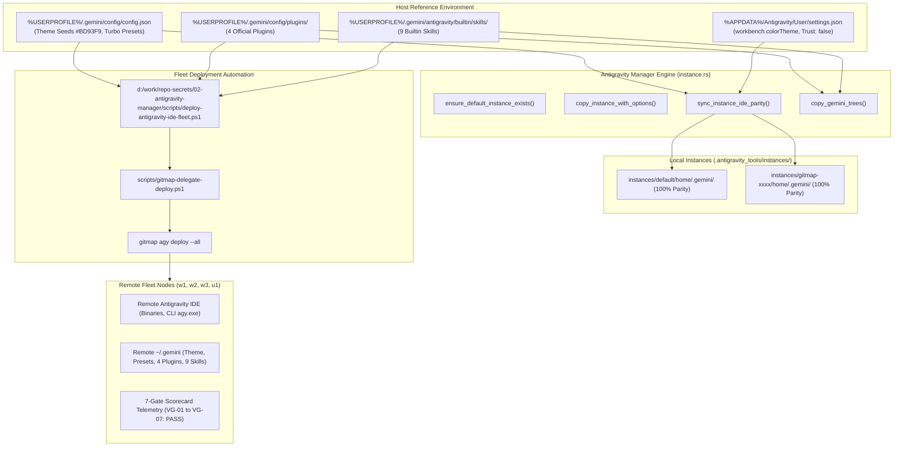

# Architecture Specification: 131-antigravity-ide-full-deploy-fleet-and-gitmap-delegation

## User Request (Verbatim)

```text
Look, so far the projects are there in the Antigravity. I appreciate that, but there is a great issue. The issue is when I go to the Antigravity, I do see you do not apply the same thing. Not this instance, but original, the default instances theme. And also the preset mode is not copied from the default instance. And plugins are not applied, skills are not added. So, so many things are not correct. So write the script, PowerShell additional script in the repo secrets folder properly, additional, and then after you do that, make modifies to the `gitmap` so that we can delegate in the future to `gitmap`, fully deploy the Antigravity IDE to another machine, and it will do it automatically. Do you understand? Is it clear?

# Actionable Items Must Follow Non-Negotiable

1. Write spec under 02-spec/21-app/<slug>/ and enqueue plan task in .ai-memory/plans/<slug>.md (subtasks in .ai-memory/plans/subtasks/<slug>/) first
2. Search codebase exclusively via GitMap (gitmap aum search, gitmap find, gitmap cat, gitmap ps, gitmap py, gitmap llm train); TOTAL BAN on rg, ripgrep, grep, git grep, Select-String
3. Write the PowerShell script in the repo secrets folder properly.
4. Modify `gitmap` to enable future delegation for fully deploying the Antigravity IDE to another machine automatically.

## Must follow and spawn agent using

@[.agents/skills/execute-parent-task-with-n-steps-v6]
```

---

## 1. System Overview & Core Objectives

This specification defines the complete end-to-end architecture for achieving **100% Antigravity IDE Parity** between the default reference instance and all secondary, cloned, or remotely deployed instances across developer machines and remote fleet nodes.

### The 4 Non-Negotiable Pillars of Antigravity IDE Parity:

1. **Pillar 1: Theme Parity**:
   - Original theme seeds stored in host `%USERPROFILE%\.gemini\config\config.json`:
     - `customThemeSeedsDark`:
       - `background`: `"#19191C"`
       - `foregroundOverride`: `"#F8F8F2"`
       - `primary`: `"#BD93F9"` (Dracula Purple theme)
     - `themeMode`: `"THEME_MODE_DARK"`
     - `workbench.colorTheme`: `"Default Dark Modern"` or user theme in `settings.json`.
   - Invariant: Every instance (`instances/default`, `instances/<id>`, or remote machine) must have these exact theme seeds and VS Code workbench settings applied.

2. **Pillar 2: Preset Mode Parity**:
   - Original presets stored in host `%USERPROFILE%\.gemini\config\config.json` and `%USERPROFILE%\.antigravity_tools\security_presets.json`:
     - `userSettings.autoExecutionPolicy`: `"CASCADE_COMMANDS_AUTO_EXECUTION_EAGER"`
     - `userSettings.artifactReviewMode`: `"ARTIFACT_REVIEW_MODE_TURBO"`
     - `userSettings.browserJsExecutionPolicy`: `"BROWSER_JS_EXECUTION_POLICY_TURBO"`
     - `userSettings.nonWorkspaceFileAccessPolicy`: `"AGENT_SETTING_POLICY_ALLOW"`
     - `userSettings.enableTerminalSandbox`: `false`
     - `security.workspace.trust.enabled`: `false`
     - `antigravity.turboMode`: `true`
     - `antigravity.planReviewAlwaysProceed`: `true`
     - `antigravity.autoApprove`: `true`
     - Global permissions: unrestricted terminal, file read/write, URL execution.
   - Invariant: Zero interactive security prompt bottlenecks; fully autonomous Turbo/Eager execution across all instances.

3. **Pillar 3: Plugins Parity**:
   - Official 4 Gemini agent plugins located at `%USERPROFILE%\.gemini\config\plugins\`:
     1. `chrome-devtools-plugin`
     2. `data-agent-kit-plugin`
     3. `google-antigravity-sdk`
     4. `modern-web-guidance-plugin`
   - Invariant: All 4 plugins must be copied to target instance `<gemini_dir>\config\plugins\` and enabled in `<gemini_dir>\config\config.json` (`"plugins": { "<name>": { "enabled": true } }`).

4. **Pillar 4: Skills Parity**:
   - Core 9 builtin skills located at `%USERPROFILE%\.gemini\antigravity\builtin\skills\`:
     1. `agy-customizations`
     2. `antigravity_guide`
     3. `automation`
     4. `generative_ui`
     5. `migrate-workflows`
     6. `permissioned-github`
     7. `plugin`
     8. `ui-extension`
     9. `ui-plugin-navigation`
   - Plus all ~43 plugin skills located inside plugin subdirectories (`data-agent-kit-plugin/skills/`, `chrome-devtools-plugin/skills/`, etc.).
   - Invariant: Every instance must have access to the complete library of skills.

---

## 2. Architectural Boundaries & Data Flow



---

## 3. Remote Delegation Flow via GitMap

1. **CLI Delegation Bridge (`scripts/gitmap-delegate-deploy.ps1`)**:
   - Provides a direct, unified command to delegate deployment to any remote node:
     ```powershell
     powershell scripts/gitmap-delegate-deploy.ps1 -Target w1 -Preset turbo -Theme "Default Dark Modern"
     ```
   - Auto-resolves `deploy-antigravity-ide-fleet.ps1` from `d:\work\repo-secrets\02-antigravity-manager\scripts\` or `scripts/`.
   - Executes connectivity pre-check (`gitmap ssh ping <target>` or ping).
   - Automatically invokes `gitmap cluster run-script <target> <script>` or SSH remote execution.

2. **Native GitMap CLI Parity (`gitmap agy deploy`)**:
   - `D:/work/gitmap/cli/cmdagy/agy_deploy_cmd.go` exposes `gitmap agy deploy <target> --all`.
   - Synchronizes themes, presets, plugins, and skills over SSH.
   - Automatically runs remote filesystem sanitization and restarts background IDE services.

3. **7-Gate Verification Scorecard (`VG-01` to `VG-07`)**:
   - `VG-01`: Theme Parity Gate (`customThemeSeedsDark`, `workbench.colorTheme`).
   - `VG-02`: Preset Mode Gate (`turbo` mode, eager auto-execution, trust bypass).
   - `VG-03`: Plugins Inventory Gate (all 4 official plugins present).
   - `VG-04`: Skills Completeness Gate (all 9 builtin skills present).
   - `VG-05`: Hygiene & Keyring Gate (keyring bypass markers, app storage flags).
   - `VG-06`: Binaries & CLI Gate (`Antigravity.exe` & `agy.exe`).
   - `VG-07`: Instances Readiness Gate (profile structure valid).
