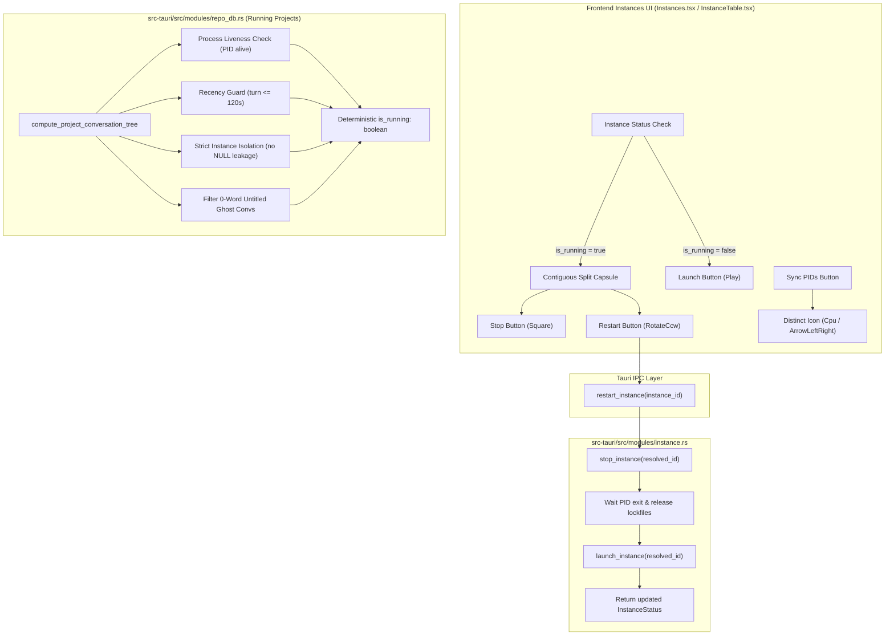

# Architecture Specification: Instance Restart Split Button, Distinct Sync Icons & Running Projects Detection Root-Cause Fix

## 1. Executive Summary & User Requirements Verbatim
The user stated:
> "In the instance section, there should be a button to restart. That means it's going to close and restart on the current account. The same thing should actually happen with the switch button. Oh, switch button is selecting. Okay, keep it as it is. But yeah, there should be one more button, or the current play and the stop button, try to have a split. When it started, try to have a split, and here have another button, restart. And there are a couple of sync buttons, sync icons, feels like restart. Try to have a different sync icon, I believe, that would be making more sense. And also be respectful and try to understand the running projects using the conversation and prompts. It is still buggy. You have to take into account, understand the problems, and then come to the solution. Is it clear?"

### Core Deliverables
1. **Instance Restart Backend IPC & Lifecycle**:
   - Atomic `restart_instance(instance_id: &str)` IPC command.
   - Gracefully terminates running processes (`stop_instance`), monitors PID exit and lock file release (< 1.5s), and launches the instance again with its currently bound account (`launch_instance`).
2. **Frontend Split Play/Stop/Restart Button**:
   - In both Table view and Card view, when an instance is running, the Play/Stop button transitions into a contiguous segmented pill capsule (`rounded-[5px]`, shared border, subtle divider):
     - **Stop segment**: Red-tinted `Square` icon to shut down the instance.
     - **Restart segment**: Amber/cyan-tinted `RotateCcw` icon with tooltip *"Restart Instance on Current Account"*.
   - When the instance is stopped, renders the standard `Play` button.
   - **Switch Button Preservation**: The account switch button remains dedicated to selecting and binding accounts.
3. **Distinct Sync Icons (Anti-Confusion Invariant)**:
   - Audit all sync buttons (e.g. *"Sync PIDs"*, *"Sync PID & Quota"*, *"Sync Profile"*).
   - Circular rotation icons (`RotateCw`, `RefreshCw`) look identical to restart.
   - Replace sync icons with dedicated semantically distinct icons:
     - Process / PID Sync: `Cpu` or `FolderSync`
     - Profile / Settings Sync: `SlidersHorizontal` or `ArrowLeftRight`
     - Reserve `RotateCcw` exclusively for Restart operations.
4. **Running Projects & Prompts Detection Root-Cause Resolution**:
   - Understand why detection was buggy:
     - Bug 1: Default instance contamination (`instance_id IS NULL` or `''` matching orphan projects).
     - Bug 2: 0-word untitled ghost conversations being marked active.
     - Bug 3: Stale `updated_at` timestamps (> 120s) reported as running despite idle state.
     - Bug 4: Decoupling between active IDE process PIDs and database records.
     - Bug 5: Stale `prompt_tree_cache` persisting across modal opens.
   - Comprehensive multi-layer fix in `src-tauri/src/modules/repo_db.rs` and `src/pages/Instances.tsx`.

---

## 2. System Architecture & Data Flow

---

## 3. Non-Negotiable Invariants & Safety Gates
1. **Zero-Guessing Restart Safety**: `restart_instance` MUST never launch before verifying the old PID has completely terminated, preventing port/socket collisions and lockfile corruptions.
2. **Account Preservation**: Restart preserves the bound account and data directory without touching authentication credentials.
3. **Icon Exclusivity**: `RotateCcw` is reserved exclusively for Restart. Sync operations must use `Cpu` or `ArrowLeftRight`.
4. **Running Project Recency**: Conversations with turns older than 120 seconds or empty prompts are strictly reported as `is_running: false`.
