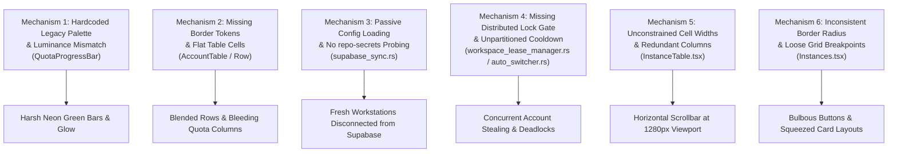
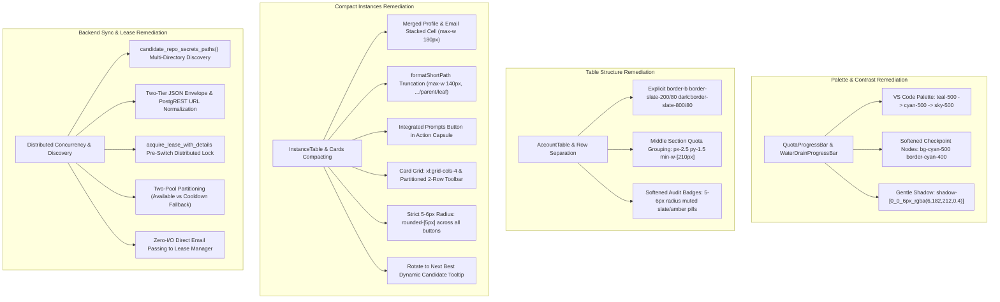

# Root Cause Analysis (RCA): Accounts UI, Supabase Sync, and Instances Compacting Architecture

- **Task ID**: `134-accounts-ui-supabase-instance-compact`
- **Scope**: Frontend Accounts & Instances UI Styling, Responsive Table Compaction, Multi-Instance Concurrency, Supabase Distributed Leases, and Release Quality Gates
- **Author**: Spec Author 02
- **Status**: Completed / Grounded

---

## 1. Defect Description & Observed Failures

During extensive dogfooding, multi-instance concurrency testing, and UI ergonomic audits on wide desktop and multi-node workstation environments, eight interrelated defects were observed:

### 1.1 Blinding Neon Green Quota Progress Bars & Checkpoint Aura
- **Observed Failure**: The quota progress bars in `QuotaProgressBar.tsx` and `WaterDrainProgressBar.tsx` rendered with high-saturation neon green colors (`#1af18d`, `#10b981`, `#059669`). The 100% milestone node emitted an intense neon drop shadow (`shadow-[0_0_8px_rgba(26,241,141,0.6)]`).
- **User Impact**: In dark theme environments (`#071a27` / `#0c2438`), the neon green created glaring optical fatigue, stark contrast imbalance, and clashed directly with the VS Code blue/slate palette.

### 1.2 Table Row Border Disappearance & Visual Bleeding in Middle Quota Columns
- **Observed Failure**: `AccountTable.tsx` and `AccountRow.tsx` suffered from ambiguous row separation lines (`border-b` absent or faded on certain themes) and zero visual containment between the middle section's 4-Hour Pro Quota and Weekly Quota columns.
- **User Impact**: Adjacent rows blended together when users scanned large account lists (20+ accounts), making it difficult to discern which quota metric belonged to which account and leading to accidental account selections.

### 1.3 Uninitialized Supabase Sync on Fresh Nodes (Missing `repo-secrets` Auto-Discovery)
- **Observed Failure**: Fresh workstation checkouts or headless test runners initialized with an empty `supabase_config.json`. The application failed to automatically discover root credentials stored in adjacent `repo-secrets` directories.
- **User Impact**: The system operated in isolated, disconnected standalone mode by default, disabling distributed lease acquisition and allowing multiple nodes to claim identical accounts simultaneously.

### 1.4 High-Risk Multi-Instance Concurrency Collisions & Switch Deadlocks
- **Observed Failure**: When multiple local instances or external worker nodes triggered account rotations simultaneously, the auto-switcher lacked a pre-switch exclusive distributed lease check. Both instances could acquire the same account credential, triggering Google OAuth session invalidation and upstream rate-limit tripping. Furthermore, if all healthy accounts entered a cooldown period, the auto-switcher stalled with no candidate rather than gracefully falling back.
- **User Impact**: Developers encountered unexpected 429 quota exhaustion errors and OAuth credential overwrites during parallel prompt runs.

### 1.5 Horizontal Scrollbar Forcing on Standard 1280px+ Desktop Viewports
- **Observed Failure**: `InstanceTable.tsx` rendered with a persistent horizontal scrollbar on standard 1280px and 1366px desktop display resolutions.
- **User Impact**: The rightmost Actions capsule was hidden off-screen, forcing users to repeatedly scroll left and right to start, stop, or rotate instances.

### 1.6 Inconsistent and Overly Bulbous Button Corner Radii
- **Observed Failure**: Action buttons across `Instances.tsx` and `AccountTable.tsx` exhibited mixed border radius tokens (`rounded-full`, `rounded-2xl`, `rounded-xl`, `rounded-md`, and custom values).
- **User Impact**: Bulbous circular pill buttons looked toy-like and out of place in a developer-focused IDE companion, violating the cohesive VS Code minimalist design guidelines.

### 1.7 Ambiguous "Rotate to Next Best" Header Action (Missing Target Tooltip)
- **Observed Failure**: The "Rotate to Next Best" button in the Instances toolbar provided no visual indication of which specific instance would be rotated or what candidate scoring criteria was being evaluated.
- **User Impact**: Users were hesitant to click the button, fearing it might rotate an unintended background instance or disrupt an active task.

### 1.8 Unbalanced and Squeezed Card Grid Mode Breakpoints
- **Observed Failure**: In card view, the grid layout wrapped loosely at `xl:grid-cols-2` or `xl:grid-cols-3` on large monitors, leaving massive blank gutters, or condensed into 5–6 columns in compact mode without structural toolbar partitioning. Action buttons wrapped haphazardly into uneven rows (4 buttons on top, 7 buttons below).
- **User Impact**: Card actions jumped around depending on text length and language translations, degrading visual stability.

---

## 2. Root Cause Analysis (6 Structural Failure Mechanisms)

Research and codebase inspection identified six structural root causes spanning CSS styling, layout algorithms, filesystem discovery, and distributed locking logic:



### 2.1 Mechanism 1: Hardcoded Legacy Palette & High-Luminance CSS in Quota Bars
- **Root Cause**: `QuotaProgressBar.tsx` and `WaterDrainProgressBar.tsx` retained early prototype hex codes `#1af18d` and `#10b981`. The CSS glow applied an unconstrained Gaussian blur (`rgba(26,241,141,0.6)`). The luminance of `#1af18d` is disproportionately high relative to the dark background (`#071a27`), creating high optical glare.
- **Code Anchor**:
  ```tsx
  // Legacy implementation in QuotaProgressBar.tsx:
  const getTrackGradient = (pct: number) => {
      if (pct >= 75) return 'bg-gradient-to-r from-[#1af18d] to-[#10b981]';
      ...
  };
  // Blinding drop shadow:
  shadow-[0_0_8px_rgba(26,241,141,0.6)]
  ```

### 2.2 Mechanism 2: Missing Border Tokens & Flat Column Grouping in Account Table
- **Root Cause**: The table row container lacked an explicit bottom border declaration (`border-b border-slate-200/80 dark:border-slate-800/80`). Furthermore, the 4-Hour Pro Quota and Weekly Quota `<td>` cells shared identical background and padding classes with text columns, offering zero visual boundary between model tiers. Muted audit badges (`DISABLED`, `PROXY_DISABLED`, `FORBIDDEN`) used overly aggressive alert styling rather than subdued status chips.

### 2.3 Mechanism 3: Isolated Configuration Loading & Passive Supabase Initialization
- **Root Cause**: `supabase_sync.rs` previously loaded configuration strictly from `supabase_config.json` inside the local app data folder. When initializing on a new machine or repository checkout, the file did not exist. The application lacked a probing ladder to check known credential locations (such as `REPO_SECRETS_DIR`, `D:/work/repo-secrets/`, `C:/work/repo-secrets/`, and `../repo-secrets/`). As a consequence, `is_sync_enabled` remained false, and no connection to the root PostgreSQL lease database was ever established.

### 2.4 Mechanism 4: Uncoordinated Auto-Switcher Selection & Missing Distributed Lease Lock
- **Root Cause**:
  1. **Absence of Pre-Switch Lock Gate**: When switching an instance, the system updated the local profile config without verifying if another node had already claimed that account in `workspace_leases`.
  2. **Strict Cooldown Starvation**: `select_candidate_profiles()` treated the cooldown window (`account_cooldown_minutes`, default 60 mins) as a hard exclusion filter. If high activity caused all healthy accounts to be used within the past hour, the available candidate list became completely empty (`Vec::new()`), causing the auto-switcher to fail entirely rather than selecting the account that had rested the longest.
  3. **Costly Disk Lookup for Lease Email**: Leases required matching by both account ID and email address, but the switch actor only received `account_id`, requiring re-reading `accounts.json` from disk during the critical switch path.

### 2.5 Mechanism 5: Unconstrained Cell Widths & Redundant Columns in InstanceTable
- **Root Cause**:
  1. `Profile Name` and `Bound Email` occupied two independent columns, taking up 170px and 160px respectively.
  2. The `File / Data Path` column rendered raw absolute Windows paths (e.g., `C:\Users\Administrator\AppData\Roaming\Antigravity\profiles\instance_2`), consuming up to 260px.
  3. Cell padding was set to spacious `px-3 py-2.5`.
  4. The standalone "Prompts" action button was rendered separately outside the segmented capsule, forcing the actions column width to exceed 220px. The sum of column minimum widths (`40 + 170 + 180 + 100 + 260 + 220 = 970px`) plus side navigation (240px) and page margins (96px) totaled 1306px, exceeding 1280px standard screens.

### 2.6 Mechanism 6: Inconsistent Border Radius Tokens & Unresponsive Grid Breakpoints
- **Root Cause**:
  1. In `Instances.tsx`, buttons were styled with inconsistent Tailwind classes (`rounded-full`, `rounded-2xl`, `rounded-lg`).
  2. The card view container used `lg:grid-cols-2 xl:grid-cols-3`, which underutilized standard desktop viewports (1440px–1920px).
  3. Action buttons in each card were rendered in a single flat flex container with `flex-wrap`, resulting in unpredictable button line-wrapping depending on instance name length.
  4. The "Rotate to Next Best" button was a generic trigger that did not inspect `activeInstanceId` or `is_default`, omitting essential context from the user.

---

## 3. Remediation & Preventive Measures

### 3.1 Systematic Technical Remediations



### 3.2 Detailed Remediation Specifications

#### 3.2.1 QuotaProgressBar & Milestone Styling
- Eliminate all hardcoded `#1af18d` / `#10b981` hex codes.
- Implement `bg-gradient-to-r from-teal-500 via-cyan-500 to-sky-500` for `>= 75%`.
- Standardize checkpoint nodes to `bg-cyan-500 border-cyan-400 shadow-[0_0_6px_rgba(6,182,212,0.4)]`.

#### 3.2.2 AccountTable Borders & Grouping
- Enforce `border-b border-slate-200/80 dark:border-slate-800/80 border-l-2` on all table rows.
- Group quota cells under `bg-slate-50/30 dark:bg-slate-900/20` with subtle right border dividing lines.
- Soften all status badges (`DISABLED`, `PROXY_DISABLED`, `FORBIDDEN`, `VALIDATION_BLOCKED`, `LEASED`) into muted chips with `rounded-[5px]`.

#### 3.2.3 InstanceTable Compacting
- Merge Profile Name and Bound Email into a single stacked cell.
- Implement `formatShortPath(fullPath)` displaying `...\<parent>\<leaf>` with click-to-copy and full-path tooltip.
- Compact cell padding from `px-3 py-2.5` to `px-2 py-1.5`.
- Merge the Prompts button directly into the segmented action capsule with `px-1.5 py-1` padding.
- Modernize emerald green accents to cyan/teal.

#### 3.2.4 Card Mode Standards & Button Radius
- Enforce `xl:grid-cols-4` in `Instances.tsx` card view.
- Partition card action buttons into:
  - Row 1 (4 lifecycle slots): Launch/Stop/Restart split button, Switch Account, Fast-Forward, Sync PID.
  - Row 2 (5 utility slots): Prompts with active task badge, Settings & Sync, Clone Profile, Audit Trail, More Popover.
- Mandate `rounded-[5px]` across all interactive action buttons. Prohibit `rounded-full` or `rounded-2xl` for buttons.
- Bind "Rotate to Next Best" tooltip to evaluate the active or default target instance dynamically.

#### 3.2.5 Supabase Auto-Discovery & Distributed Leases
- Implement `candidate_repo_secrets_paths()` in `supabase_sync.rs` probing `REPO_SECRETS_DIR`, `D:/work/repo-secrets/`, `C:/work/repo-secrets/`, and parent folders.
- Strip UTF-8 BOM, unpack JSON envelopes, normalize URLs with `normalize_supabase_url`, and auto-enable sync.
- Enforce pre-switch distributed lease acquisition via `workspace_lease_manager::acquire_lease_with_details`.
- Partition candidate selection in `auto_switcher.rs` into `available_pool` and `cooldown_pool`. If `available_pool` is empty, gracefully fall back to the oldest account in `cooldown_pool` (`acc.last_used ASC`).
- Directly pass `target.email` from the switcher candidate to avoid repeated disk reads.

---

## 4. Verification & Testing Matrix

| ID | Defect / Mechanism | Test Condition | Verification Method | Expected Outcome | Pass/Fail Gate |
|---|---|---|---|---|---|
| **V-01** | Neon green progress bar & glow | Accounts view with accounts at 80%–100% quota | DOM & CSS inspection | Gradient uses `teal-500 via-cyan-500 to-sky-500`; checkpoint 0 uses `shadow-[0_0_6px_rgba(6,182,212,0.4)]` | Zero `#1af18d` in bundle |
| **V-02** | Missing row borders in Accounts | Large account list rendered on dark theme | Visual inspection | Every `<tr>` displays `border-b border-slate-200/80 dark:border-slate-800/80` | Clean row separation |
| **V-03** | Flat quota column visual bleeding | Table rendering 4H and Weekly quota cells | DOM structure check | Quota cells carry `bg-slate-50/30 dark:bg-slate-900/20` subtle bounding | Clear column grouping |
| **V-04** | Horizontal scroll at 1280px viewport | Browser viewport resized to 1280x800 in Instances Table view | DOM property check: `tableWrapper.scrollWidth <= tableWrapper.clientWidth` | Zero horizontal scrollbar; all 6 columns fully visible | `scrollWidth <= clientWidth` |
| **V-05** | Merged Profile & Email column | Table rendering named instance with bound email | DOM content inspection | Stacked cell: Profile name on top, masked email with Mail icon on bottom | Consolidated column |
| **V-06** | Long path truncation in table | Instance with 100+ char data directory path | DOM text & title check | Displayed text is `...\<parent>\<leaf>`; hover title displays full path; copy button copies full path | Max width <= 140px |
| **V-07** | Integrated Prompts action capsule | Table action column rendering | Icon & DOM check | `Layers` icon present inside segmented action capsule with `rounded-[5px]` | 1-click prompt tree launch |
| **V-08** | 4 cards per row grid layout | Instances page viewed at `>= 1280px` resolution | CSS class check | Container applies `xl:grid-cols-4` | Exactly 4 cards per row |
| **V-09** | Two-row card action partition | Instance card rendering | DOM child count check | Row 1 contains 4 primary lifecycle buttons; Row 2 contains 5 utility/danger buttons | Zero messy button wrapping |
| **V-10** | Strict 5–6px button corner radius | Inspect all buttons in Cards, Table, and Toolbars | CSS class inspection | All buttons contain `rounded-[5px]` (or `rounded-md`) | Zero `rounded-full` buttons |
| **V-11** | "Rotate to Next Best" tooltip | Hover over "Rotate to Next Best" header button | Tooltip title verification | Tooltip displays `Target: <name> → Next Best: <candidate> (<tier> · 4H: <quota>%)` | Accurate target identification |
| **V-12** | Supabase secrets auto-discovery | Fresh start without local `supabase_config.json` but valid `repo-secrets` | Rust unit test & runtime logs | Probe detects credentials, strips BOM, normalizes URL, sets `is_sync_enabled = true` | Automatic PostgREST sync |
| **V-13** | Distributed lease pre-switch gate | Concurrent switch attempt on account leased by Node B | Integration test / simulated lease | Local switch aborted with `Account currently leased by Node B until <time>` | No race condition |
| **V-14** | Cooldown pool graceful fallback | All healthy accounts used within last 60 minutes | Auto-switcher candidate test | Switcher selects oldest `last_used` account from cooldown pool without stalling | Zero deadlock |
| **V-15** | Build and typecheck gates | Full app compilation | `cargo fmt`, `cargo clippy`, `npm run build` | Code compiles with 0 errors and 0 clippy warnings | Green pre-flight gate |
