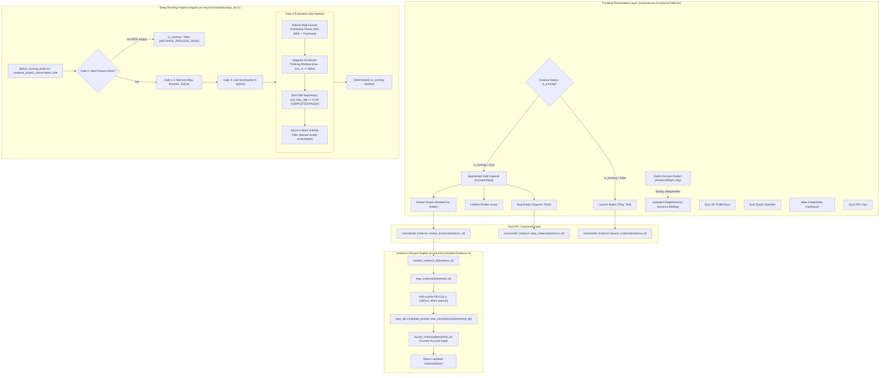

# Architecture Specification: Instance Restart Split Button, Distinct Sync Icons & Running Projects Detection Deep Fix

- **Module**: `instance-lifecycle` / `repo-db-prompts` / `instances-ui`
- **Spec ID**: `02-spec/21-app/135-instance-restart-button-sync-icons-and-running-projects-fix/01-architecture-spec.md`
- **Status**: Approved / Canonical
- **Parent Task**: `135-instance-restart-button-sync-icons-and-running-projects-fix`

---

## 1. Executive Summary & User Requirements Verbatim

### 1.1 User Requirements Verbatim
The user specified:
> "In the instance section, there should be a button to restart. That means it's going to close and restart on the current account. The same thing should actually happen with the switch button. Oh, switch button is selecting. Okay, keep it as it is. But yeah, there should be one more button, or the current play and the stop button, try to have a split. When it started, try to have a split, and here have another button, restart. And there are a couple of sync buttons, sync icons, feels like restart. Try to have a different sync icon, I believe, that would be making more sense. And also be respectful and try to understand the running projects using the conversation and prompts. It is still buggy. You have to take into account, understand the problems, and then come to the solution. Is it clear?"

### 1.2 Architectural Mandate & Problem Breakdown
This requirement addresses three interconnected areas across the Antigravity-Manager ecosystem:

1. **Instance Process Lifecycle & Restart**:
   - An instance currently running must be restartable directly with a single click.
   - Restarting means: gracefully closing all child processes, polling for OS process termination and lock release (<1,500ms), invalidating stale prompt tree caches, and relaunching the instance profile on its **currently bound account** without altering credentials or settings.
   - The UI must render this as a contiguous segmented split pill capsule (`[Stop | Restart]`) when the instance is running, and return to a standard single `Play` button when stopped.
   - The account switch button must be strictly preserved as an account selector (`setSwitchTargetInstance`), never overloaded with process restart.

2. **Sync Icons Disambiguation (Anti-Confusion Invariant)**:
   - Users perceive circular rotating arrow icons (`RotateCw`, `RefreshCw`, `RotateCcw`) as universal symbols for "Restart" or "Reload".
   - When metadata synchronization actions (such as *"Sync All"*, *"Eval Quota"*, *"Sync PID & Quota"*, or *"Wipe Credentials"*) use circular arrows, users mistakenly believe the application is restarting their active IDE instances.
   - We must establish a strict semantic icon boundary:
     - `RotateCcw` is **exclusively reserved** for Restart operations.
     - "Sync All" uses `FolderSync`.
     - "Eval Quota" uses `Sparkles`.
     - "Sync PID & Quota" uses `Cpu`.
     - "Wipe Credentials" uses `KeyRound`.
     - Account switching uses `ArrowLeftRight`.

3. **Running Projects & Prompts Deep Detection**:
   - Running project detection has suffered from recurring edge-case bugs:
     - **False positives on dead processes**: Crashed or externally killed instances continued to show green running indicators because SQLite records were not gated on OS process liveness.
     - **False negatives during model thinking (>60s)**: Advanced reasoning models (OpenAI o1/o3-mini, Claude 3.7 Thinking, Gemini 2.5 Flash Thinking) take 2 to 8 minutes generating thought chains without updating SQLite `last_modified_time`. A rigid 60s or 120s TTL prematurely flips active reasoning tasks to `IDLE`.
     - **Fragile timestamp parsing**: Fractional timestamps (e.g. `2026-10-05 06:49:18.492104` or `2026-10-05T06:49:18.123Z`) failed naive string parsing, defaulting timestamp to 0 and dropping running status.
     - **Ghost 0-word untitled conversations**: Empty scratchpad sessions created automatically by the IDE were evaluated as active running projects.
     - **Cross-instance suffix bleed**: Ambiguous suffix comparisons (e.g. `instConfig.id.endsWith(node.instance_id)`) caused projects to bleed into sibling instances sharing suffix numbers.
     - **Zombie running flags on startup**: Prior crash states left `is_running = 1` rows in `running_projects` without startup clearing.

---

## 2. High-Level System Architecture



---

## 3. Subsystem Specifications

### 3.1 Instance Process Lifecycle: Atomic Restart
The restart operation encapsulates complete process teardown and initialization while preserving configuration continuity.

#### Lifecycle Protocol:
1. **Target Resolution**: Normalizes aliases (`default`, `__default__`, `copy-8159`, `8159`) through `resolve_instance_id`.
2. **Graceful Teardown**: Calls `stop_instance(&resolved_id)`, issuing platform-specific termination signals to the Antigravity IDE and all child worker processes.
3. **PID Polling & Lock Clearance**: Actively polls `find_pids_for_data_dir(&config.data_dir, is_default)` for up to 1,500ms at 80ms intervals:
   - Verifies all Electron, Antigravity, and helper processes have exited.
   - Ensures SQLite `.vscdb-wal`, `.db-wal`, and singleton `.lock` files are released by the operating system.
4. **Cache Invalidation**: Invokes `crate::modules::repo_db::invalidate_prompt_tree_cache(Some(&resolved_id))`, evicting stale serialized trees so the next UI fetch accurately reflects restarted state.
5. **Relaunch on Bound Account**: Invokes `launch_instance(&resolved_id)`. The instance boots with its existing workspace storage, environment variables, proxy settings, and bound Google account.
6. **Status Return**: Fetches updated `InstanceStatus` from `list_instances()` and returns it across Tauri IPC to update the UI without full page refresh.

### 3.2 UI Segmented Split Button Capsule
In both Table mode ([`InstanceTable.tsx`](file:///d:/work/Antigravity-Manager/src/components/instances/InstanceTable.tsx)) and Card mode ([`Instances.tsx`](file:///d:/work/Antigravity-Manager/src/pages/Instances.tsx)):

- **When Instance is Running (`inst.is_running === true`)**:
  - Replaces the solitary Stop button with a unified contiguous pill capsule:
    - Outer container: `inline-flex items-center rounded-l-[5px] overflow-hidden bg-white dark:bg-[#071a27] border-r border-slate-300 dark:border-slate-700/80`
    - Left button (Stop): Rose-tinted `Square` icon (`w-3 h-3`), tooltip *"Stop Instance"*. Shows `RotateCw` spinner when `currentAction === 'stop'`.
    - Hairline divider: `w-px h-3.5 bg-slate-300 dark:bg-slate-700/80 my-auto`
    - Right button (Restart): Amber-tinted `RotateCcw` icon (`w-3 h-3`), tooltip *"Restart Instance on Current Account"*. Shows `RotateCw` spinner when `currentAction === 'restart'`.
- **When Instance is Stopped (`inst.is_running === false`)**:
  - Renders the standard standalone `Play` button (teal-tinted, `rounded-l-[5px]`), tooltip *"Launch Instance"*.
- **Action Label Synchronization**:
  - In `Instances.tsx`, `getActionLabel` maps `'restart'` to `'Restarting...'` ensuring clear progress feedback in the UI toast and status pills.

### 3.3 Switch Button Invariant (Decoupled Account Selection)
- The account switch button (`onSwitch` / `setSwitchTargetInstance`) is an **independent configuration action**.
- It is visually rendered alongside the lifecycle capsule using `ArrowLeftRight` icon (sky blue styling).
- Clicking switch opens the account selection modal; it NEVER triggers an immediate process shutdown or restart.

### 3.4 Semantic Sync Icons Disambiguation
Circular rotating arrows (`RotateCw` / `RotateCcw`) mimic system restart. We enforce strict icon assignments across all toolbars and menus:

| Target Button / Context | Old Confusing Icon | New Semantic Icon | Purpose |
|---|---|---|---|
| **Instance Restart** | N/A | `RotateCcw` | **Exclusively reserved for Restart** |
| **Sync All (Toolbar)** | `RotateCw` | `FolderSync` | Synchronize workspaces, PIDs & quotas across all instances |
| **Eval Quota (Toolbar)** | `RotateCw` | `Sparkles` | Trigger intelligent quota evaluation & auto-rotation |
| **Sync PID & Quota (Row/Dropdown)** | `RotateCw` / `RefreshCw` | `Cpu` | Read OS process table and update instance PID & credit cache |
| **Wipe Credentials (Dropdown)** | `RotateCcw` | `KeyRound` | Purge session tokens & stored credentials from profile |
| **Account Switch** | `ArrowLeftRight` | `ArrowLeftRight` | Select and bind account to instance profile |
| **Settings & Sync** | `SlidersHorizontal` | `SlidersHorizontal` | Configure profile options and workspace sync |

### 3.5 Deep Running Projects Detection Architecture

The detection engine in [`src-tauri/src/modules/repo_db.rs`](file:///d:/work/Antigravity-Manager/src-tauri/src/modules/repo_db.rs) follows a 5-gate pipeline:

```
[Candidate Query]
       │
       ▼
[Gate 0: Host Process Liveness] ──► (Dead PID? ──► Return false & log INSTANCE_PROCESS_DEAD)
       │ (Process Alive)
       ▼
[Terminal State Check] ──────────► (Status is completed/failed? ──► Return false)
       │ (Non-terminal)
       ▼
[Gate 1: In-Memory Prompts Map] ─► (Active prompt <= 120s? ──► Return true)
       │ (Not matched)
       ▼
[Gate 2: Active AGY Workers] ────► (Worker PID alive & path matched? ──► Return true)
       │ (Not matched)
       ▼
[Gate 3: SQLite active_prompts] ──► (Status running & age <= 120s? ──► Return true)
       │ (Not matched)
       ▼
[Gate 4: Live Summaries DB]
       ├─► 1. Multi-Format ISO-8601 Timestamp Parser
       ├─► 2. Adaptive 10-Minute Thinking Window (now - turn_ts <= 600s)
       ├─► 3. Strict Idle Supremacy (not_fully_idle == 0 OR IDLE/COMPLETED/FAILED)
       ├─► 4. Ghost 0-Word Untitled Conversation Filter
       └─► 5. Path Prefix & Workspace Association
```

#### Key Architectural Gates:
1. **Gate 0: Host Process PID Liveness Gate**:
   - Before evaluating prompts or SQLite records, verify that the host instance has at least one active process running (`find_pids_for_data_dir`).
   - If the process is dead, immediately short-circuit to `is_running: false` and emit audit log `INSTANCE_PROCESS_DEAD`.
2. **Adaptive 10-Minute Thinking Window**:
   - Reasoning models take multiple minutes generating deep reasoning chains.
   - Replace rigid 60s cutoffs in Gate 4 and `compute_project_conversation_tree` with an adaptive **10-minute (600s)** window for active turns (`not_fully_idle > 0` and status `RUNNING`).
3. **Robust Multi-Format Timestamp Parser**:
   - Parse timestamps with fractional seconds and RFC 3339 formats without fallback to 0:
     - `%Y-%m-%dT%H:%M:%S%.fZ`
     - `%Y-%m-%dT%H:%M:%S%.f%:z`
     - `%Y-%m-%d %H:%M:%S%.f`
     - `%Y-%m-%d %H:%M:%S`
     - Numeric Unix epoch timestamp string
4. **Ghost 0-Word Filter Synchronization**:
   - Filter out blank scratchpad sessions (`title` empty/untitled AND prompt words == 0) from running evaluations.
5. **Strict Instance Scoping (No Suffix Bleed)**:
   - In frontend `isNodeOwnedByInstance`, replace loose `endsWith` checks with exact match (`node.instance_id === instConfig.id`) and boundary-enforced checks (`default` vs named instances).
6. **Startup Zombie Flag Reset**:
   - In `purge_corrupted_running_projects`, run `UPDATE running_projects SET is_running = 0` and `DELETE FROM prompt_tree_cache` upon application boot to eliminate ghost records from previous crashes.

---

## 4. Non-Negotiable System Invariants

1. **Zero-Collision Restart Safety**: `restart_instance` MUST never launch an instance before verifying the old PID has completely exited and file locks have been freed.
2. **Account Continuity**: Restarting an instance MUST preserve the currently bound Google account, quota cache, and proxy configurations.
3. **Icon Exclusivity**: `RotateCcw` is strictly reserved for Restart. Sync and maintenance operations must use semantic domain icons (`FolderSync`, `Sparkles`, `Cpu`, `KeyRound`).
4. **Strict Idle Supremacy**: If a conversation summary has `not_fully_idle == 0` or a terminal status (`IDLE`, `COMPLETED`, `FAILED`, `CANCELLED`), it MUST NEVER be reported as running, regardless of turn recency.
5. **Thinking Model Protection**: Active turns under reasoning models must remain classified as running for up to 600s (10 minutes) as long as the host process PID is verified alive.
6. **Zero Cross-Instance Bleed**: Instance identification must never use loose substring or un-hyphenated suffix comparisons that allow projects from instance `A` to appear under instance `B`.

---

## 5. Architectural File & Component Mapping

| Subsystem | File Path | Primary Responsibilities |
|---|---|---|
| **Backend Restart** | [`src-tauri/src/modules/instance.rs`](file:///d:/work/Antigravity-Manager/src-tauri/src/modules/instance.rs) | `restart_instance` lifecycle, PID polling loop, cache invalidation |
| **Tauri Commands** | [`src-tauri/src/commands/instance.rs`](file:///d:/work/Antigravity-Manager/src-tauri/src/commands/instance.rs) | `restart_instance` IPC handler, parameter validation |
| **Tauri Dispatch** | [`src-tauri/src/lib.rs`](file:///d:/work/Antigravity-Manager/src-tauri/src/lib.rs) | Command registration in Tauri invoke handler |
| **Detection Engine** | [`src-tauri/src/modules/repo_db.rs`](file:///d:/work/Antigravity-Manager/src-tauri/src/modules/repo_db.rs) | Gate 0 liveness, 10-minute thinking window, timestamp parser, zombie purge |
| **Frontend Table** | [`src/components/instances/InstanceTable.tsx`](file:///d:/work/Antigravity-Manager/src/components/instances/InstanceTable.tsx) | Split button capsule `[Stop \| Restart]`, `Cpu` sync icon, switch button |
| **Frontend Cards** | [`src/pages/Instances.tsx`](file:///d:/work/Antigravity-Manager/src/pages/Instances.tsx) | Card split capsule, `FolderSync` / `Sparkles` / `KeyRound` icons, `'restarting...'` label |
| **Service Layer** | [`src/services/instanceService.ts`](file:///d:/work/Antigravity-Manager/src/services/instanceService.ts) | `restartInstance` client wrapper with Tauri IPC and REST fallback |
