# Architecture Specification: Instance Restart Split Button, Distinct Sync Icons & Running Projects Detection Deep Fix

- **Module**: `instance-lifecycle` / `repo-db-prompts` / `instances-ui`
- **Spec ID**: `02-spec/21-app/135-instance-restart-button-sync-icons-and-running-projects-fix/01-architecture-spec.md`
- **Status**: Approved / Canonical
- **Parent Task**: `135-instance-restart-button-sync-icons-and-running-projects-fix`

---

## 1. Executive Summary & User Requirements Verbatim

### 1.1 User Requirements Verbatim
The user specified:
> "In the instance section, there should be a button to restart. That means it's going to close and restart on the current account. The same thing should actually happen with the switch button. Oh, switch button is selecting. Okay, keep it as it is. But yeah, there should be one more button, or the current play and the stop button, try to have a split. When it started, try to have a split, and here have another button, restart. And there are a couple of sync buttons, sync icons, feels like restart. Try to have a different sync icon, I believe, that would be making more sense. And also be respectful and try to understand the running projects using the conversation and prompts. It is still buggy. You have to take into account, understand the problems, and then come to the solution. Is it clear?"

### 1.2 Architectural Mandate & Problem Breakdown
This requirement addresses three core subsystems across the Antigravity-Manager ecosystem:

1. **Instance Process Lifecycle & Atomic Restart**:
   - Provide a dedicated, single-click restart flow for running instances.
   - Restarting means: gracefully closing all child processes, polling for OS process termination and SQLite lock release (<1,500ms), invalidating stale prompt tree caches, and relaunching the instance profile on its **currently bound account** without altering credentials or settings.
   - The UI must render this as a contiguous segmented split pill capsule (`[Stop | Restart]`) when the instance is running, and return to a standard single `Play` button when stopped.
   - The account switch button must be strictly preserved as an account selector (`setSwitchTargetInstance`), never overloaded with process restart.

2. **Sync Icons Disambiguation (Anti-Confusion Invariant)**:
   - Users perceive circular rotating arrow icons (`RotateCw`, `RefreshCw`, `RotateCcw`) as universal symbols for "Restart" or "Reload".
   - When metadata synchronization actions (such as *"Sync All"*, *"Eval Quota"*, *"Sync PID & Quota"*, or *"Wipe Credentials"*) use circular arrows, users mistakenly believe the application is restarting their active IDE instances.
   - We establish a strict semantic icon boundary:
     - `RotateCcw` is **exclusively reserved** for Restart operations.
     - "Sync All" uses `FolderSync`.
     - "Eval Quota" uses `Sparkles`.
     - "Sync PID & Quota" uses `Cpu`.
     - "Wipe Credentials" uses `KeyRound`.
     - Account switching uses `ArrowLeftRight`.

3. **Running Projects & Prompts Deep Detection Engine**:
   - Running project detection has suffered from deep systemic edge cases identified in Research 01:
     - **Host vs. Sandbox Directory Masking**: When AGM or an agent runs inside a sandboxed environment (e.g. `.antigravity_tools/instances/<id>/home`), `dirs::home_dir()` returns the sandbox home rather than the user's host profile (`C:\Users\Administrator`). Consequently, `.gemini/antigravity` fails to discover host conversations.
     - **Default Instance Directory Dualism**: The `default` instance can maintain data in either the host user directory (`~/.gemini/`) or in the instance-managed sandbox (`instances/default/home/.gemini/`). Missing either location leads to dropped projects.
     - **Non-Disjoint Tagging Bleed**: When `gemini_dirs_tagged` scans candidate paths, secondary instance sandboxes could be mistakenly tagged as `default`, causing cross-instance conversation bleed.
     - **Target Matching Granularity Gap in Gate 4**: `conversation_summaries.db` contains workspace URIs (`file:///d:/work/Antigravity-Manager`). Comparing strictly `clean_p == clean_target` fails when `clean_target` is a folder name (`antigravity-manager`) or composite key (`antigravity-manager-a1b2c3d4__default`).
     - **False positives on dead processes**: Crashed or externally killed instances continued to show green running indicators because SQLite records were not gated on OS process liveness.
     - **False negatives during model thinking (>60s)**: Reasoning models (o1/o3-mini, Claude 3.7 Thinking, Gemini 2.5 Flash Thinking) take 2 to 8 minutes generating thought chains without writing to SQLite. A rigid 60s or 120s TTL prematurely flips active reasoning tasks to `IDLE`.
     - **Fragile timestamp parsing**: Fractional timestamps failed naive string parsing, defaulting timestamp to 0 and dropping running status.
     - **Ghost 0-word untitled conversations**: Empty scratchpad sessions created automatically by the IDE were evaluated as active running projects.
     - **Zombie running flags on startup**: Prior crash states left `is_running = 1` rows in `running_projects` without startup clearing.

---

## 2. High-Level System Architecture

```mermaid
flowchart TD
    subgraph UI ["Frontend Presentation Layer (Instances.tsx & InstanceTable.tsx)"]
        StatusCheck{"Instance Status: is_running?"}
        StatusCheck -- "is_running = true" --> SplitCapsule["Segmented Split Capsule [rounded-l-[5px]]"]
        SplitCapsule --> StopBtn["Stop Button (Square, Rose)"]
        SplitCapsule --> Divider["Hairline Divider (w-px)"]
        SplitCapsule --> RestartBtn["Restart Button (RotateCcw, Amber)"]
        StatusCheck -- "is_running = false" --> LaunchBtn["Launch Button (Play, Teal)"]
        
        SwitchBtn["Switch Account Button (ArrowLeftRight, Sky)"]
        SwitchBtn -. "Strictly Decoupled" .-> AcctModal["setSwitchTargetInstance (Account Binding Modal)"]
        
        SyncAll["Sync All: FolderSync"]
        EvalQuota["Eval Quota: Sparkles"]
        WipeCreds["Wipe Credentials: KeyRound"]
        SyncPid["Sync PID: Cpu"]
    end

    subgraph IPC ["Tauri IPC Command Layer"]
        RestartBtn --> CmdRestart["commands::instance::restart_instance(instance_id)"]
        StopBtn --> CmdStop["commands::instance::stop_instance(instance_id)"]
        LaunchBtn --> CmdLaunch["commands::instance::launch_instance(instance_id)"]
    end

    subgraph Backend ["Instance Lifecycle Engine (src-tauri/src/modules/instance.rs)"]
        CmdRestart --> ResolveID["resolve_instance_id(instance_id)"]
        ResolveID --> TerminateProc["stop_instance(&resolved_id)"]
        TerminateProc --> PollExit["Poll sysinfo PID Exit (< 1500ms, 80ms interval)"]
        PollExit --> InvalidateTree["repo_db::invalidate_prompt_tree_cache(Some(&resolved_id))"]
        InvalidateTree --> RelaunchProc["launch_instance(&resolved_id) [Current Account Kept]"]
        RelaunchProc --> RetStatus["Return updated InstanceStatus"]
    end

    subgraph DirectoryDiscovery ["Host & Sandbox Directory Discovery Engine"]
        HostHome["get_canonical_host_home()"]
        HostHome --> EscapeSandbox["Escape .antigravity_tools/instances/<id>/home"]
        EscapeSandbox --> HostDefault["Host ~/.gemini/{antigravity, antigravity-ide, antigravity-cli}"]
        InstDefault["instances/default/home/.gemini/..."]
        HostDefault & InstDefault --> DefaultDirs["gemini_dirs_for_instance('default')"]
        DefaultDirs --> DisjointTag["gemini_dirs_tagged: Strict Disjoint Mapping"]
    end

    subgraph DetectionEngine ["Deep Running Projects Engine (src-tauri/src/modules/repo_db.rs)"]
        Detect["detect_running_projects / is_prompt_running_for_project"]
        Detect --> Gate0{"Gate 0: Host Process Alive?"}
        Gate0 -- "No (PIDs empty)" --> ForceDead["is_running = false (INSTANCE_PROCESS_DEAD)"]
        Gate0 -- "Yes" --> Gate1to3["Gate 1-3: Memory Map, AGY Workers, SQLite active_prompts"]
        Gate1to3 --> Gate4["Gate 4: Live Summaries in .gemini/ via Disjoint Dirs"]
        
        subgraph Gate4Engine ["Gate 4 Evaluation Sub-Pipeline"]
            G4A["Multi-Format Timestamp Parser (ISO-8601 + Fractional)"]
            G4B["Adaptive 10-Minute Thinking Window (now - turn_ts <= 600s)"]
            G4C["Strict Idle Supremacy (not_fully_idle == 0 OR COMPLETED/FAILED)"]
            G4D["Ghost 0-Word Untitled Filter (discard empty scratchpads)"]
            G4E["Dual Path & Folder Comparison: clean_p == target || folder_name == target || starts_with"]
            G4A --> G4B --> G4C --> G4D --> G4E
        end
        
        Gate4 --> Gate4Engine
        Gate4Engine --> EvalStatus["Deterministic is_running: boolean"]
    end
```



---

## 3. Subsystem Specifications

### 3.1 Instance Process Lifecycle: Atomic Restart
The restart operation encapsulates complete process teardown and initialization while preserving configuration continuity.

#### 3.1.1 Lifecycle Protocol & Sequence
1. **Target Resolution**: Normalizes aliases (`default`, `__default__`, `copy-8159`, `8159`) through `resolve_instance_id`.
2. **Graceful Teardown**: Calls `stop_instance(&resolved_id)`, issuing platform-specific termination signals to the Antigravity IDE and all child worker processes.
3. **PID Polling & Lock Clearance**: Actively polls `find_pids_for_data_dir(&config.data_dir, is_default)` for up to 1,500ms at 80ms intervals:
   - Verifies all Electron, Antigravity, and helper processes have exited.
   - Ensures SQLite `.vscdb-wal`, `.db-wal`, and singleton `.lock` files are released by the operating system.
4. **Cache Invalidation**: Invokes `crate::modules::repo_db::invalidate_prompt_tree_cache(Some(&resolved_id))`, evicting stale serialized trees so the next UI fetch accurately reflects restarted state.
5. **Relaunch on Bound Account**: Invokes `launch_instance(&resolved_id)`. The instance boots with its existing workspace storage, environment variables, proxy settings, and bound Google account.
6. **Status Return**: Fetches updated `InstanceStatus` from `list_instances()` and returns it across Tauri IPC to update the UI without full page refresh.

#### 3.1.2 Rust Implementation Contract
```rust
// In src-tauri/src/modules/instance.rs
pub fn restart_instance(instance_id: &str) -> AppResult<InstanceStatus> {
    let resolved_id = resolve_instance_id(instance_id).unwrap_or_else(|_| instance_id.to_string());
    
    // 1. Terminate current running process(es)
    let _ = stop_instance(&resolved_id);
    
    // 2. Poll up to 1,500ms for process cleanup and lockfile release
    let start_wait = std::time::Instant::now();
    if let Ok(registry) = load_registry() {
        if let Some(config) = registry.instances.iter().find(|i| i.id == resolved_id) {
            let is_default = config.is_default || resolved_id == "default";
            while start_wait.elapsed() < std::time::Duration::from_millis(1500) {
                let pids = find_pids_for_data_dir(&config.data_dir, is_default);
                if pids.is_empty() {
                    break;
                }
                std::thread::sleep(std::time::Duration::from_millis(80));
            }
        }
    }
    
    // 3. Invalidate prompt tree cache so running status reflects fresh state
    crate::modules::repo_db::invalidate_prompt_tree_cache(Some(&resolved_id));
    
    // 4. Launch instance with its existing bound account and workspaces
    launch_instance(&resolved_id)?;
    
    // 5. Return updated InstanceStatus
    let statuses = list_instances().map_err(AppError::Unknown)?;
    let updated = statuses
        .into_iter()
        .find(|s| s.config.id == resolved_id || s.config.name == resolved_id)
        .ok_or_else(|| {
            AppError::Process(format!("Instance '{}' not found in registry after restart", resolved_id))
        })?;
    Ok(updated)
}
```

---

### 3.2 UI Segmented Split Button Capsule

In both Table mode ([`InstanceTable.tsx`](file:///d:/work/Antigravity-Manager/src/components/instances/InstanceTable.tsx)) and Card mode ([`Instances.tsx`](file:///d:/work/Antigravity-Manager/src/pages/Instances.tsx)):

#### 3.2.1 Running State (`inst.is_running === true`)
Replaces the solitary Stop button with a unified contiguous pill capsule:
- **Outer container**: `inline-flex items-center rounded-l-[5px] overflow-hidden bg-white dark:bg-[#071a27] border-r border-slate-300 dark:border-slate-700/80`
- **Left segment (Stop)**: Rose-tinted `Square` icon (`w-3 h-3`), tooltip *"Stop Instance"*. Shows `RotateCw` spinner when `currentAction === 'stop'`.
- **Hairline divider**: `w-px h-3.5 bg-slate-300 dark:bg-slate-700/80 my-auto`
- **Right segment (Restart)**: Amber-tinted `RotateCcw` icon (`w-3 h-3`), tooltip *"Restart Instance on Current Account"*. Shows `RotateCw` spinner when `currentAction === 'restart'`.

```tsx
<div className="inline-flex items-center rounded-l-[5px] overflow-hidden bg-white dark:bg-[#071a27] border-r border-slate-300 dark:border-slate-700/80">
    <button
        type="button"
        disabled={isBusy}
        onClick={() => onStop(inst.config.id)}
        className="px-2 py-1 text-rose-600 dark:text-rose-400 hover:bg-rose-50 dark:hover:bg-rose-950/40 transition-colors cursor-pointer disabled:opacity-50"
        title="Stop Instance"
    >
        {currentAction === 'stop' ? (
            <RotateCw className="w-3 h-3 animate-spin text-rose-500" />
        ) : (
            <Square className="w-3 h-3 fill-current" />
        )}
    </button>
    <div className="w-px h-3.5 bg-slate-300 dark:bg-slate-700/80 my-auto" />
    <button
        type="button"
        disabled={isBusy}
        onClick={() => onRestart(inst.config.id)}
        className="px-2 py-1 text-amber-600 dark:text-amber-400 hover:bg-amber-50 dark:hover:bg-amber-950/40 transition-colors cursor-pointer disabled:opacity-50"
        title="Restart Instance on Current Account"
    >
        {currentAction === 'restart' ? (
            <RotateCw className="w-3 h-3 animate-spin text-amber-500" />
        ) : (
            <RotateCcw className="w-3 h-3" />
        )}
    </button>
</div>
```

#### 3.2.2 Stopped State (`inst.is_running === false`)
Renders the standard standalone `Play` button (teal-tinted, `rounded-l-[5px]`), tooltip *"Launch Instance"*:
```tsx
<button
    type="button"
    disabled={isBusy}
    onClick={() => onLaunch(inst.config.id)}
    className="px-2 py-1 text-teal-600 dark:text-teal-400 hover:bg-slate-200 dark:hover:bg-[#15334d] rounded-l-[5px] transition-colors cursor-pointer disabled:opacity-50"
    title="Launch Instance"
>
    {currentAction === 'launch' ? (
        <RotateCw className="w-3 h-3 animate-spin text-teal-500" />
    ) : (
        <Play className="w-3 h-3 fill-current" />
    )}
</button>
```

#### 3.2.3 Action Label Synchronization
In `Instances.tsx`, `getActionLabel` maps `'restart'` to `'Restarting...'` ensuring clear progress feedback in the UI toast and status pills:
```typescript
case 'restart':
    return 'Restarting...';
```

---

### 3.3 Switch Button Invariant (Decoupled Account Selection)
- The account switch button (`onSwitch` / `setSwitchTargetInstance`) is an **independent configuration action**.
- It is visually rendered alongside the lifecycle capsule using `ArrowLeftRight` icon (sky blue styling).
- Clicking switch opens the account selection modal; it **NEVER** triggers an immediate process shutdown or restart.

---

### 3.4 Semantic Sync Icons Disambiguation (Anti-Confusion Invariant)

Circular rotating arrows (`RotateCw` / `RotateCcw`) mimic system restart. We enforce strict icon assignments across all toolbars and menus:

| Target Button / Context | Old Confusing Icon | New Semantic Icon | Purpose & Rationale |
|---|---|---|---|
| **Instance Restart** | N/A | `RotateCcw` | **Exclusively reserved for Restart** |
| **Sync All (Toolbar)** | `RotateCw` | `FolderSync` | Synchronize workspaces, PIDs & quotas across all instances |
| **Eval Quota (Toolbar)** | `RotateCw` | `Sparkles` | Trigger intelligent quota evaluation & auto-rotation |
| **Sync PID & Quota (Row/Dropdown)** | `RotateCw` / `RefreshCw` | `Cpu` | Read OS process table and update instance PID & credit cache |
| **Wipe Credentials (Dropdown)** | `RotateCcw` | `KeyRound` | Purge session tokens & stored credentials from profile |
| **Account Switch** | `ArrowLeftRight` | `ArrowLeftRight` | Select and bind account to instance profile |
| **Settings & Sync** | `SlidersHorizontal` | `SlidersHorizontal` | Configure profile options and workspace sync |

---

### 3.5 Deep Running Projects Detection Engine

#### 3.5.1 Host vs. Sandbox Directory Discovery (`get_canonical_host_home`)
When Antigravity-Manager or an agent runs inside a sandbox (e.g. `.antigravity_tools/instances/<id>/home`), `dirs::home_dir()` returns that nested sandbox directory. The host's real conversations in `C:\Users\Administrator\.gemini\antigravity` become invisible.

To solve this, `get_canonical_host_home` escapes the nested sandbox:
```rust
pub fn get_canonical_host_home() -> Option<PathBuf> {
    if let Some(home) = dirs::home_dir() {
        let home_str = home.to_string_lossy();
        if home_str.contains(".antigravity_tools") {
            let mut curr = home.as_path();
            while let Some(parent) = curr.parent() {
                if let Some(name) = curr.file_name().and_then(|n| n.to_str()) {
                    if name.eq_ignore_ascii_case(".antigravity_tools") {
                        return Some(parent.to_path_buf());
                    }
                }
                curr = parent;
            }
        }
        return Some(home);
    }
    None
}
```

#### 3.5.2 Dual Discovery for Default Instance (`gemini_dirs_for_instance("default")`)
The `default` instance can store `.gemini` either on the host home or inside `instances/default/home/.gemini`.
`gemini_dirs_for_instance("default")` checks BOTH:
```rust
pub fn gemini_dirs_for_instance(instance_id: &str) -> Vec<PathBuf> {
    let named = instance_id != "all"
        && instance_id != "default"
        && !instance_id.is_empty()
        && instance_id != "__default__";
        
    let mut dirs = Vec::new();

    if named {
        if let Ok(home) = crate::modules::instance::get_instance_home_dir(instance_id) {
            for sub in ["antigravity", "antigravity-ide", "antigravity-cli"] {
                let path = home.join(".gemini").join(sub);
                if path.exists() {
                    dirs.push(path);
                }
            }
        }
    } else {
        // 1. Host canonical default home
        if let Some(host_home) = get_canonical_host_home() {
            for sub in ["antigravity", "antigravity-ide", "antigravity-cli"] {
                let path = host_home.join(".gemini").join(sub);
                if path.exists() && !dirs.contains(&path) {
                    dirs.push(path);
                }
            }
        }
        // 2. Sandboxed default instance home (if present)
        if let Ok(instances_dir) = crate::modules::instance::get_instances_dir() {
            let default_sandbox = instances_dir.join("default").join("home");
            if default_sandbox.exists() {
                for sub in ["antigravity", "antigravity-ide", "antigravity-cli"] {
                    let path = default_sandbox.join(".gemini").join(sub);
                    if path.exists() && !dirs.contains(&path) {
                        dirs.push(path);
                    }
                }
            }
        }
    }
    dirs
}
```

#### 3.5.3 Disjoint Directory Mapping (`gemini_dirs_tagged`)
To prevent tagging an instance sandbox folder as `default`, candidate directories must be strictly disjoint:
```rust
pub fn gemini_dirs_tagged(instance_id: Option<&str>) -> Vec<(String, PathBuf)> {
    let mut tagged = Vec::new();
    let target = instance_id.unwrap_or("all");

    if target != "all" {
        let norm_id = if target == "__default__" || target.is_empty() {
            "default"
        } else {
            target
        };
        for dir in gemini_dirs_for_instance(norm_id) {
            tagged.push((norm_id.to_string(), dir));
        }
        return tagged;
    }

    // When target is "all":
    // 1. Collect all secondary instance directories first
    let mut secondary_dirs = std::collections::HashSet::new();
    if let Ok(reg) = crate::modules::instance::load_registry() {
        for inst in &reg.instances {
            if !inst.is_default && inst.id != "default" {
                for dir in gemini_dirs_for_instance(&inst.id) {
                    secondary_dirs.insert(dir.clone());
                    tagged.push((inst.id.clone(), dir));
                }
            }
        }
    }

    // 2. Add default directories, strictly excluding any secondary sandbox paths
    for dir in gemini_dirs_for_instance("default") {
        if !secondary_dirs.contains(&dir) {
            tagged.push(("default".to_string(), dir));
        }
    }

    tagged
}
```

#### 3.5.4 Dual Path & Folder Name Comparison in Gate 4
In Gate 4 of `is_prompt_running_for_project`, workspace matching must support full path, folder name, and composite key matching:
```rust
let folder_name = Path::new(&clean_p)
    .file_name()
    .and_then(|n| n.to_str())
    .unwrap_or("")
    .to_lowercase();

let is_target_matched = has_target && (
    clean_p == clean_target 
    || folder_name == clean_target 
    || clean_target.starts_with(&format!("{}-", folder_name))
);
```
This guarantees matching across:
1. Exact normalized path: `clean_p == clean_target` (e.g. `d:/work/antigravity-manager`).
2. Bare folder name: `folder_name == clean_target` (e.g. `antigravity-manager`).
3. Composite hashed key: `clean_target.starts_with(&format!("{}-", folder_name))` (e.g. `antigravity-manager-a1b2c3d4__default`).

#### 3.5.5 Adaptive 10-Minute Thinking Window for Reasoning Models
To prevent reasoning models (o1, o3-mini, Claude 3.7 Thinking, Gemini 2.5 Flash Thinking) from prematurely dropping to `IDLE` during 2-8 minute thought loops:
- Expand Gate 4 recency cutoff from rigid 120s to **600s (10 minutes)**:
  `let is_recent = conv_time > 0 && (now - conv_time <= 600);`
- Strictly preserve **Idle Supremacy**:
  `let is_idle_count = not_fully_idle == 0;`
  `let has_idle_status = status.contains("IDLE") || status.contains("COMPLETED") || status.contains("FAILED") || status.contains("CANCELLED");`
  If `is_idle_count || has_idle_status`, the turn is unconditionally IDLE.

#### 3.5.6 Multi-Format Fractional Timestamp Parser Contract
Support fractional seconds across RFC 3339 and standard SQL strings:
```rust
fn parse_flexible_timestamp(raw_time_str: &str) -> i64 {
    let raw = raw_time_str.trim();
    let norm = raw.replacen(' ', "T", 1);
    
    chrono::DateTime::parse_from_rfc3339(&norm)
        .map(|dt| dt.timestamp())
        .or_else(|_| {
            chrono::NaiveDateTime::parse_from_str(&norm, "%Y-%m-%dT%H:%M:%S%.f")
                .map(|dt| dt.and_utc().timestamp())
        })
        .or_else(|_| {
            chrono::NaiveDateTime::parse_from_str(raw, "%Y-%m-%d %H:%M:%S%.f")
                .map(|dt| dt.and_utc().timestamp())
        })
        .or_else(|_| {
            chrono::NaiveDateTime::parse_from_str(&norm, "%Y-%m-%dT%H:%M:%S")
                .map(|dt| dt.and_utc().timestamp())
        })
        .or_else(|_| {
            chrono::NaiveDateTime::parse_from_str(raw, "%Y-%m-%d %H:%M:%S")
                .map(|dt| dt.and_utc().timestamp())
        })
        .unwrap_or(0)
}
```

#### 3.5.7 Ghost 0-Word Untitled Filter
Discard blank scratchpad sessions created upon IDE startup:
```rust
let is_untitled = title.trim().is_empty()
    || title.to_lowercase().starts_with("untitled")
    || title.to_lowercase() == "new conversation";
let (_, eff_wc) = extract_prompt_words_preview(&preview, 5);
let is_empty_prompt = preview.trim().is_empty() || eff_wc == 0;
if (is_untitled && is_empty_prompt) || (title.trim().is_empty() && preview.trim().is_empty()) {
    continue;
}
```

#### 3.5.8 Startup Zombie Flag Reset & Prompt Tree Cache Wipe
In `purge_corrupted_running_projects`, execute:
```sql
UPDATE running_projects SET is_running = 0;
DELETE FROM prompt_tree_cache;
```

---

## 4. Non-Negotiable System Invariants

1. **Zero-Collision Restart Safety**: `restart_instance` MUST never launch an instance before verifying the old PID has completely exited and file locks have been freed (<1,500ms).
2. **Account Continuity**: Restarting an instance MUST preserve the currently bound Google account, quota cache, and proxy configurations.
3. **Icon Exclusivity**: `RotateCcw` is strictly reserved for Restart. Sync and maintenance operations must use semantic domain icons (`FolderSync`, `Sparkles`, `Cpu`, `KeyRound`).
4. **Strict Idle Supremacy**: If a conversation summary has `not_fully_idle == 0` or a terminal status (`IDLE`, `COMPLETED`, `FAILED`, `CANCELLED`), it MUST NEVER be reported as running, regardless of turn recency.
5. **Thinking Model Protection**: Active turns under reasoning models must remain classified as running for up to 600s (10 minutes) as long as the host process PID is verified alive.
6. **Disjoint Directory Mapping**: Secondary instance sandbox folders must NEVER be tagged as `default`. Every candidate folder belongs to exactly one instance.
7. **Dual Match Coverage**: Gate 4 must match workspace URIs by exact path, folder name, and composite key prefix.

---

## 5. Architectural File & Component Mapping

| Subsystem | File Path | Primary Responsibilities |
|---|---|---|
| **Backend Restart** | [`src-tauri/src/modules/instance.rs`](file:///d:/work/Antigravity-Manager/src-tauri/src/modules/instance.rs) | `restart_instance` lifecycle, PID polling loop, cache invalidation |
| **Tauri Commands** | [`src-tauri/src/commands/instance.rs`](file:///d:/work/Antigravity-Manager/src-tauri/src/commands/instance.rs) | `restart_instance` IPC handler, parameter validation |
| **Tauri Dispatch** | [`src-tauri/src/lib.rs`](file:///d:/work/Antigravity-Manager/src-tauri/src/lib.rs) | Command registration in Tauri invoke handler |
| **Detection Engine** | [`src-tauri/src/modules/repo_db.rs`](file:///d:/work/Antigravity-Manager/src-tauri/src/modules/repo_db.rs) | `get_canonical_host_home`, `gemini_dirs_tagged` disjoint mapping, Gate 4 dual match, 10-minute thinking window, timestamp parser |
| **Frontend Table** | [`src/components/instances/InstanceTable.tsx`](file:///d:/work/Antigravity-Manager/src/components/instances/InstanceTable.tsx) | Split button capsule `[Stop \| Restart]`, `Cpu` sync icon, decoupled switch button |
| **Frontend Cards** | [`src/pages/Instances.tsx`](file:///d:/work/Antigravity-Manager/src/pages/Instances.tsx) | Card split capsule, `FolderSync` / `Sparkles` / `KeyRound` icons, `'restarting...'` label |
| **Service Layer** | [`src/services/instanceService.ts`](file:///d:/work/Antigravity-Manager/src/services/instanceService.ts) | `restartInstance` client wrapper with Tauri IPC and REST fallback |
| **Tree Modal** | [`src/components/instances/PromptTreeViewModal.tsx`](file:///d:/work/Antigravity-Manager/src/components/instances/PromptTreeViewModal.tsx) | Force cache bypass on modal mount and post-restoration refresh |

---

## 6. Verification Gates Matrix (VG-01 to VG-07)

| Gate ID | Target Component | Pass Criteria | Validation Method |
|---|---|---|---|
| **VG-01: Atomic Restart Lifecycle** | `src-tauri/src/modules/instance.rs` | `restart_instance` terminates old process, polls exit (<1.5s), invalidates cache, and relaunches profile on current account. | Backend unit/e2e test and process exit inspection. |
| **VG-02: InstanceTable Split Button** | `InstanceTable.tsx` | Running instance shows `[Stop (Square) \| Restart (RotateCcw)]` segmented capsule; stopped instance shows `Play`. | Frontend visual rendering and action trigger test. |
| **VG-03: Instances Card Mode & Label** | `Instances.tsx` | Card primary actions render split capsule; `getActionLabel('restart')` returns `'Restarting...'`. | Frontend state test during active restart. |
| **VG-04: Host Process Liveness (Gate 0)** | `repo_db.rs` | When instance process is dead, `detect_running_projects` and `is_prompt_running_for_project` strictly report `is_running: false`. | Terminate process and verify running count drops to 0. |
| **VG-05: Thinking Window & Time Parser** | `repo_db.rs` Gate 4 | Models reasoning for >60s remain running if turn age <= 600s; fractional and ISO timestamps parse without falling back to 0. | Test vector with timestamps `2026-10-05T06:49:18.123Z` and 300s thinking turn. |
| **VG-06: Disjoint Directory & Dual Match** | `repo_db.rs` (`gemini_dirs_tagged` / Gate 4) | Disjoint tagging prevents secondary sandbox from being tagged default; Gate 4 matches full path, folder name, and composite key prefix. | Multi-instance isolation unit test in `repo_db`. |
| **VG-07: Startup Purge & Zombie Reset** | `repo_db.rs` (`purge_corrupted_running_projects`) | On application startup, zombie `is_running = 1` rows are reset to 0 and `prompt_tree_cache` is wiped. | Verify SQLite database state after simulated crash restart. |
