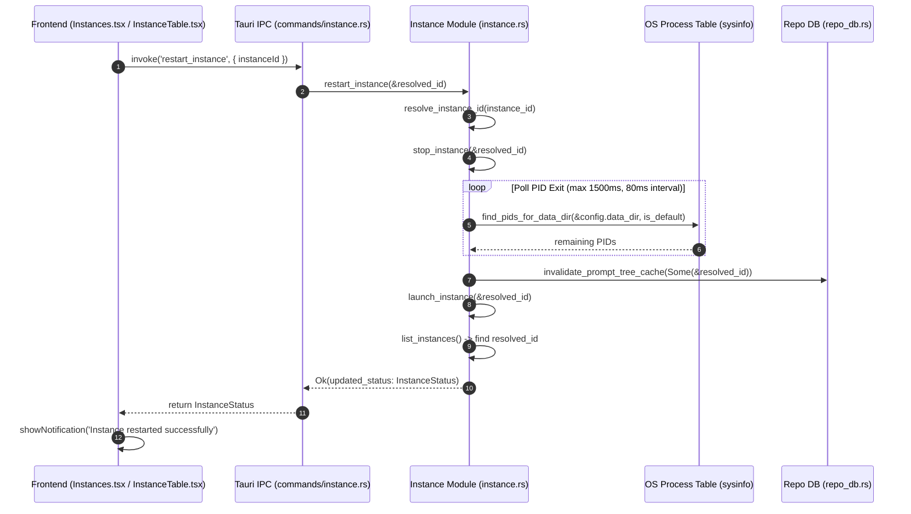
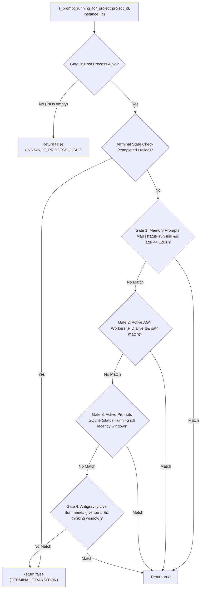

# Component Specification: Instance Restart Split Button, Distinct Sync Icons & Running Projects Detection Deep Fix

- **Module**: `instance-lifecycle` / `repo-db-prompts` / `instances-ui`
- **Spec ID**: `02-spec/21-app/135-instance-restart-button-sync-icons-and-running-projects-fix/02-component-spec.md`
- **Status**: Draft / Complete
- **Parent Task**: `135-instance-restart-button-sync-icons-and-running-projects-fix`

---

## 1. Overview & Architectural Scope

This specification formalizes the component contracts, backend IPC commands, database routines, frontend hooks, and UI interaction states for:
1. **Atomic Instance Restart Lifecycle**: Terminating running processes, verifying PID exit and socket release, flushing prompt tree cache, and relaunching the instance with its bound account.
2. **Contiguous Segmented Split Button [Stop | Restart]**: Rendering a unified pill capsule in both Table view (`InstanceTable.tsx`) and Card view (`Instances.tsx`) when an instance is running, while preserving standard `Play` launch and dedicated account switching behavior.
3. **Semantic Sync Icon Disambiguation**: Replacing circular arrow sync icons (`RotateCw`, `RefreshCw`) with distinct domain icons (`Cpu`, `SlidersHorizontal`, `ArrowLeftRight`) so users never confuse background metadata synchronization with instance restarts.
4. **Deep Running Projects & Prompts Detection Resolution**: Eliminating false positives on dead/crashed processes, preventing false negatives during 10-minute thinking model reasoning, parsing multi-format fractional timestamps, pruning 0-word untitled ghost sessions, enforcing exact instance ID ownership, and purging zombie database flags on startup.

---

## 2. Backend IPC Command Specifications

### 2.1 `restart_instance` Command

- **Locations**:
  - Implementation: [`src-tauri/src/modules/instance.rs`](file:///d:/work/Antigravity-Manager/src-tauri/src/modules/instance.rs#L1073-L1117)
  - Tauri Command Handler: [`src-tauri/src/commands/instance.rs`](file:///d:/work/Antigravity-Manager/src-tauri/src/commands/instance.rs#L44-L48)
  - Command Registration: [`src-tauri/src/lib.rs`](file:///d:/work/Antigravity-Manager/src-tauri/src/lib.rs#L1089)

#### Method Signatures
```rust
// In src-tauri/src/modules/instance.rs
pub fn restart_instance(instance_id: &str) -> AppResult<InstanceStatus>;

// In src-tauri/src/commands/instance.rs
#[tauri::command]
pub async fn restart_instance(instance_id: String) -> Result<InstanceStatus, String>;
```

#### Execution Lifecycle & Sequence


#### Invariant & Error Handling Contracts
- **Input Normalization**: Resolves shorthand aliases (`default`, `__default__`, `copy-8159`, `8159`) to canonical instance IDs.
- **Graceful Termination**: Invokes `stop_instance(&resolved_id)`, triggering clean SIGINT/WM_CLOSE followed by SIGKILL fallback for lingering processes.
- **Process Liveness Verification**: Loops for up to 1,500ms (80ms sleep interval) until `find_pids_for_data_dir` returns empty. If timeout occurs, proceeds with launch attempt and logs warning.
- **Cache Eviction**: Must call `invalidate_prompt_tree_cache(Some(&resolved_id))` to purge stale serialized JSON trees from `prompt_tree_cache` before launch.
- **Account Preservation**: Preserves the existing account binding (`email`), proxy settings, and environment variables configured on the instance profile.
- **Return Value**: Returns fresh `InstanceStatus` including updated PID and running state.

---

### 2.2 `is_instance_running` & Process Liveness Check

- **Location**: [`src-tauri/src/modules/instance.rs`](file:///d:/work/Antigravity-Manager/src-tauri/src/modules/instance.rs#L2584-L2605)

#### Method Signature
```rust
pub fn is_instance_running(instance_id: &str, data_dir: &str, config_pid: Option<u32>) -> bool;
```

#### Verification Protocol
1. **Saved PID Verification**: If `config_pid` or `get_instance_saved_pid(instance_id)` is present:
   - Queries OS process table via `sysinfo::System`.
   - Executes `saved_pid_matches(pid)`: verifies process exists AND identity matches Antigravity executable name (`Antigravity`, `antigravity.exe`) and path.
   - For `default` instance: additionally verifies that `find_pids_for_data_dir(data_dir, true)` contains the PID.
   - If match succeeds, returns `true`.
2. **Process Scan Fallback**: If saved PID is missing or dead, scans OS process table via `find_pids_for_data_dir(data_dir, is_default)`.
3. **Atomic PID Update**: If a running process matching `data_dir` is found, updates `record_instance_pid(instance_id, pid, data_dir)` and returns `true`.
4. **Dead State Confirmation**: If no matching processes exist, returns `false`.

---

## 3. Repository Database Subsystem Specifications (`repo_db.rs`)

### 3.1 `detect_running_projects`

- **Location**: [`src-tauri/src/modules/repo_db.rs`](file:///d:/work/Antigravity-Manager/src-tauri/src/modules/repo_db.rs#L510-L660)

#### Method Signature
```rust
pub fn detect_running_projects(instance_id: &str) -> Result<Vec<RunningProject>, String>;
```

#### Operational Logic & Deep Fixes
1. **Shorthand Resolution**: Calls `crate::modules::instance::resolve_instance_id(instance_id)`. For empty or `__default__`, normalizes to `default`.
2. **Instance Registry Lookup**: Loads `instance_registry.json`. Retrieves instance configuration (`data_dir`, `is_default`, `name`).
3. **Host Process Liveness Gate**:
   - Executes `find_pids_for_data_dir(&instance.data_dir, instance.is_default)`.
   - Computes `is_instance_active = !pids.is_empty()`.
   - **Critical Fix**: If `!is_instance_active`, NO project in this instance can be marked running. All projects discovered in `workspaceStorage` are strictly marked `is_running: false` and audit logged as `INSTANCE_PROCESS_DEAD`.
4. **Workspace Storage Discovery**:
   - Inspects `{data_dir}/User/workspaceStorage`.
   - Decodes `workspace.json` uri (`folder` or `configuration`).
   - Normalizes path using `decode_uri_to_path`.
   - Constructs composite key: `{repo_name.to_lowercase()}-{workspace_hash}__{target_id}`.
   - Scopes project liveness: `is_project_active = is_instance_active && is_prompt_running_for_project(&raw_path, target_id)`.
5. **Database Sync & Pruning**:
   - Purges corrupted records lacking composite delimiter `__` or with empty workspace storage paths.
   - Removes project records whose workspace directories no longer exist on disk.
   - Upserts discovered records with accurate `is_running` boolean and current timestamps.

---

### 3.2 `is_prompt_running_for_project` (5-Gate Verification Engine)

- **Location**: [`src-tauri/src/modules/repo_db.rs`](file:///d:/work/Antigravity-Manager/src-tauri/src/modules/repo_db.rs#L1594-L1930)

#### Method Signature
```rust
pub fn is_prompt_running_for_project(project_id: &str, instance_id: &str) -> bool;
```

#### Gate Architecture & Contracts


#### Gate Specifications
| Gate | Target Source | Validation Rules | Failure/Pass Outcome |
|---|---|---|---|
| **Gate 0: Process Liveness** | OS Process Table / `find_pids_for_data_dir` | Verifies instance process is alive. | If dead, aborts all subsequent checks, logs `INSTANCE_PROCESS_DEAD`, returns `false`. |
| **Terminal Check** | In-Memory Map & SQLite `active_prompts` | Checks if latest prompt transitioned to `completed` or `failed`. | If terminal, suppresses active evaluations. |
| **Gate 1: Memory Map** | `get_memory_prompts_map()` | Matches `instance_id`, `project_id`, `status == "running"`, and `now - updated_at <= 120`. | If matched, returns `true`. |
| **Gate 2: Active Workers** | `get_active_agy_workers()` | Scoped by `instance_id`, normalizes path, verifies OS worker PID liveness via `sysinfo`. | If alive, returns `true`; if dead, evicts key. |
| **Gate 3: SQLite Prompts** | `active_prompts` table in `repodb.db` | Queries `status = 'running'` and `updated_at >= now - 120` strictly scoped by `instance_id`. | If count > 0, returns `true`. |
| **Gate 4: Live Summaries** | `conversation_summaries.db` in instance `.gemini` dir | 1. Parse timestamp using multi-format parser.<br>2. **Adaptive 10-minute thinking window** (`now - turn_time <= 600`) for reasoning models.<br>3. **Strict Idle Supremacy**: `not_fully_idle == 0` or status containing `IDLE`/`COMPLETED`/`FAILED` evaluates to false.<br>4. **Ghost Filter**: Excludes 0-word untitled conversations.<br>5. Scopes workspace path to `project_id`. | If running turn confirmed, returns `true`. |

#### Multi-Format Robust Timestamp Parser Contract
Gate 4 must parse timestamps across heterogeneous IDE versions and SQLite serialization formats:
1. ISO 8601 / RFC 3339 with fractional seconds: `%Y-%m-%dT%H:%M:%S%.fZ` or `%Y-%m-%dT%H:%M:%S%.f%:z`.
2. Standard RFC 3339: `%Y-%m-%dT%H:%M:%S%z`.
3. Space-delimited with fractional seconds: `%Y-%m-%d %H:%M:%S%.f`.
4. Standard SQL datetime: `%Y-%m-%d %H:%M:%S`.
5. Fallback: Unix epoch millisecond / second string parsing.

---

### 3.3 `compute_project_conversation_tree`

- **Location**: [`src-tauri/src/modules/repo_db.rs`](file:///d:/work/Antigravity-Manager/src-tauri/src/modules/repo_db.rs#L3949-L4030)

#### Method Signature
```rust
fn compute_project_conversation_tree(
    target_instance: Option<&str>,
    max_words: usize,
    only_running: bool,
) -> Vec<AgmProjectTreeNode>;
```

#### Behavior & Caching Strategy
- **Scoped Cache Key**: Uses `tree:{instance_id}:{max_words}:{only_running}`.
- **Process Liveness Pre-flight**: Evaluates whether target instance is alive before running deep conversation tree calculations.
- **Workspace Hygiene**: Filters projects to ensure `workspace_storage_path` physically exists on disk.
- **Strict Instance Filtering**: Projects must match `target_id` exactly (or `default` / `__default__` for the default instance). Unassigned or mismatched records are excluded.

---

### 3.4 `purge_corrupted_running_projects`

- **Location**: [`src-tauri/src/modules/repo_db.rs`](file:///d:/work/Antigravity-Manager/src-tauri/src/modules/repo_db.rs#L310-L328)

#### Method Signature
```rust
pub fn purge_corrupted_running_projects(conn: &Connection) -> Result<(usize, usize), String>;
```

#### Enhanced Startup Cleaning Contract
```sql
-- 1. Purge malformed records
DELETE FROM running_projects 
WHERE workspace_storage_path IS NULL 
   OR trim(workspace_storage_path) = '' 
   OR instr(id, '__') = 0 
   OR trim(instance_id) = '';

-- 2. Reset zombie running flags on startup
UPDATE running_projects 
SET is_running = 0 
WHERE is_running != 0;

-- 3. Wipe stale serialized prompt tree cache
DELETE FROM prompt_tree_cache;
```
- **Return Value**: Returns `Ok((purged_count, wiped_cache_count))`.
- **Startup Hook**: Invoked once via `STARTUP_PURGE_ONCE` in `init_repo_database()`.

---

## 4. Frontend Component Specifications

### 4.1 `InstanceTable.tsx` Split Button & Actions

- **Location**: [`src/components/instances/InstanceTable.tsx`](file:///d:/work/Antigravity-Manager/src/components/instances/InstanceTable.tsx#L380-L440)

#### Interface Contracts
```typescript
export type InstanceActionType = 
    | 'launch' 
    | 'stop' 
    | 'restart' 
    | 'switch' 
    | 'fast-forward' 
    | 'wipe' 
    | 'delete' 
    | 'sync' 
    | null;

export interface InstanceTableProps {
    instances: InstanceStatus[];
    onLaunch: (id: string) => void;
    onStop: (id: string) => void;
    onRestart: (id: string) => void;
    onSwitch: (id: string) => void;
    onFastForward: (id: string) => void;
    onSyncPids: (id: string) => void;
    onDelete: (id: string) => void;
    onWipe: (id: string) => void;
    busyInstanceId: string | null;
    currentAction: InstanceActionType;
    // ... rest of props
}
```

#### Visual Structure & UI Specifications
1. **Running State (`inst.is_running === true`)**:
   - Renders a contiguous segmented pill capsule:
     ```tsx
     <div className="inline-flex items-center rounded-l-[5px] overflow-hidden bg-white dark:bg-[#071a27] border-r border-slate-300 dark:border-slate-700/80">
         {/* Stop Segment */}
         <button
             type="button"
             disabled={isBusy}
             onClick={() => onStop(inst.config.id)}
             className="px-2 py-1 text-rose-600 dark:text-rose-400 hover:bg-rose-50 dark:hover:bg-rose-950/40 transition-colors cursor-pointer disabled:opacity-50"
             title="Stop Instance"
         >
             {currentAction === 'stop' ? (
                 <RotateCw className="w-3 h-3 animate-spin text-rose-500" />
             ) : (
                 <Square className="w-3 h-3 fill-current" />
             )}
         </button>
         
         {/* Subtle Divider */}
         <div className="w-px h-3.5 bg-slate-300 dark:bg-slate-700/80 my-auto" />
         
         {/* Restart Segment */}
         <button
             type="button"
             disabled={isBusy}
             onClick={() => onRestart(inst.config.id)}
             className="px-2 py-1 text-amber-600 dark:text-amber-400 hover:bg-amber-50 dark:hover:bg-amber-950/40 transition-colors cursor-pointer disabled:opacity-50"
             title="Restart Instance on Current Account"
         >
             {currentAction === 'restart' ? (
                 <RotateCw className="w-3 h-3 animate-spin text-amber-500" />
             ) : (
                 <RotateCcw className="w-3 h-3" />
             )}
         </button>
     </div>
     ```
2. **Stopped State (`inst.is_running === false`)**:
   - Renders a standalone `Play` button:
     ```tsx
     <button
         type="button"
         disabled={isBusy}
         onClick={() => onLaunch(inst.config.id)}
         className="px-2 py-1 text-teal-600 dark:text-teal-400 hover:bg-slate-200 dark:hover:bg-[#15334d] rounded-l-[5px] transition-colors cursor-pointer disabled:opacity-50"
         title="Launch Instance"
     >
         {currentAction === 'launch' ? (
             <RotateCw className="w-3 h-3 animate-spin text-teal-500" />
         ) : (
             <Play className="w-3 h-3 fill-current" />
         )}
     </button>
     ```
3. **Dedicated Switch Button**: Renders adjacent `ArrowLeftRight` button for selecting/switching accounts, completely decoupled from start/stop/restart.
4. **Context Menu ("More Options")**: Includes explicit *"Restart Instance"* item calling `onRestart(inst.config.id)`.

---

### 4.2 `Instances.tsx` Card Mode & Action Coordination

- **Location**: [`src/pages/Instances.tsx`](file:///d:/work/Antigravity-Manager/src/pages/Instances.tsx)

#### Card Action Split Capsule
- **Running State**: Renders `[Square (Stop) | RotateCcw (Restart)]` split pill capsule in the primary actions container (`p-0.5 divide-x`).
- **Stopped State**: Renders full-width `[Play (Launch)]` button.
- **Action Label Handling**:
  ```typescript
  function getActionLabel(action: InstanceActionType): string {
      switch (action) {
          case 'launch':
              return 'Launching...';
          case 'stop':
              return 'Stopping...';
          case 'restart':
              return 'Restarting...'; // REQUIRED: Prevents fallback to generic 'Processing...'
          case 'switch':
              return 'Switching...';
          case 'fast-forward':
              return 'Rotating...';
          case 'sync':
              return 'Syncing...';
          case 'wipe':
              return 'Wiping...';
          case 'delete':
              return 'Deleting...';
          default:
              return 'Processing...';
      }
  }
  ```

#### Exact Instance Matching Contract (`isNodeOwnedByInstance`)
```typescript
export const isNodeOwnedByInstance = (
    node: AgmProjectTreeNode,
    instConfig: { id: string; is_default?: boolean; seq_num?: number }
): boolean => {
    if (!node.instance_id || node.instance_id.trim() === '') {
        return false;
    }
    // Default instance matching
    if (instConfig.is_default) {
        return isDefaultOwned(node.instance_id, instConfig.id);
    }
    // Non-default instance never owns default nodes
    if (node.instance_id === 'default' || node.instance_id === '__default__') {
        return false;
    }
    // Exact canonical ID match
    if (node.instance_id === instConfig.id) {
        return true;
    }
    // Explicit sequence number match
    const hasSeqNum = typeof instConfig.seq_num === 'number' && instConfig.seq_num > 1;
    if (hasSeqNum && node.instance_seq_num === instConfig.seq_num) {
        return true;
    }
    // Bounded exact suffix match: strictly require hyphen boundary or composite match
    if (node.instance_id.length >= 4 && instConfig.id === node.instance_id) {
        return true;
    }
    return false;
};
```

---

### 4.3 `PromptTreeViewModal.tsx` Cache Invalidation & Mount

- **Location**: [`src/components/instances/PromptTreeViewModal.tsx`](file:///d:/work/Antigravity-Manager/src/components/instances/PromptTreeViewModal.tsx#L1060-L1130)

#### Modal Open & Prompt Restoration Protocol
1. **Modal Mount Effect**:
   ```typescript
   useEffect(() => {
       if (isOpen) {
           const latestArchived = getArchivedProjectsForInstance(instanceId);
           const latestPinned = loadPinnedFromStorage(instanceId);
           setArchivedProjectIds(latestArchived);
           setPinnedProjectIds(latestPinned);
           // Force cache bypass: isInitial = true, force = true
           loadTree(true, true, latestArchived, latestPinned);
       }
   }, [isOpen, instanceId, initialSelectedProjectId]);
   ```
2. **Prompt Restoration (`handleRestore`)**:
   ```typescript
   const handleRestore = async () => {
       try {
           setActionMsg('Restoring prompts with 7s channel stabilization...');
           await invoke('resume_recent_project_prompts', {
               instanceId: instanceId || 'default',
               maxAgeSeconds: 3600,
           });
           setActionMsg('Prompts restoration dispatched!');
           setTimeout(() => {
               setActionMsg(null);
               // Force cache bypass on post-restore refresh
               loadTree(true, true);
           }, 3000);
       } catch (err: any) {
           setError(err?.toString() || 'Failed to restore prompts');
       }
   };
   ```

---

## 5. Distinct Semantic Sync Icons (Anti-Confusion Invariant)

To ensure users never confuse background synchronization with destructive instance restarts:

| Action / Context | Old Ambiguous Icon | New Semantic Icon | Component / Target | User-Facing Tooltip |
|---|---|---|---|---|
| **Sync Process PIDs** | `RotateCw` / `RefreshCw` | `Cpu` | `Instances.tsx` & `InstanceTable.tsx` | *"Sync Instance Process IDs"* |
| **Sync Quotas & Profiles** | `RotateCw` | `SlidersHorizontal` | `Instances.tsx` Toolbar | *"Sync Instance Quotas & Config"* |
| **Account Switching** | `ArrowLeftRight` | `ArrowLeftRight` | Primary Action Pill | *"Switch Bound Account"* |
| **Instance Restart** | N/A (Missing) | `RotateCcw` (**Exclusively Reserved**) | Primary Split Capsule | *"Restart Instance on Current Account"* |
| **Tree Manual Refresh** | `RotateCw` | `FolderSync` or `RefreshCw` (with label) | `PromptTreeViewModal.tsx` | *"Force Refresh Project Tree"* |

---

## 6. Verification Scorecard (VG-01 to VG-07)

```markdown
| Verification Gate | Target Module | Pass Criteria | Validation Method |
|---|---|---|---|
| **VG-01: Atomic Restart Lifecycle** | `src-tauri/src/modules/instance.rs` | `restart_instance` terminates old process, polls exit (<1.5s), invalidates cache, and relaunches profile on current account. | Backend unit/e2e test and process exit inspection. |
| **VG-02: InstanceTable Split Button** | `InstanceTable.tsx` | Running instance shows `[Stop (Square) \| Restart (RotateCcw)]` segmented capsule; stopped instance shows `Play`. | Frontend visual rendering and action trigger test. |
| **VG-03: Instances Card Mode & Label** | `Instances.tsx` | Card primary actions render split capsule; `getActionLabel('restart')` returns `'Restarting...'`. | Frontend state test during active restart. |
| **VG-04: Host Process Liveness (Gate 0)** | `repo_db.rs` | When instance process is dead, `detect_running_projects` and `is_prompt_running_for_project` strictly report `is_running: false`. | Terminate process and verify running count drops to 0. |
| **VG-05: Adaptive Thinking Window & Time Parser** | `repo_db.rs` Gate 4 | Models reasoning for >60s remain running if turn age <= 600s; fractional and ISO timestamps parse without falling back to 0. | Test vector with timestamps `2026-10-05T06:49:18.123Z` and 300s thinking turn. |
| **VG-06: Strict Instance Ownership** | `Instances.tsx` (`isNodeOwnedByInstance`) | Project tree nodes never bleed across instances with overlapping suffix names. | Verify multi-instance environment with instance `8159` vs `159`. |
| **VG-07: Startup Purge & Zombie Reset** | `repo_db.rs` (`purge_corrupted_running_projects`) | On application startup, zombie `is_running = 1` rows are reset to 0 and `prompt_tree_cache` is wiped. | Verify SQLite database state after simulated crash restart. |
```
