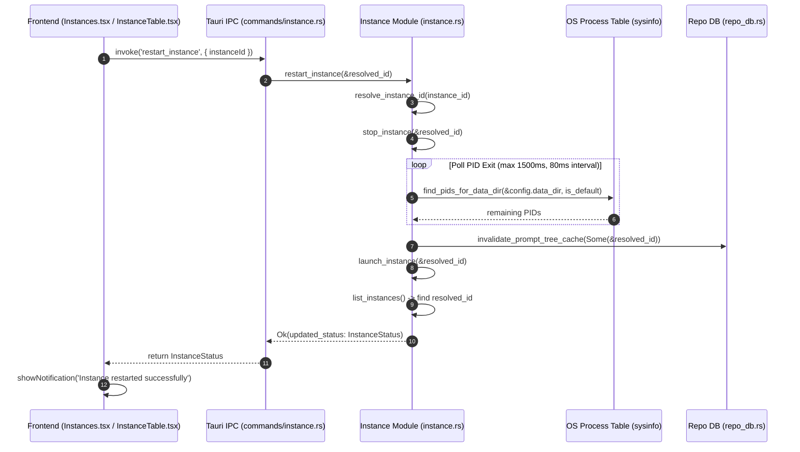
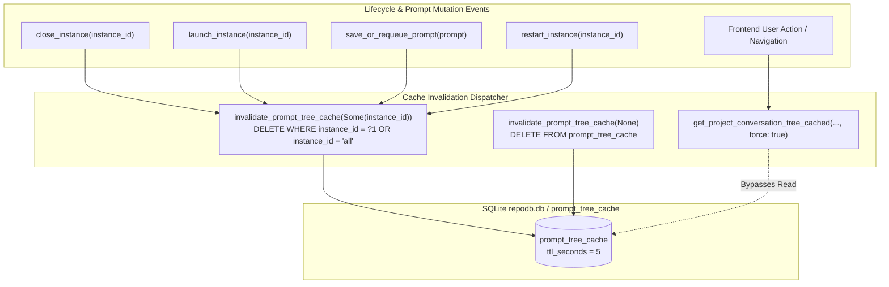

# Component Specification: Instance Restart Split Button, Distinct Sync Icons & Running Projects Detection Deep Fix

- **Module**: `instance-lifecycle` / `repo-db-prompts` / `instances-ui` / `email-watcher`
- **Spec ID**: `02-spec/21-app/135-instance-restart-button-sync-icons-and-running-projects-fix/02-component-spec.md`
- **Status**: Approved / Canonical
- **Parent Task**: `135-instance-restart-button-sync-icons-and-running-projects-fix`

---

## 1. Overview & Architectural Scope

This component specification formalizes the component interfaces, backend IPC signatures, database routines, frontend hooks, and validation scorecards for:
1. **Atomic Instance Restart Lifecycle**: Gracefully terminating running processes, polling for OS PID exit and file lock clearance (<1,500ms), evicting prompt tree cache, and relaunching the instance profile on its currently bound account.
2. **Contiguous Segmented Split Button [Stop | Restart]**: Rendering a unified segmented split pill capsule (`rounded-l-[5px]`, shared border, subtle divider line `w-px h-3.5`) in both Table view (`InstanceTable.tsx`) and Card view (`Instances.tsx`) when an instance is running, while preserving standard `Play` launch and dedicated account switching behavior (`ArrowLeftRight`).
3. **Semantic Sync Icon Disambiguation**: Replacing ambiguous circular arrow icons (`RotateCw`, `RefreshCw`, `RotateCcw`) with distinct domain icons (`Cpu`, `FolderSync`, `Sparkles`, `KeyRound`, `SlidersHorizontal`), strictly reserving `RotateCcw` exclusively for Restart operations.
4. **Deep Running Projects & Prompts Detection Engine**: Resolving all 6 architectural defects discovered during system analysis:
   - Eliminating sandbox home collisions in `gemini_dirs_for_instance`.
   - Resolving string mismatch in Gate 4 between decoded absolute workspace paths and repository identifiers/names.
   - Eliminating double-tagging and false alive in `gemini_dirs_tagged` caused by global `is_antigravity_running(None)`.
   - Extending thinking model detection from rigid 60s/120s to an adaptive 10-minute (600s) window with strict idle supremacy.
   - Purging false positive IDE process checks in `is_any_prompt_actively_running` that erroneously blocked `email_watcher.rs`.
   - Establishing an enforceable Cache Invalidation Contract for `prompt_tree_cache` across `close_instance`, `launch_instance`, `save_or_requeue_prompt`, and frontend `fetchRunningTasks({ force: true })`.

---

## 2. Backend IPC Command Specifications

### 2.1 `restart_instance` Command

- **Locations**:
  - Implementation: [`src-tauri/src/modules/instance.rs`](file:///d:/work/Antigravity-Manager/src-tauri/src/modules/instance.rs)
  - Tauri Command Handler: [`src-tauri/src/commands/instance.rs`](file:///d:/work/Antigravity-Manager/src-tauri/src/commands/instance.rs)
  - Command Registration: [`src-tauri/src/lib.rs`](file:///d:/work/Antigravity-Manager/src-tauri/src/lib.rs)

#### Method Signatures
```rust
// In src-tauri/src/modules/instance.rs
pub fn restart_instance(instance_id: &str) -> AppResult<InstanceStatus>;

// In src-tauri/src/commands/instance.rs
#[tauri::command]
pub async fn restart_instance(instance_id: String) -> Result<InstanceStatus, String>;
```

#### Execution Lifecycle & Sequence


#### Invariant & Error Handling Contracts
- **Input Normalization**: Resolves shorthand aliases (`default`, `__default__`, `copy-8159`, `8159`) to canonical instance IDs.
- **Graceful Termination**: Invokes `stop_instance(&resolved_id)`, issuing platform-specific termination signals to the Antigravity IDE and all child worker processes.
- **Process Liveness Verification**: Loops for up to 1,500ms (80ms sleep interval) until `find_pids_for_data_dir` returns empty. If timeout occurs, proceeds with launch attempt and logs warning.
- **Cache Eviction**: Invokes `crate::modules::repo_db::invalidate_prompt_tree_cache(Some(&resolved_id))` to purge stale serialized JSON trees from `prompt_tree_cache` before launch.
- **Account Preservation**: Preserves the existing account binding (`email`), proxy settings, and environment variables configured on the instance profile.
- **Return Value**: Returns fresh `InstanceStatus` including updated PID and running state.

---

### 2.2 `is_instance_running` & Process Liveness Check

- **Location**: [`src-tauri/src/modules/instance.rs`](file:///d:/work/Antigravity-Manager/src-tauri/src/modules/instance.rs)

#### Method Signature
```rust
pub fn is_instance_running(instance_id: &str, data_dir: &str, config_pid: Option<u32>) -> bool;
```

#### Verification Protocol
1. **Saved PID Verification**: If `config_pid` or `get_instance_saved_pid(instance_id)` is present:
   - Queries OS process table via `sysinfo::System`.
   - Executes `saved_pid_matches(pid)`: verifies process exists AND identity matches Antigravity executable name (`Antigravity`, `antigravity.exe`) and path.
   - For `default` instance: additionally verifies that `find_pids_for_data_dir(data_dir, true)` contains the PID.
   - If match succeeds, returns `true`.
2. **Process Scan Fallback**: If saved PID is missing or dead, scans OS process table via `find_pids_for_data_dir(data_dir, is_default)`.
3. **Atomic PID Update**: If a running process matching `data_dir` is found, updates `record_instance_pid(instance_id, pid, data_dir)` and returns `true`.
4. **Dead State Confirmation**: If no matching processes exist, returns `false`.

---

## 3. Cache Invalidation Contract & Lifecycle Integration

To prevent the 5-second TTL cache in `prompt_tree_cache` from desynchronizing UI states during instance lifecycle transitions, the following strict cache invalidation contract is enforced across backend and frontend modules:



### 3.1 Backend Invalidation Points

| Function | File Location | Cache Invalidation Call | Rationale |
|---|---|---|---|
| `close_instance` | `src-tauri/src/modules/instance.rs` | `crate::modules::repo_db::invalidate_prompt_tree_cache(Some(instance_id))` | Immediately evicts cached tree so UI reflects instance shutdown without a 5-second lag. |
| `launch_instance_inner_with_extra_workspaces` | `src-tauri/src/modules/instance.rs` | `crate::modules::repo_db::invalidate_prompt_tree_cache(Some(instance_id))` | Evicts stale idle tree state immediately upon process launch. |
| `save_or_requeue_prompt` | `src-tauri/src/modules/repo_db.rs` | `invalidate_prompt_tree_cache(Some(&canonical_inst))` | Evicts cache whenever a new prompt is saved, queued, or state-transitioned. |
| `restart_instance` | `src-tauri/src/modules/instance.rs` | `crate::modules::repo_db::invalidate_prompt_tree_cache(Some(&resolved_id))` | Clears cache between shutdown and relaunch stages. |
| `resend_running_commands_for_instance` | `src-tauri/src/modules/repo_db.rs` | `invalidate_prompt_tree_cache(instance_id)` | Clears cache after re-injecting prompts. |
| `purge_corrupted_running_projects` | `src-tauri/src/modules/repo_db.rs` | `DELETE FROM prompt_tree_cache` | Clears all cached trees on application startup. |

### 3.2 Frontend Cache Bypass Contract (`fetchRunningTasks`)

In [`src/pages/Instances.tsx`](file:///d:/work/Antigravity-Manager/src/pages/Instances.tsx):
```typescript
interface FetchRunningTasksOptions {
    force?: boolean;
}

export const fetchRunningTasks = async (options: FetchRunningTasksOptions = {}) => {
    try {
        const isForce = options.force === true;
        const data = await invoke<AgmProjectTreeNode[]>('get_project_conversation_tree', {
            maxWords: 50,
            onlyRunning: false,
            force: isForce,
        });
        if (Array.isArray(data)) {
            setProjectTreeNodes(data);
            const running = data.filter((node) => Boolean(node.is_running));
            setRunningTreeNodes(running);
        }
    } catch {
        // Silently ignore background polling errors
    }
};
```
- **Lifecycle Calls**: Following `handleLaunch`, `handleStop`, `handleRestart`, or modal open, invoke `fetchRunningTasks({ force: true })` to guarantee real-time UI synchronization without waiting for the 5-second TTL expiration.

---

## 4. Repository Database Subsystem Specifications (`repo_db.rs`)

### 4.1 Resolution of Defect 1: Sandbox Home Isolation in `gemini_dirs_for_instance`

- **Location**: [`src-tauri/src/modules/repo_db.rs`](file:///d:/work/Antigravity-Manager/src-tauri/src/modules/repo_db.rs#L805-L825)

#### Updated Method Contract:
```rust
pub fn gemini_dirs_for_instance(instance_id: &str) -> Vec<PathBuf> {
    let named = instance_id != "all"
        && instance_id != "default"
        && !instance_id.is_empty()
        && instance_id != "__default__";

    let home = if named {
        // Look up registered instance profile directory
        crate::modules::instance::get_instance_home_dir(instance_id).ok()
    } else {
        // Default instance profile: strictly use OS user home
        dirs::home_dir()
    };

    let mut dirs = Vec::new();
    if let Some(home) = home {
        for sub in ["antigravity", "antigravity-ide", "antigravity-cli"] {
            let path = home.join(".gemini").join(sub);
            if path.exists() {
                dirs.push(path);
            }
        }
    }
    dirs
}
```
- **Sandbox Boundary Rule**: Named instances resolve strictly to `instances/{id}/home/.gemini/*`. The default instance resolves strictly to `{dirs::home_dir()}/.gemini/*`. If a named instance's home cannot be resolved, it returns an empty vector rather than falling back to `dirs::home_dir()`, preventing cross-profile sandbox collision.

---

### 4.2 Resolution of Defect 2: Two-Tier Path & Repository Identifier Matching in Gate 4

- **Location**: [`src-tauri/src/modules/repo_db.rs`](file:///d:/work/Antigravity-Manager/src-tauri/src/modules/repo_db.rs#L1950-L1975)

#### Problem & Structural Solution:
`conversation_summaries.db` contains absolute filesystem paths (e.g., `d:/work/antigravity-manager`), whereas callers may pass:
1. An absolute workspace path (`d:\work\antigravity-manager`)
2. A repository name (`Antigravity-Manager` or `antigravity-manager`)
3. A workspace hash or composite identifier (`antigravity-manager-d58c5517` or `antigravity-manager-d58c5517__default`)

#### Matching Contract:
```rust
let clean_target = normalize_path_for_compare(project_id);
// Resolve target repository basename / short name for non-path inputs
let target_basename = Path::new(project_id)
    .file_name()
    .map(|n| n.to_string_lossy().to_lowercase())
    .unwrap_or_else(|| {
        project_id
            .split("__")
            .next()
            .unwrap_or(project_id)
            .to_lowercase()
    });

// In Gate 4 workspace evaluation:
let clean_p = normalize_path_for_compare(&decode_uri_to_path(&u));
let path_basename = Path::new(&clean_p)
    .file_name()
    .map(|n| n.to_string_lossy().to_lowercase())
    .unwrap_or_default();

let is_direct_match = !clean_target.is_empty() && clean_p == clean_target;
let is_basename_match = !target_basename.is_empty() && path_basename == target_basename;
let is_prefix_or_subpath = clean_target.starts_with(&clean_p) || clean_p.starts_with(&clean_target);

let is_target_matched = is_direct_match || is_basename_match || is_prefix_or_subpath;
```

---

### 4.3 Resolution of Defect 3: Distinct Instance PID Validation in Gate 0 & Tagged Dirs

- **Locations**:
  - `src-tauri/src/modules/repo_db.rs` (lines 4059, 4143, 4281)
  - `src-tauri/src/modules/instance.rs` (lines 3017)

#### Structural Fix:
- **Never Call Global `is_antigravity_running(None)` for Default Instance**:
  Global `is_antigravity_running(None)` checks if any Antigravity process exists anywhere on the machine. If a secondary instance (e.g. `default-copy-8159`) is running, global check falsely reports `default` instance as alive.
- **Specific Default Check Contract**:
  ```rust
  let is_default_alive = {
      let default_dir = crate::modules::instance::get_default_antigravity_data_dir();
      let pids = crate::modules::instance::find_pids_for_data_dir(&default_dir.to_string_lossy(), true);
      !pids.is_empty()
  };
  ```
  Every instance (both `default` and named) must be evaluated strictly against its own `--user-data-dir` PIDs.

---

### 4.4 Resolution of Defect 4: Adaptive 10-Minute Thinking Window & Timestamp Parser

- **Location**: [`src-tauri/src/modules/repo_db.rs`](file:///d:/work/Antigravity-Manager/src-tauri/src/modules/repo_db.rs#L1938-L1947)

#### Multi-Format Flexible Timestamp Parser:
```rust
pub fn parse_flexible_timestamp(raw: &str) -> i64 {
    let raw_trimmed = raw.trim();
    if raw_trimmed.is_empty() {
        return 0;
    }
    let norm_time = raw_trimmed.replacen(' ', "T", 1);
    
    // 1. ISO 8601 / RFC 3339 with timezone (e.g. 2026-10-05T06:49:18.123Z)
    if let Ok(dt) = chrono::DateTime::parse_from_rfc3339(&norm_time) {
        return dt.timestamp();
    }
    // 2. ISO 8601 with fractional seconds without TZ (e.g. 2026-10-05T06:49:18.492104)
    if let Ok(ndt) = chrono::NaiveDateTime::parse_from_str(&norm_time, "%Y-%m-%dT%H:%M:%S%.f") {
        return ndt.and_utc().timestamp();
    }
    // 3. Space-delimited with fractional seconds (e.g. 2026-10-05 06:49:18.492104)
    if let Ok(ndt) = chrono::NaiveDateTime::parse_from_str(raw_trimmed, "%Y-%m-%d %H:%M:%S%.f") {
        return ndt.and_utc().timestamp();
    }
    // 4. ISO 8601 standard seconds
    if let Ok(ndt) = chrono::NaiveDateTime::parse_from_str(&norm_time, "%Y-%m-%dT%H:%M:%S") {
        return ndt.and_utc().timestamp();
    }
    // 5. Space-delimited standard seconds
    if let Ok(ndt) = chrono::NaiveDateTime::parse_from_str(raw_trimmed, "%Y-%m-%d %H:%M:%S") {
        return ndt.and_utc().timestamp();
    }
    // 6. Direct epoch timestamp fallback
    raw_trimmed.parse::<i64>().unwrap_or(0)
}
```

#### Thinking Window & Strict Idle Supremacy:
```rust
let conv_time = parse_flexible_timestamp(&_last_time_str);
let is_recent = conv_time > 0 && (now - conv_time <= 600); // 10 minutes (600s)

let is_idle_count = not_fully_idle == 0;
let has_idle_status = status.contains("IDLE")
    || status.contains("COMPLETED")
    || status.contains("FAILED")
    || status.contains("CANCELLED");
let is_explicit_idle = is_idle_count || has_idle_status;

if is_explicit_idle {
    continue; // Strictly idle supremacy: never running if idle flag is set
}

let is_conv_running = !is_explicit_idle && not_fully_idle > 0 && status.contains("RUNNING");
```

---

### 4.5 Resolution of Defect 5: Unblocking `email_watcher.rs` in `is_any_prompt_actively_running`

- **Location**: [`src-tauri/src/modules/repo_db.rs`](file:///d:/work/Antigravity-Manager/src-tauri/src/modules/repo_db.rs#L2719-L2727)

#### Flaw:
`is_any_prompt_actively_running()` included a blind process check:
```rust
// FLAWED CODE (REMOVE):
let default_dir = crate::modules::instance::get_default_antigravity_data_dir();
let pids = crate::modules::instance::find_pids_for_data_dir(&default_dir.to_string_lossy(), true);
if !pids.is_empty() {
    return true; // Erroneously reported prompts running whenever IDE was open!
}
```
Because the IDE is typically kept open, `email_watcher.rs` was permanently blocked from sensing idle states.

#### Refactored Contract:
```rust
pub fn is_any_prompt_actively_running() -> bool {
    // 1. Check Antigravity conversation_summaries.db for active running turns
    let candidate_dirs = gemini_dirs_tagged(None);
    for (_inst_id, base_dir) in candidate_dirs {
        let summaries_db = base_dir.join("conversation_summaries.db");
        if !summaries_db.exists() {
            continue;
        }
        if let Ok(conn) = Connection::open_with_flags(
            &summaries_db,
            rusqlite::OpenFlags::SQLITE_OPEN_READ_ONLY | rusqlite::OpenFlags::SQLITE_OPEN_URI,
        ) {
            let count: i32 = conn.query_row(
                "SELECT COUNT(*) FROM conversation_summaries 
                 WHERE not_fully_idle != 0 
                   AND status LIKE '%RUNNING%' 
                   AND status NOT LIKE '%IDLE%' 
                   AND status NOT LIKE '%COMPLETED%' 
                   AND status NOT LIKE '%FAILED%' 
                   AND status NOT LIKE '%CANCELLED%'",
                [],
                |row| row.get(0),
            ).unwrap_or(0);
            if count > 0 {
                return true;
            }
        }
    }

    // 2. Check repo_prompts.db active_prompts for running/queued prompts
    if let Ok(conn) = connect_db() {
        let count: i32 = conn.query_row(
            "SELECT COUNT(*) FROM active_prompts WHERE status = 'running' OR status = 'queued'",
            [],
            |row| row.get(0),
        ).unwrap_or(0);
        if count > 0 {
            return true;
        }
    }

    // 3. DO NOT equate living IDE process with actively running prompts!
    false
}
```

---

## 5. Frontend Component Specifications

### 5.1 `InstanceTable.tsx` Segmented Split Capsule & Action Handlers

- **Location**: [`src/components/instances/InstanceTable.tsx`](file:///d:/work/Antigravity-Manager/src/components/instances/InstanceTable.tsx)

#### Type Signatures:
```typescript
export type InstanceActionType = 
    | 'launch' 
    | 'stop' 
    | 'restart' 
    | 'switch' 
    | 'fast-forward' 
    | 'wipe' 
    | 'delete' 
    | 'sync' 
    | null;
```

#### Split Capsule UI Markup:
```tsx
{/* When running: Contiguous Segmented Pill Capsule */}
{inst.is_running ? (
    <div className="inline-flex items-center rounded-l-[5px] overflow-hidden bg-white dark:bg-[#071a27] border-r border-slate-300 dark:border-slate-700/80">
        {/* Stop Button */}
        <button
            type="button"
            disabled={isBusy}
            onClick={() => onStop(inst.config.id)}
            className="px-2 py-1 text-rose-600 dark:text-rose-400 hover:bg-rose-50 dark:hover:bg-rose-950/40 transition-colors cursor-pointer disabled:opacity-50"
            title="Stop Instance"
        >
            {currentAction === 'stop' ? (
                <RotateCw className="w-3 h-3 animate-spin text-rose-500" />
            ) : (
                <Square className="w-3 h-3 fill-current" />
            )}
        </button>

        {/* Hairline Divider */}
        <div className="w-px h-3.5 bg-slate-300 dark:bg-slate-700/80 my-auto" />

        {/* Restart Button */}
        <button
            type="button"
            disabled={isBusy}
            onClick={() => onRestart(inst.config.id)}
            className="px-2 py-1 text-amber-600 dark:text-amber-400 hover:bg-amber-50 dark:hover:bg-amber-950/40 transition-colors cursor-pointer disabled:opacity-50"
            title="Restart Instance on Current Account"
        >
            {currentAction === 'restart' ? (
                <RotateCw className="w-3 h-3 animate-spin text-amber-500" />
            ) : (
                <RotateCcw className="w-3 h-3" />
            )}
        </button>
    </div>
) : (
    /* When stopped: Standard Play Button */
    <button
        type="button"
        disabled={isBusy}
        onClick={() => onLaunch(inst.config.id)}
        className="px-2 py-1 text-teal-600 dark:text-teal-400 hover:bg-slate-200 dark:hover:bg-[#15334d] rounded-l-[5px] transition-colors cursor-pointer disabled:opacity-50"
        title="Launch Instance"
    >
        {currentAction === 'launch' ? (
            <RotateCw className="w-3 h-3 animate-spin text-teal-500" />
        ) : (
            <Play className="w-3 h-3 fill-current" />
        )}
    </button>
)}

{/* Independent Account Switch Button */}
<button
    type="button"
    disabled={isBusy}
    onClick={() => onSwitch(inst.config.id)}
    className="px-2 py-1 text-sky-600 dark:text-sky-400 hover:bg-slate-200 dark:hover:bg-[#15334d] transition-colors cursor-pointer disabled:opacity-50"
    title="Switch Bound Account"
>
    <ArrowLeftRight className="w-3 h-3" />
</button>
```

---

### 5.2 Semantic Sync Icons Disambiguation Matrix

| Action / Button | Old Icon | New Semantic Icon | Component Path | Tooltip |
|---|---|---|---|---|
| **Instance Restart** | N/A (Missing) | `RotateCcw` (**Exclusively Reserved**) | `InstanceTable.tsx` & `Instances.tsx` | *"Restart Instance on Current Account"* |
| **Sync All** | `RotateCw` | `FolderSync` | `Instances.tsx` (Top Toolbar) | *"Synchronize Workspaces & Quotas"* |
| **Eval Quota** | `RotateCw` | `Sparkles` | `Instances.tsx` (Top Toolbar) | *"Evaluate Quota & Candidate Scoring"* |
| **Sync PID & Quota** | `RotateCw` / `RefreshCw` | `Cpu` | `InstanceTable.tsx` & `Instances.tsx` | *"Sync Instance Process IDs"* |
| **Wipe Credentials** | `RotateCcw` | `KeyRound` | `Instances.tsx` (Card Dropdown) | *"Wipe Saved Session Credentials"* |
| **Settings & Sync** | `SlidersHorizontal` | `SlidersHorizontal` | `InstanceTable.tsx` Dropdown | *"Configure Instance Settings"* |
| **Account Switch** | `ArrowLeftRight` | `ArrowLeftRight` | Primary Action Pill | *"Switch Bound Account"* |

---

## 6. The 7-Gate Verification Scorecard (VG-01 to VG-07)

```markdown
| Verification Gate | Target Subsystem / Files | Pass Criteria | Verification Method |
|---|---|---|---|
| **VG-01: Atomic Restart Lifecycle** | `src-tauri/src/modules/instance.rs`<br>`commands/instance.rs` | `restart_instance` gracefully terminates old processes, polls OS exit (<1,500ms), calls `invalidate_prompt_tree_cache`, and relaunches profile on identical account. | Trigger restart from table and card; verify PID changes, window reopens, account remains unchanged. |
| **VG-02: Segmented Split Pill Capsule** | `src/components/instances/InstanceTable.tsx` | Running instance renders contiguous `[Stop (Square) \| Restart (RotateCcw)]` segmented capsule (`rounded-l-[5px]`) with hairline divider. Stopped instance renders single `Play` button. | Visual DOM inspection in Table view across running and stopped instances. |
| **VG-03: Card Split Capsule & Action Labels** | `src/pages/Instances.tsx` | Card mode renders identical segmented split capsule; `getActionLabel('restart')` explicitly returns `'Restarting...'` rather than generic `'Processing...'`. | Visual inspection in Card view; verify status pill shows *"Restarting..."* during execution. |
| **VG-04: Host Process Liveness (Gate 0) & Sandbox Isolation** | `src-tauri/src/modules/repo_db.rs`<br>`src-tauri/src/modules/instance.rs` | When instance process is dead, `detect_running_projects` and `is_prompt_running_for_project` strictly report `is_running: false`. Named instances never collide with default home. | Terminate IDE externally; verify running indicator flips to false immediately and audit logs `INSTANCE_PROCESS_DEAD`. |
| **VG-05: Adaptive Thinking Window & Multi-Format Time Parser** | `src-tauri/src/modules/repo_db.rs` Gate 4 | Models generating thought chains for 2–8 minutes retain `is_running: true` (age <= 600s); fractional timestamps (`.492104`, `.123Z`) parse without defaulting to 0; idle supremacy strictly observed. | Feed test summaries with extended thinking turns and ISO timestamps; verify status remains running until idle flag set. |
| **VG-06: Strict Instance Scoping & Path/ID Matcher** | `src-tauri/src/modules/repo_db.rs` Gate 4<br>`src/pages/Instances.tsx` | Gate 4 matches both absolute workspace paths and repository names/hashes; `isNodeOwnedByInstance` eliminates loose suffix bleed between overlapping instance names. | Verify workspaces with names `default-copy-8159` vs `8159` only bind to their designated instance cards. |
| **VG-07: Cache Invalidation Contract & Startup Purge** | `instance.rs` (`close_instance`, `launch_instance`)<br>`repo_db.rs` (`save_or_requeue_prompt`, `purge_corrupted_running_projects`)<br>`email_watcher.rs` | `invalidate_prompt_tree_cache` called on all lifecycle transitions; frontend calls `fetchRunningTasks({ force: true })`; zombie flags reset on startup; `email_watcher.rs` unblocked. | Inspect database after restart; verify prompt tree cache is cleared; simulate idle IDE and verify email watcher triggers. |
```
