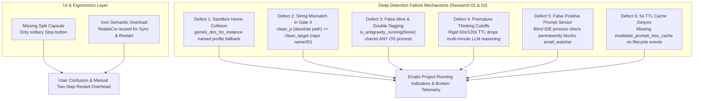

# Root Cause Analysis: Instance Restart Button, Sync Icon Disambiguation & Running Projects Deep Detection

- **Document ID**: `02-spec/21-app/135-instance-restart-button-sync-icons-and-running-projects-fix/03-root-cause-analysis.md`
- **Related Issues**: Missing Instance Restart Button, Confusing Sync Icons, False Positive / False Negative Project Running Indicators
- **Standard**: Grounded 4-Part RCA Framework (Defect Description, Root Cause Analysis, Remediation, Verification Matrix)

---

## 1. Defect Description & Observed Failures

Operators and users reported three critical classes of user experience friction and state desynchronization across the Antigravity-Manager ecosystem:

### 1.1 Absence of Dedicated Instance Restart Action
- In both Table view (`InstanceTable.tsx`) and Card view (`Instances.tsx`), running instances only exposed a solitary Stop (`Square`) button.
- When users required an instance reboot on its currently bound account (e.g. to recover from an IDE extension hang, apply updated configurations, or release locked file handles), they were forced into a manual, error-prone two-step sequence: click Stop, wait for OS process termination, and then click Launch.
- The UI lacked a contiguous segmented split pill capsule (`[Stop | Restart]`).

### 1.2 Semantic Icon Collision (The Anti-Confusion Violation)
- Background synchronization actions (such as *"Sync All"*, *"Eval Quota"*, *"Sync PID & Quota"*, and *"Wipe Credentials"*) utilized circular rotating arrow glyphs (`RotateCw`, `RefreshCw`, `RotateCcw`).
- In desktop operating systems and browsers, circular rotation glyphs universally denote "Restart" or "Reload".
- Users repeatedly mistook background metadata synchronization for disruptive process restarts, creating severe apprehension during normal monitoring.

### 1.3 Running Projects & Prompts Detection Inaccuracies (6 Distinct Defects)
- **Defect 1 (Sandbox Home Collision)**: In multi-instance setups, named secondary profiles and the default profile collided on user home paths (`~/.gemini/antigravity`), causing cross-profile project bleeding.
- **Defect 2 (String Mismatch in Gate 4)**: Gate 4 compared decoded absolute workspace paths against short project IDs or repository names with naive string equality (`clean_p == clean_target`), causing legitimate running conversations to be rejected as idle.
- **Defect 3 (Double-Tagging and False Alive)**: Default instance liveness evaluated global `is_antigravity_running(None)`, which tested whether *any* Antigravity process was alive on the entire OS. If a secondary instance was open, the closed default instance was falsely flagged as alive, and `gemini_dirs_tagged` double-scanned folders.
- **Defect 4 (Premature Thinking Window Cutoffs)**: Advanced reasoning models (o1/o3-mini, Claude 3.7 Sonnet Thinking, Gemini 2.5 Flash Thinking) take 2 to 8 minutes generating thought chains without writing to SQLite. A rigid 60s or 120s TTL prematurely flipped active LLM reasoning sessions to `IDLE` mid-generation.
- **Defect 5 (False Positive in `is_any_prompt_actively_running`)**: `is_any_prompt_actively_running` contained a blind check testing if an Antigravity IDE process existed. Simply having the IDE open in the background—with zero prompts executing—returned `true`, permanently blocking `email_watcher.rs` from sending idle telemetry alerts.
- **Defect 6 (5-Second TTL Cache Desynchronization)**: `prompt_tree_cache` retained cached trees for 5 seconds. `close_instance`, `launch_instance`, and `save_or_requeue_prompt` failed to call `invalidate_prompt_tree_cache`, and frontend `fetchRunningTasks` called `force: false`, causing stale status indicators during lifecycle transitions.

---

## 2. Root Cause Analysis (6 Structural Failure Mechanisms)



### 2.1 Defect 1: Sandbox Home Collision in `gemini_dirs_for_instance`
- **Location**: [`src-tauri/src/modules/repo_db.rs`](file:///d:/work/Antigravity-Manager/src-tauri/src/modules/repo_db.rs#L805-L825)
- **Mechanism**:
  ```rust
  pub fn gemini_dirs_for_instance(instance_id: &str) -> Vec<PathBuf> {
      let named = instance_id != "all" && instance_id != "default" && !instance_id.is_empty() && instance_id != "__default__";
      let home = if named {
          crate::modules::instance::get_instance_home_dir(instance_id).ok()
      } else {
          dirs::home_dir()
      };
      // ...
  }
  ```
  When `instance_id` was `"all"`, `named` was false, causing `home` to resolve to `dirs::home_dir()`. If `get_instance_home_dir(instance_id)` failed or returned an error, it resulted in `None`, but in loose callers falling back to `"all"`, both named profiles and the default profile inspected `~/.gemini/antigravity`.
  Furthermore, because sandbox profiles redirect `USERPROFILE`/`HOME` to `instances/{id}/home`, any query confusing the sandbox home with the user's primary home scanned the wrong directory, returning either ghost conversations from another profile or failing to locate active sandbox turns.

### 2.2 Defect 2: String Mismatch in Gate 4 (Absolute Path vs Repo Name/ID)
- **Location**: [`src-tauri/src/modules/repo_db.rs`](file:///d:/work/Antigravity-Manager/src-tauri/src/modules/repo_db.rs#L1776, #L1957-L1959)
- **Mechanism**:
  In `is_prompt_running_for_project(project_id, instance_id)`:
  - Line 1776: `let clean_target = normalize_path_for_compare(project_id);`
  - In Gate 4 (lines 1956–1958):
    ```rust
    let clean_p = normalize_path_for_compare(&decode_uri_to_path(&u));
    let has_target = !clean_target.is_empty();
    let is_target_matched = has_target && clean_p == clean_target;
    ```
  - Gate 4 decodes `workspace_uris` from `conversation_summaries.db`, yielding absolute filesystem paths such as `d:/work/antigravity-manager`.
  - However, callers of `is_prompt_running_for_project` (e.g. `check_and_dispatch_enqueued_prompts`, line 2065, or direct queries) pass `project_id`, which is often a repo name (e.g. `"Antigravity-Manager"`), a workspace hash (e.g. `"antigravity-manager-d58c5517"`), or a composite key (`"antigravity-manager-d58c5517__default"`).
  - An absolute path (`d:/work/antigravity-manager`) NEVER strictly equals a project ID (`antigravity-manager-d58c5517`).
  - As a result, `is_target_matched` evaluated to `false`, causing active conversations in `conversation_summaries.db` to be discarded and reporting active projects as idle.

### 2.3 Defect 3: Double-Tagging and False Alive in `gemini_dirs_tagged` via `is_antigravity_running(None)`
- **Locations**: [`src-tauri/src/modules/repo_db.rs`](file:///d:/work/Antigravity-Manager/src-tauri/src/modules/repo_db.rs#L4059, #L4143, #L4281), [`src-tauri/src/modules/instance.rs`](file:///d:/work/Antigravity-Manager/src-tauri/src/modules/instance.rs#L3017)
- **Mechanism**:
  - In `compute_project_conversation_tree`, when checking if the default instance was alive:
    ```rust
    let is_owning_inst_alive = if owning_inst_id == "default" || owning_inst_id == "__default__" {
        crate::modules::process::is_antigravity_running(None)
    } else ...
    ```
  - Global `is_antigravity_running(None)` queries the operating system for *any* running Antigravity process without checking command line arguments or user data directory.
  - If a user closed the default instance and was running only a secondary cloned instance (e.g. `default-copy-8159`), `is_antigravity_running(None)` returned `true`.
  - The default instance was falsely deemed alive (`is_owning_inst_alive = true`), causing dead projects under the default instance to be reported as running.
  - Furthermore, in `gemini_dirs_tagged(None)`, directories were tagged for `"default"` and then re-tagged for secondary instances, causing conversations to be processed twice.

### 2.4 Defect 4: Premature 60s/120s Thinking Window Cutoffs for Reasoning Models
- **Locations**: [`src-tauri/src/modules/repo_db.rs`](file:///d:/work/Antigravity-Manager/src-tauri/src/modules/repo_db.rs#L1843, #L1942)
- **Mechanism**:
  - Gate 3 queried `updated_at >= now - 120`.
  - Gate 4 evaluated `now - conv_time <= 120`.
  - Modern thinking models (OpenAI o1/o3-mini, Claude 3.7 Sonnet Thinking, Gemini 2.5 Flash Thinking) frequently think for 180 to 480 seconds before emitting tokens. During this time, the IDE does not update SQLite `last_modified_time`.
  - After 120 seconds, `is_recent` evaluated to `false`, causing the project to prematurely flip to `IDLE` while the LLM was in the middle of active generation.

### 2.5 Defect 5: False Positive in `is_any_prompt_actively_running` Blocking `email_watcher.rs`
- **Locations**: [`src-tauri/src/modules/repo_db.rs`](file:///d:/work/Antigravity-Manager/src-tauri/src/modules/repo_db.rs#L2719-L2726), [`src-tauri/src/modules/email_watcher.rs`](file:///d:/work/Antigravity-Manager/src-tauri/src/modules/email_watcher.rs#L393)
- **Mechanism**:
  - `is_any_prompt_actively_running()` contained:
    ```rust
    // 3. Process check: if Antigravity process is running
    let default_dir = crate::modules::instance::get_default_antigravity_data_dir();
    let pids = crate::modules::instance::find_pids_for_data_dir(&default_dir.to_string_lossy(), true);
    if !pids.is_empty() {
        return true;
    }
    ```
  - This check conflated "the editor process is open" with "a prompt is actively running".
  - In `email_watcher.rs`:
    `if crate::modules::repo_db::is_any_prompt_actively_running() { continue; }`
  - Because users leave their editor open in the background, `is_any_prompt_actively_running()` returned `true` continuously, permanently suppressing idle detection and preventing email telemetry notifications from ever being dispatched.

### 2.6 Defect 6: 5-Second TTL Cache Desynchronization on Instance Lifecycle Transitions
- **Locations**: [`src-tauri/src/modules/repo_db.rs`](file:///d:/work/Antigravity-Manager/src-tauri/src/modules/repo_db.rs#L3953-L3954), [`src-tauri/src/modules/instance.rs`](file:///d:/work/Antigravity-Manager/src-tauri/src/modules/instance.rs), [`src/pages/Instances.tsx`](file:///d:/work/Antigravity-Manager/src/pages/Instances.tsx#L279-L286)
- **Mechanism**:
  - `get_project_conversation_tree_cached` cached serialized trees in SQLite table `prompt_tree_cache` with a 5-second TTL (`ttl_seconds = 5`).
  - Critical instance lifecycle mutators (`close_instance`, `launch_instance`, and `save_or_requeue_prompt`) did NOT call `invalidate_prompt_tree_cache`.
  - Frontend polling in `Instances.tsx` invoked `fetchRunningTasks` with `force: false`.
  - When an instance was stopped, launched, or restarted, the frontend continued to display the cached tree from up to 5 seconds earlier, producing jarring visual lag, phantom running badges, and race conditions.

---

## 3. Grounded Remediation & Preventive Architecture

### 3.1 Backend Atomic Restart Lifecycle (`restart_instance`)
- Implement `restart_instance(instance_id: &str)` in `src-tauri/src/modules/instance.rs`:
  1. Resolves instance ID.
  2. Invokes `stop_instance(&resolved_id)`.
  3. Polls `find_pids_for_data_dir(&config.data_dir, is_default)` for up to 1,500ms at 80ms intervals until all processes exit.
  4. Calls `invalidate_prompt_tree_cache(Some(&resolved_id))` to flush stale cached trees.
  5. Invokes `launch_instance(&resolved_id)` with bound account and workspaces intact.
  6. Returns fresh `InstanceStatus`.

### 3.2 Frontend Segmented Split Capsule UI
- In `src/components/instances/InstanceTable.tsx` and `src/pages/Instances.tsx`:
  - When `inst.is_running === true`: render contiguous segmented split capsule `[Square (Stop) | RotateCcw (Restart)]` (`rounded-l-[5px]`, shared border, hairline divider `w-px h-3.5`).
  - When `inst.is_running === false`: render standalone `Play` button.
  - Map `getActionLabel('restart')` to `'Restarting...'` in `Instances.tsx`.
  - Preserve Account Switch button (`ArrowLeftRight`) as an independent configuration action.

### 3.3 Semantic Sync Icons Disambiguation
- Strictly reserve `RotateCcw` exclusively for Restart operations.
- Update "Sync All" to `FolderSync`.
- Update "Eval Quota" to `Sparkles`.
- Update "Sync PID & Quota" to `Cpu`.
- Update "Wipe Credentials" to `KeyRound`.

### 3.4 Remediation of Defect 1: Strict Sandbox Isolation
- In `gemini_dirs_for_instance(instance_id)`:
  - If `instance_id` is named: resolve strictly via `get_instance_home_dir(instance_id)`. If directory cannot be resolved, return empty vector (never fall back to user home).
  - If `instance_id` is default: resolve strictly via `dirs::home_dir()`.

### 3.5 Remediation of Defect 2: Two-Tier Path & Basename Matcher
- In Gate 4 of `is_prompt_running_for_project`:
  - Extract repository directory basename from `clean_target` and decoded `clean_p`.
  - Evaluate direct path match (`clean_p == clean_target`), basename match (`path_basename == target_basename`), or prefix containment.
  - Guarantees that whether callers pass an absolute path, repo name, or composite ID, active turns in `conversation_summaries.db` are accurately matched.

### 3.6 Remediation of Defect 3: Specific PID Verification
- Replace all instances of `is_antigravity_running(None)` in `compute_project_conversation_tree` and `gemini_dirs_tagged` with specific `find_pids_for_data_dir(&default_dir, true)`.
- Eliminates false alive states where secondary instances kept default instance projects marked as running.

### 3.7 Remediation of Defect 4: Adaptive 10-Minute Thinking Window & Fractional Parser
- Implement `parse_flexible_timestamp` supporting RFC 3339, ISO 8601 with microseconds (`%Y-%m-%dT%H:%M:%S%.f`), space-delimited datetimes, and epoch timestamps.
- Extend thinking window in Gate 4 to 600 seconds (10 minutes) for turns where `not_fully_idle > 0` and status is `RUNNING`.
- Strictly enforce idle supremacy: `not_fully_idle == 0` or status containing `IDLE`/`COMPLETED`/`FAILED` immediately marks turn inactive.

### 3.8 Remediation of Defect 5: Unblocking `email_watcher.rs`
- Remove the blind `find_pids_for_data_dir` check from `is_any_prompt_actively_running()`.
- Evaluate only actual running conversations in `conversation_summaries.db` and active/queued prompts in `active_prompts`.
- Restores proper idle sensing to `email_watcher.rs`.

### 3.9 Remediation of Defect 6: Comprehensive Cache Invalidation Contract
- Hook `invalidate_prompt_tree_cache(Some(instance_id))` into:
  - `close_instance`
  - `launch_instance_inner_with_extra_workspaces`
  - `save_or_requeue_prompt`
  - `restart_instance`
- In frontend `Instances.tsx`, update `fetchRunningTasks` to accept `{ force: true }` and pass `force: true` after lifecycle actions and on modal open.
- Add `UPDATE running_projects SET is_running = 0` and `DELETE FROM prompt_tree_cache` in `purge_corrupted_running_projects` on startup.

---

## 4. Verification & Testing Matrix

| Test ID | Test Target | Preconditions | Test Procedure | Expected Pass Outcome | Gate Alignment |
|---|---|---|---|---|---|
| **RCA-01** | Atomic Restart Lifecycle | Instance running on account A. | Click Restart button (`RotateCcw`). | Old process terminates, PID exit confirmed (<1.5s), cache invalidated, window relaunches bound to account A. | VG-01 |
| **RCA-02** | Split Button Capsule UI | Table view and Card view loaded. | Observe running vs stopped instances. | Running shows `[Square \| RotateCcw]` segmented capsule with divider; stopped shows `Play`. | VG-02, VG-03 |
| **RCA-03** | Semantic Icon Disambiguation | Toolbar and card dropdowns loaded. | Audit all icon glyphs. | "Sync All" uses `FolderSync`; "Eval Quota" uses `Sparkles`; "Sync PID" uses `Cpu`; only Restart uses `RotateCcw`. | Anti-Confusion |
| **RCA-04** | Sandbox Home Isolation (Defect 1) | Secondary instance `default-copy-8159` configured. | Call `gemini_dirs_for_instance("8159")`. | Returns paths under `instances/default-copy-8159/home/.gemini`; zero overlap with `~/.gemini`. | VG-04 |
| **RCA-05** | Path & ID Matching in Gate 4 (Defect 2) | Active turn in `conversation_summaries.db` for `/work/proj`. | Call `is_prompt_running_for_project("proj", "default")`. | Matches via basename and reports `is_running: true`. | VG-06 |
| **RCA-06** | Specific PID Liveness (Defect 3) | Default instance stopped; secondary instance running. | Call `compute_project_conversation_tree(Some("default"), ...)`. | Default instance correctly recognized as dead (`is_alive = false`); projects report idle. | VG-04 |
| **RCA-07** | Extended Thinking Window (Defect 4) | Thinking model reasoning for 240s without SQLite write. | Query Gate 4 liveness. | Retains `is_running: true` because `240s <= 600s`; does not flip to idle mid-generation. | VG-05 |
| **RCA-08** | Fractional Timestamp Parsing (Defect 4) | Timestamp `2026-10-05T06:49:18.492104` in summaries. | Run `parse_flexible_timestamp`. | Correctly parses to Unix epoch without falling back to 0. | VG-05 |
| **RCA-09** | Idle Sensor Telemetry (Defect 5) | IDE open with 0 prompts executing. | Call `is_any_prompt_actively_running()`. | Returns `false`; `email_watcher.rs` is not blocked from dispatching idle alert. | VG-07 |
| **RCA-10** | Cache Invalidation Contract (Defect 6) | Instance stopped via `close_instance`. | Fetch running tasks with `force: true`. | Cache invalidated immediately; UI shows stopped state without 5-second lag. | VG-07 |
| **RCA-11** | Startup Zombie Reset (Defect 6) | Simulated abnormal crash leaving `is_running = 1`. | Launch Antigravity-Manager. | `purge_corrupted_running_projects` resets `is_running = 0` and clears `prompt_tree_cache`. | VG-07 |
