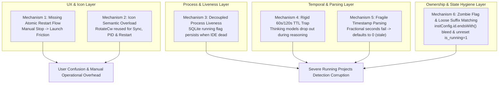

# Root Cause Analysis: Instance Restart Button, Sync Icon Disambiguation & Running Projects Deep Detection

- **Document ID**: `02-spec/21-app/135-instance-restart-button-sync-icons-and-running-projects-fix/03-root-cause-analysis.md`
- **Related Issues**: Instance Restart Missing, Ambiguous Sync Icons, False Positive / False Negative Project Running Indicators
- **Standard**: Grounded 4-Part RCA Framework

---

## 1. Defect Description & Observed Failures

Users and operators reported a cluster of related usability frictions and detection inaccuracies in the Antigravity-Manager Instance Management and Prompt Observation subsystems:

1. **Absence of Dedicated Restart Action**:
   - In both Table view and Card view, running instances only exposed a solitary Stop (`Square`) button.
   - When users wished to restart an instance on its currently bound account (e.g. to recover from an IDE hang, apply updated configurations, or clear extension locks), they were forced to manually click Stop, wait for OS process termination, and then click Launch.
   - The primary action bar lacked a unified segmented split capsule (`[Stop | Restart]`).
2. **Ambiguous Circular Sync Icons Mimicking Restart**:
   - Multiple buttons performing read-only background synchronizations (such as *"Sync PIDs"*, *"Sync PID & Quotas"*, and *"Fast Forward"*) used circular rotation glyphs (`RotateCw`, `RefreshCw`).
   - Because circular arrows universally denote "Restart" or "Reload" in desktop operating systems and browsers, users frequently clicked sync buttons expecting their running IDE instance to reboot, causing confusion.
3. **Running Projects & Prompts Detection Inaccuracies**:
   - **False Positives on Dead/Crashed Processes**: When an Antigravity IDE crashed, was terminated via external task manager, or closed cleanly without triggering a graceful frontend hook, the project continued to appear with a green `RUNNING` badge and pulsating dot in the UI.
   - **False Negatives on Thinking Models (>60s)**: High-reasoning and extended thinking models (e.g., OpenAI o1/o3-mini, Claude 3.7 Sonnet with extended thinking, Gemini 2.5 Flash thinking) frequently spend 2 to 8 minutes generating intermediate chains of thought before emitting tokens. Because turn recency checks evaluated a rigid 60s or 120s threshold, active thinking tasks prematurely switched to `IDLE` status midway through execution.
   - **Cross-Instance Leakage & Bleed**: Projects active in one instance card (e.g., cloned instance `default-copy-8159`) bled into and appeared running under unrelated instances or the Default instance.
   - **Ghost Conversation Skew**: Blank, 0-word untitled scratchpad conversations spawned automatically by the IDE upon workspace launch were mistakenly indexed as active running tasks.
   - **Stale Prompt Tree Cache**: The SQLite `prompt_tree_cache` table retained serialized JSON trees across modal opens and prompt restores, presenting outdated status indicators until manual cache busting occurred.

---

## 2. Root Cause Analysis (6 Structural Failure Mechanisms)



### 2.1 Mechanism 1: Lack of Dedicated Atomic Restart Lifecycle in Backend & Disjoint UI Actions
- **Locations**: [`src-tauri/src/modules/instance.rs`](file:///d:/work/Antigravity-Manager/src-tauri/src/modules/instance.rs), [`src/components/instances/InstanceTable.tsx`](file:///d:/work/Antigravity-Manager/src/components/instances/InstanceTable.tsx), [`src/pages/Instances.tsx`](file:///d:/work/Antigravity-Manager/src/pages/Instances.tsx)
- **Flaw**:
  - The backend only provided discrete `launch_instance` and `stop_instance` primitives. Callers attempting manual consecutive execution faced race conditions: `launch_instance` would fail immediately if executed before the operating system released file locks on `User/workspaceStorage` and freed the listening IPC pipe.
  - The frontend action toolbar rendered either a standalone `Play` or `Square` button, with no segmented split capability to host both Stop and Restart actions in a cohesive visual pill.

### 2.2 Mechanism 2: Icon Semantic Overload & Visual Confusion
- **Locations**: [`src/pages/Instances.tsx`](file:///d:/work/Antigravity-Manager/src/pages/Instances.tsx#L1520-L1580), [`src/components/instances/InstanceTable.tsx`](file:///d:/work/Antigravity-Manager/src/components/instances/InstanceTable.tsx)
- **Flaw**:
  - `RotateCw` was utilized indiscriminately for:
    1. Background process synchronization (*"Sync PIDs"*).
    2. Profile / quota synchronization.
    3. Account rotation / Fast Forward.
    4. In-flight loading spinners.
  - Because `RotateCw` is visually identical to circular restart symbols, users had no visual cues distinguishing safe read-only synchronization from disruptive instance restarts.

### 2.3 Mechanism 3: Decoupled OS Process Liveness in Database Running Records
- **Locations**: [`src-tauri/src/modules/repo_db.rs`](file:///d:/work/Antigravity-Manager/src-tauri/src/modules/repo_db.rs#L510-L650)
- **Flaw**:
  - When evaluating `detect_running_projects`, projects were recorded in `running_projects` with `is_running = 1` whenever an active prompt was discovered.
  - However, when IDE processes exited abnormally (crashes, OS restarts, kills), `running_projects` rows were not cleared, and queries selecting from `running_projects` or `active_prompts` did not strictly gate on the underlying host process PID liveness (Gate 0). As a result, dead processes continued to be reported as actively running.

### 2.4 Mechanism 4: Rigid 60s/120s TTL Trap for Modern Thinking & Reasoning Models
- **Locations**: [`src-tauri/src/modules/repo_db.rs`](file:///d:/work/Antigravity-Manager/src-tauri/src/modules/repo_db.rs#L1694, #L1782, #L1868)
- **Flaw**:
  - In `is_prompt_running_for_project` (Gates 1, 3, and 4), turn recency was constrained by `now - updated_at <= 120` or `now - conv_time <= 120`.
  - For advanced reasoning models (o1, o3-mini, Claude 3.7 Sonnet Thinking, Gemini 2.5 Flash Thinking), the model remains in a prolonged thinking phase without emitting partial response tokens or updating the SQLite modified timestamp for 3 to 10 minutes.
  - After 120 seconds, the recency guard tripped, causing active thinking tasks to falsely drop out of the running state.

### 2.5 Mechanism 5: Fragile Timestamp Parsing in Live Conversation Summaries
- **Locations**: [`src-tauri/src/modules/repo_db.rs`](file:///d:/work/Antigravity-Manager/src-tauri/src/modules/repo_db.rs#L1848-L1866)
- **Flaw**:
  - Gate 4 extracted `last_modified_time` from `conversation_summaries.db` as a string.
  - The parsing sequence attempted:
    1. `DateTime::parse_from_rfc3339` after replacing space with `T`.
    2. `NaiveDateTime::parse_from_str(&norm_time, "%Y-%m-%dT%H:%M:%S")`.
    3. `NaiveDateTime::parse_from_str(&_last_time_str, "%Y-%m-%d %H:%M:%S")`.
  - In modern Antigravity releases, timestamps include fractional seconds with variable precision (e.g. `2026-10-05 06:49:18.492104` or `2026-10-05T06:49:18.123Z`). Neither pattern 2 nor pattern 3 matched fractional seconds, and pattern 1 failed if UTC offset was absent.
  - When parsing failed, `conv_time` defaulted to `0`, causing `is_recent` to evaluate to `false`, silently dropping active running turns.

### 2.6 Mechanism 6: Zombie Flag Persistence & Loose Instance Suffix Matching
- **Locations**: [`src/pages/Instances.tsx`](file:///d:/work/Antigravity-Manager/src/pages/Instances.tsx#L123-L126), [`src-tauri/src/modules/repo_db.rs`](file:///d:/work/Antigravity-Manager/src-tauri/src/modules/repo_db.rs#L310-L328)
- **Flaw**:
  - In `isNodeOwnedByInstance` in `Instances.tsx`:
    ```typescript
    if (hasNodeInstId && node.instance_id.length >= 4 && instConfig.id.endsWith(node.instance_id)) {
        return true;
    }
    ```
    If an instance had ID `default-copy-8159` and another had ID `test-8159`, any node with `instance_id = "8159"` matched both instances, causing cross-card project bleed.
  - Furthermore, `purge_corrupted_running_projects` in `repo_db.rs` only deleted rows missing paths; it did NOT execute `UPDATE running_projects SET is_running = 0` on startup. Lingering `is_running = 1` rows persisted indefinitely across manager restarts.

---

## 3. Remediation & Preventive Measures

### 3.1 Backend Atomic Restart Lifecycle (`restart_instance`)
- Implement `restart_instance(instance_id: &str)` in [`src-tauri/src/modules/instance.rs`](file:///d:/work/Antigravity-Manager/src-tauri/src/modules/instance.rs):
  1. Resolves instance ID.
  2. Calls `stop_instance`.
  3. Actively polls `find_pids_for_data_dir` for up to 1,500ms (80ms intervals) until all child processes exit.
  4. Invalidates prompt tree cache via `invalidate_prompt_tree_cache(Some(&resolved_id))`.
  5. Relaunches instance via `launch_instance`.
  6. Returns fresh `InstanceStatus`.

### 3.2 Frontend Segmented Split Button Capsule
- In [`src/components/instances/InstanceTable.tsx`](file:///d:/work/Antigravity-Manager/src/components/instances/InstanceTable.tsx) and [`src/pages/Instances.tsx`](file:///d:/work/Antigravity-Manager/src/pages/Instances.tsx):
  - When `inst.is_running === true`, render a contiguous split pill capsule:
    - Left segment: Stop button (`Square` icon in rose styling).
    - Hairline divider: `w-px h-3.5 bg-slate-300 dark:bg-slate-700/80`.
    - Right segment: Restart button (`RotateCcw` icon in amber styling).
  - When `inst.is_running === false`, render the standard Launch button (`Play` in teal styling).
  - Keep Account Switch (`ArrowLeftRight`) strictly separate as a configuration action.
  - Extend `getActionLabel` in `Instances.tsx` to include `case 'restart': return 'Restarting...';`.

### 3.3 Distinct Semantic Sync Icons
- Reserve `RotateCcw` exclusively for Restart operations.
- Update process synchronization buttons to `Cpu` icon (*"Sync PIDs"*).
- Update profile/quota sync buttons to `SlidersHorizontal` or `ArrowLeftRight`.

### 3.4 Strict Host Process Liveness (Gate 0)
- In `detect_running_projects` and `is_prompt_running_for_project`:
  - Verify that the host instance has at least one alive OS process (`find_pids_for_data_dir`).
  - If no processes are alive, immediately short-circuit with `is_running = false` and audit log `INSTANCE_PROCESS_DEAD`. Dead processes can never host running prompts.

### 3.5 Adaptive 10-Minute Thinking Window & Fractional Timestamp Parser
- Replace the rigid 60s/120s TTL in Gate 4 with an **adaptive 10-minute (600s) thinking window** for active reasoning sessions, while strictly preserving idle supremacy (`not_fully_idle == 0` or status containing `IDLE`/`COMPLETED` immediately marks turn inactive).
- Enhance the timestamp parser in `repo_db.rs` to support:
  1. `%Y-%m-%dT%H:%M:%S%.fZ` and RFC 3339.
  2. `%Y-%m-%dT%H:%M:%S%.f`.
  3. `%Y-%m-%d %H:%M:%S%.f`.
  4. `%Y-%m-%d %H:%M:%S`.

### 3.6 Strict Instance ID Ownership & Startup Zombie Purge
- In `isNodeOwnedByInstance` ([`src/pages/Instances.tsx`](file:///d:/work/Antigravity-Manager/src/pages/Instances.tsx)): Enforce exact string matching (`node.instance_id === instConfig.id`) and eliminate loose suffix bleed.
- In `purge_corrupted_running_projects` ([`src-tauri/src/modules/repo_db.rs`](file:///d:/work/Antigravity-Manager/src-tauri/src/modules/repo_db.rs)): Add `UPDATE running_projects SET is_running = 0` on startup to eliminate lingering zombie flags from prior abnormal shutdowns.

---

## 4. Verification & Testing Matrix

| Test ID | Test Scenario | Preconditions | Test Procedure | Expected Result | Gate Alignment |
|---|---|---|---|---|---|
| **RCA-TEST-01** | Running Instance Split Button Rendering | Instance is running (`is_running = true`). | Inspect Table view and Card view action bars. | Renders contiguous `[Square \| RotateCcw]` segmented capsule with divider. Standard Play button is hidden. | VG-02, VG-03 |
| **RCA-TEST-02** | Atomic Instance Restart Execution | Instance is running with active window. | Click Restart button (`RotateCcw`). | UI shows spinner and 'Restarting...'; backend stops process, waits for exit, invalidates cache, and relaunches with bound account. | VG-01 |
| **RCA-TEST-03** | Sync Icons Disambiguation | Instance Management view loaded. | Audit all icon glyphs across toolbars. | Sync PIDs shows `Cpu`; Sync Quotas shows `SlidersHorizontal`; only Restart shows `RotateCcw`. | Anti-Confusion |
| **RCA-TEST-04** | Dead Process False Positive Elimination | Instance closed externally (kill task). | Run `detect_running_projects` or open Prompt Tree. | Gate 0 detects dead PID; all projects for instance report `is_running: false` with audit log `INSTANCE_PROCESS_DEAD`. | VG-04 |
| **RCA-TEST-05** | Extended Thinking Window (>60s) | Prompt executing under reasoning model (e.g. o1/Claude 3.7 Thinking) at t = 240s. | Evaluate `is_prompt_running_for_project`. | Adaptive 10-minute window retains `is_running: true` because `240s <= 600s` and status is RUNNING. | VG-05 |
| **RCA-TEST-06** | Fractional Timestamp Parsing | `conversation_summaries.db` contains timestamp `2026-10-05 06:49:18.492104`. | Parse timestamp in Gate 4. | Parsed successfully to valid Unix timestamp; does not drop back to 0. | VG-05 |
| **RCA-TEST-07** | Cross-Instance Node Bleed Prevention | Two instances: `default-copy-8159` and `dev-8159`. | Project tree constructed with node from `dev-8159`. | `isNodeOwnedByInstance` only returns true for `dev-8159`; `default-copy-8159` ignores it. | VG-06 |
| **RCA-TEST-08** | Startup Zombie Flag Reset | Prior crash left rows with `is_running = 1` in `running_projects`. | Launch Antigravity-Manager. | `purge_corrupted_running_projects` executes `UPDATE running_projects SET is_running = 0`; all zombie flags reset. | VG-07 |
