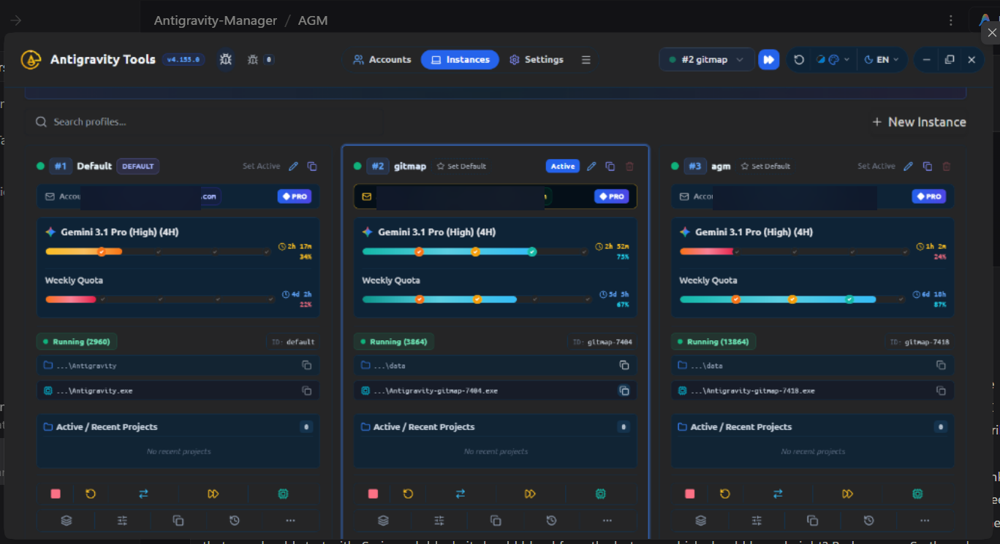
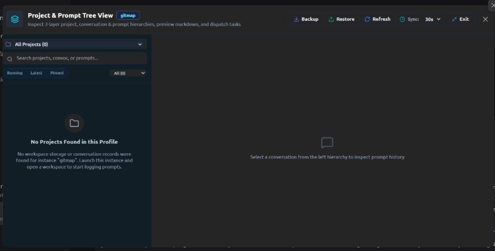
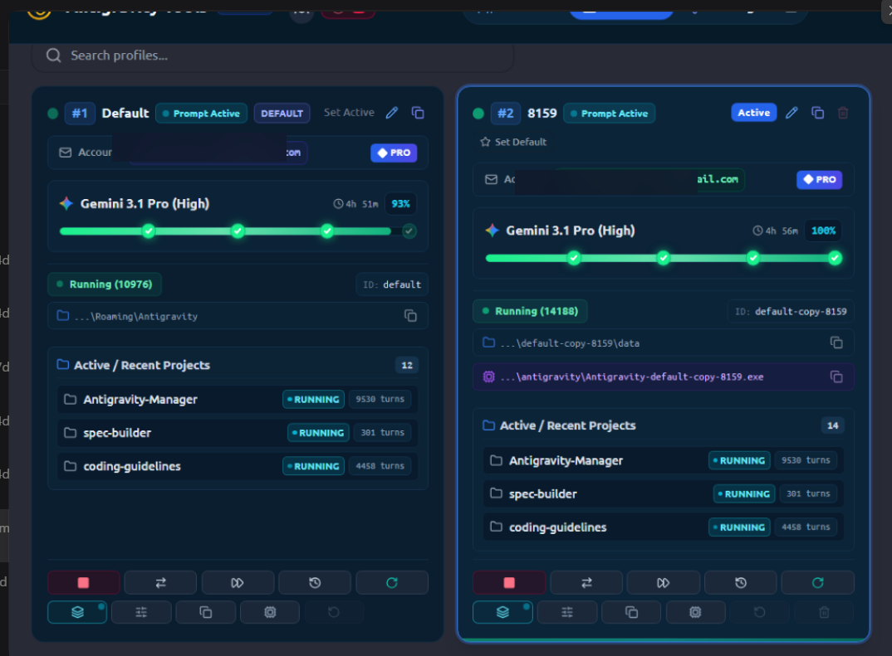
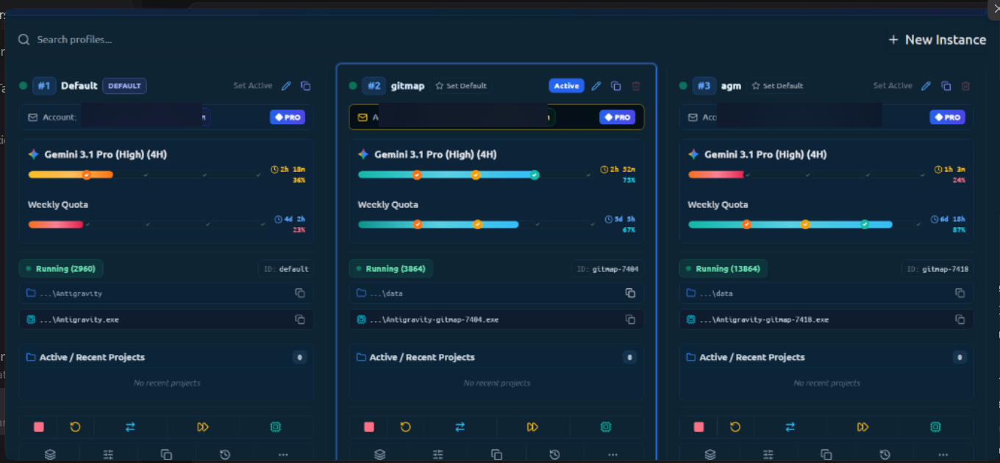
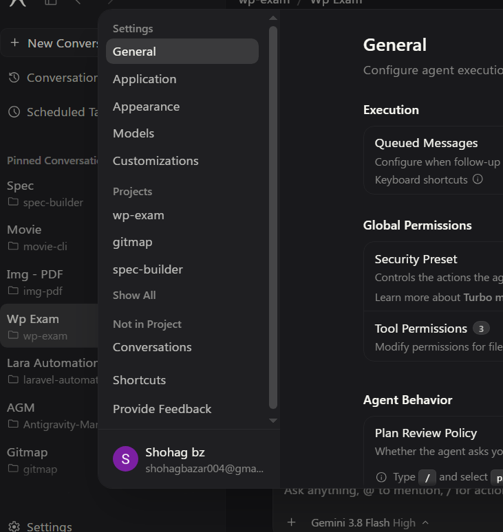

# Architecture Spec: Prompt Tree Detection, Progress Bar Glow Restoration & Running Sync

**Slug:** `136-prompt-tree-detection-progress-glow-and-running-sync`
**Version:** v4.157.0 (target)
**Status:** IN PROGRESS

---

## User Request (Verbatim)

> "The prompt tree is fully empty. Now you cannot detect any project that has, let's say, recent running or nothing in the tree view of the prompt. You can check, you can do the end-to-end testing to figure out what is the root cause of it. And also, I do not like this color. I don't like the VS Code dark color as well. I'm just going to give you the VS Code dark color. So UI, you need to work on it. It's very terrible. If you can open a NPM on the browser, I could quickly review the design and get back to you on the issues. That could be one way to quickly check. The tree view is fully empty, so you need to work on it. The second problem is the coloring of the progress bar. So I think you need to explain the progress bar in very much detail. So the previous one, like the glowing effect, I really like it. I really like the green color. I need that green color. The previous green color. The current one is kind of blue. I don't really like it. So previous color is the one that you should start with. So in each block, it should blend from the last one, which should be red, right? Red, orange. So the colors on these blocks should be different. That's what I asked you. I think this is what you need to change and have the previous glowing effect and the color. I really love the previous color. That's lovely. Try to have this back. I don't understand this. Along with that, you need to confirm that the switching... when the IDE is running, it should automatically sync out. That means it's going to have the, let's say, synchronization and also the checking of if any one of the credits is actually finished on less than the expected credit, and switch the account, and also reinject the running prompt."

---

## Screenshots (Sanitized)







---

## Root Cause Discovery (E2E Testing Results)

**Confirmed root cause of empty prompt tree:**

`detect_running_projects()` in `src-tauri/src/modules/repo_db.rs` scans ONLY `{data_dir}/User/workspaceStorage/**/workspace.json`. However, on this Windows deployment, ALL `workspaceStorage` directories are **empty** (`items: 0`). The actual project and conversation data lives in `conversation_summaries.db` under `{home}/.gemini/{profile}/conversation_summaries.db`.

Confirmed database contents:
- `C:\Users\Administrator\.gemini\antigravity\conversation_summaries.db` → Wp Exam project (5 conversations, IDLE)
- `C:\Users\Administrator\.antigravity_tools\instances\gitmap-7404\home\.gemini\antigravity\conversation_summaries.db` → Gitmap project (active RUNNING conversations)
- `C:\Users\Administrator\.antigravity_tools\instances\gitmap-7418\home\.gemini\antigravity\conversation_summaries.db` → Antigravity-Manager project
- `C:\Users\Administrator\.antigravity_tools\instances\slides-751\home\.gemini\antigravity\conversation_summaries.db` → flat-slide-show project

**The fix:** `compute_project_conversation_tree` already reads `conversation_summaries.db` (lines 4162–4312), but `list_running_projects()` at line 4071 only returns projects previously inserted by `detect_running_projects()` — which depends on empty `workspaceStorage`. Projects therefore never populate `running_projects` SQLite table, leaving the tree view with 0 entries.

**Fix strategy:** Supplement `compute_project_conversation_tree` to extract projects directly from `conversation_summaries.db` workspace URIs even when `running_projects` table is empty. Display top 15 recent projects sorted by `last_modified_time` DESC regardless of running status.

---

## Task Decomposition

| ID | Task | Target Files | Worker |
|----|------|-------------|--------|
| Task-01 | Empty Prompt Tree — Multi-Source Project Discovery Fix | `src-tauri/src/modules/repo_db.rs` | Worker 02 |
| Task-02 | Restore Neon Glowing Green Progress Bar (`#1af18d`) | `src/components/accounts/QuotaProgressBar.tsx`, `src/components/common/WaterDrainProgressBar.tsx` | Worker 01 |
| Task-03 | Prompt Tree Modal Header — Seq, Profile Name, Executable Path | `src/components/instances/PromptTreeViewModal.tsx` | Worker 01 |
| Task-04 | Instances.tsx wiring for header props + button de-greening | `src/pages/Instances.tsx`, `src/components/instances/InstanceTable.tsx` | Worker 01 |
| Task-05 | In-flight auto-switch verification (auto_switcher.rs) | `src-tauri/src/modules/auto_switcher.rs` | Worker 02 |

---

## Progress Bar Specification (User Accepted: `#1af18d` neon green)

### Tier Thresholds

| Tier | Range | Gradient | Glow |
|------|-------|----------|------|
| Critical | `pct < 25%` | `from-rose-600 to-red-500` | none |
| Warning | `25% ≤ pct < 50%` | `from-amber-500 to-orange-400` | none |
| Healthy | `50% ≤ pct < 75%` | `from-emerald-500 to-[#1af18d]` | `shadow-[0_0_8px_rgba(26,241,141,0.7)]` |
| Excellent | `pct ≥ 75%` | `from-emerald-400 to-[#1af18d]` | `shadow-[0_0_12px_rgba(26,241,141,0.85)]` |

### Checkpoint Nodes (Milestone Dots)

| Index | Position | When Filled | Style |
|-------|----------|------------|-------|
| 0 | 100% | always filled at 100 | `bg-[#1af18d] border-[#1af18d] shadow-[0_0_8px_rgba(26,241,141,0.8)]` |
| 1 | 75% | pct ≥ 75 | `bg-emerald-400 border-emerald-300 shadow-[0_0_6px_rgba(26,241,141,0.6)]` |
| 2 | 50% | pct ≥ 50 | `bg-amber-400 border-amber-300 shadow-none` |
| 3 | 25% | pct ≥ 25 | `bg-orange-500 border-orange-400 shadow-none` |

### Percent Label Color
- `pct ≥ 50%`: `text-emerald-700 dark:text-[#1af18d]`
- `pct ≥ 25%`: `text-amber-700 dark:text-amber-400`
- `pct < 25%`: `text-rose-600 dark:text-rose-400`

### Reset Countdown Time Color
- `> 1h remaining`: `text-emerald-700 dark:text-[#1af18d]`

---

## Prompt Tree Modal Header Specification

**Current:** No sequence or executable info displayed.

**Required header identity:** `[#seq] [Profile Name] [...\Antigravity.exe]`

### Props to Add to `PromptTreeViewModalProps`

```typescript
interface PromptTreeViewModalProps {
    isOpen: boolean;
    onClose: () => void;
    instanceId: string;
    instanceName: string;
    sequenceNumber?: number;         // instConfig.seq_num
    executablePath?: string;         // instConfig.executable_path — display only trailing \filename
    initialSelectedProjectId?: string;
}
```

### Header Layout (lines 1773–1791)

```tsx
<div className="flex items-center gap-2 flex-wrap">
    {/* Sequence badge */}
    {sequenceNumber && (
        <span className="rounded-[5px] bg-slate-100 dark:bg-[#0c2438] px-2 py-0.5 text-[11px] font-bold text-slate-700 dark:text-slate-300 border border-slate-200 dark:border-[#15334d]">
            #{sequenceNumber}
        </span>
    )}
    {/* Profile name */}
    <h2 className="text-base font-bold text-slate-900 dark:text-white">{instanceName}</h2>
    {/* Executable trailing path */}
    {executablePath && (
        <span className="rounded-[5px] bg-slate-100 dark:bg-[#0c2438] px-2 py-0.5 text-[10px] font-mono text-slate-500 dark:text-slate-400 border border-slate-200 dark:border-[#15334d] max-w-[200px] truncate" title={executablePath}>
            ...{executablePath.replace(/^.*[/\\]/, '\\')}
        </span>
    )}
</div>
```

---

## In-Flight IDE Auto-Sync Verification

The auto-switcher in `src-tauri/src/modules/auto_switcher.rs` should:
1. Detect when an instance is actively running a prompt (prompt liveness heartbeat).
2. Accelerate the quota check interval to ≤15s when a prompt is actively running (vs. default 60s+).
3. On 429 / quota exhaustion: trigger `check_and_rotate_with_options(None, true)` immediately.
4. After account switch: validate that `.antigravity_resume_task.json` is re-seeded in the active workspace.
