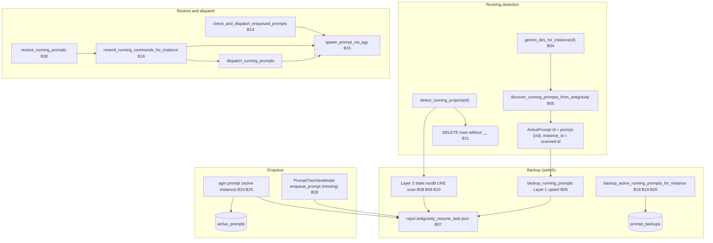
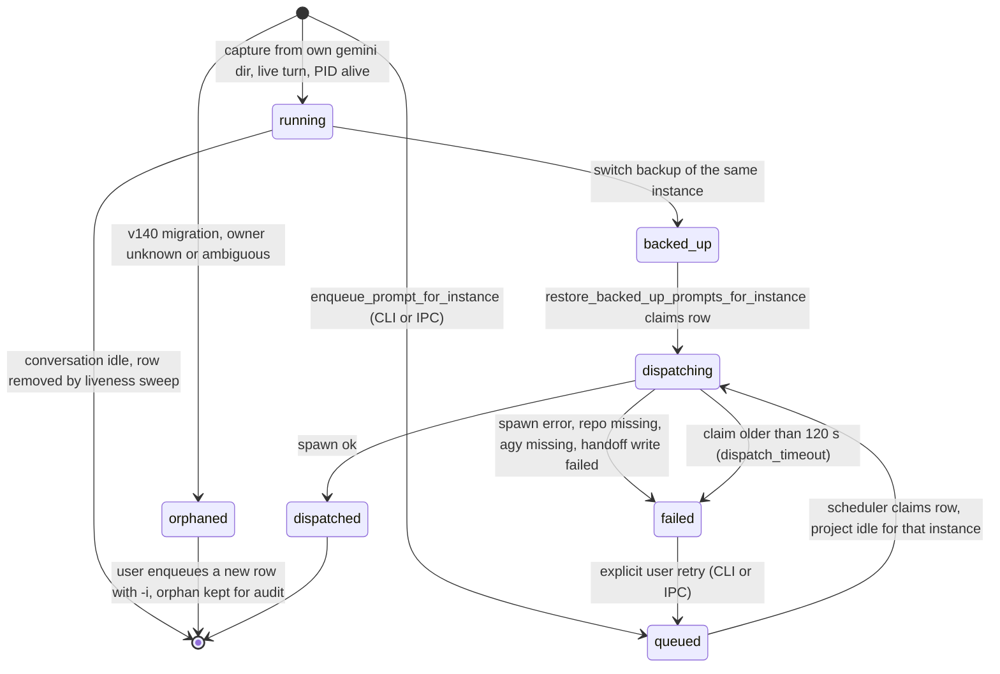

# Architecture Specification: Per-Instance Prompt Attribution for Running, Backup, Queue, and Restore

| Field | Value |
|---|---|
| Spec | 140 |
| Slug | `140-per-instance-prompt-attribution-backup-queue` |
| Created | 2026-10-06 |
| Status | planned (no application code is written in this run) |
| Parent plan | `.ai-memory/plans/140-per-instance-prompt-attribution-backup-queue.md` |
| Subtasks owned by this spec | `.ai-memory/plans/subtasks/140-per-instance-prompt-attribution-backup-queue/01-canonical-instance-key-and-per-instance-resume-file.md`, `02-backup-queue-restore-pipeline-fixes.md`, `03-cli-and-ipc-parity.md` |
| Companion spec | `02-spec/21-app/140-per-instance-prompt-attribution-backup-queue/02-component-and-e2e-spec.md` (component and end-to-end runbook, written by another agent) |
| Design source | `.ai-memory/temp-agents/95-per-instance-prompt-attribution-backup-queue/target-design.md` (decisions D1 to D10) |
| Research source | `.ai-memory/temp-agents/95-per-instance-prompt-attribution-backup-queue/research-findings.md` |

## 1. Related Specs

| Spec | One-line relation |
|---|---|
| 92 | CLI switch on a copied instance; a queued prompt must stay queued across the switch. This spec keeps that rule and makes it per instance. |
| 93 | Zero-code CLI manual; processes without `--user-data-dir` or at `%APPDATA%\Antigravity` are protected. The refusal rules in section 6.9 follow the same protection idea. |
| 94 | Blind-AI laws L1 to L8; law L4 says the UI calls the same Rust functions as the CLI, law L8 restricts test instances to `test-cli-flow*` / `test-diag*`. Section 6.10 is built on L4. |
| 100 | Named instances read only their own home `.gemini`; the resume file keeps `session_id`; PID refresh 600 s (180 to 1200). Section 6.1 makes the "own home" rule the only source of the instance id. |
| 113 | Projects come from each instance's own `workspaceStorage`; running needs PID plus an active prompt; the tree takes `instance_id`. Section 6.7 keeps both rules. |
| 120 | `running_projects.id` is instance-prefixed and dedupe is by `(instance_id, cid)` with a 900 s window. Section 6.2 extends that dedupe key to every prompt table. |
| 121 | Composite id `{base}__{instance_id}`; running means `not_fully_idle > 0 AND status RUNNING`. Section 6.7 reuses both. |
| 122 | Four-gate running check. Section 6.7 removes the folder-name prefix match from Gate 4. |
| 123 | A dead process forces idle, with reason codes. Section 6.5 reuses reason codes for the `failed` status. |
| 132 | Turns idle for more than 120 s are not running; cache invalidation; match `instance_id` or `__{id}` suffix. Section 6.7 uses the same 120 s TTL and replaces substring matching with exact suffix matching. |

## User Request (Verbatim)

```text
# High Priority Instruction

You have learned how to do the end-to-end testing, and you know I have given you the prompt to test the anti-gravity manager based on the profile, based on the switch, auto-switch, how it's going to do. Now the problem is, when we have multiple instances, or even same instances, the current prompt running, taking the backup or the enqueue prompt, all of these are not right from the CLI methods and how the code is. 1st thing that I want you to do is observe the code where the bug is, 2nd, I want you to create an AI instruction in the plans folder specifying everything that AI needs to do in order to make this thing successful. All the test cases, all the end-to-end test cases that AI would execute in the machine based on the multiple instances. The things would be a little bit complicated because every time AI needs to know the instance name now in order to know which prompts is coming to which. 1st, you need to confirm that is it possible using anti-gravity, and you need to craft in there the CLI methods and also inside the UI how it would reuse the functionalities to make sure that it is working. I don't want you to code, I want you to think, and I want you to write that plan and let me know finally where you have written that plan. Also, so far what you have coded and learned, make sure that these are everything written inside the AI memory so that anytime I throw this conversation, you or any AI would read it and understand what went wrong and how you did these codes, what are the best practices and how to make sure the code does not break, and what are the end-to-end tests that we have discussed. So everything I've won inside the AI memory properly, and inject that in the what to read file. Make sure of that, your memories are safe in there, and make sure you do a git commit and push.

# Actionable Items Must Follow Non-Negotiable

1. Write spec under 02-spec/21-app/<slug>/ and enqueue plan task in .ai-memory/plans/<slug>.md (subtasks in .ai-memory/plans/subtasks/<slug>/) first
2. Search codebase exclusively via GitMap (gitmap aum search, gitmap find, gitmap cat, gitmap ps, gitmap py, gitmap llm train); TOTAL BAN on rg, ripgrep, grep, git grep, Select-String
3. Strictly use relative Git paths (02-spec/..., .ai-memory/..., cmd/...); only add the relative paths, never add the absolute path during your work, and ensure this is respected on the release page and in release notes as well
4. Observe the code where the bug is.
5. Create an AI instruction in the plans folder specifying everything that AI needs to do for success.
6. Confirm if it is possible using anti-gravity and craft CLI methods and UI functionalities.
7. Write the plan and inform where it is written.
8. Ensure all coded and learned information is written inside the AI memory.
9. Inject the information into the what to read file.
10. Ensure memories are safe and perform a git commit and push.

## Must follow and spawn agent using

[execute-parent-task-with-n-steps-v6](file;.agents/skills/execute-parent-task-with-n-steps-v6)

## Additional Instructions

- [/plan](slashCommand;plan) first before doing the work to reduce the credits.
- [/learn](slashCommand;learn) from [gitmap](file;.agents/skills/gitmap) skill to leverage GitMap high-speed search, toolchain discovery, and caching.
- Only add the relative paths, never add the absolute path during your work; this should be respected on the release page and in release notes as well.
```

## 2. Problem Statement and Root Cause

### 2.1 Problem statement

When two or more Antigravity instances run at the same time (or when one instance is relaunched by a switch), AGM cannot reliably say which instance a prompt belongs to. The observed symptoms are:

1. A prompt typed in instance A shows up as running in instance B, or in every instance.
2. A switch backup taken for instance B steals backup rows that belong to instance A, so A's prompts are restored into B or not restored at all.
3. An enqueued prompt from the UI is never queued in the database; it only overwrites a shared file in the repository folder.
4. A restore after a switch sends the same prompt two or three times, or re-sends prompts that are still running.
5. CLI commands without `-i` silently act on the active instance, and `agm prompt -n` is read as an instance flag by users while it really means `--node` (remote SSH).

### 2.2 Root cause (one sentence)

There is no canonical instance key that is set once when a prompt is captured and carried unchanged to dispatch: every layer re-derives it (`"default"`, `"__default__"`, `""`, the active instance, fuzzy `resolve_instance_id`, substring or `LIKE` matches, path-only joins), and the resume hand-off file is per repo instead of per (instance, repo, conversation), so identity is lost whenever two instances share a repo or a key fails to normalize.

## 3. Feasibility Verdict (D9)

**Verdict: possible for named instances; partially possible for backed-up and queued prompts until this spec is implemented; not yet proven live.**

AGM launches every named instance with `USERPROFILE`, `APPDATA`, `LOCALAPPDATA` (and `HOME` on Unix) pointed at `<instances>/<id>/home` (`src-tauri/src/modules/instance.rs:3586` to `:3618`; on macOS the launch goes through `open` at `src-tauri/src/modules/instance.rs:3440`). Antigravity therefore writes that instance's conversations under `<instances>/<id>/home/.gemini/{antigravity,antigravity-ide,antigravity-cli}`, which `gemini_dirs_for_instance` reads (`src-tauri/src/modules/repo_db.rs:824` to `:865`). The default instance owns the global `%USERPROFILE%\.gemini` store (`src-tauri/src/modules/repo_db.rs:841` to `:862`).

Antigravity writes no instance tag of its own (`app_data_dir` in `conversation_summaries.db` holds only product names such as `antigravity` and `antigravity-cli`). The instance link is therefore:

1. the folder the store lives in, and
2. the `instance_id` that AGM stamps at capture time.

Not yet proven live: that Antigravity honors the overridden profile for every file (the per-instance databases that exist today have 0 rows). The end-to-end spec must prove this first (E2E-01 in `02-component-and-e2e-spec.md`, AC-01 here) before any other test result is trusted. macOS `open -a` may drop the environment, so macOS is treated as unverified.

### 3.1 Per-prompt-type link table

| Prompt type | Where it is observed | How the instance link is known | Status today | Status after this spec |
|---|---|---|---|---|
| Running | `<instances>/<id>/home/.gemini/<flavor>/conversation_summaries.db` and `brain/<cid>/.system_generated/logs/transcript.jsonl` (`src-tauri/src/modules/repo_db.rs:956` to `:1099`) | Folder scanned by `gemini_dirs_for_instance(id)`; result is tagged with the scanned id (`src-tauri/src/modules/repo_db.rs:1084`) | Possible for named instances; default merges the host home and `instances/default/home` (B04); first row always counted as running (B05) | Possible: id stamped once from the scanned folder (D1), idle rows excluded (D5) |
| Backed up | `prompt_backups` in `backup-prompts.db` (`src-tauri/src/modules/backup_prompts_db.rs:140` to `:159`) and `active_prompts` rows with status `backed_up` | `prompt_backups.instance_id` (defaults to `'default'`, `src-tauri/src/modules/backup_prompts_db.rs:157`) | Partial: empty `instance_id` rows join every instance (B18), dedupe re-stamps the owner (B19) | Possible: dedupe key includes `instance_id`, no re-stamp (D2) |
| Queued | `active_prompts` with status `queued` (`src-tauri/src/modules/repo_db.rs:180` to `:193`) plus `.antigravity_resume_task.json` | `active_prompts.instance_id` (NOT NULL); resume file carries `instance_id` (`src-tauri/src/modules/repo_db.rs:790`) but lives per repo | Partial: the UI enqueue IPC does not exist (B28); the resume file collides across instances (B07) | Possible: NEW `enqueue_prompt` writes a `queued` row; per-instance hand-off (D3) |
| Resumed | `session_id` / `conversation_id` in the resume document (`src-tauri/src/modules/repo_db.rs:794` to `:795`); `agm_conversation_sequences` (`src-tauri/src/modules/repo_db.rs:226` to `:233`) | Conversation id only; sequences PK is `conversation_id` alone; row ids are `prompt-{cid}` (`src-tauri/src/modules/repo_db.rs:1080`) | Partial: a cloned instance can hold the same conversation id (clones copy summaries, `src-tauri/src/modules/instance.rs:1470` to `:1545`) | Possible: identity triple `(instance_id, conversation_id, repo_path)` and row id `prompt-{instance_id}-{conversation_id}` (D2) |

### 3.2 Storage table (per instance versus shared)

| Store | Location | Scope | Evidence |
|---|---|---|---|
| `conversation_summaries.db`, `brain/<cid>/.../transcript.jsonl`, `conversations/` | `<instances>/<id>/home/.gemini/<flavor>/` | per instance (named) | `src-tauri/src/modules/repo_db.rs:832` to `:840` |
| Same three stores for default | `%USERPROFILE%\.gemini\<flavor>\` (plus `<instances>/default/home/.gemini/<flavor>/` if present) | global, owned by default only | `src-tauri/src/modules/repo_db.rs:841` to `:862` |
| IDE data (`--user-data-dir`) | `<instances>/<id>/data`; default `%APPDATA%\Antigravity` | per instance | `src-tauri/src/modules/instance.rs:3586` to `:3588` |
| `workspaceStorage` | `<data_dir>/User/workspaceStorage` | per instance | spec 113 |
| `instances.json`, `instances.db` (`instance_processes`, `active_instance_selection`) | `%USERPROFILE%\.antigravity_tools\instances\` | shared, keyed by instance id | `src-tauri/src/modules/instance.rs:36` to `:80` |
| `repo_prompts.db` (`running_projects`, `active_prompts`, `agm_project_sequences`, `agm_conversation_sequences`, tree cache) | `%USERPROFILE%\.antigravity_tools\repo_prompts.db` | shared, `instance_id` column | `src-tauri/src/modules/repo_db.rs:142` to `:236` |
| `backup-prompts.db` (`backup_batches`, `prompt_backups`) | `%USERPROFILE%\.antigravity_tools\backup-prompts\backup-prompts.db` (or `data/backup-prompts/backup-prompts.db` next to the CLI when that folder exists) | shared, `instance_id` column | `src-tauri/src/modules/backup_prompts_db.rs:80` to `:109` |
| `.antigravity_resume_task.json` | `<repo_path>/` | shared per repo (collides) | `src-tauri/src/modules/repo_db.rs:1224` |

## 4. Bug Sites (B01 to B33)

B01 to B28 map one to one, in order, to the rows of the bug table in `research-findings.md` section A. Line numbers were re-checked with `gitmap aum search` on 2026-10-06; where a line moved, the current line is shown. B29 to B33 are supplementary sites found while re-checking and are part of the same problem class.

| ID | file:line (current) | Function | Flow | What goes wrong | Scope | Conf |
|---|---|---|---|---|---|---|
| B01 | `src-tauri/src/modules/instance.rs:4375` (fn at `:4372`) | `resolve_instance_id` | key | Empty or `"active"` returns the active instance; callers' empty-to-`"default"` fallback (for example `src-tauri/src/modules/repo_db.rs:1496` to `:1502`, `:1537` to `:1544`) only runs on `Err`, so it never fires, and rows with empty `instance_id` are attributed to whichever instance is active | both | high |
| B02 | `src-tauri/src/modules/instance.rs:4413` to `:4432` | `resolve_instance_id` | key | Fuzzy suffix match: `"8159"` resolves to `default-copy-8159`; storage code receives a guessed id | multi | med |
| B03 | `src-tauri/src/modules/instance.rs:25` to `:33` | `get_instance_home_dir` | key | An unresolved id such as `"__default__"` falls back to the raw string and silently creates `instances/__default__/home` | single | high |
| B04 | `src-tauri/src/modules/repo_db.rs:824` to `:865`; stamp at `:1084` | `gemini_dirs_for_instance`, `discover_running_prompts_from_antigravity` | running | `"all"` is treated as default, so `backup_running_prompts("all")` stamps `instance_id = "all"`; default merges host home and sandboxed `instances/default/home` under one id | both | high |
| B05 | `src-tauri/src/modules/repo_db.rs:991` to `:995` | `discover_running_prompts_from_antigravity` | running/backup | `prompts.is_empty()` makes the first row always "running", plus up to 5 idle rows; idle conversations are backed up as running | both | high |
| B06 | `src-tauri/src/modules/repo_db.rs:1195` to `:1203` | `backup_running_prompts` Layer 1 | backup | Upsert on `prompt-{cid}` never updates `instance_id` (stale owner); no `instance_repo_paths` filter since v4.124.0 | multi | med |
| B07 | `src-tauri/src/modules/repo_db.rs:1224`, `:1382`, `:1603`, `:2175`, `:3376`, `:3595`; `src-tauri/src/bin/agm.rs:3154`; `src/components/instances/PromptTreeViewModal.tsx:1237` | resume-file writers | restore | `.antigravity_resume_task.json` is per repo; two instances on one repo overwrite each other | multi | high |
| B08 | `src-tauri/src/modules/repo_db.rs:1239` to `:1310` | `backup_running_prompts` Layer 2 | backup | Scans every workspace project (`is_running` not checked) and backs up any `state.vscdb` key `LIKE %chat%/%task%/%prompt%` | both | high |
| B09 | `src-tauri/src/modules/repo_db.rs:1316` to `:1319`, `:1337` | `backup_running_prompts` Layer 2 | backup | Fallback and dedupe queries have no instance filter; `LIKE %repo_name%` matches neighbor repos | multi | high |
| B10 | `src-tauri/src/modules/repo_db.rs:1366`, `:1390` | `backup_running_prompts` Layer 2 | restore | `session_id` is set to the workspace project id, not a conversation id | both | high |
| B11 | `src-tauri/src/modules/repo_db.rs:626` | `detect_running_projects` | running | `DELETE FROM running_projects WHERE workspace_storage_path IS NULL OR instr(id,'__')=0` wipes Layer-1 rows (`:1188` to `:1193` insert `NULL` paths and ids without `__`) and CLI rows | both | high |
| B12 | `src-tauri/src/modules/repo_db.rs:2008` to `:2012` | `is_prompt_running_for_project` Gate 4 | running | Folder-name and prefix match: `app` matches `app-v2` | both | med |
| B13 | `src-tauri/src/modules/repo_db.rs:2060` to `:2064`, `:2192` to `:2195` | `check_and_dispatch_enqueued_prompts` | queue | Treats `backed_up` switch backups as queue items, races `dispatch_running_prompts`, marks `dispatched` even when `sent = false` | both | high |
| B14 | `src-tauri/src/modules/repo_db.rs:2706` to `:2709` | `get_project_execution_status` | running | Substring instance filter: `"default"` matches `x__default-copy-8159` | multi | high |
| B15 | `src-tauri/src/modules/repo_db.rs:3125`, `:3164` | `spawn_prompt_via_agy` | restore | Worker key uses the raw id (`"default"` and `"__default__"` are two workers); `"__default__"` takes the named-instance HOME branch; `-p` starts a new chat instead of resuming the conversation | both | high |
| B16 | `src-tauri/src/modules/repo_db.rs:3248`, `:3317` | `resend_running_commands_for_instance` | restore | Re-sends rows still `running` (duplicates), dedupes by repo only, resume file drops `session_id` (`:3377` to `:3390`) | both | high |
| B17 | `src-tauri/src/modules/repo_db.rs:3507`, `:3512`, `:3534` | `auto_resume_recent_prompts` | restore | `LIKE %repo_name%`, then falls back to the shared resume file | multi | med |
| B18 | `src-tauri/src/modules/backup_prompts_db.rs:249` to `:252`; re-stamp at `:338` | `backup_active_running_prompts_for_instance` | backup | Empty `instance_id` rows go into every instance's backup and get re-stamped with the current target | multi | high |
| B19 | `src-tauri/src/modules/backup_prompts_db.rs:345`, `:353`; also `:363`, `:371` | same | backup | Unrestored dedupe ignores instance, then `UPDATE prompt_backups SET ... instance_id = ?3` reassigns the row to the current target: B steals A's backup | multi | high |
| B20 | `src-tauri/src/modules/backup_prompts_db.rs:300` to `:304` | same | backup | Conversation id from `scan_conversations` is matched by "uris contains repo", with no instance filter | multi | med |
| B21 | `src-tauri/src/modules/auto_switcher.rs:1690` to `:1695` | `execute_profile_rotation_with_context` | restore | A `"default"` target becomes `None`, which means "re-send every instance's prompts" | multi | high |
| B22 | `src-tauri/src/modules/auto_switcher.rs:1431`, `:1595`, `:1715` | same (cross-instance) | backup/restore | Backup under `current_instance_id`, dispatch under `target.instance_id` (`inst_id`, `:1428`, `:1685`): moved prompts are never restored | multi | high |
| B23 | `src-tauri/src/modules/integration.rs:341` to `:437`; `src-tauri/src/modules/telegram_inbound.rs:1355`, `:1385`, `:2729`, `:2788`; `src-tauri/src/modules/account.rs:1743` | desktop switch / Telegram | key | Hardcoded `"default"` even when the effective target differs; restore runs three paths back to back (`restore_and_inject_prompts_for_instance`, `restore_running_prompts` then resend, `dispatch_running_prompts`). Note: `account.rs:1743` is a documented default-only path and is correct; it must keep `"default"` and must not be changed to `target_ide` | both | med |
| B24 | `src-tauri/src/bin/agm.rs:3008` | `cmd_prompt_dispatch` | queue | `-n` means `--node` (remote SSH), not instance; only `-i/--instance` targets an instance | both | high |
| B25 | `src-tauri/src/bin/agm.rs:3129` to `:3150` | `cmd_prompt_dispatch` | queue | No `-i` means the active instance, not the owner of the current folder; the `running_projects` id has no `__inst` and storage path `''`, so the row is hidden then deleted; `session_id` is the repo slug; row marked `dispatched` even if spawn fails (`:3184`) | both | high |
| B26 | `src-tauri/src/bin/agm.rs:1640` | `cmd_which_prompts_running` | running | Joins prompts to projects by path, no instance check | multi | high |
| B27 | `src-tauri/src/bin/agm.rs:3372` to `:3376` | `cmd_resend_running_commands` | restore | Backs up only the active instance, re-sends all instances | multi | high |
| B28 | `src/components/instances/PromptTreeViewModal.tsx:1335` | `handleEnqueuePrompt` | queue | IPC `enqueue_prompt` does not exist in Rust (0 hits in `src-tauri/src`); the call always fails and falls back to writing the shared resume file (`:1344` to `:1363`) | both | high |
| B29 | `src-tauri/src/modules/instance.rs:3565` to `:3575` (macOS), `:3669` to `:3680` (Windows, Linux) | `launch_instance_inner_with_extra_workspaces` | restore | Every relaunch with `reinject_prompts` runs `restore_running_prompts`, then `resend_running_commands_for_instance`, then `dispatch_running_prompts`: three send paths for one restore | both | high |
| B30 | `src-tauri/src/modules/backup_prompts_db.rs:614`; `src-tauri/src/modules/instance.rs:2805` to `:2816` | `restore_running_prompts_for_instance`, `restore_and_inject_prompts_for_instance` | restore | `restore_running_prompts_for_instance` already calls `resend_running_commands_for_instance` itself, so every caller that resends afterwards sends twice | both | high |
| B31 | `src-tauri/src/bin/agm.rs:4169` to `:4171` | `cmd_restore_running_prompts` | restore | `rrp` calls resend and dispatch before it restores from the backup DB, then the restore resends again (B30) | both | high |
| B32 | `src-tauri/src/modules/agy_cleaner.rs:95` to `:124`, `:192` to `:196` | `get_gemini_candidate_dirs`, `scan_conversations` | backup/running | Scans the global and every named instance's gemini dirs with one `seen_cids` set and returns untagged items; the same conversation id in two instances collapses to whichever dir is scanned first | multi | high |
| B33 | `src-tauri/src/modules/notification_hub.rs:570`; `src-tauri/src/modules/agy_cleaner.rs:377`; `src-tauri/src/bin/agm.rs:7935`, `:8346`; `src-tauri/src/modules/repo_db.rs:1283`, `:3534` | resume-file readers | restore | Readers open the per-repo resume file with no check that its `instance_id` matches the instance being evaluated | multi | high |

## 5. Current Data Flow (As-Is)



### 5.1 Running detection (as-is)

1. `detect_running_projects(instance_id)` (`src-tauri/src/modules/repo_db.rs:512`) resolves the id through `resolve_instance_id` (`:514`, B01), reads that instance's `workspaceStorage`, writes composite ids, and then runs the global `DELETE ... instr(id,'__')=0` (`:626`, B11) that also deletes rows written by the backup path and by `agm prompt`.
2. `discover_running_prompts_from_antigravity(instance_id)` (`:956`) calls `gemini_dirs_for_instance` (`:824`, B04). For `"default"`, `""`, `"__default__"`, and `"all"` it reads the host home and `instances/default/home`. It counts the first row as running regardless of idle state (`:992`, B05) and builds `prompt-{cid}` ids (`:1080`) with `status = "backed_up"` (`:1089`).
3. `is_prompt_running_for_project` (`:1700`) Gate 4 matches by folder name or prefix (`:2008` to `:2012`, B12). `get_project_execution_status` (`:2692`) filters instances by substring (`:2706` to `:2709`, B14). `agm wpr` (`src-tauri/src/bin/agm.rs:1597`) joins prompts to projects by path only (`:1640`, B26).

**Identity is lost at:** B01 (empty id becomes the active instance), B04 (`"all"` stamped as an id; default merges two stores), B11 (rows from the other writer deleted), B12 and B14 (neighbor repos and neighbor instances match), B26 (cross-instance join), B32 (same conversation id in two instances collapses).

### 5.2 Backup (as-is)

1. `backup_running_prompts(instance_id)` (`src-tauri/src/modules/repo_db.rs:1122`) retires stale `running` rows to `dispatched` (`:1128` to `:1132`), transitions `running` to `backed_up` for `"all"`, `default/__default__`, or exact id (`:1141` to `:1159`).
2. Layer 1 upserts `prompt-{cid}` rows without updating `instance_id` (`:1195` to `:1203`, B06) and writes the repo-level resume file (`:1224`, B07).
3. Layer 2 runs `detect_running_projects` and scans `state.vscdb` of every project, running or not (`:1239` to `:1310`, B08), falls back to `LIKE %repo_name%` and path-only dedupe (`:1316` to `:1337`, B09), stores the project id as `session_id` (`:1366`, `:1390`, B10), and writes the resume file again (`:1382`, B07).
4. `backup_active_running_prompts_for_instance` (`src-tauri/src/modules/backup_prompts_db.rs:230`) mixes in empty-`instance_id` rows (`:249` to `:252`, B18), matches conversation ids by URI substring without instance (`:300` to `:304`, B20, fed by B32), dedupes without instance and re-stamps `instance_id` (`:345` to `:373`, B19).

**Identity is lost at:** B06, B07, B08, B09, B10, B18, B19, B20.

### 5.3 Enqueue and queue (as-is)

1. UI: `handleEnqueuePrompt` (`src/components/instances/PromptTreeViewModal.tsx:1325`) calls `enqueue_prompt` (`:1335`), which is not registered in Rust (B28), and falls back to writing the repo-level resume file with `status: 'queued'` (`:1344` to `:1363`, B07). No `queued` row is ever written.
2. CLI: `agm prompt` (`src-tauri/src/bin/agm.rs:2913`) parses `-i/--instance` (`:2995` to `:3003`) and `-n/--node` (`:3008`, B24). Without `-i` and without a sequence target it uses the active instance (`:3129` to `:3131`, B25), inserts a `running_projects` row without `__` and with storage path `''` (`:3140` to `:3145`, deleted later by B11), inserts an `active_prompts` row as `dispatched` with the repo slug as `session_id` (`:3146` to `:3151`), writes the repo resume file (`:3154`, B07), and spawns `agy` without checking the result (`:3184`).
3. Scheduler: `check_and_dispatch_enqueued_prompts(target_instance)` (`src-tauri/src/modules/repo_db.rs:2054`) selects `backed_up`, `queued`, `pending` (`:2060` to `:2064`, B13), matches instances through `resolve_instance_id` on both sides (`:2088` to `:2096`, B01), writes the repo resume file (`:2175`, B07), spawns, and marks `dispatched` whether or not `sent` is true (`:2192` to `:2195`, B13).

**Identity is lost at:** B07, B13, B24, B25, B28.

### 5.4 Restore and dispatch (as-is)

1. Desktop switch (`src-tauri/src/modules/integration.rs:341` to `:437`): backs up `"default"`, relaunches, then runs `restore_and_inject_prompts_for_instance("default")` (which itself runs restore, resend, dispatch, `src-tauri/src/modules/instance.rs:2805` to `:2816`), then `restore_running_prompts_for_instance` (which resends again, `src-tauri/src/modules/backup_prompts_db.rs:614`), then `dispatch_running_prompts` again (B23, B29, B30).
2. Instance launch with reinject (`src-tauri/src/modules/instance.rs:3565` to `:3575`, `:3669` to `:3680`): restore, resend, dispatch (B29).
3. Auto switcher (`src-tauri/src/modules/auto_switcher.rs:1415`): backs up `current_instance_id` (`:1431`), requeues it again on cross-instance (`:1595`), then after 5 s resends with `None` when the target is `"default"` (`:1690` to `:1695`, B21) and dispatches under the target id (`:1715`, B22).
4. Telegram (`src-tauri/src/modules/telegram_inbound.rs:1355`, `:1385`, `:2729`, `:2788`): hardcoded `"default"` and `resend_all_running_commands` (all instances) (B23).
5. CLI `rrc` (`src-tauri/src/bin/agm.rs:3326`): backs up the active instance only, re-sends all instances (`:3372` to `:3376`, B27). CLI `rrp` (`:4119`): resend and dispatch before restore, then restore resends again (`:4169` to `:4171`, B31).
6. `resend_running_commands_for_instance` (`src-tauri/src/modules/repo_db.rs:3237`) includes `running` rows (`:3248`, B16), dedupes by repo only (`:3317`), and writes a resume file without `session_id` (`:3376` to `:3390`). `spawn_prompt_via_agy` (`:3106`) keys workers by the raw id (`:3125`) and picks the HOME override by `!= "default"` (`:3164`, B15).
7. `auto_resume_recent_prompts` (`:3437`) uses `LIKE %repo_name%` and the shared resume file (`:3507` to `:3534`, B17).

**Identity is lost at:** B15, B16, B17, B21, B22, B23, B27, B29, B30, B31, B33.

## 6. Target Architecture (To-Be)

### 6.1 Canonical instance key (D1)

Two functions, both in `src-tauri/src/modules/instance.rs`, next to `resolve_instance_id` (`:4372`):

```rust
/// Storage-layer key. Exact registry match only. Never returns the active instance.
pub fn canonical_instance_id(raw: &str) -> Result<String, String>;

/// Input-layer resolver for CLI and UI text (`#2`, `2`, `8159`, display name, `active`).
/// Fails with a candidate list when more than one instance matches.
pub fn resolve_instance_input(input: &str) -> Result<String, String>;
```

Rules for `canonical_instance_id`:

1. Trim the input. `""`, `"default"`, `"__default__"` (case-insensitive) return the default instance id: the registry entry with `is_default` or `id == "default"`; if no such entry exists, return `"default"` (the global store is always owned by default).
2. An exact registry id (case-insensitive compare, registry casing returned) returns that id.
3. Anything else returns `Err("unknown instance id '<raw>'; known: <id1>, <id2>, ...")`. `"all"` and `"active"` are errors here; code that means "all instances" uses an explicit scope type (rule 5).
4. It never creates folders and never calls `get_active_instance_id`.
5. List functions take `InstanceScope` instead of a magic string:

```rust
pub enum InstanceScope {
    One(String), // already canonical
    All,
}
```

Rules for `resolve_instance_input`:

1. Exact id or exact name (case-insensitive) wins.
2. `#N`, `N`, `ins-N`, `instance-N` match `seq_num == N`.
3. A suffix such as `8159` or `-8159` matches only when exactly one instance id or name ends with `-8159`; two or more matches return `Err("ambiguous instance '<input>': candidates <id1>, <id2>")`.
4. The literal word `active` returns `get_active_instance_id()`; this is the only place the active instance may be used, and only when the user typed `active`.
5. Empty input returns `Err("instance required")`. Callers that allow "no instance" handle that before calling.
6. The result is passed through `canonical_instance_id` before it is returned.

Rules for all storage code (`src-tauri/src/modules/repo_db.rs`, `src-tauri/src/modules/backup_prompts_db.rs`, `src-tauri/src/modules/agy_cleaner.rs`, the switch paths):

1. Never call `resolve_instance_id` or `get_active_instance_id`. The current calls in `src-tauri/src/modules/repo_db.rs` at `:514`, `:1496`, `:1537`, `:1706`, `:2088`, `:2090`, `:2534`, `:2618`, `:2650`, `:2700`, `:2785`, `:3274`, `:3283`, `:3288`, `:4028`, `:4152`, `:4235`, `:4316`, `:4442` are replaced by `canonical_instance_id` (or by plain equality where both sides are already canonical).
2. `get_instance_home_dir` (`src-tauri/src/modules/instance.rs:25`) calls `canonical_instance_id` and returns `Err` for an unknown id instead of creating `instances/<raw>/home` (fixes B03). It still creates `home` for a registered id.
3. `gemini_dirs_for_instance` (`src-tauri/src/modules/repo_db.rs:824`) takes a canonical id. A new `gemini_dirs_tagged(InstanceScope)` returns `(instance_id, dir)` pairs; `All` iterates registry ids and tags each dir with its owner, so nothing is ever stamped `"all"` (fixes B04).
4. The instance id on a prompt is stamped once, at capture, from the `(instance_id, dir)` pair that produced it, and no later `UPDATE` may change `instance_id` (fixes B06, B19).

Default store merge (B04): the default instance keeps both the host `%USERPROFILE%\.gemini\<flavor>` and `<instances>/default/home/.gemini/<flavor>` because both belong to default. Each captured row records which directory it came from in a new `source_dir` column (section 6.2), so `agm prompts trace` can show it.

### 6.2 Identity triple and schema changes (D2)

Every prompt row carries `(instance_id, conversation_id, repo_path)`. In `active_prompts`, `session_id` is the conversation id and must never hold a project id or repo slug (fixes B10, B25).

Path equality uses one normalizer, `normalize_path_for_compare` (`src-tauri/src/modules/repo_db.rs:2473`), made `pub(crate)`: lowercase on Windows, forward slashes, no trailing slash. No join uses `LIKE %repo_name%`, substring `contains`, or folder-name prefix matching (fixes B09, B12, B14, B17, B20).

#### 6.2.1 `active_prompts` (`src-tauri/src/modules/repo_db.rs:180`)

| Change | Detail |
|---|---|
| Row id for captured prompts | `prompt-{instance_id}-{conversation_id}` (was `prompt-{cid}`, `:1080`) |
| Row id for enqueued prompts | `queued-{instance_id}-{uuid}` (several queued prompts may target one conversation) |
| Row id for CLI dispatch | `cli-{instance_id}-{uuid}` |
| NEW column `status_reason TEXT` | Reason code for `failed` and `orphaned` (for example `spawn_failed`, `repo_missing`, `agy_missing`, `dispatch_timeout`, `legacy_owner_unknown`, `legacy_owner_ambiguous`) |
| NEW column `source_dir TEXT` | Gemini directory (or `cli`, `ui`, `backup_restore`) that produced the row |
| NEW column `attempts INTEGER NOT NULL DEFAULT 0` | Dispatch attempts; restore never retries a row more than once per switch |
| NEW partial unique index | `CREATE UNIQUE INDEX IF NOT EXISTS idx_active_prompts_identity ON active_prompts(instance_id, session_id) WHERE status IN ('running','backed_up') AND session_id IS NOT NULL AND session_id <> ''` |
| Existing index kept | `idx_active_prompts_instance_status` (`:204` to `:208`) |

#### 6.2.2 `agm_conversation_sequences` (`src-tauri/src/modules/repo_db.rs:226`)

Primary key becomes `(instance_id, conversation_id)`; `seq_id` stays globally `UNIQUE` so `C001` codes remain unique across instances. The queries at `:3786`, `:3791`, `:3806`, `:3812` add `AND instance_id = ?`. Migration: create `agm_conversation_sequences_v2` with the new key, copy rows, drop the old table, rename (inside one transaction).

#### 6.2.3 `running_projects` (`src-tauri/src/modules/repo_db.rs:165`)

Every writer uses the composite id `{base}__{instance_id}` (spec 121): `detect_running_projects`, the Layer-1 insert in `backup_running_prompts` (`:1188` to `:1193`), and `cmd_prompt_dispatch` (`src-tauri/src/bin/agm.rs:3140` to `:3145`). The global `DELETE` at `:626` is replaced by a per-instance delete that only removes rows of `target_id` that this discovery path owns and did not see (fixes B11).

#### 6.2.4 `prompt_backups` (`src-tauri/src/modules/backup_prompts_db.rs:140`)

| Change | Detail |
|---|---|
| Dedupe key | `(instance_id, prompt_id)` first, then `(instance_id, normalized project_path, trimmed prompt_text)` |
| Removed | Both `UPDATE prompt_backups SET ... instance_id = ?3` statements (`:353`, `:371`); the reactivation update keeps the stored `instance_id` |
| Removed | The `instance_id IS NULL OR instance_id = ''` alternatives in restore queries (`:363`, `:530` to `:540`) after migration |
| NEW column `conversation_instance_id TEXT` | Not added. Conversation id is taken from the tagged scan of the same instance (section 6.7), so one `instance_id` column is enough |
| NEW partial unique index | `CREATE UNIQUE INDEX IF NOT EXISTS idx_prompt_backups_identity ON prompt_backups(instance_id, prompt_id) WHERE is_restored = 0` |

### 6.3 Migration of legacy rows (D2)

One function, `migrate_prompt_instance_ids_v140()`, in `src-tauri/src/modules/repo_db.rs`, with a twin for the backup DB in `src-tauri/src/modules/backup_prompts_db.rs`. It runs once per database, guarded by a NEW table `agm_schema_migrations(name TEXT PRIMARY KEY, applied_at INTEGER NOT NULL)` with the row name `v140_instance_ids`.

Order (fail before the point of no return):

1. Copy the database file to `<db>.pre-v140.bak` next to it. If the copy fails, stop and log; do not migrate.
2. Open one transaction.
3. `UPDATE ... SET instance_id = '<default id>' WHERE instance_id = '__default__'`.
4. For each row with `instance_id` in `('', 'all')` or `NULL`:
   1. If the row has a non-empty conversation id, look for it in every registered instance's gemini dirs (`conversation_summaries.db` `conversation_id`, or a `brain/<cid>` folder), using `gemini_dirs_tagged(InstanceScope::All)`.
   2. Exactly one owner: set `instance_id` to that owner and, for `active_prompts`, rewrite the row id to the new format when it is a captured row.
   3. Zero or more than one owner: set `status = 'orphaned'`, `status_reason = 'legacy_owner_unknown'` or `'legacy_owner_ambiguous'`, keep `instance_id = ''`.
5. Rebuild `agm_conversation_sequences` with the new key (section 6.2.2).
6. Insert the `agm_schema_migrations` row and commit.

Orphaned rows are listed by `agm prompts --json` with `instance_id: ""` and `status: "orphaned"`, are never dispatched, and can be re-owned only by an explicit user action (`agm prompt enqueue -i <id> ...` with the same text, which creates a new `queued` row; the orphan stays for audit).

### 6.4 Per-instance resume hand-off (D3)

#### 6.4.1 Research step (must finish before any rename)

Find every reader of `.antigravity_resume_task.json` and the exact name it reads. Known AGM readers (all inside AGM, verified 2026-10-06): `src-tauri/src/modules/repo_db.rs:1283`, `:3534`; `src-tauri/src/modules/notification_hub.rs:570`; `src-tauri/src/modules/agy_cleaner.rs:377`; `src-tauri/src/modules/instance.rs:4941`; `src-tauri/src/bin/agm.rs:7935`, `:8346`, `:11786`, `:14620`, `:14796`; `scripts/test-instance-e2e.ps1:439`. The open question is whether anything outside AGM (an Antigravity IDE extension or `agy` itself) reads the file. The research step:

1. Search the installed Antigravity resources and `agy` binary strings for `antigravity_resume_task` (read-only; record the file and offset found, or "not found").
2. Write a temporary file in a scratch repo opened only by a `test-cli-flow-*` instance and observe whether the IDE reacts (read-only observation; record evidence).
3. Record the answer in `02-spec/21-app/140-per-instance-prompt-attribution-backup-queue/02-component-and-e2e-spec.md` evidence and in this spec's open question 1.

#### 6.4.2 Target behavior

1. One writer function, `write_resume_handoff(prompt: &ActivePrompt, status: &str) -> ResumeHandoffOutcome`, in `src-tauri/src/modules/repo_db.rs`, replaces every inline writer (B07 sites). The document is always built by `resume_task_document` (`:780`) and always carries `instance_id`, `session_id`, `conversation_id`.
2. If the research step shows the reader is AGM only (or a reader that accepts a per-instance name), the writer uses `<repo_path>/.antigravity_resume_task.<instance_id>.json`.
3. If an external reader needs the legacy name, the per-instance queue in `repo_prompts.db` (`active_prompts` rows) is the source of truth and the repo file is only a pointer.
4. Every reader ignores a document whose `instance_id` is not the instance it is evaluating (fixes B33).
5. The UI never writes the resume file directly. `src/components/instances/PromptTreeViewModal.tsx:1237` and `:1346` are replaced by IPC calls (section 6.10).

#### 6.4.3 Fallback rule (AGENTS.md risky path replacement)

Keep the legacy `.antigravity_resume_task.json` write only when exactly one registered instance owns the repo (repo path found in exactly one instance's `running_projects` rows or workspace folders). When two or more own it, skip the legacy write and log `[ResumeHandoff] legacy file skipped: repo <path> owned by <id1>, <id2>`; the outcome is reported in `agm prompts trace`. Never silently drop the hand-off: if neither the per-instance file nor the DB row could be written, the row moves to `failed` with `status_reason = 'handoff_write_failed'`.

### 6.5 Status state machine (D4)

| Status | Meaning | Written by |
|---|---|---|
| `running` | Observed live in that instance's own gemini dir (section 6.7) | capture only |
| `backed_up` | Captured by a switch backup of the same instance | backup only |
| `queued` | User enqueue (CLI or UI) | `enqueue_prompt_for_instance` only |
| `dispatching` | Claimed by the single restore path or the scheduler | claim step |
| `dispatched` | The send succeeded (`spawn_prompt_via_agy` returned true) | dispatch step |
| `failed` | Send or hand-off failed; `status_reason` set | dispatch step or timeout sweep |
| `orphaned` | Legacy row with no unique owner | migration only |



Rules:

1. A claim is atomic: `UPDATE active_prompts SET status = 'dispatching', attempts = attempts + 1, updated_at = ?1 WHERE id = ?2 AND status = ?3`, and the caller proceeds only when `changes() == 1`. This removes the race between the scheduler and the restore path (B13).
2. The scheduler (`check_and_dispatch_enqueued_prompts`, `src-tauri/src/modules/repo_db.rs:2054`) selects only `status = 'queued'` (and legacy `pending`, which the migration renames to `queued`).
3. Switch restore selects only `status = 'backed_up' AND instance_id = ?` (same instance).
4. Nothing re-sends a row whose status is `running` (fixes B16).
5. `dispatched` is written only when the send succeeded; otherwise `failed` with a reason (fixes B13, B25).
6. The current "retire stale `running` to `dispatched`" rule (`:1128` to `:1132`) is replaced by the liveness sweep, which removes `running` rows of that instance whose conversation is idle (section 6.7), without inventing a send.
7. A `dispatching` row older than 120 s (bounded wait) moves to `failed` with `dispatch_timeout`.

### 6.6 Single restore path (D4)

One function replaces the three back-to-back paths:

```rust
/// Restore backed-up prompts for one instance after its relaunch.
/// Reads backup-prompts.db rows for this instance into active_prompts (status backed_up),
/// then claims and dispatches each backed_up row of this instance exactly once.
pub fn restore_backed_up_prompts_for_instance(
    instance_id: &str, // canonical
    keep_backup: bool,
    custom_file: Option<&str>,
) -> Result<RestoreReport, String>;
```

Location: `src-tauri/src/modules/backup_prompts_db.rs`, next to `restore_running_prompts_for_instance` (`:519`).

Steps:

1. Require `canonical_instance_id(instance_id)`; error on unknown.
2. Bounded wait for the prompt channel: `wait_for_instance_prompt_channel(instance_id)` (`src-tauri/src/modules/instance.rs:2987`) with its existing timeout; if the instance PID is not alive after the wait, leave rows as `backed_up` and return a report with `skipped_reason = "instance_not_running"`.
3. Move unrestored `prompt_backups` rows with `instance_id = ?` into `active_prompts` as `backed_up` (or `queued` when the saved status was `queued`, as `prompt_status_after_restore` at `:622` already does), keyed by the identity triple; mark them restored unless `keep_backup`.
4. For each `backed_up` row of this instance: claim (section 6.5 rule 1), write the hand-off (section 6.4), spawn, set `dispatched` or `failed`.
5. Return `RestoreReport { instance_id, restored_from_backup, dispatched, failed, skipped }`.

`restore_running_prompts_for_instance` no longer calls `resend_running_commands_for_instance` (`:614`, fixes B30). `restore_and_inject_prompts_for_instance` (`src-tauri/src/modules/instance.rs:2805`) becomes a thin wrapper over the new function. The launch reinject blocks (`src-tauri/src/modules/instance.rs:3565` to `:3575`, `:3669` to `:3680`) call only the new function (fixes B29). `dispatch_running_prompts` (`src-tauri/src/modules/repo_db.rs:1491`) becomes an internal step of the new function and stops selecting rows of other instances. `resend_running_commands_for_instance` stays for the explicit `rrc` command only, selects `backed_up` and `failed` (never `running`), requires a canonical instance, and dedupes by `(instance_id, normalized repo_path, session_id)`.

### 6.7 Running detection (D5)

A prompt is `running` only when all four hold:

1. It comes from that instance's own gemini dirs (`gemini_dirs_tagged(One(id))`).
2. `not_fully_idle > 0 AND status` contains `RUNNING` (spec 121).
3. The last turn is within the TTL used by spec 132 (120 s).
4. The instance PID is alive: `is_instance_running(id, data_dir, saved_pid)` (`src-tauri/src/modules/instance.rs:2584`), which checks the saved PID first and then runs one bounded `find_pids_for_data_dir` search (`:621`) and rewrites the saved PID with `record_instance_pid` (`:83`). A launcher wrapper PID alone is never trusted.

Changes:

1. Remove `|| prompts.is_empty()` and the "up to 5 idle rows" rule at `src-tauri/src/modules/repo_db.rs:991` to `:995` (fixes B05). Backup capture uses the same predicate; idle conversations are not backed up as running.
2. Layer 2 (`state.vscdb`, `:1239` to `:1310`) runs only for projects whose `running_projects.is_running = 1` for that instance (fixes B08), and its fallback query adds `AND instance_id = ?` and drops `LIKE` (fixes B09).
3. `detect_running_projects` must not delete rows written by the other discovery path; both write composite ids `{base}__{instance_id}` (fixes B11).
4. Gate 4 (`:2008` to `:2012`) compares normalized full paths only (fixes B12).
5. `get_project_execution_status` (`:2706` to `:2709`) compares `canonical(p.instance_id) == canonical(instance_id)` or an exact `__{instance_id}` suffix on the project id (fixes B14).
6. `scan_conversations` (`src-tauri/src/modules/agy_cleaner.rs:192`) gains a tagged variant `scan_conversations_for(InstanceScope, keep_count) -> Vec<(String, ConversationItem)>` whose `seen` set is keyed by `(instance_id, conversation_id)`; backup and `wpr` use it (fixes B20, B32).

### 6.8 Switch flows keep the prompt with its instance (D6)

A prompt belongs to the conversation in the instance where it was typed. Backup and restore use that same instance id.

| Flow | Entry point | Rule after this spec |
|---|---|---|
| Desktop switch | `src-tauri/src/modules/integration.rs:341` to `:437` | This path really is the default instance (it closes and relaunches `"default"`, `:356`). It keeps `"default"` but replaces the three restore calls at `:428` to `:437` with one `restore_backed_up_prompts_for_instance(default_id, false, None)`. `effective_target` (IDE flavor) is never used as an instance id. |
| Auto switcher, same instance | `src-tauri/src/modules/auto_switcher.rs:1628` to `:1648` | Backup and restore both use `current_instance_id` (equal to the target). |
| Auto switcher, `"default"` target | `src-tauri/src/modules/auto_switcher.rs:1690` to `:1695` | Never becomes `None`; pass `Some(default_id)` (fixes B21). |
| Auto switcher, cross instance | `src-tauri/src/modules/auto_switcher.rs:1589` to `:1627`, post step `:1684` to `:1729` | Back up the source instance once (`:1431`; remove the second backup through `requeue_running_conversations_for_instance` at `:1595`, keep only its audit record). Restore runs for the source instance after the source is relaunched; it never dispatches the source's prompts into the target (fixes B22). When the source is not relaunched (`auto_reopen_on_switch` false), its rows stay `backed_up` and are listed by `agm prompts queue ls -i <source>` and `agm running-prompts ls -i <source>`. |
| Telegram | `src-tauri/src/modules/telegram_inbound.rs:1355`, `:1385`, `:2729`, `:2788` | Use the effective instance id of the command (explicit `--instance`, else the instance the switch acts on). Replace `resend_all_running_commands(20)` with `restore_backed_up_prompts_for_instance(id, ...)`. |
| Account switch default path | `src-tauri/src/modules/account.rs:1743` | Already correct: this path always switches the default instance; it keeps `"default"`. Never replace it with `target_ide`. |
| CLI | `agm brp`, `agm rrp`, `agm rrc`, `agm prompt`, `agm qs` | Section 6.9. |

Process safety: a single-instance switch closes only that instance through `close_instance(id)` (`src-tauri/src/modules/instance.rs:3922`) with `should_spare_pid`; it never calls `close_antigravity(None)` and never closes another instance's PID.

### 6.9 CLI changes (D7)

Existing commands (verified in `src-tauri/src/bin/agm.rs` dispatch table `:51` to `:145`): `instances`/`ls` (`:53`), `status` (`:52`), `history`/`audit` (`:111`), `which-prompts-running`/`wpr` (`:122`), `prompts` (`:123`), `prompt` (`:124`), `rerun` (`:125`), `resend-running-commands`/`rrc`/`resend` (`:128`), `backup-running-prompts`/`brp` (`:131`), `queue-scheduler`/`qs` (`:134`), `restore-running-prompts`/`rrp` (`:137`), `running-prompts` (`:140`), `running-projects` (`:143`), `tree`, `observe` (`:99`), `test-instance-flow`/`tif` (`:102`).

Common rules:

1. Every prompt-related command accepts `-i/--instance <id|#seq|name>` (parsed by `resolve_instance_input`) and `--json`. `--json` already exists on `wpr` (`:1620`), `prompts` (`:1881`), `rrc` (`:3350`), `qs` (`:3946`), `brp` (`:4034`), `rrp` (`:4142`), `running-prompts` (`:4304`), `running-projects` (`:4609`), `tree` (`:7050`). The `-i` flag is NEW on `wpr`, `prompts`, `running-prompts`, `running-projects`, `tree`, `rrc`; `qs` keeps its positional `[instance]` and also accepts `-i`.
2. Every printed row and every JSON object includes `instance_id` and `instance_name`.
3. List commands without `-i` show all instances, grouped by instance (`InstanceScope::All`).
4. Action commands (`brp`, `rrp`, `rrc`, `prompt`, NEW `prompt enqueue`) refuse to run without `-i` when more than one instance is running: exit code 2 and the message `instance required: <n> instances running (<#seq name>, ...); pass -i <id|#seq|name>`. With exactly one running instance they use it and print `[instance] using <#seq name> (only running instance)`.
5. `-n` stays `--node` (remote SSH) on `agm prompt`; help text says so next to `-i` (B24).

| Command | Change |
|---|---|
| `agm wpr [-i <inst>] [--json]` | NEW `-i`; joins prompts to projects by `(instance_id, normalized repo_path)` (fixes B26) |
| `agm prompts [-i <inst>] [--json]` | NEW `-i`; shows `status`, `status_reason`, `instance_id`, `instance_name` |
| `agm running-prompts ls [-i <inst>] [--json]` | NEW `-i` |
| `agm running-projects [-i <inst>] [--json]` | NEW `-i` |
| `agm tree [all] [-i <inst>] [--json]` | NEW `-i`; calls `get_project_conversation_tree_cached(Some(id), ...)` |
| `agm brp -i <inst> [--json]` | Default changes from active instance (`:4036` to `:4037`) to the refusal rule; calls the shared backup function (section 6.10) |
| `agm rrp -i <inst> [--keep] [--json]` | Calls only `restore_backed_up_prompts_for_instance` (fixes B31) |
| `agm rrc -i <inst> [N] [--json]` | Backs up and resends the same instance only (fixes B27) |
| `agm qs [-i <inst>\|<inst>] [--once] [--json]` | Consumes only `queued` |
| `agm prompt [C001\|P001\|proj] "<text>" [-i <inst>] [--node <alias>]` | Without `-i` and without a sequence target: use the owner of the current folder when exactly one instance owns it, else refuse; writes a `cli-{instance_id}-{uuid}` row via the shared enqueue-and-dispatch function; marks `failed` when spawn fails (fixes B25) |
| NEW (proposed) `agm prompt enqueue -i <inst> --repo <path> [--conversation <cid>] "<text>" [--json]` | Writes one `queued` row through `enqueue_prompt_for_instance` (same function as the UI) |
| NEW (proposed) `agm prompts queue ls -i <inst> [--json]` | Lists `queued`, `dispatching`, `failed` rows of one instance |
| NEW (proposed) `agm prompts trace -i <inst> [--conversation <cid>] [--json]` | Prints the identity chain per prompt: gemini dir scanned (`source_dir`), conversation id, repo, row id, status history (from audit), backup row id, resume hand-off path and outcome, dispatch result |

### 6.10 IPC changes and UI-reuse contract (D8)

Contract: every IPC command in `src-tauri/src/commands/instance.rs` is a thin wrapper over the same Rust function the CLI calls. No IPC shells out to `agm`. No UI code writes prompt state to disk.

| Shared Rust function (NEW or changed) | CLI caller | IPC wrapper | UI caller |
|---|---|---|---|
| `repo_db::enqueue_prompt_for_instance(instance_id, repo_path, text, conversation_id: Option<&str>) -> Result<ActivePrompt, String>` (NEW) | NEW `agm prompt enqueue` | NEW `enqueue_prompt(instance_id, repo_path, prompt_content, conversation_id?, project_id?)` | `src/components/instances/PromptTreeViewModal.tsx:1335` (argument names already match; remove the file fallback at `:1344` to `:1363`) |
| `backup_prompts_db::backup_prompts_for_instance(instance_id, custom_file) -> Result<BackupReport, String>` (NEW, merges `repo_db::backup_running_prompts` and `backup_active_running_prompts_for_instance` for one instance) | `agm brp -i` | NEW `backup_running_prompts_for_instance(instance_id)` | Instance row action (component spec) |
| `backup_prompts_db::restore_backed_up_prompts_for_instance(instance_id, keep_backup, custom_file)` (NEW) | `agm rrp -i` | NEW `restore_running_prompts_for_instance(instance_id, keep_backup?)` | Instance row action (component spec) |
| `repo_db::list_running_projects(scope: InstanceScope)` (changed) | `agm running-projects [-i]` | `list_running_projects(instance_id?)` (`src-tauri/src/commands/instance.rs:207`, add optional arg) | existing callers |
| `repo_db::list_backed_up_prompts(scope: InstanceScope)` (changed) | `agm running-prompts ls [-i]` | `list_backed_up_prompts(instance_id?)` (`:212`, add optional arg) | existing callers |
| `repo_db::get_project_conversation_tree_cached(instance_id, ...)` (unchanged signature) | `agm tree [-i]` | `get_project_conversation_tree(instance_id?, ...)` (`:312`) | `src/pages/Instances.tsx:281` must pass `instanceId`; `PromptTreeViewModal.tsx:750`, `:990` already scoped by modal instance |
| `repo_db::send_prompt_now_for_instance(instance_id, repo_path, text, conversation_id?)` (NEW, enqueue then claim and dispatch one row) | `agm prompt -i` | NEW `send_prompt_now(instance_id, repo_path, prompt_content, conversation_id?)` | `src/components/instances/PromptTreeViewModal.tsx:1235` to `:1268` ("Send Now", replaces `save_text_file` at `:1250` and the `resume_recent_project_prompts` call at `:1262`) |
| `repo_db::trace_prompts_for_instance(instance_id, conversation_id?) -> Vec<PromptTrace>` (NEW) | NEW `agm prompts trace` | NEW `trace_prompts(instance_id, conversation_id?)` | optional detail panel (component spec) |

UI rules:

1. `PromptTreeViewModal.tsx` must not default to `'default'` when the instance is unknown (`:1241`, `:1260`, `:1338`, `:1350`); it passes the modal's `instanceId` and shows an error if neither the project nor the modal has one.
2. Every prompt row in the UI shows the instance badge `#seq name` (component spec owns the markup; the data comes from `instance_id` plus `instance_name` in every IPC result).
3. New IPC commands are registered in `src-tauri/src/lib.rs` next to `commands::list_backed_up_prompts` (`:1104`).

### 6.11 CLI and UI parity table

| User action | CLI | IPC | Shared function |
|---|---|---|---|
| List running prompts of one instance | `agm wpr -i <inst> --json` | `get_project_conversation_tree(instance_id, onlyRunning: true)` | `get_project_conversation_tree_cached` |
| List backed-up prompts | `agm running-prompts ls -i <inst> --json` | `list_backed_up_prompts(instance_id)` | `list_backed_up_prompts(InstanceScope)` |
| List running projects | `agm running-projects -i <inst> --json` | `list_running_projects(instance_id)` | `list_running_projects(InstanceScope)` |
| Enqueue | NEW `agm prompt enqueue -i <inst> --repo <path> "<text>"` | NEW `enqueue_prompt` | `enqueue_prompt_for_instance` |
| Send now | `agm prompt -i <inst> "<text>"` | NEW `send_prompt_now` | `send_prompt_now_for_instance` |
| List queue | NEW `agm prompts queue ls -i <inst>` | `list_backed_up_prompts(instance_id)` filtered by status in UI, or NEW `list_queued_prompts(instance_id)` | `list_queued_prompts_for_instance` |
| Backup | `agm brp -i <inst>` | NEW `backup_running_prompts_for_instance` | `backup_prompts_for_instance` |
| Restore | `agm rrp -i <inst>` | NEW `restore_running_prompts_for_instance` | `restore_backed_up_prompts_for_instance` |
| Trace | NEW `agm prompts trace -i <inst>` | NEW `trace_prompts` | `trace_prompts_for_instance` |

## 7. Risks and Fallbacks

| Risk | Fallback (AGENTS.md rule) |
|---|---|
| `canonical_instance_id` returns `Err` for an id that callers used to accept, breaking a switch mid-way | Validate every id at the entry point (CLI parse, IPC wrapper, switch start) before any side effect; a switch with an unknown id stops before backup and before closing anything (order side effects to fail before the point of no return). |
| Renaming the resume file breaks an unknown external reader | Research step first (section 6.4.1); keep the legacy write when exactly one instance owns the repo; log when skipped (keep an explicit fallback to the verified path). |
| Migration assigns a legacy row to the wrong instance | Assign only on exactly one owner match; otherwise `orphaned`; database copied to `<db>.pre-v140.bak` before the transaction; orphaned rows never dispatch (validate before deleting). |
| Removing the "first row is running" rule hides a real running prompt whose summary lags | The 120 s TTL plus `not_fully_idle` is the verified rule from specs 121 and 132; the trace command shows why a row was not counted, so a lag is visible rather than silent. |
| Single restore path sends nothing because the PID check fails on macOS (wrapper PID) | `is_instance_running` already falls back to one bounded `find_pids_for_data_dir` search and rewrites the saved PID; rows stay `backed_up` (not lost) and the report says `instance_not_running`. |
| Atomic claim leaves rows stuck in `dispatching` after a crash | Timeout sweep moves `dispatching` older than 120 s to `failed` with `dispatch_timeout` (bound every wait). |
| CLI refusal rule breaks existing scripts that call `agm brp` without `-i` | Only refuses when more than one instance is running; with one running instance it proceeds and prints which one. Scripts under `scripts/` that call these commands are updated in subtask 03. |
| Broad detection, narrow action | Detection may scan every instance's dirs (`InstanceScope::All`) for listing and migration, but every write touches only rows whose `instance_id` equals the canonical target (detect broadly, act narrowly). |
| Closing the wrong process during a switch | Only `close_instance(id)` with `should_spare_pid`; never `close_antigravity(None)` on a single-instance path. |

## 8. Acceptance Criteria

Read-only SQL uses `file:<path>?mode=ro`. `<repo_db>` is `%USERPROFILE%\.antigravity_tools\repo_prompts.db`; `<backup_db>` is `%USERPROFILE%\.antigravity_tools\backup-prompts\backup-prompts.db`. `<A>` and `<B>` are two test instances created with the `test-cli-flow-` prefix; `<repo>` is one scratch repo opened by both.

| ID | Criterion | Observed by |
|---|---|---|
| AC-01 | A prompt typed in named instance `<A>` appears in `<instances>/<A>/home/.gemini/<flavor>/conversation_summaries.db` and its conversation id does not appear in the global `%USERPROFILE%\.gemini\<flavor>` store. | Read-only SQL on both summaries DBs; NEW `agm prompts trace -i <A> --json` shows `source_dir` under `<instances>/<A>/home` |
| AC-02 | `default`, `__default__`, and empty instance input all resolve to the same canonical default id. | `agm prompts -i default --json` and `agm prompts -i __default__ --json` return identical row sets with `instance_id` equal to the default id |
| AC-03 | An unknown instance id is rejected with a non-zero exit and a candidate list, and no `instances/<unknown>/home` folder is created. | NEW `agm prompt enqueue -i nope-0000 --repo <repo> "x"` exit code and stderr; folder absent |
| AC-04 | An ambiguous fuzzy input (a suffix shared by two instances) is rejected with a candidate list. | `agm brp -i <shared-suffix>` exit code and stderr |
| AC-05 | After migration, no `active_prompts` or `prompt_backups` row has `instance_id` in `('', '__default__', 'all')` or `NULL` unless its status is `orphaned`. | `SELECT COUNT(*) FROM active_prompts WHERE (instance_id IS NULL OR instance_id IN ('','__default__','all')) AND status <> 'orphaned'` returns 0 on `<repo_db>`; same query on `prompt_backups` in `<backup_db>` returns 0 |
| AC-06 | Captured row ids follow `prompt-{instance_id}-{conversation_id}`. | `SELECT COUNT(*) FROM active_prompts WHERE id LIKE 'prompt-%' AND id <> 'prompt-' \|\| instance_id \|\| '-' \|\| session_id` returns 0 |
| AC-07 | The same conversation id present in two instances (clone of `<A>`) yields two distinct rows and two sequence rows, one per instance. | `SELECT instance_id, id FROM active_prompts WHERE session_id = '<cid>'` returns 2 rows; `SELECT instance_id FROM agm_conversation_sequences WHERE conversation_id = '<cid>'` returns 2 rows |
| AC-08 | A legacy row with empty `instance_id` whose conversation exists in exactly one instance is assigned to that instance; one with no unique owner is `orphaned` and is never dispatched. | SQL on the seeded rows after startup; `agm qs --once -i <A>` leaves the orphan's status `orphaned` |
| AC-09 | Backing up `<B>` does not change any `prompt_backups` row owned by `<A>`. | `SELECT id, instance_id FROM prompt_backups WHERE instance_id = '<A>'` identical before and after `agm brp -i <B>` |
| AC-10 | `agm brp -i <A>` inserts or reactivates only rows with `instance_id = '<A>'`. | `SELECT DISTINCT instance_id FROM prompt_backups WHERE backup_batch_id = '<batch from --json>'` returns only `<A>` |
| AC-11 | Two instances enqueue to the same repo; both queued rows exist with their own `instance_id`, and neither hand-off overwrites the other. | NEW `agm prompts queue ls -i <A> --json` and `-i <B> --json` each show their row; per-instance resume files (or DB rows when the legacy name is required) both present |
| AC-12 | Every resume hand-off document contains `instance_id`, `session_id`, and `conversation_id`, and `session_id` equals `conversation_id`. | Read the hand-off JSON; NEW `agm prompts trace -i <A> --json` shows `handoff.path` |
| AC-13 | The legacy `.antigravity_resume_task.json` is written only when exactly one instance owns the repo; otherwise it is skipped and the skip is reported. | File timestamp unchanged with `<A>` and `<B>` on `<repo>`; NEW `agm prompts trace -i <A> --json` shows `handoff.legacy = "skipped_multi_owner"` |
| AC-14 | The queue scheduler consumes only `queued` rows. | `SELECT id, status FROM active_prompts WHERE instance_id = '<A>' AND status = 'backed_up'` unchanged after `agm qs -i <A> --once` |
| AC-15 | A row becomes `dispatched` only when the send succeeded; a failed send leaves `failed` with a `status_reason`. | With `<repo>` renamed away, `agm prompt -i <A> "x"` then `SELECT status, status_reason FROM active_prompts WHERE id LIKE 'cli-<A>-%' ORDER BY created_at DESC LIMIT 1` returns `failed`, `repo_missing` |
| AC-16 | No command re-sends a row whose status is `running`. | `SELECT updated_at, attempts FROM active_prompts WHERE instance_id = '<A>' AND status = 'running'` unchanged after `agm rrc -i <A>` |
| AC-17 | After `agm rrp -i <A>`, each backed-up row of `<A>` is dispatched at most once. | `SELECT id, attempts FROM active_prompts WHERE instance_id = '<A>' AND source_dir = 'backup_restore'` all have `attempts <= 1`; NEW `agm prompts trace -i <A> --json` shows one dispatch per row |
| AC-18 | `agm rrp -i <A>` dispatches no row of `<B>`. | `SELECT status, updated_at FROM active_prompts WHERE instance_id = '<B>'` unchanged |
| AC-19 | An idle conversation (`not_fully_idle = 0`, status not RUNNING, or last turn older than 120 s) is not reported as running, including the first row of a summaries DB. | `agm wpr -i <A> --json` excludes it; SQL on the summaries DB confirms its idle fields |
| AC-20 | A stopped instance reports zero running prompts. | `agm instances --json` shows `<A>` stopped; `agm wpr -i <A> --json` returns no rows with `status = "running"` |
| AC-21 | `running_projects` rows of an instance all use composite ids and survive a refresh by the other discovery path. | `SELECT COUNT(*) FROM running_projects WHERE instance_id = '<A>' AND substr(id, -length('__<A>')) <> '__<A>'` returns 0; row count unchanged after `agm running-projects -i <A>` then `agm brp -i <A>` |
| AC-22 | Instance filtering is exact: a query for `default` never returns a row of `default-copy-*` or any other instance. | `agm wpr -i default --json` contains no object whose `instance_id` differs from the default id |
| AC-23 | An auto rotation whose target is `default` restores only default rows. | `SELECT status FROM active_prompts WHERE instance_id = '<A>' AND status = 'backed_up'` unchanged after the rotation (`agm test-auto-switch` or the daemon) |
| AC-24 | A cross-instance rotation from `<A>` to `<B>` backs up `<A>` once, restores `<A>`'s rows only into `<A>`, and dispatches none of them under `<B>`. | `SELECT COUNT(*) FROM active_prompts WHERE instance_id = '<B>' AND session_id IN (<A conversation ids>)` returns 0; `<A>` rows remain `backed_up` until `<A>` relaunches |
| AC-25 | Telegram and desktop switch paths record the effective instance id. | `agm history --json` entry for the switch shows `instance_id` equal to the instance the switch acted on |
| AC-26 | With two instances running, action commands without `-i` refuse with exit code 2 and change nothing. | `agm brp`, `agm rrp`, `agm rrc` exit codes; `SELECT COUNT(*), MAX(updated_at) FROM active_prompts` unchanged; `SELECT COUNT(*) FROM prompt_backups` unchanged |
| AC-27 | List commands without `-i` include `instance_id` and `instance_name` on every row and group by instance. | `agm wpr --json`, `agm prompts --json`, `agm running-prompts ls --json`, `agm running-projects --json` |
| AC-28 | NEW `agm prompt enqueue` writes exactly one `queued` row with the given instance, repo, and conversation id. | `SELECT id, instance_id, repo_path, session_id, status FROM active_prompts WHERE id LIKE 'queued-<A>-%'` |
| AC-29 | The UI enqueue path writes the same row shape as the CLI (same Rust function). | After the UI Enqueue action on `<A>`, NEW `agm prompts queue ls -i <A> --json` shows the row with `source_dir = "ui"`; no resume file was written by the UI |
| AC-30 | NEW `agm prompts trace -i <A> --conversation <cid> --json` prints `source_dir`, `conversation_id`, `repo_path`, `row_id`, `status`, `status_history`, `backup_row_id`, `handoff`, `dispatch_result`. | The JSON keys are present for a prompt that went through capture, backup, and restore |
| AC-31 | `agm tree -i <A> --json` (and the UI tree, which calls the same function with `instanceId`) returns only `<A>`'s projects. | Every node's `instance_id` equals `<A>` |
| AC-32 | No test closes any process outside the test instances' own PID set; the default instance and the protected sandboxes keep their PIDs. | `agm instances --json` PIDs for `default`, `cli-switch-proof-6857`, `test-cli-flow-1743` identical before and after the run |

## 9. Open Questions

1. **Who reads `.antigravity_resume_task.json`?** AGM readers are listed in section 6.4.1. Unknown: whether the Antigravity IDE, an extension, or `agy` reads it, and under which exact name. The rename in section 6.4.2 waits for this answer.
2. **Does Antigravity honor `USERPROFILE` (and `APPDATA`, `LOCALAPPDATA`, `HOME`) for every file it writes?** The per-instance `conversation_summaries.db` files that exist today have 0 rows, so live proof is missing. AC-01 answers it.
3. **Does macOS `open -a` pass the environment to the launched app?** The macOS launch goes through `open` (`src-tauri/src/modules/instance.rs:3440`), which may start the app with the login environment instead of the per-instance `HOME`. macOS stays unverified until tested.
4. **Is the default registry id literally `"default"`?** Code accepts either `is_default` or `id == "default"` (`src-tauri/src/modules/instance.rs:4382`, `src-tauri/src/modules/integration.rs:384`). `canonical_instance_id` returns the registry id of that entry; if it is not `"default"`, the migration and AC-02 use the real id.

## 10. Subtask Map

| Subtask | Decisions | Bug IDs |
|---|---|---|
| 01 canonical instance key and per-instance resume file | D1, D2, D3 | B01, B02, B03, B04, B06, B07, B10, B19 (schema part), B32 (tagging), B33 |
| 02 backup, queue, restore pipeline fixes | D4, D5, D6 | B05, B08, B09, B11, B12, B13, B14, B15, B16, B17, B18, B19, B20, B21, B22, B23, B29, B30 |
| 03 CLI and IPC parity | D7, D8 | B24, B25, B26, B27, B28, B31 |
| 04, 05 (component and e2e, other agent) | D9, D10 | verification of all |
