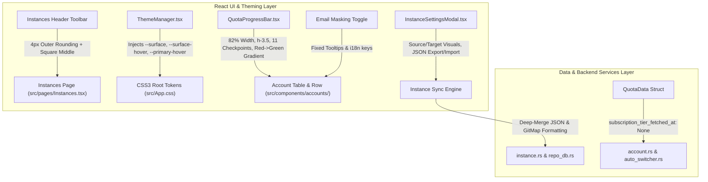

# Specification 141: Instance Button Rounding, Theme JSON Palette, Sync Settings & Account Progress Bar Architecture

## 1. Executive Summary & Problem Classification
This specification governs the architectural enhancements across Antigravity-Manager's frontend user interface and backend data structures, addressing four core pillars:
1. **Instance Section Header & Toolbar Button Styling**: Enforce strict design system capsule standards where button groups exhibit 4-pixel corner radius on outer extremities (`rounded-l-[4px]`, `rounded-r-[4px]`) and completely square (`rounded-none`) inner segments, eliminating unintended circular pill shapes in multi-action toolbars.
2. **Dynamic Theme System with JSON Palette & CSS3 Hover States**: Expand the existing theme catalog (`src/components/common/themePalettes.ts`) and theme engine (`src/components/common/ThemeManager.tsx`) to support runtime-configurable JSON palettes containing surface middle colors, accent colors, and dynamic hover colors powered by modern CSS3 `color-mix()` tokens.
3. **Account Section Quota Progress Bar Refactoring**: Redesign `src/components/accounts/QuotaProgressBar.tsx` to reduce width by 18% (`w-[82%] max-w-[82%]`), increase height (`h-3.5`), establish 11 equidistant checkpoints (every 10 points: 0, 10, 20, ..., 100), and blend colors seamlessly from left-to-right (from warning red to vibrant dominant green).
4. **Email Masking Tooltip & Toggle Clarification**: Resolve UI label confusion in `src/pages/Accounts.tsx` and `src/components/accounts/AccountTable.tsx` where the email masking/visibility toggle button is erroneously displayed as "Show All Quotas".
5. **Instance Sync Settings UI & GitMap Format Parity**: Enhance `src/components/instances/InstanceSettingsModal.tsx` and tree views to prominently display source and target instances, provide copy/move/JSON import-export options, and strictly adhere to GitMap dual-sequence formatting `[AGM:P001 | GM:#1]`.
6. **Pre-flight & CI/CD Compilation Resolution**: Fix struct initializer mismatch in `src-tauri/src/modules/account.rs:2329` and `src-tauri/src/modules/auto_switcher.rs:2630` for missing field `subscription_tier_fetched_at`, and resolve rustfmt drift.

---

## 2. Architectural Components & Data Flow

---

## 3. Strict Relative Path Invariant
All files, references, documentation, release notes, and commit logs strictly operate using relative Git paths:
- `02-spec/21-app/141-instance-button-rounding-theme-json-sync-and-account-progress-bar/`
- `.ai-memory/plans/pending/141-instance-button-rounding-theme-json-sync-and-account-progress-bar.md`
- `.ai-memory/plans/subtasks/141-instance-button-rounding-theme-json-sync-and-account-progress-bar/`
- `src/pages/Instances.tsx`
- `src/pages/Accounts.tsx`
- `src/components/common/ThemeManager.tsx`
- `src/components/common/themePalettes.ts`
- `src/components/accounts/QuotaProgressBar.tsx`
- `src/components/accounts/AccountTable.tsx`
- `src/components/instances/InstanceSettingsModal.tsx`
- `src/components/instances/PromptTreeViewModal.tsx`
- `src-tauri/src/modules/account.rs`
- `src-tauri/src/modules/auto_switcher.rs`
- `src-tauri/src/modules/quota.rs`
