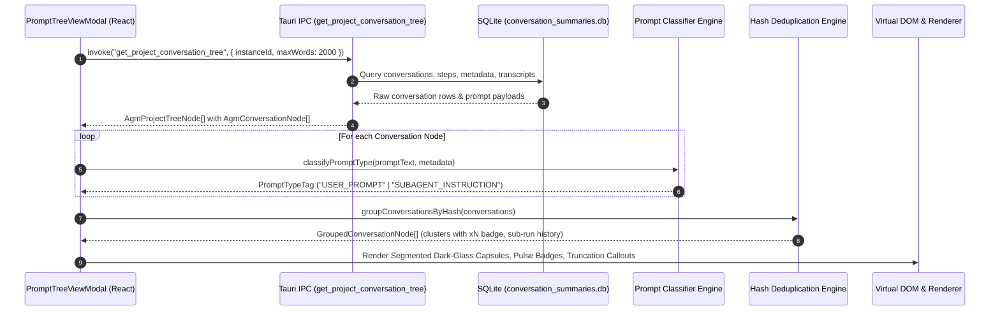
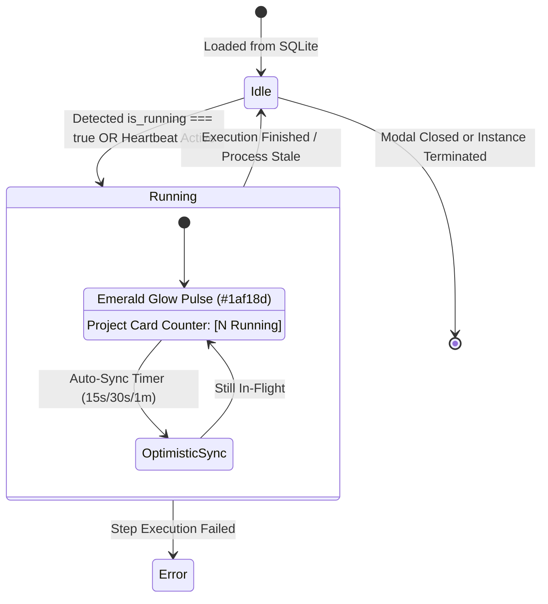
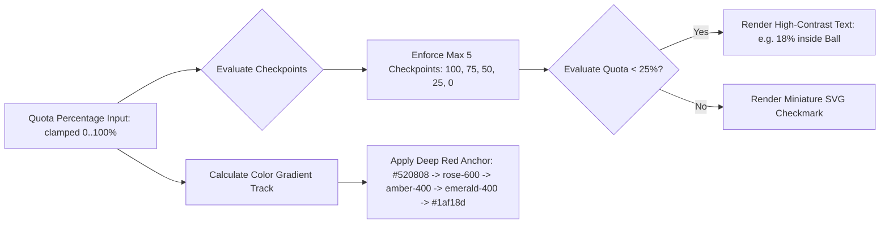

# Architecture Spec: Prompt Tree View UI/UX Overhaul, Quota Progress Bar & Whitespace Compaction

**Slug:** `144-prompt-tree-view-ui-progress-bar-and-agm-cli-enhancement`  
**File:** `02-spec/21-app/144-prompt-tree-view-ui-progress-bar-and-agm-cli-enhancement/01-architecture-spec.md`  
**Target Release:** v4.158.0  
**Status:** APPROVED FOR IMPLEMENTATION  
**Lead Author:** Antigravity Architect (Author 01)  
**Parent Master Ledger:** `02-spec/21-app/144-prompt-tree-view-ui-progress-bar-and-agm-cli-enhancement/00-master-audit-ledger.md`  

---

## 1. Executive Summary & Defect Remediation Scope

This specification establishes the architectural foundation and implementation contracts for the visual, structural, and performance modernization of the Antigravity-Manager (`agm`) prompt exploration tools, quota progress telemetry, and card layout density.

Per the master audit in `00-master-audit-ledger.md`, this specification directly resolves defects **D1 through D9**:

```
+---------------------------------------------------------------------------------------------------+
| Defect ID | Target Component            | Core Problem               | Target Remediation         |
+---------------------------------------------------------------------------------------------------+
| D1        | PromptTreeViewModal.tsx     | Loose, disjointed buttons  | Segmented dark-glass pill  |
| D2        | PromptTreeViewModal.tsx     | Undifferentiated prompts   | Heuristic discriminator    |
| D3        | PromptTreeViewModal.tsx     | Invisible in-flight tasks  | Emerald pulse & counter    |
| D4        | PromptTreeViewModal.tsx     | Identical prompt duplicates| Hash grouping & xN badge   |
| D5        | PromptTreeViewModal.tsx     | Raw ugly byte truncation   | Sleek byte callout toggle  |
| D6        | PromptTreeViewModal.tsx     | Missing single export      | Dedicated Export (.md/.json)|
| D7        | QuotaProgressBar.tsx        | 11 balls clutter & checks  | Max 5 balls + <25% text    |
| D8        | QuotaProgressBar.tsx        | Faint critical-zone red    | #520808 deep dark-red flow |
| D9        | AccountCard / InstanceTable | Excessive card whitespace  | scrollbar-thin & p-2 comp. |
+---------------------------------------------------------------------------------------------------+
```

---

## 2. Core Architecture & System Diagrams

The prompt tree view operates as a 3-tier hierarchical explorer (`Instance` -> `Project Repository` -> `Conversation / Prompt Run`). Below is the data ingestion, classification, deduplication, and rendering pipeline:

### 2.1 Ingestion & Classification Sequence Diagram



### 2.2 Conversation State Lifecycle & Optimistic Pulse Diagram



### 2.3 Quota Progress Bar Checkpoint Architecture



---

## 3. Segmented Dark-Glass Capsule Design System (AGENTS.md Invariant)

Per the governing repository guidelines in `AGENTS.md`:
> *"When rendering adjacent toolbar actions or desktop window controls (minimize, maximize, close), always wrap them into contiguous segmented pill capsules (`rounded-full`, shared border, subtle divider lines, and dark-glass styling) rather than loose, disjointed circular buttons."*

### 3.1 Design Invariant Rules

1. **Contiguous Capsule Containers:** Adjacent buttons MUST NOT be standalone rounded rectangles (`rounded-[4px]`) or independent detached circles. They must be wrapped in a single parent container with `rounded-full`, `p-0.5`, `border`, `divide-x`, and glassmorphic backdrops.
2. **Dividers:** Divider lines between items within a capsule must use `divide-slate-200/60 dark:divide-[#15334d]/70`.
3. **Corner Radii for End Buttons:**
   - First button: `rounded-l-full rounded-r-none`
   - Middle buttons: `rounded-none`
   - Last button: `rounded-r-full rounded-l-none`
   - Single standalone toggle: `rounded-full`
4. **Dark-Glass Styling Tokens:**
   - Container background: `bg-slate-100/80 dark:bg-[#0c2438]/85 backdrop-blur-md`
   - Border: `border border-slate-200/80 dark:border-[#15334d]/90`
   - Inner item hover: `hover:bg-slate-200/70 dark:hover:bg-[#15334d]/80 transition-all duration-150`
   - Shadows: `shadow-xs dark:shadow-[0_2px_8px_rgba(0,0,0,0.35)]`

### 3.2 Modal Header Toolbar Layout Specifications

In `src/components/instances/PromptTreeViewModal.tsx`, the top right header actions are organized into two contiguous segmented capsules:

#### Primary Operations Capsule:
```html
<div class="inline-flex items-center rounded-full bg-slate-100/80 dark:bg-[#0c2438]/85 border border-slate-200/80 dark:border-[#15334d]/90 p-0.5 divide-x divide-slate-200/60 dark:divide-[#15334d]/70 shadow-xs backdrop-blur-md">
  <!-- 1. Backup -->
  <button class="flex items-center gap-1.5 px-3 py-1.5 text-xs font-semibold text-slate-700 dark:text-slate-200 hover:bg-slate-200/70 dark:hover:bg-[#15334d]/80 rounded-l-full transition-colors cursor-pointer">
    <Download class="w-3.5 h-3.5 text-indigo-500" />
    <span>Backup</span>
  </button>
  <!-- 2. Restore -->
  <button class="flex items-center gap-1.5 px-3 py-1.5 text-xs font-semibold text-slate-700 dark:text-slate-200 hover:bg-slate-200/70 dark:hover:bg-[#15334d]/80 transition-colors cursor-pointer">
    <Upload class="w-3.5 h-3.5 text-emerald-500" />
    <span>Restore</span>
  </button>
  <!-- 3. Refresh -->
  <button class="flex items-center gap-1.5 px-3 py-1.5 text-xs font-semibold text-slate-700 dark:text-slate-200 hover:bg-slate-200/70 dark:hover:bg-[#15334d]/80 transition-colors cursor-pointer">
    <RefreshCw class="w-3.5 h-3.5 text-blue-500" />
    <span>Refresh</span>
  </button>
  <!-- 4. Sync Interval Selector -->
  <div class="flex items-center gap-1.5 px-2.5 py-1 text-xs font-semibold text-slate-700 dark:text-slate-200">
    <Clock class="w-3.5 h-3.5 text-cyan-500" />
    <span class="text-[11px] text-slate-500 dark:text-slate-400">Sync:</span>
    <select class="rounded-full bg-white dark:bg-[#071a27] text-slate-700 dark:text-slate-200 border border-slate-200 dark:border-[#15334d] text-xs px-2 py-0.5 focus:outline-none focus:ring-1 focus:ring-cyan-500 cursor-pointer">...</select>
  </div>
  <!-- 5. Fullscreen Toggle -->
  <button class="flex items-center gap-1.5 px-3 py-1.5 text-xs font-semibold text-slate-700 dark:text-slate-200 hover:bg-slate-200/70 dark:hover:bg-[#15334d]/80 transition-colors cursor-pointer">
    <Maximize2 class="w-3.5 h-3.5 text-blue-500" />
    <span>Full</span>
  </button>
  <!-- 6. Close Modal Window Control (Unified Capsule Invariant) -->
  <button class="flex items-center gap-1 px-3 py-1.5 text-xs font-semibold text-rose-600 dark:text-rose-400 hover:bg-rose-100/70 dark:hover:bg-rose-950/40 rounded-r-full transition-colors cursor-pointer">
    <X class="w-3.5 h-3.5" />
    <span>Close</span>
  </button>
</div>
```

#### Prompt Preview Action Capsule:
The prompt viewer actions (`Export`, `Copy Text`, `Copy With Images`, `Save Images`, `Focus IDE`, `Send Now`) are similarly grouped into a contiguous dark-glass capsule rather than loose buttons.

---

## 4. Prompt Classification Engine: Algorithmic Detection

### 4.1 Discrimination Requirements
In modern agentic workflows (Antigravity, Cursor, Windsurf, Claude Code), prompts fall into two distinct ontological categories:
1. **User Prompt:** Originates from direct human interaction or top-level task commands.
2. **AI Subagent Instruction:** Autonomous internal prompt injected by parent agents, containing system instructions, tool execution manifests, XML parameter blocks, or memory anchors.

### 4.2 Algorithmic Classification Rules
The classifier function `detectPromptCategory(prompt: string, title?: string, status?: string): PromptClassification` executes the following sequential evaluation:

```typescript
export type PromptCategory = 'USER_PROMPT' | 'SUBAGENT_INSTRUCTION';

export interface PromptClassification {
    category: PromptCategory;
    confidence: number;
    matchedPattern?: string;
    displayBadge: string;
    badgeStyle: string;
}

export function detectPromptCategory(promptText: string, title: string = '', metadata?: Record<string, any>): PromptClassification {
    const text = (promptText || '').trim();
    const cleanTitle = (title || '').trim().toLowerCase();

    // 1. Strict System / Subagent XML and Tag Markers (Confidence 1.0)
    const subagentTags = [
        /<SYSTEM_MESSAGE>/i,
        /<INSTRUCTION>/i,
        /<USER_REQUEST>/i,
        /<RULE\[.*?\]>/i,
        /<identity>/i,
        /\[Subagent:\s*[a-zA-Z0-9_\-]+\]/i,
        /You are Subagent/i,
        /invoked by a caller agent/i,
        /conversationId=.*?parent=/i,
    ];

    for (const pattern of subagentTags) {
        if (pattern.test(text)) {
            return {
                category: 'SUBAGENT_INSTRUCTION',
                confidence: 1.0,
                matchedPattern: pattern.source,
                displayBadge: 'AI Subagent Instruction',
                badgeStyle: 'bg-purple-500/10 text-purple-700 dark:text-purple-300 border-purple-400/30 dark:border-purple-500/40'
            };
        }
    }

    // 2. Structured Task Instruction Preamble Markers (Confidence 0.95)
    const preamblePatterns = [
        /^#\s+(?:High Priority Instruction|Task Specification|Autonomous Execution Protocol)/im,
        /^Role:\s*(?:Codebase Researcher|Database Debugger|QA Tester|Subagent)/im,
        /execute-parent-task-with-n-steps/i,
        /plan-spec-steps-v2/i,
        /cg-execute-in-below-steps/i,
        /Available skills:/i,
        /Available subagents:/i
    ];

    for (const pattern of preamblePatterns) {
        if (pattern.test(text)) {
            return {
                category: 'SUBAGENT_INSTRUCTION',
                confidence: 0.95,
                matchedPattern: pattern.source,
                displayBadge: 'AI Subagent Instruction',
                badgeStyle: 'bg-purple-500/10 text-purple-700 dark:text-purple-300 border-purple-400/30 dark:border-purple-500/40'
            };
        }
    }

    // 3. Subagent Naming in Title (Confidence 0.85)
    if (cleanTitle.includes('subagent') || cleanTitle.includes('worker') || cleanTitle.includes('author-') || cleanTitle.startsWith('task-')) {
        return {
            category: 'SUBAGENT_INSTRUCTION',
            confidence: 0.85,
            matchedPattern: 'title_heuristic',
            displayBadge: 'AI Subagent Instruction',
            badgeStyle: 'bg-purple-500/10 text-purple-700 dark:text-purple-300 border-purple-400/30 dark:border-purple-500/40'
        };
    }

    // 4. Default: User Prompt
    return {
        category: 'USER_PROMPT',
        confidence: 0.9,
        displayBadge: 'User Prompt',
        badgeStyle: 'bg-sky-500/10 text-sky-700 dark:text-cyan-300 border-sky-400/30 dark:border-cyan-500/40'
    };
}
```

### 4.3 Badge Presentation
- **User Prompt Badge:** 
  `<span class="px-2 py-0.5 rounded-full text-[9px] font-mono font-bold uppercase tracking-wider bg-sky-500/10 text-sky-700 dark:text-cyan-300 border border-sky-400/30 dark:border-cyan-500/40">User Prompt</span>`
- **AI Subagent Instruction Badge:** 
  `<span class="px-2 py-0.5 rounded-full text-[9px] font-mono font-bold uppercase tracking-wider bg-purple-500/10 text-purple-700 dark:text-purple-300 border border-purple-400/30 dark:border-purple-500/40">AI Subagent Instruction</span>`

---

## 5. Running Pulse Indicator Architecture

### 5.1 Project Card Summary & Conversation Nodes
When an Antigravity instance or conversation is actively executing prompts, the user must immediately see which project and conversation is executing without needing to expand or drill into individual nodes.

1. **Parent Project Cards (`AgmProjectTreeNode`):**
   - Active running detection: `const runningCount = project.conversations.filter(c => c.is_running).length;`
   - When `runningCount > 0`:
     * Render an animated emerald pulse orb beside the project repo title:
       `<span class="relative flex h-2.5 w-2.5"><span class="animate-ping absolute inline-flex h-full w-full rounded-full bg-emerald-400 opacity-75"></span><span class="relative inline-flex rounded-full h-2.5 w-2.5 bg-[#1af18d] shadow-[0_0_8px_rgba(26,241,141,0.85)]"></span></span>`
     * Render count badge in project metadata:
       `<span class="px-1.5 py-0.5 rounded-full text-[9px] font-bold font-mono bg-emerald-500/15 text-emerald-700 dark:text-[#1af18d] border border-emerald-500/30">${runningCount} RUNNING</span>`
2. **Conversation Nodes (`AgmConversationNode`):**
   - Status badge transitions to an active glowing pill:
     `<span class="flex items-center gap-1 px-2 py-0.5 rounded-full text-[9px] font-bold font-mono bg-emerald-500/15 text-emerald-600 dark:text-[#1af18d] border border-emerald-500/40 shadow-[0_0_6px_rgba(26,241,141,0.4)]"><span class="w-1.5 h-1.5 rounded-full bg-[#1af18d] animate-pulse"></span>RUNNING</span>`

---

## 6. Repeated Prompts Deduplication & Grouping Engine

### 6.1 Problem Statement
When automated pipelines (e.g., test loops, retry queues, or CI/CD self-healing routines) run repetitive prompts against a project, the conversation list becomes flooded with duplicate entries, obfuscating other project activity.

### 6.2 Normalization & Hashing Algorithm
Conversations are grouped using a normalized prompt text hash:

```typescript
export interface GroupedConversationNode {
    primaryNode: AgmConversationNode;
    duplicateCount: number;
    subRuns: AgmConversationNode[];
    hash: string;
}

export function computePromptHash(text: string): string {
    // Normalize: strip leading/trailing whitespace, collapse multiple linefeeds and spaces
    const normalized = text
        .trim()
        .toLowerCase()
        .replace(/\s+/g, ' ')
        .slice(0, 2048); // Bound to first 2KB for lightning hash computation

    // 32-bit FNV-1a Hash Implementation
    let hash = 0x811c9dc5;
    for (let i = 0; i < normalized.length; i++) {
        hash ^= normalized.charCodeAt(i);
        hash += (hash << 1) + (hash << 4) + (hash << 7) + (hash << 8) + (hash << 24);
    }
    return (hash >>> 0).toString(16);
}

export function groupConversationNodes(nodes: AgmConversationNode[]): GroupedConversationNode[] {
    const groupMap = new Map<string, AgmConversationNode[]>();

    for (const node of nodes) {
        // Group by hash of prompt preview or title if prompt is empty
        const key = computePromptHash(node.prompt_preview_200w || node.title);
        const existing = groupMap.get(key) || [];
        existing.push(node);
        groupMap.set(key, existing);
    }

    const result: GroupedConversationNode[] = [];
    for (const [hash, cluster] of groupMap.entries()) {
        // Sort cluster by last_modified descending: primary is the latest execution
        cluster.sort((a, b) => new Date(b.last_modified).getTime() - new Date(a.last_modified).getTime());
        result.push({
            primaryNode: cluster[0],
            duplicateCount: cluster.length,
            subRuns: cluster.slice(1),
            hash
        });
    }

    return result;
}
```

### 6.3 UI Rendering of Duplicates
- When `duplicateCount > 1`:
  Render a prominent amber badge on the conversation row:
  `<span class="px-1.5 py-0.5 rounded-full text-[9px] font-black font-mono bg-amber-500/15 text-amber-700 dark:text-amber-400 border border-amber-500/30">x${duplicateCount}</span>`
- Clicking the badge or chevron unfolds the collapsible sub-runs list, detailing individual run timestamps (`last_modified`), step counts, and status badges.

---

## 7. Byte-Level Truncation & Preview Engine

### 7.1 Problem Statement
Previous prompt truncation relied on arbitrary 120-word cuts appended with raw `...`, giving users no indication of how much content was omitted, whether code blocks were preserved, or the exact byte footprint.

### 7.2 Byte Calculation & Truncation Formatter
```typescript
export interface TruncationMetrics {
    totalBytes: number;
    displayedBytes: number;
    omittedBytes: number;
    formattedOmitted: string;
    isTruncated: boolean;
    renderedPreview: string;
}

export function calculateTruncation(rawText: string, maxDisplayWords: number = 300): TruncationMetrics {
    const encoder = new TextEncoder();
    const fullBuffer = encoder.encode(rawText);
    const totalBytes = fullBuffer.byteLength;

    const words = rawText.trim().split(/\s+/).filter(Boolean);
    if (words.length <= maxDisplayWords) {
        return {
            totalBytes,
            displayedBytes: totalBytes,
            omittedBytes: 0,
            formattedOmitted: '0 B',
            isTruncated: false,
            renderedPreview: rawText
        };
    }

    // Preserve first maxDisplayWords while retaining line breaks
    const lines = rawText.split('\n');
    let collectedWords = 0;
    const truncatedLines: string[] = [];

    for (const line of lines) {
        const lineWords = line.trim().split(/\s+/).filter(Boolean);
        if (collectedWords + lineWords.length <= maxDisplayWords) {
            truncatedLines.push(line);
            collectedWords += lineWords.length;
        } else {
            const remainder = maxDisplayWords - collectedWords;
            if (remainder > 0) {
                truncatedLines.push(lineWords.slice(0, remainder).join(' ') + ' ...');
            }
            break;
        }
    }

    const preview = truncatedLines.join('\n');
    const previewBytes = encoder.encode(preview).byteLength;
    const omitted = Math.max(0, totalBytes - previewBytes);

    const formattedOmitted = omitted >= 1024 * 1024 
        ? `${(omitted / (1024 * 1024)).toFixed(1)} MB` 
        : `${(omitted / 1024).toFixed(1)} KB`;

    return {
        totalBytes,
        displayedBytes: previewBytes,
        omittedBytes: omitted,
        formattedOmitted,
        isTruncated: true,
        renderedPreview: preview
    };
}
```

### 7.3 Visual Callout Token
When `isTruncated === true`, the UI displays an interactive callout banner immediately beneath the preview text:
```html
<div class="mt-3 flex items-center justify-between p-2 rounded-xl bg-amber-50/80 dark:bg-amber-950/30 border border-amber-300/60 dark:border-amber-700/50 text-amber-800 dark:text-amber-300 text-xs shadow-2xs">
  <div class="flex items-center gap-1.5 font-mono">
    <Zap class="w-3.5 h-3.5 text-amber-500 fill-amber-500" />
    <span class="font-bold">⚡ [Truncated: {metrics.formattedOmitted} preserved - Click to Expand Full Text]</span>
  </div>
  <button type="button" onClick={handleExpandFullPrompt} class="px-2 py-0.5 rounded-full bg-amber-500 text-white dark:text-slate-900 font-bold hover:bg-amber-600 transition-colors cursor-pointer text-[10px]">
    Expand Full Text
  </button>
</div>
```

---

## 8. Quota Progress Bar Architecture & Critical Thresholds

### 8.1 Checkpoints Array Invariant: Strict $\le 5$ Milestone Balls
The legacy progress bar defaulted to 11 milestone balls (`[100, 90, 80, 70, 60, 50, 40, 30, 20, 10, 0]`), causing severe visual overcrowding on smaller instance cards and table cells.

**Invariant Rule:** The checkpoint array is capped at **$\le 5$ balls**.  
Default standard checkpoints: `[100, 75, 50, 25, 0]`

### 8.2 Color Gradient: Deep Dark-Red Left Edge Anchor
The track gradient flows smoothly from a rich dark-red to vibrant neon green (`#1af18d`):
```css
bg-gradient-to-r from-[#520808] via-rose-600 via-amber-400 via-emerald-400 to-[#1af18d]
```
- **0% - 15% (Critical Zone):** Deep dark red `#520808` blending into `rose-600`
- **16% - 49% (Warning Zone):** Transitioning through `amber-400`
- **50% - 74% (Healthy Zone):** Smooth blend into `emerald-400`
- **75% - 100% (Prime Zone):** Vibrant neon green `#1af18d` with neon glow (`shadow-[0_0_10px_rgba(26,241,141,0.75)]`)

### 8.3 Numerical Percentage Typography for Quota $< 25\%$
In critical/exhausted quota states, rendering an empty or filled checkmark SVG is misleading.  
**Requirement:** When `percentage < 25`, the checkpoint ball replaces the SVG checkmark with crisp numerical percentage typography:

```tsx
{/* Inside Checkpoint Ball Render Loop */}
{isFilled ? (
    cp < 25 && clamped < 25 ? (
        <span className="text-[7.5px] font-black font-mono text-white leading-none tracking-tighter">
            {Math.round(clamped)}%
        </span>
    ) : (
        <svg className="w-2 h-2 fill-none stroke-current text-white stroke-[2.5]" viewBox="0 0 12 12">
            <path d="M2.5 6.5L4.8 8.8L9.5 3.5" />
        </svg>
    )
) : (
    <span className="w-1 h-1 rounded-full bg-slate-400/40 dark:bg-white/20" />
)}
```

---

## 9. Whitespace & Layout Compaction Architecture

### 9.1 Custom Scrollbar Tokens
Default browser scrollbars add 12–16px of dead space. All modal sidebars, prompt lists, and card containers must standardize on thin, themed scrollbars:
- Tailwind Utility: `scrollbar-thin scrollbar-thumb-slate-300 dark:scrollbar-thumb-[#15334d] scrollbar-track-transparent hover:scrollbar-thumb-slate-400 dark:hover:scrollbar-thumb-[#1f4b70]`

### 9.2 AccountCard Padding Compaction
In `src/components/accounts/AccountCard.tsx`:
- Container padding reduced from `p-3` to `p-2 sm:p-2.5`
- Header margin reduced from `mb-2` to `mb-1.5`
- Gap between badges reduced from `gap-1.5` to `gap-1`
- Preserves full readability while allowing 15% more vertical card density on high-DPI displays.

### 9.3 InstanceTable Cell Density
In `src/components/instances/InstanceTable.tsx`:
- Table row vertical padding compacted from `py-1.5` to `py-1`
- Quota progress bar wrapper container min-width optimized to `min-w-[130px]`
- Unified border dividers `divide-y divide-slate-100 dark:divide-[#0f273d]`

---

## 10. Verification Matrix & Quality Acceptance Gates

| Specification Requirement | Target Component | Acceptance Gate Verification |
|---|---|---|
| **Header Capsule Reorganization** | `PromptTreeViewModal.tsx` | All header actions wrapped in `rounded-full` dark-glass pill; zero disjointed square buttons |
| **Prompt Type Discriminator** | `PromptTreeViewModal.tsx` | Heuristic engine flags `<SYSTEM_MESSAGE>`, preambles, and XML tags with purple `AI Subagent Instruction` badge |
| **Running Pulse Indicators** | `PromptTreeViewModal.tsx` | Project cards show `[N RUNNING]` with emerald ping animation when in-flight |
| **Duplicate Deduplication** | `PromptTreeViewModal.tsx` | Identical prompts grouped by hash; `xN` badge rendered; sub-runs collapsible |
| **Byte Truncation Callout** | `PromptTreeViewModal.tsx` | `⚡ [Truncated: X.X KB preserved - Click to Expand Full Text]` banner rendered when truncated |
| **Dedicated Export Action** | `PromptTreeViewModal.tsx` | Dedicated `Export` button in capsule with Markdown (`.md`) and JSON (`.json`) download handlers |
| **Checkpoint Ball Cap** | `QuotaProgressBar.tsx` | Default checkpoints strictly capped at 5 balls `[100, 75, 50, 25, 0]` |
| **Deep Red Gradient** | `QuotaProgressBar.tsx` | Left anchor starts at `#520808` transitioning smoothly to `#1af18d` |
| **Critical Typography** | `QuotaProgressBar.tsx` | Checkpoint ball displays `{percentage}%` when quota $< 25\%$ |
| **Whitespace Compaction** | `AccountCard.tsx`, `InstanceTable.tsx` | Padding reduced to `p-2.5`; `scrollbar-thin` active across overflow containers |

---

*Authored by Antigravity Architect (Author 01) per AGENTS.md Invariants.*
