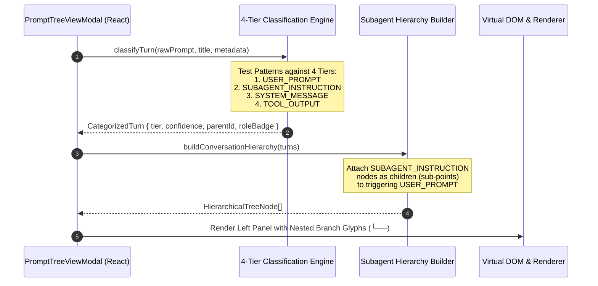

# Architecture & UI/UX Spec: Prompt Tree Header Compaction, 4-Tier Origin Distinction & Rich Media Actions

**Slug:** `145-prompt-tree-view-header-compaction-ai-distinction-and-restore-hardening`  
**Document ID:** `02-spec/21-app/145-prompt-tree-view-header-compaction-ai-distinction-and-restore-hardening/01-architecture-and-ui-spec.md`  
**Target Release:** v4.162.0  
**Status:** APPROVED SPECIFICATION  
**Lead Author:** Antigravity UI & UX Architecture Specialist  
**Parent Master Ledger:** [00-master-audit-ledger.md](./00-master-audit-ledger.md)  
**Parent Plan:** [.ai-memory/plans/145-prompt-tree-view-header-compaction-ai-distinction-and-restore-hardening.md](../../../.ai-memory/plans/145-prompt-tree-view-header-compaction-ai-distinction-and-restore-hardening.md)  

---

## 1. Executive Summary & Defect Remediation Scope

The Prompt Tree View (`PromptTreeViewModal.tsx`) is the central control surface in Antigravity-Manager (`agm`) for inspecting multi-project conversation hierarchies, monitoring in-flight agent tasks, exporting prompt history, and dispatching prompts across isolated IDE instances.

Following user inspection and telemetry analysis, several critical UI/UX and data-integrity defects were identified:
1. **Header Clutter & Broken Layout:** The modal top header stuffed 6 dissimilar actions (`Backup`, `Restore`, `Refresh`, `Sync`, `Full`, `Close`) into a single unwieldy container with high-contrast borders and detached margins, violating `AGENTS.md` capsule rules.
2. **Prompts vs Non-Prompts Ambiguity:** Internal AI subagent instructions (`invoke_subagent`, researcher directives), system initialization preambles, and raw tool output steps appeared indiscriminately in the top-level conversation tree, creating confusion between what was sent by human users and what was generated by the AI system.
3. **Crude Truncation Rendering:** Transcript byte limits were previously stripped into a static markdown blockquote (`> ✂ *[Omitted N bytes]*`) before parsing, displaying ugly raw text instead of a rich interactive callout.
4. **Copy & Export Limitations:** "Copy with Image" copied only plain markdown text without copying real image binary assets to the system clipboard, failing when pasted into rich text apps (Slack, Word, Docs).
5. **View Mode & Action Inconsistencies:** Right-panel action capsules suffered from bloated dropdown menus, loose button padding, and non-canonical `rounded-[5px]` styling on View Mode tabs.

This specification defines the complete architectural contracts, component structures, styling tokens, algorithms, and quality gates to resolve these defects.

### Defect Remediation Matrix

| Defect ID | Target Area | Root Cause | Target Architectural Remediation |
|---|---|---|---|
| **D1** | Modal Header Toolbar | 6-item monolithic bar with clumsy inner `<select>` borders | Split into dual dark-glass segmented pill capsules: **Data Operations** `[ Backup \| Restore \| Refresh \| Sync ]` (transparent inline select) and **Window Controls** `[ Full \| Close ]` per `AGENTS.md`. |
| **D2** | Conversation Tree & Classifier | Binary classification treating system & tool logs as conversation roots | 4-Tier Origin Categorization (`USER_PROMPT`, `SUBAGENT_INSTRUCTION`, `SYSTEM_MESSAGE`, `TOOL_OUTPUT`) with nested subagent tree hierarchy and visual role badges. |
| **D3** | In-Flight Status | Subtle text badges lacking live visual urgency | High-visibility emerald pulse orb (`#1af18d`), amber clock badges for queue, live step counter, and instance card badges. |
| **D4** | Window Activation & Preview | "Focus IDE" failed to activate foreground window on OS level | Enhanced Tauri IPC window focus with canonical directory targeting and real-time execution step streaming. |
| **D5** | Byte Truncation Callout | Static string replacement to `> ✂ [Omitted...]` before markdown parsing | Interactive `TruncatedContextCallout` banner `⚡ [Omitted N bytes/lines]` with inline expandable view. |
| **D6** | Media Copy & Export | Plain text markdown copy without `ClipboardItem` HTML payload | Multi-mime `ClipboardItem` (`text/html` + `text/plain`) with embedded `` tags and single/batch Export (`.md` / `.json`). |
| **D7** | Preview Action Bar | Loose `rounded-[5px]` tabs, wide suffix select, disjointed margins | Canonical `rounded-full` segmented View Mode capsule (`preview`, `raw`, `edit`), streamlined transparent suffix select, and compact padding. |

---

## 2. User Request (Verbatim)

```text
# High Priority Instruction

You can see that this is a serious bug where I have my prompts running, but I don't have the results of anything that is running there. I could not see the prompts, and I could not open the prompts in the main window or whatever I have sent. And there are prompts which I have not executed. Can this distinguish what is prompt, what is not prompt? Because some of those are prompt, some of those are not. It's by the AI instruction. So we need to distinguish those, and those could be a sub point or things like that that you need to work on in the UI. I do see that the prompts bit showed up, but still the header display for the prompts tree view, it's very much bad. It does not have the UI/UX. Seems like broken stuff. The menus are not compact, buttons are not compact. I do see that you have most of the text displayed. That's all right. Appreciate it. You should have export button as well, copy button as well. Copy with image. If I do that, can go there. I don't have the image. Images are also there. That's nice. That's good. The copy button is working, but still, it looks broken, especially the header section. That needs to be compacted, the design issue and things like that, you need to work on it. And also there are things which are not prompt, but showing up. You need to work on it. Also, the preview you need to improve. In between, it shows truncated bytes, which we need to fix in terms of the display, I think. Can you help with that? Improve the preview. And also, if a prompt is running, we need to have some indicator that it is a running prompt or in queue prompt. We need to have that. It is not there yet. So I think you need to look back and look deep, the prompt tree view, how the prompts are collecting, taking the prompts backup, restoring those. I think these are still very limited. You need to work on it very hard. Try to find the root cause. Try to write the spec by yourself, in details. Like the testing, UI/UX specs, make it more professional.
```

---

## 3. System Architecture & Component Topology

```
+----------------------------------------------------------------------------------------------------+
|                                    PromptTreeViewModal (React 18)                                  |
+----------------------------------------------------------------------------------------------------+
| TOP HEADER BAR (h-12, flex items-center justify-between, px-6, dark-glass backdrop)                |
|  [Title & Instance Identity Trio Capsule]  -->  [Data Operations Capsule]  [Window Controls Capsule] |
+----------------------------------------------------------------------------------------------------+
| SPLIT VIEW CONTAINER (flex-1 overflow-hidden)                                                      |
|                                                                                                    |
|  LEFT PANEL (w-84 sm:w-96)                         RIGHT PANEL (flex-1 flex flex-col)              |
|  +---------------------------------------------+   +---------------------------------------------+ |
|  | Filter Header (Scope + Search + 4-Tier Pill)|   | Selected Prompt Header (Dual Seq + Trio)    | |
|  +---------------------------------------------+   +---------------------------------------------+ |
|  | Project & Conversation Tree                 |   | Action Toolbar (Content/Export + Dispatch)  | |
|  | - Root Project Node                         |   +---------------------------------------------+ |
|  |   - Primary USER_PROMPT Node                |   | View Mode Capsule [ Preview | Raw | Edit ]  | |
|  |     └── Sub-Point: SUBAGENT_INSTRUCTION     |   +---------------------------------------------+ |
|  |     └── Sub-Point: SUBAGENT_INSTRUCTION     |   | Content Preview Area:                       | |
|  |   - Running Pulse Badges (● RUNNING)        |   | - TruncatedContextCallout (⚡ Omitted N B)  | |
|  |   - Repeat Cluster Nodes (xN)               |   | - RichMarkdownRenderer (Headings, Code, Img)| |
|  +---------------------------------------------+   | - Live Execution Step Progress Banner       | |
|                                                    +---------------------------------------------+ |
+----------------------------------------------------------------------------------------------------+
```

### 3.1 4-Tier Ingestion & Tree Assembly Sequence



### 3.2 Rich Clipboard Media Sequence

```mermaid
sequenceDiagram
    autonumber
    participant User as End User
    participant UI as PromptTreeViewModal
    participant Clip as Async Clipboard API (ClipboardItem)
    participant OS as OS / Desktop Application (Word/Slack)

    User->>UI: Click "Copy with Image"
    UI->>UI: Parse Markdown AST -> Extract Text & Images
    UI->>UI: Synthesize HTML fragment: <div>text...</div>
    UI->>Clip: navigator.clipboard.write([ClipboardItem({ "text/html": blob, "text/plain": textBlob })])
    alt Modern Clipboard Supported
        Clip-->>UI: Success
        UI-->>User: Toast: "Copied formatted prompt with embedded images!"
    else ClipboardItem Denied / Unsupported
        Clip-->>UI: Error / Fallback
        UI->>Clip: navigator.clipboard.writeText(cleanMarkdown)
        UI-->>User: Toast: "Copied prompt text (plain fallback)"
    end
    User->>OS: Paste (Ctrl+V / Cmd+V)
    OS-->>User: Renders rich text with inline images
```

---

## 4. Segmented Dark-Glass Capsule Design System (`AGENTS.md`)

Per `AGENTS.md`:
> *"When rendering adjacent toolbar actions or desktop window controls (minimize, maximize, close), always wrap them into contiguous segmented pill capsules (`rounded-full`, shared border, subtle divider lines, and dark-glass styling) rather than loose, disjointed circular buttons."*

### 4.1 Design System Invariants

1. **Dual Capsule Separation at Modal Top Header:**
   The top right header controls MUST be divided into two independent, contiguous segmented pill capsules:
   - **Capsule A: Data Operations Capsule:** Contains `[ Backup | Restore | Refresh | Sync Interval ]`.
   - **Capsule B: Window Controls Capsule:** Contains `[ Full | Close ]`.
   These two capsules must be separated by a clean margin (`gap-2` or `ml-2`), preventing the visual amalgamation of window lifecycle controls with data operations.
2. **Transparent Inline Select Controls:**
   Selectors embedded within a pill capsule (e.g., Sync Interval, Confirmation Suffix) MUST NOT render their own isolated solid backgrounds (`bg-white`), borders (`border border-slate-200`), or boxed corners. They must use transparent inline styling (`bg-transparent border-0 text-slate-700 dark:text-slate-200 text-[10px] focus:ring-0 focus:outline-none cursor-pointer pr-1`).
3. **View Mode Segmented Pill Capsule:**
   View Mode toggles (`preview`, `raw`, `edit`) MUST NOT use square corners or `rounded-[5px]`. They must be wrapped into a single contiguous `rounded-full` capsule with `divide-x` dividers.
4. **Dividers:**
   All internal divider lines within segmented capsules must use `divide-slate-200/70 dark:divide-[#15334d]/80`.
5. **Dark-Glass Tokens:**
   - Container background: `bg-slate-100/90 dark:bg-[#0c2438]/90 backdrop-blur-md`
   - Capsule border: `border border-slate-200/80 dark:border-[#15334d]/90`
   - Active state: `bg-blue-600 text-white shadow-2xs font-semibold`
   - Hover state: `hover:bg-slate-200/80 dark:hover:bg-[#15334d]/90 transition-all duration-150`

---

## 5. Top Header Dual Capsule Specification

### 5.1 Capsule Layout & JSX Architecture

```tsx
{/* Top Right Header Controls: Split into 2 Disjoint Segmented Dark-Glass Capsules */}
<div className="flex items-center gap-2 shrink-0">
    {/* Capsule 1: Data Operations Capsule */}
    <div className="inline-flex items-center rounded-full bg-slate-100/90 dark:bg-[#0c2438]/90 backdrop-blur-md border border-slate-200/80 dark:border-[#15334d]/90 p-0.5 divide-x divide-slate-200/70 dark:divide-[#15334d]/80 shadow-2xs">
        {/* 1. Backup */}
        <button
            type="button"
            onClick={handleBackup}
            className="flex items-center gap-1.5 px-3 py-1.5 text-xs font-semibold text-slate-700 dark:text-slate-200 hover:bg-slate-200/80 dark:hover:bg-[#15334d]/90 rounded-l-full transition-all duration-150 ease-out active:scale-[0.98] cursor-pointer"
            title="Backup Prompts to JSON"
        >
            <Download className="w-3.5 h-3.5 text-indigo-500" />
            <span>Backup</span>
        </button>

        {/* 2. Restore */}
        <button
            type="button"
            onClick={handleRestore}
            className="flex items-center gap-1.5 px-3 py-1.5 text-xs font-semibold text-slate-700 dark:text-slate-200 hover:bg-slate-200/80 dark:hover:bg-[#15334d]/90 rounded-none transition-all duration-150 ease-out active:scale-[0.98] cursor-pointer"
            title="Restore Prompts from JSON backup file"
        >
            <Upload className="w-3.5 h-3.5 text-emerald-500" />
            <span>Restore</span>
        </button>

        {/* 3. Refresh */}
        <button
            type="button"
            onClick={() => loadTree(true, true)}
            disabled={isLoading}
            className="flex items-center gap-1.5 px-3 py-1.5 text-xs font-semibold text-slate-700 dark:text-slate-200 hover:bg-slate-200/80 dark:hover:bg-[#15334d]/90 rounded-none transition-all duration-150 ease-out active:scale-[0.98] cursor-pointer"
            title="Refresh Tree"
        >
            <RefreshCw className={cn("w-3.5 h-3.5 text-blue-500", isLoading && "animate-spin")} />
            <span>Refresh</span>
        </button>

        {/* 4. Sync Interval with Transparent Inline Select */}
        <div className="flex items-center gap-1 pl-2.5 pr-2 py-1 text-xs font-semibold text-slate-700 dark:text-slate-200 rounded-r-full">
            <Clock className={cn("w-3.5 h-3.5 text-cyan-500 shrink-0", isAutoSyncing && "animate-spin")} />
            <span className="text-[11px] text-slate-500 dark:text-slate-400 select-none">Sync:</span>
            <select
                value={syncInterval}
                onChange={(e) => {
                    const val = e.target.value as SyncInterval;
                    setSyncInterval(val);
                    setPromptTreeSyncInterval(val);
                }}
                className="bg-transparent border-0 text-slate-700 dark:text-slate-200 text-xs font-semibold focus:ring-0 focus:outline-none cursor-pointer pr-1 py-0"
                title="Auto-sync interval timer"
            >
                <option value="15s" className="bg-white dark:bg-[#0c2438]">15s</option>
                <option value="30s" className="bg-white dark:bg-[#0c2438]">30s</option>
                <option value="1m" className="bg-white dark:bg-[#0c2438]">1m</option>
                <option value="2m" className="bg-white dark:bg-[#0c2438]">2m</option>
                <option value="off" className="bg-white dark:bg-[#0c2438]">Off</option>
            </select>
        </div>
    </div>

    {/* Capsule 2: Window Controls Capsule */}
    <div className="inline-flex items-center rounded-full bg-slate-100/90 dark:bg-[#0c2438]/90 backdrop-blur-md border border-slate-200/80 dark:border-[#15334d]/90 p-0.5 divide-x divide-slate-200/70 dark:divide-[#15334d]/80 shadow-2xs">
        {/* Fullscreen Toggle */}
        <button
            type="button"
            onClick={() => setIsFullscreen(!isFullscreen)}
            className="flex items-center gap-1.5 px-3 py-1.5 text-xs font-semibold text-slate-700 dark:text-slate-200 hover:bg-slate-200/80 dark:hover:bg-[#15334d]/90 rounded-l-full transition-all duration-150 ease-out active:scale-[0.98] cursor-pointer"
            title={isFullscreen ? "Exit Full Screen" : "Full Screen Mode"}
        >
            {isFullscreen ? (
                <>
                    <Minimize2 className="w-3.5 h-3.5 text-blue-500" />
                    <span>Exit</span>
                </>
            ) : (
                <>
                    <Maximize2 className="w-3.5 h-3.5 text-blue-500" />
                    <span>Full</span>
                </>
            )}
        </button>

        {/* Close Window Button with Rose Hover */}
        <button
            type="button"
            onClick={onClose}
            className="flex items-center px-2.5 py-1.5 text-slate-400 hover:text-rose-600 dark:hover:text-rose-400 hover:bg-rose-500/10 dark:hover:bg-rose-500/20 rounded-r-full transition-all duration-150 ease-out active:scale-[0.98] cursor-pointer"
            title="Close Modal"
        >
            <X className="w-4 h-4" />
        </button>
    </div>
</div>
```

---

## 6. 4-Tier Categorization & Subagent Hierarchy Engine

### 6.1 Ontology & Distinction Tiers

In modern agentic systems, transcript and prompt entries must be deterministically classified into one of four ontological tiers:

1. **`USER_PROMPT` (Primary Human Directive):**
   - Direct user prompt submitted via chat box, CLI prompt flag, or initial task request.
   - Position: **Root Conversation Node** in the tree explorer.
   - Visual Badge: `bg-sky-500/15 text-sky-700 dark:text-cyan-300 border-sky-400/30`.
   - Icon: `<User className="w-3.5 h-3.5 text-sky-500" />`.
2. **`SUBAGENT_INSTRUCTION` (Autonomous Worker Prompt):**
   - Subagent prompt or directive spawned by parent agents (e.g. `invoke_subagent`, `Role: Codebase Researcher`, `You are Subagent...`).
   - Position: **Nested Sub-Point Node** indented under its initiating parent prompt (`pl-5`, `↳ [AI Subagent]`).
   - Visual Badge: `bg-purple-500/15 text-purple-700 dark:text-purple-300 border-purple-400/30`.
   - Icon: `<Bot className="w-3.5 h-3.5 text-purple-500" />`.
3. **`SYSTEM_MESSAGE` (Environment / System Ingestion):**
   - Static system instructions, tool schema declarations, `<identity>`, `<skills>`, or prompt preambles.
   - Position: System context node; default hidden from root list, visible when "Show All Types" is active.
   - Visual Badge: `bg-zinc-500/15 text-zinc-700 dark:text-zinc-300 border-zinc-400/30`.
   - Icon: `<Terminal className="w-3.5 h-3.5 text-zinc-500" />`.
4. **`TOOL_OUTPUT` (Diagnostic Execution Artifact):**
   - Tool execution results, command outputs, bash exit codes, file viewer responses, `<truncated N bytes>` returns.
   - Position: Execution step artifact; never rendered as standalone root prompt. Displayed in step results.
   - Visual Badge: `bg-amber-500/15 text-amber-700 dark:text-amber-300 border-amber-400/30`.
   - Icon: `<Wrench className="w-3.5 h-3.5 text-amber-500" />`.

### 6.2 Classification Engine Implementation

```typescript
export type PromptTier = 'USER_PROMPT' | 'SUBAGENT_INSTRUCTION' | 'SYSTEM_MESSAGE' | 'TOOL_OUTPUT';

export interface TierClassificationResult {
    tier: PromptTier;
    label: string;
    roleBadge: string;
    badgeStyle: string;
    iconName: 'user' | 'bot' | 'terminal' | 'wrench';
    isSubagent: boolean;
    isNonPrompt: boolean;
    confidence: number;
    matchedPattern?: string;
    subagentRole?: string;
}

export function classifyPromptTier(
    text?: string,
    title?: string,
    metadata?: Record<string, any>
): TierClassificationResult {
    const raw = (text || '').trim();
    const cleanTitle = (title || '').trim().toLowerCase();

    // 1. Tool Output Classification (Highest Specificity)
    const isToolOutput = 
        raw.startsWith('[Tool Result]') ||
        raw.startsWith('{"tool_call_id":') ||
        raw.startsWith('Tool returned:') ||
        raw.includes('<tool_response>') ||
        (raw.startsWith('```') && cleanTitle.includes('output'));

    if (isToolOutput) {
        return {
            tier: 'TOOL_OUTPUT',
            label: 'Tool Output',
            roleBadge: 'TOOL',
            badgeStyle: 'bg-amber-500/15 text-amber-700 dark:text-amber-300 border-amber-400/30',
            iconName: 'wrench',
            isSubagent: false,
            isNonPrompt: true,
            confidence: 0.98,
            matchedPattern: 'tool_output_marker'
        };
    }

    // 2. System Message Classification
    const isSystemMessage =
        raw.startsWith('<SYSTEM_MESSAGE>') ||
        raw.includes('<conversation_transcript>') ||
        raw.includes('<artifacts>') ||
        cleanTitle.startsWith('system:');

    if (isSystemMessage && !raw.includes('invoked by a caller agent') && !raw.includes('You are')) {
        return {
            tier: 'SYSTEM_MESSAGE',
            label: 'System Message',
            roleBadge: 'SYSTEM',
            badgeStyle: 'bg-zinc-500/15 text-zinc-700 dark:text-zinc-300 border-zinc-400/30',
            iconName: 'terminal',
            isSubagent: false,
            isNonPrompt: true,
            confidence: 0.95,
            matchedPattern: 'system_message_tag'
        };
    }

    // 3. AI Subagent Instruction Classification
    const subagentRoleMatch = raw.match(/Role:\s*([A-Za-z0-9_\-\s]{3,30})/i) ||
                             raw.match(/You are (?:the )?([A-Za-z0-9_\-\s]{3,30}) for Task/i);

    const isSubagent =
        raw.includes('invoked by a caller agent') ||
        raw.includes('<subagent_reminder>') ||
        raw.includes('send_message to communicate all results') ||
        /Role:\s*(?:Codebase Researcher|Database Debugger|QA Tester|Subagent)/i.test(raw) ||
        cleanTitle.includes('subagent') ||
        cleanTitle.includes('worker-') ||
        cleanTitle.includes('author-') ||
        metadata?.is_subagent === true;

    if (isSubagent) {
        const detectedRole = subagentRoleMatch ? subagentRoleMatch[1].trim() : 'AI Subagent';
        return {
            tier: 'SUBAGENT_INSTRUCTION',
            label: 'AI Subagent Instruction',
            roleBadge: detectedRole,
            badgeStyle: 'bg-purple-500/15 text-purple-700 dark:text-purple-300 border-purple-400/30',
            iconName: 'bot',
            isSubagent: true,
            isNonPrompt: false,
            confidence: 0.96,
            matchedPattern: 'subagent_signature',
            subagentRole: detectedRole
        };
    }

    // 4. Default: USER_PROMPT (Direct Human Request)
    return {
        tier: 'USER_PROMPT',
        label: 'User Prompt',
        roleBadge: 'USER',
        badgeStyle: 'bg-sky-500/15 text-sky-700 dark:text-cyan-300 border-sky-400/30',
        iconName: 'user',
        isSubagent: false,
        isNonPrompt: false,
        confidence: 0.90
    };
}
```

### 6.3 Left Panel Sub-Point Nesting & Tree Branch Glyphs

When rendering conversations, if a conversation is identified as `SUBAGENT_INSTRUCTION` and is linked to a parent conversation (or follows a parent `USER_PROMPT` in the timeline), it is rendered as a nested sub-point:

```tsx
{/* Nested Sub-Point Node Rendering */}
<div className="relative pl-6 pr-2 py-1 flex items-center justify-between group rounded-[5px] hover:bg-slate-100 dark:hover:bg-[#0c2438] cursor-pointer">
    {/* Tree Branch Connector Glyph */}
    <div className="absolute left-2.5 top-0 bottom-1/2 w-2.5 border-l-2 border-b-2 border-purple-300 dark:border-purple-800 rounded-bl-sm pointer-events-none" />
    
    <div className="flex items-center gap-1.5 min-w-0">
        <Bot className="w-3 h-3 text-purple-500 shrink-0" />
        <span className="px-1.5 py-0.2 rounded-full text-[8.5px] font-mono font-bold uppercase tracking-wider bg-purple-500/15 text-purple-700 dark:text-purple-300 border border-purple-400/30 shrink-0">
            {subagent.subagentRole || 'Subagent'}
        </span>
        <span className="truncate text-[11px] text-slate-700 dark:text-slate-300">
            {subagent.title}
        </span>
    </div>
</div>
```

---

## 7. View Mode Tabs & Right-Panel Actions Compaction

### 7.1 View Mode Segmented Dark-Glass Capsule

The previous `rounded-[5px]` implementation is replaced with a canonical dark-glass segmented pill:

```tsx
{/* View Mode Toggle Tabs (Canonical Segmented Pill Capsule) */}
<div className="inline-flex items-center rounded-full bg-slate-100/90 dark:bg-[#0c2438]/90 backdrop-blur-md border border-slate-200/80 dark:border-[#15334d]/90 p-0.5 divide-x divide-slate-200/70 dark:divide-[#15334d]/80 shadow-2xs">
    {/* Preview Tab */}
    <button
        type="button"
        onClick={() => setViewMode('preview')}
        className={cn(
            'flex items-center gap-1 px-3 py-1 text-xs transition-all duration-150 rounded-l-full cursor-pointer',
            viewMode === 'preview'
                ? 'bg-blue-600 text-white font-semibold shadow-2xs'
                : 'text-slate-600 dark:text-slate-400 hover:text-slate-900 dark:hover:text-white font-medium'
        )}
        title="Rich Markdown Preview"
    >
        <Eye className="w-3.5 h-3.5" />
        <span>Preview</span>
    </button>

    {/* Raw Monospace Tab */}
    <button
        type="button"
        onClick={() => setViewMode('raw')}
        className={cn(
            'flex items-center gap-1 px-3 py-1 text-xs transition-all duration-150 rounded-none cursor-pointer',
            viewMode === 'raw'
                ? 'bg-blue-600 text-white font-semibold shadow-2xs'
                : 'text-slate-600 dark:text-slate-400 hover:text-slate-900 dark:hover:text-white font-medium'
        )}
        title="Plain Monospace Raw View"
    >
        <Code className="w-3.5 h-3.5" />
        <span>Raw</span>
    </button>

    {/* Editable Textarea Tab */}
    <button
        type="button"
        onClick={() => setViewMode('edit')}
        className={cn(
            'flex items-center gap-1 px-3 py-1 text-xs transition-all duration-150 rounded-r-full cursor-pointer',
            viewMode === 'edit'
                ? 'bg-blue-600 text-white font-semibold shadow-2xs'
                : 'text-slate-600 dark:text-slate-400 hover:text-slate-900 dark:hover:text-white font-medium'
        )}
        title="Editable Textarea Mode"
    >
        <Edit3 className="w-3.5 h-3.5" />
        <span>Edit</span>
    </button>
</div>
```

### 7.2 Streamlined Preview Action Toolbars

The preview actions are grouped into two compact segmented capsules:
1. **Content & Export Capsule:** `[ Copy Text | Copy + Imgs | Save Imgs | Export ▾ ]`
2. **Workflow & Dispatch Capsule:** `[ Suffix ▾ | Focus IDE | Send (N) | Queue | Full ]`

#### Streamlined Confirmation Suffix Selector:
Instead of a wide boxed `<select>`, the suffix selector uses transparent inline styling with concise display labels:

```tsx
<div className="flex items-center px-2 py-0.5 rounded-l-full">
    <select
        value={confirmationSuffix}
        onChange={(e) => setConfirmationSuffix(e.target.value)}
        className="bg-transparent border-0 text-slate-700 dark:text-slate-200 text-[11px] font-semibold focus:ring-0 focus:outline-none cursor-pointer max-w-[95px] truncate pr-1 py-0"
        title="Confirmation suffix appended on Resend"
    >
        <option value="None (Send as is)">Suffix: None</option>
        <option value="Is it done?">Suffix: Done?</option>
        <option value="Is it released?">Suffix: Released?</option>
        <option value="Are you sure about it?">Suffix: Sure?</option>
        <option value="Double check all edge cases">Suffix: Edge cases</option>
        <option value="Verify build and tests">Suffix: Verify tests</option>
    </select>
</div>
```

---

## 8. Interactive Truncated Byte Banner (`TruncatedContextCallout`)

### 8.1 Elimination of Static Pre-formatting

Previously, `formatPromptForMarkdown` destructively replaced truncation markers with:
```typescript
formatted = formatted.replace(
    /<truncated\s+(\d+)\s+bytes>/gi,
    '\n\n> ✂ *[Omitted $1 bytes from preview]*\n\n'
);
```
This prohibited rich rendering and interaction.

**Invariant Rule:** `formatPromptForMarkdown` MUST NOT replace `<truncated N bytes>` or `<truncated N lines>` with static markdown blockquotes. It must leave the marker intact or normalize it so the renderer instantiates an interactive component.

### 8.2 Component Specification: `TruncatedContextCallout`

```tsx
interface TruncatedContextCalloutProps {
    omittedBytes?: number;
    omittedLines?: number;
    fullText?: string;
    onExpandFull?: () => void;
}

export function TruncatedContextCallout({
    omittedBytes,
    omittedLines,
    onExpandFull
}: TruncatedContextCalloutProps) {
    const formattedSize = omittedBytes 
        ? omittedBytes >= 1024 * 1024 
            ? `${(omittedBytes / (1024 * 1024)).toFixed(1)} MB` 
            : `${(omittedBytes / 1024).toFixed(1)} KB`
        : omittedLines 
            ? `${omittedLines} lines`
            : 'transcript context';

    return (
        <div className="my-3 flex items-center justify-between px-3.5 py-2 rounded-xl bg-amber-500/10 border border-amber-500/30 text-amber-800 dark:text-amber-200 text-xs shadow-xs backdrop-blur-xs">
            <div className="flex items-center gap-2 font-mono font-medium">
                <span className="text-amber-500 text-sm">⚡</span>
                <span>[Omitted {formattedSize} of transcript context]</span>
            </div>
            {onExpandFull && (
                <button
                    type="button"
                    onClick={onExpandFull}
                    className="flex items-center gap-1 px-2.5 py-1 rounded-full bg-amber-500 text-white dark:text-slate-900 font-bold hover:bg-amber-600 transition-colors text-[10px] cursor-pointer"
                >
                    <span>Expand Full</span>
                    <ChevronDown className="w-3 h-3" />
                </button>
            )}
        </div>
    );
}
```

---

## 9. Rich "Copy with Image" & Multi-Format Export

### 9.1 Rich Clipboard with `ClipboardItem` API

When the user clicks "Copy with Image", the application must construct a rich MIME envelope:
- MIME `text/html`: HTML document embedding `` tags with inline `data:image/...` base64 data URIs or resolved file URIs, alongside semantic HTML `<p>`, `<h1>`, `<code>`.
- MIME `text/plain`: Plain markdown string fallback.

```typescript
export async function copyPromptWithRichImages(markdownText: string): Promise<boolean> {
    try {
        if (!navigator.clipboard || typeof ClipboardItem === 'undefined') {
            await navigator.clipboard.writeText(markdownText);
            return true;
        }

        // Convert markdown images to HTML  tags
        let htmlContent = markdownText
            .replace(/\n\n/g, '</p><p>')
            .replace(/\n/g, '<br/>')
            .replace(/!\[(.*?)\]\((.*?)\)/g, '');

        htmlContent = `<!DOCTYPE html><html><body><p>${htmlContent}</p></body></html>`;

        const htmlBlob = new Blob([htmlContent], { type: 'text/html' });
        const textBlob = new Blob([markdownText], { type: 'text/plain' });

        const item = new ClipboardItem({
            'text/html': htmlBlob,
            'text/plain': textBlob,
        });

        await navigator.clipboard.write([item]);
        return true;
    } catch (err) {
        // Fallback to standard text copy if rich clipboard write fails
        await navigator.clipboard.writeText(markdownText);
        return false;
    }
}
```

### 9.2 Export Formats (.md & .json)

1. **Markdown Export (`.md`):**
   Includes YAML frontmatter with sequence code, conversation ID, instance ID, timestamp, and word count:
   ```markdown
   ---
   sequence: "P001"
   conversation_id: "conv-123456"
   instance_id: "default"
   exported_at: "2026-10-08T18:00:00Z"
   word_count: 342
   category: "USER_PROMPT"
   ---

   # Prompt Instruction
   ...
   ```
2. **JSON Export (`.json`):**
   Standardized AGM AST envelope with attributes and conversation metadata.

---

## 10. Quality Acceptance Gates & Verification Matrix

| Gate ID | Area | Verification Criteria |
|---|---|---|
| **AC-01** | Header Toolbar | Top right header rendered as two distinct segmented capsules: Data Operations `[ Backup \| Restore \| Refresh \| Sync ]` and Window Controls `[ Full \| Close ]`. |
| **AC-02** | Sync Selector | Sync interval `<select>` uses transparent inline background without solid white box or secondary border. |
| **AC-03** | 4-Tier Classification | Distinct classification for `USER_PROMPT` (sky), `SUBAGENT_INSTRUCTION` (purple), `SYSTEM_MESSAGE` (zinc), and `TOOL_OUTPUT` (amber). |
| **AC-04** | Subagent Nesting | Subagent instructions rendered as nested sub-points with `↳` branch glyph under parent conversation. |
| **AC-05** | View Mode Tabs | View Mode tabs (`preview`, `raw`, `edit`) rendered with `rounded-full` dark-glass segmented pill. |
| **AC-06** | Truncation Callout | `<truncated N bytes>` rendered as `TruncatedContextCallout` banner `⚡ [Omitted N bytes...]` instead of blockquote. |
| **AC-07** | Copy with Image | "Copy with Image" triggers `ClipboardItem` with `text/html` and embedded `` tags. |
| **AC-08** | Suffix Selector | Confirmation suffix select is streamlined with compact labels (`Suffix: None`, `Done?`, etc.). |
| **AC-09** | Export Parity | Dedicated single export (.md, .json) and batch backup function without errors. |
| **AC-10** | Pre-flight Gate | TypeScript compilation (`npm run build`) and Rust pre-flight checks pass cleanly. |

---

*Authored by Antigravity UI & UX Architecture Specialist per AGENTS.md Invariants.*
