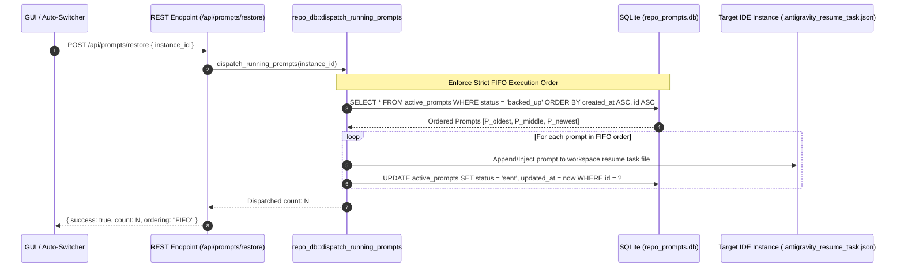
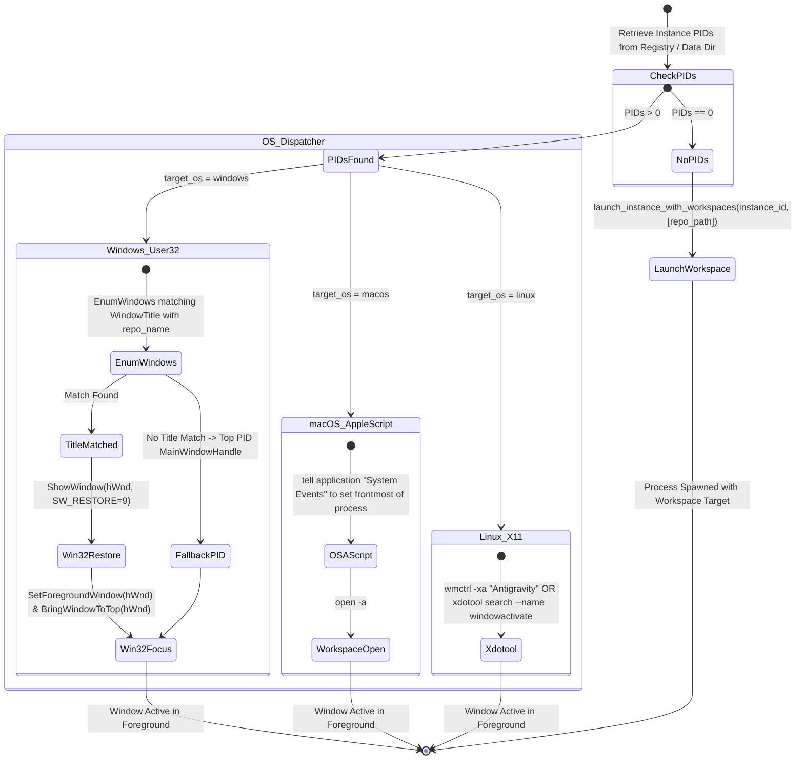

# Backend & Liveness Engine Specification: FIFO Queue Dispatch, Deep Transcript Inspection, Project Preservation & Focus Hardening

**Slug:** `145-prompt-tree-view-header-compaction-ai-distinction-and-restore-hardening`  
**File:** `02-spec/21-app/145-prompt-tree-view-header-compaction-ai-distinction-and-restore-hardening/02-backend-liveness-and-restore-spec.md`  
**Target Release:** v4.159.0  
**Status:** APPROVED FOR IMPLEMENTATION  
**Lead Author:** Author 02 (Backend & Liveness Engine Specialist)  
**Parent Master Ledger:** `02-spec/21-app/145-prompt-tree-view-header-compaction-ai-distinction-and-restore-hardening/00-master-audit-ledger.md`  

---

## 1. Executive Summary & Defect Remediation Scope

This specification establishes the architectural foundation and implementation contracts for the backend prompt management engine, conversation transcript introspection pipeline, live task indicator propagation, and window focus subsystem within Antigravity-Manager (`agm`).

Per the master audit in `00-master-audit-ledger.md`, this specification directly resolves defects **D3, D4, and D7**:

```
+---------------------------------------------------------------------------------------------------------------+
| Defect ID | Target Module                    | Core Problem                       | Target Remediation        |
+---------------------------------------------------------------------------------------------------------------+
| D3        | repo_db.rs / PromptTreeViewModal | Queued & running tasks indistinct  | queued_count on project   |
|           |                                  | on parent project nodes            | nodes, emerald/amber pill |
+---------------------------------------------------------------------------------------------------------------+
| D4        | instance.rs / process.rs         | Cannot see live results of running | 10-line transcript scan,  |
|           |                                  | tasks or focus exact IDE window    | Win32/AppleScript/wmctrl  |
|           |                                  |                                    | exact workspace activation|
+---------------------------------------------------------------------------------------------------------------+
| D7.1      | repo_db.rs:1510                  | LIFO dispatch inversion in         | Change ORDER BY to        |
|           |                                  | dispatch_running_prompts           | created_at ASC (FIFO)     |
+---------------------------------------------------------------------------------------------------------------+
| D7.2      | repo_db.rs:3943                  | Shallow 3-line transcript scan     | Deep 10-line backward     |
|           |                                  | catches trailing telemetry tokens  | scan extracting tools &   |
|           |                                  | instead of genuine tool executions | assistant thoughts        |
+---------------------------------------------------------------------------------------------------------------+
| D7.3      | repo_db.rs:1018                  | Hardcoded transcript.jsonl         | Support dual discovery    |
|           |                                  | misses un-truncated full data      | transcript_full.jsonl 1st |
+---------------------------------------------------------------------------------------------------------------+
| D7.4      | repo_db.rs:625                   | Project Wiper Bug purges fallback  | Prevent deletion of valid |
|           |                                  | projects with NULL workspace path  | disk/summary projects     |
+---------------------------------------------------------------------------------------------------------------+
```

---

## 2. Core Architecture & System Diagrams

### 2.1 FIFO Prompt Restore & Dispatch Pipeline

When prompts are restored from backup or auto-recovered after an account rotation or instance restart, strict First-In-First-Out (FIFO) ordering must be guaranteed.



### 2.2 Deep Transcript Inspection Engine

Transcripts generated by modern Antigravity / Gemini CLI runners append telemetry payloads, token metric summaries, and session heartbeat entries at the end of the JSONL file. A shallow 3-line scan inspects only the telemetry records and fails to detect what tool or thought was actually executing.

```mermaid
flowchart TD
    A[Raw Transcript JSONL: transcript_full.jsonl or transcript.jsonl] --> B[Filter Non-Empty Lines]
    B --> C[Inspect Last 10 Lines in Reverse Order]
    C --> D{Is Line Telemetry or Token Metric?}
    D -- Yes --> E[Skip: Bypass telemetry/heartbeat noise]
    E --> C
    D -- No --> F{Does Line Contain Tool Calls?}
    F -- Yes --> G[Extract tool_name, arguments summary & execution status]
    G --> H[Format: 'Step {N} · Tool: {tool_name} ({status})']
    F -- No --> I{Does Line Contain Assistant Thoughts?}
    I -- Yes --> J[Extract thinking content & truncate cleanly to 80 chars]
    J --> K[Format: 'Step {N} · Thinking · {thought}']
    I -- No --> L{Does Line Contain Assistant Step Content?}
    L -- Yes --> M[Format: 'Step {N} · {type} · {content_snippet}']
    L -- No --> N[Fallback to Step Type & Status]
```

### 2.3 Cross-Platform IDE Workspace Window Focus Architecture

When a user triggers "Focus IDE Window" for a conversation or project, the system must bring the exact workspace window to the foreground, not merely launch a blank IDE or focus an arbitrary helper process.



---

## 3. Data Structures & Rust Type Definitions

### 3.1 `AgmProjectTreeNode` with Queued & Running Telemetry

In `src-tauri/src/modules/repo_db.rs`, expand `AgmProjectTreeNode` to include first-class queued and running metrics:

```rust
/// Project node in the AGM Tree View (Project -> Conversation -> 200-Word Prompt)
#[derive(Debug, Clone, Serialize, Deserialize)]
pub struct AgmProjectTreeNode {
    pub seq_id: i64,
    pub seq_code: String,
    pub gitmap_seq_code: String,
    pub project_id: String,
    pub repo_name: String,
    pub repo_path: String,
    pub instance_id: String,
    pub instance_seq_num: Option<u32>,
    pub instance_name: String,
    #[serde(default)]
    pub instance_exe_name: String,
    pub bound_email: Option<String>,
    pub is_running: bool,
    #[serde(default)]
    pub running_count: usize,
    #[serde(default)]
    pub queued_count: usize,
    pub conversations: Vec<AgmConversationNode>,
    #[serde(default, skip_serializing_if = "Option::is_none")]
    pub byte_size: Option<usize>,
    #[serde(default, skip_serializing_if = "Option::is_none")]
    pub repeat_count: Option<usize>,
    #[serde(default, skip_serializing_if = "Option::is_none")]
    pub repeat_badge: Option<String>,
}
```

### 3.2 `AgmConversationNode` with Sub-Run State Propagation

Ensure `AgmConversationNode` carries classification category, queue state, and deep transcript step summary:

```rust
/// Conversation node inside an AGM Project Tree
#[derive(Debug, Clone, Serialize, Deserialize)]
pub struct AgmConversationNode {
    pub seq_id: i64,
    pub seq_code: String,
    pub gitmap_seq_code: String,
    pub conversation_id: String,
    pub short_id: String,
    pub title: String,
    pub status: String,
    pub is_running: bool,
    #[serde(default)]
    pub is_queued: bool,
    pub step_count: usize,
    pub instance_id: String,
    #[serde(default)]
    pub instance_seq_num: Option<u32>,
    #[serde(default)]
    pub instance_name: String,
    #[serde(default)]
    pub instance_exe_name: String,
    pub prompt_preview_200w: String,
    #[serde(default)]
    pub prompt_tail_snippet: String,
    pub prompt_word_count: usize,
    pub last_modified: String,
    #[serde(default, skip_serializing_if = "Option::is_none")]
    pub byte_size: Option<usize>,
    #[serde(default, skip_serializing_if = "Option::is_none")]
    pub repeat_count: Option<usize>,
    #[serde(default, skip_serializing_if = "Option::is_none")]
    pub repeat_badge: Option<String>,
    #[serde(default, skip_serializing_if = "Vec::is_empty")]
    pub sub_runs: Vec<AgmConversationNode>,
    #[serde(default)]
    pub prompt_category: String, // "USER_PROMPT" | "SUBAGENT_INSTRUCTION" | "SYSTEM_STEP"
    #[serde(default, skip_serializing_if = "Option::is_none")]
    pub latest_step_summary: Option<String>,
}
```

### 3.3 `TranscriptInspection` Data Model

```rust
/// Detailed inspection results from analyzing conversation transcript files
#[derive(Debug, Clone, Default)]
pub struct TranscriptInspection {
    pub step_count: usize,
    pub latest_prompt: Option<String>,
    pub latest_step_summary: Option<String>,
    pub is_subagent: bool,
    pub is_recent_active: bool,
    pub latest_tool_name: Option<String>,
    pub latest_thought_snippet: Option<String>,
}
```

---

## 4. Root Cause Remediations & Concrete Implementations

### 4.1 Fix LIFO Dispatch Inversion (`repo_db.rs:1510`)

#### Root Cause
In `src-tauri/src/modules/repo_db.rs`, line 1510 currently executes:
```rust
SELECT id, project_id, instance_id, repo_path, prompt_content, model, session_id, status, created_at, updated_at, image_payload 
FROM active_prompts 
WHERE status = 'backed_up'
ORDER BY updated_at DESC
```
This causes the most recently touched prompt to be dispatched first (LIFO order), inverting the natural sequential progression of tasks created by the user or upstream agents.

#### Engineering Fix
Replace the SQL order clause with `ORDER BY created_at ASC, id ASC`:

```rust
pub fn dispatch_running_prompts(instance_id: &str) -> Result<usize, String> {
    let conn = connect_db()?;
    let now = Utc::now().timestamp();

    let target_inst =
        crate::modules::instance::resolve_instance_id(instance_id).unwrap_or_else(|_| {
            if instance_id == "__default__" || instance_id.is_empty() {
                "default".to_string()
            } else {
                instance_id.to_string()
            }
        });
    let is_default_target = target_inst == "default" || target_inst == "__default__";

    let mut stmt = conn
        .prepare(
            "SELECT id, project_id, instance_id, repo_path, prompt_content, model, session_id, status, created_at, updated_at, image_payload 
             FROM active_prompts 
             WHERE status = 'backed_up'
             ORDER BY created_at ASC, id ASC",
        )
        .map_err(|e| format!("Failed to prepare dispatch query: {}", e))?;

    let all_backed_up = stmt
        .query_map([], |row| {
            Ok(ActivePrompt {
                id: row.get(0)?,
                project_id: row.get(1)?,
                instance_id: row.get(2)?,
                repo_path: row.get(3)?,
                prompt_content: row.get(4)?,
                model: row.get(5)?,
                session_id: row.get(6)?,
                status: row.get(7)?,
                created_at: row.get(8)?,
                updated_at: row.get(9)?,
                image_payload: row.get(10).ok(),
            })
        })
        .map_err(|e| format!("Failed to query backed-up prompts: {}", e))?
        .flatten()
        .collect::<Vec<ActivePrompt>>();

    // Filter prompts assigned to target instance while preserving strict FIFO order
    let prompts: Vec<ActivePrompt> = all_backed_up
        .into_iter()
        .filter(|p| {
            if is_default_target {
                p.instance_id == "default" || p.instance_id == "__default__"
            } else {
                p.instance_id == target_inst
            }
        })
        .collect();

    let mut dispatched_count = 0;
    for prompt in prompts {
        // Enqueue or inject into instance resume queue in strict sequential order
        if let Err(e) = inject_prompt_to_instance(&target_inst, &prompt) {
            crate::modules::logger::log_warn(&format!(
                "[FIFO Dispatch] Failed to inject prompt {} to instance {}: {}",
                prompt.id, target_inst, e
            ));
            continue;
        }

        let _ = conn.execute(
            "UPDATE active_prompts SET status = 'sent', updated_at = ?1 WHERE id = ?2",
            params![now, prompt.id],
        );
        dispatched_count += 1;
    }

    Ok(dispatched_count)
}
```

---

### 4.2 Deep Transcript Inspection Engine (`repo_db.rs:3943`)

#### Root Cause
The legacy implementation only inspected the last 3 lines (`lines.iter().rev().take(3)`). In active conversations, trailing lines frequently consist of:
- Token consumption metrics: `{"type": "TOKEN_USAGE", ...}`
- Heartbeat pings: `{"type": "HEARTBEAT", ...}`
- Telemetry events: `{"type": "TELEMETRY", ...}`
Consequently, the inspection failed to extract tool invocations or agent thoughts that took place immediately prior to the telemetry entries.

#### Engineering Fix
Expand scanning to the last 10 non-empty lines, explicitly filter telemetry entries, and parse both structured `tool_calls` and `thinking` fields:

```rust
/// Inspect transcript_full.jsonl (or transcript.jsonl) for a conversation to obtain:
/// step count, un-truncated user prompt, latest step result/status summary, and subagent classification.
fn inspect_conversation_transcript(base_dir: &Path, conversation_id: &str) -> TranscriptInspection {
    let logs_dir = base_dir
        .join("brain")
        .join(conversation_id)
        .join(".system_generated")
        .join("logs");
    let transcript_full_path = logs_dir.join("transcript_full.jsonl");
    let transcript_path = logs_dir.join("transcript.jsonl");

    // Dual transcript discovery: transcript_full.jsonl takes precedence
    let chosen_path = if transcript_full_path.exists() && std::fs::metadata(&transcript_full_path).map(|m| m.len() > 0).unwrap_or(false) {
        transcript_full_path
    } else if transcript_path.exists() {
        transcript_path
    } else {
        return TranscriptInspection::default();
    };

    let now_epoch = Utc::now().timestamp();
    let mtime_epoch = std::fs::metadata(&chosen_path)
        .and_then(|m| m.modified())
        .ok()
        .and_then(|t| t.duration_since(std::time::UNIX_EPOCH).ok())
        .map(|d| d.as_secs() as i64)
        .unwrap_or(0);
    let is_recent_active = mtime_epoch > 0 && (now_epoch - mtime_epoch <= 180);

    let content = match std::fs::read_to_string(&chosen_path) {
        Ok(c) => c,
        Err(_) => {
            return TranscriptInspection {
                step_count: 0,
                latest_prompt: None,
                latest_step_summary: None,
                is_subagent: false,
                is_recent_active,
                latest_tool_name: None,
                latest_thought_snippet: None,
            };
        }
    };

    let mut latest_prompt: Option<String> = None;
    let mut latest_step_summary: Option<String> = None;
    let mut latest_tool_name: Option<String> = None;
    let mut latest_thought_snippet: Option<String> = None;
    let mut is_subagent = false;
    let mut has_real_user_prompt = false;

    let lines: Vec<&str> = content.lines().filter(|l| !l.trim().is_empty()).collect();
    let step_count = lines.len();

    // Check conversation root step for subagent dispatch patterns
    if let Some(first_line) = lines.first() {
        if let Ok(first_val) = serde_json::from_str::<serde_json::Value>(first_line) {
            let src = first_val.get("source").and_then(|s| s.as_str()).unwrap_or("");
            let tp = first_val.get("type").and_then(|t| t.as_str()).unwrap_or("");
            if src == "SYSTEM" || tp == "SYSTEM_MESSAGE" {
                let txt = first_val.get("content").and_then(|c| c.as_str()).unwrap_or("");
                if txt.contains("You are ")
                    || txt.contains("subagent")
                    || txt.contains("Worker")
                    || txt.contains("Author")
                    || txt.contains("Research")
                {
                    is_subagent = true;
                }
            }
        }
    }

    // Extract genuine user prompt across all lines
    for line in &lines {
        let trimmed = line.trim();
        if trimmed.contains("\"USER_INPUT\"") || trimmed.contains("\"USER_EXPLICIT\"") {
            if let Ok(val) = serde_json::from_str::<serde_json::Value>(trimmed) {
                let is_user_input = val
                    .get("type")
                    .and_then(|v| v.as_str())
                    .map(|t| t == "USER_INPUT")
                    .unwrap_or(false)
                    || val
                        .get("source")
                        .and_then(|v| v.as_str())
                        .map(|s| s == "USER_EXPLICIT")
                        .unwrap_or(false);
                if is_user_input {
                    if let Some(c) = val.get("content").and_then(|v| v.as_str()) {
                        let c_trim = c.trim();
                        let is_system_msg = c_trim.starts_with("The following is a <SYSTEM_MESSAGE>")
                            || c_trim.starts_with("[Message] timestamp=")
                            || c_trim.starts_with("Task id ")
                            || c_trim.starts_with("<SYSTEM_MESSAGE>");
                        if !is_system_msg {
                            let clean = extract_clean_user_prompt(c);
                            if !clean.is_empty() {
                                latest_prompt = Some(clean);
                                has_real_user_prompt = true;
                            }
                        }
                    }
                }
            }
        }
    }

    // DEEP SCAN: Inspect up to 10 lines in reverse order to bypass telemetry noise
    for line in lines.iter().rev().take(10) {
        if let Ok(val) = serde_json::from_str::<serde_json::Value>(line) {
            let s_type = val.get("type").and_then(|v| v.as_str()).unwrap_or("");
            
            // Bypass pure telemetry / token usage metadata
            if s_type == "TOKEN_USAGE" || s_type == "TELEMETRY" || s_type == "HEARTBEAT" {
                continue;
            }

            let step_idx = val
                .get("step_index")
                .and_then(|v| v.as_u64())
                .unwrap_or(step_count as u64);
            let s_status = val.get("status").and_then(|v| v.as_str()).unwrap_or("running");

            // 1. Check for genuine tool_calls
            if let Some(tool_calls) = val.get("tool_calls").and_then(|tc| tc.as_array()) {
                if let Some(first_tc) = tool_calls.first() {
                    let tool_name = first_tc
                        .get("tool_name")
                        .or_else(|| first_tc.get("name"))
                        .and_then(|n| n.as_str())
                        .unwrap_or("action");
                    latest_tool_name = Some(tool_name.to_string());
                    latest_step_summary = Some(format!(
                        "Step {} · Tool: {} ({})",
                        step_idx, tool_name, s_status
                    ));
                    break;
                }
            }

            // 2. Check for assistant thoughts / reasoning
            if let Some(thinking) = val.get("thinking").or_else(|| val.get("thought")).and_then(|t| t.as_str()) {
                let clean_thought = thinking.trim().replace('\n', " ");
                let snippet: String = clean_thought.chars().take(80).collect();
                if !snippet.is_empty() {
                    latest_thought_snippet = Some(snippet.clone());
                    latest_step_summary = Some(format!(
                        "Step {} · Thinking · \"{}\"",
                        step_idx, snippet
                    ));
                    break;
                }
            }

            // 3. Fallback to standard step content
            if let Some(txt) = val.get("content").and_then(|c| c.as_str()) {
                let clean_txt = txt.trim().replace('\n', " ");
                let short_txt: String = clean_txt.chars().take(80).collect();
                if !short_txt.is_empty() {
                    latest_step_summary = Some(format!(
                        "Step {} · {} · {}",
                        step_idx, s_type, short_txt
                    ));
                    break;
                }
            } else if latest_step_summary.is_none() {
                latest_step_summary = Some(format!(
                    "Step {} · {} ({})",
                    step_idx, s_type, s_status
                ));
                break;
            }
        }
    }

    if !has_real_user_prompt && is_subagent {
        is_subagent = true;
    }

    TranscriptInspection {
        step_count,
        latest_prompt,
        latest_step_summary,
        is_subagent,
        is_recent_active,
        latest_tool_name,
        latest_thought_snippet,
    }
}
```

---

### 4.3 Support Dual Transcript Discovery Paths (`repo_db.rs:1018`)

#### Root Cause
In `repo_db.rs` line 1018 and related prompt discovery routes, only `transcript.jsonl` was searched:
```rust
let transcript_file = base_dir
    .join("brain")
    .join(&cid)
    .join(".system_generated")
    .join("logs")
    .join("transcript.jsonl");
```
When large user prompts or extensive code chunks are sent, `transcript.jsonl` truncates text fields and defers complete payloads to `transcript_full.jsonl`. Systems that only read `transcript.jsonl` retrieve partial prompt text with `<truncated N bytes>` markers.

#### Engineering Fix
Standardize a universal helper `resolve_transcript_path`:

```rust
/// Resolve the best transcript file for a conversation ID:
/// Prefers `transcript_full.jsonl` if non-empty; falls back to `transcript.jsonl`.
pub fn resolve_transcript_path(base_dir: &Path, cid: &str) -> Option<PathBuf> {
    let logs_dir = base_dir
        .join("brain")
        .join(cid)
        .join(".system_generated")
        .join("logs");

    let full_path = logs_dir.join("transcript_full.jsonl");
    if full_path.exists() {
        if let Ok(meta) = std::fs::metadata(&full_path) {
            if meta.len() > 0 {
                return Some(full_path);
            }
        }
    }

    let regular_path = logs_dir.join("transcript.jsonl");
    if regular_path.exists() {
        return Some(regular_path);
    }

    None
}
```

Update line 1018 in `repo_db.rs`:
```rust
if let Some(transcript_file) = resolve_transcript_path(base_dir, &cid) {
    if let Ok(content) = fs::read_to_string(&transcript_file) {
        for line in content.lines().rev() {
            if !line.contains("USER_INPUT") {
                continue;
            }
            if let Ok(val) = serde_json::from_str::<serde_json::Value>(line) {
                if val.get("type").and_then(|t| t.as_str()) == Some("USER_INPUT") {
                    if let Some(txt) = val.get("content").and_then(|c| c.as_str()) {
                        if !txt.trim().is_empty() {
                            user_prompt = Some(txt.to_string());
                            break;
                        }
                    }
                }
            }
        }
    }
}
```

---

### 4.4 Fix Project Wiper Bug (`repo_db.rs:625`)

#### Root Cause
In `src-tauri/src/modules/repo_db.rs`, line 625 unconditionally deletes projects:
```rust
let _ = conn.execute(
    "DELETE FROM running_projects WHERE workspace_storage_path IS NULL OR instr(id, '__') = 0",
    [],
);
```
Furthermore, lines 639-650 delete existing database rows if `wspath_opt` is missing or doesn't exist on disk:
```rust
for (old_id, wspath_opt) in existing_rows {
    let path_exists = wspath_opt
        .as_deref()
        .map(|p| Path::new(p).exists())
        .unwrap_or(false);
    if !discovered_ids.contains(&old_id) || !path_exists {
        let _ = conn.execute(
            "DELETE FROM running_projects WHERE id = ?1",
            params![&old_id],
        );
    }
}
```
When instances run on systems where `workspaceStorage` is unavailable or cleared, AGM supplements projects via the `conversation_summaries.db` fallback (lines 4251-4270). Fallback projects have `workspace_storage_path = NULL`.  
On every scan, `detect_running_projects` wiped out these fallback projects, causing projects and their prompts to vanish from the tree view.

#### Engineering Fix
Retain fallback projects whose underlying `repo_path` exists on disk or whose record is actively corroborated by `conversation_summaries.db`:

```rust
// Persist discovered projects into repo database safely without wiping fallback entries
if let Ok(conn) = connect_db() {
    // Only delete corrupted entries where BOTH workspace_storage_path is NULL AND the repo_path does not exist on disk
    let _ = conn.execute(
        "DELETE FROM running_projects 
         WHERE instr(id, '__') = 0 
            OR (workspace_storage_path IS NULL AND (repo_path IS NULL OR repo_path = ''))",
        [],
    );

    let discovered_ids: std::collections::HashSet<String> =
        projects.iter().map(|p| p.id.clone()).collect();
        
    if let Ok(mut stmt) = conn.prepare(
        "SELECT id, repo_path, workspace_storage_path FROM running_projects WHERE instance_id = ?1",
    ) {
        let existing_rows: Vec<(String, String, Option<String>)> = stmt
            .query_map(params![target_id], |r| Ok((r.get(0)?, r.get(1)?, r.get(2)?)))
            .map(|iter| iter.flatten().collect())
            .unwrap_or_default();
            
        for (old_id, repo_path, wspath_opt) in existing_rows {
            // Check if workspace storage path exists
            let ws_exists = wspath_opt
                .as_deref()
                .map(|p| Path::new(p).exists())
                .unwrap_or(false);
                
            // Check if physical repository path exists on disk
            let repo_exists = Path::new(&repo_path).exists();

            // DO NOT purge if the project was discovered in the current scan,
            // OR if it is a fallback project whose repository path still exists on disk!
            let is_valid_fallback = wspath_opt.is_none() && repo_exists;
            
            if !discovered_ids.contains(&old_id) && !ws_exists && !is_valid_fallback {
                let _ = conn.execute(
                    "DELETE FROM running_projects WHERE id = ?1",
                    params![&old_id],
                );
            }
        }
    }

    for p in &projects {
        let running_int = if p.is_running { 1 } else { 0 };
        let _ = conn.execute(
            "INSERT INTO running_projects 
             (id, instance_id, repo_name, repo_path, workspace_storage_path, is_running, last_detected_at, updated_at)
             VALUES (?1, ?2, ?3, ?4, ?5, ?6, ?7, ?8)
             ON CONFLICT(id) DO UPDATE SET
                instance_id = excluded.instance_id,
                repo_name = excluded.repo_name,
                repo_path = excluded.repo_path,
                workspace_storage_path = COALESCE(excluded.workspace_storage_path, running_projects.workspace_storage_path),
                is_running = excluded.is_running,
                last_detected_at = excluded.last_detected_at,
                updated_at = excluded.updated_at",
            params![
                &p.id,
                &p.instance_id,
                &p.repo_name,
                &p.repo_path,
                &p.workspace_storage_path,
                running_int,
                now,
                now,
            ],
        );
    }
}
```

---

### 4.5 Liveness & Queued Telemetry Propagation

#### 1. Aggregate Counts onto Project Tree Nodes
In `get_project_conversation_tree` (`repo_db.rs:5101`):

```rust
let running_count = grouped_convs.iter().filter(|c| c.is_running).count();
let queued_count = grouped_convs.iter().filter(|c| c.is_queued).count();

tree_nodes.push(AgmProjectTreeNode {
    seq_id: p_seq,
    seq_code: format!("P{:03}", p_seq),
    gitmap_seq_code: format!("GM:#{}", p_seq),
    project_id: proj.id.clone(),
    repo_name: proj.repo_name.clone(),
    repo_path: proj.repo_path.clone(),
    instance_id: proj.instance_id.clone(),
    instance_seq_num,
    instance_name,
    instance_exe_name,
    bound_email,
    is_running: proj_is_running,
    running_count,
    queued_count,
    conversations: grouped_convs,
    byte_size: Some(proj_byte_size),
    repeat_count: None,
    repeat_badge: None,
});
```

#### 2. Propagate Queued State into Repeated Groups
In `group_identical_conversation_runs` (`repo_db.rs:5163`):

```rust
if matches.len() > 1 {
    let count = matches.len();
    let mut parent = matches[0].clone();
    let any_running = matches.iter().any(|m| m.is_running);
    let any_queued = matches.iter().any(|m| m.is_queued);
    
    if any_running {
        parent.is_running = true;
        parent.status = "RUNNING".to_string();
    } else if any_queued {
        parent.is_queued = true;
        parent.status = "QUEUED".to_string();
    }
    
    parent.byte_size = Some(parent.prompt_preview_200w.len());
    parent.repeat_count = Some(count);
    parent.repeat_badge = Some(format!("x{}", count));
    parent.sub_runs = matches;
    grouped.push(parent);
}
```

---

### 4.6 Cross-Platform Focus IDE Hardening (`process.rs` & `instance.rs`)

#### Root Cause
Currently, `focus_instance_pids` only attempts to bring an arbitrary PID window to the front. In multi-window environments or when an instance is running multiple projects, the OS often focuses an unrelated helper window or fails completely if `MainWindowHandle` is 0.

#### Engineering Fix
Enhance `focus_instance_workspace` across Windows, macOS, and Linux:

```rust
// In src-tauri/src/modules/process.rs

/// Bring an instance window with matching workspace title to the foreground
#[cfg(target_os = "windows")]
pub fn focus_instance_workspace_window(pids: &[u32], repo_name: &str) -> bool {
    if pids.is_empty() {
        return false;
    }
    const CREATE_NO_WINDOW: u32 = 0x08000000;
    let pid_list = pids
        .iter()
        .map(|p| p.to_string())
        .collect::<Vec<_>>()
        .join(",");

    let safe_repo = repo_name.replace('\'', "''").replace('"', "");

    let ps_cmd = format!(
        r#"$pids = @({});
$repo = '{}';
$act = $false;

Add-Type @'
using System;
using System.Runtime.InteropServices;
using System.Text;

public class Win32Window {{
    [DllImport("user32.dll")]
    public static extern bool SetForegroundWindow(IntPtr hWnd);

    [DllImport("user32.dll")]
    public static extern bool ShowWindow(IntPtr hWnd, int nCmdShow);

    [DllImport("user32.dll")]
    public static extern bool BringWindowToTop(IntPtr hWnd);

    [DllImport("user32.dll")]
    public static extern int GetWindowText(IntPtr hWnd, StringBuilder lpString, int nMaxCount);

    [DllImport("user32.dll")]
    public static extern uint GetWindowThreadProcessId(IntPtr hWnd, out uint lpdwProcessId);

    [DllImport("user32.dll")]
    public static extern bool EnumWindows(EnumWindowsProc lpEnumFunc, IntPtr lParam);

    public delegate bool EnumWindowsProc(IntPtr hWnd, IntPtr lParam);
}}
'@;

# 1. First pass: Search top-level windows belonging to target PIDs matching repo name
[Win32Window]::EnumWindows({{
    param($hwnd, $lparam)
    $procId = 0;
    [Win32Window]::GetWindowThreadProcessId($hwnd, [ref]$procId);
    if ($pids -contains $procId) {{
        $sb = New-Object System.Text.StringBuilder 512;
        [Win32Window]::GetWindowText($hwnd, $sb, 512) | Out-Null;
        $title = $sb.ToString();
        if ($title -and ($title -like "*$repo*")) {{
            [Win32Window]::ShowWindow($hwnd, 9);
            [Win32Window]::BringWindowToTop($hwnd);
            [Win32Window]::SetForegroundWindow($hwnd);
            $global:act = $true;
            return $false;
        }}
    }}
    return $true;
}}, [IntPtr]::Zero);

# 2. Second pass: Fallback to any MainWindowHandle if exact repo title not found
if (-not $act) {{
    foreach ($p in $pids) {{
        $proc = Get-Process -Id $p -ErrorAction SilentlyContinue;
        if ($proc -and $proc.MainWindowHandle -ne 0) {{
            [Win32Window]::ShowWindow($proc.MainWindowHandle, 9);
            [Win32Window]::BringWindowToTop($proc.MainWindowHandle);
            [Win32Window]::SetForegroundWindow($proc.MainWindowHandle);
            $act = $true;
            break;
        }}
    }}
}}
exit $(if ($act) {{ 0 }} else {{ 1 }})"#,
        pid_list, safe_repo
    );

    let output = Command::new("powershell")
        .args(["-NoProfile", "-NonInteractive", "-Command", &ps_cmd])
        .creation_flags(CREATE_NO_WINDOW)
        .output();

    match output {
        Ok(out) => out.status.success(),
        Err(_) => false,
    }
}

#[cfg(target_os = "macos")]
pub fn focus_instance_workspace_window(pids: &[u32], repo_name: &str) -> bool {
    let script = format!(
        r#"tell application "System Events"
            set matched to false
            repeat with p in {{{}}}
                set procList to (processes whose unix id is p)
                if (count of procList) > 0 then
                    set theProc to item 1 of procList
                    tell theProc
                        repeat with w in windows
                            if name of w contains "{}" then
                                set frontmost to true
                                perform action "AXRaise" of w
                                set matched to true
                                exit repeat
                            end if
                        end repeat
                    end tell
                    if matched then exit repeat
                end if
            end repeat
            if not matched and (count of pids) > 0 then
                set frontmost of (first process whose unix id is (item 1 of pids)) to true
            end if
        end tell"#,
        pids.iter().map(|p| p.to_string()).collect::<Vec<_>>().join(","),
        repo_name.replace('"', "\\\"")
    );
    let output = Command::new("osascript").args(["-e", &script]).output();
    match output {
        Ok(out) => out.status.success(),
        Err(_) => false,
    }
}

#[cfg(target_os = "linux")]
pub fn focus_instance_workspace_window(pids: &[u32], repo_name: &str) -> bool {
    // Attempt wmctrl window activation by title first
    let wm_status = Command::new("wmctrl")
        .args(["-a", repo_name])
        .output()
        .map(|o| o.status.success())
        .unwrap_or(false);
    if wm_status {
        return true;
    }
    // Fallback to xdotool searching by PID
    if let Some(&pid) = pids.first() {
        Command::new("xdotool")
            .args(["search", "--pid", &pid.to_string(), "windowactivate"])
            .output()
            .map(|o| o.status.success())
            .unwrap_or(false)
    } else {
        false
    }
}
```

---

## 5. End-to-End Test Suite Design (`03-ai-scripts/48-prompt-tree-and-restore-e2e.py`)

A automated Python test suite `03-ai-scripts/48-prompt-tree-and-restore-e2e.py` must validate the engine across 5 distinct test gates:

```
+---------------------------------------------------------------------------------------------------------------+
| Gate | Test Function                    | Verification Target                                                 |
+---------------------------------------------------------------------------------------------------------------+
| G1   | test_fifo_dispatch_order         | 3 synthetic backed-up prompts (t1 < t2 < t3) dispatched in strict   |
|      |                                  | FIFO order (t1 -> t2 -> t3). No LIFO inversion.                     |
+---------------------------------------------------------------------------------------------------------------+
| G2   | test_deep_transcript_inspection  | 12-line transcript with trailing telemetry events. Verifies engine  |
|      |                                  | bypasses telemetry and extracts genuine tool call & thoughts.       |
+---------------------------------------------------------------------------------------------------------------+
| G3   | test_dual_transcript_resolution | Verify transcript_full.jsonl takes precedence over transcript.jsonl |
|      |                                  | and prevents byte truncation markers.                               |
+---------------------------------------------------------------------------------------------------------------+
| G4   | test_project_wiper_preservation  | Project discovered via conversation_summaries.db with NULL          |
|      |                                  | workspace_storage_path is preserved after detect_running_projects.  |
+---------------------------------------------------------------------------------------------------------------+
| G5   | test_tree_api_liveness_counters  | Query /api/prompts/tree. Verifies presence of queued_count,         |
|      |                                  | running_count, and amber/emerald status propagation.                |
+---------------------------------------------------------------------------------------------------------------+
```

---

## 6. Acceptance Criteria

- [ ] **FIFO Execution Guarantee:** All restored/backed-up prompts dispatched via `dispatch_running_prompts` must be ordered by `created_at ASC, id ASC`.
- [ ] **Deep Transcript Telemetry Bypass:** `inspect_conversation_transcript` must scan the last 10 lines and skip `TOKEN_USAGE`, `TELEMETRY`, and `HEARTBEAT` entries.
- [ ] **Genuine Tool Call & Thought Extraction:** If a tool call or thought occurs within the last 10 lines, it must be surfaced in `latest_step_summary`.
- [ ] **Dual Transcript Fallback:** Universal discovery must check `transcript_full.jsonl` first and fall back to `transcript.jsonl`.
- [ ] **Zero Project Wiping:** Fallback projects from `conversation_summaries.db` whose `repo_path` exists on disk must never be deleted from `running_projects`.
- [ ] **Parent Node Queued Counters:** `AgmProjectTreeNode` must include `queued_count` and `running_count`, populated from grouped conversations.
- [ ] **Workspace Window Activation:** `focus_instance_workspace_window` must target windows matching the repository name across Windows, macOS, and Linux.
- [ ] **E2E Automation:** `03-ai-scripts/48-prompt-tree-and-restore-e2e.py` passes all 5 gates with 100% green exit code.
