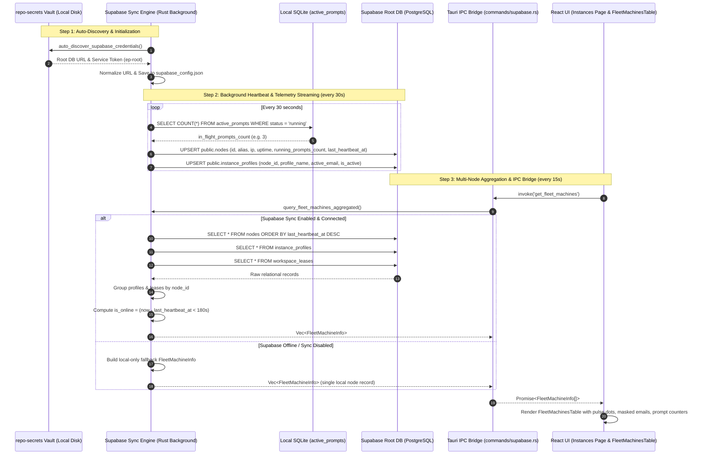

# Architecture Spec: Multi-Machine Fleet Synchronization & Remote Supabase Aggregation

**Slug:** `146-supabase-multi-machine-instances-and-remote-fleet-sync`  
**File:** `02-spec/21-app/146-supabase-multi-machine-instances-and-remote-fleet-sync/01-architecture-spec.md`  
**Target Release:** v4.159.0  
**Status:** APPROVED FOR IMPLEMENTATION  
**Lead Author:** Antigravity Architect (Author 01)  
**Parent Master Ledger:** `02-spec/21-app/146-supabase-multi-machine-instances-and-remote-fleet-sync/00-master-audit-ledger.md`  

---

## 1. Architectural Overview & Problem Context

Antigravity-Manager (`agm`) supports multi-instance workflows locally and cluster-wide operations across multiple developer workstations and headless workers (e.g., `worker-1`, `worker-2`, local desktop). While individual machines can persist local state into SQLite databases (`repo_prompts.db`, `active_prompts`, `instance_registry.json`), developers operating in shared environments require **cross-machine fleet visibility**:
1. Which worker machines are currently active and communicating with the cluster?
2. Which IDE instances are running on each worker machine?
3. Which Google / Antigravity accounts are bound to those instances?
4. How many AI prompts are currently actively executing (in-flight) on each machine?
5. How can we prevent concurrent account collisions across distinct physical hosts?

This architecture leverages the existing **Supabase Root DB** synchronization infrastructure as the centralized distributed state registry. By harvesting credentials automatically from `repo-secrets`, streaming lightweight background heartbeats enriched with live prompt telemetry, and aggregating relational records (`nodes`, `instance_profiles`, `workspace_leases`), Antigravity-Manager provides a real-time read-only fleet overview in the UI without opening remote instances or exposing private credential secrets.

---

## 2. End-to-End System Data Flow Architecture

The fleet synchronization pipeline spans credential auto-discovery, background heartbeat streaming, centralized relational querying, IPC dispatching, and frontend visualization.

### 2.1 Complete Pipeline Flow Diagram



---

## 3. Relational Schema Contracts (Supabase Root DB)

The Supabase Root Database acts as the cluster-wide source of truth across all physical nodes. The schema comprises three relational tables in schema `public` and one atomic lease management function.

### 3.1 `public.nodes` Table Specification

Stores the host machine identity, network addressing, uptime, and aggregated activity telemetry.

```sql
-- 1. Nodes Registry Table
CREATE TABLE IF NOT EXISTS public.nodes (
    id TEXT PRIMARY KEY,                           -- Machine unique identifier (e.g., machine_uid)
    alias TEXT NOT NULL DEFAULT '',                -- Human-readable label (e.g. "worker-1", "MacBook-Pro")
    ip_address TEXT NOT NULL DEFAULT '',           -- Primary LAN/WAN IP address
    uptime_seconds BIGINT NOT NULL DEFAULT 0,      -- Seconds since current agm process started
    project_count INT NOT NULL DEFAULT 0,          -- Count of registered local IDE instances
    running_prompts_count INT NOT NULL DEFAULT 0,  -- Live count of in-flight prompts executing
    last_heartbeat_at BIGINT NOT NULL DEFAULT 0,   -- Unix timestamp (seconds) of latest heartbeat
    status TEXT NOT NULL DEFAULT 'online'          -- Reported status ('online' | 'degraded' | 'offline')
);

CREATE INDEX IF NOT EXISTS idx_nodes_heartbeat ON public.nodes (last_heartbeat_at DESC);
```

#### Field Specifications:
- `id` (`TEXT PK`): Deterministic hardware/OS machine ID generated via `machine_uid::get()`.
- `alias` (`TEXT`): User-configured node alias from `supabase_config.json` (defaults to `Node-<short_id>`).
- `ip_address` (`TEXT`): Discovered local outbound IP via socket probe (e.g., `192.168.1.105`).
- `uptime_seconds` (`BIGINT`): Calculated process duration `Utc::now().timestamp() - PROCESS_START_TIME`.
- `project_count` (`INT`): Number of configured instances in the local instance registry.
- `running_prompts_count` (`INT`): Count of currently executing prompts (`status = 'running'`).
- `last_heartbeat_at` (`BIGINT`): Epoch timestamp updated every heartbeat cycle (default 30s).
- `status` (`TEXT`): Heartbeat emitter health flag.

### 3.2 `public.instance_profiles` Table Specification

Tracks individual instance profiles registered on each node, including bound account emails and activity states.

```sql
-- 2. Instance Profiles Status Table (Child of Nodes)
CREATE TABLE IF NOT EXISTS public.instance_profiles (
    id TEXT PRIMARY KEY,                                     -- Format: "{node_id}_{instance_id}"
    node_id TEXT NOT NULL REFERENCES public.nodes(id) ON DELETE CASCADE,
    profile_name TEXT NOT NULL,                             -- Name of instance (e.g. "Default", "Worker-Dev")
    active_account_id TEXT NOT NULL DEFAULT '',             -- UUID of bound account
    active_account_email TEXT NOT NULL DEFAULT '',          -- Plaintext email of bound account
    is_active BOOLEAN NOT NULL DEFAULT false,               -- Whether instance is the default/active instance
    quota_percent INT NOT NULL DEFAULT 100,                 -- Estimated quota percentage remaining
    status TEXT NOT NULL DEFAULT 'idle',                    -- Execution status ('running' | 'idle')
    updated_at BIGINT NOT NULL DEFAULT 0                    -- Unix timestamp of last profile state sync
);

CREATE INDEX IF NOT EXISTS idx_profiles_node ON public.instance_profiles (node_id);
```

### 3.3 `public.workspace_leases` Table Specification

Enforces distributed mutual exclusion on accounts, guaranteeing that no two nodes bind or dispatch prompts to the same Google account simultaneously.

```sql
-- 3. Distributed Workspace & Account Leases Table
CREATE TABLE IF NOT EXISTS public.workspace_leases (
    account_id TEXT PRIMARY KEY,                            -- Account UUID being leased exclusively
    account_email TEXT NOT NULL DEFAULT '',                 -- Email bound to the lease
    node_id TEXT NOT NULL REFERENCES public.nodes(id) ON DELETE CASCADE,
    node_alias TEXT NOT NULL DEFAULT '',                    -- Holding node alias
    ip_address TEXT NOT NULL DEFAULT '',                    -- Holding node IP address
    profile_name TEXT NOT NULL DEFAULT '',                  -- Profile name holding the lease
    leased_at BIGINT NOT NULL DEFAULT 0,                    -- Unix timestamp when lease was acquired
    expires_at BIGINT NOT NULL DEFAULT 0                    -- Unix timestamp when lease expires
);

CREATE INDEX IF NOT EXISTS idx_leases_expires ON public.workspace_leases (expires_at DESC);
CREATE INDEX IF NOT EXISTS idx_leases_node ON public.workspace_leases (node_id);
```

### 3.4 Schema Migration SQL Contract (`supabase_schema.rs`)

To ensure backward compatibility for existing deployments where `public.nodes` does not yet contain `running_prompts_count`, the migration script executes an idempotent column patch:

```sql
-- Migration: Add running_prompts_count column if not present
DO $$
BEGIN
    IF NOT EXISTS (
        SELECT 1 FROM information_schema.columns 
        WHERE table_schema = 'public' 
          AND table_name = 'nodes' 
          AND column_name = 'running_prompts_count'
    ) THEN
        ALTER TABLE public.nodes ADD COLUMN running_prompts_count INT NOT NULL DEFAULT 0;
    END IF;
END $$;
```

---

## 4. Data Structures Contracts (Rust & TypeScript)

To eliminate impedance mismatches between the Rust backend and the React frontend, the following serializable data structures are established as the canonical contract.

### 4.1 Rust Data Structures (`src-tauri/src/commands/supabase.rs`)

```rust
use serde::{Deserialize, Serialize};

/// Summary of an instance profile running on a fleet node
#[derive(Debug, Clone, Serialize, Deserialize)]
pub struct FleetInstanceSummary {
    pub profile_id: String,
    pub profile_name: String,
    pub is_running: bool,
    pub bound_account_id: Option<String>,
    pub bound_account_email: Option<String>,
}

/// Detailed information on an active account lease held by a node
#[derive(Debug, Clone, Serialize, Deserialize)]
pub struct FleetLeaseInfo {
    pub account_id: String,
    pub account_email: String,
    pub profile_name: String,
    pub leased_at: i64,
    pub expires_at: i64,
    pub is_expired: bool,
}

/// Aggregated multi-machine fleet info returned by Tauri IPC
#[derive(Debug, Clone, Serialize, Deserialize)]
pub struct FleetMachineInfo {
    pub node_id: String,
    pub node_alias: String,
    pub os_info: Option<String>,
    pub ip_address: String,
    pub is_online: bool,
    pub last_heartbeat_timestamp: i64,
    pub uptime_seconds: u64,
    pub in_flight_prompts_count: usize,
    pub active_instances: Vec<FleetInstanceSummary>,
    pub bound_emails: Vec<String>,
    pub leases: Vec<FleetLeaseInfo>,
    pub is_local: bool,
}
```

### 4.2 TypeScript Type Definitions (`src/services/supabaseService.ts`)

```typescript
export interface FleetInstanceSummary {
    profile_id: string;
    profile_name: string;
    is_running: boolean;
    bound_account_id?: string;
    bound_account_email?: string;
}

export interface FleetLeaseInfo {
    account_id: string;
    account_email: string;
    profile_name: string;
    leased_at: number;
    expires_at: number;
    is_expired: boolean;
}

export interface FleetMachineInfo {
    node_id: string;
    node_alias: string;
    os_info?: string;
    ip_address: string;
    is_online: boolean;
    last_heartbeat_timestamp: number;
    uptime_seconds: number;
    in_flight_prompts_count: number;
    active_instances: FleetInstanceSummary[];
    bound_emails: string[];
    leases?: FleetLeaseInfo[];
    is_local?: boolean;
}
```

---

## 5. Heartbeat In-Flight Prompts Telemetry Specification

The heartbeat function `send_heartbeat()` in `src-tauri/src/modules/supabase_sync.rs` runs on an autonomous background timer (default interval: 30 seconds). To provide real-time prompt activity across the fleet without costly ad-hoc scans, the heartbeat collector computes in-flight prompts locally before dispatching the payload.

### 5.1 In-Flight Prompt Computation Algorithm

1. **Query Local SQLite:**
   Connect to `repo_prompts.db` via `crate::modules::repo_db::connect_db()`.
2. **Execute Status Count:**
   ```sql
   SELECT count(*) FROM active_prompts WHERE status = 'running'
   ```
3. **In-Memory Fallback Reconciliation:**
   Inspect `get_memory_prompts_map()` in `repo_db` to incorporate any newly spawned prompts that have not yet flushed to SQLite.
4. **Build Enriched Payload:**
   ```rust
   let node_payload = json!({
       "id": node_id,
       "alias": node_alias,
       "ip_address": local_ip,
       "uptime_seconds": uptime,
       "project_count": project_count,
       "running_prompts_count": in_flight_prompts_count,
       "last_heartbeat_at": now,
       "status": "online"
   });
   ```
5. **PostgREST Schema Resilience:**
   If the remote Supabase database does not yet have the `running_prompts_count` column, the upsert will return a PostgREST error. The engine catches column-missing errors, strips `running_prompts_count`, re-attempts the base upsert, and emits an administrative warning directing the user to run the schema migration.

---

## 6. Multi-Node Aggregation & Online/Offline Detection Logic

When the frontend calls `get_fleet_machines()`, the backend executes an aggregation routine:

### 6.1 Step-by-Step Aggregation Algorithm

```
Algorithm: query_fleet_machines()
Input: Current local state, SupabaseConfig
Output: Vec<FleetMachineInfo>

1. Locate enabled endpoint with role == "root" in SupabaseConfig.
   If none exists or config.is_sync_enabled == false:
       Return [build_local_fallback_machine()].

2. Construct SupabaseClient for the root endpoint.

3. Concurrently or sequentially fetch:
   - nodes_resp = client.select("nodes", "select=*&order=last_heartbeat_at.desc")
   - profiles_resp = client.select("instance_profiles", "select=*")
   - leases_resp = client.select("workspace_leases", "select=*")

4. Let now = Utc::now().timestamp().
   Let local_node_id = get_local_node_id().

5. Index instance_profiles into HashMap<node_id, Vec<FleetInstanceSummary>>:
   - profile_id = p["id"]
   - profile_name = p["profile_name"]
   - is_running = p["is_active"] || p["status"] == "running"
   - bound_account_id = p["active_account_id"]
   - bound_account_email = p["active_account_email"]

6. Index workspace_leases into HashMap<node_id, Vec<FleetLeaseInfo>>:
   - is_expired = lease["expires_at"] < now

7. For each row in nodes_resp:
   - last_hb = row["last_heartbeat_at"]
   - is_online = (now - last_hb) < 180 seconds (3 minute threshold)
   - node_id = row["id"]
   - is_local = (node_id == local_node_id)
   - node_profiles = profiles_map.remove(node_id).unwrap_or_default()
   - node_leases = leases_map.remove(node_id).unwrap_or_default()
   - bound_emails = Extract unique, non-empty emails from node_profiles and node_leases.
   - in_flight_prompts = row["running_prompts_count"].unwrap_or(0)
   - If is_local:
       Override in_flight_prompts with live local SQLite count.
   - Construct FleetMachineInfo and push to result list.

8. Sorting Invariant:
   - Local node (is_local == true) appears FIRST.
   - Remaining nodes sorted: online nodes first, then alphabetical by node_alias.
```

### 6.2 Liveness Window Rationale (180 Seconds)
The heartbeat sends every 30 seconds by default. A 180-second window permits up to 5 consecutive dropped heartbeat packets or network jitter intervals before categorizing a machine as offline, avoiding false-positive status flipping.

---

## 7. Error Handling, Fallback, and Offline Resilience

Antigravity-Manager must never crash or display blank screens if network connectivity to Supabase degrades or if Supabase sync is disabled:

1. **Sync Disabled:**
   When `is_sync_enabled == false`, `get_fleet_machines` immediately constructs and returns a single local machine record with `is_local: true`, `is_online: true`, and local instance profile data. The UI displays an informational badge indicating sync is disabled.
2. **Network Timeout / Supabase Unreachable:**
   Network calls to Supabase employ a strict 5000ms client timeout. If Supabase fails to respond, the call catches the error, logs a warning, and falls back to returning the local machine entry.
3. **Empty Remote Nodes:**
   If Supabase is connected but only the local node exists in `public.nodes`, the UI renders a graceful informational banner: *"This machine is currently the only active node registered in the Supabase Root DB."*

---

## 8. Verification & Test Plan

1. **Unit Test (Rust):**
   - Verify `FleetMachineInfo` serialization and deserialization.
   - Verify online detection: timestamp 100s ago is online, timestamp 200s ago is offline.
   - Verify email deduplication logic across profiles and leases.
2. **IPC Integration Test:**
   - Execute `get_fleet_machines` in both sync-enabled and sync-disabled modes.
   - Ensure `is_local == true` correctly identifies the current workstation.
3. **Pre-flight Gate Verification:**
   - `cargo fmt -- --check`
   - `cargo clippy --all-targets --all-features`
   - `npm run build`
