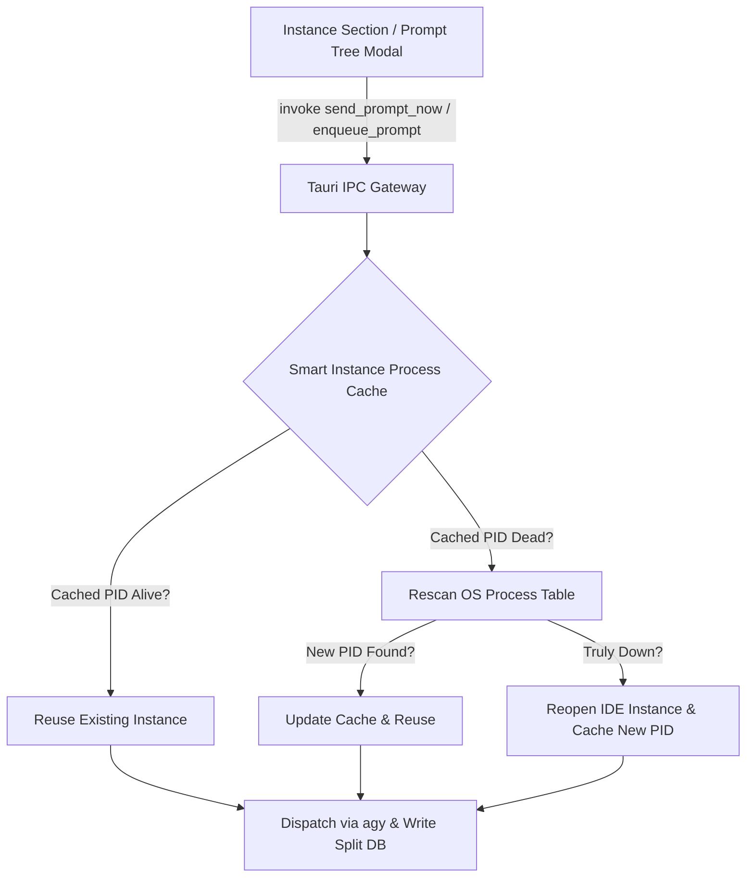

# Architecture Specification: Task 147 - Smart Instance Process Cache & Prompt Dispatch Cleanup

## 1. Verbatim User Request Ingestion
> "Look, the sending prompt from the instance section to the IDE does not work. Find the root cause of it, why we cannot send the prompt and why we cannot enqueue the prompt. In both cases, it has no effect so far. Every time it tries to open or reopen the IDE instance, which is very wrong. If the instance is already open, you have to check in the process if this instance is already running. If the instance is already running, you need to cache it so that you can understand if the instance. That means you have to have the smart logic. When we send it or queue the prompt, first, you have to check how many instances are running for that Antigravity Tools Manager. You need to cache those as well. Let's say you find that it is running in the cache, but then again, you try to send and see this PID is closed. Then you have to rerun it and see if it is running again. If it is not running, then and only then you have to reopen and send the prompt. It is not happening right now like this. It is not working at all. You need to work on it, find the root cause, do the end-to-end testing, do things from CLI as well. Currently, the view is nice. I appreciate that, but there are too many tags, which is not necessary in the prompt section. Too many target bracket item, which can be reduced. And too many running items, which is not running, so you need to fix that as well. I hope you respect this and try to fix all this stuff and make a minor bump and release again."

## 2. Root Cause Analysis
1. **Unregistered IPC Command & Misrouted Resend**:
   - `handleEnqueuePrompt` in `src/components/instances/PromptTreeViewModal.tsx` called `invoke('enqueue_prompt', ...)`. However, `enqueue_prompt` was never registered as a Tauri command in `src-tauri/src/lib.rs` or implemented in `src-tauri/src/commands/instance.rs`. The IPC threw a rejection on every click.
   - `handleResendPrompt` was attempting to resume by writing `.antigravity_resume_task.json` and calling `resume_recent_project_prompts`, which queried historical `active_prompts` rows from SQLite rather than executing the current user prompt.
2. **Blind Launch Fallthrough in `focus_or_launch_instance_with_workspace`**:
   - When checking PIDs for an instance, if window focusing returned `false` (e.g. on Linux desktops lacking `wmctrl` or running Wayland), the function fell through and unconditionally executed `launch_instance_with_workspaces(...)`.
   - As a consequence, even when the IDE was already running with a live PID, AGM continuously spawned redundant IDE instances.
3. **Stale Running Status & Inactive Process Attribution**:
   - Conversations were flagged as `is_running: true` if an instance process was detected anywhere on the machine and the file mtime was within 240 seconds, or if `active_prompts` had a row within 600 seconds, without verifying if the underlying `agy` execution had already concluded or if the step completed.
4. **Duration Calculation Parsing Error (`NaNm NaNs`)**:
   - In `PromptTreeViewModal.tsx`, `last_modified` was formatted as a raw string without standard numeric epoch handling. When `Date.parse()` or `new Date()` failed, `diff` evaluated to `NaN`, rendering `RUNNING (PID: ...) NaNm NaNs`.
5. **Bracket Tag Visual Clutter**:
   - The UI rendered heavy bracket tags like `[AGM:P006 | GM:#6]` on every project node and `[AGM:C025 | GM:antigrav]` on conversation nodes, cluttering the left navigation pane.

## 3. System Architecture & Components



### 3.1 Smart Instance Process Cache Specification
- **Component**: `src-tauri/src/modules/instance.rs` & `src-tauri/src/modules/process.rs`
- **Cache Structure**:
  ```rust
  pub struct InstanceProcessCacheEntry {
      pub instance_id: String,
      pub pids: Vec<u32>,
      pub primary_pid: Option<u32>,
      pub is_running: bool,
      pub last_verified_at: std::time::Instant,
  }

  pub struct GlobalInstanceProcessTracker {
      pub total_antigravity_instances_running: usize,
      pub entries: HashMap<String, InstanceProcessCacheEntry>,
      pub last_global_scan: std::time::Instant,
  }
  ```
- **Liveness Verification Protocol**:
  1. Retrieve cached entry for `instance_id`.
  2. If cached `primary_pid` exists, perform an atomic OS check:
     - On Linux/macOS: `sysinfo::System::process()` or `nix::sys::signal::kill(pid, None)`.
     - On Windows: OpenProcess query.
  3. If primary PID is alive, mark `is_running = true` and return immediately without launching.
  4. If primary PID is dead or cache entry expired:
     - Refresh OS process table.
     - Count total running Antigravity IDE instances across all user data directories.
     - Query PIDs specifically belonging to target `instance_id`.
     - If matching PIDs found: cache updated PIDs, return `is_running = true`.
     - If NO matching PIDs found: return `is_running = false`.
  5. Only when `is_running == false` may `launch_instance_with_workspaces` be called.

### 3.2 Prompt Dispatch & Enqueue IPC Commands
- **Command 1**: `send_prompt_now(instance_id, repo_path, prompt_content, conversation_id)`
  - Verifies instance liveness via smart process cache.
  - If not running, launches instance and caches the newly spawned PID.
  - Inserts row into `active_prompts` with status `'running'` and timestamps.
  - Writes `.antigravity_resume_task.json` and `.antigravity_resume_task.<instance_id>.json`.
  - Dispatches execution via `spawn_prompt_via_agy(&active_prompt)`.
- **Command 2**: `enqueue_prompt(instance_id, repo_path, prompt_content, conversation_id)`
  - Inserts row into `active_prompts` with status `'queued'`.
  - Writes `.antigravity_resume_task.json` with status `'queued'`.

### 3.3 Visual Tag De-Cluttering & Duration Formatting
- **Bracket Tag Reduction**:
  - Replace verbose `[AGM:P006 | GM:#6]` with a compact, elegant sequence badge `#6` or `P006`.
  - Remove redundant dual-bracket formatting on conversation rows.
- **Duration Formatter Hygiene**:
  - Safe parsing of epoch timestamps and ISO strings.
  - Defensively guard against `NaN`, infinite, or negative values, returning `'0s'`.
