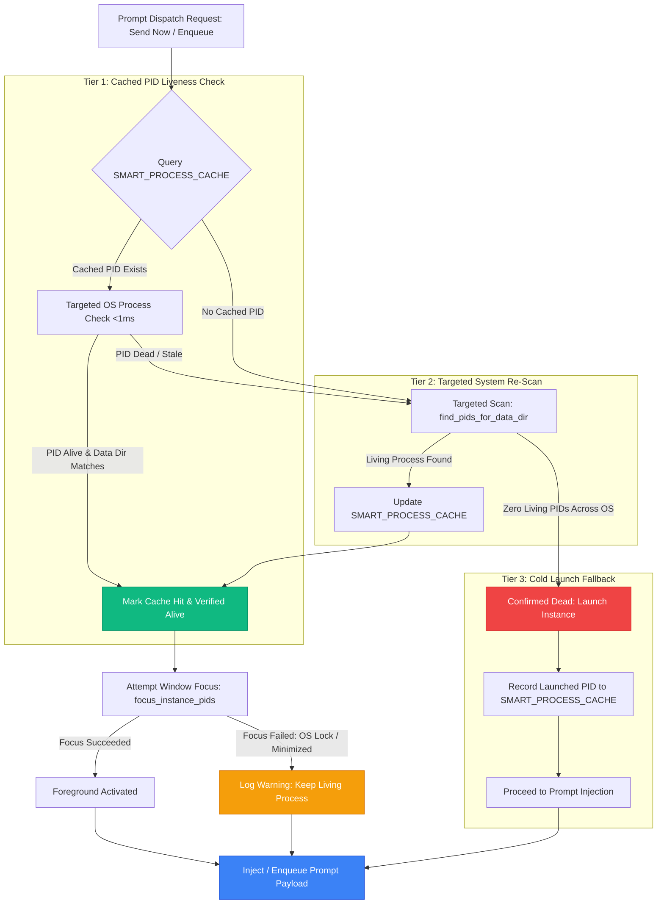
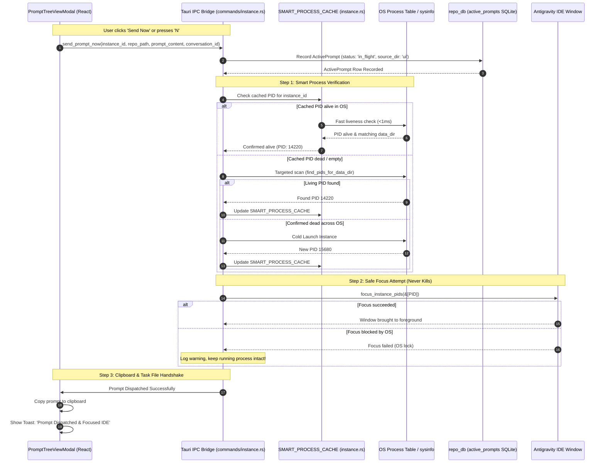

# Architecture Spec: Smart Instance Process Caching & Prompt Dispatch Engine

**Slug:** `147-smart-instance-process-cache-and-prompt-dispatch`  
**File:** `02-spec/21-app/147-smart-instance-process-cache-and-prompt-dispatch/01-architecture-spec.md`  
**Target Release:** v4.165.0  
**Status:** APPROVED FOR IMPLEMENTATION  
**Lead Author:** Antigravity Architect (Author 01)  
**Parent Master Ledger:** `02-spec/21-app/147-smart-instance-process-cache-and-prompt-dispatch/00-master-audit-ledger.md`  

---

## 1. Executive Summary & Problem Context

In multi-instance environments managed by Antigravity-Manager (`agm`), users interact with isolated Antigravity IDE instances (e.g. `default`, `inst-alpha`, `inst-beta`), each running with distinct `--user-data-dir` paths and bound Google/Antigravity accounts. 

When a user attempts to dispatch a prompt via **"Send Now"** (or hotkey `N`) or **"Enqueue Prompt"** from the Prompt Tree View modal:
1. **Unwanted Relaunch & Process Destruction Bug**: Instead of injecting the prompt into the currently running IDE window, Antigravity-Manager erroneously terminates the existing IDE instance process via `close_instance()` and initiates a cold reboot.
2. **IPC Command Disconnect (`enqueue_prompt`)**: The frontend attempts to invoke `enqueue_prompt`, but the backend lacks the registered Tauri command in `src-tauri/src/commands/instance.rs` and `src-tauri/src/lib.rs`. The call fails silently into a fallback path that writes `.antigravity_resume_task.json` with `status: 'queued'` which is neither consumed by an active scheduler nor associated with the running process.
3. **Ghost "Running" Items & False-Positive Execution Indicators**: The UI displays conversations and projects as `RUNNING` long after the underlying AI generation has completed. Stale `running_projects` SQLite rows linger indefinitely, loose 600-second/240-second timestamp heuristics override explicit idle states, and the `only_running` filter in `compute_project_conversation_tree` leaks idle projects into the filtered view.
4. **Visual Clutter & Verbose Tag Noise**: The prompt section displays excessive bracketed items (e.g. `[AGM:P001 | GM:#1]`, `[AGM:C001 | GM:<cid>]`), redundant text pills alongside origin tier icons, and bracketed button labels (`Show Less [Collapse]`, `Show All ({n}w) [Expand (Full Text)]`).

This specification establishes the **Smart Instance Process Cache & Prompt Dispatch Engine**, eliminating unwanted relaunches, hardening running detection with transcript terminal state inspection, providing full IPC parity for prompt queuing, and compacting UI badge tags into a clean aesthetic.

---

## 2. Root Cause Analysis (RCA)

### 2.1 The Unwanted Relaunch Bug: Coupling Window Focus Failure to Process Death

In `src-tauri/src/modules/instance.rs`, the window focus function `focus_or_launch_instance_with_workspace` and `focus_or_launch_workspace` exhibited a fatal design flaw:

```rust
// FLAWED LOGIC in src-tauri/src/modules/instance.rs (lines 3088-3121)
if !pids.is_empty() {
    if let Some(ws) = workspace_path {
        let focused_workspace = crate::modules::process::focus_instance_workspace_window(&pids, repo_name);
        if focused_workspace {
            return Ok(true);
        }
    }
    let focused = crate::modules::process::focus_instance_pids(&pids);
    if focused {
        return Ok(true);
    }
}

// CRITICAL FLAW: If window focusing failed (due to OS foreground lock, minimized window,
// or timing), execution fell through to launch_instance_with_workspaces!
crate::modules::logger::log_info(&format!(
    "[Instance] Instance '{}' is not running or could not be focused; launching with workspace: {:?}",
    instance_id, workspace_path
));
launch_instance_with_workspaces(instance_id, Some(&ws_vec), true)?;
```

Inside `launch_instance_inner_with_extra_workspaces`:
```rust
// src-tauri/src/modules/instance.rs (lines 3284-3286)
// Close only the existing process for THIS target instance if running, allowing OS to unmap locks
let _ = close_instance(instance_id);
std::thread::sleep(std::time::Duration::from_millis(300));
```

#### The Failure Chain:
1. User clicks **"Send Now"** or presses hotkey `N` in `PromptTreeViewModal.tsx`.
2. Frontend calls `focusOrLaunchInstance(targetInstId, repoPath)`.
3. Backend finds running PIDs for the instance.
4. Backend executes `focus_instance_pids(&pids)` (Win32 `SetForegroundWindow` / `ShowWindow`).
5. On Windows, the OS enforces **Foreground Lock Timeout** (`SPI_SETFOREGROUNDLOCKTIMEOUT`). If Antigravity-Manager does not own the active foreground input queue, Windows prevents it from stealing focus, causing `SetForegroundWindow` to return `FALSE` (or flash the taskbar icon instead of focusing).
6. Because `focused` is `false`, backend wrongly deduces that the instance is dead (`"Instance is not running or could not be focused"`).
7. Backend calls `launch_instance_with_workspaces`.
8. `launch_instance_inner_with_extra_workspaces` calls `close_instance(instance_id)`.
9. `close_instance` executes `taskkill /F /PID <pid>` on the perfectly healthy, running instance!
10. A brand new IDE instance window is launched, losing active unsaved editor context, disconnecting running terminals, and disrupting the user's workflow.

### 2.2 Missing Backend IPC Command `enqueue_prompt`

In `src/components/instances/PromptTreeViewModal.tsx` (lines 1837-1870), `handleEnqueuePrompt` calls:
```typescript
await invoke('enqueue_prompt', {
    conversationId: selectedConversation.conversation_id,
    projectId: selectedProject?.project_id,
    instanceId: selectedProject?.instance_id || instanceId || 'default',
    repoPath,
    promptContent,
});
```
However, in `src-tauri/src/commands/instance.rs` and `src-tauri/src/lib.rs`, `enqueue_prompt` was never registered in `generate_handler!`. The IPC call rejected with `command enqueue_prompt not found`, forcing the frontend into a fallback branch that saved a local JSON file (`.antigravity_resume_task.json`) with `status: 'queued'`. Because this was never inserted into `active_prompts` SQLite table as a managed queue item, the queue scheduler never dispatched it.

### 2.3 False-Positive Running Items Heuristics

Conversations and projects were erroneously displayed as `RUNNING` due to four compounding defects:
1. **Oversized Timestamp Thresholds (600s / 240s)**:
   - In `compute_project_conversation_tree` (`src-tauri/src/modules/repo_db.rs:4833`), `is_recent` evaluated `now - conv_ts <= 600` (10 minutes).
   - In `inspect_conversation_transcript` (`repo_db.rs:4158`), `is_recent_active` evaluated `now_epoch - mtime_epoch <= 240` (4 minutes).
   - Even when an agent stopped generation 5 minutes prior, if `conversation_summaries.db` retained `not_fully_idle > 0` or the transcript was touched within 4 minutes, it was flagged as `is_conv_running = true`.
2. **Missing Transcript Terminal State Verification**:
   - `inspect_conversation_transcript` reverse-scanned up to 10 lines to extract tool calls and thoughts, but ignored step status. When a conversation finishes, the terminal record in `transcript.jsonl` contains `type: "PLANNER_RESPONSE"` (or `source: "MODEL"`), `status: "DONE"`, and has zero outstanding tool calls. The code never evaluated this terminal flag, ignoring that the assistant was finished.
3. **Stale SQLite Rows in `running_projects`**:
   - `detect_running_projects` inserted/updated rows in `running_projects`, but never purged rows where `last_detected_at < now - 120`. Projects closed or switched hours ago remained in SQLite with `is_running = 1`.
4. **Flawed `only_running` Filter in `compute_project_conversation_tree`**:
   - Lines 5465-5471 contained inverted logic:
     ```rust
     if only_running {
         if !proj_is_running {
             if !has_conv_nodes {
                 continue;
             }
         }
     }
     ```
     If `proj_is_running` was false, but `has_conv_nodes` was true (the project had conversations), the project was NOT skipped! Idle projects with idle conversations leaked into the `only_running` view.

---

## 3. Core Architecture: Smart Instance Process Cache & Prompt Dispatch

### 3.1 Architecture Overview

The Smart Instance Process Cache decouples **process liveness** from **window focus capability**. The engine maintains an in-memory, thread-safe cache (`SMART_PROCESS_CACHE`) of validated instance process records. Prompt dispatch operations (Send / Enqueue) query the cache first before performing any window operations, and under no circumstances is a living instance terminated when focus fails.



### 3.2 Data Structure: `SMART_PROCESS_CACHE`

In `src-tauri/src/modules/instance.rs`, the global smart process cache is defined as:

```rust
use once_cell::sync::Lazy;
use std::sync::RwLock;
use std::collections::HashMap;

#[derive(Debug, Clone, serde::Serialize, serde::Deserialize)]
pub struct InstanceProcessRecord {
    pub instance_id: String,
    pub pid: u32,
    pub data_dir: String,
    pub launched_at: i64,
    pub last_verified_at: i64,
    pub is_alive: bool,
    pub command_line: Option<String>,
}

pub static SMART_PROCESS_CACHE: Lazy<std::sync::Arc<RwLock<HashMap<String, InstanceProcessRecord>>>> =
    Lazy::new(|| std::sync::Arc::new(RwLock::new(HashMap::new())));
```

### 3.3 Three-Tier Verification Decision Tree

When `ensure_instance_running_for_dispatch(instance_id: &str, workspace_path: Option<&str>)` is executed:

#### Tier 1: Fast Cached PID Verification (<1ms)
1. Acquire read lock on `SMART_PROCESS_CACHE`.
2. If `instance_id` exists with `pid > 0`:
   - Perform sub-millisecond targeted process liveness check:
     * **Windows**: `GetExitCodeProcess` via `OpenProcess(PROCESS_QUERY_LIMITED_INFORMATION, FALSE, pid)` ensuring exit code is `STILL_ACTIVE` (259).
     * **Cross-Platform / sysinfo**: `sysinfo::System::new()` with `refresh_processes_specifics(ProcessesToUpdate::Some(&[Pid::from_u32(pid)]), ProcessRefreshKind::new())`.
   - If PID is alive, verify that the process command line or executable directory belongs to the target `data_dir` (or is the default Antigravity executable for `default`).
   - If valid: Update `last_verified_at = now()`, release lock, and return `Ok(pid)`.
   - **INVARIANT**: If Tier 1 passes, NEVER call `close_instance()`, NEVER call `launch_instance()`.

#### Tier 2: Targeted System Re-Scan
1. If Tier 1 check fails (PID terminated, recycled, or cache missed):
2. Call `find_pids_for_data_dir(&inst.data_dir, is_default)`:
   - Inspect running process table filtered strictly by the instance's unique `--user-data-dir` flag.
3. If one or more candidate PIDs are discovered:
   - Pick the primary process PID.
   - Acquire write lock on `SMART_PROCESS_CACHE` and update `InstanceProcessRecord`.
   - Persist PID into `instance_processes` SQLite table via `record_instance_pid`.
   - Return `Ok(pid)`.
   - **INVARIANT**: If Tier 2 discovers a running instance, NEVER call `close_instance()`, NEVER call `launch_instance()`.

#### Tier 3: Cold Launch Fallback
1. Only when Tier 1 AND Tier 2 confirm ZERO running processes for the target instance across the entire operating system:
2. Invoke `launch_instance_with_workspaces(instance_id, workspace_path.map(|p| vec![p.to_string()]).as_deref(), true)`.
3. Wait for process spawn, extract newly created PID, insert into `SMART_PROCESS_CACHE`, and return `Ok(new_pid)`.

### 3.4 Decoupling Window Focus from Process Lifecycle

In `focus_or_launch_instance_with_workspace`:
```rust
pub fn focus_or_launch_instance_with_workspace(
    instance_id: &str,
    workspace_path: Option<&str>,
) -> Result<bool, crate::error::AppError> {
    // 1. Resolve running PID via 3-Tier Verification
    let pid = ensure_instance_running_for_dispatch(instance_id, workspace_path)?;

    // 2. Attempt window focus
    let pids = vec![pid];
    let focused = if let Some(ws) = workspace_path {
        let clean_ws = ws.trim_end_matches(['/', '\\']);
        let repo_name = std::path::Path::new(clean_ws)
            .file_name()
            .and_then(|n| n.to_str())
            .unwrap_or(clean_ws);
        crate::modules::process::focus_instance_workspace_window(&pids, repo_name)
    } else {
        false
    };

    let final_focused = if focused {
        true
    } else {
        crate::modules::process::focus_instance_pids(&pids)
    };

    // 3. SAFE RESOLUTION: If focus failed, log info and return Ok(false).
    // NEVER fall through to launch or close!
    if !final_focused {
        crate::modules::logger::log_info(&format!(
            "[Instance] Instance '{}' (PID {}) is running, but OS focus could not be established; proceeding safely without relaunch",
            instance_id, pid
        ));
    }

    Ok(final_focused)
}
```

---

## 4. Prompt Dispatch Flow & Sequence Architecture



---

## 5. False-Positive Running Items Elimination Architecture

To eliminate false-positive `RUNNING` indicators across conversations and projects, the backend implements a four-point hardening protocol:

### 5.1 Transcript Terminal State Verification (`inspect_conversation_transcript`)

In `src-tauri/src/modules/repo_db.rs`, when scanning `transcript.jsonl` / `transcript_full.jsonl`:
1. Reverse-scan up to 10 non-telemetry records.
2. Locate the most recent planner or execution record:
   - If the most recent planner response record has:
     * `source == "MODEL"` or `type == "PLANNER_RESPONSE"`
     * `status == "DONE"` (or `"COMPLETED"`)
     * Zero unresolved `tool_calls` in flight (i.e. all preceding tool calls have matching `TOOL_OUTPUT` or `TOOL_RESPONSE` entries)
   - Then:
     * Set `is_terminal_done = true`.
     * Unconditionally force `is_recent_active = false`.
3. Even if file metadata `mtime` was touched by a background heartbeat or file watcher within the last 60 seconds, `is_terminal_done` overrides it to **IDLE**.

### 5.2 Narrowed Active Timestamp Windows

| Metric | Previous Window | Hardened Window | Justification |
| :--- | :--- | :--- | :--- |
| `conversation_summaries.db` last modified | 600s (10 min) | **60s** (1 min) | A non-idle turn without transcript activity past 60s is either stalled or terminated. |
| Transcript file `mtime` | 240s (4 min) | **60s** (1 min) | Active streaming updates transcripts at sub-second intervals; 60s is ample buffer for network latency. |
| Memory prompt active map | 600s (10 min) | **120s** (2 min) | Prompts in memory must be refreshed by active worker heartbeats. |
| `active_prompts` SQLite table | 600s (10 min) | **120s** (2 min) | Prevents abandoned in-flight rows from persisting across UI reloads. |

### 5.3 Stale `running_projects` SQLite Row Purging

In `detect_running_projects`, prior to inserting new records, execute an atomic cleanup:
```sql
DELETE FROM running_projects 
WHERE last_detected_at < (?1 - 120);
```
Where `?1` is current Unix epoch time (`Utc::now().timestamp()`). Projects not refreshed by an active discovery scan within the last 2 minutes are purged from SQLite, eliminating ghost running entries.

### 5.4 Corrected `only_running` Filter in `compute_project_conversation_tree`

Replace lines 5465-5471 in `repo_db.rs`:
```rust
// HARDENED ONLY_RUNNING LOGIC
if only_running {
    let has_any_running_conv = conv_nodes.iter().any(|c| c.is_running);
    if !proj_is_running && !has_any_running_conv {
        continue;
    }
}
```
If a project is not running AND has zero running conversations, it is strictly excluded when `only_running: true` is requested.

---

## 6. UI Tag Compaction & Clutter Elimination

### 6.1 Compacting `formatDualBadge` in `PromptTreeViewModal.tsx`

Currently, `formatDualBadge` renders verbose bracketed strings:
- Old Output: `[AGM:P001 | GM:#1]`, `[AGM:C001 | GM:3c5e63cf]`
- Compact Output: `P001 · #1`, `C001 · 3c5e63cf`

#### Implementation:
```typescript
function formatDualBadge(agmCode: string | undefined, defaultAgm: string, gmCode: string | undefined, defaultGm: string): string {
    const rawAgm = (agmCode || defaultAgm).replace(/^AGM:/i, '').trim();
    const rawGm = (gmCode || defaultGm).replace(/^GM:/i, '').trim();
    return `${rawAgm} · ${rawGm}`;
}
```

### 6.2 Eliminating Redundant Role Text Badges

In `PromptTreeViewModal.tsx` (lines 2133-2145 and lines 2940-2954):
- The tier icon (`User` in sky, `Bot` in purple, `Terminal` in zinc, `Wrench` in amber) visually identifies the origin tier.
- Remove adjacent text pills (`User`, `Subagent`, `System`, `Tool`) from the tree list items.
- The tier icon is given a precise tooltip `title={`${tierInfo.tier} (${Math.round(tierInfo.confidence * 100)}%)`}`.
- This frees up 80+ horizontal pixels per row, allowing conversation titles to be read without truncation.

### 6.3 Stripping Bracket Tokens from Button Labels

In `PromptTreeViewModal.tsx`:
- Line 3405: Change `Show Less [Collapse]` to **`Show Less`**.
- Line 3410: Change `Show All ({totalWords || activeWordCount}w) [Expand (Full Text)]` to **`Show All ({totalWords || activeWordCount}w)`**.

---

## 7. IPC Command Specification: `enqueue_prompt`

### 7.1 Command Signature (`src-tauri/src/commands/instance.rs`)

```rust
#[tauri::command]
pub fn enqueue_prompt(
    instance_id: String,
    repo_path: String,
    prompt_content: String,
    conversation_id: Option<String>,
    project_id: Option<String>,
) -> Result<crate::modules::repo_db::InstancePromptRow, String> {
    let resolved_id = crate::modules::instance::resolve_instance_id(&instance_id)
        .unwrap_or(instance_id);
    let req = crate::modules::repo_db::PromptRequest {
        instance_id: resolved_id,
        repo_path,
        prompt_content,
        conversation_id,
        project_id,
        source: "ui".to_string(),
    };
    crate::modules::repo_db::enqueue_prompt_for_instance(&req)
}
```

### 7.2 Command Registration (`src-tauri/src/lib.rs`)

Add `commands::instance::enqueue_prompt` to `tauri::generate_handler!`:
```rust
commands::instance::enqueue_prompt,
```

---

## 8. Invariants & Quality Gates

1. **Never-Kill Invariant**: If an instance process PID is discovered and alive, prompt dispatch operations MUST NEVER invoke `close_instance()` or `taskkill`. Window focus failure must degrade gracefully into background dispatch.
2. **Sub-Millisecond Liveness Gate**: Targeted PID verification in Tier 1 MUST execute in <1ms without performing a full OS process list sweep (`ProcessesToUpdate::All`).
3. **FIFO Queue Ordering**: All prompts queued via `enqueue_prompt` MUST be persisted into SQLite `active_prompts` with `status: 'queued'` and ordered strictly by `created_at ASC, id ASC`.
4. **Terminal Supremacy**: Any conversation transcript containing `PLANNER_RESPONSE` with `status: "DONE"` and zero outstanding tool calls MUST evaluate to `is_conv_running = false`, regardless of file modification timestamps.
5. **Clean Dual Badge**: The dual sequence badge MUST render strictly as `<agm_code> · <gm_code>` without outer square brackets `[...]` and without redundant `AGM:` prefixes.
