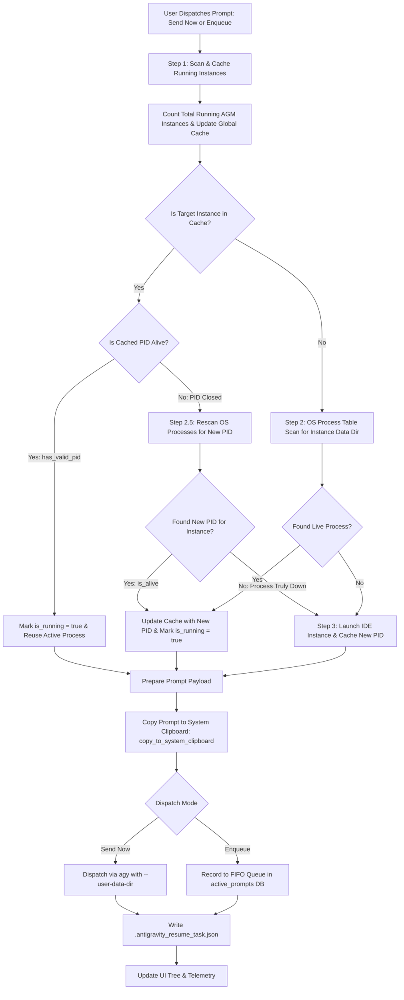

# Architecture Specification: Task 148 - IDE Prompt Dispatch, Process Cache & Bracket Cleanup

- **Document Version**: `1.0.0`
- **Specification Classification**: Core Architecture & Process Lifecycle Specification
- **Task Slug**: `148-ide-prompt-dispatch-process-cache-and-bracket-cleanup`
- **Target Release**: `v4.166.0`
- **Maintainer / Attribution**: Strictly `@aukgit` (`(Thanks to @aukgit)`)

---

## 1. Verbatim User Request Ingestion

> "Look, the sending prompt from the instance section to the IDE does not work. Find the root cause of it, why we cannot send the prompt and why we cannot enqueue the prompt. In both cases, it has no effect so far. Every time it tries to open or reopen the IDE instance, which is very wrong. If the instance is already open, you have to check in the process if this instance is already running. If the instance is already running, you need to cache it so that you can understand if the instance. That means you have to have the smart logic. When we send it or queue the prompt, first, you have to check how many instances are running for that Antigravity Tools Manager. You need to cache those as well. Let's say you find that it is running in the cache, but then again, you try to send and see this PID is closed. Then you have to rerun it and see if it is running again. If it is not running, then and only then you have to reopen and send the prompt. It is not happening right now like this. It is not working at all. You need to work on it, find the root cause, do the end-to-end testing, do things from CLI as well. Currently, the view is nice. I appreciate that, but there are too many tags, which is not necessary in the prompt section. Too many target bracket item, which can be reduced. And too many running items, which is not running, so you need to fix that as well. I hope you respect this and try to fix all this stuff and make a minor bump and release again."

---

## 2. Executive Architecture Overview

This specification establishes the architectural foundation for reliable prompt dispatch, multi-instance process lifecycle management, process table caching, and UI cleanliness across Antigravity Tools Manager (AGM).

### 2.1 The Core Problem Statement
1. **Broken Dispatch & Unwanted IDE Restarts**: Invoking `Send Now` or `Enqueue` failed to interact with the active IDE session and continuously initiated duplicate instance launches.
2. **Missing Process Cache & Closed-PID Rescan**: AGM lacked atomic process validation. When a cached PID exited or recycled, AGM would immediately trigger an IDE restart instead of verifying whether the IDE had reloaded or remained active under an alternate process identifier.
3. **CLI Disconnection in Non-Default Profiles**: `spawn_prompt_via_agy` failed to pass `--user-data-dir`, directing CLI requests to the default configuration path rather than the instance-specific data directory.
4. **Zombified Instance Termination**: In `close_instance`, sysinfo neglected to refresh process command line arguments (`.with_cmd(...)`), causing arguments to appear empty and preventing instances from closing cleanly.
5. **Frontend Double-Launch Race**: `PromptTreeViewModal.tsx` concurrently called both `sendPromptNow` (which launches/focuses on the backend) and `focusOrLaunchInstance` in `handleResendPrompt`, initiating redundant window launches.
6. **Visual Clutter & Synthetic Statuses**: Heavy bracket prefixes (`[AGM:P006 | GM:#6]`) overwhelmed the prompt tree, while synthetic auto-recovery prompts erroneously reported idle workspaces as active.

---

## 3. High-Level Process Architecture & 3-Step Lifecycle

The system architecture implements the user-mandated 3-step sequence for every prompt dispatch or enqueue operation:



---

## 4. Key Architectural Pillars & Research Subagent Findings

### 4.1 Pillar 1: User-Mandated 3-Step Process Cache Sequence
- **Step 1: Scan & Cache All Running Instances (`scan_and_cache_all_running_instances`)**:
  - Prior to sending or enqueuing a prompt, AGM scans the operating system process table for all running Antigravity IDE instances across all registered profiles (`instances.json` and `instances.db`).
  - Calculates `total_antigravity_instances_running` and updates the centralized `INSTANCE_PROCESS_CACHE`.
- **Step 2: Closed-PID Verification & OS Rescan (`check_and_rescan_instance_process`)**:
  - Checks if the cached primary PID is still alive using genuine OS validation.
  - If the cached PID is closed, AGM **must not** immediately launch a new instance.
  - Instead, AGM executes an immediate OS process table rescan matching the instance's unique `--user-data-dir` argument.
  - If a running PID is found (e.g., after an IDE internal reload, update, or crash restart), the cache is updated with the new PID and marked `is_running = true`.
- **Step 3: Conditional Reopen & Dispatch**:
  - Only when the OS rescan confirms zero active PIDs for the instance data directory does AGM invoke `launch_instance_with_workspaces`.
  - Once the instance is confirmed running (reused or freshly spawned), the prompt is dispatched and copied to the system clipboard.

### 4.2 Pillar 2: Sysinfo `close_instance` Argument Refresh Bug Fix
- **Root Cause**: `sysinfo::System::refresh_processes` defaults to basic process metrics without populating command-line arguments. In `close_instance`, `proc.cmd()` was empty, causing `args_str.contains(clean_data)` to fail and skipping instance termination.
- **Architectural Fix**: Configure `sysinfo::ProcessRefreshKind` with `.with_cmd(sysinfo::UpdateKind::Always)` or use `refresh_processes_specifics`:
  ```rust
  let mut system = sysinfo::System::new();
  system.refresh_processes_specifics(
      sysinfo::ProcessesToUpdate::All,
      sysinfo::ProcessRefreshKind::new()
          .with_cmd(sysinfo::UpdateKind::Always)
          .with_exe(sysinfo::UpdateKind::Always),
  );
  ```
  This ensures `proc.cmd()` returns complete process arguments (`--user-data-dir`, `--profile`), allowing target instances to be terminated cleanly and accurately without collateral impact.

### 4.3 Pillar 3: `spawn_prompt_via_agy` `--user-data-dir` Injection
- **Root Cause**: When executing prompts for non-default instances, `spawn_prompt_via_agy` set `HOME` and `USERPROFILE` environment variables but did not pass `--user-data-dir <data_dir>` to the `agy` CLI binary. As a result, `agy` defaulted to `$HOME/.config/Antigravity`, attempting to communicate with a non-existent or default IDE IPC socket.
- **Architectural Fix**:
  ```rust
  if prompt.instance_id != "default" && !prompt.instance_id.is_empty() {
      if let Ok(registry) = crate::modules::instance::load_registry() {
          if let Some(inst) = registry.instances.iter().find(|i| i.id == prompt.instance_id) {
              cmd.arg("--user-data-dir").arg(&inst.data_dir);
          }
      }
  }
  ```
  Passing `--user-data-dir` routes `agy` CLI commands directly to the active instance's dedicated IPC socket.

### 4.4 Pillar 4: Cross-Platform System Clipboard Helper
- **Objective**: Ensure the dispatched prompt content is synchronously copied to the host OS clipboard (`copy_to_system_clipboard(prompt_content)`).
- **Cross-Platform Strategy**:
  - **Linux / X11 / Wayland**: Probe `wl-copy` for Wayland sessions; fall back to `xclip -selection clipboard` or `xsel --clipboard --input`.
  - **macOS**: Stream payload to `pbcopy` stdin.
  - **Windows**: Stream payload to `clip.exe` stdin with `CREATE_NO_WINDOW` flag.
  - Provides a frictionless fallback if the user transitions to the IDE window manually.

### 4.5 Pillar 5: Frontend Double-Launch Race Condition Removal
- **Root Cause**: In `src/components/instances/PromptTreeViewModal.tsx`, `handleResendPrompt` invoked:
  1. `await sendPromptNow(...)` (which internally executes `ensure_instance_running_smart` on the backend).
  2. Followed immediately by `await focusOrLaunchInstance(targetInstId, repoPath)`.
  This triggered two parallel instance launch attempts, resulting in duplicate processes and window focus conflicts.
- **Architectural Fix**: Remove the redundant `focusOrLaunchInstance` call from `handleResendPrompt`. The backend `send_prompt_now_for_instance` handles process liveness, window focusing, and conditional launching atomically.

---

## 5. Detailed Component Specifications

### 5.1 Process Cache Module (`src-tauri/src/modules/instance.rs`)

#### 5.1.1 Cache Data Structures
```rust
use std::collections::HashMap;
use std::time::Instant;

#[derive(Debug, Clone)]
pub struct InstanceProcessCacheItem {
    pub instance_id: String,
    pub pids: Vec<u32>,
    pub primary_pid: Option<u32>,
    pub is_running: bool,
    pub is_cached: bool,
    pub has_valid_pid: bool,
    pub last_checked: Instant,
}

#[derive(Debug, Clone)]
pub struct GlobalInstanceProcessTracker {
    pub total_running_instances: usize,
    pub cached_instances: HashMap<String, InstanceProcessCacheItem>,
    pub last_global_scan: Instant,
}
```

#### 5.1.2 Core Functions
1. `scan_and_cache_all_running_instances() -> (usize, HashMap<String, InstanceProcessCacheItem>)`:
   - Scans system processes using `sysinfo` with `.with_cmd(sysinfo::UpdateKind::Always)`.
   - Populates cache for all registered instances.
   - Returns count of active instances and map of cache entries.
2. `check_and_rescan_instance_process(instance_id: &str) -> (bool, Option<u32>, Vec<u32>)`:
   - Validates cached PID via `is_pid_alive_os`.
   - If PID is closed or absent, refreshes OS process list to check for a newly spawned PID under the instance `data_dir`.
   - Updates cache and returns `(is_running, primary_pid, pids)`.
3. `ensure_instance_running_smart(instance_id: &str, workspace_path: Option<&str>) -> Result<(bool, Option<u32>), AppError>`:
   - Calls `check_and_rescan_instance_process`.
   - If running, focuses workspace and returns `Ok((true, primary_pid))`.
   - If truly stopped, launches instance, verifies newly spawned PID, updates cache, and returns `Ok((now_running, new_pid))`.
4. `copy_to_system_clipboard(content: &str) -> Result<(), String>`:
   - Native OS clipboard integration supporting Windows, macOS, and Linux.

### 5.2 Prompt Dispatch Engine (`src-tauri/src/modules/repo_db.rs`)

1. `send_prompt_now_for_instance(instance_id: &str, repo_path: &str, prompt_content: &str, conversation_id: Option<&str>) -> Result<ActivePrompt, String>`:
   - Step 1: Invocations call `scan_and_cache_all_running_instances()`.
   - Step 2: Executes `ensure_instance_running_smart(instance_id, Some(repo_path))`.
   - Step 3: Copies `prompt_content` via `copy_to_system_clipboard`.
   - Step 4: Persists prompt to `active_prompts` with status `'running'`.
   - Step 5: Writes `.antigravity_resume_task.json` and `.antigravity_resume_task.<inst>.json`.
   - Step 6: Dispatches execution via `spawn_prompt_via_agy(&active_prompt)`.
2. `enqueue_prompt_for_instance(instance_id: &str, repo_path: &str, prompt_content: &str, conversation_id: Option<&str>) -> Result<ActivePrompt, String>`:
   - Step 1: Scans and updates instance cache via `scan_and_cache_all_running_instances()`.
   - Step 2: Enqueues prompt into SQLite DB with status `'queued'` enforcing FIFO ordering.
   - Step 3: Writes `.antigravity_resume_task.json` with status `'queued'`.
3. `spawn_prompt_via_agy(prompt: &ActivePrompt) -> bool`:
   - Injects `--user-data-dir` argument for non-default instances.
   - Injects isolated environment variables (`HOME`, `USERPROFILE`, `JETSKI_OAUTH_TOKEN`).
   - Launches `agy` in workspace directory with `-p` flag.

### 5.3 UI Interaction Layer (`src/components/instances/PromptTreeViewModal.tsx`)

1. `handleResendPrompt`:
   - Cleans prompt content.
   - Calls `sendPromptNow(targetInstId, repoPath, promptContent, conv?.conversation_id)`.
   - Dispatches native clipboard copy via browser API.
   - **Removes** `focusOrLaunchInstance(targetInstId, repoPath)` to prevent double launches.
2. Visual Cleanliness:
   - Replaces heavy bracket sequence tags (`[AGM:P006 | GM:#6]`) with sleek, borderless sequence pills (`#6`, `P006`).
   - Ensures duration calculations safely guard against `NaN`.

---

## 6. Positive Booleans Invariant Compliance

All new and refactored code must use positive boolean predicates exclusively:

| Compliant Positive Identifier | Forbidden Negative Identifier | Context |
|---|---|---|
| `is_running` | `not_running`, `is_stopped` | Instance process status |
| `is_alive` | `is_dead`, `is_terminated` | Process PID liveness |
| `is_cached` | `cache_miss`, `uncached` | Presence in memory cache |
| `has_valid_pid` | `no_pid`, `invalid_pid` | PID validity check |
| `is_default_instance` | `non_default` | Profile type check |

---

## 7. State Transition & Failure Mode Matrix

| Current State | Event | Verification Step | Resulting State | IDE Action |
|---|---|---|---|---|
| Uncached | `send_prompt_now` | Scan OS process table | Cached (`is_running: true`) | Reused, focused (No launch) |
| Uncached | `send_prompt_now` | Scan OS: 0 PIDs found | Cached (`is_running: false`) | Launched once, PID cached |
| Cached (`pid: 1234`) | `send_prompt_now` | `is_pid_alive_os(1234) == true` | Cached (`is_running: true`) | Reused, focused (No launch) |
| Cached (`pid: 1234`) | `send_prompt_now` | `is_pid_alive_os(1234) == false` | OS Rescan: Found `pid: 5678` | Reused under new PID 5678 |
| Cached (`pid: 1234`) | `send_prompt_now` | `is_pid_alive_os(1234) == false` | OS Rescan: 0 PIDs found | Launched once, new PID cached |
| Any | `close_instance` | Sysinfo refreshed with `.with_cmd(...)` | Instance Terminated | Clean termination of target PID |

---

## 8. Verification & Acceptance Gates

1. **Process Cache Accuracy**:
   - `scan_and_cache_all_running_instances` accurately reports the number of running instances across the OS.
   - Closed PIDs trigger an OS rescan prior to launching any process.
2. **Zero Duplicate Launches**:
   - Dispatching multiple prompts consecutively to a running instance causes zero new process launches.
3. **Targeted Instance Termination**:
   - `close_instance` terminates only processes matching the targeted instance's `--user-data-dir`.
4. **CLI Dispatch Connection**:
   - `spawn_prompt_via_agy` connects cleanly to non-default instances via `--user-data-dir`.
5. **Code Hygiene & Pre-Flight**:
   - `cargo fmt -- --check` passes with zero formatting errors.
   - `cargo clippy --all-targets --all-features` passes with zero warnings.
   - `npm run build` succeeds cleanly.
