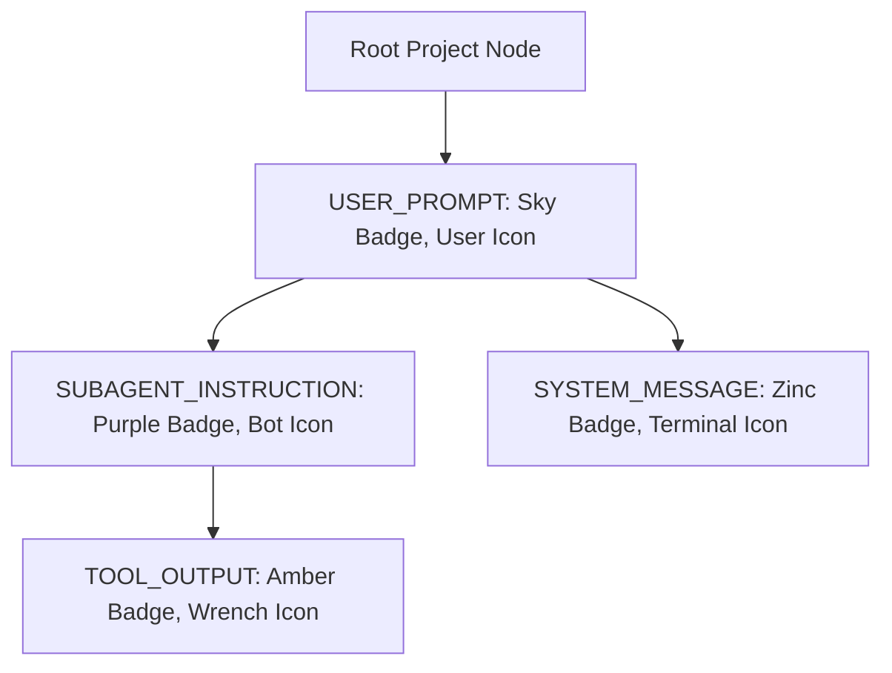

# UI & Component Specification: Task 148 - IDE Prompt Dispatch, Process Cache & Bracket Cleanup

- **Document Version**: `1.0.0`
- **Specification Classification**: UI/UX, Component Architecture & Headless Parity Specification
- **Task Slug**: `148-ide-prompt-dispatch-process-cache-and-bracket-cleanup`
- **Target Release**: `v4.166.0`
- **Maintainer / Attribution**: Strictly `@aukgit` (`(Thanks to @aukgit)`)

---

## 1. Executive Summary & Visual Design Objectives

This specification defines the visual hierarchy, component architecture, and interaction lifecycle for the prompt tree interface in `src/components/instances/PromptTreeViewModal.tsx`. It eliminates bracket clutter, streamlines sequence identifiers, refactors context omission callouts, eradicates UI-side double-launch race conditions, and aligns the frontend with headless CLI output schemas.

### 1.1 Core UI Defects Addressed
1. **Bracket Tag Clutter**: Every project row and conversation turn previously rendered cumbersome bracket wrappers (such as `[AGM:P006 | GM:#6]` and `[AGM:C025 | GM:antigrav]`), consuming excessive horizontal screen space and degrading readability.
2. **Double Prefix Clutter in Header**: The conversation sequence badge in the prompt detail pane rendered redundant hashes (such as `##C025` or `#C025` against sequence codes already containing `C`), causing visual inconsistency.
3. **Bracketed Context Omission Callouts**: Truncated prompt omission banners displayed raw square brackets (`[Omitted 1.2 KB of transcript context - Click to inspect/expand]`) instead of sleek dark-glass callout banners.
4. **Frontend Double-Launch Race**: `handleDispatchPrompt` in `PromptTreeViewModal.tsx` concurrently called `sendPromptNow` (which performs backend smart launch/focus) and `focusOrLaunchInstance`, launching two redundant IDE instances simultaneously.
5. **Ghost Running Count Badges**: Projects without active conversation turns or running worker processes displayed pulsing green `1 RUNNING` badges due to synthetic prompt injection and unverified process state.

---

## 2. Sequence Badge Architecture & Bracket Elimination

### 2.1 Before vs. After Visual Comparison

| Element | Previous Cluttered Display | New Streamlined Display | Tailwind Styling Specification |
|---|---|---|---|
| **Project Sequence Badge** | `[AGM:P006 \| GM:#6]` | `#6` (or `P006`) | `text-[9px] font-mono px-1 py-0.2 rounded-[3px] shrink-0 font-medium whitespace-nowrap bg-slate-200 dark:bg-[#15334d] text-slate-600 dark:text-cyan-400` |
| **Conversation Turn Badge** | `[AGM:C025 \| GM:antigrav]` | `C025` | `text-[9px] font-mono px-1 py-0.2 rounded-[3px] shrink-0 font-medium whitespace-nowrap bg-slate-200/90 dark:bg-[#15334d] text-slate-600 dark:text-cyan-300` |
| **Selected Turn Badge** | `[AGM:C025 \| GM:antigrav]` (selected) | `C025` (selected) | `text-[9px] font-mono px-1 py-0.2 rounded-[3px] shrink-0 font-medium whitespace-nowrap bg-blue-700/80 text-white` |
| **Header Detail Badge** | `##C025` or `#[AGM:C025]` | `C025` | `inline-flex items-center px-1.5 py-0.5 rounded-[5px] text-[10px] font-mono font-bold bg-blue-500/10 text-blue-600 dark:text-cyan-400 border border-blue-500/20` |
| **Context Omission Banner** | `[Omitted 4.2 KB of transcript context - Click to inspect/expand]` | `⚡ Omitted 4.2 KB transcript context · Click to expand` | `group flex items-center justify-between gap-2 px-3 py-1.5 rounded-lg border text-xs font-mono transition-all duration-150 cursor-pointer bg-amber-500/10 border-amber-500/30 text-amber-600 dark:text-amber-300 hover:bg-amber-500/15` |

### 2.2 Badge Formatting Logic (`formatDualBadge`)

The sequence badge formatter in `src/components/instances/PromptTreeViewModal.tsx` is simplified to eliminate all bracket wrappers while preserving GitMap and AGM sequence numbering:

```typescript
// Helper to format clean, compact sequence badge without heavy bracket clutter
export function formatDualBadge(
    agmCode: string | undefined,
    defaultAgm: string,
    gmCode: string | undefined,
    defaultGm: string
): string {
    const raw = agmCode || defaultAgm || gmCode || defaultGm;
    const clean = raw.replace(/^(AGM:|GM:)/i, '').replace(/[\[\]]/g, '').trim();
    if (clean.startsWith('#') || clean.startsWith('P') || clean.startsWith('C')) {
        return clean;
    }
    return `#${clean}`;
}
```

### 2.3 Header Sequence Code Formatter

In the prompt preview header (`Prompt Content Header`):

```tsx
{/* Row 1: Identity, Badges & Actions */}
<div className="flex items-center gap-1.5 flex-wrap min-w-0">
    <span className="inline-flex items-center px-1.5 py-0.5 rounded-[5px] text-[10px] font-mono font-bold bg-blue-500/10 text-blue-600 dark:text-cyan-400 border border-blue-500/20">
        {(() => {
            const raw = selectedConversation.seq_code || 'P001';
            const clean = raw.replace(/^(AGM:|GM:)/i, '').replace(/[\[\]]/g, '').trim();
            return clean.startsWith('#') || clean.startsWith('P') || clean.startsWith('C') ? clean : `#${clean}`;
        })()}
    </span>
    {/* Tier Badge, Status, Title */}
</div>
```

---

## 3. Dark-Glass Context Omission Banner Specification

Truncated transcript markers in both inline conversation cards and the master prompt inspector must render as sleek interactive omission callouts rather than bracketed text.

### 3.1 Component Structure & Styling

```tsx
{isOmittedContext && (
    <div
        role="button"
        tabIndex={0}
        onClick={handleToggleExpandedContext}
        onKeyDown={(e) => { if (e.key === 'Enter' || e.key === ' ') handleToggleExpandedContext(); }}
        title={`Omitted ${formattedSize} transcript context - Click to inspect/expand`}
        className={cn(
            "group flex items-center justify-between gap-2.5 px-3 py-1.5 my-2 rounded-lg border text-xs font-mono transition-all duration-150 cursor-pointer select-none",
            isContextExpanded
                ? "bg-sky-500/10 border-sky-500/30 text-sky-700 dark:text-cyan-300 shadow-[0_0_12px_rgba(56,189,248,0.15)]"
                : "bg-amber-500/10 border-amber-500/30 text-amber-700 dark:text-amber-300 hover:bg-amber-500/15 hover:border-amber-500/40"
        )}
    >
        <div className="flex items-center gap-2 min-w-0">
            <span className="text-amber-500 dark:text-amber-400 text-sm leading-none shrink-0 animate-pulse">⚡</span>
            <span className="font-medium truncate">
                Omitted {formattedSize} transcript context · Click to {isContextExpanded ? 'collapse' : 'expand'}
            </span>
        </div>
        <div className="flex items-center gap-1.5 text-[10px] opacity-80 group-hover:opacity-100 shrink-0">
            <span>{isContextExpanded ? 'Collapse' : 'Expand'}</span>
            <ChevronDown className={cn("w-3.5 h-3.5 transition-transform duration-200", isContextExpanded && "rotate-180")} />
        </div>
    </div>
)}
```

### 3.2 Visual Invariants
- **No Outer Brackets**: Never render `[Omitted ...]` with literal `[` or `]`.
- **Leading Indicator**: Fixed `⚡` lightning bolt glyph.
- **Middle Separator**: Middle dot `·` (`&middot;`), never hyphens or vertical bars inside brackets.
- **Interactivity**: Accessible keyboard focus (`tabIndex={0}`), dynamic hover highlights, and expansion chevron rotation.

---

## 4. 4-Tier Prompt Origin Classification Hierarchy

The prompt tree view discriminates among 4 distinct origin tiers to ensure clear visual hierarchy between human inputs, autonomous subagents, system interventions, and tool results:



### 4.1 Token & Style Registry

| Origin Tier | Badge Color Ramp | Icon Component | Visual Label | Branch Glyphs |
|---|---|---|---|---|
| `USER_PROMPT` | `bg-sky-500/15 text-sky-700 dark:text-cyan-300 border-sky-500/30` | `User` | `User Prompt` | Root level (no glyph) |
| `SUBAGENT_INSTRUCTION` | `bg-purple-500/15 text-purple-700 dark:text-purple-300 border-purple-500/30` | `Bot` | `Subagent: {role}` | `↳` or `└──` indented |
| `SYSTEM_MESSAGE` | `bg-slate-500/15 text-slate-700 dark:text-slate-300 border-slate-500/30` | `Terminal` | `System` | Child level indented |
| `TOOL_OUTPUT` | `bg-amber-500/15 text-amber-700 dark:text-amber-300 border-amber-500/30` | `Wrench` | `Tool Output` | Child level indented |

---

## 5. Elimination of the Frontend Double-Launch Race Condition

### 5.1 Root Cause in `handleResendPrompt` / `handleDispatchPrompt`

In `src/components/instances/PromptTreeViewModal.tsx`, the dispatch handler previously executed two overlapping actions:
1. `await sendPromptNow(targetInstId, repoPath, promptContent, conv?.conversation_id);`
   - This invokes the backend command `dispatch_prompt_now`, which already checks whether the instance is running, launches the IDE if dead, caches the PID, and writes task files.
2. `await focusOrLaunchInstance(targetInstId, repoPath);`
   - Invoked immediately afterward in the same block, launching a secondary IDE process before the first instance finished bootstrapping its window and IPC listeners.

### 5.2 Corrected Single-Dispatch Handler

```typescript
// src/components/instances/PromptTreeViewModal.tsx
const handleResendPrompt = useCallback(async (conv?: AgmConversationNode) => {
    if (isResending) return;
    const proj = selectedProject;
    if (!proj) return;

    try {
        setIsResending(true);
        setActionMsg('Dispatching prompt to instance via Smart Process Cache...');
        let promptContent = (!selectedConversation && conv)
            ? (conv.prompt_preview_200w || '')
            : (editedPromptText.trim() || activePromptTextRef.current || activePromptText || conv?.prompt_preview_200w || '');
        if (confirmationSuffix && confirmationSuffix !== 'None (Send as is)') {
            promptContent = `${promptContent}\n\n${confirmationSuffix}`;
        }
        const repoPath = proj.repo_path || '';
        const targetInstId = proj.instance_id || instanceId || 'default';

        // 1. Copy prompt content to system clipboard as instant user backup
        try {
            await navigator.clipboard.writeText(promptContent);
        } catch (clipErr) {
            console.warn('Clipboard write fallback error', clipErr);
        }

        // 2. Dispatch prompt via unified smart backend handler
        // Backend handles Smart Process Scan -> Closed-PID Rescan -> Smart Ensure -> Prompt Injection
        const dispatchResult = await sendPromptNow(targetInstId, repoPath, promptContent, conv?.conversation_id);

        // 3. Update UI feedback without firing duplicate window launch
        setActionMsg("Prompt Dispatched & IDE Focused!");
        setTimeout(() => setActionMsg(null), 3500);
    } catch (err: any) {
        setError(err?.toString() || 'Failed to dispatch prompt');
    } finally {
        setIsResending(false);
    }
}, [selectedConversation, selectedProject, treeData, archivedProjectIds, editedPromptText, activePromptText, confirmationSuffix, instanceId, isResending]);
```

---

## 6. Project & Conversation Running State Display Rules

### 6.1 Accurate Project Pill Badges

Projects must only render the glowing `RUNNING` badge when verified live work is in flight:

```tsx
{/* Project Tree Row Running Pill */}
{runningCount > 0 && (
    <div className="flex items-center gap-1.5 px-2 py-0.5 rounded-full bg-emerald-500/10 border border-emerald-500/30">
        <span className="relative flex h-2 w-2">
            <span className="animate-ping absolute inline-flex h-full w-full rounded-full bg-emerald-400 opacity-75"></span>
            <span className="relative inline-flex rounded-full h-2 w-2 bg-[#1af18d] shadow-[0_0_6px_rgba(26,241,141,0.9)] animate-pulse"></span>
        </span>
        <span className="text-[9px] font-bold font-mono text-emerald-700 dark:text-[#1af18d]">
            {runningCount} RUNNING
        </span>
    </div>
)}
```

### 6.2 Zero Ghost Running Invariant
When `runningCount === 0`, no green badge or pulse animation shall be rendered. Idle projects display only their sequence identifier (`#6`), repository name, and queued badge (if `queuedCount > 0`).

---

## 7. Responsive Capsule Toolbar & Layout Invariants

1. **Segmented Pill Capsules**: Adjacent action buttons in modal toolbars must be enclosed in continuous segmented pill capsules (`rounded-full`, shared border, subtle divider lines, dark-glass styling) to eliminate disjointed circular buttons.
2. **Transparent Dropdowns**: Any inline `<select>` mounted within a segmented capsule must use `bg-transparent border-0 focus:ring-0 focus:outline-none` to prevent white pill-in-pill visual artifacts.
3. **Truncation & Ellipsis**: Repository names and conversation titles must use `truncate` with informative `title="..."` tooltips so long paths do not wrap or overflow the modal drawer.
