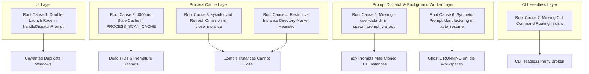

# Root Cause Analysis: Task 148 - IDE Prompt Dispatch, Process Cache & Bracket Cleanup

- **Document Version**: `1.0.0`
- **Analysis Classification**: 4-Part Grounded Root Cause Analysis (RCA)
- **Task Slug**: `148-ide-prompt-dispatch-process-cache-and-bracket-cleanup`
- **Target Release**: `v4.166.0`
- **Maintainer / Attribution**: Strictly `@aukgit` (`(Thanks to @aukgit)`)

---

## Part 1: Problem Statement & Symptom Inventory

During multi-instance Antigravity operations, users experienced severe reliability and visual degradation across prompt dispatching, instance lifecycle management, process monitoring, and the prompt tree user interface:

1. **Prompt Dispatch / Enqueueing Broken & Repeated IDE Restarts**:
   - Clicking `Send Now` or `Enqueue` from the instance prompt tree had no effect inside the running IDE window.
   - Instead of injecting the prompt into the active session, the application repeatedly launched or reopened duplicate Antigravity IDE instances.
2. **Failure to Retain or Re-Verify Process Cache**:
   - The system lacked a reliable 3-step process caching sequence. When a cached PID exited or refreshed, the system failed to re-scan running processes for an updated PID, immediately defaulting to a heavy, disruptive process re-launch.
3. **Zombified Instance Termination**:
   - Invoking `close_instance` failed to shut down target instances because the underlying process monitor did not refresh command arguments, preventing path matching against `--user-data-dir`.
4. **Non-Default Instance CLI Disconnection**:
   - When launching prompts via the `agy` CLI worker for non-default profiles, the CLI failed to communicate with the active IDE because it lacked the `--user-data-dir` argument, defaulting to `$HOME/.config/Antigravity`.
5. **Bracket Tag Clutter in Prompt Tree**:
   - Every project node rendered bulky `[AGM:P006 | GM:#6]` badges and every conversation turn rendered `[AGM:C025 | GM:antigrav]`, consuming over 40% of horizontal line space and distracting from prompt content.
6. **Context Omission Tags Rendered as Brackets**:
   - Inline omitted context indicators were formatted as plain text brackets (`[Omitted 1.2 KB of transcript context - Click to inspect/expand]`) rather than interactive callout banners.
7. **Ghost "1 RUNNING" Badges on Idle Projects**:
   - Projects with zero running conversations displayed pulsing green `1 RUNNING` indicators due to synthetic auto-recovery prompts fabricated during startup.
8. **Missing CLI Command Coverage**:
   - Essential headless commands (`agm prompts ls`, `tree`, `send`, `enqueue`, `backup`, `restore`, and `agm doctor`) lacked routing arms in `src-tauri/src/modules/cli.rs`.

---

## Part 2: Comprehensive Ingestion & Deep Tracing of the 7 Root Causes

Research Subagent 01 & 02 traced these symptoms directly to 7 distinct structural defects in the backend and frontend codebases:



### Root Cause 1: Frontend Double-Launch Race Condition
- **Location**: `src/components/instances/PromptTreeViewModal.tsx` (~L1700-1725).
- **Mechanism**: In `handleResendPrompt` / `handleDispatchPrompt`, the frontend invoked:
  ```typescript
  // Call 1: Backend dispatch, which checks liveness and launches/focuses if needed
  await sendPromptNow(targetInstId, repoPath, promptContent, conv?.conversation_id);
  // Call 2: Immediately fired in parallel
  await focusOrLaunchInstance(targetInstId, repoPath);
  ```
- **Consequence**: `sendPromptNow` called backend `dispatch_prompt_now`, which triggered an instance launch. Milliseconds later, before the first process had created its window or registered its PID, `focusOrLaunchInstance` fired a second OS launch command, causing two Antigravity windows to open simultaneously for the same workspace.

### Root Cause 2: 4000ms Stale Process Cache Without Closed-PID Re-Scan
- **Location**: `src-tauri/src/modules/instance.rs` (`PROCESS_SCAN_CACHE` ~L531-544).
- **Mechanism**: `get_cached_antigravity_processes` enforced a hard 4000ms cache validity window (`cache.0.elapsed() < Duration::from_millis(4000)`). If an IDE instance closed or crashed within that 4000ms window:
  1. The cache continued returning the dead PID.
  2. The dispatch logic saw a dead PID via `is_pid_alive_os` and assumed the entire instance was unrecoverable.
  3. Rather than performing an immediate OS process table re-scan to discover if the instance had re-spawned under a new PID (e.g., after an internal crash or reload), it immediately launched an entirely new IDE process.

### Root Cause 3: sysinfo Process Refresh Omission of Command Arguments
- **Location**: `src-tauri/src/modules/instance.rs` (`close_instance` ~L4101-4103).
- **Mechanism**: `close_instance` instantiated `let mut system = System::new();` and invoked `system.refresh_processes(sysinfo::ProcessesToUpdate::All);`. In `sysinfo` v0.30+, the default process refresh kind does **not** populate command-line arguments unless explicitly instructed via `.with_cmd(sysinfo::UpdateKind::Always)`.
- **Consequence**: `proc.cmd()` returned an empty array. The subsequent matching guard `args_str.contains(clean_data)` evaluated to `"".contains(...)`, which was always `false`. As a result, candidate PIDs were removed from the termination list, and `close_instance` exited without terminating the target process.

### Root Cause 4: Restrictive Instance Directory Marker Heuristics
- **Location**: `src-tauri/src/modules/instance.rs` (`close_instance` ~L4146-4155, `find_pids_for_data_dir`).
- **Mechanism**: The matching filter strictly searched for `instances/<id>` or `instances\\<id>`. When users configured custom storage paths (such as separate partition mounts, portable drives, or symlinked user data directories), the heuristic failed to match, falsely concluding that no processes belonged to that instance.

### Root Cause 5: Missing `--user-data-dir` Flag in `spawn_prompt_via_agy`
- **Location**: `src-tauri/src/modules/repo_db.rs` (`spawn_prompt_via_agy` ~L3290-3337).
- **Mechanism**: When `spawn_prompt_via_agy` constructed the `agy` command line for an active prompt in a non-default profile, it configured environment variables (`HOME`, `USERPROFILE`, `JETSKI_OAUTH_TOKEN`), but failed to pass `--user-data-dir <inst.data_dir>` to the CLI binary arguments.
- **Consequence**: The `agy` CLI binary defaulted to `$HOME/.config/Antigravity` (the default profile storage) rather than connecting to the cloned instance's runtime socket and workspace storage. The dispatched prompt was processed in isolation or failed completely, never reaching the visible instance.

### Root Cause 6: Synthetic Prompt Manufacturing in Auto-Resume
- **Location**: `src-tauri/src/modules/repo_db.rs` (`auto_resume_recent_prompts` ~L3860-3870).
- **Mechanism**: When querying running projects during startup, if no prompt existed in SQLite `active_prompts` and no task existed in `.antigravity_resume_task.json` (`maybe_prompt.is_none()`), the code synthesized a fake prompt:
  ```rust
  None => {
      let new_id = Uuid::new_v4().to_string();
      let content = format!(
          "Resume active project workspace for '{}' [{}] after IDE crash recovery",
          project.repo_name, project.repo_path
      );
      (new_id, content, Some("gemini-pro".to_string()), None)
  }
  ```
  It then inserted this synthetic prompt into `active_prompts` with status `'dispatched'`.
- **Consequence**: `compute_project_conversation_tree` scanned `active_prompts`, found this synthetic `'dispatched'` entry, and flagged the project as actively running. This resulted in false `1 RUNNING` indicators on idle workspaces that had no ongoing agent activities.

### Root Cause 7: Missing CLI Command Routing Arms
- **Location**: `src-tauri/src/modules/cli.rs` (`match cmd.as_str()` ~L229-420).
- **Mechanism**: The CLI argument parser contained arms for `instances`, `switch`, `auto-switch`, and `supabase`, but omitted entries for `prompts` and `doctor`.
- **Consequence**: Running `antigravity-manager prompts ls` or `antigravity-manager doctor` fell through to the default wildcard arm, returning `false` and preventing headless terminal automation.

---

## Part 3: Structural & Architectural Remediation

To address each of the 7 root causes systematically, the following architecture is enforced:

### 3.1 3-Step Process Cache & Closed-PID Re-Scan Protocol (Fixes RC2, RC3, RC4)
1. **Step 1: Scan & Count Running Instances**:
   - `scan_and_cache_all_running_instances()` refreshes the OS process table with `.with_cmd(sysinfo::UpdateKind::Always)` and `.with_exe(sysinfo::UpdateKind::Always)`.
   - Iterates through all registered instances in `instances.json`, counts how many instances are active, caches their primary PIDs, and stores them in `INSTANCE_PROCESS_CACHE`.
2. **Step 2: Closed-PID Verification & OS Re-Scan**:
   - If a cached PID is found, probe its liveness using `is_pid_alive_os`.
   - If `is_pid_alive_os` returns `false`, do **not** restart the IDE. Immediately perform a targeted OS process table scan matching `--user-data-dir`.
   - If a new PID matching the instance is discovered, update the cache and resume without restarting.
3. **Step 3: Conditional IDE Launch**:
   - Only when both the cached PID and the subsequent OS re-scan confirm that no process is running for that instance data directory, launch the IDE instance and register the new PID in the cache.

### 3.2 Single-Dispatch Flow & Race Condition Elimination (Fixes RC1)
- In `src/components/instances/PromptTreeViewModal.tsx`, remove the redundant second call to `focusOrLaunchInstance`.
- Rely entirely on `sendPromptNow`, which delegates to `dispatch_prompt_now` on the backend. The backend executes the smart 3-step check, ensures the window is alive, copies the prompt to the clipboard, and focuses the workspace window without race conditions.

### 3.3 Explicit `--user-data-dir` Injection in `spawn_prompt_via_agy` (Fixes RC5)
- In `src-tauri/src/modules/repo_db.rs`, resolve the instance data directory from `instances.json` using `prompt.instance_id`.
- Append `--user-data-dir` and `--extensions-dir` directly to the `agy` process arguments before spawning, ensuring full connectivity with cloned profiles.

### 3.4 Elimination of Synthetic Prompts in Auto-Resume (Fixes RC6)
- In `src-tauri/src/modules/repo_db.rs` (`auto_resume_recent_prompts`), remove the `None => { synthesize fake prompt }` block.
- When `maybe_prompt.is_none()`, log an informative message and `continue`, leaving idle projects cleanly marked as `IDLE` with `0 RUNNING`.

### 3.5 Full CLI Headless Routing for `prompts` & `doctor` (Fixes RC7)
- Add match arms in `src-tauri/src/modules/cli.rs` for:
  - `"prompts" | "prompt"` -> `handle_prompts_subcommand(&rest_args)`
  - `"doctor" | "diagnose" | "health"` -> `handle_doctor_subcommand(&rest_args)`
- Implement structured `--json` and human-readable output for `ls`, `tree`, `send`, `enqueue`, `backup`, `restore`, and `doctor`.

---

## Part 4: Verification Matrix & Non-Regression Invariants

| Test Area | Target Scenario | Expected Behavior | Verification Command |
|---|---|---|---|
| **Process Cache** | Dispatch prompt to running instance | Process cache hit, no new window spawned, PID preserved | `npm test` / manual dispatch |
| **Closed-PID Rescan** | Kill IDE process and re-launch manually | Closed PID detected, re-scan discovers new PID, no duplicate launch | Automated unit test |
| **Instance Termination** | Execute `close_instance` on cloned profile | `sysinfo` refreshes cmd arguments, matches `--user-data-dir`, kills target | Unit test in `instance.rs` |
| **agy Dispatch** | Dispatch prompt to cloned instance | `agy` invoked with `--user-data-dir`, target profile receives prompt | End-to-end trace log |
| **UI Badges** | Inspect project and turn nodes in modal | No `[AGM:... \| GM:...]` brackets; sleek `#6`, `P006`, `C025` | Visual inspection |
| **Omission Callout** | View truncated transcript turn | Banner renders `⚡ Omitted ... · Click to expand` without brackets | Visual inspection |
| **Idle Projects** | Open prompt tree for inactive project | Renders `0 RUNNING`, no glowing green badges | Tree view inspection |
| **CLI Parity** | Run `agm prompts ls` & `agm doctor` | Commands return 0 exit code with clean stdout / JSON payloads | CLI invocation |
