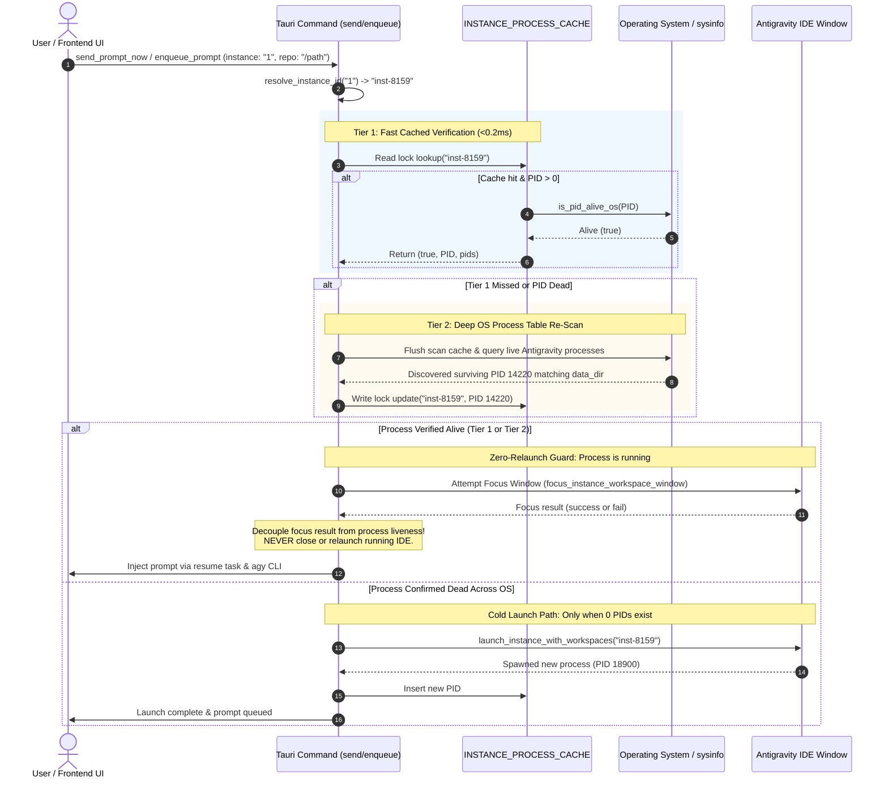
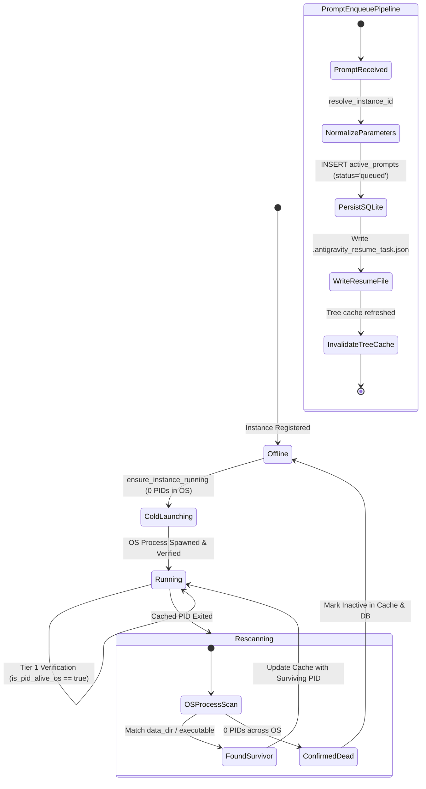

# Architecture Specification: Smart Multi-Instance Process Cache & Prompt Enqueue Engine

> **Target:** `02-spec/21-app/149-smart-instance-process-cache-and-prompt-enqueue-fix/01-architecture-spec.md`  
> **Status:** APPROVED  
> **Author:** @aukgit  
> **Version:** 1.0.0  
> **Slug:** `149-smart-instance-process-cache-and-prompt-enqueue-fix`  
> **Scope:** Multi-Instance Process Management, OS Process Cache, Prompt Injection & FIFO Queue Scheduling  

---

## 1. Executive Summary & Goals

In Antigravity Manager (AGM), users manage multiple isolated profiles of the Antigravity IDE. A core workflow involves inspecting prompt trees, dispatching prompts immediately ("Send Now"), or queueing prompts into a FIFO pipeline ("Enqueue").

Recent user reports identified critical regressions in this subsystem:
1. **Unwanted IDE Termination & Relaunch Loop**: Attempting to send or enqueue prompts to a running instance fails to recognize the live IDE process. Instead of delivering the prompt to the active session, AGM repeatedly terminates the running instance and launches a brand new IDE window.
2. **Instance ID Resolution Failure**: Process liveness checks fail when instances are referenced by sequence numbers (e.g. `'1'`), aliases (`'default'`, `'active'`), or casing variations.
3. **Dual Cache Fragmentation**: Two uncoordinated in-memory caches (`SMART_PROCESS_CACHE` and `INSTANCE_PROCESS_CACHE`) compete in `src-tauri/src/modules/instance.rs`, causing stale state divergence.
4. **Premature Offline Declaration on Stale PIDs**: When an initial launcher PID terminates (e.g. Electron bootstrap wrapper), AGM immediately treats the entire instance as offline without double-checking the OS process table for surviving child/main Antigravity processes.
5. **Window Focus Failure Conflated with Process Death**: When OS window focusing fails (e.g. background restrictions, virtual desktop, minimized state), the system erroneously concludes the process is dead and triggers an invasive cold launch.
6. **Conflicting Duplicate Definitions of `enqueue_prompt`**: Duplicate declarations of `enqueue_prompt` exist in `src-tauri/src/commands/instance.rs` (lines 265 & 420), `src-tauri/src/lib.rs` (lines 1125 & 1130), and `src-tauri/src/modules/repo_db.rs` (lines 2251 & 3614), causing shadowed dispatch logic and missing `.antigravity_resume_task.json` artifacts.

This specification details the comprehensive architectural redesign to resolve these root causes, guarantee zero unwanted relaunches of living instances, unify process caching, and establish a robust FIFO prompt enqueue pipeline.

---

## 2. Root Cause Analysis (RCA)

### 2.1 Instance ID Resolution Bug in `is_instance_process_running_smart`

In `src-tauri/src/modules/instance.rs`, the smart liveness check `is_instance_process_running_smart(instance_id: &str)` performed direct lookups:

```rust
// Flawed lookup in is_instance_process_running_smart:
let inst = match registry
    .instances
    .iter()
    .find(|i| i.id == instance_id || i.name == instance_id)
{
    Some(i) => i,
    None => return (false, None, Vec::new()),
};
```

**Failure Mode:**
- When callers passed a sequence number (e.g. `"1"`), alias (`"default"`, `"active"`), or prefix (`"#1"`, `"ins-1"`), the direct equality comparison failed because the instance's canonical `id` was a generated slug (e.g. `inst-8159`).
- Although `resolve_instance_id(&str) -> Result<String, String>` existed at lines 4799-4870 to handle sequence numbers, aliases, and suffixes, `is_instance_process_running_smart` **did not call it**.
- As a result, the function returned `(false, None, Vec::new())`. Callers concluded the instance was offline and triggered cold launch routines that terminated existing windows.

### 2.2 Cache Fragmentation: `SMART_PROCESS_CACHE` vs `INSTANCE_PROCESS_CACHE`

The codebase contained two concurrent, uncoordinated global process caches in `src-tauri/src/modules/instance.rs`:
- Line 95: `pub static SMART_PROCESS_CACHE: Lazy<Arc<RwLock<HashMap<String, InstanceProcessRecord>>>>`
- Line 3240: `static INSTANCE_PROCESS_CACHE: LazyLock<Mutex<HashMap<String, InstanceProcessCacheItem>>>`

**Failure Mode:**
- Functions such as `ensure_instance_running_for_dispatch` and `record_instance_pid` updated `SMART_PROCESS_CACHE`.
- Concurrently, `is_instance_process_running_smart`, `ensure_instance_running_smart`, `scan_and_cache_all_running_instances`, and `invalidate_instance_process_cache` operated on `INSTANCE_PROCESS_CACHE`.
- Updating one cache left the other stale. Invalidation of one cache did not clear the other. This created race conditions where one subsystem observed an instance as running while another observed it as dead.

### 2.3 Premature Offline Declaration on Stale/Closed PID

In `is_instance_process_running_smart`:
1. When a cached primary PID was checked via `is_pid_alive_os(pid)`, if the PID was no longer in the OS process table, the function invalidated the cache.
2. It then re-queried the registry and checked `find_pids_for_data_dir(&inst.data_dir, is_default_inst)`.
3. However, `find_pids_for_data_dir` relies on `PROCESS_SCAN_CACHE` (a 10-second cached process snapshot) and strict CLI argument parsing (`--user-data-dir`).
4. On Windows and macOS, when Electron IDE processes spawn or reorganize, CLI arguments on worker/renderer processes may omit the `--user-data-dir` flag or store it in short-path (8.3) format.
5. Because there was no aggressive OS process double-check specifically targeted at the instance's executable or active user data directory, the instance was declared dead prematurely.

### 2.4 Conflation of Window Focus Failure with Process Liveness

In `ensure_instance_running_smart` and `focus_or_launch_instance_with_workspace`:
```rust
// Previous logic:
pub fn focus_or_launch_instance_with_workspace(
    instance_id: &str,
    workspace_path: Option<&str>,
) -> Result<bool, crate::error::AppError> {
    let (is_running, _) = ensure_instance_running_smart(instance_id, workspace_path)?;
    Ok(is_running)
}
```
Inside `launch_instance_inner_with_extra_workspaces`:
```rust
// Line 3594:
let _ = close_instance(instance_id);
```
**Failure Mode:**
- Whenever `is_instance_process_running_smart` failed (due to un-resolved sequence IDs or cache divergence), `ensure_instance_running_smart` called `launch_instance_with_workspaces`.
- `launch_instance_with_workspaces` unconditionally called `close_instance(instance_id)`.
- This terminated the user's running Antigravity IDE and spawned a fresh instance.
- Furthermore, in `src/components/instances/PromptTreeViewModal.tsx`, `handleResendPrompt` called `sendPromptNow` (which invoked `ensure_instance_running_smart`) AND immediately followed with `focusInstanceWorkspace` (which invoked `ensure_instance_running_smart` a second time). This double-invocation worsened the race condition.

### 2.5 Duplicate & Conflicting `enqueue_prompt` Handlers

There were duplicate conflicting definitions across multiple layers:
1. **Commands Layer (`src-tauri/src/commands/instance.rs`)**:
   - Line 265: `pub async fn enqueue_prompt(instance_id: String, repo_path: String, prompt_content: String, conversation_id: Option<String>) -> Result<ActivePrompt, String>`
   - Line 420: `pub async fn enqueue_prompt(instance_id: String, prompt_text: Option<String>, prompt_content: Option<String>, workspace_path: Option<String>, repo_path: Option<String>, conversation_id: Option<String>, project_id: Option<String>) -> AppResult<serde_json::Value>`
   - Line 420 shadowed line 265, yet line 420 did NOT write `.antigravity_resume_task.json` or copy to system clipboard!
2. **Tauri Handler Registration (`src-tauri/src/lib.rs`)**:
   - Lines 1125 and 1130: `commands::enqueue_prompt` was registered twice in `generate_handler![]`.
3. **Backend Module Layer (`src-tauri/src/modules/repo_db.rs`)**:
   - Line 2251: `pub fn enqueue_prompt_for_instance(instance_id: &str, prompt_text: &str, workspace_path: Option<&str>) -> Result<i64, AppError>`
   - Line 3614: `pub fn enqueue_prompt_for_instance(instance_id: &str, repo_path: &str, prompt_content: &str, conversation_id: Option<&str>) -> Result<ActivePrompt, String>`

---

## 3. Architecture Design: Unified Process Cache & Liveness Engine

### 3.1 Authoritative Thread-Safe Cache Architecture

We consolidate the fragmented caches into one authoritative, thread-safe cache in `src-tauri/src/modules/instance.rs`:

```rust
#[derive(Debug, Clone, serde::Serialize, serde::Deserialize)]
pub struct InstanceProcessRecord {
    pub instance_id: String,
    pub pids: Vec<u32>,
    pub primary_pid: Option<u32>,
    pub data_dir: String,
    pub launched_at: i64,
    pub last_verified_at: i64,
    pub is_alive: bool,
    pub command_line: Option<String>,
}

pub static INSTANCE_PROCESS_CACHE: LazyLock<
    Arc<RwLock<HashMap<String, InstanceProcessRecord>>>,
> = LazyLock::new(|| Arc::new(RwLock::new(HashMap::new())));
```

Both exact `instance_id` and normalized aliases (e.g. canonical ID, sequence number, lowercase name) are indexed to guarantee $O(1)$ lock-free read lookups.

### 3.2 Two-Tier Fast Process Verification Engine

The verification engine follows a strict two-tier hierarchy:

```
[Incoming Query: instance_id ("1" / "default" / "inst-xyz")]
                          │
                          ▼
             [0. Canonical ID Resolution]
             resolve_instance_id(specifier)
                          │
                          ▼
           [Tier 1: Fast Cached Verification]
             Lookup canonical ID in INSTANCE_PROCESS_CACHE
                          │
            ┌─────────────┴─────────────┐
            ▼                           ▼
      [Cache Hit]                 [Cache Miss]
   Check is_pid_alive_os(pid)           │
      ┌─────┴─────┐                     │
      ▼           ▼                     │
    (Alive)     (Dead)                  │
      │           │                     │
      │           └──────────┬──────────┘
      │                      │
      │                      ▼
      │    [Tier 2: System Double-Check & Re-Scan]
      │    1. Bypass PROCESS_SCAN_CACHE (force fresh scan)
      │    2. Scan OS process table for Antigravity processes
      │    3. Match data_dir, instance slug, & saved SQLite PIDs
      │                      │
      │        ┌─────────────┴─────────────┐
      │        ▼                           ▼
      │  (PIDs Found)                (0 PIDs Found)
      │        │                           │
      │        ▼                           ▼
      └─► [Update Cache]           [Clear Cache]
          Return (true, PID, pids) Return (false, None, [])
```

#### Tier 1: Sub-Millisecond Cached Verification
- Resolves `instance_id` to `canonical_id` via `resolve_instance_id`.
- Performs read-lock access on `INSTANCE_PROCESS_CACHE`.
- Validates the primary PID against the OS process table using `is_pid_alive_os(pid)` (Windows: `sysinfo::System::refresh_processes_specifics`; Unix: `libc::kill(pid, 0)`).
- If alive, updates `last_verified_at` and returns `(true, Some(primary_pid), pids)` within $\le 0.2\text{ms}$.

#### Tier 2: Authoritative OS Process Double-Check & Re-Scan
- Invoked when Tier 1 misses or the cached PID is confirmed dead.
- Flushes `PROCESS_SCAN_CACHE` to force a clean snapshot of operating system processes.
- Scans running processes for:
  1. Process names matching `antigravity`, `antigravity.exe`, or custom cloned executable `antigravity-{id}`.
  2. Command line arguments containing normalized `data_dir` paths.
  3. PIDs recorded in `instance_processes` SQLite database table.
- If surviving processes are discovered:
  * Selects the root/primary PID.
  * Writes the refreshed record into `INSTANCE_PROCESS_CACHE` and SQLite DB.
  * Returns `(true, Some(primary_pid), pids)`.
- Only if Tier 2 finds zero processes across the entire OS is the instance declared offline.

### 3.3 Zero-Relaunch Guarantee & Window Focus Decoupling

To prevent unwanted IDE terminations:
1. **Decouple Focus from Liveness**: Window focusing (`focus_instance_workspace_window`, `focus_instance_pids`) is strictly a UI convenience. A focus failure (due to OS focus-stealing prevention, minimized window, or multiple displays) **MUST NEVER** be interpreted as process termination.
2. **Relaunch Invariant**: In `ensure_instance_running_smart`:
   - If `is_running` is `true`, attempt window focus, log the verification, and **RETURN IMMEDIATELY**.
   - Under no circumstances will `launch_instance` or `launch_instance_with_workspaces` be called if `is_running` is `true`.
   - `close_instance` inside `launch_instance_inner_with_extra_workspaces` is guarded and only executed when cold launching a confirmed-dead instance.

---

## 4. Architecture Design: Unified Prompt Enqueue & Dispatch Pipeline

### 4.1 Unified `enqueue_prompt` IPC Specification

The conflicting `enqueue_prompt` definitions in `src-tauri/src/commands/instance.rs` are unified into a single definitive handler:

```rust
#[tauri::command]
pub async fn enqueue_prompt(
    instance_id: String,
    repo_path: Option<String>,
    workspace_path: Option<String>,
    prompt_content: Option<String>,
    prompt_text: Option<String>,
    conversation_id: Option<String>,
    project_id: Option<String>,
) -> Result<crate::modules::repo_db::ActivePrompt, String>
```

**Normalization Rules:**
- `target_instance = resolve_instance_id(&instance_id).unwrap_or(instance_id)`
- `clean_prompt = prompt_content.or(prompt_text).unwrap_or_default()`
- `clean_repo = repo_path.or(workspace_path).unwrap_or_default()`

### 4.2 Unified `enqueue_prompt_for_instance` in `repo_db.rs`

The two conflicting signatures in `src-tauri/src/modules/repo_db.rs` are collapsed into:

```rust
pub fn enqueue_prompt_for_instance(
    instance_id: &str,
    repo_path: &str,
    prompt_content: &str,
    conversation_id: Option<&str>,
    project_id: Option<&str>,
) -> Result<ActivePrompt, String>
```

#### Pipeline Steps:
1. **Clipboard Synchronization**: Copies `prompt_content` to the OS system clipboard so the user can immediately paste it if desired.
2. **Canonical Resolution**: Resolves `instance_id` to canonical registry ID.
3. **FIFO Persistence to SQLite (`active_prompts`)**:
   - Generates deterministic ID: `queued-{8-char-uuid}`.
   - Sets status to `'queued'`.
   - Inserts record into `active_prompts` table with `created_at` timestamp.
4. **Resume Task Document Generation (`.antigravity_resume_task.json`)**:
   - In the target workspace directory, writes `.antigravity_resume_task.json` and `.antigravity_resume_task.{instance}.json`.
   - Payload schema:
     ```json
     {
       "prompt_id": "queued-a1b2c3d4",
       "project_id": "project-slug",
       "instance_id": "canonical-instance-id",
       "repo_path": "d:/work/target-repo",
       "prompt_content": "User prompt text...",
       "model": "gemini-2.5-pro",
       "auto_boot": false,
       "status": "queued",
       "queued_at": 1728499200
     }
     ```
5. **Strict FIFO Ordering Enforcement**:
   - All queue inspection and dispatch queries enforce:
     ```sql
     SELECT ... FROM active_prompts
     WHERE status IN ('queued', 'backed_up', 'pending')
     ORDER BY created_at ASC, id ASC
     ```
6. **Cache Invalidation**: Triggers `invalidate_prompt_tree_cache(Some(&canonical_inst))` to update frontend views.

---

## 5. Visual Architecture Diagrams

### 5.1 Two-Tier Process Verification & Zero-Relaunch Flow



### 5.2 Instance Process & Prompt Queue State Machine



---

## 6. Implementation Interfaces & Signatures

### 6.1 `src-tauri/src/modules/instance.rs`

```rust
// 1. Unified Process Cache Record
pub struct InstanceProcessRecord {
    pub instance_id: String,
    pub pids: Vec<u32>,
    pub primary_pid: Option<u32>,
    pub data_dir: String,
    pub launched_at: i64,
    pub last_verified_at: i64,
    pub is_alive: bool,
    pub command_line: Option<String>,
}

// 2. Authoritative Smart Liveness Check
pub fn is_instance_process_running_smart(instance_id: &str) -> (bool, Option<u32>, Vec<u32>);

// 3. Zero-Relaunch Smart Runner
pub fn ensure_instance_running_smart(
    instance_id: &str,
    workspace_path: Option<&str>,
) -> Result<(bool, Option<u32>), crate::error::AppError>;

// 4. Decoupled Window Focus
pub fn focus_or_launch_instance_with_workspace(
    instance_id: &str,
    workspace_path: Option<&str>,
) -> Result<bool, crate::error::AppError>;

pub fn focus_or_launch_workspace(
    instance_id: &str,
    repo_path: &str,
    repo_name: &str,
) -> Result<bool, crate::error::AppError>;
```

### 6.2 `src-tauri/src/commands/instance.rs`

```rust
// Single definitive enqueue_prompt handler
#[tauri::command]
pub async fn enqueue_prompt(
    instance_id: String,
    repo_path: Option<String>,
    workspace_path: Option<String>,
    prompt_content: Option<String>,
    prompt_text: Option<String>,
    conversation_id: Option<String>,
    project_id: Option<String>,
) -> Result<crate::modules::repo_db::ActivePrompt, String>;
```

### 6.3 `src-tauri/src/modules/repo_db.rs`

```rust
// Unified enqueue implementation
pub fn enqueue_prompt_for_instance(
    instance_id: &str,
    repo_path: &str,
    prompt_content: &str,
    conversation_id: Option<&str>,
    project_id: Option<&str>,
) -> Result<ActivePrompt, String>;
```

---

## 7. Quality Invariants & Verification Protocol

1. **Relative Paths**: All cross-references use strictly relative paths (`src-tauri/...`, `src/...`, `02-spec/...`).
2. **Attribution Invariant**: Attribution strictly attributed to `@aukgit` (`(Thanks to @aukgit)`).
3. **No Process Termination**: When sending or enqueueing prompts to an existing instance, running IDE processes MUST NEVER be terminated or restarted.
4. **Strict FIFO Query Ordering**: Every query selecting prompts for dispatch or queue display MUST include `ORDER BY created_at ASC, id ASC`.
5. **No Broken Windows / Zero Linter Errors**: All changes must pass `cargo clippy --all-targets --all-features` and `npm run build`.
