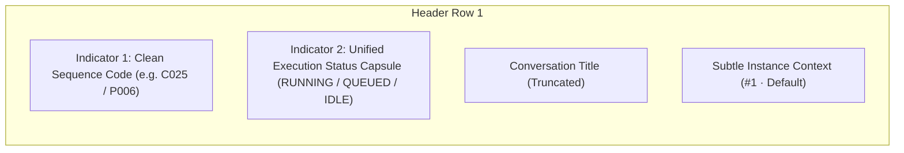
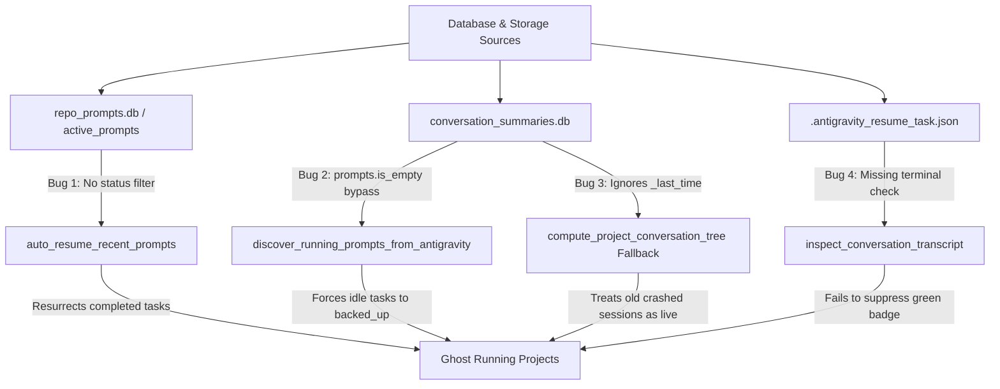

# UI & Component Specification: Task 149 - Prompt Tree View Compaction & Ghost Running Eradication

- **Document Version**: `1.0.0`
- **Specification Classification**: UI/UX, Component Architecture & State Integrity Specification
- **Task Slug**: `149-smart-instance-process-cache-and-prompt-enqueue-fix`
- **Target Release**: Minor Bump Release
- **Maintainer / Attribution**: Strictly `@aukgit` (`(Thanks to @aukgit)`)

---

## 1. Executive Summary & Design Rationale

This specification defines the user interface compaction, badge streamlining, and backend state integrity requirements for Task 149. It directly addresses visual clutter in the Prompt Tree View modal (`src/components/instances/PromptTreeViewModal.tsx`), compacts instance rows in `src/components/instances/InstanceTable.tsx`, cleans headless formatters in `src-tauri/src/modules/repo_db.rs`, and eradicates false-positive "ghost running" items across both frontend and backend pipelines.

### 1.1 Core Problems Identified
1. **Bracket Clutter & Target Noise**: Sequence identifiers and tags in the prompt tree view and headless CLI/Telegram render heavy bracket wrappers (`[AGM:P001 | GM:#1]`, `[AGM:C025]`, `[ProjID: ...]`), consuming excessive horizontal screen space and adding visual fatigue.
2. **Right Panel Header Badge Overload (Row 1)**: The prompt preview header row currently mounts up to 6 or 7 adjacent pills (Sequence Code, 4-Tier Origin Badge, In-Flight Running Pill, Queued Pill, Title, Run Multiplier `xN`, and the 3-item Instance Identity Trio `#1 · exe · name`). This horizontal crowd compresses the title, causes wrapping artifacts, and confuses operators.
3. **Redundant Slim In-Flight Banner**: Immediately below the header row, a secondary slim banner (`In-Flight Execution` / `Queued Task`) repeats execution status, PID, and elapsed duration, squandering 60px of vertical real estate above the prompt text.
4. **Noisy Button Labels & Keyboard Hints**: Action buttons contain verbose text and bracketed keyboard hints (`[Ctrl+Enter]`) that break minimalist design rules.
5. **Ghost Running Items (False Positives)**: Projects and conversation turns report active running statuses (`1 RUNNING`, pulsing green dots) when no active execution exists. Root causes include:
   - `auto_resume_recent_prompts` in `src-tauri/src/modules/repo_db.rs` querying `active_prompts` without filtering `WHERE status IN ('queued', 'pending')`, accidentally resurrecting old completed tasks.
   - `discover_running_prompts_from_antigravity` applying fallback conditions (`prompts.is_empty()` and `prompts.len() < 5`) that force idle conversations into `backed_up` status and inject them into active lists.
   - `compute_project_conversation_tree` fallback loops ignoring timestamp recency (`_last_time`), reviving crashed or stale sessions (> 120s old) as active.
   - `inspect_conversation_transcript` failing to enforce terminal state flags (`is_terminal_done`) to definitively suppress running indicators.

---

## 2. UI Tag Compaction & Bracket Noise Stripping

### 2.1 Before vs. After Visual Comparison

| UI Element | Previous Cluttered Display | New Streamlined Display | Tailwind Styling Specification |
| :--- | :--- | :--- | :--- |
| **Project Node Badge** | `[AGM:P001 \| GM:#1]` | `#1` or `P001` | `text-[9px] font-mono px-1.5 py-0.5 rounded-[4px] shrink-0 font-medium whitespace-nowrap bg-slate-200 dark:bg-[#15334d] text-slate-600 dark:text-cyan-400 border border-slate-300/40 dark:border-cyan-500/20` |
| **Conversation Node Badge** | `[AGM:C025 \| GM:antigrav]` | `C025` | `text-[9px] font-mono px-1.5 py-0.5 rounded-[4px] shrink-0 font-medium whitespace-nowrap bg-slate-200/90 dark:bg-[#15334d] text-slate-600 dark:text-cyan-300 border border-slate-300/30 dark:border-cyan-500/10` |
| **Selected Turn Badge** | `[AGM:C025]` (selected) | `C025` (selected) | `text-[9px] font-mono px-1.5 py-0.5 rounded-[4px] shrink-0 font-medium whitespace-nowrap bg-blue-600 dark:bg-cyan-600 text-white shadow-2xs` |
| **Header Row 1 Layout** | 6-7 loose pills: `[P001]` `[USER]` `[RUNNING]` `[PID]` `Title` `[x2]` `[#1·exe·name]` | **2 Consolidated Indicators**: Clean Sequence Code + Unified Status Capsule | `flex items-center gap-2 flex-wrap min-w-0` |
| **Header Status Capsule** | Scattered separate pills for running, PID, and timer | `RUNNING · 01:23 (PID 4512)` or `QUEUED` or `IDLE` | `inline-flex items-center gap-1.5 px-2 py-0.5 rounded-full text-[9.5px] font-bold font-mono tracking-wide border` |
| **Redundant Slim Banner** | Full-width duplicate banner (60px) below header | **Removed** (Header displays status & duration) | Reclaimed 60px vertical height for prompt content |
| **Action Button & Hint** | `Send Prompt [Ctrl+Enter]` | Segmented Capsule: `Send` + `<kbd>Ctrl+↵</kbd>` | `flex items-center rounded-full bg-blue-600 hover:bg-blue-500 text-white p-0.5 shadow-xs` |
| **Instance Table Profile** | Disjointed `#seq`, Name, Status dot, default badge | Compact inline flex row with clean `#seq` and subtle status pulse | `px-2 py-1 min-w-[140px] max-w-[180px]` |
| **CLI Tree View** | `📁 [AGM:P001 \| GM:#1] [ProjID: ...] ...` | `📁 #1 (P001) · project-name 🟢 ...` | Clean UTF-8 tree without redundant brackets |
| **Telegram HTML Tree** | `📁 <code>[AGM:P001 \| GM:#1]</code> ...` | `📁 <b>#1</b> (<code>P001</code>) · <b>project</b> 🟢 ...` | Clean HTML formatting without bracket clutter |

### 2.2 Sequence Badge Architecture (`formatDualBadge`)

All sequence code renderers must pass through `formatDualBadge` in `src/components/instances/PromptTreeViewModal.tsx`, stripping outer brackets, prefix markers, and duplicate hashes:

```typescript
// src/components/instances/PromptTreeViewModal.tsx
export function formatDualBadge(
    agmCode: string | undefined,
    defaultAgm: string,
    gmCode: string | undefined,
    defaultGm: string
): string {
    const raw = agmCode || defaultAgm || gmCode || defaultGm;
    const clean = raw.replace(/^(AGM:|GM:)/i, '').replace(/[\[\]]/g, '').trim();
    if (clean.startsWith('#') || clean.startsWith('P') || clean.startsWith('C')) {
        return clean;
    }
    return `#${clean}`;
}
```

---

## 3. Right Panel Header Row 1 Consolidation

### 3.1 The 6-Pill Overload Problem
Currently, line 2918 of `src/components/instances/PromptTreeViewModal.tsx` mounts:
1. Sequence Badge (`selectedConversation.seq_code`)
2. 4-Tier Origin Badge (`USER_PROMPT`, `SUBAGENT_INSTRUCTION`, `SYSTEM_MESSAGE`, `TOOL_OUTPUT`)
3. Glowing Running Status Badge with PID and elapsed timer
4. Queued Status Badge
5. Conversation Title (`<h3>`)
6. Run Multiplier (`xN runs`)
7. Instance Identity Trio (`#1 · exe · name`)

This layout overfills the header on standard laptop viewports (1366x768 to 1920x1080), wrapping badges onto 2-3 vertical lines and obscuring the prompt text.

### 3.2 The 2 Consolidated Indicators Architecture

The header row is refactored into two primary indicators on the left, followed by the conversation title and a subtle contextual instance indicator:



#### Indicator 1: Clean Sequence Code
- Renders the clean alphanumeric code (`C025`, `P006`, `#1`).
- Incorporates a compact 10px origin tier icon (User, Bot, Terminal, Wrench) directly inside the pill without a separate bulky origin banner.

#### Indicator 2: Unified Execution Status Capsule
- **Running State**:
  ```tsx
  <span className="inline-flex items-center gap-1.5 px-2 py-0.5 rounded-full text-[9.5px] font-bold font-mono bg-emerald-500/15 text-emerald-700 dark:text-[#1af18d] border border-emerald-500/40 shadow-2xs animate-pulse">
      <span className="w-1.5 h-1.5 rounded-full bg-[#1af18d] animate-pulse" />
      <span>RUNNING</span>
      {instancePid ? <span className="opacity-80">PID: {instancePid}</span> : null}
      <span className="border-l border-emerald-400/40 pl-1 font-mono">{formatDuration(elapsedSeconds)}</span>
  </span>
  ```
- **Queued State**:
  ```tsx
  <span className="inline-flex items-center gap-1 px-2 py-0.5 rounded-full text-[9.5px] font-bold font-mono bg-amber-500/15 text-amber-700 dark:text-amber-300 border border-amber-500/30 shadow-2xs">
      <Clock className="w-2.5 h-2.5 text-amber-500" />
      <span>QUEUED</span>
  </span>
  ```
- **Idle / Done State**:
  ```tsx
  <span className="inline-flex items-center px-1.5 py-0.5 rounded-full text-[9px] font-mono text-slate-500 dark:text-slate-400 bg-slate-100 dark:bg-slate-800/60 border border-slate-200 dark:border-slate-700">
      IDLE
  </span>
  ```

#### Subtle Instance Context
- Eliminate the heavy 3-part bordered pill. Instead, render a subtle muted breadcrumb:
  ```tsx
  <span className="text-[10px] font-mono text-slate-400 dark:text-slate-500 truncate" title={`Instance #${instanceSeqNum} · ${instanceExeName} (${instanceNameDisplay})`}>
      #{instanceSeqNum} · {instanceNameDisplay}
  </span>
  ```

### 3.3 Removal of Redundant Slim In-Flight Banner

Lines 3153–3200 in `src/components/instances/PromptTreeViewModal.tsx` define a full-width slim banner:
```tsx
{/* In-Flight Execution or Queued Slim Banner (if active) */}
{(Boolean(selectedConversation.is_running) || Boolean(selectedConversation.is_queued)) && !isGhostConversation(selectedConversation) && (
    <div className={cn("rounded-xl border px-3.5 py-2 flex items-center justify-between gap-3 ...")}>
    ...
```
**Decision**: Completely remove this banner. The execution state, PID, and elapsed timer are already displayed in Indicator 2 of Header Row 1. The in-flight step summary (`latest_step_summary`) is preserved in Tab 2 ("AI Results & Outputs"), eliminating redundancy and recovering 60px of vertical space.

---

## 4. Button Labels & Keyboard Hint Badges

### 4.1 Segmented Action Capsule Invariant
All primary action buttons must follow the project's segmented dark-glass capsule conventions:
- Rounded pill wrapper (`rounded-full`, dark-glass backdrop, subtle border).
- Action label paired with an unbracketed keyboard shortcut badge (`Ctrl+↵` instead of `[Ctrl+Enter]`).

```tsx
<div className="flex items-center rounded-full bg-blue-600 hover:bg-blue-500 text-white p-0.5 shadow-xs transition-colors">
    <button
        type="button"
        onClick={() => handleResendPrompt()}
        disabled={isResending}
        className="flex items-center gap-1.5 px-3 py-1 text-xs font-semibold rounded-full hover:bg-white/10 transition-colors"
    >
        <Send className="w-3 h-3" />
        <span>{isResending ? 'Sending...' : 'Send'}</span>
    </button>
    <kbd className="px-1.5 py-0.5 text-[9px] font-mono font-bold bg-black/20 text-blue-100 rounded-full mr-1 select-none">
        Ctrl+↵
    </kbd>
</div>
```

---

## 5. InstanceTable Compaction (Profile & Status Columns)

In `src/components/instances/InstanceTable.tsx`:
1. **Profile Column (`<td>`)**:
   - Compact `#seq` badge to `px-1.5 py-0.5 text-[10px] font-mono font-bold rounded-[4px]`.
   - Keep status dot (`w-2 h-2 rounded-full`) inline next to the instance name.
   - Limit `DEFAULT` and `ACTIVE` tags to compact micro-badges (`text-[8.5px] px-1 py-0.2`).
2. **Status & PID Column (`<td>`)**:
   - Merge `Running` and PID into a single compact pill: `Running (1234)`.
   - Prevent unnecessary line breaks with `whitespace-nowrap`.

---

## 6. Ghost Running Eradication Architecture

### 6.1 Problem Architecture & Flaw Manifest



### 6.2 Fix 1: `auto_resume_recent_prompts` Status & Recency Filtering

In `src-tauri/src/modules/repo_db.rs`:
- **Current Defect**: Query selects the earliest prompt from `active_prompts` regardless of whether its status is `'completed'`, `'cancelled'`, or `'dispatched'`.
- **Surgical Patch**: Add strict `status IN ('queued', 'pending')` clause and FIFO ordering:
  ```rust
  let mut prompt_stmt = conn.prepare(
      "SELECT id, prompt_content, model, image_payload 
       FROM active_prompts 
       WHERE status IN ('queued', 'pending')
         AND (project_id = ?1 OR repo_path = ?2 OR project_id LIKE ?3)
         AND (instance_id = ?4 OR (?4 = 'default' AND (instance_id = 'default' OR instance_id = '__default__')))
       ORDER BY created_at ASC, id ASC LIMIT 1"
  )?;
  ```
- **Task File Guard**: When inspecting `.antigravity_resume_task.json`, verify that `status` is explicitly `"queued"` or `"pending"`. If missing or marked `"completed"`, skip auto-resumption.

### 6.3 Fix 2: `discover_running_prompts_from_antigravity` Bypass Eradication

In `src-tauri/src/modules/repo_db.rs`:
- **Current Defect**:
  ```rust
  let is_running_or_recent = not_fully_idle != 0 || status.contains("RUNNING") || prompts.is_empty();
  if !is_running_or_recent && prompts.len() >= 5 {
      continue;
  }
  ```
  The clause `prompts.is_empty()` and `prompts.len() < 5` forces up to 5 completely idle conversations into `prompts` and assigns them `status = "backed_up"`, polluting the tree view with inactive items.
- **Surgical Patch**: Eradicate the bypass completely:
  ```rust
  let is_genuinely_running = not_fully_idle != 0 && status.contains("RUNNING");
  if !is_genuinely_running {
      continue;
  }
  ```
  Only conversations with empirical live flags (`not_fully_idle > 0` AND status containing `"RUNNING"`) shall be collected as running prompts.

### 6.4 Fix 3: `compute_project_conversation_tree` Recency Time Guard

In `src-tauri/src/modules/repo_db.rs` fallback scanning loop (~L5014):
- **Current Defect**:
  ```rust
  let (ws_uris_raw, _last_time, status, not_fully_idle) = item;
  let is_running = status.contains("RUNNING") && not_fully_idle > 0;
  ```
  `_last_time` is ignored! If a session crashed 3 days ago with `status = "RUNNING"`, it is permanently reported as running.
- **Surgical Patch**: Parse `last_modified_time` and enforce a 120-second recency window:
  ```rust
  let last_time_epoch = parse_flexible_timestamp(&_last_time);
  let is_recent = last_time_epoch > 0 && (now_fb - last_time_epoch <= 120);
  let is_running = status.contains("RUNNING") && not_fully_idle > 0 && is_recent;
  ```
  If `last_time_epoch` is older than 120 seconds, `is_running` must strictly evaluate to `false`.

### 6.5 Fix 4: Transcript Deep Scan & `is_terminal_done` Enforcement

In `src-tauri/src/modules/repo_db.rs` (`inspect_conversation_transcript`):
- `TranscriptInspection` detects `is_terminal_done` by reverse-scanning the last 10 lines of `transcript_full.jsonl` (bypassing `TOKEN_USAGE`, `HEARTBEAT`, and `TELEMETRY`).
- When `is_terminal_done` is `true`:
  - `effective_recent_active` is forced to `false`.
  - In `compute_project_conversation_tree`, any conversation where `inspection.is_terminal_done` is `true` MUST have its status set to `"COMPLETED"` or `"IDLE"`, and `effective_is_run = false`.

---

## 7. Headless & CLI/Telegram Parity

In `src-tauri/src/modules/repo_db.rs`:
1. `format_tree_view_cli`:
   - Replace `📁 [AGM:{} | {}] [ProjID: {}]` with clean output:
     ```text
     📁 #1 (P001) · project-name 🟢 (D:\work\project) [Instance: #1 Default]
     ```
   - Replace `💬 [AGM:{} | {}] "{}"` with:
     ```text
     💬 C001 · "Title" 🟢 RUNNING · 12 steps
     ```
2. `format_tree_view_telegram_html`:
   - Strip outer brackets and format with clean HTML tags:
     ```html
     📁 <b>#1</b> (<code>P001</code>) · <b>project-name</b> 🟢
     ```

---

## 8. Verification Matrix & Quality Gate

| Verification Target | Command / Protocol | Expected Outcome |
| :--- | :--- | :--- |
| **Rust Formatting** | `cd src-tauri && cargo fmt -- --check` | Clean, 0 formatting errors |
| **Rust Linter & Compilation** | `cd src-tauri && cargo clippy --all-targets --all-features` | Zero warnings, zero errors |
| **Frontend Bundle & Types** | `npm run build` | Zero TypeScript errors, clean Vite build |
| **Ghost Running Eradication** | Check projects with all idle conversations | `runningCount` evaluates to `0`, no green pulsing badge |
| **Header Row 1 Compaction** | Inspect Prompt Tree View in browser/webview | Only 2 primary pills on left, no vertical wrapping on 1366x768 |
| **Slim Banner Removal** | Inspect prompt view when task is running | Prompt text starts immediately below header; no duplicate banner |
