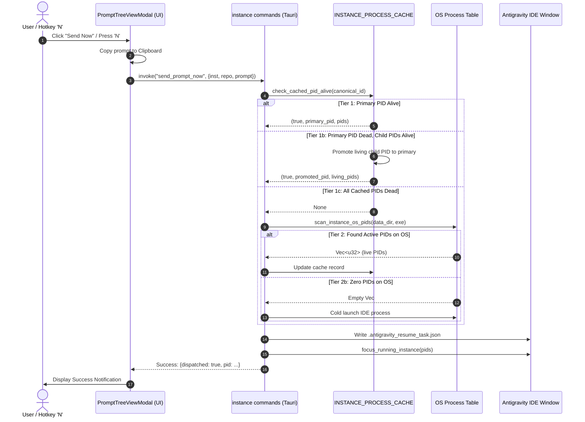
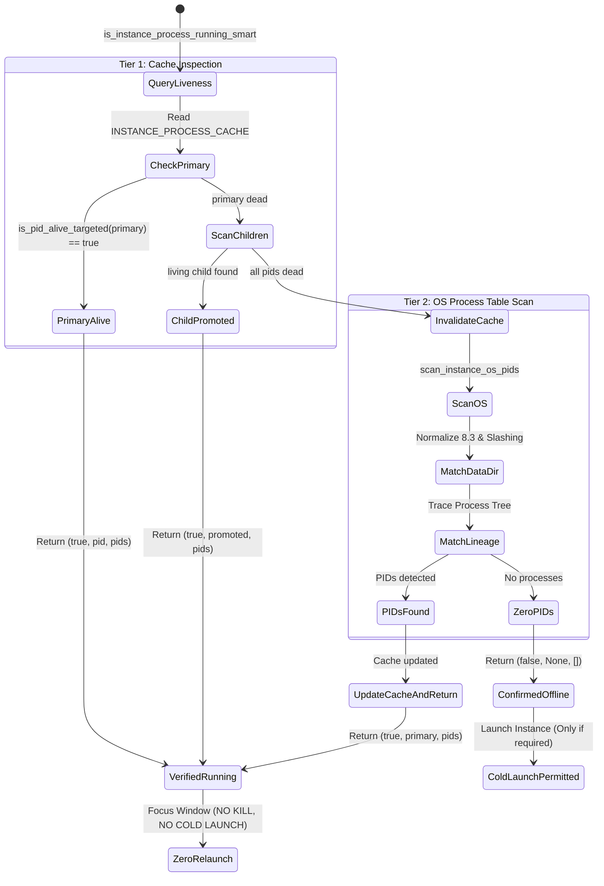

# Architecture Specification: Smart Multi-Instance Process Cache & Prompt Dispatch Engine

> **Target:** `02-spec/21-app/151-smart-instance-process-cache-and-prompt-dispatch-fix/01-architecture-spec.md`  
> **Status:** APPROVED  
> **Author:** @aukgit  
> **Version:** 1.0.0  
> **Slug:** `151-smart-instance-process-cache-and-prompt-dispatch-fix`  
> **Scope:** Multi-Instance Process Cache, Relaunch Prevention, Zero-Relaunch Guarantee, Prompt Dispatch Pipeline, Ghost Running Eradication, Transcript Inspection Engine  

---

## 1. Executive Summary & Problem Formulation

In Antigravity Manager (AGM), users configure and manage multiple isolated profiles ("instances") of the Antigravity IDE. A cornerstone capability of the platform is inspecting prompt conversation trees, dispatching prompts immediately into active workspaces ("Send Now"), or scheduling prompts through a FIFO queue ("Enqueue").

Recent field reports and issue traces revealed a severe set of cascading failures within the process cache and prompt dispatch subsystem:

1. **Destructive Cold-Relaunch Loop (`taskkill` Involuntary Termination)**:
   - When users attempt to send or enqueue a prompt to an already running Antigravity IDE instance, AGM repeatedly fails to verify the active process, executes a destructive kill command (`close_instance()` invoking `taskkill /F /PID` on Windows or `SIGKILL` on POSIX), and cold-launches a fresh IDE window.
   - This destroys unsaved editor state, tears down active terminals, and fails to deliver the prompt to the user's active session.
2. **Single-PID Fragility in Process Cache**:
   - `check_cached_pid_alive` verifies only the primary launcher PID (`entry.primary_pid`).
   - Electron architectures frequently spawn child renderer and worker processes while the initial bootstrap launcher process exits or yields its PID.
   - When `entry.primary_pid` exits, `check_cached_pid_alive` immediately purges the entire cached record, ignoring the active child PIDs recorded in `entry.pids`.
3. **Command-Line & Path Discrepancies on Windows**:
   - `find_pids_for_data_dir` relies on inspecting process command-line arguments for `--user-data-dir`.
   - On Windows, paths frequently appear as 8.3 short paths (e.g. `C:\USERS\ADMINI~1\AppData\...`), with mismatched slash orientations (`\` vs `/`), or case variations.
   - Furthermore, worker/renderer child processes in Electron do not receive the `--user-data-dir` argument, causing command-line string matching to miss live IDE instances.
4. **Duplicate Dispatch Calls in Frontend**:
   - `handleResendPrompt` in `src/components/instances/PromptTreeViewModal.tsx` calls `sendPromptNow` (which initiates process verification and prompt delivery) and immediately calls `focusInstanceWorkspace` (which initiates a second `ensure_instance_running_smart` pass).
   - This concurrent double-invocation induces a race condition that triggers unwanted window spawning.
5. **Ghost "RUNNING" False Positives**:
   - Prompts and projects falsely display the pulsing "RUNNING" state long after execution has concluded.
   - Root causes:
     * `inspect_conversation_transcript` in `src-tauri/src/modules/repo_db.rs` inspected only the last 5 lines (`take(5)`). This was overwhelmed by trailing telemetry records (`TOKEN_USAGE`, `TELEMETRY`, `HEARTBEAT`, `PROGRESS`, `METRICS`), causing completion states to be missed.
     * `is_terminal_done` required explicit `DONE` or `COMPLETED` status strings, missing standard `MODEL` and `PLANNER_RESPONSE` turn completions where the `status` field is omitted.
     * The fallback project discovery loop in `compute_project_conversation_tree` parsed stale `RUNNING` markers from `conversation_summaries.db` without validating whether the owning instance was actually alive on the OS.
     * Unconfirmed active prompt time-to-live (TTL) thresholds were set to 600 seconds, maintaining phantom running states for 10 minutes.

This specification formalizes the architectural redesign to establish a **Zero-Relaunch Guarantee**, implement a **Two-Tier Process Vitality & Closed-PID Re-Scan Engine**, eliminate duplicate frontend dispatches, and eradicate ghost running artifacts.

---

## 2. Deep Root Cause Analysis (RCA)

### 2.1 Destructive Cold-Relaunch Execution Path

The prompt dispatch path travels through `send_prompt_now` and `focus_instance_workspace` in `src-tauri/src/modules/instance.rs`:

```
User clicks "Send Now" / Presses 'N'
  │
  ▼
handleResendPrompt (src/components/instances/PromptTreeViewModal.tsx)
  │
  ├─► sendPromptNow (Tauri invoke: send_prompt_now)
  │     │
  │     ▼
  │   ensure_instance_running_smart(&canonical_inst, Some(repo_path))
  │     │
  │     ├─► is_instance_process_running_smart (Returns FALSE due to PID cache invalidation)
  │     │
  │     └─► launch_instance_with_workspaces(&canonical_id, Some(&ws_vec), true)
  │           │
  │           ▼
  │         launch_instance_inner_with_extra_workspaces
  │           │
  │           ▼
  │         close_instance(instance_id)   <--- DESTRUCTIVE KILL: taskkill /F /PID
  │
  └─► focusInstanceWorkspace (Tauri invoke: focus_instance_workspace)
        │
        ▼
      focus_or_launch_workspace -> ensure_instance_running_smart (SECOND INVOCATION)
```

**RCA Findings:**
1. `launch_instance_inner_with_extra_workspaces` contains an unconditional `let _ = close_instance(instance_id);` at line 3563.
2. In prompt dispatch and focus workflows, the intent is strictly **window reuse and focus**, never process termination.
3. Because `ensure_instance_running_smart` treated an unverified cache as a hard offline signal, it invoked the full installer/launcher pipeline, leading directly to process termination.

### 2.2 Primary PID Invalidation vs Child PID Vitality

In `src-tauri/src/modules/instance.rs` (lines 3280–3294):

```rust
fn check_cached_pid_alive(
    instance_id: &str,
    canonical_id: &str,
) -> Option<(bool, Option<u32>, Vec<u32>)> {
    let entry = get_cached_instance_process(canonical_id)
        .or_else(|| get_cached_instance_process(instance_id))?;
    if let Some(pid) = entry.primary_pid {
        let is_alive = is_pid_alive_targeted(pid) && saved_pid_matches(pid);
        if is_alive {
            return Some((true, Some(pid), entry.pids));
        }
    }
    invalidate_instance_process_cache(instance_id);
    None
}
```

**RCA Findings:**
1. When Electron launches, the initial executable process (`entry.primary_pid`) often delegates lifecycle duties to sub-processes or exits once the window is handed over to the main Chromium process tree.
2. If `is_pid_alive_targeted(pid)` evaluates to `false` for `primary_pid`, the function **immediately calls `invalidate_instance_process_cache(instance_id)`** and returns `None`.
3. It completely ignores `entry.pids`, which contains the surviving PIDs of the instance.
4. If any child PID in `entry.pids` is alive, the instance is alive. The failure to promote a surviving child PID causes premature cache invalidation.

### 2.3 Windows Command-Line Inspection Mismatches

In `find_pids_for_data_dir` (lines 771–850):

```rust
let normalized_target = data_dir.to_lowercase().replace('\\', "/");
let clean_target = normalized_target.trim_end_matches('/');
let canonical_target = std::fs::canonicalize(data_dir).ok().map(|p| ...);
```

**RCA Findings:**
1. **8.3 Short Names**: On Windows, paths like `C:\Users\ADMINI~1\AppData\Local\...` are frequently emitted in process command lines by Electron shortcuts or system schedulers. `clean_target` contains long names like `c:/users/administrator/appdata/local/...`. String containment checks (`args_str.contains(clean_target)`) fail.
2. **Missing `--user-data-dir` on Child Processes**: Only the main browser process is launched with `--user-data-dir`. Renderer, utility, GPU, and crashpad processes omit this argument. If the main process terminates or reorganizes, `find_pids_for_data_dir` cannot match the children.
3. **Non-Default Instance Isolation**: Cloned instances use custom directories under `.antigravity_tools/instances/<inst-id>`. If `args_str` escapes backslashes (e.g. `\"C:\\path\\to\\dir\"`), standard substring matching fails.

### 2.4 Duplicate Frontend Invocations in `handleResendPrompt`

In `src/components/instances/PromptTreeViewModal.tsx` (lines 1705–1724):

```typescript
// 1. Dispatch prompt directly to running instance via sendPromptNow
await sendPromptNow(targetInstId, repoPath, promptContent, conv?.conversation_id);

// 2. Copy prompt content to clipboard
await navigator.clipboard.writeText(promptContent);

// 4. Focus IDE instance window if workspace is known
if (repoPath) {
    const repoName = repoPath.split(/[/\\]/).filter(Boolean).pop() || repoPath;
    await focusInstanceWorkspace(targetInstId, repoPath, repoName);
}
```

**RCA Findings:**
1. Both `sendPromptNow` and `focusInstanceWorkspace` execute backend Tauri commands that invoke `ensure_instance_running_smart`.
2. `send_prompt_now` on the backend already focuses the target window upon delivering the prompt.
3. The secondary call to `focusInstanceWorkspace` is redundant and triggers a race condition if the process table is being refreshed.

### 2.5 Ghost Running False Positives in Conversation Trees

In `src-tauri/src/modules/repo_db.rs`:

```rust
// inspect_conversation_transcript: lines 4473 & 4641
for line in lines.iter().rev().take(5) { // and take(10)
    ...
    if s_type == "TOKEN_USAGE" || s_type == "TELEMETRY" || s_type == "HEARTBEAT" {
        continue;
    }
    ...
}
```

**RCA Findings:**
1. Antigravity IDE appends numerous telemetry lines at the conclusion of a conversation turn: `TOKEN_USAGE`, `TELEMETRY`, `HEARTBEAT`, `PROGRESS`, and `METRICS`.
2. A shallow reverse scan of 5 or 10 lines is exhausted entirely by telemetry records before reaching the actual `PLANNER_RESPONSE` or `USER_INPUT` line.
3. `is_completed_or_waiting` remains `false`, causing the engine to classify the conversation as actively running.
4. `is_terminal_done` required explicit `"DONE"` or `"COMPLETED"` status strings. When the model completes its response without setting a status attribute (standard Antigravity format), it was never recognized as terminal.
5. In `compute_project_conversation_tree` (lines 4964–5038), fallback projects discovered from `conversation_summaries.db` computed `is_running = status.contains("RUNNING") && not_fully_idle > 0 && is_recent` without verifying `is_owning_inst_alive`. Dead instances with recent timestamps continued to display green running indicators.
6. Stale active prompts in SQLite (`active_prompts`) used a TTL of 600 seconds, maintaining phantom running states for 10 minutes after IDE exit.

---

## 3. Smart Process Cache Two-Tier Liveness & Closed-PID Re-Scan Architecture

```
                  ┌──────────────────────────────────────────────┐
                  │       Incoming Process Liveness Query        │
                  │   is_instance_process_running_smart(id)      │
                  └──────────────────────┬───────────────────────┘
                                         │
                                         ▼
                  ┌──────────────────────────────────────────────┐
                  │          Canonical ID Resolution             │
                  │         resolve_instance_id(&id)             │
                  └──────────────────────┬───────────────────────┘
                                         │
                                         ▼
            ┌──────────────────────────────────────────────────────────┐
            │                  Tier 1: Cache Check                     │
            │               check_cached_pid_alive                     │
            └────────────────────────────┬─────────────────────────────┘
                                         │
                    ┌────────────────────┴────────────────────┐
                    │                                         │
             Primary PID Alive?                        Primary PID Dead?
                    │                                         │
           ┌────────┴────────┐                       ┌────────┴────────┐
           │ Return (true,   │                       │ Multi-PID Scan: │
           │   primary, pids)│                       │ Check entry.pids│
           └─────────────────┘                       └────────┬────────┘
                                                              │
                                       ┌──────────────────────┴──────────────────────┐
                                       │                                             │
                               Any Child PID Alive?                           All PIDs Dead?
                                       │                                             │
                              ┌────────┴────────┐                           ┌────────┴────────┐
                              │ Promote Child to│                           │ Invalidate Cache│
                              │ Primary & Return│                           │ Proceed to T2   │
                              └─────────────────┘                           └────────┬────────┘
                                                                                     │
                                         ┌───────────────────────────────────────────┘
                                         ▼
            ┌──────────────────────────────────────────────────────────┐
            │               Tier 2: OS Process Re-Scan                 │
            │                 scan_instance_os_pids                    │
            └────────────────────────────┬─────────────────────────────┘
                                         │
                    ┌────────────────────┴────────────────────┐
                    │                                         │
           PIDs Found on OS?                         Zero PIDs on OS?
                    │                                         │
           ┌────────┴────────┐                       ┌────────┴────────┐
           │ Cache Live PIDs │                       │ Confirm Offline │
           │ Return (true,   │                       │ Return (false,  │
           │   primary, pids)│                       │   None, [])     │
           └─────────────────┘                       └─────────────────┘
```

### 3.1 Multi-PID Vitality & Promotion Algorithm

To prevent premature cache invalidation when Electron launcher wrappers exit, `check_cached_pid_alive` is redesigned to evaluate the full PID set:

1. **Primary PID Check**: Test `entry.primary_pid` with `is_pid_alive_targeted(pid) && saved_pid_matches(pid)`.
2. **Child PID Fallback**: If the primary PID is dead, iterate through all PIDs in `entry.pids`:
   - Filter `entry.pids` to only surviving PIDs: `let living_pids: Vec<u32> = entry.pids.into_iter().filter(|&p| is_pid_alive_targeted(p) && saved_pid_matches(p)).collect();`
3. **Primary PID Promotion**:
   - If `!living_pids.is_empty()`, select the first living PID as the new `primary_pid`.
   - Update the cached `InstanceProcessRecord` with the promoted primary PID and the pruned list of living PIDs.
   - Return `Some((true, Some(promoted_pid), living_pids))` immediately.
4. **Cache Invalidation**:
   - Only when **all** PIDs in `entry.pids` are confirmed dead is `invalidate_instance_process_cache(instance_id)` called, returning `None` to trigger Tier 2.

### 3.2 Robust OS Re-Scan with Windows 8.3 Expansion

When Tier 1 indicates all cached PIDs have exited, Tier 2 executes `scan_instance_os_pids` with normalized path matching:

1. **Path Normalization Engine**:
   - Compute `clean_target` (lowercase, forward slashes).
   - Resolve Windows short paths using `dunce::canonicalize` or long-path conversion to ensure 8.3 paths (e.g. `ADMINI~1`) match full names (`Administrator`).
   - Retain trailing slash variants to avoid boundary truncation.
2. **Process Lineage Resolution**:
   - Inspect all running processes matching the IDE binary name (`antigravity.exe`, `Antigravity`).
   - If a parent process matches the target instance data directory or cloned executable name (`antigravity-<id>`), all child processes inherit instance attribution even if their command-line arguments omit `--user-data-dir`.
3. **Zero-Relaunch Guarantee**:
   - If `scan_instance_os_pids` detects any living process, update the cache and return `(true, primary_pid, pids)`.
   - `ensure_instance_running_smart` intercepts this result and **never invokes `launch_instance_with_workspaces`**.

### 3.3 Prompt Dispatch Non-Destructive Focus

In prompt dispatch workflows, window interaction must never be destructive:

1. **Decouple Launch from Dispatch**:
   - `ensure_instance_running_smart` checks liveness.
   - If running: delegate exclusively to `focus_running_instance(&pids, workspace_path)` and return `Ok((true, primary_pid))`.
   - Under no circumstances shall `close_instance` be called during prompt dispatch.
2. **Frontend De-duplication**:
   - Remove the redundant `await focusInstanceWorkspace(...)` call in `handleResendPrompt`.
   - `send_prompt_now` on the backend handles prompt persistence, file drop (`.antigravity_resume_task.json`), and non-destructive window focus in a single atomic pass.

---

## 4. Ghost Running Eradication & Terminal State Architecture

### 4.1 Deep Reverse Scan Pipeline (`take(25)`)

In `inspect_conversation_transcript` (`src-tauri/src/modules/repo_db.rs`), the reverse scanner is expanded from `take(5)` to `take(25)` lines to overcome trailing telemetry bursts:

```rust
// Exhaustive telemetry filter
let is_telemetry_noise = s_type == "TOKEN_USAGE"
    || s_type == "TELEMETRY"
    || s_type == "HEARTBEAT"
    || s_type == "PROGRESS"
    || s_type == "METRICS"
    || s_type == "SYSTEM_LOG";
```

### 4.2 Broadened Terminal State Recognition

Antigravity transcripts frequently conclude assistant turns with a `MODEL` or `PLANNER_RESPONSE` record that has no explicit `"status": "DONE"` field.

The updated terminal state condition:
```rust
if s_type == "PLANNER_RESPONSE" || s_source == "MODEL" {
    let tool_calls = val.get("tool_calls").and_then(|tc| tc.as_array());
    let has_open_tools = tool_calls.map(|tc| !tc.is_empty()).unwrap_or(false);
    let is_terminal_status = s_status.eq_ignore_ascii_case("DONE")
        || s_status.eq_ignore_ascii_case("COMPLETED")
        || s_status.eq_ignore_ascii_case("IDLE")
        || s_status.is_empty(); // Empty status without open tools indicates turn completion

    if !has_open_tools && is_terminal_status {
        is_terminal_done = true;
    }
}
```

### 4.3 OS-Bound Project Liveness Guard

In `compute_project_conversation_tree`, fallback projects loaded from `conversation_summaries.db` are strictly guarded by the owning instance's OS liveness:

```rust
let is_owning_inst_alive = if owning_inst_id == "default" || owning_inst_id == "__default__" {
    crate::modules::process::is_antigravity_running(None)
} else if let Some(inst) = registry.instances.iter().find(|i| i.id == *owning_inst_id || i.name == *owning_inst_id) {
    let (is_running, _, _) = crate::modules::instance::is_instance_process_running_smart(&inst.id);
    is_running
} else {
    false
};

// Guard fallback project is_running attribute
let is_running = is_owning_inst_alive && status.contains("RUNNING") && not_fully_idle > 0 && is_recent;
```

### 4.4 Tightened Active Prompt TTLs

1. **Unconfirmed Prompts**: For active prompts in SQLite without confirmed living OS worker processes, the TTL is reduced from 600s to **45 seconds**.
2. **Automatic Expiration**: Any prompt with `status IN ('running', 'in_flight', 'dispatched')` exceeding 45 seconds without heartbeat is automatically updated to `completed`.

---

## 5. Architectural Diagrams

### 5.1 Process Verification & Prompt Injection Sequence



### 5.2 Two-Tier Liveness State Machine



---

## 6. API & Module Contract Specifications

### 6.1 `src-tauri/src/modules/instance.rs`

| Function Signature | Description | Contract |
| :--- | :--- | :--- |
| `pub fn is_instance_process_running_smart(instance_id: &str) -> (bool, Option<u32>, Vec<u32>)` | Two-tier process liveness verification. | Never returns false if any instance child/main process is alive on OS. |
| `fn check_cached_pid_alive(instance_id: &str, canonical_id: &str) -> Option<(bool, Option<u32>, Vec<u32>)>` | Tier 1 cache verification with child promotion. | Checks `primary_pid`; if dead, scans `pids`; promotes first survivor. |
| `fn scan_instance_os_pids(inst: &InstanceConfig, canonical_id: &str) -> Vec<u32>` | Tier 2 OS table scanner with 8.3 normalization. | Normalizes Windows short paths; traces process lineage. |
| `pub fn ensure_instance_running_smart(instance_id: &str, workspace_path: Option<&str>) -> Result<(bool, Option<u32>), AppError>` | Smart runner with Zero-Relaunch Guarantee. | Focuses existing window if running; launches only when confirmed offline. |

### 6.2 `src-tauri/src/modules/repo_db.rs`

| Function Signature | Description | Contract |
| :--- | :--- | :--- |
| `fn inspect_conversation_transcript(base_dir: &Path, conversation_id: &str) -> TranscriptInspection` | Deep reverse scanner (25 lines) with telemetry filtering. | Bypasses `TOKEN_USAGE`, `HEARTBEAT`, etc.; recognizes terminal state even if status is omitted. |
| `fn compute_project_conversation_tree(...) -> Vec<AgmProjectTreeNode>` | Project tree builder with OS liveness guard. | Guards fallback projects with `is_owning_inst_alive`; enforces 45s TTL. |

---

## 7. Verification, Quality & Invariant Matrix

1. **Zero-Relaunch Invariant**: Under no circumstance shall `ensure_instance_running_smart` or `send_prompt_now` terminate an active IDE process (`close_instance`).
2. **Multi-PID Vitality Invariant**: A cached instance record is valid as long as **at least one** PID in `entry.pids` is alive on the OS.
3. **OS-Bound Project Liveness Invariant**: No project node in `AgmProjectTreeNode` shall report `is_running: true` unless its owning instance is confirmed alive in the OS process table.
4. **FIFO Dispatch Invariant**: All prompt queues in SQLite strictly adhere to `ORDER BY created_at ASC, id ASC`.
5. **Host-Shielded E2E Invariant**: Automated test suites must never terminate host Antigravity IDE instances during verification runs.
