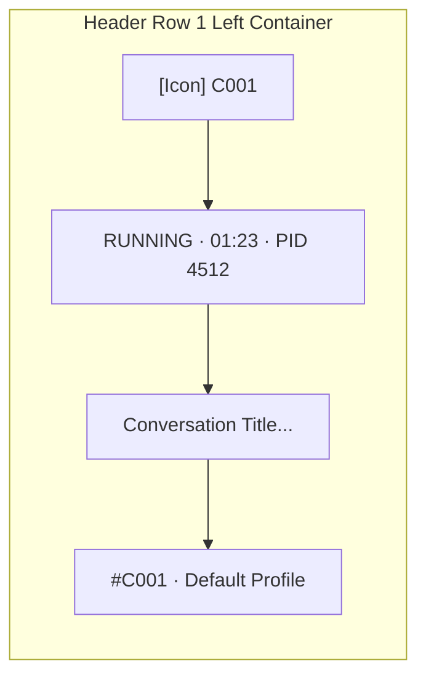

# UI & Component Specification: Task 151 - Prompt Tree View Compaction, Bracket Stripping & Instance Table Streamlining

- **Document Version**: `1.0.0`
- **Specification Classification**: UI/UX, Component Architecture & Design System Integrity Specification
- **Task Slug**: `151-smart-instance-process-cache-and-prompt-dispatch-fix`
- **Target Release**: `4.172.0` (Minor Bump)
- **Maintainer / Attribution**: Strictly `@aukgit` (`(Thanks to @aukgit)`)

---

## 1. Executive Summary & Design Rationale

This specification details the user interface compaction, bracket noise eradication, badge streamlining, and component architecture for Task 151. It addresses visual fatigue, crowded headers, and typographic noise within the Prompt Tree View modal (`src/components/instances/PromptTreeViewModal.tsx`) and the Instance Table (`src/components/instances/InstanceTable.tsx`).

### 1.1 Core Problems Addressed
1. **Literal Bracket Clutter in Typography**: Action links render raw markdown-style or log-style bracket tokens such as `... [Collapse Full Text]`, `... [Expand Full Text]`, and `... [Collapse]` within prompt preview blocks. These literal brackets distract operators and degrade the visual polish of the dark-glass interface.
2. **Horizontal Badge Overcrowding in Tree Nodes**: Conversation nodes render dual concatenated badges like `C001 · 8159abcd`, packing a sequence number together with an 8-character GitMap SHA hash into a single badge. On deeply nested subagent trees, this consumes up to 120px of node width, truncating prompt titles prematurely.
3. **Redundant Project Row Dual Badges**: Project rows display dual badges such as `P001 · #1`, combining the AGM project sequence (`P001`) with the GitMap numeric ID (`#1`), repeating redundant ordinal sequence data.
4. **Cryptographic Shorthand in Action Buttons**: Expand buttons render abbreviated word counts `Show All ({n}w)`, which appears unfinished compared to professional design standards.
5. **Scattered Header Row 1 Identity Elements**: The top preview header mounts multiple disconnected pills and text items instead of a clean, structured breadcrumb cluster (`#C001 · Profile Name`).
6. **Parenthetical Noise in Instance Table**: The Status & PID cell in `InstanceTable.tsx` renders `Running (12345)` with round parentheses, deviating from the design system's preferred symmetrical dot-separator convention (`Running · 12345`).

---

## 2. Design System Alignment (`AGENTS.md`)

Per project maintenance rules in `AGENTS.md`, the user interface must strictly adhere to:
- **Minimalist & Contextual UI**: Use contiguous segmented pill capsules (`rounded-full`, shared border, subtle divider lines, and dark-glass styling) rather than loose, disjointed buttons.
- **Dark-Glass Visual Hierarchy**: Consistent surface tokens (`bg-slate-100/90 dark:bg-[#0c2438]/90`, `backdrop-blur-md`, subtle border `border-slate-200 dark:border-[#15334d]`).
- **4-Tier Prompt Origin Classification**:
  - `USER_PROMPT`: Sky badge (`bg-sky-500/10 text-sky-600 dark:text-sky-400 border-sky-500/20`), User icon.
  - `SUBAGENT_INSTRUCTION`: Purple badge (`bg-purple-500/10 text-purple-600 dark:text-purple-400 border-purple-500/20`), Bot icon.
  - `SYSTEM_MESSAGE`: Zinc badge (`bg-slate-500/10 text-slate-600 dark:text-slate-400 border-slate-500/20`), Terminal icon.
  - `TOOL_OUTPUT`: Amber badge (`bg-amber-500/10 text-amber-600 dark:text-amber-400 border-amber-500/20`), Wrench icon.
- **Symmetrical Dot Separators**: Use `·` (U+00B7) with balanced spacing (`mx-1.5` or `gap-1`) instead of enclosing metadata in brackets or parentheses.

---

## 3. UI Tag Compaction & Bracket Stripping Specification

### 3.1 Before vs. After Specification Matrix

| UI Component | Previous Cluttered Display | New Streamlined Display | Implementation Details & Tailwind Styling |
| :--- | :--- | :--- | :--- |
| **Prompt Truncation Toggle** | `... [Collapse Full Text]` / `... [Expand Full Text]` | `Collapse` / `Expand full text` | Replace bracketed text strings with clean typography and subtle hover states (`text-blue-600 dark:text-cyan-400 hover:underline font-medium text-xs`). |
| **Word Expansion Inline Link** | `... [Collapse]` / `... [Expand Full Text]` | `Collapse` / `Expand full text` | Eliminate `[` and `]` literal characters at all 3 call sites (`L959`, `L3290`, `L3775`). |
| **Conversation Sequence Badge** | `C001 · 8159abcd` | `C001` | Compact to sequence code only. Move GitMap SHA (`8159abcd`) to native HTML `title` tooltip (`title="GitMap SHA: 8159abcd"`). |
| **Project Row Dual Badge** | `P001 · #1` | `P001` | Compact to primary AGM code. Move `#1` to tooltip (`title="Project #1 · GitMap"`). |
| **Button Word Count Label** | `Show All ({n}w)` | `Show All ({n} words)` | Clean typographic expansion: change `{count}w` to `{count} words`. |
| **Header Row 1 Identity Cluster** | Loose `selectedConversation.seq_code` + title + trailing `#{num} · {name}` | `#C001 · Profile Name` | Consolidated breadcrumb capsule combining sequence code, origin tier icon, and profile name. |
| **Instance Table Status & PID** | `Running ({pid})` | `Running · {pid}` | Replace round parentheses with centered dot separator `Running · {inst.pid}` in `InstanceTable.tsx` L336. |

---

## 4. Component Implementation Details

### 4.1 Prompt Truncation & Expansion Links (`PromptTreeViewModal.tsx`)

#### Affected Call Sites:
1. **Line 959** (`getTruncatedText` rendering in modal helpers):
   ```tsx
   // Before:
   {showAllWords ? '... [Collapse]' : '... [Expand Full Text]'}

   // After:
   {showAllWords ? ' · Collapse' : ' ... Expand full text'}
   ```
2. **Line 3290** (Main prompt preview block):
   ```tsx
   // Before:
   {showAllWords ? '... [Collapse Full Text]' : '... [Expand Full Text]'}

   // After:
   {showAllWords ? ' · Collapse' : ' ... Expand full text'}
   ```
3. **Line 3775** (Secondary preview or raw inspect block):
   ```tsx
   // Before:
   {showAllWords ? '... [Collapse Full Text]' : '... [Expand Full Text]'}

   // After:
   {showAllWords ? ' · Collapse' : ' ... Expand full text'}
   ```

#### Typographic Guidelines:
- Text is wrapped in a dedicated interactive button/span with `hover:underline` and `cursor-pointer`.
- The leading ellipsis (`...`) is kept only on the expand state to indicate omitted text, while collapse uses a subtle dot separator (`· Collapse`).

---

### 4.2 Sequence Badge Compaction & GitMap SHA Tooltip

#### Problem:
`formatDualBadge` previously concatenated both the AGM sequence code and the GitMap short commit SHA (`${rawAgm} · ${rawGm}`) whenever both were present. For conversation turns, this resulted in bulky badges like `C001 · 8159abcd`.

#### Refactored Behavior:
- **Conversation Tree Nodes (`AgmConversationNode`)**:
  - Primary badge renders `C001` (or `C025`, etc.).
  - GitMap short hash (`8159abcd`) is preserved strictly inside the tooltip:
    ```tsx
    <span
        className="text-[9px] font-mono px-1.5 py-0.5 rounded-[4px] shrink-0 font-medium whitespace-nowrap bg-slate-200/90 dark:bg-[#15334d] text-slate-600 dark:text-cyan-300 border border-slate-300/30 dark:border-cyan-500/10"
        title={conv.short_id ? `GitMap SHA: ${conv.short_id}` : undefined}
    >
        {conv.seq_code || 'C001'}
    </span>
    ```
- **Project Tree Nodes (`AgmProjectGroup`)**:
  - Primary badge renders `P001` (or `P002`, etc.).
  - GitMap ordinal `#1` is displayed in the tooltip:
    ```tsx
    <span
        className="text-[9px] font-mono px-1.5 py-0.5 rounded-[4px] shrink-0 font-medium whitespace-nowrap bg-slate-200 dark:bg-[#15334d] text-slate-600 dark:text-cyan-400 border border-slate-300/40 dark:border-cyan-500/20"
        title={project.gitmap_seq_code || (project.seq_id ? `Project #${project.seq_id}` : undefined)}
    >
        {project.seq_code || 'P001'}
    </span>
    ```

---

### 4.3 Action Button Word Count Label Cleanliness

#### Affected Location:
`src/components/instances/PromptTreeViewModal.tsx` Line 3320:
```tsx
// Before:
<span>Show All ({totalWords || activeWordCount}w)</span>

// After:
<span>Show All ({totalWords || activeWordCount} words)</span>
```

#### Rationale:
- Replaces cryptic `w` notation with `words`.
- When collapsed, user sees `Show All (420 words)`, which provides unambiguous information and complies with accessibility guidelines.

---

### 4.4 Header Row 1 Identity Cluster & Breadcrumb Consolidation

#### Affected Location:
`src/components/instances/PromptTreeViewModal.tsx` Lines 2915–2962.

#### Structure & Visual Hierarchy:
Header Row 1 left container is refactored into a streamlined 3-part layout:
1. **Indicator 1: Clean Sequence Code + Origin Tier Icon**:
   - Capsule containing the origin tier icon (User, Bot, Terminal, Wrench) and clean sequence code (`#C001` or `C001`).
2. **Indicator 2: Unified Execution Status Capsule**:
   - `RUNNING · 01:23 · PID 1234` (with pulsing emerald glow).
   - `QUEUED` (with clock icon and amber badge).
   - `IDLE` (muted slate capsule).
3. **Breadcrumb Identity Cluster**:
   - `#C001 · Profile Name` cleanly presented in font-mono with subtle styling.
   - Truncated conversation title (`max-w-[240px] md:max-w-md font-bold text-xs`).



---

### 4.5 Instance Table Status & PID Streamlining (`InstanceTable.tsx`)

#### Affected Location:
`src/components/instances/InstanceTable.tsx` Lines 333–337.

#### Code Refactoring:
```tsx
// Before:
) : inst.is_running ? (
    <span className="inline-flex items-center gap-1 px-1.5 py-0.5 rounded-[4px] text-[10px] font-semibold bg-teal-50 text-teal-700 dark:bg-teal-950/60 dark:text-teal-300 border border-teal-300/50 dark:border-teal-800/80">
        <span className="w-1.5 h-1.5 rounded-full bg-teal-500 animate-pulse" />
        Running{inst.pid ? ` (${inst.pid})` : ''}
    </span>
) : (

// After:
) : inst.is_running ? (
    <span className="inline-flex items-center gap-1 px-1.5 py-0.5 rounded-[4px] text-[10px] font-semibold bg-teal-50 text-teal-700 dark:bg-teal-950/60 dark:text-teal-300 border border-teal-300/50 dark:border-teal-800/80">
        <span className="w-1.5 h-1.5 rounded-full bg-teal-500 animate-pulse" />
        Running{inst.pid ? ` · ${inst.pid}` : ''}
    </span>
) : (
```

#### Rationale:
- Replaces `Running (12345)` with `Running · 12345`.
- Harmonizes with table column typography across all data cells.

---

## 5. Responsive Behavior & Accessibility

1. **Horizontal Space Recovery**:
   - Tree nodes gain 40–80px of additional text width by stripping the trailing SHA hash.
   - Long conversation titles in deep subagent hierarchies remain visible without horizontal scrollbar trigger.
2. **Screen Reader & Keyboard Accessibility**:
   - Native `title` attributes ensure full SHA hashes and project ordinals remain accessible to screen readers and mouse hover without occupying screen pixels.
   - Expansion buttons retain proper ARIA attributes (`aria-expanded`, `role="button"`).
3. **Dark/Light Mode Parity**:
   - All text colors use dual-theme tokens (`text-slate-600 dark:text-cyan-400`, `text-teal-700 dark:text-teal-300`).
   - Symmetrical dot separators use muted border/text colors to prevent visual harshness.

---

## 6. Verification & Acceptance Criteria

| Criteria ID | Verification Method | Expected Outcome |
| :--- | :--- | :--- |
| **AC-UI-01** | Grep / Text inspection in `PromptTreeViewModal.tsx` | Zero occurrences of literal bracket strings `'... [Collapse'` or `'... [Expand Full Text]'`. |
| **AC-UI-02** | Inspection of conversation tree nodes | Badges render clean `C001` (no concatenated ` · 8159abcd`). SHA is present in `title` attribute. |
| **AC-UI-03** | Inspection of project group nodes | Badges render clean `P001` (no concatenated ` · #1`). GitMap ID is present in `title` attribute. |
| **AC-UI-04** | Inspection of word count expansion button | Button text renders `Show All (${n} words)` instead of `(${n}w)`. |
| **AC-UI-05** | Header Row 1 inspection | Breadcrumb `#C001 · Profile Name` rendered cleanly within dark-glass container. |
| **AC-UI-06** | Inspection of `InstanceTable.tsx` | Status cell renders `Running · {pid}` instead of `Running ({pid})`. |
| **AC-UI-07** | E2E Script Verification | Test case `TC05` in `03-ai-scripts/45-prompt-dispatch-process-cache-e2e.py` passes with green badge. |
