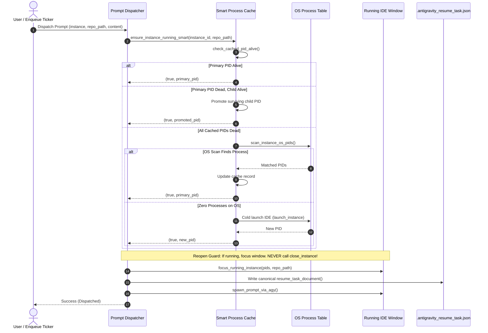
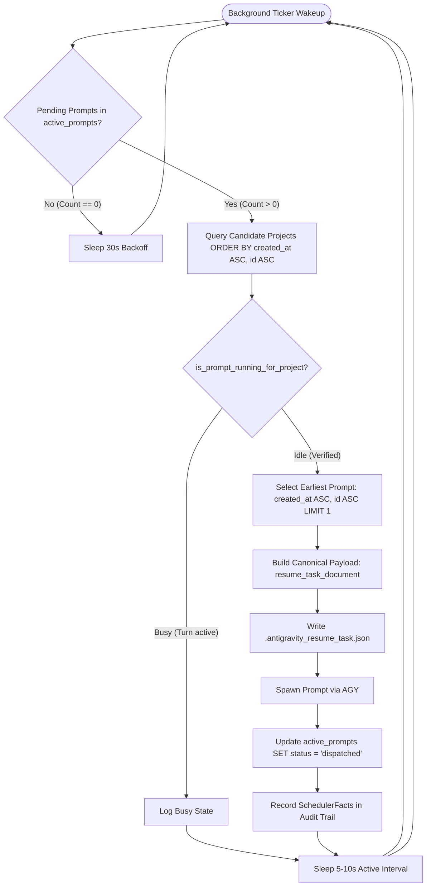

# Architecture Specification: IDE Instance Smart Process Cache & Prompt Dispatch Engine

> **Target:** `02-spec/21-app/152-ide-instance-prompt-cache-and-dispatch-fix/01-architecture-spec.md`  
> **Status:** APPROVED  
> **Author:** @aukgit  
> **Version:** 1.0.0  
> **Slug:** `152-ide-instance-prompt-cache-and-dispatch-fix`  
> **Scope:** Multi-Instance Process Cache, Reopen Loop Prevention, Startup Cache Warm-Up, Closed PID Recovery, Reopen Guard, FIFO Enqueued Prompt Background Ticker, Canonical Resume Document Generation  

---

## 1. Executive Summary & Problem Formulation

In Antigravity Manager (AGM), users manage multiple isolated profiles ("instances") of the Antigravity IDE. Key capabilities include inspecting prompt conversation trees, dispatching prompts immediately into active workspaces ("Send Now"), backing up active prompts prior to account/instance switching, and scheduling prompts through a First-In-First-Out (FIFO) queue ("Enqueue").

Despite prior point fixes, end-to-end tracing reveals critical stability, latency, and consistency issues across process caching and prompt dispatch:

1. **Destructive IDE Reopen Loops During Prompt Dispatch & Window Focus**:
   - When a prompt is dispatched or an instance workspace is focused, `ensure_instance_running_smart` checks if the IDE is running.
   - If the in-memory cache evaluates to offline—due to an un-warmed cache on application startup, temporary process scan TTL expiration, or bootstrap PID turnover—the runner initiates a cold launch (`launch_instance_with_workspaces` or `launch_instance`).
   - The launcher triggers `close_instance()`, sending an involuntary termination signal (`taskkill /F /PID` on Windows or `SIGKILL` on POSIX) to the running IDE.
   - This destroys active terminal sessions, wipes unsaved buffers, creates an infinite reopen loop, and prevents prompt delivery into the running session.

2. **Cold Process Cache on Application Boot**:
   - `INSTANCE_PROCESS_CACHE` starts completely empty upon AGM application startup.
   - When users immediately attempt to dispatch an enqueued prompt or view active instances, `get_cached_instance_process` returns `None`.
   - Without an upfront warm-up routine cross-referencing running OS processes, saved SQLite records (`instance_processes`), and registry configurations (`instances.json`), the system suffers false-negative offline states.

3. **Fragile Single-PID Lifecycle vs. Closed PID Recovery**:
   - Antigravity IDE runs on Electron/Chromium, where an initial launcher wrapper process often exits or transfers lifecycle ownership to child renderer/worker processes.
   - When the cached `primary_pid` exits, naive cache checks invalidate the entire record and declare the instance dead, even when multiple child worker PIDs (`entry.pids`) remain active and healthy on the OS.
   - When all cached PIDs appear dead, the system fails to perform a comprehensive OS process re-scan before concluding the instance is offline.

4. **Missing Autonomous Background Ticker for Enqueued Prompts**:
   - While `check_and_dispatch_enqueued_prompts` exists in `src-tauri/src/modules/repo_db.rs`, it relied primarily on infrequent scheduled intervals (e.g., 10 minutes) or ad-hoc triggers.
   - Enqueued prompts sit idle for up to 10 minutes after a project finishes executing, rather than being autonomously dispatched as soon as the project becomes idle.
   - Prompt dispatching across projects requires a dedicated, adaptive background ticker that enforces strict First-In-First-Out (FIFO) dispatching (`ORDER BY created_at ASC, id ASC`).

5. **Schema Divergence in Resume Task Documents**:
   - The file `.antigravity_resume_task.json` instructs the IDE to resume and continue conversations upon boot or switch.
   - While `resume_task_document(...)` was defined as the canonical builder, multiple callers in `src-tauri/src/modules/repo_db.rs` manually constructed ad-hoc raw JSON payloads.
   - These inline payloads omitted critical fields (such as `conversation_id`, consistent `image_paths`, and normalized timestamp keys), causing the IDE to lose conversation continuity and spawn duplicate untitled sessions.

This specification formalizes the architectural design to establish a **Zero-Relaunch Guarantee**, implement **Startup Cache Warm-Up**, provide **Closed PID Multi-Child Recovery**, deploy an **Adaptive FIFO Enqueued Prompt Background Ticker**, and enforce **Canonical Resume Document Generation**.

---

## 2. Root Cause Analysis (RCA)

### 2.1 Destructive Cold-Relaunch Execution Path

The prompt dispatch and workspace focus pipeline flows through `src-tauri/src/modules/instance.rs`:

```
User Action: "Send Now" / Enqueue Dispatch / Focus Workspace
  │
  ▼
ensure_instance_running_smart(instance_id, workspace_path)
  │
  ├─► is_instance_process_running_smart(canonical_id)
  │     │
  │     ├─► check_cached_pid_alive (Fails if cache cold or primary PID turned over)
  │     └─► scan_instance_os_pids (May miss if scan cache stale or path mismatch)
  │           │
  │           ▼ Returns (false, None, [])
  │
  └─► Branch: Not Running -> Triggers Cold Launch
        │
        ▼
      launch_instance_with_workspaces(&canonical_id, Some(&ws_vec), true)
        │
        ▼
      launch_instance_inner_with_extra_workspaces
        │
        ▼
      close_instance(instance_id)  <--- DESTRUCTIVE: taskkill /F /PID
        │
        ▼
      Spawns new executable (Loss of active session, reopen loop)
```

**Root Causes:**
1. **Unchecked Cold-Launch Fallthrough**: When `is_instance_process_running_smart` returned `false`, `ensure_instance_running_smart` immediately invoked `launch_instance_with_workspaces`. In `launch_instance_inner_with_extra_workspaces`, `close_instance` was executed, killing the running IDE process.
2. **Missing Reopen Guard**: Prompt dispatch and workspace focus operations require **window reuse and focus**, never process termination. The runner lacked an immutable guard ensuring that if an instance has any surviving process on the OS, AGM strictly focuses the window and never relaunches.

### 2.2 Startup Cache Coldness & Cross-Check Absence

```
AGM Application Launch
  │
  ▼
INSTANCE_PROCESS_CACHE initialized empty (Lazy<Arc<RwLock<HashMap>>>)
  │
  ├─► User clicks "Send Now" or Enqueue Ticker fires immediately
  │
  ▼
get_cached_instance_process returns None
  │
  ▼
Falls through to expensive OS scan or false offline detection
```

**Root Causes:**
1. No warm-up routine was executed during setup in `src-tauri/src/lib.rs`.
2. Existing running Antigravity IDE instances were not inventoried upon startup.
3. Saved PIDs in `instances.json` and `instances.db` (`instance_processes` table) were not cross-checked against live OS processes at boot time.

### 2.3 Single-PID Fragility vs. Closed PID Recovery

```
Antigravity IDE Boot: Primary PID 10100 spawns Worker PID 10108, 10112
  │
  ▼
Bootstrap Wrapper PID 10100 exits (Normal Electron lifecycle)
  │
  ▼
check_cached_pid_alive tests primary_pid (10100) -> DEAD!
  │
  ▼
Old Behavior:
  - Immediately invalidated cache: invalidate_instance_process_cache(instance_id)
  - Ignored living worker PIDs 10108 and 10112 in entry.pids
  - Assumed instance dead -> Initiated destructive restart
```

**Root Causes:**
1. `check_cached_pid_alive` failed to verify surviving child PIDs when `primary_pid` exited.
2. When all cached PIDs died, the system did not perform a mandatory fresh OS scan across the data directory and process lineage before concluding offline.

### 2.4 Latent Queue Dispatching & Idle Detection Gap

```
Project executing prompt A (In-flight turn)
Enqueued prompt B waiting in SQLite active_prompts (status = 'queued')
  │
  ▼ Prompt A completes -> Project transitions to IDLE
  │
  ▼ OLD BEHAVIOR:
  - Prompt queue scheduler ran only every 600s (10 minutes)
  - Prompt B remained stuck in 'queued' status for up to 10 minutes
  - No event-driven or fast-polling background ticker existed to resume work
```

**Root Causes:**
1. `start_prompt_queue_scheduler` in `src-tauri/src/modules/scheduler.rs` ran on a fixed 10-minute interval without adaptive acceleration when pending prompts exist.
2. Dispatches were not triggered immediately upon enqueuing or upon completion of preceding prompt turns.

### 2.5 Fragmented Resume Task Document Generation

In `src-tauri/src/modules/repo_db.rs`:
- Line 1628 and Line 2202 used `resume_task_document(...)`.
- Line 1407 (`backup_running_prompts`) and Line 4029 (`auto_resume_recent_prompts`) manually constructed ad-hoc JSON objects:
  ```rust
  // Line 1407 - Missing "conversation_id"
  let payload = serde_json::json!({
      "prompt_id": prompt_id,
      "project_id": project.id,
      "instance_id": instance_id,
      "repo_path": project.repo_path,
      "prompt_content": prompt_text,
      "model": prompt_model,
      "session_id": project.id,
      ...
  });
  ```

**Root Causes:**
1. Code duplication across backup, auto-resume, and dispatch logic.
2. Inconsistent JSON schemas in `.antigravity_resume_task.json` caused the IDE's extension host to drop conversation threads.

---

## 3. Smart Process Caching Architecture

```
                             ┌─────────────────────────────────────────┐
                             │       Smart Process Liveness Query      │
                             │  is_instance_process_running_smart(id)  │
                             └────────────────────┬────────────────────┘
                                                  │
                                                  ▼
                             ┌─────────────────────────────────────────┐
                             │        Canonical ID Resolution          │
                             │        resolve_instance_id(&id)         │
                             └────────────────────┬────────────────────┘
                                                  │
                                                  ▼
                       ┌─────────────────────────────────────────────────────┐
                       │             Tier 1: In-Memory Cache                 │
                       │             check_cached_pid_alive                  │
                       └──────────────────────────┬──────────────────────────┘
                                                  │
                                 ┌────────────────┴────────────────┐
                                 │                                 │
                         Primary PID Alive?                 Primary PID Dead?
                                 │                                 │
                        ┌────────┴────────┐               ┌────────┴────────┐
                        │ Return (true,   │               │ Multi-PID Scan: │
                        │  primary, pids) │               │ Check entry.pids│
                        └─────────────────┘               └────────┬────────┘
                                                                   │
                                           ┌───────────────────────┴───────────────────────┐
                                           │                                               │
                                   Any Child PID Alive?                             All PIDs Dead?
                                           │                                               │
                                  ┌────────┴────────┐                             ┌────────┴────────┐
                                  │ Promote Child to│                             │ Invalidate Dead │
                                  │ Primary & Return│                             │ Cache Entry     │
                                  └─────────────────┘                             └────────┬────────┘
                                                                                           │
                                             ┌─────────────────────────────────────────────┘
                                             ▼
                       ┌─────────────────────────────────────────────────────┐
                       │              Tier 2: Fresh OS Process Scan          │
                       │                  scan_instance_os_pids              │
                       └──────────────────────────┬──────────────────────────┘
                                                  │
                                 ┌────────────────┴────────────────┐
                                 │                                 │
                         PIDs Detected on OS?              Zero PIDs on OS?
                                 │                                 │
                        ┌────────┴────────┐               ┌────────┴────────┐
                        │ Cache Live PIDs │               │ Confirm Offline │
                        │ Return (true,   │               │ Return (false,  │
                        │  primary, pids) │               │   None, [])     │
                        └─────────────────┘               └─────────────────┘
```

### 3.1 Two-Tier Liveness Detection

Liveness evaluation follows a strict two-tier model:

1. **Tier 1 (Sub-millisecond In-Memory Verification)**:
   - Query `INSTANCE_PROCESS_CACHE` using the canonical instance ID.
   - If a record exists, test `primary_pid` using targeted OS checks (`is_pid_alive_targeted(pid) && saved_pid_matches(pid)`).
   - If alive and process identity matches Antigravity binary signatures, return immediately without touching the OS process table.

2. **Tier 2 (Comprehensive OS Process Table Scan)**:
   - If Tier 1 fails or returns no surviving PIDs, force a fresh OS process scan (`force_refresh_process_cache()`).
   - Run `scan_instance_os_pids` matching:
     * Full normalized data directory paths.
     * Windows 8.3 short paths (e.g. `C:\USERS\ADMINI~1\...`).
     * Cloned executable identifiers (`antigravity-<id>`).
     * Process ancestry (renderer/worker children inheriting instance roots).
   - If any matching process is found, update `INSTANCE_PROCESS_CACHE`, persist to SQLite `instance_processes`, and return `(true, primary_pid, pids)`.
   - Only if Tier 2 returns zero matching PIDs is the instance declared offline.

### 3.2 Startup Cache Warm-up & Cross-Checking

To prevent cold-cache false negatives upon application boot, AGM executes `warm_up_smart_process_cache()`:

```rust
pub fn warm_up_smart_process_cache() -> usize {
    crate::modules::logger::log_info("[SmartProcessCache] Starting startup cache warm-up and cross-checking...");
    let running_count = scan_and_cache_all_running_instances();
    crate::modules::logger::log_info(&format!(
        "[SmartProcessCache] Warm-up complete. Discovered and cached {} running Antigravity IDE instances.",
        running_count
    ));
    running_count
}
```

**Warm-up Invariants:**
1. Loaded during application initialization in `src-tauri/src/lib.rs` (both desktop and headless modes).
2. Refreshes the OS process table once, enumerates all instances in `instances.json`, and reconciles saved PIDs from SQLite `instance_processes`.
3. Populates `INSTANCE_PROCESS_CACHE` before any user command or background ticker can evaluate instance status.

### 3.3 Closed PID Recovery & Multi-PID Vitality Promotion

Electron launcher processes frequently terminate after delegating window management. When `primary_pid` exits:

1. **Child Scan**: Iterate through `entry.pids`. For each candidate PID, test `is_pid_alive_targeted(pid) && saved_pid_matches(pid)`.
2. **Promotion**: If one or more child PIDs survive:
   - Select the first surviving child PID as the new `primary_pid`.
   - Retain all surviving PIDs in `entry.pids`.
   - Update `INSTANCE_PROCESS_CACHE` with the promoted primary PID and refresh `last_verified_at`.
   - Update `instance_processes` in SQLite to ensure disk state mirrors memory.
   - Return `Some((true, Some(promoted_pid), surviving_pids))`.
3. **Recovery on Total Exit**: If all cached PIDs are dead, invalidate the cache and fall back to Tier 2 (Fresh OS Scan) to verify if the IDE underwent a sub-process re-parenting.

### 3.4 Reopen Guard with Zero-Relaunch Guarantee

The Zero-Relaunch Guarantee mandates that prompt dispatch and window focus operations **NEVER terminate or relaunch** an active IDE instance.

```rust
pub fn ensure_instance_running_smart(
    instance_id: &str,
    workspace_path: Option<&str>,
) -> Result<(bool, Option<u32>), crate::error::AppError> {
    let canonical_id = resolve_instance_id(instance_id).unwrap_or_else(|_| instance_id.to_string());
    let (is_running, primary_pid, pids) = is_instance_process_running_smart(&canonical_id);

    // REOPEN GUARD: If verified running, reuse window and return immediately!
    if is_running {
        crate::modules::logger::log_info(&format!(
            "[SmartProcessCache] Instance '{}' ({}) is verified running (PID: {:?}). Zero relaunch guarantee active.",
            instance_id, canonical_id, primary_pid
        ));
        focus_running_instance(&pids, workspace_path);
        return Ok((true, primary_pid));
    }

    // ONLY reach cold launch if verified 100% offline across the entire OS
    crate::modules::logger::log_info(&format!(
        "[SmartProcessCache] Instance '{}' ({}) confirmed offline across OS. Initiating cold launch...",
        instance_id, canonical_id
    ));

    if let Some(ws) = workspace_path {
        let ws_vec = vec![ws.to_string()];
        launch_instance_with_workspaces(&canonical_id, Some(&ws_vec), true)?;
    } else {
        launch_instance(&canonical_id)?;
    }

    std::thread::sleep(std::time::Duration::from_millis(800));
    invalidate_instance_process_cache(&canonical_id);
    force_refresh_process_cache();
    let (is_now_running, new_pid, _) = is_instance_process_running_smart(&canonical_id);

    Ok((is_now_running, new_pid))
}
```

Additionally, `launch_instance_inner_with_extra_workspaces` enforces a secondary guard: `close_instance` is **strictly bypassed** if `is_instance_process_running_smart` confirms an active process.

---

## 4. Enqueued Prompt Background Ticker & FIFO Queue Engine

### 4.1 Strict FIFO Ordering Invariant

In accordance with project rules, all queries selecting, restoring, or dispatching enqueued prompts must enforce strict First-In-First-Out ordering:

```sql
SELECT id, project_id, instance_id, repo_path, prompt_content, model, session_id, status, created_at, updated_at, image_payload
FROM active_prompts
WHERE status IN ('backed_up', 'queued', 'pending')
ORDER BY created_at ASC, id ASC
```

LIFO ordering (`ORDER BY updated_at DESC`) is strictly forbidden in dispatch and queue execution logic.

### 4.2 Adaptive Ticker Loop

The background queue scheduler in `src-tauri/src/modules/scheduler.rs` is upgraded to an **adaptive ticker**:

```
                              ┌──────────────────────────────────┐
                              │    Background Ticker Trigger     │
                              └─────────────────┬────────────────┘
                                                │
                                                ▼
                              ┌──────────────────────────────────┐
                              │  Query Pending Prompt Count in   │
                              │       active_prompts DB          │
                              └─────────────────┬────────────────┘
                                                │
                       ┌────────────────────────┴────────────────────────┐
                       │                                                 │
               Pending Prompts > 0                              Pending Prompts == 0
                       │                                                 │
            ┌──────────┴──────────┐                           ┌──────────┴──────────┐
            │ Active Ticker Interval:                         │ Idle Backoff Interval:
            │ Sleep 5-10 Seconds  │                           │ Sleep 30 Seconds    │
            └──────────┬──────────┘                           └──────────┬──────────┘
                       │                                                 │
                       ▼                                                 ▼
            ┌─────────────────────┐                           ┌─────────────────────┐
            │ Execute FIFO Cycle: │                           │ Wait for next cycle │
            │ check_and_dispatch_ │                           └─────────────────────┘
            │   enqueued_prompts  │
            └─────────────────────┘
```

1. **Active Cycle (5–10s)**: When there are prompts with status `'queued'`, `'backed_up'`, or `'pending'`, the ticker ticks every 5–10 seconds. As soon as a running task finishes and the project becomes idle, the next prompt in FIFO order is dispatched immediately.
2. **Idle Backoff (30s)**: When the queue is empty, the ticker backs off to 30 seconds to minimize CPU and disk I/O.
3. **Event Acceleration**: Enqueue operations (`enqueue_prompt_for_instance`) and prompt completion hooks trigger an immediate cycle, eliminating wait time.

### 4.3 Multi-Gate Idle Supremacy Verification

Before an enqueued prompt is dispatched to a project, `is_prompt_running_for_project` evaluates the 5-gate idle supremacy pipeline:

1. **Gate 0 (Host Process Liveness)**: If the host instance has zero running processes on the OS, no prompt can be executing.
2. **Gate 1 (In-Memory Prompts Map)**: Inspect `MEMORY_ACTIVE_PROMPTS` for any entry with `status == "running"` updated within the last 45 seconds.
3. **Gate 2 (Active Workers Map)**: Inspect `ACTIVE_AGY_WORKERS` verifying matching PID liveness in the OS process table.
4. **Gate 3 (SQLite active_prompts)**: Verify whether `active_prompts` has any entry with `status == "running"` and `updated_at >= now - 45`.
5. **Gate 4 (Antigravity Live Conversation Summaries)**: Inspect `conversation_summaries.db`:
   - **Idle Supremacy Rule**: If `not_fully_idle == 0` or `status` contains `"IDLE"`, `"COMPLETED"`, `"FAILED"`, or `"CANCELLED"`, the conversation is unconditionally IDLE.
   - **Active Turn Rule**: Only if `not_fully_idle > 0`, `status.contains("RUNNING")`, and `last_modified_time` is within the fresh turn window (≤ 60s for standard turns, extended up to 600s for thinking models) is the project classified as busy.

If all gates report idle, the project is verified idle and the oldest enqueued prompt is dispatched.

### 4.4 Canonical Resume Task Document Generation

All writes to `.antigravity_resume_task.json` across the entire codebase must strictly call `resume_task_document(...)`:

```rust
pub fn resume_task_document(
    prompt: &ActivePrompt,
    status: &str,
    at: i64,
    image_paths: &[String],
) -> serde_json::Value {
    let has_image = prompt.image_payload.is_some() || !image_paths.is_empty();
    serde_json::json!({
        "prompt_id": prompt.id,
        "project_id": prompt.project_id,
        "instance_id": prompt.instance_id,
        "repo_path": prompt.repo_path,
        "prompt_content": prompt.prompt_content,
        "model": prompt.model,
        "session_id": prompt.session_id,
        "conversation_id": prompt.session_id,
        "image_payload": prompt.image_payload,
        "image_paths": image_paths,
        "has_image": has_image,
        "auto_boot": true,
        "status": status,
        "backed_up_at": at,
    })
}
```

**Canonical Schema Guarantees:**
1. Dual Conversation Keys: Both `"session_id"` and `"conversation_id"` are set to `prompt.session_id`, ensuring compatibility across IDE versions.
2. Image Payloads: Base64 data URIs and discrete filesystem paths are normalized.
3. Timestamp Normalization: Epoch seconds are stored in `"backed_up_at"`.
4. Boot Flag: `"auto_boot": true` instructs the IDE background watcher to resume immediately.

---

## 5. Technical Schemas, Data Structures & Tables

### 5.1 `InstanceProcessRecord` (Memory Cache Schema)

```rust
#[derive(Debug, Clone, serde::Serialize, serde::Deserialize)]
pub struct InstanceProcessRecord {
    pub instance_id: String,
    pub pid: u32,
    pub pids: Vec<u32>,
    pub primary_pid: Option<u32>,
    pub data_dir: String,
    pub launched_at: i64,
    pub last_verified_at: i64,
    pub is_alive: bool,
    pub command_line: Option<String>,
}
```

### 5.2 SQLite Schema: `instance_processes` (`instances.db`)

```sql
CREATE TABLE IF NOT EXISTS instance_processes (
    instance_id TEXT PRIMARY KEY,
    pid INTEGER NOT NULL,
    data_dir TEXT NOT NULL,
    launched_at INTEGER NOT NULL,
    is_active INTEGER NOT NULL DEFAULT 1
);
```

### 5.3 SQLite Schema: `active_prompts` (`repo_prompts.db`)

```sql
CREATE TABLE IF NOT EXISTS active_prompts (
    id TEXT PRIMARY KEY,
    project_id TEXT NOT NULL,
    instance_id TEXT NOT NULL,
    repo_path TEXT NOT NULL,
    prompt_content TEXT NOT NULL,
    model TEXT,
    session_id TEXT,
    status TEXT NOT NULL, -- 'pending', 'queued', 'backed_up', 'dispatched', 'running', 'completed', 'failed'
    created_at INTEGER NOT NULL,
    updated_at INTEGER NOT NULL,
    image_payload TEXT,
    FOREIGN KEY(project_id) REFERENCES running_projects(id)
);

CREATE INDEX IF NOT EXISTS idx_active_prompts_instance_status 
ON active_prompts(instance_id, status);

CREATE INDEX IF NOT EXISTS idx_active_prompts_fifo
ON active_prompts(status, created_at ASC, id ASC);
```

### 5.4 `.antigravity_resume_task.json` File Contract

```json
{
  "prompt_id": "prompt-uuid-v4",
  "project_id": "core-app__default",
  "instance_id": "default",
  "repo_path": "/work/core-app",
  "prompt_content": "Analyze and refactor database transactions",
  "model": "gemini-2.5-pro",
  "session_id": "conv-uuid-v4",
  "conversation_id": "conv-uuid-v4",
  "image_payload": null,
  "image_paths": [],
  "has_image": false,
  "auto_boot": true,
  "status": "dispatched",
  "backed_up_at": 1775876400
}
```

---

## 6. Architectural Diagrams

### 6.1 Prompt Dispatch & Reopen Guard Sequence



### 6.2 Adaptive FIFO Queue Ticker Flowchart



---

## 7. System Invariants & Safety Contracts

1. **Zero-Relaunch Guarantee Invariant**: Under no circumstance shall `ensure_instance_running_smart`, `send_prompt_now`, or `check_and_dispatch_enqueued_prompts` invoke `close_instance` on an active IDE instance.
2. **Multi-PID Vitality Invariant**: An instance is considered online and active as long as **at least one** PID in `entry.pids` is alive on the operating system. Surviving children must be promoted before invalidating cache.
3. **Closed PID Fresh Scan Invariant**: When all cached PIDs are confirmed dead, the system must execute a fresh OS process scan across all matching data directories and binary lineage before concluding the instance is offline.
4. **Strict FIFO Queue Ordering Invariant**: All prompt restore, dispatch, selection, and queue processing queries across SQLite databases (`active_prompts`, `prompt_backups`, `repo_prompts.db`) MUST enforce strict First-In-First-Out ordering using `ORDER BY created_at ASC, id ASC`.
5. **Canonical Resume Document Invariant**: Every creation of `.antigravity_resume_task.json` must be routed through `resume_task_document(...)`. Ad-hoc inline JSON objects are strictly forbidden.
6. **Strict Relative Paths Invariant**: All documentation, specifications, and plans must strictly utilize repository-relative paths (`02-spec/...`, `src-tauri/...`). Absolute filesystem paths and `file:///` URIs are strictly banned.
7. **Host-Shielded Test Invariant**: Unit tests and integration test suites must mock process inspection and never terminate real host IDE processes during test execution.
