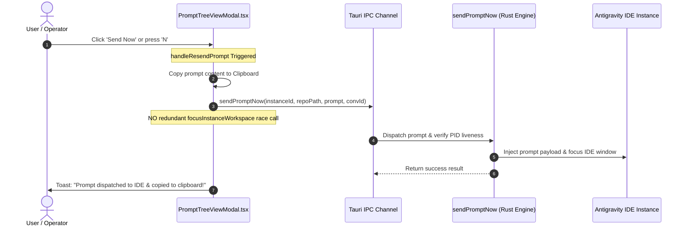

# UI & Component Specification: Task 152 - UI Tag Compaction, Ghost Running Eradication & Prompt Dispatch Hardening

- **Document Version**: `1.0.0`
- **Specification Classification**: UI/UX, Component Architecture & Headless State Synchronization Specification
- **Task Slug**: `152-ide-instance-prompt-cache-and-dispatch-fix`
- **Target Release**: `v4.173.0`
- **Maintainer / Attribution**: Strictly `@aukgit` (`(Thanks to @aukgit)`)

---

## 1. Executive Summary & Problem Classification

This specification defines the component architecture, layout refactoring, visual tag compaction, and liveness synchronization for Task 152. It targets two primary surfaces: the Prompt Tree View modal (`src/components/instances/PromptTreeViewModal.tsx`) and the Instances Dashboard (`src/pages/Instances.tsx`), with headless telemetry parity in `src-tauri/src/modules/repo_db.rs`.

### 1.1 Core Problem Statement

1. **Horizontal Sidebar Density & Badge Crowding (`PromptTreeViewModal.tsx`)**:
   - In the project sidebar, every project row currently mounts a static pill `{totalProjectPrompts} prompts` on the trailing edge. In narrow or medium viewport widths (280px–360px sidebar width), this pill consumes 70px–85px, compressing project folder names and causing premature ellipsis truncation.
   - Project action buttons (Refresh, Pin, Archive) are permanently visible on every row, adding visual noise across large workspace inventories.
   - Every conversation row mounts a static `{conv.step_count} stp` pill (both for primary turns and indented subagent turns), consuming 35px–45px of precious horizontal layout.
   - Sequence codes contain redundant square brackets and inconsistent hash prefixes across various call sites.

2. **Ghost Running Indicators & False Positive Telemetry**:
   - In `PromptTreeViewModal.tsx`, `runningCount` on project nodes counts conversations where `Boolean(c.is_running)` is true, without filtering out ghost conversations (`isGhostConversation`) or empty 0-word placeholder records. This causes project headers to show pulsing green `1 RUNNING` pills even when no genuine prompt is running.
   - In `src/pages/Instances.tsx`, `hasActiveTask` on instance cards checks `node.is_running` directly from tree nodes without verifying that the node contains at least one non-ghost, non-empty active conversation. This causes instance cards to illuminate green active prompt buttons on idle instances.
   - In `src-tauri/src/modules/repo_db.rs`, CLI and Telegram tree view renderers contain awkward square brackets around instance metadata (`[Instance: ...]`), diverging from clean dot-separator design standards.

3. **Frontend Prompt Dispatch Race Hazard (`handleResendPrompt`)**:
   - In `PromptTreeViewModal.tsx`, `handleResendPrompt` invokes `sendPromptNow` (which initiates the backend dispatch pipeline), and then concurrently invokes `focusInstanceWorkspace`. This introduces a client-side race condition that can trigger secondary process launches, window focus stealing, and OS-level window flashing.

---

## 2. Design System Alignment (`AGENTS.md`)

Per project guidelines in `AGENTS.md`, all UI components and interactions must adhere to:

- **Minimalist & Contextual UI**: Non-intrusive controls that prioritize user clarity. Secondary actions must not clutter default views. Action buttons must be hover-revealed (`opacity-0 group-hover:opacity-100 transition-opacity duration-150`) rather than permanently displayed.
- **Dark-Glass Visual Hierarchy**: Consistent surface styling (`bg-slate-100/90 dark:bg-[#0c2438]/90`, `backdrop-blur-md`, `border-slate-200 dark:border-[#15334d]`).
- **4-Tier Prompt Origin Classification**:
  - `USER_PROMPT`: Sky badge (`bg-sky-500/10 text-sky-600 dark:text-sky-400 border-sky-500/20`), User icon.
  - `SUBAGENT_INSTRUCTION`: Purple badge (`bg-purple-500/10 text-purple-600 dark:text-purple-400 border-purple-500/20`), Bot icon.
  - `SYSTEM_MESSAGE`: Zinc badge (`bg-slate-500/10 text-slate-600 dark:text-slate-400 border-slate-500/20`), Terminal icon.
  - `TOOL_OUTPUT`: Amber badge (`bg-amber-500/10 text-amber-600 dark:text-amber-400 border-amber-500/20`), Wrench icon.
- **Symmetrical Dot Separator Convention**: Symmetrical middle dots `·` (`U+00B7`) with balanced spacing (`mx-1.5` or `gap-1`) instead of square brackets or nested parentheses.
- **Headless & CLI Parity**: Tree formatting in backend services (`repo_db.rs`) must maintain typographic consistency with frontend representations.

---

## 3. UI Tag Compaction Specification (`PromptTreeViewModal.tsx`)

### 3.1 Project Row `{totalProjectPrompts} prompts` Pill Eradication

#### Problem:
In `renderProjectNode` (lines 2442–2447 of `src/components/instances/PromptTreeViewModal.tsx`), the project row renders:
```tsx
<span
    className="rounded-[5px] bg-slate-200 dark:bg-[#15334d] px-2 py-0.5 text-[10px] font-mono text-slate-600 dark:text-slate-300"
    title={`${totalProjectPrompts} total prompt(s)`}
>
    {totalProjectPrompts} prompts
</span>
```
This visible pill permanently occupies 70px–85px, compressing the repo name.

#### Specification:
1. **Remove the visible pill** entirely from the project row DOM.
2. **Expose the prompt count strictly in the project row tooltip**:
   Update the container tooltip attribute on the project row (`Line 2361`):
   ```tsx
   title={`Project: ${project.repo_name} · ${totalProjectPrompts} prompts total`}
   ```
3. **Space Recovery**: Reclaims 70px–85px of horizontal space on every project row, allowing project names to render clearly without truncation.

---

### 3.2 Hover-Only Project Action Buttons (Refresh, Pin, Archive)

#### Problem:
Currently, the Refresh, Pin, and Archive action buttons are permanently visible on every project row (lines 2403–2441). This creates a noisy toolbar appearance across all sidebar rows.

#### Specification:
1. Wrap the action buttons in a dedicated flex cluster configured with hover-only visibility:
   ```tsx
   <div className="flex items-center gap-0.5 opacity-0 group-hover:opacity-100 transition-opacity duration-150 shrink-0">
       {/* Refresh Button */}
       {/* Pin Button */}
       {/* Archive Button */}
   </div>
   ```
2. **Active State Exception**: If a project is pinned (`isPinned === true`), archived (`isArchived === true`), or actively refreshing (`refreshingProjectId === project.project_id`), the respective button remains visible or retains subtle visibility so operators can immediately see pinned/archived status without hovering.
3. **Capsule Styling**: Standardize button hitboxes to `p-1 rounded-[5px]` with subtle dark-glass hover backgrounds (`hover:bg-slate-200 dark:hover:bg-[#15334d]`).

---

### 3.3 Conversation Row `{conv.step_count} stp` Pill Eradication

#### Problem:
Every conversation node renders a static step count badge:
- In `renderConversationNode` (lines 2163–2172):
  ```tsx
  <span className={cn('text-[9px] font-mono px-1 rounded-[3px]', ...)}>
      {conv.step_count || 1} stp
  </span>
  ```
- In `renderConversationListWithGrouping` for subagent nodes (lines 2258–2267):
  ```tsx
  <span className={cn('text-[9px] font-mono px-1 rounded-[3px]', ...)}>
      {subNode.primaryNode.step_count || 1} stp
  </span>
  ```
This pill consumes 35px–45px on every conversation turn. Given that step count is already prominently displayed in the detail header (`Line 3462`, `{selectedConversation.step_count || 1} steps`) and inspector footer, rendering it on every list row is redundant.

#### Specification:
1. **Remove both `{conv.step_count} stp` pills** from the sidebar conversation row DOM.
2. **Expose step count strictly in the conversation row tooltip**:
   - Primary Conversation Node:
     ```tsx
     title={`${conv.title || 'Conversation'} · ${conv.step_count || 1} steps · Click to view`}
     ```
   - Subagent Node:
     ```tsx
     title={`AI Subagent Task · ${subNode.primaryNode.title || 'Subagent'} · ${subNode.primaryNode.step_count || 1} steps · Click to view`}
     ```
3. **Space Recovery**: Reclaims 40px on every conversation row, providing sufficient space for prompt titles and subagent branch glyphs (`↳`, `└──`).

---

### 3.4 Clean Sequence Code Formatting (Strip Square Brackets, Format `#P001`, `C001`)

#### Problem:
Sequence codes across the frontend and backend sometimes display square bracket wrappers (e.g. `[P001]`, `[C001]`, `[AGM:P001]`) or awkward double-hash patterns.

#### Specification:
1. Standardize sequence code formatting logic:
   ```typescript
   export function formatCleanSeqCode(code: string | undefined | null, prefix: 'P' | 'C' = 'C'): string {
       if (!code) return `${prefix}001`;
       const stripped = code.replace(/^(AGM:|GM:)/i, '').replace(/[\[\]]/g, '').trim();
       if (stripped.startsWith('#')) return stripped;
       if (stripped.startsWith('P') || stripped.startsWith('C')) return stripped;
       return `#${stripped}`;
   }
   ```
2. **Project Sequence Display**: Standardize to `#P001` (or `P001` in compact pills).
3. **Conversation Turn Display**: Standardize to `C001` (or `C025`) in list nodes, and `#C001` in the header breadcrumb cluster.
4. **GitMap Reference**: Move GitMap SHA / reference (`8159abcd`) strictly into native `title` tooltips (`title="GitMap SHA: 8159abcd"`), never concatenating them into the primary visible badge.

---

## 4. Ghost Running Eradication & State Synchronization

### 4.1 Project-Level `runningCount` Liveness Filtering (`PromptTreeViewModal.tsx`)

#### Root Cause:
In `renderProjectNode` (lines 2338–2339), `runningConversations` was calculated as:
```tsx
const runningConversations = project.conversations.filter((c) => Boolean(c.is_running));
const runningCount = runningConversations.length;
```
If a conversation had `c.is_running === true` in SQLite due to an ungraceful IDE termination, but was a ghost conversation (`isGhostConversation(c)`) or an empty 0-word placeholder (`c.prompt_word_count === 0 && (!c.prompt_preview_200w || !c.prompt_preview_200w.trim())`), `runningCount` became greater than 0. The project header then rendered:
```tsx
{runningCount > 0 && (
    <div className="flex items-center gap-1.5 px-2 py-0.5 rounded-full bg-emerald-500/10 border border-emerald-500/30">
        <span className="text-[9px] font-bold font-mono text-emerald-700 dark:text-[#1af18d]">
            {runningCount} RUNNING
        </span>
    </div>
)}
```
Operators saw a pulsing green `1 RUNNING` pill on the project, but expanding the project showed zero running active prompts.

#### Remediation:
Synchronize the project-level `runningCount` calculation with the strict liveness and ghost filtering used in conversation nodes:
```tsx
const runningConversations = project.conversations.filter(
    (c) => Boolean(c.is_running) &&
           !isGhostConversation(c) &&
           !(c.prompt_word_count === 0 && (!c.prompt_preview_200w || !c.prompt_preview_200w.trim()))
);
const runningCount = runningConversations.length;
```
And synchronize subagent running indicators in `renderConversationListWithGrouping`:
```tsx
const isSubRunning = Boolean(subNode.primaryNode.is_running) &&
    !isGhostConversation(subNode.primaryNode) &&
    !(subNode.primaryNode.prompt_word_count === 0 && (!subNode.primaryNode.prompt_preview_200w || !subNode.primaryNode.prompt_preview_200w.trim()));
```

---

### 4.2 Instance Card `hasActiveTask` Purification (`src/pages/Instances.tsx`)

#### Root Cause:
In `src/pages/Instances.tsx` (lines 1111–1115), `hasActiveTask` was determined solely by `node.is_running`:
```tsx
const hasActiveTask = Boolean(inst.is_running) && runningTreeNodes.some((node) => {
    const isInstanceMatch = isNodeOwnedByInstance(node, inst.config);
    const isNodeRunning = Boolean(node.is_running);
    return isInstanceMatch && isNodeRunning;
});
```
If `node.is_running` was set on a project node whose conversations were all finished, empty, or ghosts, the instance card illuminated:
- A pulsing green `Prompt` button on the card header (line 1170).
- A pulsing cyan status indicator on the card Prompt Tree action slot (line 1621).

#### Remediation:
Purify `hasActiveTask` so it requires at least one genuine, non-ghost, non-empty running conversation:
```tsx
const hasActiveTask = Boolean(inst.is_running) && runningTreeNodes.some((node) => {
    const isInstanceMatch = isNodeOwnedByInstance(node, inst.config);
    const hasGenuineRunningConv = (node.conversations || []).some((c) =>
        Boolean(c.is_running) &&
        !isGhostConversation(c) &&
        !(c.prompt_word_count === 0 && (!c.prompt_preview_200w || !c.prompt_preview_200w.trim()))
    );
    return isInstanceMatch && Boolean(node.is_running) && hasGenuineRunningConv;
});
```
This guarantees that instance cards only show active task indicators when there is an active, executing prompt.

---

### 4.3 CLI & Telegram Tree View Bracket & Typography Cleanup (`src-tauri/src/modules/repo_db.rs`)

#### Root Cause:
In `format_tree_view_cli` (lines 6421–6431) and `format_tree_view_telegram_html` (lines 6522–6532), metadata output contained literal square brackets:
```rust
// CLI output before:
"📁 #{} ({}) · {} ({}) — {} [Instance: {}{}{}]\n"

// Telegram output before:
"📁 <b>#{}</b> (<code>{}</code>) · {} <b>{}</b>\n   🖥️ <i>Instance: {}{}{}</i> · 📂 <code>{}</code>\n"
```
Literal bracket tokens clutter terminal outputs and deviate from modern CLI formatting conventions.

#### Remediation:
1. Replace square brackets in CLI line formatting with clean middle dots and parentheses:
   ```rust
   // Clean CLI formatting:
   out.push_str(&format!(
       "📁 #{} ({}) · {} ({}) — {} · Instance: {}{}{}\n",
       proj.seq_code,
       proj.gitmap_seq_code,
       label,
       proj_badge,
       proj.repo_path,
       inst_seq_str,
       proj.instance_name,
       email_str
   ));
   ```
2. Strip square brackets from sequence codes (`proj.seq_code`, `conv.seq_code`) during formatting to ensure clean `#P001` and `C001` representation.

---

## 5. Frontend Prompt Dispatch Hardening (`handleResendPrompt`)

### 5.1 Elimination of the `focusInstanceWorkspace` Race Call

#### Problem:
In `handleResendPrompt` (lines 1703–1725 of `src/components/instances/PromptTreeViewModal.tsx`):
```tsx
// 1. Dispatch prompt directly to running instance via sendPromptNow
const targetInstId = proj?.instance_id || instanceId || 'default';
try {
    await sendPromptNow(targetInstId, repoPath, promptContent, conv?.conversation_id);
} catch (sendErr) {
    console.warn('sendPromptNow error', sendErr);
}

// 2. Copy prompt content to clipboard so user can paste immediately
try {
    await navigator.clipboard.writeText(promptContent);
} catch {}

// 4. Focus IDE instance window if workspace is known (avoids secondary launch hazard)
try {
    if (repoPath) {
        const repoName = repoPath.split(/[/\\]/).filter(Boolean).pop() || repoPath;
        await focusInstanceWorkspace(targetInstId, repoPath, repoName);
    }
} catch (focusErr) {
    console.warn('focusInstanceWorkspace error', focusErr);
}
```

#### Race Hazard Analysis:
- `sendPromptNow` on the backend already initiates the smart instance resolution, verifies PID liveness, starts the target IDE workspace if needed, and brings the instance window to the foreground.
- Concurrently issuing `focusInstanceWorkspace` from the frontend creates a client/backend race condition. While `sendPromptNow` is dispatching the prompt payload, `focusInstanceWorkspace` triggers an asynchronous window enumeration and IPC focus command. This causes:
  1. Window focus collisions and focus stealing between AGM and the IDE.
  2. Operating system window flashing on Windows/macOS.
  3. Redundant process spawn attempts if the backend smart launcher is mid-transition.

#### Remediation:
Remove the redundant `focusInstanceWorkspace` invocation completely. Let `sendPromptNow` maintain exclusive responsibility for dispatch and process focus.

---

### 5.2 Toast & Clipboard User Feedback Modernization

#### Problem:
The action confirmation banner previously read:
```tsx
setActionMsg("Prompt Dispatched & Focused IDE (via Hotkey 'N' / Send Now)!");
setTimeout(() => setActionMsg(null), 3500);
```
This message is verbose, references internal hotkeys unnecessarily, and does not clearly inform the user that the prompt was also copied to their clipboard.

#### Remediation:
Update the notification message to provide clear, professional feedback:
```tsx
setActionMsg("Prompt dispatched to IDE & copied to clipboard!");
setTimeout(() => setActionMsg(null), 3000);
```

---

## 6. Architecture & Data Flow



---

## 7. Before vs. After Specification Matrix

| UI Component / Feature | Current Implementation | New Specification | Benefit & Design Standard |
| :--- | :--- | :--- | :--- |
| **Project Row Prompts Pill** | Visible `{totalProjectPrompts} prompts` pill | Removed from visible DOM; exposed in `title` tooltip | Reclaims 70px–85px width; eliminates project name truncation |
| **Project Action Buttons** | Permanently visible Refresh, Pin, Archive buttons | Hover-only (`opacity-0 group-hover:opacity-100`), except active/pinned | Clean, quiet sidebar rows; reveals controls on intent |
| **Conversation Step Pill** | Visible `{conv.step_count} stp` pill on every row | Removed from visible DOM; exposed in `title` tooltip | Reclaims 40px width; cleaner subagent branch hierarchy |
| **Sequence Code Format** | Inconsistent brackets `[P001]`, `[C001]` | Clean `#P001` and `C001` without bracket characters | Eliminates visual noise; consistent typography |
| **Project `runningCount`** | Counts all `c.is_running` without ghost/empty checks | Strict filter: `is_running && !isGhost && !isEmpty` | Eradicates ghost green running badges on idle projects |
| **Instance `hasActiveTask`** | Only checks `node.is_running` from tree node | Checks `node.is_running && hasGenuineRunningConv` | Eradicates false-positive green prompt buttons on instance cards |
| **CLI / TG Tree Formatting** | Square brackets `[Instance: ...]` | Clean middle dots `· Instance: ...` | Terminal & headless parity with design system |
| **Prompt Dispatch Call** | Dual call: `sendPromptNow` + `focusInstanceWorkspace` | Single atomic call: `sendPromptNow` only | Eliminates window flashing & launch race conditions |
| **Dispatch Toast Message** | `Prompt Dispatched & Focused IDE (via Hotkey 'N'...)` | `Prompt dispatched to IDE & copied to clipboard!` | Clear, user-friendly, professional confirmation |

---

## 8. Quality Gates & Verification Matrix

1. **Pre-flight Compilation**:
   - `npm run build` must complete with 0 TypeScript compilation errors.
   - `cd src-tauri && cargo clippy --all-targets --all-features` must pass with 0 warnings.
2. **Visual Inspection**:
   - In `PromptTreeViewModal.tsx`, open project sidebar: verify project names are legible with no `{n} prompts` visible pills.
   - Hover over project row: verify Refresh, Pin, and Archive buttons smoothly appear with `opacity-100`.
   - Verify conversation rows render without `{n} stp` pills; check native hover tooltip displays full step count.
   - Verify sequence codes render as `#P001` and `C001` without square brackets.
3. **Ghost Running Verification**:
   - Inspect a project containing only finished or empty conversations: verify the project header does NOT display `{n} RUNNING`.
   - Inspect the Instances Dashboard: verify instance cards do NOT show pulsing active prompt buttons when conversations are idle.
4. **Dispatch Verification**:
   - Select a prompt in the tree view and trigger "Send Now".
   - Verify that prompt text is copied to clipboard and dispatched to the IDE without window flickering or dual-launch errors.
   - Verify toast message displays `"Prompt dispatched to IDE & copied to clipboard!"`.
